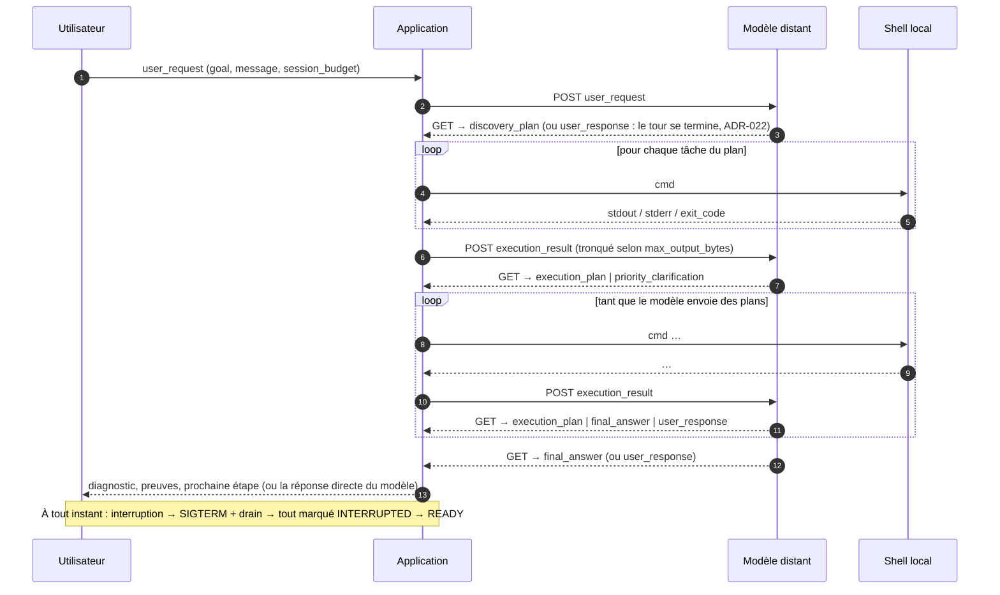
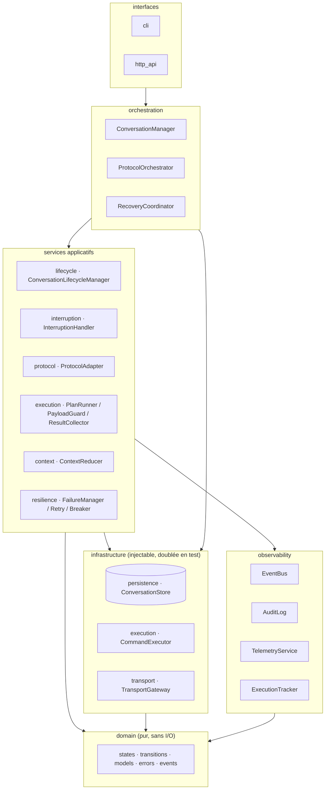

```mermaid
flowchart LR
    P1[Phase 1<br/>Machines à états] --> P3[Phase 3<br/>Persistance]
    P3 --> P2[Phase 2<br/>Protocole]
    P2 --> P4[Phase 4<br/>Exécution de tâche]
    P4 --> P5[Phase 5<br/>Exécution de plan]
    P5 --> P6[Phase 6<br/>Interruption]
    P6 --> P7[Phase 7<br/>Transport & échecs]
    P7 --> P8[Phase 8<br/>Rotation de contexte]
    P8 --> P10[Phase 10<br/>Audit & observabilité]
    P10 --> P9[Phase 9<br/>Orchestration complète]
```

# agentic-local-app

Application locale qui orchestre **un modèle distant** à travers un **protocole de messages strict** (`POST message` / `GET messages`), exécute sur la machine les commandes que le modèle planifie, et boucle jusqu'à une réponse finale — de façon **déterministe, persistée, auditable, interruptible et restart-safe**.

> Spécification de référence : [`docs/spec/SPEC-v1.1.md`](docs/spec/SPEC-v1.1.md).
> Toutes les décisions qui la précisent ou l'amendent sont tracées dans [`docs/adr`](docs/adr/README.md).

[](https://github.com/moabidi91/agentic-local-app/actions/workflows/ci.yml)

---

## 1. L'idée en une image

Le modèle est le **cerveau** : il ne voit jamais la machine, il ne reçoit que des résultats de commandes. L'application est le **bras** : elle n'interprète rien, elle exécute des plans, mesure, tronque, persiste, audite, et rend compte.


## 2. La boucle protocolaire

Le modèle doit respecter une grammaire fermée. La première réponse est un `discovery_plan` (c'est ainsi que le modèle découvre l'OS, le shell, le répertoire courant, les versions installées — l'application n'injecte rien) — ou, quand la demande n'appelle aucune commande (une explication, une analyse, une question à poser à l'utilisateur), un `user_response` ([ADR-022](docs/adr/ADR-022-reponse-utilisateur.md) ; `protocol.allow_direct_response = false` rétablit la règle stricte de la spec). Un `user_response` conclut le tour comme un `final_answer` : son corps est opaque, borné, affiché tel quel ; `expects_reply = true` signifie que le modèle attend une réponse de l'utilisateur (`agentic-app reply <sid> "…"`).

Une réponse hors de cette grammaire — enveloppe malformée, type inattendu, contenu qui viole son schéma ou une règle sémantique, ou texte que le codec ne sait même pas lire — **ne termine plus la session sur-le-champ** ([ADR-023](docs/adr/ADR-023-politique-de-correction.md)). Elle est persistée et comptée comme avant, puis l'application renvoie au modèle un `protocol_correction_request` : les erreurs de validation exactes, les types valides à cet instant, un rappel de leur forme et un exemple minimal valide — et elle relit, contre la **même** attente. Au plus `protocol.max_correction_attempts` réponses inutilisables d'affilée sont tolérées (5 par défaut) ; une correction ne consomme ni cycle ni plan, et toute réponse valide remet le compteur à zéro. Passé cette borne, la conduite d'avant reprend : rotation de conversation si la fenêtre de contexte n'est pas saine et que `context.rotate_on_unusable_reply_in_warning` est actif (défaut), sinon session `FAILED` — avec, dans les détails de l'échec, le nombre de corrections tentées. Une fenêtre déjà saturée, elle, ne corrige pas du tout et va droit à ce repli : un rappel envoyé dans un contexte plein ne peut pas recevoir de réponse.



## 3. Les garanties, et le composant qui les porte

| Garantie | Mécanisme | Composant |
|---|---|---|
| Déterminisme | Machines à états explicites, transitions persistées **avant** d'être exploitées | `ConversationLifecycleManager`, `PlanRunner` |
| Contrôle de taille | `max_output_bytes` par tâche, troncature stderr-d'abord / fin-de-stdout, `chunk_request` | `PayloadGuard` |
| Contexte borné | Rotation de conversation avec résumé structuré, ACK obligatoire, échec explicite | `ContextReducer`, `ProtocolOrchestrator` |
| Boucles bornées | Budget de session (`max_cycles`, `max_plans`, `max_total_duration_ms`) | `ProtocolOrchestrator` |
| Interruption | SIGTERM + drain, tout INTERRUPTED, READY en temps borné | `InterruptionHandler` |
| Robustesse | Taxonomie d'erreurs fermée, retries bornés, circuit breaker | `FailureManager`, `RetryController`, `CircuitBreaker` |
| Tolérance à un modèle imparfait | Réponse inutilisable citée au modèle et redemandée (`protocol_correction_request`), borne `max_correction_attempts`, puis rotation ou échec | `ProtocolAdapter`, `ProtocolOrchestrator` |
| Restart-safe | Checkpoints + politique explicite de reprise | `RecoveryCoordinator` |
| Auditabilité | Journal append-only chaîné par hash | `AuditLog` |
| Observabilité | Snapshot cohérent à tout instant | `ExecutionTracker`, `TelemetryService` |

## 4. Architecture en couches



Le détail de chaque couche et le mapping vers les modules Python est dans [`docs/architecture/09-module-map.md`](docs/architecture/09-module-map.md).

## 5. Documentation

| Dossier | Contenu |
|---|---|
| [`docs/spec/`](docs/spec/SPEC-v1.1.md) | La spécification v1.1, source de vérité |
| [`demarrage/`](demarrage/README.md) | **Lancer toute la chaîne en un double-clic** (Windows) : `lancer-web.bat` / `lancer-desktop.bat`, modes démo et réel, et le guide de configuration — modèle, jeton, ports et CORS, pause sur 401, données |
| [`docs/architecture/`](docs/architecture/00-overview.md) | Conception détaillée : composants, machines à états, protocole, exécution, persistance, transport, rotation, interruption, observabilité, module map |
| [`docs/adr/`](docs/adr/README.md) | Architecture Decision Records : chaque arbitrage pris là où la spec était ambiguë ou muette |
| [`docs/contracts/`](docs/contracts/front-backend-v1.md) | **Contrat front ↔ application** : chaque route de l'API locale avec sa requête, sa réponse et ses refus, l'enveloppe d'erreur, le flux live, et l'état des lieux méthode par méthode du front de bureau |
| [`docs/phases/`](docs/phases/README.md) | Guides d'implémentation par phase TDD (objectif, conception, plan de tests, gate) |
| [`docs/guides/`](docs/guides/README.md) | **Guides pratiques** : [prendre en main l'application](docs/guides/01-prise-en-main.md), [brancher un modèle par configuration](docs/guides/02-brancher-un-modele.md), [écrire un provider de transport](docs/guides/03-ecrire-un-provider.md), [écrire un codec de messages](docs/guides/04-ecrire-un-codec.md) |
| [`examples/`](examples/README.md) | Un provider et un codec écrits **hors de l'application** (`acme_model_plugin`), sélectionnés par chemin d'import dans [`examples/config.acme.toml`](examples/config.acme.toml), couverts par les tests |
| [`src/agentic_local_app/transport/README.md`](src/agentic_local_app/transport/README.md) | Carte du paquet transport : contrat, base HTTP, registres, codecs, invariants |
| [`docs/reports/`](docs/reports/conformance-protocole.md) | **Rapport de conformité protocolaire** : ce que fait l'application face à un modèle qui se trompe (114 cas exécutables, généré depuis `tests/conformance`) |

## 6. Démarrage rapide

```bash
# prérequis : Python >= 3.11 et uv (https://docs.astral.sh/uv/)
uv sync --extra dev          # crée .venv et installe le projet + outils de test
uv run pytest                # lance toute la suite (unit + integration)
uv run pytest -m phase1      # seulement une phase
uv run ruff check src tests  # lint
uv run mypy                  # typage strict
```

Les tests suivent la convention imposée par la spec (§18.4) : `given_<état>_when_<action>_then_<résultat>`. pytest est configuré pour collecter directement ces fonctions (`python_functions = given_*`).

## 7. Utilisation

```bash
# 1. lancer un modèle simulé (rejoue le scénario Java de la spec §12, contrat ADR-004)
uv run agentic-app mock-server --host 127.0.0.1 --port 9000
#    ou le scénario « analyse » : le modèle répond directement, sans commande (ADR-022)
uv run agentic-app mock-server --scenario-name analysis

# 2. lancer une session en console (affichage en direct, Ctrl-C = interruption propre)
uv run agentic-app run "Understand the root cause of a Java build failure" \
    --message "Please debug the Java error in my project."
#    quand le modèle pose une question (user_response avec expects_reply), lui répondre :
uv run agentic-app reply <sid> "Only the service-api module fails."

#    si le modèle refuse le jeton (401), la session est mise en pause (ADR-025) et `run` sort
#    en code 3 : fournir un jeton — jamais en argument, donc jamais dans l'historique du shell —
#    puis reprendre la session là où elle s'est arrêtée
cat jeton.txt | uv run agentic-app credentials     # ou : uv run agentic-app credentials
uv run agentic-app credentials --from-env CLAUDE_API_KEY
uv run agentic-app resume <sid>

# 3. ou exposer l'API locale (REST + flux SSE) pour un front ou un autre outil
uv run agentic-app serve --host 127.0.0.1 --port 8765
curl -X POST http://127.0.0.1:8765/api/v1/sessions \
     -H "Content-Type: application/json" \
     -d '{"goal":"…","user_message":"…"}'
#    ou, comme un écran de connexion : une session ouverte sans rien dire au modèle (ADR-028)
curl -X POST http://127.0.0.1:8765/api/v1/sessions \
     -H "Content-Type: application/json" -d '{}'       # -> 201, status READY
uv run agentic-app open --user-id alice                # la même chose en console
uv run agentic-app reply <sid> "Debug the Java error." # son premier message démarre la boucle
curl -N http://127.0.0.1:8765/api/v1/events            # flux live de tous les événements
curl http://127.0.0.1:8765/api/v1/sessions/<sid>/snapshot
curl http://127.0.0.1:8765/api/v1/sessions/<sid>/reply  # la dernière réponse : final_answer ou user_response
curl http://127.0.0.1:8765/api/v1/models                # catalogue + champs d'identifiants à afficher
curl http://127.0.0.1:8765/api/v1/skills                # notes réutilisables trouvées sous [skills] root

# 4. vérifier ou afficher la configuration effective
uv run agentic-app config validate
uv run agentic-app config show

# 5. choisir l'implémentation du transport (ADR-020) : lister les providers, voir l'effectif
uv run agentic-app transport list
uv run agentic-app transport show

# 6. choisir le codec de messages (ADR-021) : lister les codecs, voir l'effectif
uv run agentic-app codec list
uv run agentic-app codec show

# 7. le shell de cette machine et le dictionnaire entre dialectes (ADR-030)
uv run agentic-app shell show                # OS, interpréteur, dialecte, cwd, traduction on/off
uv run agentic-app shell rules                # la table complète, et ce qui n'est jamais traduit
```

**Codes de sortie de `run`** : `0` réponse finale, `1` échec ou erreur, `2` interruption (Ctrl-C), `3` session **en pause** sur une erreur d'authentification ([ADR-025](docs/adr/ADR-025-pause-sur-erreur-d-authentification.md)). Le code 3 n'est pas un échec : rien n'est perdu — la conversation, le cycle ouvert et le message en attente sont conservés —, la raison de la pause est affichée (opération refusée, code HTTP, depuis quand), et `agentic-app credentials` puis `agentic-app resume <sid>` reprennent exactement où la session s'est arrêtée. Le jeton ne se donne jamais en argument de commande : il est lu sur l'entrée standard (saisie masquée sur un terminal) ou dans la variable nommée par `--from-env`, envoyé à l'application, et il n'est ni affiché, ni journalisé, ni écrit dans un fichier.

**Ouvrir une session avant d'avoir quelque chose à dire** ([ADR-028](docs/adr/ADR-028-ouverture-de-session-sans-message.md)). `POST /sessions` prend son message d'ouverture comme une **paire facultative**. Avec `goal` et `user_message`, rien ne change : la réponse arrive en `RUNNING` et la boucle a déjà commencé. Avec **ni l'un ni l'autre**, la session est créée `READY` et attend — aucune conversation, aucun cycle, **rien n'est posté au modèle**, aucun `user_request` n'est persisté ; le premier message envoyé par `POST /sessions/{sid}/messages` ouvre sa première conversation et devient son but. Un seul des deux champs est refusé en `400 GOAL_REQUIRED` / `400 USER_MESSAGE_REQUIRED`, avant toute création. C'est la forme dont a besoin un écran de connexion, qui demande un utilisateur, un modèle, des identifiants et un dossier de travail, jamais une phrase : sans elle, une interface est obligée d'inventer un message, et le modèle reçoit une demande que personne n'a tapée.

En console, `agentic-app run "<but>"` est inchangée — elle exige un but et lance la boucle dans son propre processus. La commande `agentic-app open` est le pendant de l'écran de connexion : cliente de l'API comme `reply` ou `resume`, elle ouvre une session vide (`--user-id`, `--working-space`, `--skill`, `--effort`) et affiche la commande qui lui enverra son premier message. `POST /sessions` accepte aussi un `user_id` facultatif ; omis, la session porte **exactement ce que rend `GET /whoami`** — l'identité machine d'[ADR-024](docs/adr/ADR-024-profils-de-modele.md) §2, et non plus la constante `transport.user_id`, qui la contredisait à l'écran.

**Identifiants d'un modèle, skills et niveau d'effort** ([ADR-027](docs/adr/ADR-027-champs-d-identifiants-par-modele.md)). Un profil de modèle déclare dans `credential_fields` ce qu'une interface doit demander avant de l'appeler — un jeton, et le cas échéant un identifiant de conversation, une organisation, un espace de travail. `GET /models` rend ces champs (`key`, `label`, `placeholder`, `secret`) sans jamais nommer la variable d'environnement derrière, et `POST /credentials` reçoit `{"credentials": {"<clé>": "<valeur>"}}` (l'ancien `{"token": …}` reste accepté comme raccourci du champ implicite `access_token`). Un profil qui ne déclare rien se comporte comme s'il déclarait ce seul champ implicite, construit sur `token_env`. `GET /skills` liste les fichiers `*.md` trouvés sous `[skills] root` (jamais d'erreur : racine absente ou illisible = liste vide). **`skills` et `effort`, acceptés à la création d'une session, sont journalisés dans l'événement `session.created` et rien d'autre** : aucun fichier n'est lu, aucune consigne n'en est tirée, et le modèle reçoit exactement ce qu'il recevait avant. Les transmettre au modèle demande sa propre décision, donc un ADR.

**L'échec d'un outil est un verdict, pas une panne** ([ADR-029](docs/adr/ADR-029-echec-d-outil-comme-verdict.md)). Quand le modèle planifie `mvn clean install` et que le projet ne compile pas, Maven sort en 1 : c'est **le résultat que la boucle existe pour produire**. Trois choses en découlent. La **troncature garantit une part à chaque flux** — chacun garde au moins la moitié du budget, la part inutilisée allant à l'autre — parce que la règle précédente (stderr d'abord, jusqu'à tout le budget) supprimait en silence les `[ERROR]` et le `BUILD FAILURE` que les outils JVM écrivent sur **stdout**, pendant que stderr se remplissait d'avertissements de la JVM. Le **plan continue** quand un programme de `[execution] verdict_programs` (Maven, Gradle et leurs wrappers, npm/yarn/pnpm, tsc, cargo, dotnet, go, make, pytest, tox, ruff, mypy, eslint… liste entièrement configurable) a **bien tourné** et rend un code non nul : le plan de diagnostic *compiler · lire le fichier fautif · vérifier le JDK* rend ses trois résultats au lieu d'un code de sortie. `critical: true` ou `stop_plan_on_failure: true` arrêtent quand même le plan — une consigne explicite du modèle l'emporte toujours sur un défaut implicite — et un échec de lancement ou un dépassement de délai, qui n'ont rien répondu, l'arrêtent comme avant. Enfin le **résultat le dit** : `execution` vaut `ran`, `not_started`, `timed_out` ou `stopped`, et `failure_is_verdict: true` marque le code non nul d'un outil reconnu. Un plan déclare aussi `default_continue_on_error` une fois au lieu de le répéter en double négation sur chaque tâche.

**Le shell de la machine : détecté, annoncé, et un dictionnaire entre dialectes** ([ADR-030](docs/adr/ADR-030-shell-detecte-et-traduction-de-dialectes.md), qui **amende** [ADR-003](docs/adr/ADR-003-plateformes-cibles.md) §3). Le modèle écrivait ses commandes à l'aveugle : le premier plan d'une conversation est envoyé avant toute découverte, donc `uname -a && echo $SHELL` partait vers PowerShell et le tour suivant servait à réparer le précédent. Quatre corrections, de la plus profonde à la plus visible. **L'application sait maintenant quel shell elle lance** : `bash`, `zsh`, `sh` hors Windows, `pwsh` puis `powershell` sur Windows, un interpréteur épinglé dans `[execution] shell` étant pris tel quel — la réponse est un objet (programme, dialecte `posix` / `powershell` / `cmd` / `unknown`, origine de la décision), la sonde est injectée, la détection ne lève jamais et n'exécute jamais rien ; `agentic-app shell show` l'imprime. **Le code de sortie ne ment plus sur Windows** : `powershell -Command` ramenait à 0 ou 1 le code de n'importe quel programme natif — une curiosité documentée depuis l'origine, devenue un défaut de correction le jour où ADR-029 a fait du code de sortie un verdict ; le script reçoit maintenant un épilogue `exit $LASTEXITCODE` et voyage encodé en Base64 d'UTF-16LE (`-EncodedCommand`), la seule forme où guillemets, `$`, accents graves, points-virgules et sauts de ligne traversent intacts. **L'environnement est annoncé** au modèle dans les instructions, à côté des limites d'octets et de délais : système d'exploitation, dialecte du shell, répertoire de travail — trois faits, pas un de plus, le `discovery_plan` restant la façon d'apprendre tout le reste. Et **un dictionnaire fermé traduit entre dialectes** quand la commande et le shell ne s'accordent pas : seize règles, **toutes en lecture seule** (`ls`, `cat`, `head`, `tail`, `pwd`, `echo`, `which`, `env`, `$NAME` / `$env:NAME`), jamais rien qui crée, déplace ou supprime. Ce qu'il ne sait pas traduire exactement — un tube, une redirection, `&&`, un joker, `grep`, `rm`, `test` — passe **tel quel**, et le résultat dit pourquoi, pour que le modèle se corrige lui-même. Rien n'est jamais silencieux : la commande réellement exécutée et les règles qui ont joué entrent dans le **journal d'audit chaîné par hachage** — la trace durable, sans une colonne de plus ni une migration —, et le modèle reçoit les deux formes dans le champ `translation` du résultat, redérivé de la commande comme `execution` et `failure_is_verdict`. `agentic-app shell rules` imprime la table entière ; `[execution] translate_commands = false` éteint le mécanisme.

Tout ce qui est externe ou paramétrable se règle **une seule fois** dans [`config.toml`](config.toml) (endpoints du modèle, jeton via variable d'environnement, identifiant utilisateur, timeouts, drains, limites de payload, réponse directe du modèle et politique de correction (`[protocol]` : `allow_direct_response`, `max_correction_attempts`), budgets, seuils de contexte, API). Pour brancher un vrai modèle : renseigner `[transport]` (`init_url`, `post_url`, `get_url`, `user_id`) et exporter le jeton dans la variable nommée par `token_env`. Le contrat attendu de l'endpoint est décrit dans [ADR-004](docs/adr/ADR-004-contrat-de-transport.md) ; le serveur mock en est l'implémentation de référence. Le pas-à-pas complet — les quatre requêtes, l'arbre de décision provider / codec, la vérification, le dépannage par code d'erreur — est le [guide 02](docs/guides/02-brancher-un-modele.md) ; la prise en main de l'application (installation, configuration, première session, API et flux live) est le [guide 01](docs/guides/01-prise-en-main.md).

**Choisir un provider de transport.** Le contrat `TransportGateway` est unique, mais son implémentation se choisit **par configuration** avec `transport.provider` ([ADR-020](docs/adr/ADR-020-transport-enfichable.md)) :

| `transport.provider` | Quand | Configuration |
|---|---|---|
| `generic_http` (défaut) | le modèle expose le contrat ADR-004 (le serveur mock, ou un adaptateur qui le respecte) | `init_url`, `post_url`, `get_url`, `close_url` + `close_method` (`POST` / `DELETE`), `token_env`, `user_id` |
| `templated_http` | le modèle expose une API HTTP quelconque | `[transport.options]` : pour chaque opération `init` / `post` / `get` / `close`, la méthode, l'URL, les en-têtes et le corps sous forme de gabarits (`{conversation_id}`, `{after}`, `{instructions}`, `{user_id}`, `{metadata_json}`, `{message_json}`, `{message_id}`, `{message_type}`, `{token}`, `${env:VAR}` résolu à l'appel) et les chemins de lecture des réponses (`conversation_id_path = "data.id"`, `messages_path = "items"`, `cursor_path`…) ; exemple complet commenté dans `config.toml` |
| `fake` | un lancement sans aucun réseau (démonstration, tests d'interface) | aucune |
| `paquet.module:Classe` ou un entry point `agentic_local_app.transports` | un provider écrit en dehors du dépôt (dérivant de `HttpProviderBase` ou directement de `TransportGateway`) | ses propres options, validées par son `options_model` |

```toml
[transport]
provider = "templated_http"
[transport.options]
headers = { "X-Api-Key" = "${env:MY_MODEL_KEY}" }
[transport.options.init]
url = "https://api.example.com/v1/threads"
body = { instructions = "{instructions}", user = "{user_id}", meta = "{metadata_json}" }
conversation_id_path = "data.id"
[transport.options.post]
url = "https://api.example.com/v1/threads/{conversation_id}/messages"
body = { role = "user", content = "{message_json}" }
[transport.options.get]
url = "https://api.example.com/v1/threads/{conversation_id}/messages?since={after}"
messages_path = "items"
```

`agentic-app transport show` affiche le provider effectif, sa classe et ses options avec les secrets masqués ; un provider inconnu ou des options invalides sont refusés au démarrage avec un message explicite.

**Choisir un codec.** Le provider parle l'API ; le **codec** parle le modèle ([ADR-021](docs/adr/ADR-021-codec-de-messages-par-modele.md)). Un modèle réel ne rend pas ses réponses sous forme d'enveloppes protocolaires : il rend du texte où le JSON du message est entouré de prose ou de clôtures ```` ```json ````, un objet *chat completion*, ou un appel d'outil. `transport.codec` désigne la conversion appliquée autour du transport, dans les deux sens, sans rien changer à l'orchestration :

| `transport.codec` | Quand | `[transport.codec_options]` |
|---|---|---|
| `passthrough` (défaut) | le transport rend déjà des enveloppes (contrat ADR-004, ou `templated_http` avec `message_path`) | aucune ; le transport n'est pas enveloppé |
| `json_text` | le modèle répond par du texte contenant le JSON du message | `content_path` (le texte dans un objet, ex. `choices[0].message.content` ; absent = chaînes nues), `strip_code_fences`, `extract_first_json_object`, `id_path` (`message_id` s'il manque), `conversation_id_fallback`, `outbound = "object"` ou `"text"` (le message part en JSON canonique) |
| `tool_call` | le modèle répond par un appel d'outil dont les arguments sont le message | `arguments_path`, `name_path` + `tool_name`, `id_path`, `conversation_id_fallback`, `outbound` |
| `paquet.module:Classe` ou un entry point `agentic_local_app.codecs` | un codec écrit en dehors du dépôt (classe concrète de `MessageCodec`) | ses propres options, validées par son `options_model` |

```toml
[transport]
provider = "templated_http"
codec = "json_text"
[transport.codec_options]
content_path = "choices[0].message.content"
outbound = "text"
[transport.options.post]
url = "https://api.example.com/v1/threads/{conversation_id}/chat/completions"
body = { messages = [{ role = "user", content = "{message_json}" }] }   # content reçoit le texte
```

Une réponse que le codec ne sait pas lire (pas de JSON, JSON invalide, chemin absent) est une `MODEL_PROTOCOL_ERROR / UNPARSEABLE_REPLY`, jamais rejouée, dont le `FailureRecord` garde un extrait de la forme brute (`excerpt`) et la raison ; elle est persistée comme message entrant invalide et suit la politique de correction du §2 avant tout échec (ADR-023). `agentic-app codec show` affiche le codec effectif et ses options. L'exemple complet (init, post, get, options du codec) est commenté dans `config.toml`.

Les routes de l'API sont listées dans [docs/phases/phase-09-interfaces.md](docs/phases/phase-09-interfaces.md) et [ADR-018](docs/adr/ADR-018-api-pour-un-front-et-flux-live.md).

## 8. Feuille de route (ordre imposé par la spec §20)



Chaque phase a une **gate** : sa suite de tests doit être entièrement verte avant d'ouvrir la suivante. L'état d'avancement est tenu dans [`docs/phases/README.md`](docs/phases/README.md). **État : les 10 phases sont livrées et vertes** (2 450 tests, couverture 97 %, Python 3.11/3.12, Linux + Windows).

## 9. Périmètre de la v1 — à lire avant de lancer l'application sur une vraie machine

Le modèle est un **orchestrateur de confiance** : les commandes sont exécutées **telles quelles**, sans sandbox ni contrôle de périmètre (spec §1). L'application est donc, de fait, un shell distant piloté par le modèle. Le sandboxing est explicitement reporté à une version ultérieure.
