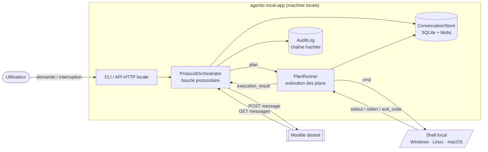
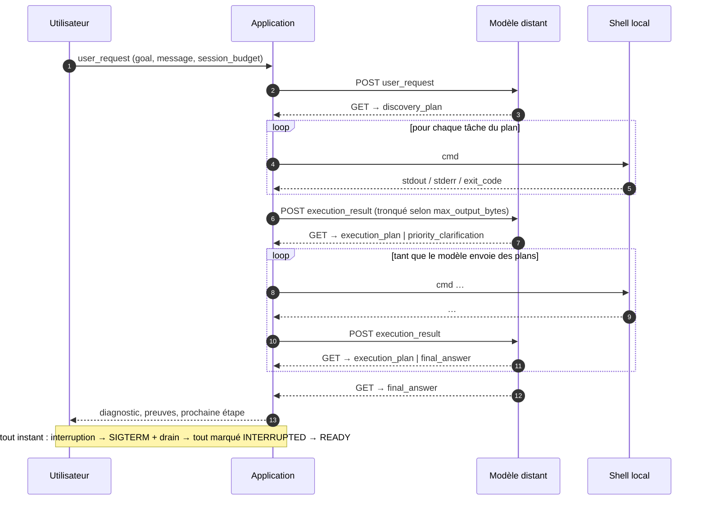
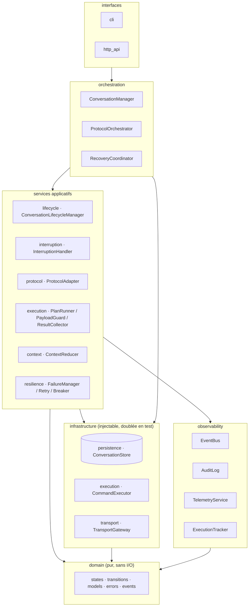

# agentic-local-app

Application locale qui orchestre **un modèle distant** à travers un **protocole de messages strict** (`POST message` / `GET messages`), exécute sur la machine les commandes que le modèle planifie, et boucle jusqu'à une réponse finale — de façon **déterministe, persistée, auditable, interruptible et restart-safe**.

> Spécification de référence : [`docs/spec/SPEC-v1.1.md`](docs/spec/SPEC-v1.1.md).
> Toutes les décisions qui la précisent ou l'amendent sont tracées dans [`docs/adr`](docs/adr/README.md).

[](https://github.com/moabidi91/agentic-local-app/actions/workflows/ci.yml)

---

## 1. L'idée en une image

Le modèle est le **cerveau** : il ne voit jamais la machine, il ne reçoit que des résultats de commandes. L'application est le **bras** : elle n'interprète rien, elle exécute des plans, mesure, tronque, persiste, audite, et rend compte.



## 2. La boucle protocolaire

Le modèle doit respecter une grammaire fermée. La première réponse est **toujours** un `discovery_plan` (c'est ainsi que le modèle découvre l'OS, le shell, le répertoire courant, les versions installées — l'application n'injecte rien).



## 3. Les garanties, et le composant qui les porte

| Garantie | Mécanisme | Composant |
|---|---|---|
| Déterminisme | Machines à états explicites, transitions persistées **avant** d'être exploitées | `ConversationLifecycleManager`, `PlanRunner` |
| Contrôle de taille | `max_output_bytes` par tâche, troncature stderr-d'abord / fin-de-stdout, `chunk_request` | `PayloadGuard` |
| Contexte borné | Rotation de conversation avec résumé structuré, ACK obligatoire, échec explicite | `ContextReducer`, `ProtocolOrchestrator` |
| Boucles bornées | Budget de session (`max_cycles`, `max_plans`, `max_total_duration_ms`) | `ProtocolOrchestrator` |
| Interruption | SIGTERM + drain, tout INTERRUPTED, READY en temps borné | `InterruptionHandler` |
| Robustesse | Taxonomie d'erreurs fermée, retries bornés, circuit breaker | `FailureManager`, `RetryController`, `CircuitBreaker` |
| Restart-safe | Checkpoints + politique explicite de reprise | `RecoveryCoordinator` |
| Auditabilité | Journal append-only chaîné par hash | `AuditLog` |
| Observabilité | Snapshot cohérent à tout instant | `ExecutionTracker`, `TelemetryService` |

## 4. Architecture en couches



Le détail de chaque couche et le mapping vers les modules Python est dans [`docs/architecture/09-module-map.md`](docs/architecture/09-module-map.md).

## 5. Documentation

| Dossier | Contenu |
|---|---|
| [`docs/spec/`](docs/spec/SPEC-v1.1.md) | La spécification v1.1, source de vérité |
| [`docs/architecture/`](docs/architecture/00-overview.md) | Conception détaillée : composants, machines à états, protocole, exécution, persistance, transport, rotation, interruption, observabilité, module map |
| [`docs/adr/`](docs/adr/README.md) | Architecture Decision Records : chaque arbitrage pris là où la spec était ambiguë ou muette |
| [`docs/phases/`](docs/phases/README.md) | Guides d'implémentation par phase TDD (objectif, conception, plan de tests, gate) |

## 6. Démarrage rapide

```bash
# prérequis : Python >= 3.11 et uv (https://docs.astral.sh/uv/)
uv sync --extra dev          # crée .venv et installe le projet + outils de test
uv run pytest                # lance toute la suite (unit + integration)
uv run pytest -m phase1      # seulement une phase
uv run ruff check src tests  # lint
uv run mypy                  # typage strict
```

Les tests suivent la convention imposée par la spec (§18.4) : `given_<état>_when_<action>_then_<résultat>`. pytest est configuré pour collecter directement ces fonctions (`python_functions = given_*`).

## 7. Feuille de route (ordre imposé par la spec §20)

```mermaid
flowchart LR
    P1[Phase 1<br/>Machines à états] --> P3[Phase 3<br/>Persistance]
    P3 --> P2[Phase 2<br/>Protocole]
    P2 --> P4[Phase 4<br/>Exécution de tâche]
    P4 --> P5[Phase 5<br/>Exécution de plan]
    P5 --> P6[Phase 6<br/>Interruption]
    P6 --> P7[Phase 7<br/>Transport & échecs]
    P7 --> P8[Phase 8<br/>Rotation de contexte]
    P8 --> P10[Phase 10<br/>Audit & observabilité]
    P10 --> P9[Phase 9<br/>Orchestration complète]
```



Chaque phase a une **gate** : sa suite de tests doit être entièrement verte avant d'ouvrir la suivante. L'état d'avancement est tenu dans [`docs/phases/README.md`](docs/phases/README.md).

## 8. Périmètre de la v1 — à lire avant de lancer l'application sur une vraie machine

Le modèle est un **orchestrateur de confiance** : les commandes sont exécutées **telles quelles**, sans sandbox ni contrôle de périmètre (spec §1). L'application est donc, de fait, un shell distant piloté par le modèle. Le sandboxing est explicitement reporté à une version ultérieure.
