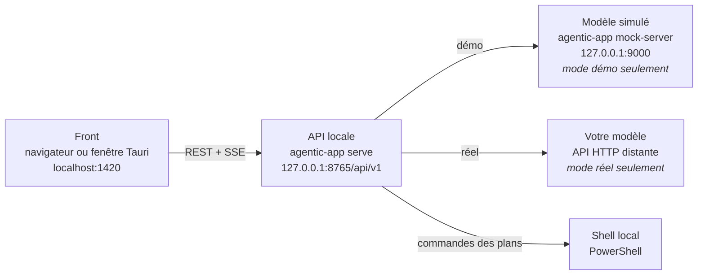

# Démarrage — lancer toute la chaîne en un double-clic

Ce dossier contient les deux scripts qui démarrent **l'application complète** sur un poste Windows : le backend (`agentic-local-app`), le front (`agentic-front`) et, en mode démo, un modèle simulé. Un double-clic, rien d'autre à taper.

| Fichier | Ce qu'il fait |
|---|---|
| **[`lancer-web.bat`](lancer-web.bat)** | démarre tout et ouvre le front **dans le navigateur** |
| **[`lancer-desktop.bat`](lancer-desktop.bat)** | démarre tout et ouvre le front **dans la fenêtre native** (Tauri) |
| [`config-demo.toml`](config-demo.toml) | la configuration du mode démo : transport branché sur le modèle simulé, aucun jeton, base de données séparée |

> **`start-local.bat`, dans le dépôt du front, ne lance que le front.** Il ne démarre ni l'API locale ni aucun modèle, et il ne renseigne pas `VITE_API_BASE_URL` : l'application retombe alors sur sa maquette en mémoire (`MockApiClient`) et ne parle à rien. C'est pratique pour travailler sur les écrans, ce n'est pas la façon de faire tourner la vraie chaîne. Pour cela, ce sont les deux scripts ci-dessus.

## 1. Les deux modes

Les deux scripts acceptent un premier argument facultatif : `demo` (le défaut) ou `reel`.

```bat
lancer-web.bat            REM  = lancer-web.bat demo
lancer-web.bat demo       REM  modèle simulé, aucun identifiant, aucun appel sortant
lancer-web.bat reel       REM  votre modèle, tel que config.toml le décrit
lancer-desktop.bat reel   REM  idem, dans la fenêtre native
```

En pratique, on double-clique sur le script (mode démo) ; pour le mode réel, on crée un raccourci vers le `.bat` et on ajoute ` reel` à la fin de la cible, ou on l'appelle depuis une invite de commandes.

**Mode `demo` — trois processus.** Le modèle simulé (`agentic-app mock-server`) joue un scénario écrit d'avance, exactement au format du contrat de transport ([ADR-004](../docs/adr/ADR-004-contrat-de-transport.md)). L'API locale tourne contre `config-demo.toml`, qui la fait pointer sur ce modèle simulé. Le front s'y branche. Rien ne sort du poste, aucun jeton n'est demandé, aucun euro n'est dépensé : c'est le mode pour montrer l'application.

**Mode `reel` — deux processus.** Aucun modèle n'est lancé : l'API locale utilise le `config.toml` à la racine du dépôt, donc le modèle que vous y avez configuré (section 4). Le front s'y branche de la même façon.



Le front ne voit **jamais** le modèle : il ne parle qu'à l'API locale. C'est l'API qui tient la conversation avec le modèle, exécute les commandes qu'il demande et lui renvoie les résultats.

## 2. Ce que chaque script fait, dans l'ordre

1. **Trouver le dépôt backend** à partir de l'emplacement du script (`%~dp0..`), jamais à partir du dossier courant : le double-clic fonctionne quel que soit l'endroit d'où Windows le lance.
2. **Trouver le dépôt front** : la variable d'environnement `AGENTIC_FRONT_DIR` si elle est définie, sinon le dossier voisin `..\agentic-front` (section 3).
3. **Vérifier les prérequis** et afficher les versions détectées (section 3). Chaque manque est nommé avec le lien d'installation.
4. **Installer les dépendances du front** (`npm install`) **seulement** si `node_modules` n'existe pas, comme le fait `start-local.bat`.
5. **Mode démo :** démarrer le modèle simulé dans sa propre fenêtre, puis attendre qu'il réponde.
6. **Démarrer l'API locale** dans sa propre fenêtre, puis attendre qu'elle réponde vraiment : le script interroge `GET /api/v1/health` — la route la moins coûteuse et toujours disponible — jusqu'à 40 fois toutes les 500 ms. Tant qu'elle n'a pas répondu, le front n'est pas lancé.
7. **Démarrer le front** avec `VITE_API_BASE_URL` pointant sur l'API. `lancer-web.bat` démarre le serveur Vite puis ouvre le navigateur dessus ; `lancer-desktop.bat` lance `npm run tauri dev`, qui démarre lui-même ce serveur Vite et charge sa fenêtre native dessus.
8. **Afficher un récapitulatif** : quelles fenêtres sont ouvertes, ce que chacune est, et comment tout arrêter.

À chaque étape, un échec **arrête tout** : le script dit ce qui a manqué, referme ce qu'il avait déjà démarré, et laisse la fenêtre ouverte (`pause`) pour que le message soit lisible. Rien n'est laissé en marche derrière lui.

## 3. Prérequis et disposition des dossiers

### Les outils

| Outil | Nécessaire pour | Où l'installer |
|---|---|---|
| **uv** (recommandé) | le backend — il installe Python ≥ 3.11 et les dépendances tout seul | https://docs.astral.sh/uv/getting-started/installation/ |
| Python ≥ 3.11 | alternative à uv, si vous préférez gérer l'environnement à la main | https://www.python.org/downloads/ |
| **Node.js** (18 ou plus récent, testé en v22) | le front, dans les deux scripts | https://nodejs.org/ |
| **Rust + Cargo** | `lancer-desktop.bat` uniquement : la fenêtre native est compilée | https://rustup.rs/ |
| **Visual Studio Build Tools**, charge de travail « Développement Desktop en C++ » | `lancer-desktop.bat` uniquement : c'est le compilateur C++ dont Rust se sert sous Windows | https://visualstudio.microsoft.com/visual-cpp-build-tools/ |
| **WebView2 Runtime** | `lancer-desktop.bat` uniquement : c'est lui qui affiche la page dans la fenêtre | déjà présent sur la plupart des Windows 10/11 à jour — sinon https://developer.microsoft.com/microsoft-edge/webview2/ |

Pour le backend, les scripts regardent d'abord s'il existe un environnement `.venv` dans le dépôt (`.venv\Scripts\agentic-app.exe`) et s'en servent directement ; sinon ils passent par `uv run agentic-app`, qui crée et synchronise l'environnement au premier lancement. Si ni l'un ni l'autre n'est disponible, le script s'arrête en donnant les deux liens.

`lancer-desktop.bat` détecte l'absence de Rust avant d'avoir rien démarré et propose alors de basculer en mode navigateur (`O`) ou de quitter pour installer Rust d'abord (`N`) — exactement comme `start-local.bat`.

### Les dossiers

Les deux dépôts sont attendus côte à côte :

```
C:\dev\
├── agentic-local-app\      <- le backend (ce dépôt)
│   ├── config.toml         <- la configuration du poste (mode réel)
│   ├── demarrage\
│   │   ├── lancer-web.bat
│   │   ├── lancer-desktop.bat
│   │   └── config-demo.toml
│   └── ...
└── agentic-front\          <- le front
    ├── package.json
    └── ...
```

Si le front est ailleurs, définissez `AGENTIC_FRONT_DIR` une fois pour toutes, dans une invite de commandes :

```bat
setx AGENTIC_FRONT_DIR "D:\autre\chemin\agentic-front"
```

`setx` écrit la variable pour de bon (les fenêtres **déjà ouvertes** ne la voient pas : rouvrez-en une). Les scripts la préfèrent au dossier voisin dès qu'elle est définie, et si ni l'une ni l'autre ne mène à un dossier contenant un `package.json`, ils s'arrêtent en rappelant cette commande.

## 4. Configurer un vrai modèle

Tout se passe dans **`config.toml`, à la racine du dépôt** — c'est le fichier que le mode `reel` utilise. `demarrage/config-demo.toml` ne sert qu'à la démo et n'a pas à être modifié.

### La section `[transport]`

C'est elle qui décrit le modèle. Quatre décisions :

| Clé | Ce qu'elle décide |
|---|---|
| `provider` | **comment** on parle au modèle : `generic_http` si son API respecte le contrat [ADR-004](../docs/adr/ADR-004-contrat-de-transport.md) (c'est le cas du modèle simulé), `templated_http` pour n'importe quelle autre API HTTP — méthode, URL, en-têtes et corps de chaque opération sont alors décrits dans `[transport.options]` |
| `codec` | **sous quelle forme** le modèle répond : `passthrough` s'il rend déjà des enveloppes protocolaires, `json_text` s'il répond par du texte contenant le JSON du message (le cas d'une API de type *chat completions*), `tool_call` s'il répond par un appel d'outil |
| les URL | `init_url`, `post_url`, `get_url`, `close_url` — les quatre opérations vers le modèle. `post_url` et `get_url` doivent contenir `{conversation_id}`, et `get_url` aussi `{after}` |
| `token_env` | le **nom de la variable d'environnement** où le jeton est lu |

`config.toml` contient déjà, en commentaires, un exemple complet et annoté pour `templated_http` et pour `json_text` : le plus simple est de partir de là. Le [guide 02 — brancher un modèle par configuration](../docs/guides/02-brancher-un-modele.md) déroule le même sujet pas à pas.

Une fois la section écrite, vérifiez-la sans rien lancer :

```bat
uv run agentic-app config validate
uv run agentic-app transport show
uv run agentic-app codec show
```

### Le jeton n'est jamais écrit dans le fichier

`token_env` ne porte **pas** le jeton : il porte le *nom de la variable d'environnement* qui le contient. Le transport la relit à chaque appel.

```toml
[transport]
token_env = "AGENTIC_TRANSPORT_TOKEN"   # le nom, pas la valeur
```

Trois façons de renseigner la valeur, au choix :

- **par le front**, c'est le plus simple : l'écran de connexion affiche un champ par identifiant déclaré, et l'envoie en `POST /credentials` ; la valeur est écrite dans la variable et n'est jamais renvoyée, journalisée ni conservée par le front ;
- **un fichier `.env`** à la racine du dépôt (`AGENTIC_TRANSPORT_TOKEN=sk-...`), chargé au démarrage sans écraser ce qui est déjà défini. Il est ignoré par git (`.gitignore` couvre `.env*`) ;
- **une variable Windows** : `setx AGENTIC_TRANSPORT_TOKEN "sk-..."` puis rouvrir la fenêtre.

Aucune route de l'API ne renvoie de secret : `GET /config` masque le jeton, `GET /models` ne montre ni URL ni option de provider, et `POST /credentials` ne réémet jamais ce qu'on lui a posté.

### Quand le modèle demande plus qu'un jeton

Certains modèles réclament autre chose en plus : un identifiant d'organisation, un espace de travail, un identifiant de conversation. `credential_fields` énumère alors **ce que l'interface doit demander**, un bloc par champ :

```toml
[transport]
provider  = "templated_http"
codec     = "json_text"
token_env = "MON_MODELE_CLE"

[[transport.credential_fields]]
key         = "access_token"        # l'identifiant renvoyé par le front dans POST /credentials
label       = "Jeton d'accès"       # le libellé affiché au-dessus du champ
placeholder = "Coller un jeton"
env         = "MON_MODELE_CLE"      # la variable où la valeur est écrite

[[transport.credential_fields]]
key    = "workspace_id"
label  = "Espace de travail"
secret = false                      # valeur publique : le front a le droit de la retenir
env    = "MON_MODELE_WORKSPACE"
```

Sans `credential_fields`, le profil se comporte comme s'il déclarait exactement un champ `access_token` construit depuis `token_env` — et aucun champ du tout si `token_env` est vide, ce qui est le cas de la démo. Une liste explicitement vide (`credential_fields = []`) dit « ce modèle n'a besoin de rien » : le front n'affiche alors aucun formulaire. `secret` vaut `true` par défaut, et une valeur secrète n'est jamais retenue d'un lancement à l'autre.

Le front lit tout cela dans `GET /models` : `requires_credentials` y vaut vrai dès qu'un champ déclaré n'a pas de valeur dans l'environnement **maintenant**. Le nom de la variable, lui, ne traverse jamais cette route.

### Plusieurs modèles, un seul actif

`[models]` déclare des profils nommés, chacun complet (toutes les clés de `[transport]` y sont valides), et `active` nomme celui avec lequel le processus tourne :

```toml
[models]
active = "mon-modele"             # le modèle de CE lancement

[models.mock]                     # le modèle simulé, aucun jeton
provider = "generic_http"
codec = "passthrough"
init_url = "http://127.0.0.1:9000/v1/conversations"
display_name = "Modèle simulé"

[models.mon-modele]               # une API de type chat completions
provider = "templated_http"
codec = "json_text"
token_env = "MON_MODELE_CLE"
display_name = "Mon modèle"
```

Un profil **n'hérite de rien** : il part des valeurs par défaut, pas de celles de `[transport]`. Sans section `[models]`, `[transport]` est le profil implicite nommé `default`, et c'est lui qui est actif : une configuration existante n'a rien à changer.

**Le modèle est choisi une fois, au démarrage.** En changer veut dire relancer l'application avec un autre `active` — soit en modifiant la ligne, soit en posant `AGENTIC__MODELS__ACTIVE=mon-modele` avant le lancement. Jamais en cours de session. Le sélecteur de modèle du front est donc un **affichage** : il liste le catalogue avec le profil actif en tête, et montre les autres désactivés, avec la raison écrite.

Toutes les clés de `config.toml` acceptent d'ailleurs cette surcharge par variable d'environnement, sous la forme `AGENTIC__<SECTION>__<CLE>` (deux tirets bas), par exemple `AGENTIC__API__PORT=9100`.

## 5. Les ports, et pourquoi celui du front n'est pas libre

| Port | Qui écoute | Réglé où |
|---|---|---|
| **8765** | l'API locale (`http://127.0.0.1:8765/api/v1`) | `[api] host` / `port` de `config.toml` |
| **1420** | le serveur de développement du front | `vite.config.ts` du front (`strictPort`) et `devUrl` de `src-tauri/tauri.conf.json` |
| **9000** | le modèle simulé, en mode démo seulement | argument `--port` de `agentic-app mock-server`, et les URL de `config-demo.toml` |

Le port du front **n'est pas libre** parce qu'un navigateur applique la politique des origines croisées : la page vient de `http://localhost:1420`, elle appelle `http://127.0.0.1:8765` — ce sont deux origines différentes, et le navigateur n'autorise l'appel que si le serveur répond qu'il accepte cette origine-là. C'est le rôle de `[api] cors_origins`. Les valeurs livrées par défaut sont :

```toml
[api]
cors_origins = [
    "http://localhost:1420",   # le serveur Vite, épinglé sur 1420
    "http://127.0.0.1:1420",   # la même chose écrite autrement : ce n'est PAS la même origine
    "http://localhost:3000",
    "http://localhost:5173",
    "http://127.0.0.1:5173",
    "tauri://localhost",       # la fenêtre native
]
```

Les deux orthographes de la boucle locale, `localhost` et `127.0.0.1`, sont deux origines distinctes pour un navigateur : il faut les deux à chaque fois. C'est pourquoi les scripts imposent `--port 1420 --strictPort` au serveur Vite : `strictPort` fait échouer le démarrage si 1420 est déjà pris, plutôt que de glisser sur 1421 — un port qui, lui, n'est dans aucune liste, et sur lequel le front se ferait refuser tous ses appels. (Le `start-local.bat` du front, lui, ouvre le port 5183, qui n'est dans aucune liste non plus : encore une raison de ne pas s'en servir pour la vraie chaîne.)

`config-demo.toml` ne garde, lui, que les trois origines dont les scripts se servent réellement — `http://localhost:1420`, `http://127.0.0.1:1420` et `tauri://localhost` — parce qu'une démonstration n'a pas à ouvrir plus que ce qu'elle utilise.

Si vous changez le port de l'API (`[api] port`), ajustez aussi `API_BASE` en tête des deux `.bat`. Si vous changez le port du front, ajoutez sa nouvelle origine — **sous les deux orthographes** — à `cors_origins`.

## 6. Quand le modèle refuse le jeton : la pause

Un modèle qui répond **401** ne fait pas échouer la session : il la met en **pause**. Rien n'est perdu — ni la conversation, ni les cycles, ni les plans déjà consommés.

Ce que vous voyez dans le front : un bandeau qui dit quelle opération a été refusée, avec quel code et depuis quand, et la fenêtre d'identifiants qui s'ouvre avec les champs que le modèle déclare (`credential_fields`, section 4). Ce que vous faites : saisir le bon jeton et renvoyer. Le bouton d'envoi devient le geste de reprise ; la conversation repart exactement là où elle s'était arrêtée, dans la même conversation. Un jeton encore invalide remet simplement en pause, autant de fois qu'il le faut.

À la ligne de commande, le même parcours s'écrit :

```bat
REM  le jeton n'est jamais passe en argument : il se lit sur l'entree standard
REM  ou dans une variable d'environnement, pour ne pas finir dans l'historique
REM  du shell ni dans la liste des processus
type jeton.txt | uv run agentic-app credentials
uv run agentic-app credentials --from-env AGENTIC_TRANSPORT_TOKEN
uv run agentic-app resume <session_id>
```

Cette commande-là ne remplit que le champ implicite `access_token` ; un profil qui déclare plusieurs `credential_fields` a besoin des autres valeurs, que seule une interface postant l'objet `credentials` complet peut fournir — c'est ce que fait le front.

Ce n'est pas l'API locale qui renvoie 401 : elle n'est pas authentifiée et ne le sera jamais. Le 401 vient du modèle distant.

## 7. Ce qui reste fermé

`POST /admin/reset-database` **vide la base** — sessions, conversations, plans, tâches, messages, blobs, échecs et chaîne d'audit — sans confirmation, sans sauvegarde, et sans rien demander à personne. C'est irréversible.

La route est donc **fermée par défaut** : elle répond `403 ADMIN_DISABLED` et ne touche à rien. Le front lit ce réglage dans `GET /config` et grise le bouton en conséquence. Pour l'ouvrir — sur un poste de démonstration ou de test, jamais ailleurs :

```toml
[api]
allow_destructive_admin = true
```

`config-demo.toml` la laisse **fermée** elle aussi : une démo n'a pas besoin d'effacer sa propre base pour être une démo.

Les trois vues de lecture (`GET /admin/sessions`, `/admin/events`, `/admin/audit`), elles, sont toujours ouvertes : elles ne font que lire.

## 8. Le dossier de travail des commandes

L'application n'écrit elle-même aucun fichier, mais les commandes que le modèle fait exécuter, si. Chaque session reçoit donc un dossier où elles peuvent le faire, annoncé aux commandes par les variables `AGENTIC_SCRATCH_DIR`, `AGENTIC_WORKING_SPACE` et `AGENTIC_SESSION_ID`. Le répertoire de travail des commandes reste `[execution] cwd` : le dossier est *offert*, pas imposé.

```toml
[scratch]
enabled = true                           # false : aucun dossier créé, aucune variable exportée
root = "./data/scratch"                  # parent des dossiers par session, <root>/<session_id>
policy = "delete"                        # fin de session : delete | keep | archive
archive_root = "./data/scratch-archive"  # destination de policy = "archive", hors de root
keep_on_failure = true                   # une session en échec garde son dossier, quoi que dise policy
```

Le champ **« Working folder »** du front remplace ce dossier généré par un dossier à vous. Dans ce cas il vous appartient : il n'est **jamais** ni supprimé ni archivé, quelle que soit `policy`. C'est le bon réglage pour faire travailler le modèle sur un projet existant.

En mode démo, `config-demo.toml` isole tout cela sous `data-demo/scratch`, et le scénario livré par défaut n'exécute aucune commande (section 10).

## 9. Où atterrissent les données

Tout est dans **une** base SQLite : sessions, conversations, plans, tâches, messages protocolaires, blobs de sortie, échecs, et la chaîne d'audit (le journal en ajout seul, chaîné par empreintes).

| Mode | Base et journal d'audit | Dossiers de travail |
|---|---|---|
| `demo` | `agentic-local-app\data-demo\agentic.db` | `agentic-local-app\data-demo\scratch\<session_id>` |
| `reel` | `<[app] data_dir>\agentic.db`, soit `agentic-local-app\data\agentic.db` par défaut | `<[scratch] root>\<session_id>` |

Les deux modes ont donc des bases **séparées** : une démo ne pollue pas l'historique réel, et l'historique réel ne s'invite pas dans une démo. Les deux dossiers sont ignorés par git (`data/`, `data-*/` dans `.gitignore`), et supprimer le dossier suffit à repartir de zéro — l'application recrée la base au démarrage suivant.

La chaîne d'audit se relit et se vérifie sans rien installer :

```bat
uv run agentic-app audit verify <session_id>
```

## 10. Le scénario joué par le modèle simulé

En mode démo, le modèle simulé joue un scénario écrit d'avance. Le défaut est **`analysis`** : le modèle répond directement à la question de l'utilisateur, en Markdown, **sans faire exécuter la moindre commande**. C'est le scénario le plus sûr pour une démonstration — il ne touche pas à votre machine et donne le même résultat partout.

Deux autres scénarios sont livrés, sélectionnables par la variable `AGENTIC_DEMO_SCENARIO` avant de lancer le script :

| Scénario | Ce qu'il montre | À savoir |
|---|---|---|
| `analysis` *(défaut)* | une réponse d'analyse directe, en Markdown | aucune commande exécutée |
| `java` | la boucle complète : plan de découverte, exécution, deuxième plan, réponse finale — les écrans de plans, de tâches et de sortie live se remplissent vraiment | **exécute de vraies commandes sur ce poste** (`java -version`, `mvn -version`, `mvn clean install`, lecture d'un `pom.xml`) ; sans projet Maven dans le dossier courant, les tâches échouent et l'écran le montre — la session va quand même jusqu'à sa réponse finale |
| `correction` | la même boucle, avec un modèle qui répond d'abord hors protocole et que l'application reprend (`protocol_correction_request`) | mêmes commandes que `java` |

```bat
set AGENTIC_DEMO_SCENARIO=java
lancer-web.bat demo
```

## 11. Arrêter

Chaque processus tourne dans **sa propre fenêtre**, titrée :

- `Agentic - modele simule` — le modèle simulé (mode démo seulement) ;
- `Agentic - API locale` — l'API locale ;
- `Agentic - front navigateur` ou `Agentic - application desktop` — le front.

Fermez chaque fenêtre, ou faites `Ctrl+C` dedans. Puis fermez l'onglet du navigateur, ou la fenêtre de l'application. La fenêtre du script lui-même, celle qui affiche le récapitulatif, peut être fermée à tout moment : elle ne pilote plus rien.

Rien ne tourne en tâche de fond : ce que vous ne voyez pas n'existe pas. Si un doute subsiste, le signe est direct — `http://127.0.0.1:8765/api/v1/health` ne doit plus répondre.

## 12. Quand ça ne marche pas

**« Une API locale répond déjà sur … »** — un lancement précédent tourne encore. Les scripts vérifient ce point *avant* de démarrer quoi que ce soit, justement pour ne pas brancher le front sur la mauvaise instance. Fermez la fenêtre `Agentic - API locale` restée ouverte et relancez. Si aucune fenêtre ne correspond, cherchez le processus : `netstat -ano | findstr :8765` donne le PID, `taskkill /PID <pid> /F` y met fin.

**L'API ne répond jamais.** Le script s'arrête après une vingtaine de secondes et vous renvoie vers la fenêtre `Agentic - API locale` : le message y est écrit en clair. Les causes habituelles : le port 8765 déjà pris (voir ci-dessus), une erreur de configuration (`agentic-app config validate` la nomme, champ par champ), ou un environnement Python incomplet (`uv sync --extra dev` dans le dépôt).

**Le front s'affiche mais reste vide, et la console du navigateur parle de CORS.** C'est le cas de la section 5 : l'origine d'où la page est servie n'est pas dans `[api] cors_origins`. Vérifiez l'adresse dans la barre du navigateur — si ce n'est pas `http://localhost:1420`, c'est que Vite a pris un autre port (un `.env.local` du front, ou un `vite.config.ts` modifié). Ajoutez l'origine exacte, **sous ses deux orthographes**, à `cors_origins`, puis relancez l'API : les origines sont lues au démarrage.

**Le front s'affiche, mais les données sont manifestement fausses** (des sessions qui n'existent pas, un modèle inconnu) : `VITE_API_BASE_URL` n'est pas arrivée jusqu'à Vite, et l'application est retombée sur sa maquette en mémoire. Vérifiez qu'un fichier `.env.local` du front ne la redéfinit pas à vide, et que le front a bien été lancé par le script et non à la main.

**`npm install` échoue.** Lisez la fin du message : un proxy d'entreprise ou un antivirus bloquent souvent l'accès au registre npm. Testez `npm ping`. En dernier recours, supprimez `node_modules` et `package-lock.json` dans le dépôt du front et relancez — le script réinstallera tout.

**Rust manquant (`lancer-desktop.bat`).** Le script le détecte avant d'avoir rien démarré et propose de basculer en mode navigateur. Pour la fenêtre native, il faut les trois éléments de la section 3 : Rust, les Build Tools C++ et WebView2. Après une installation de Rust, rouvrez la fenêtre : `cargo` n'est dans le `PATH` qu'à partir de là.

**La fenêtre Tauri s'ouvre mais reste blanche.** Elle charge `http://localhost:1420`, le serveur que `tauri dev` démarre lui-même. Une fenêtre blanche veut dire que ce serveur n'a pas démarré ou a pris un autre port : regardez le haut de la fenêtre `Agentic - application desktop`, Vite y annonce son adresse. Si elle ne dit pas `1420`, c'est que le port était déjà occupé — fermez le serveur Vite resté ouvert d'un lancement précédent (ou celui qu'aurait démarré `lancer-web.bat`) et relancez.

**La première compilation Rust est très longue.** C'est normal : plusieurs minutes au tout premier lancement, quelques secondes ensuite. La progression défile dans la fenêtre `Agentic - application desktop` ; la fenêtre native s'ouvre d'elle-même à la fin.

## 13. Pour aller plus loin

- [Guide 01 — prendre en main l'application](../docs/guides/01-prise-en-main.md) : de l'installation à une première session terminée, à la ligne de commande.
- [Guide 02 — brancher un modèle par configuration](../docs/guides/02-brancher-un-modele.md) : le détail des providers et des codecs.
- [Contrat front ↔ application](../docs/contracts/front-backend-v1.md) : chaque route de l'API locale, le flux live, les codes d'erreur.
- [`config.toml`](../config.toml) : toutes les clés, commentées une par une.
