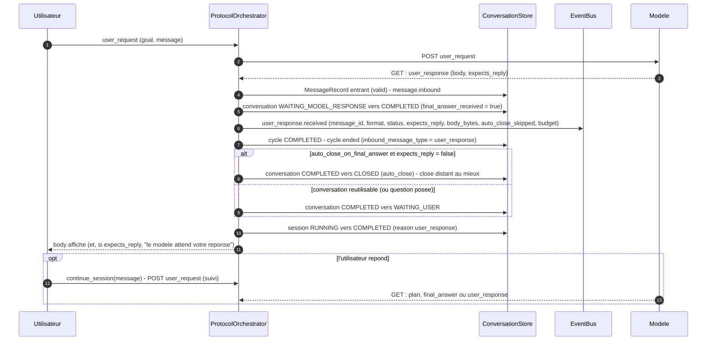

# ADR-022 — `user_response` : le modèle répond directement à l'utilisateur

**Statut** : accepté (2026-09-18) — amende [ADR-007](ADR-007-amendements-machines-a-etats.md) (table des messages attendus, machine à états de session) ; complété par ADR-023 à venir (politique de correction)

## Contexte

Tout ce que le modèle peut envoyer est un **plan de commandes** (`discovery_plan`, `execution_plan`, `priority_clarification`), sauf deux messages : `context_resume_ack`, purement technique, et `final_answer`, dont le contenu (§12.7) est **moulé en diagnostic** : `status`, `diagnosis`, `evidence[]`, `recommended_next_step`. De plus la table des messages attendus (§14, ADR-007) n'admet qu'un `discovery_plan` après le **premier** `user_request` d'une conversation.

Deux conséquences, constatées dès qu'un modèle réel est branché (ADR-020, ADR-021) :

1. **une question d'analyse pure n'a pas de réponse possible.** « Que signifie `invalid target release: 21` ? », « explique-moi cette trace », « que ferais-tu ? » : le modèle est forcé de planifier des commandes qu'il n'a aucune raison d'exécuter, puis de couler une explication dans le moule `diagnosis` / `evidence` ;
2. **le modèle ne peut pas poser de question à l'utilisateur.** Quand la demande est ambiguë (« quel module échoue ? »), il n'existe aucun message pour la lui retourner : il doit deviner, ou échouer.

Aujourd'hui, un modèle qui tente de répondre en texte produit soit une enveloppe de type inconnu (`UNEXPECTED_MESSAGE_TYPE`), soit du texte nu que le codec ne sait pas lire (`UNPARSEABLE_REPLY`, ADR-021) : dans les deux cas la session **échoue**. Le besoin : un message du modèle vers l'utilisateur, de contenu libre, qui conclut le tour comme un `final_answer`, avec la possibilité d'attendre une réponse de l'utilisateur, et sans rien changer aux garanties (persistance, audit, budgets, rotation).

## Décision

### 1. Un nouveau type entrant : `user_response`

`MessageType.USER_RESPONSE = "user_response"` (modèle → application) rejoint `INBOUND_MESSAGE_TYPES` ; avec `final_answer` il forme `CONCLUDING_MESSAGE_TYPES`, les deux types qui concluent un tour sans plan. Son contenu (`UserResponseContent`, `extra = forbid`, figé) :

| Champ | Type | Défaut | Règle |
|---|---|---|---|
| `format` | `text` \| `markdown` \| `json` | `text` | indication de rendu pour l'interface utilisateur, rien d'autre |
| `body` | chaîne non vide | — | **opaque** : jamais parsé, jamais validé au-delà de « chaîne non vide », **même quand `format = "json"`** |
| `status` | `completed` \| `partial` \| `failed` | `completed` | la demande est traitée, en partie, ou ne peut pas l'être |
| `expects_reply` | booléen | `false` | `true` = le modèle pose une question et attend la réponse de l'utilisateur |

```json
{
  "type": "user_response",
  "conversation_id": "conv-1001",
  "message_id": "msg-010",
  "content": {
    "format": "markdown",
    "body": "## Why the build fails\n\nThe project targets Java 21 but the compiler is Java 17.",
    "status": "completed",
    "expects_reply": false
  }
}
```

**Opacité du corps.** L'application n'interprète rien (§1) : `body` est affiché, persisté, audité par sa taille, jamais lu. `format = "json"` n'entraîne aucune validation JSON — c'est une promesse du modèle à l'interface, pas au protocole. La seule règle sémantique est une **borne de taille** : un `body` dont la taille UTF-8 dépasse `payload.max_message_bytes` (la borne d'un message, ADR-010) est refusé par l'adaptateur avec `ProtocolError("USER_RESPONSE_TOO_LARGE", size_bytes, max_bytes, message_id)`, après la vérification de schéma, comme `STATE_SUMMARY_TOO_LARGE` pour ADR-005.

### 2. Table des messages attendus (ADR-007 amendée) et drapeau `protocol.allow_direct_response`

| Dernier message sortant | Types entrants autorisés |
|---|---|
| `user_request` (premier de la conversation) | `discovery_plan`, **`user_response` si `protocol.allow_direct_response`** |
| `user_request` (suivi, après un `final_answer` **ou un `user_response`**) | `discovery_plan`, `execution_plan`, `priority_clarification`, `final_answer`, **`user_response`** |
| `execution_result` | `execution_plan`, `priority_clarification`, `final_answer`, **`user_response`** |
| `context_resume_request` | `context_resume_ack` (inchangé) |

Après un `execution_result` ou un `user_request` de suivi, `user_response` est accepté **inconditionnellement** : le modèle a déjà (ou a pu avoir) des résultats de commandes, et conclure sans diagnostic formel est légitime. Après le **premier** `user_request`, il n'est accepté que si le nouveau drapeau de configuration est actif :

```toml
[protocol]
allow_direct_response = true   # défaut
```

- **Défaut `true`.** La règle « le premier message est toujours un `discovery_plan` » (§14) existe pour que le modèle découvre la machine avant d'agir. Elle n'a de sens que pour une demande qui concerne la machine ; imposer une découverte à une question d'analyse gaspille un cycle, un plan et des secondes d'exécution pour rien. Le défaut suit donc l'usage.
- **`false` = comportement strict de la spec.** Un opérateur qui veut garantir qu'aucune session ne se conclut sans avoir observé la machine remet la grammaire de §14 : un `user_response` en première réponse est alors `UNEXPECTED_MESSAGE_TYPE` (`message.rejected`, session `FAILED`, politique « une faute et c'est fini » actuelle), et les instructions envoyées au modèle le disent.

Réalisation : la table de base `EXPECTED_INBOUND` (`protocol/adapter.py`) garde la ligne initiale stricte ; `expected_inbound_for(situation, *, allow_direct_response)` y ajoute `user_response` sous le drapeau, et `ProtocolAdapter.expected_inbound` lit le drapeau dans sa configuration. Le drapeau ne touche **aucune autre ligne**. `ConversationRecord.final_answer_received`, qui choisit la ligne « suivi », signifie désormais « le modèle a conclu un tour de cette conversation par un `final_answer` ou un `user_response` ».

La section `[protocol]` accueillera aussi les réglages de la politique de correction (ADR-023).

### 3. Cycle de vie : le chemin du `final_answer`

Un `user_response` termine le tour du modèle **exactement comme un `final_answer`** (§11), dans le même ordre persister → publier → agir (ADR-015) :



- Le message entrant est **persisté** comme tout message valide (`MessageRecord`, `validation_status = valid`, comptabilisé dans `context_bytes`, `message.inbound`).
- Un nouvel événement audité, **`user_response.received`** (`EventType.USER_RESPONSE_RECEIVED`), porte `message_id`, `format`, `status`, `expects_reply`, `body_bytes`, `auto_close_on_final_answer`, `auto_close_skipped`, `consumed_cycles`, `consumed_plans`, `session_duration_ms` — jamais le corps lui-même (il se lit dans la table des messages).
- Le cycle est complété ; la conversation passe `COMPLETED` (raison `user_response`, `final_answer_received = true`) puis `WAITING_USER` ; la session passe `COMPLETED` (raison `user_response`).
- **`SessionRecord.final_answer` n'est jamais écrit** par un `user_response` : ce champ reste le diagnostic de §12.7. **Aucune colonne ni champ persistant nouveau** (le schéma SQLite est en version 1, sans migration) : les réponses se relisent dans la table des messages, filtrée sur `message_type = user_response` et `validation_status = valid`.

### 4. `expects_reply` face à `auto_close_on_final_answer`

Une question doit rester ouverte : avec `expects_reply = true`, la conversation va `WAITING_USER` **même sous auto-close** (l'événement porte `auto_close_skipped: true`) ; avec `expects_reply = false` sous auto-close elle est `CLOSED` comme après un `final_answer`. Corollaire sur la machine de session d'ADR-007 (« `COMPLETED` est terminal quand `auto_close_on_final_answer = true` ») : `COMPLETED → RUNNING` reste refusé pour une session auto-close **sauf** si sa conversation courante est `WAITING_USER` — ce qui, sous auto-close, ne se produit que pour une question. `ConversationManager.continue_session` applique la même règle ; l'utilisateur répond avec le mécanisme existant (`POST /sessions/{sid}/messages`, `user_request` de suivi dans la même conversation, ligne « suivi » de la table), et c'est le `final_answer` qui suivra qui fermera la conversation.

### 5. Pas de repli implicite

Une réponse en **texte nu**, sans enveloppe, reste `UNPARSEABLE_REPLY` (ADR-021) : l'application ne fabrique jamais un `user_response` à partir d'un texte qu'elle ne sait pas lire — ce serait interpréter la réponse du modèle. La re-sollicitation du modèle en citant sa réponse (politique de correction) est l'objet d'ADR-023 ; ce que cet ADR garantit, c'est qu'un modèle qui *veut* répondre en texte a désormais un message légal pour le faire, et que les instructions le lui disent.

### 6. Interfaces, événements, instructions

| Surface | Ajout |
|---|---|
| `ConversationManager` | `user_responses(session_id) -> list[dict]` (chaque réponse : `message_id`, `conversation_id`, `cycle_id`, `received_at`, `format`, `body`, `status`, `expects_reply`, de la plus ancienne à la plus récente, toutes conversations de la session) ; `last_reply(session_id) -> dict \| None` (`{type: final_answer \| user_response, message_id, conversation_id, cycle_id, received_at, content}`, la plus récente des deux sortes) — les deux depuis la table des messages |
| API | `GET /sessions/{sid}/responses` (la liste, `[]` si aucune, 404 session inconnue) ; `GET /sessions/{sid}/reply` (`last_reply`, 404 `REPLY_NOT_FOUND` tant que le modèle n'a rien conclu) ; `user_response.received` circule dans le flux SSE comme tout événement audité |
| CLI `run` | quand la session se termine par un `user_response` : panneau avec le corps, titre `Model response (<format>, <status>)` ; si `expects_reply`, la commande à taper pour répondre ; `--json` porte `last_reply` |
| CLI `reply <sid> "<message>"` | client de `POST /sessions/{sid}/messages` (`--api-url`, `--json`), pour répondre à une question ou envoyer un suivi |
| Serveur mock | scénario intégré `analysis` (`default_analysis_scenario` : `user_request → user_response` markdown, `expects_reply = false`), `agentic-app mock-server --scenario-name analysis` ; `java` reste le défaut |
| Instructions | table « ce que vous pouvez envoyer », listes de types, section « Answering the user directly: user_response » (quand l'utiliser, champs, borne, suite possible) ; la ligne du premier message et la règle associée sont rendues d'après le drapeau (`{initial_reply_types}`, `{initial_reply_grammar}`, `{initial_reply_rule}` dans `render_instructions`) |

## Conséquences

- Code : `domain/states.py` (`USER_RESPONSE`, `CONCLUDING_MESSAGE_TYPES`), `domain/events.py` (`USER_RESPONSE_RECEIVED`), `protocol/messages.py` (`UserResponseContent`, `CONTENT_MODELS`), `protocol/adapter.py` (table amendée, `expected_inbound_for`, `USER_RESPONSE_TOO_LARGE`, placeholders des instructions), `protocol/PROTOCOL_INSTRUCTIONS.md`, `config.py` (`ProtocolSection`), `config.toml` (`[protocol]`), `orchestration/protocol_orchestrator.py` (`_finish` commun aux deux types concluants, `REASON_USER_RESPONSE`), `orchestration/conversation_manager.py` (`user_responses`, `last_reply`, règle de `continue_session`), `lifecycle/conversation_lifecycle.py` (`COMPLETED → RUNNING` sous auto-close si la conversation attend l'utilisateur), `interfaces/http_api.py` (deux routes, protocole de façade), `interfaces/cli.py` (`run`, `reply`, `mock-server --scenario-name`), `testing/mock_model_server.py` (`default_analysis_scenario`, `BUILTIN_SCENARIOS`).
- Tests : `tests/unit/test_phase2_protocol.py` (schéma, opacité, borne, lignes de la table avec et sans drapeau, produit cartésien étendu, instructions rendues pour les deux valeurs), `tests/integration/test_phase9_user_response.py` (réponse directe, après un `execution_result`, question puis réponse de l'utilisateur avec et sans auto-close, drapeau strict, borne de taille, lectures de la façade), `test_phase9_api.py` (routes, trame SSE, suivi sous auto-close), `test_phase9_cli.py` (`run`, `reply`, `mock-server`), `test_phase7_mock_server.py` et `test_phase9_e2e_mock_server.py` (scénario `analysis`), `test_phase1_state_machines.py` (règle de session), `test_phase0_foundation.py` (section `[protocol]`, `config.toml` = défauts du code).
- Compatibilité : le défaut `allow_direct_response = true` **amende la règle du premier message de §14** — une première réponse `user_response` est acceptée là où la spec n'admettait qu'un `discovery_plan` ; `false` rétablit strictement §14. Les autres lignes gagnent un type sans en perdre. Aucun message existant ne change de forme, aucun schéma de persistance ne change, `final_answer` et `GET /sessions/{sid}/final-answer` gardent leur sens exact.
- Points ouverts :
  1. **Reprise après crash entre `COMPLETED` et `WAITING_USER`.** `RecoveryCoordinator._finish_conversation` clôt une conversation `COMPLETED` d'une session auto-close sans relire le dernier message entrant : une question (`expects_reply`) laissée dans cette fenêtre serait fermée au redémarrage. Fenêtre de deux écritures consécutives ; à traiter si un cas réel apparaît.
  2. **Politique de correction (ADR-023).** Une réponse hors enveloppe, ou un `user_response` en première réponse sous le drapeau strict, reste une faute fatale ; ADR-023 décidera de la re-sollicitation en citant la réponse (`excerpt` d'ADR-021, `details` de `message.rejected`).
  3. **Octets du corps.** `body_bytes` compte l'UTF-8 du corps seul ; `size_bytes` du `MessageRecord` compte l'enveloppe canonique. Les deux sont exposés, aucune n'est dérivée de l'autre.
