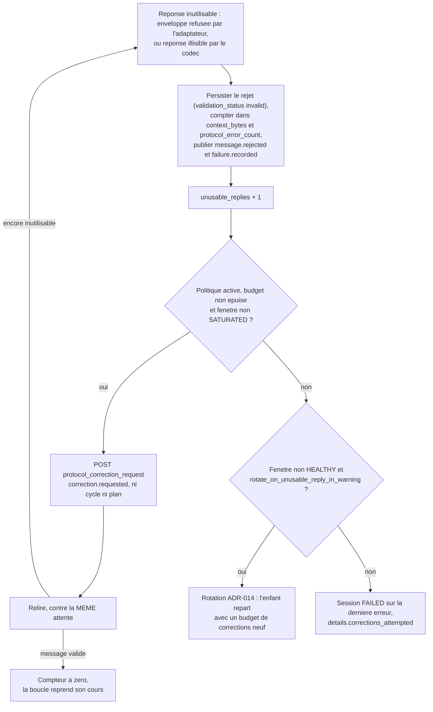
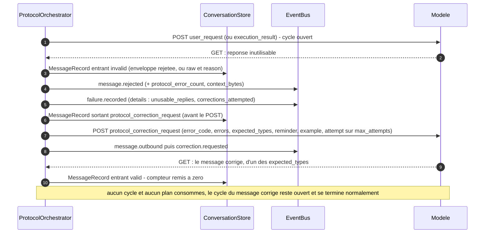

# ADR-023 — Politique de correction : re-solliciter le modèle au lieu de terminer la session

**Statut** : accepté (2026-09-19) — amende [ADR-021](ADR-021-codec-de-messages-par-modele.md) §2 (trace persistée d'une réponse illisible) et [ADR-019](ADR-019-consolidation-vague-1.md) §2 (la rotation en `WARNING` devient le repli) ; complète [ADR-007](ADR-007-amendements-machines-a-etats.md) (table des messages attendus) et clôt le point ouvert 2 d'[ADR-022](ADR-022-reponse-utilisateur.md)

## Contexte

Le modèle distant est la seule source de messages entrants et rien ne garantit qu'il respecte le protocole. Jusqu'ici, l'application n'avait qu'une réponse à lui opposer : **la première réponse inutilisable termine la session**. §14 impose l'arrêt dès la première `MODEL_PROTOCOL_ERROR`, le `FailureManager` décide `fail`, la session passe `FAILED` — ou, seul aménagement, l'application **rotate** quand la fenêtre de contexte est déjà en `WARNING` (ADR-019 §2), c'est-à-dire quand elle a une raison de croire que la faute vient de l'accumulation et pas du modèle.

Le rapport de conformité (`docs/reports/conformance-protocole.md`, 114 cas exécutables) rend cette politique visible sur toute la surface des fautes possibles : enveloppe mal formée, type hors grammaire du tour, identifiant réutilisé, dépendance inconnue, `state_summary` hors budget, texte nu que le codec ne sait pas lire (`UNPARSEABLE_REPLY`, ADR-021). Colonne « Suite » : pour chaque faute, **échec** — ou, quand la fenêtre est déjà en `WARNING`, une rotation, qui n'est pas une réponse faite au modèle mais un déménagement. La classification est fine, la sanction est uniforme — et brutale. Trois conséquences :

1. **un modèle juste à 95 % est inutilisable.** Une faute sur vingt réponses suffit à condamner une session complète, avec ses cycles consommés, ses commandes déjà exécutées et son contexte déjà payé ;
2. **rien n'est jamais demandé au modèle.** L'application sait exactement ce qu'elle attendait, ce qu'elle a reçu et pourquoi elle a refusé — `details` porte le `loc` pydantic, les identifiants en conflit, les types attendus — et elle garde tout pour son journal. Le seul destinataire capable d'agir sur cette information ne la reçoit jamais ;
3. **la faute la plus fréquente est la plus bête.** Un modèle qui répond en prose, qui enveloppe son JSON dans de la Markdown ou qui envoie un `execution_plan` là où un `discovery_plan` est attendu n'a pas un problème de raisonnement : il a mal lu une instruction envoyée 30 000 octets plus tôt.

L'exigence du propriétaire : **l'application doit répondre à une réponse mal formée par un rappel du protocole et des messages attendus dans cette situation précise, puis attendre une correction, et ne s'arrêter qu'après plusieurs réponses inutilisables d'affilée — la borne étant configurable.**

## Décision

### 1. Un nouveau type sortant : `protocol_correction_request`

`MessageType.PROTOCOL_CORRECTION_REQUEST = "protocol_correction_request"` (application → modèle) rejoint `OUTBOUND_MESSAGE_TYPES`. Il n'est **pas** dans `INBOUND_MESSAGE_TYPES` : le modèle ne peut jamais en envoyer un, il n'en reçoit que. Il n'est pas non plus dans `SUBSTANTIVE_OUTBOUND_MESSAGE_TYPES` — voir §5.

Son contenu (`ProtocolCorrectionRequestContent`, `extra = forbid`, figé) porte tout ce qu'il faut pour renvoyer un message correct **sans deviner** :

| Champ | Présence | Ce qu'il porte | Pourquoi |
|---|---|---|---|
| `rejected_message_id` | quand la réponse portait un `message_id` lisible | l'identifiant du message refusé | le modèle sait lequel de ses messages est mort, et qu'il ne doit pas le renvoyer — ni réutiliser son `message_id`, désormais pris |
| `error_code` | toujours | le code du refus (`SCHEMA_INVALID`, `UNEXPECTED_MESSAGE_TYPE`, `DUPLICATE_TASK_ID`, `UNPARSEABLE_REPLY`…) | c'est le vocabulaire du rapport de conformité et des `FailureRecord` : le modèle, le journal et la documentation nomment la même faute |
| `errors` | toujours | les `details` de l'adaptateur, **inchangés** | un échec de schéma porte déjà la liste pydantic `{loc, type, msg}` ; les autres codes portent des détails plats (`expected` / `received`, `task_id` / `dependency`, `size_bytes` / `max_bytes`…) qui deviennent une entrée. Rien n'est reformulé : ce que le modèle lit est exactement ce que l'application a refusé |
| `expected_types` | toujours | les types acceptés **maintenant** | la ligne de la table d'ADR-007 qui était en attente, inchangée par la faute (§5) |
| `reminder` | toujours | le rappel ciblé : la faute en une phrase, les types attendus, la forme de chacun (`champ: domaine (required)`), la règle d'enveloppe et le `conversation_id` à répéter | **généré depuis les modèles de contenu** (`model_json_schema`), donc incapable de décrire un schéma que l'application n'applique pas. Seule la phrase par code est écrite à la main |
| `example` | toujours, sauf rétrécissement (§4) | un message **minimal valide** de l'un des `expected_types`, avec le bon `conversation_id` et `message_id` = `<new-unique-message-id>` | copier une forme est plus sûr que lire une description. L'identifiant est un marqueur, jamais un identifiant à réutiliser (`CORRECTION_EXAMPLE_MESSAGE_ID`) |
| `raw_excerpt` | pour `UNPARSEABLE_REPLY` | l'extrait brut de ce que le modèle a rendu (l'`excerpt` d'ADR-021, ≤ 500 caractères) | quand il n'y a pas d'enveloppe, il n'y a rien à citer d'autre — et c'est justement le cas où le modèle doit voir ce qu'il a produit |
| `attempt` / `max_attempts` | toujours | la position dans le budget de corrections | le modèle sait qu'il reste des essais, et combien : `attempt == max_attempts` signifie « la prochaine faute termine la session » |

```json
{
  "type": "protocol_correction_request",
  "conversation_id": "conv-1001",
  "message_id": "msg-007",
  "content": {
    "rejected_message_id": "msg-006",
    "error_code": "UNEXPECTED_MESSAGE_TYPE",
    "errors": [{ "received": "final_answer", "expected": ["discovery_plan", "user_response"] }],
    "expected_types": ["discovery_plan", "user_response"],
    "reminder": "Your last reply was refused (UNEXPECTED_MESSAGE_TYPE): that type is not one of the types expected at this point.\nSend exactly one message, of one of these types: `discovery_plan`, `user_response`.\n- discovery_plan.content — plan_id: non-empty string (required), objective: string (required), ...",
    "example": {
      "type": "discovery_plan",
      "conversation_id": "conv-1001",
      "message_id": "<new-unique-message-id>",
      "content": { "plan_id": "<new-unique-plan-id>", "objective": "Discover the execution environment", "execution_policy": "sequential", "tasks": [{ "task_id": "<new-unique-task-id>", "type": "cmd", "cmd": "uname -a", "continue_on_error": true }] }
    },
    "attempt": 1,
    "max_attempts": 5
  }
}
```

Le message est composé par l'**adaptateur** (`ProtocolAdapter.build_protocol_correction_request`), pas par l'orchestrateur : c'est lui qui possède la grammaire, les schémas et la table des attendus, donc lui seul peut produire un rappel et un exemple qui ne dérivent pas du code qui valide. L'exemple choisi est celui du **type que le modèle a tenté** quand ce type est parmi les attendus (la forme qu'il a ratée), sinon le premier d'un ordre de préférence stable (`context_resume_ack`, puis `discovery_plan`, `execution_plan`, `priority_clarification`, `final_answer`, `user_response`).

La section 10 des instructions envoyées au modèle (`PROTOCOL_INSTRUCTIONS.md`) décrit le message reçu champ par champ et la conduite à tenir : lire `errors`, envoyer **un** message d'un des `expected_types`, prendre un **nouveau** `message_id`, corriger exactement ce qui est listé, copier la forme de l'`example`, ne jamais accuser réception. Le texte est rendu depuis la configuration (`{max_correction_attempts}`, `{rejection_policy_rule}`, `{correction_budget_rule}`) : un déploiement qui désactive la politique envoie des instructions qui le disent (§7).

### 2. Le compteur : réponses inutilisables **consécutives**, dérivées du stock

La borne porte sur des réponses inutilisables **d'affilée**, pas sur un total. Tout message entrant valide remet le compteur à zéro (`_accept`) : un modèle qui se trompe une fois toutes les dix réponses n'épuise jamais son budget, un modèle qui a décroché l'épuise en quelques tours.

Le compteur est **dérivé, jamais persisté** : le schéma SQLite est en version 1 et aucune migration n'est ouverte pour ADR-023, exactement comme ADR-022 n'a ajouté ni colonne ni champ. `consecutive_unusable_replies(store, conversation)` le reconstruit depuis la trace : on remonte les messages de la conversation, on compte les enregistrements **entrants** refusés (`validation_status = "invalid"`), on **ignore** les `protocol_correction_request` sortants qui leur répondent, et on s'arrête au premier message entrant valide ou au premier sortant substantiel. C'est littéralement la règle de remise à zéro, lue dans le stock.

Pendant un `run`, la valeur vit en mémoire (`_SessionRun._unusable_replies`) : la boucle n'a pas à relire la table à chaque tour. Les deux vues coïncident parce que la trace est uniforme — et elle ne l'est que depuis l'amendement d'ADR-021 §2 ci-dessous.

**Une réponse que le codec ne sait pas lire est désormais persistée comme message entrant.** ADR-021 §2 disait « rien n'est persisté comme message entrant : il n'y a pas d'enveloppe à enregistrer ; c'est l'`excerpt` du `FailureRecord` qui garde la trace ». Une politique de correction a besoin d'**une** trace et d'**un** compteur, pas de deux. Le `MessageRecord` entrant est donc écrit avec ce que le codec a pu citer — `{"raw": <extrait>, "reason": <pourquoi>}` — sous le type interne `system_error`, `validation_status = "invalid"`, exactement comme le fait déjà une réponse dont le `type` est illisible. Il n'y a toujours pas d'enveloppe : la taille comptée dans la fenêtre est celle de cet enregistrement, la forme brute n'étant connue que par son extrait. `protocol_error_count` est incrémenté et `message.rejected` est publié, comme pour un rejet d'enveloppe.

**Reprise après crash.** Une session qui redémarre au milieu d'une boucle de correction **retrouve le budget qu'elle avait dépensé** : `_resume` appelle `consecutive_unusable_replies`. Le budget n'est donc pas un moyen de contourner la borne en redémarrant. Corollaire sur ADR-016 : `pending_outbound_of` traverse les `protocol_correction_request` et les rejets qu'ils corrigent — le message `M` reste « en attente », si bien qu'une conversation interrompue en pleine correction se reprend exactement comme une conversation interrompue avant la première réponse.

### 3. La boucle et son ordre



L'ordre est le point délicat, parce que deux politiques se disputent la même faute. Il est tranché ainsi :

1. **une fenêtre `SATURATED` rotate tout de suite, sans corriger.** Une correction envoyée dans un contexte plein ne peut pas recevoir de réponse : le message de correction lui-même n'y tiendrait pas, et la réponse corrigée encore moins. Corriger d'abord serait dépenser le budget pour rien. L'état lu est l'état **évalué** au moment où l'on décide, après avoir compté les octets de la réponse fautive : une fenêtre qui bascule à cause du rejet lui-même est vue comme saturée ;
2. **une fenêtre `HEALTHY` ou `WARNING` corrige d'abord**, jusqu'à `protocol.max_correction_attempts` réponses inutilisables d'affilée. `WARNING` garde de la place : la règle d'ADR-019 §2 (« en `WARNING`, une réponse inutilisable est lue comme un signe d'accumulation, donc on rotate ») était la seule réaction possible tant qu'il n'y en avait pas d'autre ; elle devient le **repli**, pas le premier réflexe. Une rotation coûte une conversation, un résumé, une retransmission et un cycle de plus (ADR-012, ADR-019 §5) ; un rappel de protocole coûte un message ;
3. **une fois le budget épuisé, la politique d'avant ADR-023 s'applique telle quelle** : rotation si la fenêtre n'est pas `HEALTHY` et que `context.rotate_on_unusable_reply_in_warning` est vrai (ADR-019 §2), sinon échec de session sur la **dernière** erreur — celle qui a fait déborder le compteur, pas la première.

Avec `max_correction_attempts = N`, l'application envoie donc au plus `N` corrections consécutives et termine sur la `N + 1`-ième réponse inutilisable d'affilée.

L'échec final est explicite sur ce qui a été tenté : tant que la politique est active, les `details` de chaque erreur de protocole sont enrichis de `unusable_replies`, `corrections_attempted` et `max_correction_attempts`. Ces détails voyagent dans le `FailureRecord` et dans l'événement `failure.recorded` — un opérateur qui lit un échec sait s'il a vu un modèle défaillant une fois ou un modèle qui n'a pas su corriger cinq fois de suite. Chaque réponse inutilisable écrit son `FailureRecord`, **y compris celles qui seront corrigées** : la politique de correction ne masque rien du journal existant.

**Ce qui ne change pas.** Un `MODEL_GET_TIMEOUT` épuisé n'est pas une faute de protocole : ce n'est pas le modèle qui s'est trompé, c'est le modèle qui n'a rien dit. Aucune correction n'est envoyée pour lui ; il garde exactement la politique d'ADR-019 §2 (rotation en fenêtre non `HEALTHY`, sinon échec). De même, un `MODEL_CONTEXT_WINDOW_ERROR` rotate comme avant.

### 4. Ce que coûte une correction

**Ni cycle, ni plan.** Une correction n'est pas un tour de boucle, c'est le **même tour redemandé**. Aucun `CycleRecord` n'est ouvert, `consumed_cycles` et `consumed_plans` ne bougent pas, `max_cycles` et `max_plans` ne sont pas consultés. Le `MessageRecord` de la correction porte le `cycle_id` du cycle en cours — celui du message qu'elle corrige — qui reste ouvert et se terminera normalement. Une session qui a dû corriger une fois consomme exactement le même budget qu'une session parfaite.

**Seul le budget de durée continue de courir.** Le temps passé à corriger est du temps de session ; `max_total_duration_ms` est vérifié avant chaque plan comme avant, et une boucle de corrections qui traîne finira par le faire déborder. C'est voulu : la durée est la seule borne qui protège d'un modèle qui répond vite et mal.

**Le reste est un message sortant ordinaire.** La correction est persistée **avant** d'être postée (ADR-015), publiée par `message.outbound`, comptée dans `context_bytes` (ADR-013 : elle est bel et bien dans le contexte du modèle), et la fenêtre est réévaluée après le POST comme pour tout envoi. Une seule différence de traitement : elle n'est **jamais** enregistrée comme « message en attente de réponse » (`track_pending = False`), ce qui est la traduction technique de §5.



**Elle tient sous `payload.max_message_bytes`** (ADR-010) — une correction qui dépasserait la borne des messages serait refusée par le transport ou tronquée n'importe où. L'adaptateur la fait tenir par rétrécissements successifs, dans un ordre qui protège ce qui rend la correction actionnable :

1. `raw_excerpt` tronqué à 200 caractères, puis supprimé (c'est le modèle qui l'a écrit, il n'apprend rien en le relisant) ;
2. `errors` réduit à sa première entrée, puis vidé ;
3. `reminder` tronqué à 400 caractères ;
4. `example` supprimé ;
5. `reminder` supprimé.

`error_code`, `expected_types`, `attempt` et `max_attempts` sont minuscules et survivent toujours : même rétrécie au maximum, une correction dit au modèle ce qu'on lui reproche et ce qu'on attend de lui.

### 5. Transparence pour la table des messages attendus

Une correction **n'ouvre aucune ligne** de la table d'ADR-007. Elle ne demande pas un nouveau message, elle redemande celui qui est déjà attendu.

Réalisation : `SUBSTANTIVE_OUTBOUND_MESSAGE_TYPES` (`user_request`, `execution_result`, `context_resume_request`) nomme les types sortants qui **fixent** l'attente ; `protocol_correction_request` en est délibérément exclu. `last_substantive_outbound(messages)` remonte la trace jusqu'au dernier de ces trois types, et c'est lui que `situation_for` classe en ligne de la table. Une réponse à une correction est donc validée contre la ligne qui était pendante avant la faute — ni plus permissive (une faute ne débloque pas un type), ni plus stricte.

Conséquence directe et vérifiable : après un premier `user_request`, `expected_types` vaut `["discovery_plan", "user_response"]` (ADR-022, drapeau `allow_direct_response`) dans la correction comme dans la validation qui suivra. Un modèle qui lit `expected_types` lit la vérité de l'application, pas une approximation.

### 6. Portée du compteur à travers une rotation

Quand le budget est épuisé et que la fenêtre fait basculer vers une rotation, **l'enfant repart avec un budget de corrections neuf**.

Ce n'est pas de la clémence, c'est une conséquence de ce qu'est une rotation : la conversation enfant est une **nouvelle** conversation distante, qui reçoit les instructions du protocole en entier à son `init`, un résumé de contexte, puis la retransmission du message en attente. Le modèle y relit donc, dans un contexte vide, tout ce que la correction lui rappelait — et dans de meilleures conditions, puisque la cause probable de ses fautes (l'accumulation) vient d'être retirée. Compter contre lui les fautes de la conversation parente reviendrait à le condamner pour un contexte qu'il n'a plus. C'est un nouvel échange : le compteur y repart de zéro, et l'enfant a droit à ses propres corrections.

La remise à zéro est locale à la rotation décidée par cette politique ; elle n'est pas une remise à zéro du budget de **session** (`rotations_count`, `max_rotations_per_session` d'ADR-019 §5 continuent de courir), qui reste la vraie borne d'une session qui n'arrive pas à avancer.

### 7. `max_correction_attempts = 0` rétablit le comportement d'avant

```toml
[protocol]
max_correction_attempts = 5   # défaut
```

`0` **désactive** la politique et rétablit la conduite d'avant ADR-023 : la première réponse inutilisable termine la session (ou rotate en fenêtre non `HEALTHY`, ADR-019 §2), aucun `protocol_correction_request` n'est jamais envoyé, aucun événement `correction.requested` n'est publié, et les `details` de l'erreur sont **exactement** ceux de la faute — sans `unusable_replies`, `corrections_attempted` ni `max_correction_attempts`. Les instructions envoyées au modèle le disent aussi (« the first refused reply ends the session »), pour qu'il n'attende jamais une seconde chance qui ne viendra pas.

Une seule chose ne se désactive pas, et c'est voulu : la **trace uniforme** de §2. Une réponse illisible par le codec est persistée comme enregistrement entrant invalide quel que soit le réglage, parce que c'est une règle de persistance (ADR-015 : ce que le modèle a envoyé se relit dans la table des messages), pas une politique. La batterie de conformité en tient compte : ses cas de forme brute vérifient désormais que l'extrait est persisté.

Le défaut `5` suit l'usage : c'est le nombre au-delà duquel un modèle qui n'a pas corrigé ne corrigera pas.

**La batterie de conformité tourne avec `0` par défaut.** Chaque cas de `tests/conformance` épingle la **classification** d'une faute : le code d'erreur, ce qui est persisté, ce qui est publié, ce qu'il advient de la session. La politique de correction est orthogonale à cette classification — elle décide de ce que l'application fait *ensuite*. Exécuter la batterie avec `protocol.max_correction_attempts = 0` (`tests/conformance/harness.py`, constante `CORRECTION_OFF`) isole donc ce qui est mesuré : une faute, un verdict, cas par cas, assertions lisibles. Le rapport généré reste la matrice des fautes ; la boucle de correction, elle, se vérifie dans sa propre famille de cas, qui fixe la borne explicitement.

### 8. Observabilité

| Surface | Ajout |
|---|---|
| Événement | `correction.requested` (`EventType.CORRECTION_REQUESTED`), audité comme tout le reste : `message_id` de la correction, `error_code`, `attempt`, `max_attempts`, `expected_types`, `rejected_message_id`. Jamais le rappel ni l'exemple — ils se relisent dans la table des messages |
| Métriques | `corrections_total{error_code}` (compteur Prometheus, alimenté par `correction.requested`), à côté de `messages_rejected_total` — le rapport entre les deux dit si les corrections servent à quelque chose |
| Instantané | `ModelInteractionView.correction_attempt` / `correction_max_attempts` : non nuls tant qu'une correction est **en vol** (dernier sortant = `protocol_correction_request`, aucune réponse valide derrière), remis à zéro dès qu'un message valide arrive. Dérivés des messages persistés, jamais stockés |
| Façade | `ConversationManager.corrections(session_id)` : tous les `protocol_correction_request` de la session, toutes conversations confondues, du plus ancien au plus récent, avec l'enveloppe (`message_id`, `conversation_id`, `cycle_id`, `created_at`, `posted_at`, `size_bytes`) et le contenu déplié |
| API | `GET /sessions/{sid}/corrections` (la liste, `[]` si le modèle n'a jamais eu à être corrigé) ; `correction.requested` circule dans le flux SSE comme tout événement audité |
| CLI | une ligne `Correction` dans le panneau d'état (`status`, `watch`, `run`) : `waiting for a corrected reply  attempt n/N` — un opérateur voit que la boucle attend une correction, pas qu'elle est bloquée |
| Serveur mock | `wrong_then_right(...)` (un scénario qui se trompe `n` fois puis se corrige, chaque étape suivante déclenchée par un `protocol_correction_request`) et `default_correction_scenario` / `--scenario-name correction`, qui joue la boucle complète de bout en bout |

## Conséquences

- **Code** : `domain/states.py` (`PROTOCOL_CORRECTION_REQUEST`, `SUBSTANTIVE_OUTBOUND_MESSAGE_TYPES`, `OUTBOUND_MESSAGE_TYPES`), `domain/events.py` (`CORRECTION_REQUESTED`), `protocol/messages.py` (`ProtocolCorrectionRequestContent`), `protocol/adapter.py` (`build_protocol_correction_request`, `correction_reminder`, `example_envelope_for`, `CORRECTION_EXAMPLE_MESSAGE_ID`, catalogue d'exemples, échelle de rétrécissement, `last_substantive_outbound`, placeholders des instructions), `protocol/PROTOCOL_INSTRUCTIONS.md` (§2.4 et §10), `orchestration/protocol_orchestrator.py` (`consecutive_unusable_replies`, `pending_outbound_of`, `_persist_unparseable`, `_note_unusable_reply`, `_correction_details`, `_after_unusable_reply`, `_request_correction`, `_post(track_pending=…)`), `context/window.py` (`is_saturated`, `should_rotate_on_unusable_reply` documentée pour les deux politiques), `orchestration/conversation_manager.py` (`corrections`), `observability/telemetry.py` (`corrections_total`), `observability/execution_tracker.py` (correction en vol), `interfaces/http_api.py` (route), `interfaces/cli.py` (panneau), `testing/mock_model_server.py` (`wrong_then_right`, scénario `correction`), `config.py` (`ProtocolSection.max_correction_attempts`), `config.toml`.
- **Tests** : `tests/integration/test_phase9_correction.py` épingle la politique de bout en bout sur l'orchestrateur réel — une faute puis un plan valide et la session se termine ; l'événement audité et son contenu exact ; la correction qui cite la faute et l'attente pendante ; aucun cycle ni plan consommé face à une session de référence sans faute ; le compteur remis à zéro par une réponse valide ; `attempts` fautes exactement puis succès, et `attempts + 1` fautes puis `FAILED` avec `corrections_attempted` (paramétré sur 1, 2, 5) ; la politique désactivée qui échoue au premier coup ; une réponse illisible par le codec corrigée au deuxième essai, et la même jamais corrigée ; l'ordre face à la rotation (fenêtre `WARNING` : correction d'abord ; fenêtre saturée : rotation sans correction) ; le budget neuf de la conversation enfant ; le compteur reconstruit depuis la seule trace persistée ; une correction qui déborderait `max_message_bytes` et qui est rétrécie sans perdre le code ni les types attendus ; la façade, l'instantané CLI et la métrique. `tests/unit/test_phase2_protocol.py` couvre le schéma du contenu, le rappel généré, les exemples minimaux (chacun doit être accepté par l'adaptateur lui-même) et les instructions rendues pour les deux réglages ; `tests/conformance/harness.py` fixe `0` pour toute la batterie.
- **Configuration** : une clé nouvelle, `protocol.max_correction_attempts` (défaut `5`, `≥ 0`), documentée dans `config.toml`. Aucune clé existante ne change de sens ; `context.rotate_on_unusable_reply_in_warning` garde le sien mais s'applique désormais **après** les corrections.
- **Persistance** : aucune colonne, aucun champ nouveau — le schéma SQLite reste en version 1. Tout est dérivé de la table des messages.
- **Ce qui change pour un modèle qui échouait** : une réponse hors grammaire, un `execution_plan` là où un `discovery_plan` est attendu, un `task_id` réutilisé, un `depends_on` fautif, un `user_response` hors du drapeau strict, un `state_summary` trop gros, de la prose sans enveloppe — toutes ces fautes, qui terminaient la session, ouvrent maintenant un échange de correction et se rattrapent au tour suivant sans coûter un cycle. Un modèle qui ne sait pas corriger termine la session comme avant, après `max_correction_attempts` rappels, et le journal dit combien il en a fallu.
- **Compatibilité** : le rapport de conformité décrit toujours la classification des fautes ; sa colonne « Suite » vaut pour `max_correction_attempts = 0`, réglage sous lequel la batterie tourne. Un modèle existant n'a rien à changer : `protocol_correction_request` est un type qu'il **reçoit**, et les instructions lui expliquent quoi en faire.
- **Points ouverts** :
  1. **Fenêtre saturée et rotation désactivée.** L'ordre de §3 dit « une fenêtre saturée rotate tout de suite » ; en pratique ce repli passe par `should_rotate_on_unusable_reply`, qui exige `context.rotate_on_unusable_reply_in_warning`. Avec ce drapeau à `false` et une fenêtre saturée, l'application n'essaie **aucune** correction et échoue immédiatement. C'est cohérent (l'opérateur a demandé de ne pas rotate, et corriger dans un contexte plein est vain), mais c'est un cas où la politique de correction est silencieusement inopérante ; à revoir si un déploiement coupe la rotation.
  2. **Curseur de GET après une réponse illisible.** Un rejet d'enveloppe avance `get_cursor` (le `GetResult` est parvenu à la boucle) ; une `UNPARSEABLE_REPLY` est levée par le décorateur de codec **avant** que le résultat n'existe pour l'orchestrateur, donc le curseur ne bouge pas. Avec un provider qui honore strictement `after`, la relecture qui suit la correction repart du même point et peut se voir resservir la réponse illisible. Les tests ne le voient pas : le transport double sert sa file dans l'ordre, sans lire `after`. À trancher avec un provider réel (ADR-020) — soit en avançant le curseur sur l'extrait, soit en documentant que le codec doit consommer.
  3. **Famille de conformité de la boucle.** Le harnais annonce une famille de cas dédiée à la politique (`test_conformance_correction_policy.py`) qui n'existe pas encore dans l'arbre : la boucle est couverte par les tests d'intégration de la phase 9, pas par la matrice du rapport. Le rapport (114 cas) est donc muet sur la correction elle-même.
  4. **Route HTTP non couverte.** `GET /sessions/{sid}/corrections` est implémentée et le protocole de façade la déclare (`fake_manager` compris), mais aucun test d'intégration ne l'exerce ; seule la lecture par `ConversationManager.corrections` est épinglée.
  5. **Une correction ne cite pas le message refusé en entier.** Elle porte `rejected_message_id`, les `errors` et, pour une réponse illisible, l'extrait brut — mais jamais le corps refusé complet, qui reste dans la table des messages. Un modèle sans mémoire de son propre envoi doit donc se fier à `errors` et à l'`example`. Suffisant dans tous les cas observés ; à reconsidérer si un codec rend des réponses que le modèle ne conserve pas.
