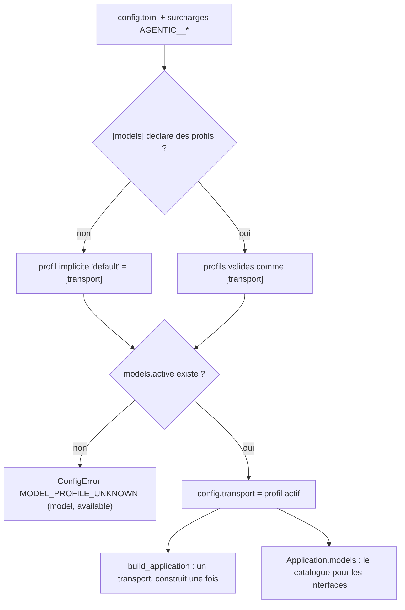

# ADR-024 — Profils de modèle nommés et identité machine

**Statut** : accepté (2026-09-19) — complète [ADR-018](ADR-018-api-pour-un-front-et-flux-live.md) (l'API pour un front), [ADR-020](ADR-020-transport-enfichable.md) (le provider choisi par configuration) et [ADR-021](ADR-021-codec-de-messages-par-modele.md) (le codec par modèle)

## Contexte

Un front de bureau arrive. Avant même la première session, il doit afficher deux choses que le back est seul à connaître : **quels modèles existent** (pour proposer un catalogue, et prévenir quand l'un d'eux réclame un jeton absent) et **qui est l'utilisateur** sur cette machine (pour pré-remplir l'identité au lieu de la demander).

Aujourd'hui la configuration ne décrit **qu'un seul modèle**. `[transport]` porte à la fois le provider (ADR-020), le codec (ADR-021), les URL, `token_env`, les options du provider et celles du codec. Un opérateur qui veut passer du serveur mock local à une API réelle réécrit la section, ou jongle avec deux fichiers `config.toml` et `AGENTIC_APP_CONFIG`. Il n'y a rien à montrer dans une liste : le fichier ne nomme aucun modèle, il en décrit un.

Deux faits techniques cadrent la décision :

1. **le transport est construit une fois**, dans `build_application` (`TransportRegistry.create`, puis `apply_codec`), et il est injecté dans l'orchestrateur, la rotation, l'interruption. Personne ne le reconstruit en cours de route, et un `TransportGateway` porte un état — client httpx, garde `InFlightGuard`, conversation distante ouverte ;
2. **le jeton n'est jamais dans le fichier** (ADR-004) : `token_env` nomme une variable d'environnement. Savoir si un modèle est utilisable, c'est savoir si cette variable est renseignée *maintenant*.

Le besoin n'est donc pas « changer de modèle à chaud » : c'est **nommer** les modèles disponibles, en désigner un au démarrage, et dire au front ce qu'il doit afficher.

## Décision

### 1. Des profils nommés dans la configuration

```toml
[models]
active = "mock"                                    # le profil avec lequel CE processus tourne

[models.mock]                                      # un profil = une TransportSection complète
provider = "generic_http"
codec = "passthrough"
init_url = "http://127.0.0.1:9000/v1/conversations"
display_name = "Mock local"
description = "Serveur de test intégré"
# [models.mock.options] / [models.mock.codec_options] : toutes les clés de [transport] sont valides

[models.claude]
provider = "templated_http"
codec = "json_text"
token_env = "CLAUDE_API_KEY"
display_name = "Claude (chat completions)"
```

- `ModelsSection` (`config.py`) porte `active: str` et `profiles: dict[str, TransportSection]`. Chaque sous-table de `[models]` est un profil, validé **exactement** comme `[transport]` : mêmes champs, mêmes contraintes (placeholders d'URL, provider et codec non vides, bornes des timeouts), mêmes sous-tables d'options. `active` est la seule clé réservée.
- Un profil est **complet** : il n'hérite de rien. Les clés qu'il ne donne pas prennent les valeurs par défaut de `TransportSection`, pas celles de `[transport]`. Un profil se lit seul, sans tenir un second fichier dans la tête.
- Deux champs de présentation s'ajoutent à `TransportSection` : `display_name` et `description`, tous deux optionnels. **L'application ne les lit jamais** ; ils ne voyagent que vers les interfaces.

### 2. Un seul modèle par processus — changer de modèle, c'est redémarrer

Le modèle est choisi **une fois, au démarrage**. Aucune interface, aucune route, aucune commande ne change le modèle d'un processus en marche : on relance l'application avec un autre `models.active` (ou `AGENTIC__MODELS__ACTIVE=claude` au lancement, par le mécanisme de surcharge existant `AGENTIC__<SECTION>__<CLÉ>`).

C'est une décision, pas une limite temporaire. Instancier un transport en cours de route signifierait remplacer l'objet que tiennent déjà l'orchestrateur, la rotation et l'interruption, pendant qu'une conversation distante est ouverte et qu'une lecture est peut-être en vol : on échangerait une commodité d'interface contre une classe entière de bugs d'état partagé, pour un geste rare (on ne change pas de modèle au milieu d'un diagnostic). Le front affiche donc le catalogue, marque le modèle actif, et dit que changer demande un redémarrage.

### 3. Compatibilité ascendante : `[transport]` est le profil implicite

Une configuration écrite avant cet ADR — sans `[models]` — continue de marcher **sans rien changer** : `[transport]` devient le profil implicite nommé `default`, et c'est lui l'actif. Le catalogue a donc toujours au moins une entrée.

La résolution se fait à la validation, dans `AppConfig` : le profil actif est **recopié sur `transport`**.



Conséquence voulue : **aucun autre module ne change**. `TransportRegistry.create(config)`, `CodecRegistry.create(config)`, `ProtocolAdapter`, la rotation, la CLI `transport show` lisent tous `config.transport` et lisent donc, sans le savoir, le profil actif. `AppConfig.active_transport` existe pour le dire explicitement dans le code qui veut être lu ; c'est `transport` lui-même.

Un `active` qui ne nomme aucun profil est une erreur **au chargement**, pas au premier appel : `ConfigError("MODEL_PROFILE_UNKNOWN", model=…, available=[…])`, la liste des noms disponibles dans les détails — le message dit quoi taper. Un profil invalide reste une `CONFIG_INVALID` pydantic ordinaire, localisée (`models.profiles.claude.get_url`).

### 4. `requires_credentials` : un jeton manquant se voit avant d'essayer

Un profil **réclame des identifiants** quand il nomme une variable de jeton (`token_env` non vide) et que cette variable est, à cet instant, absente ou vide. C'est une **vue**, jamais un champ du modèle de configuration : la valeur dépend de l'environnement et change sans que le fichier change. Elle est calculée à la lecture, par `requires_credentials(section, environ)`.

`AppConfig.profile_views()` rend le catalogue, une entrée `ModelProfileView` (figée) par profil :

| Champ | Sens |
|---|---|
| `name` | la clé de `[models.<nom>]` (ou `default`) |
| `display_name` · `description` | présentation, `null` si le profil n'en donne pas |
| `provider` · `codec` | ce que le profil branche (ADR-020, ADR-021) |
| `requires_credentials` | `token_env` non vide **et** variable vide ou absente, à cet instant |
| `active` | le profil de ce processus |

Ordre : **l'actif d'abord**, puis par nom. Aucun secret n'y figure : ni jeton, ni URL, ni options. `AppConfig.masked()` masque en outre les options **de tous les profils** exactement comme celles de `transport` (valeur contenant `${env:…}`, clé qui ressemble à un secret), pas seulement celles de l'actif : `config show` et `GET /config` exposent le fichier entier.

### 5. Identité machine

Un module feuille, `identity.py`, répond à « qui est l'utilisateur sur cette machine » sans rien importer de la configuration (l'identifiant de repli est un paramètre). `current_user(environ, runner, *, fallback_user_id, platform, hostname) -> UserIdentity` ; `UserIdentity` est figé : `{user_id, source, host}`.

Ordre de résolution, chaque étape passant la main quand elle ne rend rien :

| Étape | Windows | POSIX | `source` |
|---|---|---|---|
| 1 | `%USERNAME%` | `$USER` | `env:USERNAME` · `env:USER` |
| 2 | `whoami` | `$LOGNAME` | `cmd:whoami` · `env:LOGNAME` |
| 3 | — | `id -un` | `cmd:id` |
| 4 | le `transport.user_id` configuré | idem | `config` |
| 5 | `unknown` | idem | `unknown` |

- `source` nomme l'étape qui a répondu : l'interface peut afficher un badge (« lu dans l'environnement », « valeur de configuration ») au lieu de faire passer un repli pour une certitude.
- `whoami` rend `DOMAINE\utilisateur` sous Windows : seule la partie après la barre oblique inverse est gardée, espaces retirés, première ligne seulement.
- `host` vient de `socket.gethostname()`, au mieux : `None` en cas d'échec, jamais d'exception.
- **Le lanceur de commande est injecté** (`runner: Callable[[list[str]], str | None]`) : aucun test ne lance de processus. Le lanceur par défaut passe par `subprocess.run` avec un timeout court (`COMMAND_TIMEOUT_S`), rend `None` sur n'importe quel échec (commande absente, code de retour non nul, timeout) et ne lève jamais : l'identité ne doit ni bloquer ni casser le démarrage.

### 6. Ce que le câblage expose

`build_application` résout les deux, **une fois**, et les pose sur l'`Application` que servira la couche interfaces :

- `Application.models` → `list[ModelProfileView]`, l'actif d'abord ;
- `Application.identity` → l'`UserIdentity` de la machine, avec `transport.user_id` comme repli ;
- point d'injection `identity=` (mot-clé, défaut `None` = résolution réelle) pour les tests ; la signature reste compatible.

L'API HTTP et la CLI se servent de ces deux attributs ; aucune route n'est décidée ici.

## Conséquences

- Code : `config.py` (`ModelsSection`, `ModelProfileView`, `requires_credentials`, `DEFAULT_MODEL_PROFILE`, `display_name` / `description` sur `TransportSection`, validateur `_resolve_active_model`, `active_transport`, `profile_views`, masquage des profils), `identity.py` (nouveau), `orchestration/wiring.py` (`Application.models`, `Application.identity`, paramètre `identity=`), `config.toml` (la section `[models]` documentée en exemple commenté).
- Configuration : rien ne change pour un fichier existant. `[models]` est facultatif ; `AGENTIC__MODELS__ACTIVE` choisit le profil au lancement, et une table entière se surcharge en JSON comme les autres (`AGENTIC__MODELS__MOCK='{"provider":"fake"}'`).
- Ce que l'API exposera (routes décidées ailleurs) : le catalogue de `Application.models` — nom, présentation, provider, codec, `requires_credentials`, `active` — et l'identité de `Application.identity` — `user_id`, `source`, `host`. Aucun secret ne traverse : ni jeton, ni URL, ni options de provider.
- Tests : `tests/unit/test_phase11_models.py` (profils chargés et validés, `active` inconnu et ses noms disponibles, profil implicite `default`, surcharge d'environnement, `requires_credentials` dans les deux sens, masquage des options de profil, ordre du catalogue ; identité étape par étape avec environnement et lanceur injectés, cas `DOMAINE\utilisateur`, lanceur en échec, repli de configuration, plancher `unknown`, câblage) et `tests/unit/test_phase0_foundation.py` (le `config.toml` du dépôt ne déclare qu'un profil, et reste égal aux défauts du code).
- Migration : **rien à faire**. Une installation existante garde son `[transport]`, tourne avec le profil `default`, et le front voit un catalogue à une entrée, active, sans identifiants manquants si le jeton est en place.
- Points ouverts :
  1. **Changer de modèle demande un redémarrage.** Si l'usage réel réclame un changement sans relance, il faudra un ADR qui traite l'échange d'un transport en vol (conversation distante ouverte, lecture en cours, garde `InFlightGuard`) — pas un aménagement de celui-ci.
  2. **`requires_credentials` ne dit pas si le jeton est bon**, seulement s'il existe. Vérifier un jeton demanderait un appel distant au chargement : hors de question ici.
  3. **Les profils ne partagent rien.** Deux modèles d'un même fournisseur répètent leurs en-têtes et leurs chemins de réponse. Un mécanisme d'héritage (`extends = "…"`) attendra qu'une configuration réelle le réclame.
