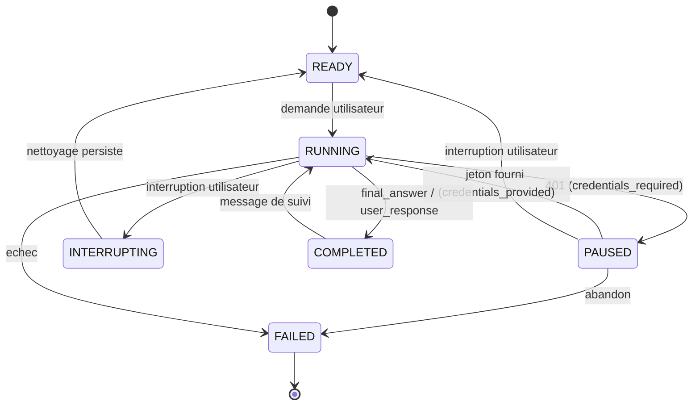

# ADR-025 — Pause sur erreur d'authentification : un 401 suspend la session au lieu de la terminer

**Statut** : accepté (2026-09-19) — amende [ADR-007](ADR-007-amendements-machines-a-etats.md) (machine de session) et la politique d'échec de §7.2 pour le seul `AUTHN_ERROR` ; s'appuie sur [ADR-016](ADR-016-politique-de-reprise.md) (le message sortant en attente et sa reprise) et complète [ADR-024](ADR-024-profils-de-modele.md) (`token_env`, jeton absent)

## Contexte

`AUTHN_ERROR` est aujourd'hui une erreur non rejouable comme une autre : §7.1 ne la liste pas parmi les types rejouables, le `FailureManager` décide `fail`, l'orchestrateur écrit le `FailureRecord`, échoue le cycle, échoue la conversation, passe la session `FAILED` et ferme la conversation distante. Tout ce que l'utilisateur avait construit disparaît en une décision : les cycles consommés, les commandes déjà exécutées, le contexte déjà payé, le diagnostic à moitié fait. Et cela pour la seule faute de la taxonomie qu'un **utilisateur** peut réparer en dix secondes, sans que le modèle, le réseau ni l'application aient quoi que ce soit à changer : un jeton expiré ou absent.

Deux faits techniques cadrent la décision.

1. **Le jeton n'est jamais dans le fichier** (ADR-004) : `transport.token_env` nomme une variable d'environnement, et `TransportSection.token` la relit **au moment de l'appel**. Fournir un nouveau jeton, c'est écrire une variable — rien à reconstruire, rien à réinjecter. La règle d'ADR-024 §2 (« un seul modèle par processus, en changer c'est redémarrer ») n'est pas touchée : le modèle ne change pas, son jeton oui.
2. **La reprise existe déjà.** ADR-016 traite le cas « POST envoyé, pas de GET » : une conversation `WAITING_MODEL_RESPONSE` dont le message sortant est persisté se reprend en rejouant le POST s'il n'a pas été confirmé (idempotent par `message_id`, ADR-004), puis en lisant d'abord. `pending_outbound_of` sait retrouver ce message. Une session arrêtée sur un 401 a **exactement cette forme** : un message posté ou non, sans réponse. Il n'y a donc pas de mécanique de reprise à inventer, seulement un état à ne pas perdre.

Il manque le troisième terme : un front de bureau arrive (ADR-018, ADR-024) et veut une pop-in « votre jeton a expiré, en voici un nouveau » qui **ne perde pas le fil**. Aujourd'hui cette pop-in n'aurait rien à proposer d'autre que « recommencez tout ».

## Décision

### 1. Un état de session `PAUSED`

`SessionState.PAUSED` s'ajoute à la machine d'ADR-006 / ADR-007. Il n'est **pas terminal**.

- **On n'y entre que depuis `RUNNING`** : seule la boucle peut mettre en pause, parce qu'elle seule sait ce qui était en vol.
- **Trois sorties.** `RUNNING` (l'utilisateur a fourni un jeton), `FAILED` (on renonce — un défaut de persistance pendant l'interruption, ou une décision explicite), et `READY` **directement** quand l'utilisateur interrompt une session en pause.
- **Pourquoi `PAUSED → READY` et non `PAUSED → INTERRUPTING`.** `INTERRUPTING` existe pour couvrir la fenêtre où la boucle se déroule encore : on annule le jeton d'interruption, on abandonne les appels en vol, on attend le drain borné des sous-processus, et l'état dit « le nettoyage est en cours ». Une session en pause n'a **rien de tout cela** : sa boucle est terminée (la tâche s'est achevée proprement), aucun appel n'est en vol, aucun processus ne tourne — le drain est vide par construction. Passer par `INTERRUPTING` serait écrire un état qui n'a rien à faire, et deux événements au lieu d'un. `InterruptionHandler.interrupt` s'applique donc sans modification : elle ne fait sa transition `→ INTERRUPTING` que depuis `RUNNING`, puis balaie le stock (conversation `INTERRUPTED`, cycle `INTERRUPTED`, fermeture distante best effort) et termine sur `→ READY`. La session redevient utilisable exactement comme après n'importe quelle interruption (ADR-006 §3 : la demande suivante ouvre une conversation enfant).
- **Aucune migration.** `SessionState` est stocké en texte, le schéma SQLite reste en version 1 et **aucune colonne n'est ajoutée** : la raison de la pause se relit dans le dernier `FailureRecord` (§7).

### 2. Ce qui met en pause — et ce qui n'y met pas

La décision est prise là où sont prises toutes les autres, dans `FailureManager.decide`, **indexée sur `error_type`** comme le veut §7.1, jamais sur le drapeau `retryable` du producteur. Un cinquième `DecisionKind` apparaît : `pause`.

| `error_type` | décision | pourquoi |
|---|---|---|
| `AUTHN_ERROR` (401) | **`pause`**, raison `credentials_required` | le serveur dit « je ne sais pas qui tu es » : il manque un jeton, et l'utilisateur l'a |
| `AUTHZ_ERROR` (403) | `fail`, `non_retryable:AUTHZ_ERROR` — inchangé | le serveur dit « je sais qui tu es, et tu n'as pas le droit » |

**Un 403 ne met pas en pause.** Les identifiants ont été acceptés ; c'est l'opération qui est refusée. Un autre jeton de la même identité obtiendra le même 403, et l'utilisateur à qui l'on demanderait un jeton fournirait quelque chose qui ne peut pas aider : on échangerait une erreur claire contre une attente indéfinie, ce qui est pire que l'échec. Si un déploiement constate que *son* 403 signifie en réalité « clé expirée », c'est le `classify_error` de son provider qui le reclasse en `AUTHN_ERROR` (ADR-020) — la politique reste nette, c'est la traduction HTTP qui s'ajuste.

**Où la pause s'applique.** À tout appel distant passé sous la politique d'échec (`_SessionRun._call`) : `INIT`, `POST`, `GET`. Pas à la rotation (ADR-014), dont les appels ne sont ni rejoués ni soumis à une décision : une rotation est déjà une manœuvre de sauvetage tout-ou-rien, et s'interrompre au milieu laisserait deux conversations à moitié construites. Un 401 pendant une rotation échoue donc comme avant (point ouvert 2).

**Ce que la pause ne change pas au journal.** Le `FailureRecord` est écrit et `failure.recorded` publié **exactement** comme aujourd'hui ; la décision est persistée dans un `RetryDecisionRecord` (`decision = "pause"`, colonne texte, pas de changement de schéma) ; aucun `retry.scheduled` n'est publié ; le disjoncteur n'est pas nourri, `AUTHN_ERROR` n'étant pas une faute de classe transport (§7.4). Un opérateur qui lit le journal voit la même trace qu'avant, suivie d'une pause au lieu d'une fin.

### 3. Ce qui est préservé : tout

La pause n'écrit **rien d'autre** que l'état de la session. Ligne à ligne :

| Ce qui existait | Ce que la pause en fait |
|---|---|
| Le message sortant `M` persisté (`post_confirmed` vrai ou faux) | intact — `pending_outbound_of` le retrouve, c'est le point d'entrée d'ADR-016 |
| La conversation (`WAITING_MODEL_RESPONSE`, curseur, `context_bytes`, compteurs) | intacte — aucune transition, aucun champ touché |
| Le cycle ouvert | reste `RUNNING`, et n'est **pas** recompté à la reprise (`consumed_cycles` ne bouge pas) |
| La conversation distante | **pas fermée** — c'est la différence visible avec un échec, qui la ferme best effort |
| `SessionRecord.last_failure_id` | pas écrit : ce champ nomme la faute sur laquelle une session s'est terminée, et aucune ne s'est terminée |
| Plans, tâches, blobs, sorties déjà produites | intacts, jamais rejoués (§17.4) |

La boucle se termine **proprement** : `_PausedError` est un signal de contrôle interne, aucune exception ne remonte à l'appelant, la tâche de boucle finit sans `exception()` et `ConversationManager.wait` rend la session `PAUSED` au lieu de lever.

### 4. L'événement `session.paused`

Un nouvel événement audité, **`EventType.SESSION_PAUSED = "session.paused"`**, porte de quoi expliquer la pause sans relire les tables :

| Champ | Contenu |
|---|---|
| `reason` | `credentials_required` |
| `error_code` | le code du refus (`HTTP_401`…) |
| `error_type` | `AUTHN_ERROR` |
| `operation` | `INIT`, `POST` ou `GET` |
| `message_id` | le message `M` en vol — `null` quand la pause tombe sur l'`init`, avant le premier message ; un `protocol_correction_request` ne le remplace jamais (ADR-023 §5) |

Il est publié **après** le `session.state_changed` qui a persisté `PAUSED`, dans cet ordre précis : ADR-015 impose de persister avant de publier, et une interface qui réagit à `session.paused` en relisant la session ne doit jamais la trouver encore `RUNNING`. L'événement voyage dans le flux SSE et entre dans la chaîne d'audit comme tout événement audité (ADR-018).

### 5. La reprise, et pourquoi elle n'est pas bornée

`ConversationManager.resume_session` accepte désormais une session `PAUSED` en plus d'une session `RUNNING` laissée reprenable par le redémarrage :

1. `PAUSED → RUNNING`, raison `credentials_provided` ;
2. `ProtocolOrchestrator.resume_session` (ADR-016) : le POST est rejoué avec le **même** `message_id` s'il n'avait pas été confirmé, sinon la boucle lit d'abord ;
3. la session finit son travail et rend son `final_answer` dans **la même conversation**, avec les mêmes cycles et les mêmes plans.

Cas particulier : une session mise en pause sur l'`init` n'a **rien** à rejouer (aucun message, aucun cycle, conversation encore `ACTIVE` sans identifiant distant). `resume_session` relance alors `run_session`, qui refait l'`init` puis envoie le `user_request` initial — le chemin normal, depuis le début, sans rien avoir perdu non plus.

**Les pauses répétées ne sont pas bornées, et c'est délibéré.** Reprendre sans jeton valide remet en pause, indéfiniment. Trois raisons :

- **rien ne boucle tout seul.** Une pause termine la boucle ; seule une action explicite de l'utilisateur en relance une. Il n'y a donc aucun emballement possible : le rythme est celui d'un humain qui colle un jeton ;
- **rien ne s'accumule.** Une deuxième pause écrit un `FailureRecord` et une décision, et rien d'autre : le même cycle, le même message sortant, la même conversation. Le coût d'un essai de plus est constant et minuscule ;
- **une borne serait exactement la perte que cet ADR supprime** : « au troisième jeton mal collé, votre session meurt » est la règle contre laquelle il est écrit.

Ce qui borne réellement, c'est le budget de session (ADR-012), inchangé et toujours mesuré en temps réel : `max_total_duration_ms` court pendant la pause comme pendant le reste. Une session laissée en pause très longtemps échoue au prochain contrôle de durée, en `BUDGET_EXCEEDED` — un échec normal, lisible, et qui dit la vérité (la session a bien duré trop longtemps).

### 6. Le jeton : `credentials.py`, et la règle « jamais journalisé »

Un module feuille, `src/agentic_local_app/credentials.py`, est le seul endroit autorisé à écrire le jeton. Il prend la `TransportSection` du profil concerné (`config.transport` est le profil actif, ADR-024) et un `environ` injectable qui vaut `os.environ` par défaut :

| Fonction | Contrat |
|---|---|
| `set_token(section, value, environ=None)` | écrit `value` **détouré** dans la variable nommée par `section.token_env` ; `ConfigError("CREDENTIALS_EMPTY")` si la valeur est vide ou blanche, `ConfigError("CREDENTIALS_NOT_CONFIGURED")` si le profil ne nomme aucune variable |
| `clear_token(section, environ=None)` | supprime la variable (absente n'est pas une erreur) ; même refus si le profil n'en nomme aucune |
| `has_token(section, environ=None) -> bool` | y a-t-il un jeton non blanc **maintenant** ; `False` pour un profil sans variable, qui n'en a pas et n'en a pas besoin (`config.requires_credentials` répond à la question complémentaire) |
| `token_variable(section) -> str` | le **nom** de la variable, détouré |

**La valeur n'est jamais journalisée.** Aucune fonction ne la renvoie, ne la trace, ne la met dans un `payload` d'événement ni dans les `details` d'une erreur ; le module n'en garde aucune copie et n'expose aucun lecteur. Seul le **nom** de la variable circule — il est déjà public (`config.toml`, `ModelProfileView`, la sortie de `config show`). Les deux refus portent au plus `variable`, `field` et `provider`. C'est la raison d'être du module autant que son comportement, et c'est épinglé par des tests qui relisent tout ce que le module peut émettre (journaux, JSON de l'erreur, message de l'exception).

Comme `TransportSection.token` relit la variable **à chaque appel**, le nouveau jeton est pris en compte par la passerelle dès l'appel suivant, sans reconstruire le transport : ADR-024 §2 tient, on ne change pas de modèle en cours de route, on lui donne de quoi répondre.

### 7. Ce que les interfaces lisent

`ConversationManager.paused_reason(session_id)` rend `{reason, error_code, error_type, operation, since}` — lu dans le dernier `FailureRecord` de la session (celui sur lequel la pause a été décidée) et dans l'enregistrement de session (`updated_at`, l'instant de la pause) —, ou `None` si la session est inconnue ou n'est pas en pause. De quoi écrire la pop-in : « la lecture de la réponse du modèle a été refusée (HTTP 401) il y a trois minutes ; collez un nouveau jeton ». Rien de plus, et surtout rien du jeton.

## Conséquences

- **Code** : `domain/states.py` (`SessionState.PAUSED`), `domain/transitions.py` (`SESSION_TRANSITIONS`), `domain/events.py` (`SESSION_PAUSED`), `resilience/failure_manager.py` (`DecisionKind` gagne `pause`, `PAUSING_ERROR_TYPES`, `CREDENTIALS_REQUIRED_REASON`), `orchestration/protocol_orchestrator.py` (`_PausedError`, `_SessionRun._pause`, `REASON_CREDENTIALS_REQUIRED` / `REASON_CREDENTIALS_PROVIDED`), `orchestration/conversation_manager.py` (`resume_session` élargi, `paused_reason`), et le nouveau `credentials.py`. `interruption/handler.py`, `orchestration/recovery.py`, `persistence/*` et `context/rotation.py` ne changent pas : une session `PAUSED` n'est ni active ni terminale, le redémarrage la laisse telle quelle avec son message en attente, et `resume_session` la reprend après coup.
- **Tests** : `tests/integration/test_phase9_pause.py` (401 sur le POST, sur le GET, sur l'`init` ; reprise jusqu'au `final_answer` ; reprise sans jeton valide ; interruption d'une session en pause ; 403 qui échoue toujours ; `paused_reason`), `tests/unit/test_phase7_resilience.py` (la décision `pause`, `AUTHN_ERROR` sorti de la liste des types non rejouables, le 403 qui y reste), `tests/unit/test_phase1_state_machines.py` (la table, les trois sorties, la non-terminalité), `tests/unit/test_phase11_credentials.py` (le module et la règle du silence), `tests/integration/test_phase9_orchestration.py` (l'ancien cas 401 devient le cas 403), `tests/integration/fake_manager.py` (`paused_reason`, et un helper `pause()` pour les tests d'interface).
- **CLI** : `agentic-app run` doit apprendre l'état. Ses conditions d'arrêt (`_TERMINAL_SESSION_STATES`, la sortie sur `READY`) ne connaissent que `COMPLETED`, `FAILED` et `READY` : une session mise en pause n'en sort par aucune, et la boucle d'affichage tourne à vide. `run` doit s'arrêter sur `PAUSED`, afficher ce que rend `paused_reason` et sortir sur un code dédié — ou proposer de coller un jeton et d'appeler la reprise. C'est fait : `run` s'arrête sur `PAUSED`, affiche ce que rend `paused_reason` et les deux commandes à lancer, puis sort sur le code 3 ; `agentic-app credentials` (jeton lu sur l'entrée standard ou dans une variable nommée, jamais en argument de ligne de commande) et `agentic-app resume <sid>` ferment le chemin. Un test borne le nombre d'appels d'attente : la boucle à vide ne peut plus revenir sans être vue.
- **API** : trois surfaces, écrites hors de cet ADR et désormais en place — `POST /credentials`, `GET /sessions/{id}/pause`, `POST /sessions/{id}/resume`, fixées par [`docs/contracts/front-backend-v1.md`](../contracts/front-backend-v1.md). Une route qui reçoit le jeton et appelle `credentials.set_token` (le corps porte un secret : il ne doit apparaître ni dans un journal d'accès, ni dans une trace d'erreur, ni dans le corps de la réponse) ; une lecture de `paused_reason` pour la pop-in ; une reprise qui appelle `resume_session`. `session.paused` circule déjà dans le flux SSE, donc le front peut ouvrir sa pop-in sans scruter l'état.
- **Compatibilité** : aucun message du protocole ne change, aucun schéma de persistance ne change (version 1, aucune colonne ajoutée), aucune configuration nouvelle. Le seul changement de comportement observable est celui qui est voulu : une session qui recevait un 401 finissait `FAILED` et finit maintenant `PAUSED`. Tout code qui énumère les états de session doit prévoir `PAUSED` — c'est le seul point d'attention pour un consommateur existant, et il est volontairement visible plutôt que masqué derrière un état existant réutilisé.
- **Points ouverts** :
  1. **La CLI — résolu.** `run` s'arrête sur `PAUSED`, affiche la raison et sort sur le code 3 ; `agentic-app credentials` et `agentic-app resume <sid>` donnent le chemin complet en ligne de commande.
  2. **Rotation.** Un 401 pendant une rotation (ADR-014) échoue toujours la session : les appels de la rotation ne passent pas par la politique d'échec. Mettre en pause au milieu d'une rotation demanderait de savoir reprendre une rotation à mi-chemin, ce qu'aucune règle ne décrit aujourd'hui.
  3. **Durée et pause.** `max_total_duration_ms` continue de courir pendant la pause (§5). C'est cohérent avec ADR-012 (le budget est du temps réel) mais discutable pour une pause longue ; si le cas se présente, la réponse sera de décompter le temps passé en `PAUSED`, ce qui suppose un champ persisté et donc une migration.
  4. **Plusieurs profils — tranché.** `POST /credentials` n'accepte que le profil **actif** : un processus ne sert qu'un modèle (ADR-024 §2), donc renseigner le jeton d'un profil inactif n'a aucun client. `credentials.set_token`, lui, reste général et accepte n'importe quelle section.
