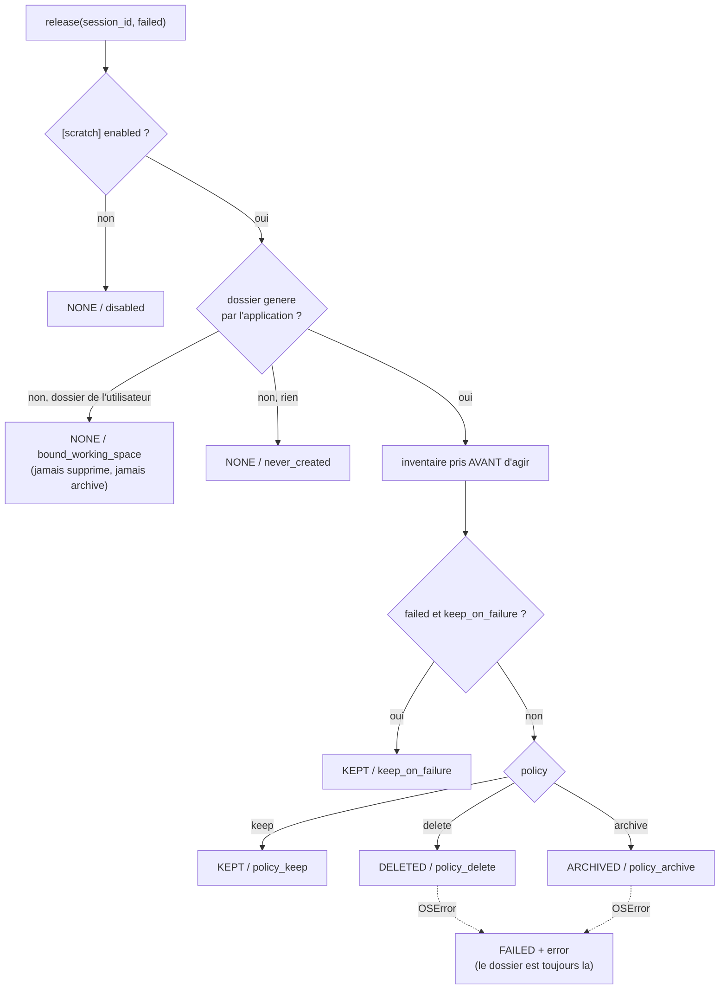

# ADR-026 — Espace de travail par session et fichiers temporaires : où les commandes du modèle ont le droit d'écrire, et ce qu'il en reste

**Statut** : accepté (2026-09-19) — complète [ADR-003](ADR-003-plateformes-cibles.md) (les deux seuls réglages d'environnement de l'application étaient `shell` et `cwd` ; il y en a maintenant un troisième, offert et non imposé) et [ADR-018](ADR-018-api-pour-un-front-et-flux-live.md) (ce que le front de bureau appelle « working space ») ; sans effet sur le protocole et sur le schéma persisté

## Contexte

**L'application n'écrit aujourd'hui aucun fichier.** Les sorties des commandes sont capturées en mémoire (`RawExecution.stdout` / `stderr`), tronquées par le `PayloadGuard` puis rangées dans des blobs SQLite : tout le résultat d'une session tient dans une base et dans un journal d'audit. C'est une propriété qu'on veut garder — elle est ce qui rend une session rejouable et auditable.

**Les commandes du modèle, elles, écrivent.** Un `mvn clean install`, un `git clone`, un `tar -xzf`, un simple `foo > out.json` produisent des fichiers, et ces fichiers atterrissent là où pointe `[execution] cwd` — c'est-à-dire, par défaut, dans le répertoire courant du processus. Personne ne les nettoie, personne ne sait les lister, et rien ne dit au modèle où il aurait le droit d'écrire sans salir le projet de l'utilisateur. Trois manques en un :

1. **aucun endroit désigné** : le modèle qui veut un fichier intermédiaire invente un chemin (`/tmp/x`, `./tmp`, le répertoire courant), donc un chemin différent à chaque fois, parfois non portable (`/tmp` n'existe pas sous Windows, ADR-003) ;
2. **aucun nettoyage** : ce qui est écrit reste, pour toujours, mélangé au projet ;
3. **aucune trace** : à la fin d'une session, on ne peut pas répondre à la question « qu'est-ce que tu as laissé derrière toi ? », alors que c'est exactement ce qu'un utilisateur veut savoir avant de relancer quoi que ce soit.

Et il y a une demande qui arrive d'en face : **le front de bureau a un champ « Working folder »** à l'étape 2 de sa connexion (dossier de travail optionnel, « sur lequel le modèle va intervenir ») et attend une notion de `working_space` côté application. Son contrat d'interface la classe « besoin nouveau, ne pas coder tant que le contrat n'est pas fixé des deux côtés ». Les deux sujets — le dossier de travail choisi par l'utilisateur et le dossier temporaire d'une session — sont le même sujet vu de deux endroits, et il faut décider lequel gagne quand les deux existent.

## Décision

### 1. Une section `[scratch]` et un dossier par session

Une nouvelle section de configuration, six clés, aucun secret :

| Clé | Défaut | Rôle |
|---|---|---|
| `enabled` | `true` | `false` : aucun dossier créé, aucune variable exportée — le comportement d'avant cet ADR, à l'octet près |
| `root` | `./data/scratch` | parent des dossiers par session : `<root>/<session_id>` |
| `policy` | `delete` | sort d'un dossier **généré** à la fin de sa session : `delete`, `keep`, `archive` |
| `archive_root` | `./data/scratch-archive` | destination de `archive` : `<archive_root>/<session_id>-<horodatage>` ; validé **hors de** `root`, sinon une archive se lirait comme un dossier de session |
| `keep_on_failure` | `true` | une session en échec garde son dossier quoi que dise `policy` |
| `max_inventory_entries` | `200` | borne de l'inventaire **rendu** (pas de ce qui est parcouru) |

Le dossier d'une session est **créé à la première utilisation**, pas au démarrage : une session qui n'exécute aucune commande ne crée rien. Sur POSIX il est ramené à `0700` (lecture, écriture et traversée par le seul propriétaire) ; sous Windows le `chmod` n'a pas ce sens et n'est pas appliqué (ADR-003). `ScratchManager` porte tout cela : horloge injectée (ADR-017, utilisée pour le seul horodatage d'archive), aucun état global, aucune connaissance de l'orchestration.

### 2. Le dossier est **offert**, pas imposé : `cwd` ne change pas

Deux façons de donner le dossier à une commande : y placer son répertoire de travail (`cwd`), ou le nommer dans son environnement. **On garde `[execution] cwd` et on exporte des variables.**

Les commandes du modèle portent sur le **projet de l'utilisateur**, pas sur un dossier temporaire. Un `discovery_plan` commence par regarder où il est (`ls`, `git status`, `uname -a`) ; un plan d'exécution compile, teste, lit des fichiers de configuration. Basculer `cwd` sur un dossier vide par session rendrait la moitié de ces commandes fausses — non pas en erreur, ce qui serait visible, mais **silencieusement inutiles** : un `git status` dans un dossier vide répond « pas un dépôt », et le modèle en tirerait une conclusion sur le projet de l'utilisateur. Ce serait une réécriture implicite de l'intention d'une commande, exactement ce que §1 et ADR-003 §3 interdisent.

L'environnement, lui, est additif : il ne change aucune commande existante, et une commande qui veut un fichier temporaire y va explicitement (`cd "$AGENTIC_SCRATCH_DIR"`, `> "$AGENTIC_SCRATCH_DIR/out.json"`). Le dossier est disponible pour qui le demande, invisible pour qui ne le demande pas.

**Trois variables**, ajoutées à l'environnement hérité de chaque commande :

| Variable | Contenu |
|---|---|
| `AGENTIC_SCRATCH_DIR` | le dossier de travail de la session |
| `AGENTIC_WORKING_SPACE` | **le même dossier** |
| `AGENTIC_SESSION_ID` | l'identifiant de session, pour qu'une commande puisse nommer ses propres sorties |

**Pourquoi deux noms pour un dossier.** `AGENTIC_SCRATCH_DIR` est l'habitude du shell, à côté de `TMPDIR` et `TMP` : c'est le nom que le modèle va produire spontanément. `AGENTIC_WORKING_SPACE` est le vocabulaire du front (le champ « Working folder », le `working_space` de son contrat d'interface) : c'est le nom que l'utilisateur voit à l'écran et donc celui qu'il emploiera en parlant au modèle. Choisir un seul des deux, c'est obliger l'autre côté à traduire à chaque fois, et obliger le modèle à deviner quel nom porte cette version-là. Le coût de les exporter tous les deux est d'une entrée de dictionnaire ; le coût de se tromper est une commande qui écrit à côté. On paie l'entrée de dictionnaire.

Côté code, **rien n'est ajouté à la frontière shell** : `CommandSpec` avait déjà un champ `env` (« extra environment variables merged over the inherited environment ») que `SubprocessCommandExecutor` fusionne avant le lancement. Le `PlanRunner` le remplit, l'exécuteur ne change pas d'une ligne, et sans gestionnaire d'espaces de travail le champ reste `None` — la forme publique de l'exécuteur est strictement celle d'avant.

### 3. `working_space` : on ne supprime jamais ce qu'on n'a pas créé

`ScratchManager.bind(session_id, working_space)` remplace le dossier généré d'une session par un dossier que l'**utilisateur** possède — le champ « Working folder » du front. Ce dossier :

- est utilisé **tel quel** : il n'est pas créé, ses permissions ne sont pas touchées (pas de `0700` sur le dossier de quelqu'un d'autre) ;
- n'est **jamais** supprimé ni archivé, quelle que soit `policy`. La règle n'a pas d'exception et pas de réglage : un utilisateur qui désigne `~/projets/client` ne doit pas avoir à lire la documentation d'une politique de nettoyage pour savoir que son dossier survivra.

Un chemin refusé l'est bruyamment, avec `ConfigError("WORKING_SPACE_INVALID", path=…, reason=…)` — `blank`, `not_absolute`, `does_not_exist`, `not_a_directory`, `unreadable`. C'est une valeur que l'utilisateur a tapée : la deviner (créer le dossier manquant, résoudre un chemin relatif contre un répertoire courant qu'il ne voit pas) serait pire que la refuser. `~` est développé, le reste doit être absolu.

Cas limite tranché : une session liée **après** qu'un dossier a déjà été généré pour elle garde son dossier généré nettoyé selon la politique, et son dossier lié intact. La règle reste littérale — la politique s'applique à ce que l'application a fabriqué, et à rien d'autre.

### 4. L'inventaire : de quoi répondre « qu'as-tu laissé ? »

`inventory(session_id)` rend les fichiers présents dans l'espace de travail : `relative_path` (toujours en séparateurs `/`, une seule orthographe des deux côtés d'ADR-003), `size_bytes`, `modified_at` (UTC). Trié par chemin, borné par `max_inventory_entries`, avec un drapeau `truncated`.

Deux précisions volontaires :

- la valeur rendue est un **`ScratchInventory`** (`entries` + `truncated`), pas une liste nue : une liste ne peut pas porter son propre drapeau de troncature, et une borne invisible est une borne qui ment ;
- la borne porte sur ce qui est **rapporté**, pas sur ce qui est parcouru : le dossier est listé et trié en entier avant d'être coupé, pour que la tête rendue soit déterministe (ADR-017) plutôt que dépendante de l'ordre que le système de fichiers a bien voulu donner.

L'inventaire ne lève jamais : une entrée illisible ou disparue est ignorée. Un audit de ce qui a été laissé ne doit pas pouvoir casser celui qui le demande.

### 5. Les trois politiques, `keep_on_failure`, et la fin de session

**`keep_on_failure` gagne sur `delete` et sur `archive`.** Une session qui a échoué est précisément celle dont on veut regarder les fichiers : le fichier de sortie à moitié écrit, le journal de build, le `core` dump. Supprimer au moment où le diagnostic commence serait la pire des politiques par défaut ; déplacer dans une archive aussi, parce que le chemin que la commande a affiché dans ses logs ne pointerait plus sur rien.

**Un nettoyage ne fait jamais échouer une session.** `release` ne lève pas : une erreur du système de fichiers devient une issue `FAILED` portant `error`, le dossier reste en place et l'appelant continue. Une session qui a fini son travail ne doit pas être cassée après coup par un fichier verrouillé — d'autant que le nettoyage arrive *après* que tout ce qui compte a été persisté.

**Ce que rend `release`** : ce qui a été fait (`action`), pourquoi (`reason`), le dossier concerné, la destination d'une archive, l'erreur éventuelle, et **l'inventaire pris juste avant d'agir** — de sorte qu'un dossier supprimé reste racontable. Tout est sérialisable en JSON, pour qu'une interface puisse l'afficher et qu'un enregistrement d'audit puisse le porter le jour où on le décidera.

### 6. Ce qui est câblé, et ce qui ne l'est pas

`build_application` construit le `ScratchManager` à partir de `[scratch]` et l'expose en `Application.scratch` ; le `PlanRunner` le reçoit et remplit l'environnement de chaque tâche `cmd` ; `Application.close()` et `Application.aclose()` appellent `release_all()`, donc un processus qui s'arrête ne laisse jamais ses propres dossiers derrière lui. **Rien n'est créé au câblage** : la première commande d'une session crée son dossier.

Il manque le crochet **par session** : `scratch.release(session_id, failed=…)` au moment où une session devient terminale, et `scratch.bind(session_id, working_space)` au moment où elle démarre. Les deux vivent dans le cycle de vie de session, c'est-à-dire dans l'orchestrateur, qui n'est pas modifié par cet ADR (point ouvert 1).

## Conséquences

- **Code** : nouveau `execution/scratch.py` (`ScratchManager`, `ScratchFile`, `ScratchInventory`, `ScratchOutcome`, `ScratchAction`, les noms de variables et les codes de raison) ; `config.py` (`ScratchSection`, ajoutée à `AppConfig`, avec le refus d'un `archive_root` imbriqué avec `root`) ; `execution/plan_runner.py` (paramètre `scratch=`, remplissage de `CommandSpec.env`) ; `orchestration/wiring.py` (`Application.scratch`, `Application.release_working_spaces()`, `close` / `aclose`, paramètre d'injection `scratch=`). `execution/executor.py` et `execution/platform.py` **ne changent pas** : `CommandSpec.env` existait et l'exécuteur le fusionnait déjà — seule la documentation dit maintenant ce qu'il transporte.
- **Configuration** : `config.toml` gagne `[scratch]`, commentée clé par clé, identique aux défauts du code (le test qui le vérifie couvre la nouvelle section).
- **Persistance** : aucun changement. Aucune colonne, aucune table, aucune migration ; le schéma SQLite reste en version 1. L'espace de travail est un fait du système de fichiers, pas un enregistrement.
- **Protocole** : aucun changement. Le modèle découvre les variables comme il découvre le reste de son environnement (§17.5, ADR-003 §3) ; les annoncer dans les instructions du protocole est possible plus tard, et se décidera avec le texte d'ADR-004.
- **Ce que ça change pour un modèle qui écrit des fichiers** : il a enfin un endroit désigné, portable (une variable, pas `/tmp`), isolé par session, et dont il peut se servir sans salir le projet de l'utilisateur ; ses commandes continuent de tourner dans `cwd`, donc rien de ce qu'il fait aujourd'hui ne change de sens ; et ce qu'il laisse dans ce dossier est listable et, par défaut, supprimé à la fin — sauf si la session a échoué, auquel cas il reste à disposition pour le diagnostic.
- **Tests** : `tests/unit/test_phase11_scratch.py` (création paresseuse et permissions, identifiant de session qui ne peut pas sortir de `root`, les deux variables et l'identifiant, l'inventaire avec sa borne, son drapeau et ses séparateurs `/`, les trois politiques, `keep_on_failure` contre `delete` et contre `archive`, le dossier lié épargné par toutes les politiques et ses cinq refus, un nettoyage qui échoue rapporté et non levé — permission refusée, dossier disparu, destination d'archive occupée —, `enabled = false` qui ne crée rien, et une commande réelle marquée `real_subprocess` qui relit les trois variables) ; `tests/unit/test_phase5_plan_execution.py` (l'`env` du `CommandSpec` porte l'espace de travail, `cwd` ne bouge pas ; sans gestionnaire l'`env` reste `None`). Tout se passe sur `tmp_path`, jamais sur le vrai `./data`.
- **Attention pour les bancs de test existants** : `tests/integration/phase9_rig.py` construit sa configuration avec les défauts de `[scratch]` et exécute de vrais plans sur un exécuteur double ; il crée donc `./data/scratch/<session_id>` en marge de la suite (répertoire vide, ignoré par git). Une ligne dans `make_config` — `scratch=ScratchSection(enabled=False)`, ou une racine sous le `tmp_dir` du banc — le remet à zéro ; le fichier n'appartient pas à cet ADR. C'est fait : `make_config` désactive `[scratch]` par défaut et les deux bancs qui l'activaient l'enracinent sous leur propre dossier temporaire ; une suite complète laisse `./data` vide.
- **Points ouverts** :
  1. **Le crochet de fin de session — résolu.** `ConversationManager.start_session` appelle `bind`, et `release(session_id, failed=…)` est appelé une seule fois, dans le rappel de fin de la boucle de session, après toute persistance — un seul site d'appel plutôt qu'un par transition terminale, symétrique du `bind`, et qu'une nouvelle branche d'échec ne peut pas oublier. Un nettoyage qui échoue est journalisé, jamais levé.
  2. **Le `working_space` du protocole — tranché.** Il voyage comme paramètre de **création de session** : `POST /sessions` porte un champ `working_space` optionnel, validé par `bind` (`400 WORKING_SPACE_INVALID`, avec la raison du refus). Ni le protocole ni le schéma persisté ne bougent ; le contrat le fixe ([`docs/contracts/front-backend-v1.md`](../contracts/front-backend-v1.md)).
  3. **Aucun bac à sable.** Les variables disent au modèle où il *peut* écrire ; rien ne l'empêche d'écrire ailleurs. Un vrai confinement (montage, conteneur, restriction des chemins) est un autre sujet, avec d'autres conséquences sur ADR-003.
  4. **Aucun quota.** Ni taille maximale, ni nombre de fichiers, ni nombre de dossiers conservés par `keep` / `archive`. Une session peut remplir le disque, et une racine d'archive croît sans borne. Les premières réponses probables : une taille maximale vérifiée à l'inventaire, et une rotation par âge de `archive_root`.
  5. **L'inventaire n'est ni publié ni persisté.** Il est calculé à la demande et rendu dans l'issue de `release` ; le porter dans un événement audité, ou dans le `execution_result` rendu au modèle, demande de décider de sa taille dans un message (ADR-010) — donc un ADR de plus.
