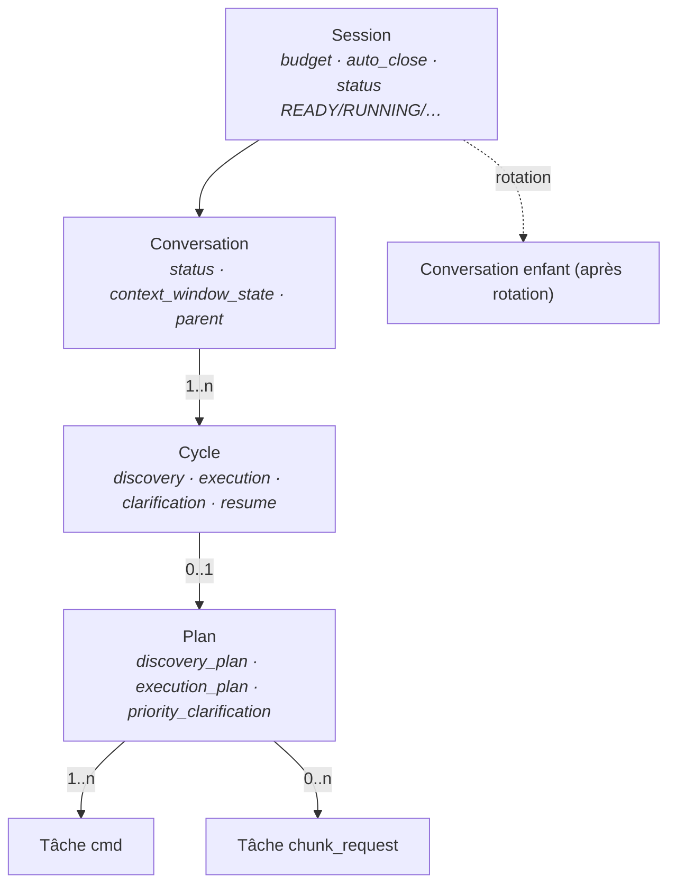
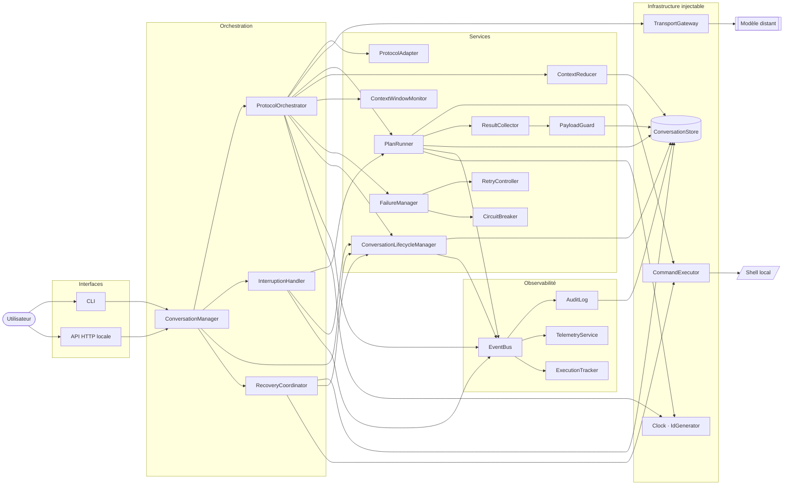
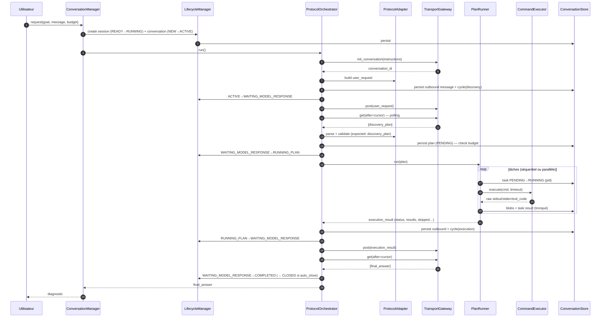

# Architecture — vue d'ensemble

Ce document est la carte. Chaque sujet a ensuite son document détaillé :

| # | Document | Sujet |
|---|---|---|
| 01 | [Machines à états](01-state-machines.md) | session, conversation, cycle, plan, tâche, fenêtre de contexte, circuit breaker |
| 02 | [Protocole](02-protocol.md) | grammaire, catalogue de messages, table des messages attendus, schémas étendus, séquences |
| 03 | [Modèle d'exécution](03-execution-model.md) | PlanRunner, ordonnancement parallèle, conditions d'arrêt, annulation et drain, PayloadGuard, ResultCollector |
| 04 | [Persistance et audit](04-persistence-and-audit.md) | modèle de données, store, blobs, chaîne d'audit, checkpoints |
| 05 | [Transport et échecs](05-transport-and-failures.md) | contrat d'endpoints, classification, FailureManager, retries, circuit breaker |
| 06 | [Rotation de contexte](06-context-rotation.md) | moniteur de saturation, ContextReducer, séquence de rotation, échec explicite |
| 07 | [Interruption et reprise](07-interruption-and-recovery.md) | InterruptionHandler, drain, RecoveryCoordinator |
| 08 | [Observabilité](08-observability.md) | EventBus, catalogue d'événements, snapshot, métriques |
| 09 | [Module map](09-module-map.md) | paquets Python, classes, règles de dépendance, doubles de test |

## 1. Ce que fait le système, en une phrase par acteur

Le **modèle distant** planifie : il reçoit une demande, répond par un plan de commandes, reçoit les résultats, répond par un autre plan ou par une réponse finale. L'**application** exécute : elle envoie et lit les messages, valide qu'ils respectent le protocole, lance les commandes, mesure et tronque les sorties, persiste chaque changement d'état avant d'agir, audite tout, et s'arrête proprement sur interruption, budget épuisé ou échec. L'**utilisateur** pose une question, regarde l'état, et peut tout arrêter.

## 2. Les cinq niveaux d'objets

- La **session** est l'unité utilisateur : une demande, un budget, une chaîne de conversations. Elle porte l'état `READY` (ADR-006, ADR-012).
- La **conversation** est l'unité de contexte côté modèle : un `conversation_id` distant, un compteur d'octets échangés, un état de fenêtre de contexte. La rotation en crée une nouvelle, fille de la précédente.
- Le **cycle** est un tour de protocole : un message sortant, la réponse du modèle, et le traitement de cette réponse (exécution du plan, ou finalisation).
- Le **plan** est l'unité d'exécution : au plus un plan actif à la fois.
- La **tâche** est l'unité de travail : une commande, ou une lecture de sortie stockée.

## 3. Les composants et leurs dépendances

Le diagramme de la spec (§13), amendé par les ADR : la persistance des transitions est faite directement par leurs propriétaires (ADR-015), la session apparaît (ADR-006), et les composants injectables sont distingués.

### Responsabilités, en une ligne chacune

| Composant | Responsabilité (spec §3) | Ce que les ADR précisent |
|---|---|---|
| ConversationManager | point d'entrée demandes / interruptions, aucune logique | expose aussi le `RecoveryReport` (ADR-016) |
| ProtocolOrchestrator | boucle protocolaire, budget, coordination | rotation avec retransmission (ADR-014), contrôle de saturation avant POST (ADR-013) |
| ConversationLifecycleManager | seul propriétaire des transitions conversation | et **session** (ADR-006) ; persiste puis publie (ADR-015) |
| InterruptionHandler | drain, marquage INTERRUPTED, audit, READY | INTERRUPTED terminal pour la conversation, READY au niveau session |
| ProtocolAdapter | construire / parser / valider | table des messages attendus (ADR-007), validation structurelle des plans |
| ConversationStore | persistance de tout l'état + blobs | `SessionRecord` (ADR-012), interface synchrone (ADR-001) |
| PlanRunner | exécuter un plan : séquentiel / parallèle, DAG, locks, stop conditions | budget entre tâches (ADR-012), règle effective des drapeaux (ADR-009) |
| CommandExecutor | lancer `cmd`, capturer, timeout, terminer | couche plateforme (ADR-003), `timeout_ms` (ADR-008), pid persisté (ADR-016) |
| ResultCollector | un `execution_result` par plan | ordre du plan, objets `{task_id, reason}` (ADR-009, ADR-017) |
| PayloadGuard | troncature et chunks | algorithme stderr/stdout, plages, plafond message (ADR-010, ADR-011) |
| ContextReducer | résumé structuré borné | assemble le `state_summary` du modèle, réduction par paliers (ADR-005) |
| ContextWindowMonitor | *(nouveau)* HEALTHY / WARNING / SATURATED | métrique en octets (ADR-013) |
| TransportGateway | POST / GET / init / close, gzip, abandon | contrat configurable, polling, idempotence (ADR-004) |
| FailureManager · RetryController · CircuitBreaker | classification, politique, backoff, disjoncteur | backoff déterministe (ADR-017) |
| AuditLog | journal append-only chaîné | hash canonique sha256 (ADR-017) |
| TelemetryService | métriques | compteurs et histogrammes en mémoire, export texte |
| RecoveryCoordinator | reprise après crash | politique par entité, orphelins (ADR-016) |
| ExecutionTracker | snapshot cohérent à tout instant | deux niveaux : session et conversation |
| EventBus | découplage, ordre garanti | synchrone, ordre d'abonnement fixé (ADR-015) |

## 4. Le chemin nominal, de bout en bout

## 5. Les invariants que tout le code respecte

1. **Persister, publier, agir** — jamais dans un autre ordre (ADR-015).
2. **Une transition = une entrée dans une table** (`domain/transitions.py`) ; toute paire absente est rejetée par `InvalidTransitionError`.
3. **Une commande n'est jamais réécrite, jamais relancée** par l'application (spec §1, ADR-008).
4. **Un plan ⇒ zéro ou un `execution_result`** : un si le plan atteint un état terminal autre qu'INTERRUPTED, zéro s'il est interrompu (spec §8.4, §19.9).
5. **Rien n'est envoyé au modèle sans validation de taille** (ADR-010) **ni de saturation projetée** (ADR-013).
6. **Aucune I/O dans `domain`**, aucune horloge ni identifiant aléatoire hors des objets injectés (ADR-017).
7. **Tout ce qui touche l'extérieur a un double de test** et les tests unitaires n'utilisent que les doubles (spec §18.3).
