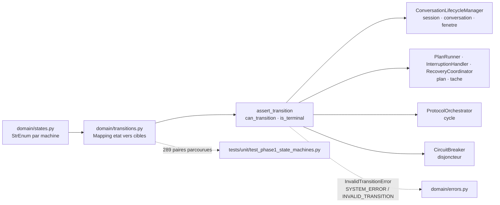
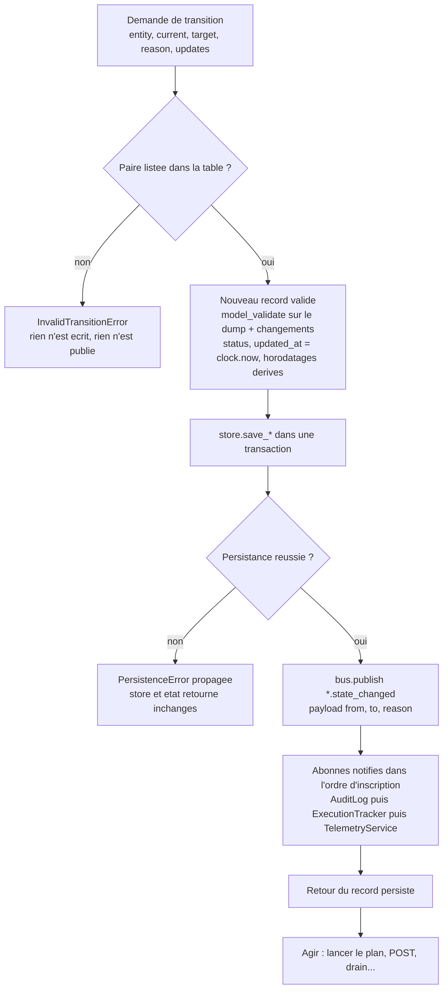
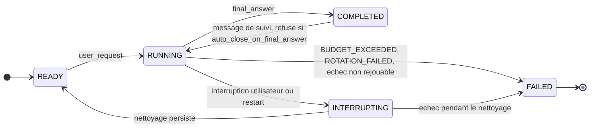
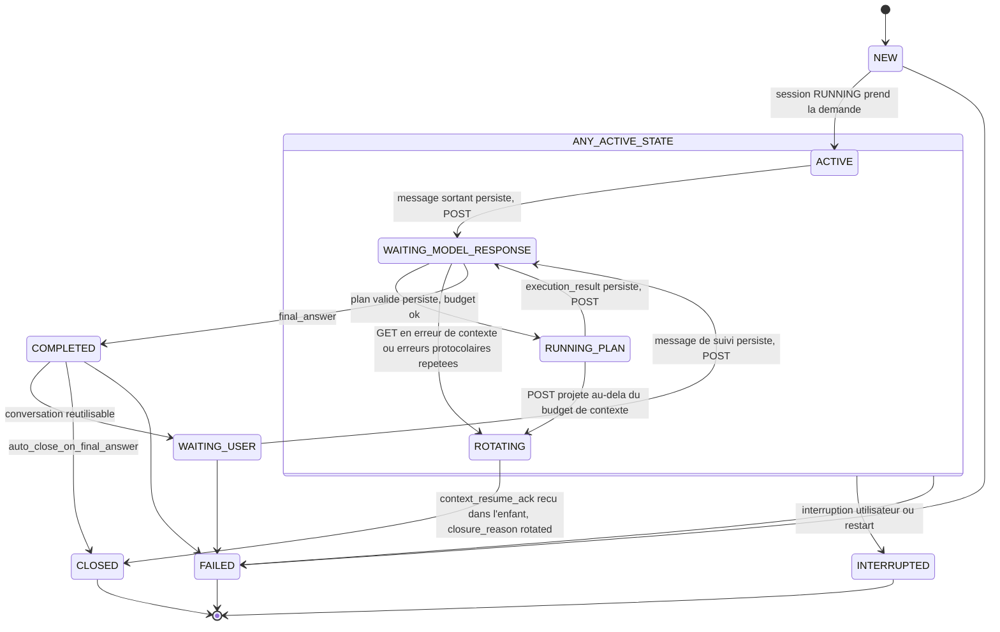
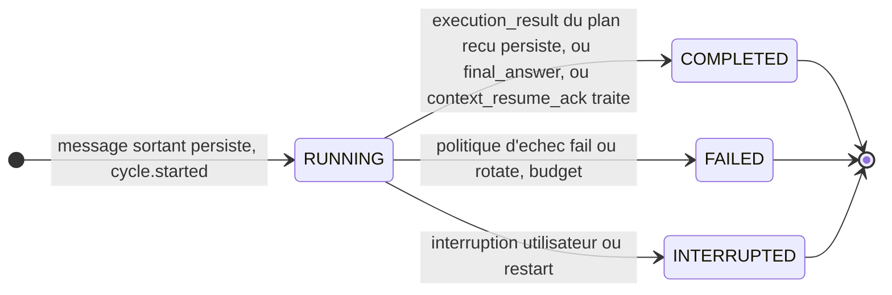
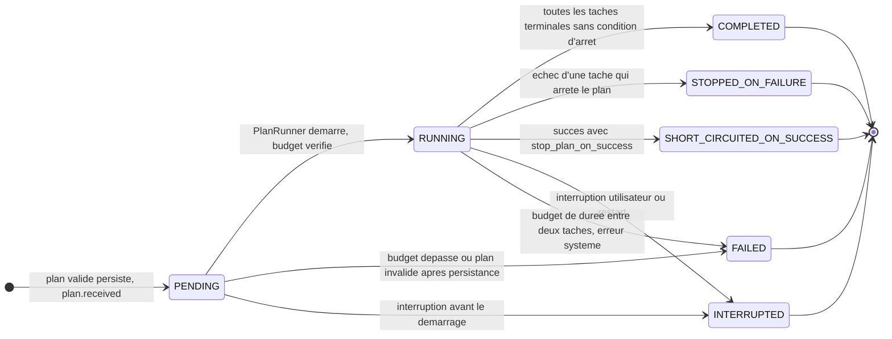
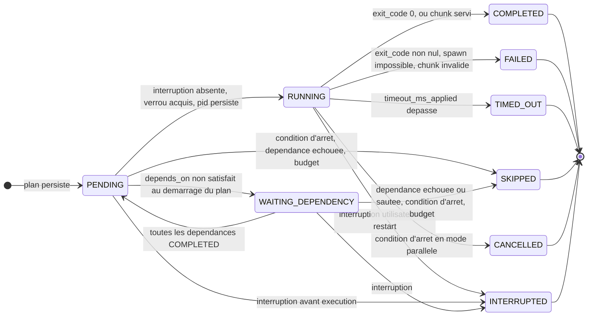
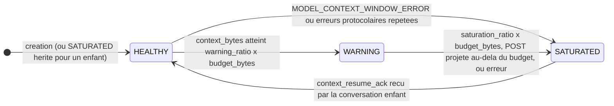
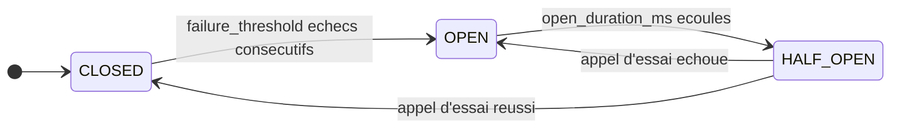

# 01 — Machines à états

**Ce que dit la spec.** Le §5 de [SPEC-v1.1](../spec/SPEC-v1.1.md#5-state-machines) définit quatre machines : conversation (§5.1), plan (§5.2), tâche (§5.3) et fenêtre de contexte (§5.4). Le §7.4 impose un disjoncteur, le §4.1 un `status` de cycle sans en donner les valeurs, et le §17.1 exige que « toutes les transitions soient explicites, gérées par `ConversationLifecycleManager`, et persistées avant d'être exploitées ».

**Ce que précisent les ADR.** [ADR-006](../adr/ADR-006-interruption-nouvelle-conversation.md) rend `INTERRUPTED` terminal pour la conversation et déplace `READY` vers une nouvelle machine de **session** ; [ADR-007](../adr/ADR-007-amendements-machines-a-etats.md) ajoute `WAITING_MODEL_RESPONSE → ROTATING`, `ROTATING → CLOSED`, `PENDING → FAILED` / `PENDING → INTERRUPTED` sur le plan, et crée la machine de **cycle** ; [ADR-013](../adr/ADR-013-metrique-de-saturation.md) ajoute le saut `HEALTHY → SATURATED` ; [ADR-012](../adr/ADR-012-budget-de-session.md) porte le budget sur le `SessionRecord` ; [ADR-015](../adr/ADR-015-persister-avant-publier.md) fixe l'ordre *valider → persister → publier → agir* ; [ADR-008](../adr/ADR-008-timeout-et-retry-de-tache.md) fait de `TIMED_OUT` un échec pour les conditions d'arrêt.

Les sept tables ci-dessous reproduisent **exactement** [`domain/transitions.py`](../../src/agentic_local_app/domain/transitions.py) (60 paires listées sur 289 paires possibles, auto-transitions incluses ; toute paire absente est rejetée). Les états viennent de [`domain/states.py`](../../src/agentic_local_app/domain/states.py). La vue d'ensemble des cinq niveaux d'objets est dans [00-overview](00-overview.md#2-les-cinq-niveaux-dobjets).

## 1. Principes communs à toutes les machines

| Principe | Réalisation | Réf. |
|---|---|---|
| Une transition = une entrée de table | `CONVERSATION_TRANSITIONS`, `SESSION_TRANSITIONS`, `PLAN_TRANSITIONS`, `TASK_TRANSITIONS`, `CYCLE_TRANSITIONS`, `CONTEXT_WINDOW_TRANSITIONS`, `CIRCUIT_TRANSITIONS` : `Mapping[état, frozenset[états cibles]]` | ADR-007 |
| Aucune paire codée ailleurs | `assert_transition(table, current, target, entity=…)` lève `InvalidTransitionError` (erreur normalisée `SYSTEM_ERROR / INVALID_TRANSITION`, `severity = critical`, non rejouable, `details = {entity, current, target}`) ; `can_transition` pour tester sans lever | [`domain/errors.py`](../../src/agentic_local_app/domain/errors.py) |
| État terminal = aucune sortie | `is_terminal(table, state)` ⇔ `table[state]` vide ; ensembles dérivés `TERMINAL_CONVERSATION_STATES`, `TERMINAL_PLAN_STATES`, `TERMINAL_TASK_STATES` | §5 |
| Pas d'auto-transition | `X → X` n'est jamais listée : un ré-enregistrement du même état est une mise à jour (`update_*`), pas une transition, et ne publie rien | phase 1 |
| Propriétaire unique | conversation, session, fenêtre de contexte : `ConversationLifecycleManager` ; plan, tâche : `PlanRunner` (nominal), `InterruptionHandler` (interruption), `RecoveryCoordinator` (redémarrage) ; cycle : `ProtocolOrchestrator` ; disjoncteur : `CircuitBreaker` | §3.3, §3.7, ADR-015 |
| Persister avant publier | voir §2 | ADR-015 |

### 1.1 Table → enum → tests

## 2. La règle « persister → publier → agir » (ADR-015)

Toute transition suit le même chemin, quel que soit son propriétaire. Le store est écrit **avant** la publication sur l'`EventBus` ; les abonnés (AuditLog, ExecutionTracker, TelemetryService) lisent donc un store déjà à jour ; l'action (lancer le plan, envoyer le POST…) vient après. Une `PersistenceError` interrompt la séquence avant toute publication : l'état en mémoire n'est pas modifié, aucun événement n'est émis, le composant reste utilisable.

Détail des horodatages posés par le manager (phase 1) : `started_at` au premier passage `RUNNING` de la session ; `ended_at` sur `COMPLETED` / `FAILED` et remis à `None` quand la session repasse `RUNNING` ; `interrupted_at` sur `INTERRUPTING` (session) et à l'entrée en `INTERRUPTED` (conversation). Le payload est toujours `state_change_payload(from, to, reason)` de [`domain/events.py`](../../src/agentic_local_app/domain/events.py) ; `reason` est absent du payload quand il n'est pas fourni.

## 3. Session (ADR-006, ADR-007, ADR-012)

La session est l'unité utilisateur : une demande, un budget, une chaîne de conversations. C'est elle qui porte `READY`. Une session `COMPLETED` dont `auto_close_on_final_answer` est vrai est terminale de fait : la seule règle hors table du manager refuse alors `COMPLETED → RUNNING` (annoncé dans le commentaire de `SESSION_TRANSITIONS`).

| De → vers | Déclencheur | Propriétaire | Événement publié | Réf. |
|---|---|---|---|---|
| READY → RUNNING | `user_request` acceptée (première demande, ou nouvelle demande après interruption : nouvelle conversation fille) ; `started_at` posé au premier passage, `ended_at` remis à `None` | ConversationLifecycleManager | `session.state_changed` | ADR-006 §3, ADR-012 |
| RUNNING → COMPLETED | `final_answer` valide traité ; `ended_at` posé ; `final_answer` copié sur le record | ConversationLifecycleManager (à la demande du ProtocolOrchestrator) | `session.state_changed` | §11, ADR-007 |
| RUNNING → INTERRUPTING | signal d'interruption utilisateur, ou constat de redémarrage ; `interrupted_at` posé | ConversationLifecycleManager (à la demande de l'InterruptionHandler / RecoveryCoordinator) | `session.state_changed` | §2.9, §9, ADR-006, ADR-016 |
| RUNNING → FAILED | `BUDGET_EXCEEDED` (ADR-012), `ROTATION_FAILED` (§2.6), échec non rejouable ou retries épuisés (§7) ; `ended_at` posé, `last_failure_id` renseigné | ConversationLifecycleManager | `session.state_changed` | §7, ADR-012, ADR-014 |
| INTERRUPTING → READY | toutes les entités affectées persistées `INTERRUPTED` et auditées ; `interrupted_at` conservé | ConversationLifecycleManager (InterruptionHandler) | `session.state_changed` | §9, ADR-006 §2 |
| INTERRUPTING → FAILED | échec de persistance ou d'audit pendant le nettoyage (voir *Points ouverts* n°1) | ConversationLifecycleManager | `session.state_changed` | code du socle |
| COMPLETED → RUNNING | message de suivi de l'utilisateur sur une conversation réutilisable ; **refusé** (`InvalidTransitionError`) si `auto_close_on_final_answer` | ConversationLifecycleManager | `session.state_changed` | §11, ADR-007 |

Terminaux : `FAILED` ; `COMPLETED` lorsque `auto_close_on_final_answer = true`. La création d'une session (état initial `READY`) publie `session.created` avec `{goal, budget}`.

## 4. Conversation (§5.1 amendé par ADR-006 et ADR-007)

La conversation est l'unité de contexte côté modèle. `ANY_ACTIVE_STATE` de la spec est l'ensemble `ACTIVE_CONVERSATION_STATES = {ACTIVE, WAITING_MODEL_RESPONSE, RUNNING_PLAN, ROTATING}` : `INTERRUPTED` n'est atteignable **que** depuis ces quatre états ; `FAILED` est atteignable depuis **tout état non terminal** (le « ANY → FAILED » de la spec). Terminaux : `TERMINAL_CONVERSATION_STATES = {INTERRUPTED, FAILED, CLOSED}`.

| De → vers | Déclencheur | Propriétaire | Événement publié | Réf. |
|---|---|---|---|---|
| NEW → ACTIVE | la session (`RUNNING`) prend en charge la demande ; la conversation devient `current_conversation_id` | ConversationLifecycleManager | `conversation.state_changed` | §5.1 |
| NEW → FAILED | échec avant activation (init distant impossible après retries bornés, persistance) | ConversationLifecycleManager | `conversation.state_changed` | §5.1 « ANY → FAILED », ADR-007 |
| ACTIVE → WAITING_MODEL_RESPONSE | message sortant (`user_request`, ou `context_resume_request` pour un enfant) persisté, cycle ouvert, POST engagé | ConversationLifecycleManager (ProtocolOrchestrator) | `conversation.state_changed` | §5.1, ADR-007 |
| ACTIVE → INTERRUPTED | interruption utilisateur / restart ; `interrupted_at` posé | ConversationLifecycleManager (`interrupt_conversation`) | `conversation.state_changed` (`reason = user_interrupt` ou `restart`) | §2.9, §9, ADR-006, ADR-016 |
| ACTIVE → FAILED | échec non rejouable (AUTHN/AUTHZ à l'init, retries épuisés) | ConversationLifecycleManager | `conversation.state_changed` | §7 |
| WAITING_MODEL_RESPONSE → RUNNING_PLAN | plan (`discovery_plan`, `execution_plan`, `priority_clarification`) valide, persisté `PENDING`, budget `max_plans` / durée vérifié ; `current_plan_id` écrit dans la même écriture | ConversationLifecycleManager (ProtocolOrchestrator) | `conversation.state_changed` | §5.1, §14, ADR-012 |
| WAITING_MODEL_RESPONSE → COMPLETED | `final_answer` valide ; `final_answer_received = true` | ConversationLifecycleManager (ProtocolOrchestrator) | `conversation.state_changed` | §5.1, §11 |
| WAITING_MODEL_RESPONSE → ROTATING | GET en `MODEL_CONTEXT_WINDOW_ERROR`, ou `protocol_error_count ≥ context.protocol_errors_before_rotation` | ConversationLifecycleManager (ProtocolOrchestrator) | `conversation.state_changed`, puis `rotation.started` | ADR-007 (ajoutée), ADR-013 §3 |
| WAITING_MODEL_RESPONSE → INTERRUPTED | interruption ; les appels de transport en vol sont abandonnés | ConversationLifecycleManager | `conversation.state_changed` | §2.9, ADR-006 |
| WAITING_MODEL_RESPONSE → FAILED | retries épuisés, erreur non rejouable, `BUDGET_EXCEEDED` (`max_cycles`) | ConversationLifecycleManager | `conversation.state_changed` | §7, ADR-012 |
| RUNNING_PLAN → WAITING_MODEL_RESPONSE | plan terminal (autre qu'`INTERRUPTED`), `execution_result` construit, persisté, POST engagé ; `last_completed_plan_id` renseigné | ConversationLifecycleManager (ProtocolOrchestrator) | `conversation.state_changed` | §5.1, §19.9 |
| RUNNING_PLAN → ROTATING | `execution_result` prêt mais `context_bytes + taille(M) > context.budget_bytes` (contrôle avant POST) | ConversationLifecycleManager (ProtocolOrchestrator) | `conversation.state_changed`, puis `rotation.started` | §5.1, §10, ADR-013 §3-4 |
| RUNNING_PLAN → INTERRUPTED | interruption pendant l'exécution (tâches drainées, plan et cycle `INTERRUPTED` d'abord) | ConversationLifecycleManager (InterruptionHandler) | `conversation.state_changed` | §8.4, §9 |
| RUNNING_PLAN → FAILED | plan `FAILED` pour budget (`PENDING → FAILED` ou entre deux tâches), erreur système non récupérable | ConversationLifecycleManager | `conversation.state_changed` | ADR-012 §3 |
| ROTATING → CLOSED | `context_resume_ack` reçu dans la conversation enfant ; `closure_reason = rotated` | ConversationLifecycleManager (ProtocolOrchestrator) | `conversation.state_changed`, puis `rotation.completed` | ADR-007 (ajoutée), ADR-014 §3 |
| ROTATING → INTERRUPTED | interruption pendant la rotation (le parent **et** l'enfant passent `INTERRUPTED`) | ConversationLifecycleManager | `conversation.state_changed` | ADR-014 |
| ROTATING → FAILED | `ROTATION_FAILED` (résumé hors budget après tous les paliers, `max_rotations_per_session` atteint, ack absent après politique §7) | ConversationLifecycleManager | `conversation.state_changed`, `rotation.failed` | §2.6, ADR-005, ADR-013 §5 |
| WAITING_USER → WAITING_MODEL_RESPONSE | message de suivi de l'utilisateur persisté et POSTé dans la même conversation | ConversationLifecycleManager (ProtocolOrchestrator) | `conversation.state_changed` | §5.1, §11 |
| WAITING_USER → FAILED | échec non rejouable | ConversationLifecycleManager | `conversation.state_changed` | ADR-007 |
| COMPLETED → WAITING_USER | `auto_close_on_final_answer = false` : conversation réutilisable | ConversationLifecycleManager (ProtocolOrchestrator) | `conversation.state_changed` | §2.7, §11 |
| COMPLETED → CLOSED | `auto_close_on_final_answer = true` ; `closure_reason = auto_close` ; fermeture distante (`close_url`) en *best effort* | ConversationLifecycleManager (ProtocolOrchestrator) | `conversation.state_changed` | §2.7, §11, ADR-004 |
| COMPLETED → FAILED | échec non rejouable | ConversationLifecycleManager | `conversation.state_changed` | ADR-007 |

Ce qui a été **retiré** de la table de la spec : `INTERRUPTED → READY` et `READY → ACTIVE` (déplacées vers la session, ADR-006) ; `ROTATING → WAITING_MODEL_RESPONSE` (c'est la conversation **enfant** qui suit `NEW → ACTIVE → WAITING_MODEL_RESPONSE`, ADR-007). La création d'une conversation publie `conversation.created` avec `{parent_conversation_id, context_window_state}` ; l'enfant d'une rotation naît avec `context_window_state = SATURATED` hérité (ADR-007, ADR-014).

## 5. Cycle (ADR-007)

Un cycle est un tour de protocole. Il naît `RUNNING` quand le message sortant est persisté (avant le POST) et se termine quand l'`execution_result` du plan reçu est persisté, ou quand un `final_answer` / `context_resume_ack` est traité. `retry_count` compte les retries de transport du cycle ; `consumed_cycles` de la session s'incrémente à son ouverture (ADR-012), y compris pour un cycle `resume`.

| De → vers | Déclencheur | Propriétaire | Événement publié | Réf. |
|---|---|---|---|---|
| (création) RUNNING | `MessageRecord` sortant persisté ; `cycle_type` ∈ {discovery, execution, clarification, resume} déduit du plan reçu ou du type de message (`resume` pour un `context_resume_request`) | ProtocolOrchestrator | `cycle.started` | ADR-007, ADR-012 |
| RUNNING → COMPLETED | `execution_result` du plan de ce cycle persisté ; ou `final_answer` traité ; ou `context_resume_ack` traité | ProtocolOrchestrator | `cycle.ended` (`status = COMPLETED`) | ADR-007 |
| RUNNING → FAILED | décision `fail` du FailureManager, `rotate` (le cycle du message en attente est clos `FAILED`, `reason = rotation`), `BUDGET_EXCEEDED` | ProtocolOrchestrator | `cycle.ended` (`status = FAILED`, `reason`) | §7, ADR-012, ADR-014 |
| RUNNING → INTERRUPTED | interruption pendant le cycle (attente de réponse ou exécution du plan) ; redémarrage | InterruptionHandler · RecoveryCoordinator | `cycle.ended` (`status = INTERRUPTED`, `reason`) | §2.9, ADR-016 |

## 6. Plan (§5.2 amendé par ADR-007)

| De → vers | Déclencheur | Propriétaire | Événement publié | Réf. |
|---|---|---|---|---|
| (création) PENDING | plan validé par le ProtocolAdapter, `PlanRecord` + `TaskRecord`s persistés (`save_tasks` atomique), `consumed_plans += 1` | ProtocolOrchestrator | `plan.received` | §14, ADR-012 |
| PENDING → RUNNING | contrôle de budget (`max_plans`, `max_total_duration_ms`) passé ; `started_at` posé | PlanRunner | `plan.state_changed` | §5.2, §17.1, ADR-012 §3 |
| PENDING → FAILED | budget dépassé après persistance (`stop_reason = budget_exceeded:<borne>`), ou invalidité découverte après persistance | PlanRunner / ProtocolOrchestrator | `plan.state_changed` | ADR-007 (ajoutée), ADR-012 |
| PENDING → INTERRUPTED | interruption entre la réception et le démarrage (`stop_reason = user_interrupt` ou `restart`) | InterruptionHandler · RecoveryCoordinator | `plan.state_changed` | ADR-007 (ajoutée), ADR-016 |
| RUNNING → COMPLETED | toutes les tâches dans un état terminal, aucune condition d'arrêt déclenchée (des tâches peuvent être `FAILED` avec `continue_on_error: true`, ou `SKIPPED` par dépendance) | PlanRunner | `plan.state_changed` | §5.2, §8.3, ADR-009 §5 |
| RUNNING → STOPPED_ON_FAILURE | une tâche `FAILED` ou `TIMED_OUT` dont `stops_plan_on_failure` est vrai ; tâches en cours `CANCELLED` après drain, restantes `SKIPPED` | PlanRunner | `plan.state_changed` (`stop_reason`) | §8.3, ADR-008, ADR-009 |
| RUNNING → SHORT_CIRCUITED_ON_SUCCESS | une tâche `COMPLETED` avec `stop_plan_on_success` ; même drain | PlanRunner | `plan.state_changed` (`stop_reason = stop_plan_on_success:<task_id>`) | §8.3, ADR-009 |
| RUNNING → INTERRUPTED | interruption utilisateur (`user_interrupt`) ou redémarrage (`restart`) ; **aucun** `execution_result` | InterruptionHandler · RecoveryCoordinator | `plan.state_changed` | §8.4, ADR-016 |
| RUNNING → FAILED | `max_total_duration_ms` dépassé entre deux tâches (`stop_reason = budget_exceeded:max_total_duration_ms`, tâches restantes `SKIPPED`), erreur système de l'exécuteur non attribuable à une tâche | PlanRunner | `plan.state_changed` | §5.2, ADR-012 §3 |

## 7. Tâche (§5.3, inchangée)

`TIMED_OUT` est terminal et compte comme un échec pour les conditions d'arrêt : `FAILED_TASK_STATES = {FAILED, TIMED_OUT}` (ADR-008). L'attente d'un `resource_lock` ne change pas l'état (la tâche reste `PENDING`).

| De → vers | Déclencheur | Propriétaire | Événement publié | Réf. |
|---|---|---|---|---|
| (création) PENDING | tâches du plan persistées avec `order_index`, drapeaux effectifs (`stops_plan_on_failure`), budgets appliqués | ProtocolOrchestrator | (couvert par `plan.received`) | ADR-009, ADR-010 |
| PENDING → WAITING_DEPENDENCY | mode `parallel` : au démarrage du plan, au moins une dépendance non terminale | PlanRunner | `task.state_changed` | §5.3, §8.2 |
| WAITING_DEPENDENCY → PENDING | la dernière dépendance passe `COMPLETED` | PlanRunner | `task.state_changed` | §5.3 |
| PENDING → RUNNING | aucun signal d'interruption, budget de durée non dépassé, `resource_lock` acquis ; `pid` / `process_group_id`, `started_at`, `attempt_count = 1` écrits **avant** que la commande soit considérée lancée | PlanRunner | `task.state_changed` | §8.2, ADR-008, ADR-016 |
| RUNNING → COMPLETED | `exit_code = 0` ; ou `chunk_request` servie | PlanRunner | `task.state_changed` (`exit_code`, `duration_ms`) | §5.3, ADR-011 |
| RUNNING → FAILED | `exit_code ≠ 0` ; spawn impossible (`exit_code = null`, `FailureRecord` `TASK_EXECUTION_ERROR / SPAWN_FAILED`) ; `chunk_request` avec `CHUNK_REF_NOT_FOUND` / `CHUNK_RANGE_INVALID` | PlanRunner | `task.state_changed` (`exit_code`, `reason`) | §5.3, ADR-008 §4-5 |
| RUNNING → TIMED_OUT | `timeout_ms_applied` dépassé : terminaison en deux temps, sortie capturée conservée, `exit_code = null`, `timed_out = true` | PlanRunner (via CommandExecutor) | `task.state_changed` | §5.3, ADR-003, ADR-008 §3 |
| RUNNING → CANCELLED | condition d'arrêt atteinte par une autre tâche en mode `parallel` : signal doux, drain `cancel_drain_timeout_ms`, puis terminaison forcée | PlanRunner | `task.state_changed` (`reason = <stop_reason du plan>`) | §2.4, §8.3, §8.5, ADR-003 |
| RUNNING → INTERRUPTED | interruption utilisateur : signal, drain `interrupt_drain_timeout_ms`, terminaison forcée ; ou orphelin terminé au redémarrage | InterruptionHandler · RecoveryCoordinator | `task.state_changed` (`reason = user_interrupt` ou `restart`) | §8.4, ADR-016 |
| PENDING → SKIPPED | condition d'arrêt atteinte avant son tour ; dépendance non `COMPLETED` (`dependency_failed:<id>`, `dependency_skipped:<id>`) ; budget de durée (`budget_exceeded`) | PlanRunner | `task.state_changed` (`reason`) | §8.5, ADR-009 §5, ADR-012 §3 |
| PENDING → INTERRUPTED | interruption avant exécution ; redémarrage | InterruptionHandler · RecoveryCoordinator | `task.state_changed` | §5.3, ADR-016 |
| WAITING_DEPENDENCY → SKIPPED | une dépendance finit `FAILED`, `TIMED_OUT`, `SKIPPED` ou `CANCELLED` ; condition d'arrêt ; budget | PlanRunner | `task.state_changed` (`reason`) | §5.3, ADR-009 §5 |
| WAITING_DEPENDENCY → INTERRUPTED | interruption ; redémarrage | InterruptionHandler · RecoveryCoordinator | `task.state_changed` | §5.3, ADR-016 |

En mode `sequential`, la validation impose que `depends_on` ne référence que des tâches **antérieures** (ADR-007) : au tour d'une tâche, ses dépendances sont toujours terminales, l'état `WAITING_DEPENDENCY` n'est donc jamais emprunté ; il sert au mode `parallel` (voir [03-execution-model](03-execution-model.md#3-ordonnancement-parallèle)).

## 8. Fenêtre de contexte (§5.4 + ADR-013)

Portée par chaque conversation (`ConversationRecord.context_window_state`), pilotée par le `ContextWindowMonitor` et appliquée par `ConversationLifecycleManager.transition_context_window`. `WARNING → HEALTHY` n'existe pas : le seul retour à `HEALTHY` est celui de la conversation **enfant** après l'ACK (ADR-007). Les seuils et la métrique sont détaillés dans [06-context-rotation](06-context-rotation.md#1-la-métrique-de-saturation-adr-013).

| De → vers | Déclencheur | Propriétaire | Événement publié | Réf. |
|---|---|---|---|---|
| HEALTHY → WARNING | `context_bytes ≥ warning_ratio × budget_bytes` (0,70 × 400 000 par défaut) après un POST accepté ou un GET valide | ConversationLifecycleManager (ContextWindowMonitor via ProtocolOrchestrator) | `context.window_state_changed` (`from, to, reason, context_bytes`) | §5.4, ADR-013 §3 |
| HEALTHY → SATURATED | saut direct : `MODEL_CONTEXT_WINDOW_ERROR` du transport (413 ou corps explicite), ou `protocol_error_count ≥ protocol_errors_before_rotation` | idem | `context.window_state_changed` | ADR-013 §3 (ajoutée) |
| WARNING → SATURATED | `context_bytes ≥ saturation_ratio × budget_bytes` (0,90) ; **ou** `context_bytes + taille(prochain message sortant) > budget_bytes` (contrôle avant POST) ; **ou** les erreurs ci-dessus | idem | `context.window_state_changed` | §5.4, §10, ADR-013 §3 |
| SATURATED → HEALTHY | sur la conversation **enfant** (créée `SATURATED`), à la réception du `context_resume_ack` | idem | `context.window_state_changed` | §5.4, §10 étape 9, ADR-007, ADR-014 §3 |

## 9. Disjoncteur (§7.4)

Le `CircuitBreaker` protège l'endpoint distant : après `circuit_breaker.failure_threshold` échecs de transport consécutifs (5), il s'ouvre pour `open_duration_ms` (30 000 ms) ; en `HALF_OPEN` il laisse passer `half_open_max_calls` appels d'essai (1). Il est décrit avec la politique d'échec dans [05-transport-and-failures](05-transport-and-failures.md#7-circuitbreaker-74).

| De → vers | Déclencheur | Propriétaire | Événement publié | Réf. |
|---|---|---|---|---|
| CLOSED → OPEN | `record_failure()` porte le compteur d'échecs consécutifs à `failure_threshold` ; les appels suivants sont refusés sans réseau (`allow() = False`) | CircuitBreaker | `breaker.state_changed` (`from, to, reason, consecutive_failures`) | §7.4 |
| OPEN → HALF_OPEN | `open_duration_ms` écoulés (horloge monotone injectée) au prochain `allow()` | CircuitBreaker | `breaker.state_changed` | §7.4, ADR-017 |
| HALF_OPEN → CLOSED | `record_success()` sur un appel d'essai ; compteur remis à zéro | CircuitBreaker | `breaker.state_changed` | §7.4 |
| HALF_OPEN → OPEN | `record_failure()` sur un appel d'essai ; nouvelle fenêtre `open_duration_ms` | CircuitBreaker | `breaker.state_changed` | §7.4 |

Le « marquage de la conversation comme dégradée » de §7.4 n'est pas un état de la machine de conversation (il n'en existe aucun en §5.1) : il est porté par l'événement d'audit `breaker.state_changed`, par la propriété `CircuitBreaker.degraded` (état ≠ `CLOSED`) exposée par `/health`, et par la métrique `breaker_state` (voir [08-observability](08-observability.md)).

## 10. Comment les machines s'enchaînent

| Situation | Ordre des transitions (chaque étape persistée puis publiée) | Réf. |
|---|---|---|
| Plan reçu | cycle `RUNNING` (déjà ouvert au POST) · plan `PENDING` (`plan.received`) · conversation `WAITING_MODEL_RESPONSE → RUNNING_PLAN` · plan `PENDING → RUNNING` · tâches | §14, ADR-012 |
| Plan terminé | tâches terminales · plan `RUNNING → COMPLETED / STOPPED_ON_FAILURE / SHORT_CIRCUITED_ON_SUCCESS` · `execution_result` persisté · cycle `RUNNING → COMPLETED` · nouveau cycle `RUNNING` · conversation `RUNNING_PLAN → WAITING_MODEL_RESPONSE` | ADR-007 |
| `final_answer` | conversation `WAITING_MODEL_RESPONSE → COMPLETED` · cycle `COMPLETED` · session `RUNNING → COMPLETED` · conversation `COMPLETED → CLOSED` (auto_close) ou `COMPLETED → WAITING_USER` | §11 |
| Interruption | session `RUNNING → INTERRUPTING` · tâches `→ INTERRUPTED` · plan `→ INTERRUPTED` · cycle `→ INTERRUPTED` · conversation `ANY_ACTIVE_STATE → INTERRUPTED` · session `INTERRUPTING → READY` | §9, ADR-006, [07](07-interruption-and-recovery.md) |
| Rotation | parent `→ ROTATING` · enfant `NEW` (`SATURATED`) · enfant `NEW → ACTIVE → WAITING_MODEL_RESPONSE` · ack : enfant fenêtre `SATURATED → HEALTHY` · parent `ROTATING → CLOSED` · retransmission de M dans l'enfant | §10, ADR-014, [06](06-context-rotation.md) |
| Budget dépassé | plan `PENDING → FAILED` ou `RUNNING → FAILED` · cycle `FAILED` · conversation `→ FAILED` · session `RUNNING → FAILED` | ADR-012 |
| Redémarrage | tâches `RUNNING / PENDING / WAITING_DEPENDENCY → INTERRUPTED` · plan `→ INTERRUPTED` · cycle `→ INTERRUPTED` · conversation `→ INTERRUPTED` · session `→ READY` ; ou GET d'abord si `WAITING_MODEL_RESPONSE` | §7.5, ADR-016 |

## 11. Invariants vérifiés en phase 1

Fichier [`tests/unit/test_phase1_state_machines.py`](../../tests/unit/test_phase1_state_machines.py) (521 tests, marqueur `phase1`), guide [phase-01](../phases/phase-01-state-machines.md). Les noms suivent `given_…_when_…_then_…` (§18.4).

| Invariant | Tests |
|---|---|
| Chaque état de chaque énumération a une entrée, cibles du bon type, pas d'auto-transition (×7 tables) | `given_transition_table_when_compared_to_its_enum_then_every_state_has_an_entry` |
| Toute paire listée est acceptée (×60), toute paire absente rejetée par `InvalidTransitionError` (×229) | `given_listed_pair_when_asserted_then_accepted_and_can_transition_true`, `given_unlisted_pair_when_asserted_then_invalid_transition_error_and_can_transition_false`, `given_unlisted_pair_when_rejected_then_error_carries_normalized_system_error` |
| `is_terminal` ⇔ aucune sortie (×7) ; ensembles terminaux cohérents | `given_each_table_when_is_terminal_evaluated_then_true_only_for_states_without_exit`, `given_plan_and_task_tables_when_terminal_sets_read_then_equal_states_without_exit`, `given_conversation_table_when_terminal_states_read_then_interrupted_failed_closed` |
| `ANY_ACTIVE_STATE` = {ACTIVE, WAITING_MODEL_RESPONSE, RUNNING_PLAN, ROTATING} ; `INTERRUPTED` atteignable exactement depuis ces états ; `FAILED` depuis tout état non terminal | `given_conversation_table_when_active_states_read_then_match_spec_any_active_state`, `given_conversation_table_when_interrupted_target_checked_then_reachable_exactly_from_active_states`, `given_conversation_table_when_failed_target_checked_then_reachable_from_every_non_terminal_state` |
| Amendements ADR-006/007/008/013 présents dans les tables | `given_conversation_table_when_adr007_amendments_checked_then_present`, `given_session_table_when_adr006_flow_checked_then_interrupting_returns_to_ready`, `given_plan_table_when_adr007_additions_checked_then_pending_can_fail_or_be_interrupted`, `given_task_table_when_failed_task_states_read_then_failed_and_timed_out`, `given_context_window_table_when_adr013_shortcut_checked_then_healthy_to_saturated_listed` |
| Persister avant publier ; `PersistenceError` ⇒ rien d'écrit, rien de publié, manager réutilisable | `given_store_failing_when_transition_attempted_then_state_unchanged_and_no_event_published` (test nominatif ADR-015), `given_store_failing_when_session_transition_attempted_then_state_unchanged_and_no_event_published`, `given_store_failing_when_interrupt_attempted_then_state_unchanged_and_no_event_published`, `given_store_failing_when_window_transition_attempted_then_state_unchanged_and_no_event_published`, `given_store_failing_when_update_attempted_then_state_unchanged`, `given_store_failing_when_session_created_then_persistence_error_nothing_stored_no_event`, `given_store_failing_on_session_write_when_conversation_created_then_nothing_persisted_and_no_event` |
| Un abonné qui lit le store pendant l'événement voit déjà le nouvel état | `given_subscriber_reading_store_when_state_changed_event_received_then_new_state_already_persisted` |
| Chaque transition valide via le manager est persistée avec un événement `from/to/reason` exact ; chaque transition invalide est rejetée sans écriture ni événement | `given_conversation_in_each_state_when_listed_transition_applied_then_persisted_and_event_exact` (×22), `given_conversation_in_each_state_when_unlisted_transition_attempted_then_rejected_without_write_or_event` (×78), `given_session_in_each_state_when_listed_transition_applied_then_persisted_and_event_exact` (×7), `given_session_in_each_state_when_unlisted_transition_attempted_then_rejected_without_write_or_event` (×18), `given_window_in_each_state_when_unlisted_transition_attempted_then_rejected` (×5) |
| Interruption acceptée depuis chaque état actif, refusée ailleurs ; `INTERRUPTED` terminal ; `interrupted_at` posé | `given_each_active_state_when_user_interrupts_then_conversation_interrupted_with_reason` (×4), `given_each_non_active_state_when_user_interrupts_then_rejected_without_write_or_event` (×6), `given_active_conversation_when_transitioned_to_interrupted_then_interrupted_at_set` |
| `READY` appartient à la session ; nouvelle demande après interruption = nouvelle conversation fille, même session, compteurs conservés | `given_interrupted_session_when_new_user_request_then_new_conversation_becomes_active`, `given_interrupting_session_when_reset_then_ready_and_event_from_interrupting_to_ready`, `given_existing_conversation_when_child_created_then_parent_linked_and_context_state_inherited`, `given_parent_from_other_session_when_conversation_created_then_value_error_and_nothing_written` |
| Politique de réponse finale (§11) au niveau session et conversation | `given_waiting_model_response_when_final_answer_then_completed_then_closed_or_reusable` (×2), `given_completed_session_with_auto_close_when_follow_up_then_rejected`, `given_completed_session_without_auto_close_when_follow_up_then_running` |
| Rotation : parent `ROTATING → CLOSED` (`closure_reason = rotated`), enfant `SATURATED → HEALTHY` | `given_running_plan_when_rotation_scenario_played_then_parent_closed_and_child_healthy`, `given_healthy_window_when_warning_then_saturated_then_healthy_then_each_step_persisted_and_published`, `given_healthy_window_when_context_window_error_then_direct_saturated`, `given_warning_window_when_healthy_requested_then_rejected_without_write_or_event` |
| Le statut ne change que par `transition_*` ; champs gérés refusés dans `updates` ; `updates` écrits dans la même écriture | `given_session_when_transition_receives_status_in_updates_then_value_error_and_nothing_written`, `given_conversation_when_transition_receives_forbidden_update_then_value_error_and_nothing_written` (×7), `given_waiting_model_response_when_running_plan_with_updates_then_fields_written_in_same_record`, `given_running_session_when_transitioned_with_updates_then_fields_applied_in_same_write` |
| Horodatages et identifiants injectés ; aucun appel direct à l'horloge ou à l'aléa | `given_advanced_clock_when_transition_applied_then_timestamps_follow_the_injected_clock`, `given_sequential_ids_when_sessions_and_conversations_created_then_ids_deterministic`, `given_lifecycle_source_when_inspected_then_no_wall_clock_or_randomness_used` |
| Création et horodatages dérivés : session `READY` avec `session.created`, `started_at` au premier `RUNNING`, `ended_at` sur `COMPLETED` / `FAILED`, `interrupted_at` sur `INTERRUPTING` ; conversation `NEW` avec copie du drapeau et du budget, `current_conversation_id` mis à jour | `given_no_session_when_created_then_ready_record_persisted_and_created_event_published`, `given_ready_session_when_started_then_running_with_started_at_and_state_changed_event`, `given_running_session_when_completed_then_ended_at_set`, `given_running_session_when_failed_then_ended_at_set`, `given_running_session_when_interrupting_then_interrupted_at_set_and_ended_at_untouched`, `given_ready_session_when_conversation_created_then_new_record_with_session_snapshot_and_event`, `given_session_with_auto_close_when_conversation_created_then_flag_copied`, `given_conversation_created_when_session_read_then_current_conversation_id_points_to_it`, `given_active_conversation_when_transitioned_elsewhere_then_interrupted_at_stays_none` |
| Mises à jour sans transition (`update_*`) : champs et `updated_at` changés, aucun événement, champs gérés refusés ; identifiant inconnu ⇒ `KeyError` sans événement, `get_*` ⇒ `None` | `given_session_when_updated_then_fields_changed_updated_at_refreshed_and_no_event`, `given_conversation_when_updated_then_fields_changed_updated_at_refreshed_and_no_event`, `given_session_when_update_contains_forbidden_field_then_value_error_and_nothing_written` (×5), `given_conversation_when_update_contains_forbidden_field_then_value_error_and_nothing_written` (×5), `given_unknown_session_id_when_session_method_called_then_key_error_and_no_event`, `given_unknown_conversation_id_when_conversation_method_called_then_key_error_and_no_event`, `given_unknown_parent_when_conversation_created_then_key_error_and_nothing_written`, `given_unknown_session_id_when_get_session_then_none`, `given_unknown_conversation_id_when_get_conversation_then_none` |
| Ordre exact des événements sur le chemin nominal | `given_new_conversation_when_driven_to_running_plan_then_events_published_in_exact_order`, `given_transition_without_reason_when_published_then_payload_has_no_reason_key` |

Les machines de plan, tâche et cycle sont vérifiées ici **au niveau des tables** ; leur application par `PlanRunner` (phase 5), `InterruptionHandler` (phase 6), `ProtocolOrchestrator` et `RecoveryCoordinator` (phase 9) et par `CircuitBreaker` (phase 7) est testée dans ces phases.

## 12. Points ouverts

1. **`INTERRUPTING → FAILED` (session).** Présente dans `SESSION_TRANSITIONS` et dans le guide de phase 1, elle n'est **pas** listée dans ADR-007 (« `RUNNING → INTERRUPTING`, `INTERRUPTING → READY`, `RUNNING → FAILED` »). Elle est nécessaire (échec de persistance ou d'audit pendant le nettoyage) mais mériterait d'être ajoutée à l'ADR pour que la table reste la copie exacte d'une décision écrite.
2. **Propriétaire du cycle.** Le docstring de `transitions.py` attribue les cycles au `PlanRunner`, alors qu'ADR-007 borne le cycle par la persistance du message sortant et le traitement de la réponse — des moments qui appartiennent au `ProtocolOrchestrator`. Ce document retient le `ProtocolOrchestrator` ; le docstring devrait être aligné en phase 9.
3. **Session `COMPLETED` et interruption.** Une session `COMPLETED` (conversation `WAITING_USER`) n'a rien à interrompre : `RUNNING → INTERRUPTING` est la seule entrée et `WAITING_USER` n'est pas un état actif. L'API `POST /sessions/{sid}/interrupt` doit répondre « rien à interrompre » (voir [07](07-interruption-and-recovery.md)) plutôt que d'échouer.
4. **« Conversation dégradée » (§7.4)** sans état dans §5.1 : porté par l'audit, `CircuitBreaker.degraded` et `/health` (§9 ci-dessus), pas par une transition. À confirmer par un ADR si un état explicite est souhaité.
