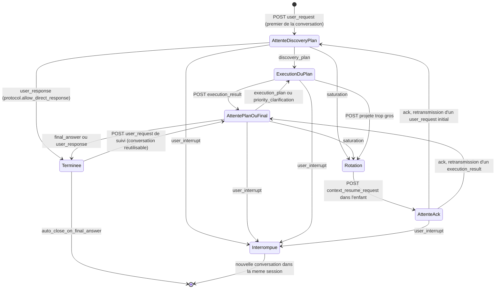
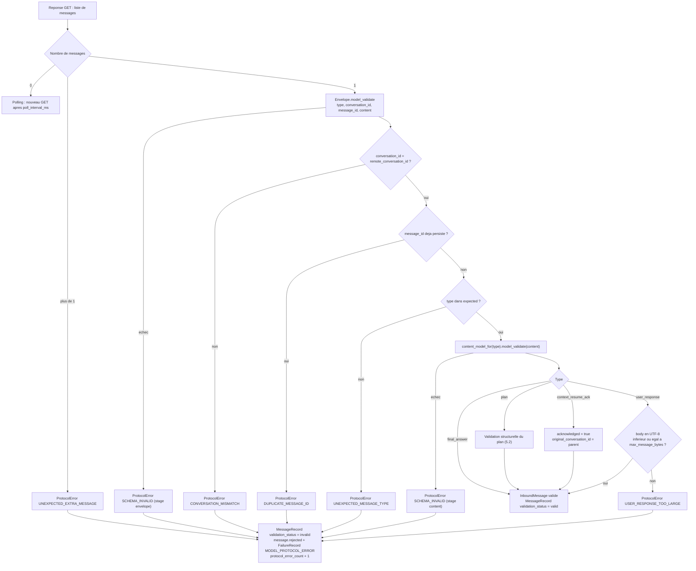
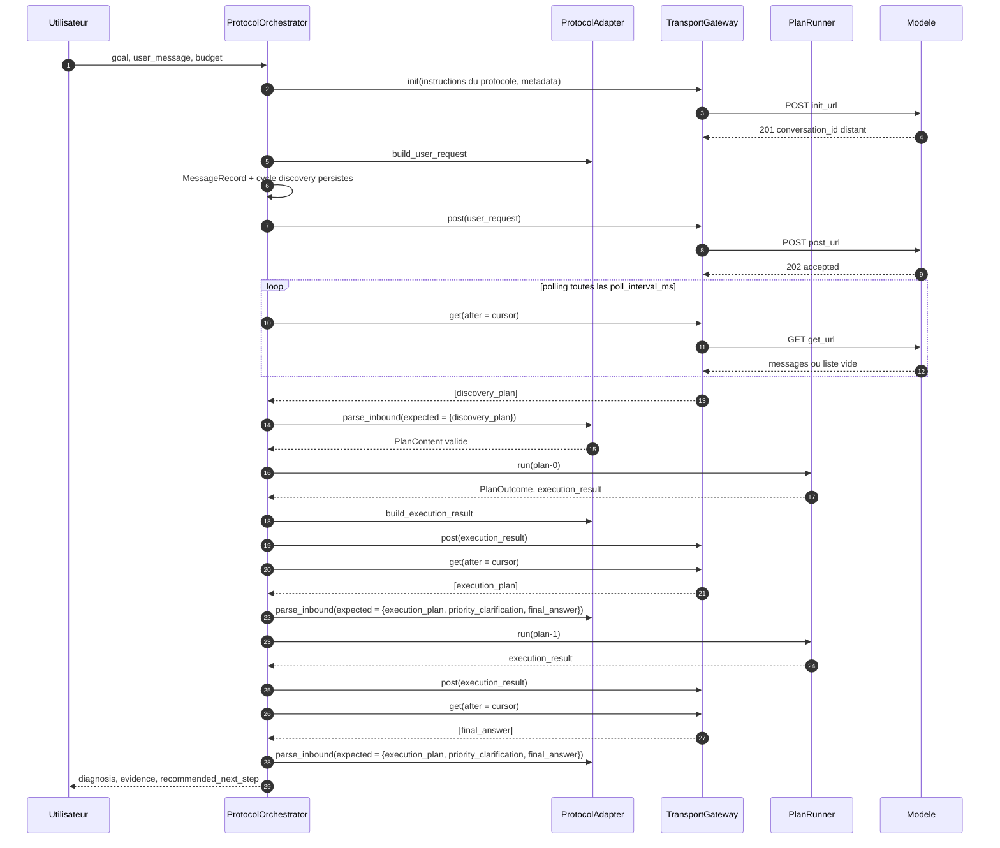
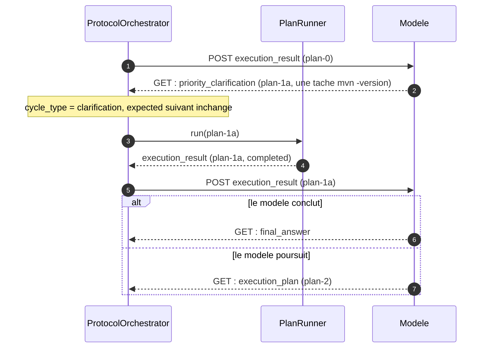
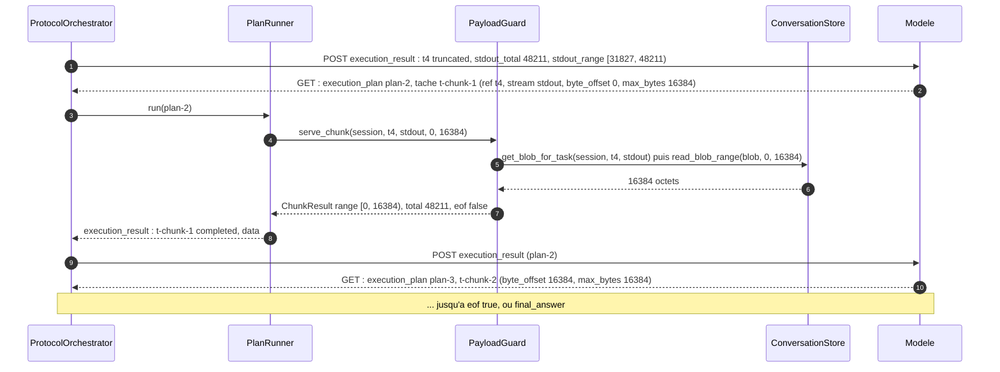
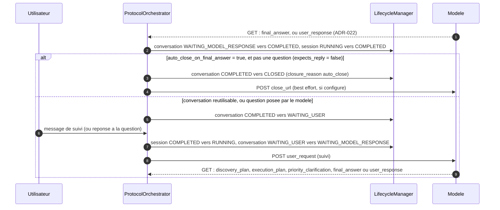

# 02 — Protocole

**Ce que dit la spec.** Le modèle n'est piloté qu'à travers une grammaire fermée de messages ([§2.2](../spec/SPEC-v1.1.md#22-protocol-model)) : `user_request → discovery_plan → execution_result → execution_plan → execution_result → final_answer`, avec la branche `priority_clarification`, et les dix types de [§3.5](../spec/SPEC-v1.1.md#35-protocoladapter) dont les schémas sont donnés en [§12](../spec/SPEC-v1.1.md#12-protocol-message-schemas). Le `ProtocolAdapter` construit les messages sortants, parse et valide les entrants, et « rejette les réponses malformées ou non déterministes ». La phase 2 (§18.2) doit tester le rejet des messages inattendus *par état protocolaire*.

**Ce que précisent les ADR.** [ADR-007](../adr/ADR-007-amendements-machines-a-etats.md) écrit la **table des messages attendus**, la validation structurelle des plans, fait de `system_error` un objet interne et de `chunk_request` un type de tâche ; [ADR-004](../adr/ADR-004-contrat-de-transport.md) définit le bootstrap des instructions du protocole et l'idempotence par `message_id` ; [ADR-005](../adr/ADR-005-resume-de-contexte-par-le-modele.md) ajoute `state_summary` aux plans ; [ADR-008](../adr/ADR-008-timeout-et-retry-de-tache.md) `timeout_ms` ; [ADR-009](../adr/ADR-009-drapeaux-d-arret.md) les défauts des drapeaux et les objets `{task_id, reason}` ; [ADR-010](../adr/ADR-010-limites-de-payload.md) `default_max_output_bytes` et `max_output_bytes_applied` ; [ADR-011](../adr/ADR-011-troncature-et-chunks.md) les plages, `stream` et le résultat de chunk ; [ADR-014](../adr/ADR-014-continuation-apres-rotation.md) `pending_message_type` et la retransmission ; [ADR-017](../adr/ADR-017-determinisme-des-resultats-et-identifiants.md) la sérialisation canonique et les identifiants injectés ; [ADR-022](../adr/ADR-022-reponse-utilisateur.md) ajoute le type entrant `user_response` (réponse directe à l'utilisateur, corps opaque borné, question avec `expects_reply`) et le drapeau `protocol.allow_direct_response` sur la première réponse ; [ADR-023](../adr/ADR-023-politique-de-correction.md) ajoute le type **sortant** `protocol_correction_request` — une réponse inutilisable ne termine plus la session sur-le-champ, l'application cite la faute au modèle et relit — avec sa borne `protocol.max_correction_attempts` ; [ADR-029](../adr/ADR-029-echec-d-outil-comme-verdict.md) ajoute `default_continue_on_error` au plan et, au résultat de tâche, `execution` (`ran` / `not_started` / `timed_out` / `stopped`) et `failure_is_verdict`.

Les schémas pydantic sont dans [`protocol/messages.py`](../../src/agentic_local_app/protocol/messages.py) ; toutes les extensions sont **optionnelles**, de sorte que les exemples de §12 valident sans modification. L'adaptateur (`protocol/adapter.py`, phase 2) et le texte des instructions (`protocol/PROTOCOL_INSTRUCTIONS.md`) sont décrits ici par leur contrat.

## 1. La grammaire (§2.2)

Chaque tour est : un message sortant de l'application, **exactement un** message entrant du modèle. L'état protocolaire est déterminé par le dernier message sortant ; il se lit sur le `MessageRecord` sortant persisté et sur la conversation (voir §4).



Lecture : la branche `priority_clarification` (§2.2) n'est qu'un plan comme un autre, exécuté par `PlanRunner` et suivi d'un `execution_result` ; la grammaire de la spec « `priority_clarification → execution_result → execution_plan | final_answer` » est donc réalisée par `AttentePlanOuFinal`. Un `user_response` (ADR-022) conclut le tour exactement comme un `final_answer` — depuis `AttentePlanOuFinal` toujours, depuis `AttenteDiscoveryPlan` seulement sous `protocol.allow_direct_response` (défaut `true`). La rotation ([06](06-context-rotation.md)) et l'interruption ([07](07-interruption-and-recovery.md)) sont orthogonales à la grammaire : la première retransmet le message en attente dans la conversation enfant (ADR-014), la seconde clôt la conversation sans rien envoyer (§8.4, ADR-006).

## 2. Catalogue des douze types de messages (§3.5, §12, ADR-022, ADR-023)

Enveloppe commune (`Envelope`) : `type`, `conversation_id` (identifiant **distant** de la conversation, celui rendu par l'`init`), `message_id`, `content`. `MessageType` est l'énumération de [`domain/states.py`](../../src/agentic_local_app/domain/states.py) ; `CONTENT_MODELS` associe chaque type à son modèle de contenu.

| Type | Direction | Émetteur → récepteur | Contenu (§12) | Modèle pydantic | Extensions ADR | Cycle |
|---|---|---|---|---|---|---|
| `user_request` | sortant | application → modèle | `goal`, `user_message`, `session_budget {max_cycles, max_plans, max_total_duration_ms}` | `UserRequestContent` | — (le budget peut venir des défauts `[budget]`, ADR-012) | ouvre `discovery` (premier) ou le cycle du plan suivant (suivi) |
| `discovery_plan` | entrant | modèle → application | `plan_id`, `objective`, `execution_policy`, `max_parallel_workers?`, `tasks[]` | `PlanContent` | `default_max_output_bytes` (ADR-010), `default_continue_on_error` (ADR-029), `state_summary` (ADR-005), `Task.timeout_ms` (ADR-008), `Task.stream` (ADR-011) | `discovery` |
| `execution_plan` | entrant | modèle → application | idem | `PlanContent` | idem ; seul type qui porte des tâches `chunk_request` en pratique (§12.6) | `execution` |
| `priority_clarification` | entrant | modèle → application | idem | `PlanContent` | idem | `clarification` |
| `execution_result` | sortant | application → modèle | `plan_id`, `status`, `results[]`, `skipped_tasks[]`, `cancelled_tasks[]`, `interrupted_tasks[]`, `stop_reason` | `ExecutionResultContent`, `TaskResult`, `TaskRef` | `status` = statut du plan en minuscules (ADR-009) ; `TaskRef {task_id, reason}` (ADR-009) ; `*_total`, `*_range`, `max_output_bytes_applied`, `timed_out`, `timeout_ms_applied`, `duration_ms`, `reason`, champs de chunk (ADR-008/010/011) ; `execution` ∈ {ran, not_started, timed_out, stopped} sur chaque résultat **et** sur chaque `TaskRef`, `failure_is_verdict: true` sur l'échec d'un outil reconnu (ADR-029 §4) | clôt le cycle du plan, ouvre le suivant |
| `final_answer` | entrant | modèle → application | `status`, `diagnosis`, `evidence[]`, `recommended_next_step` | `FinalAnswerContent` (`extra = allow`) | — | clôt le cycle |
| `user_response` | entrant | modèle → application | `format` (`text` \| `markdown` \| `json`, défaut `text`), `body` (chaîne non vide, **opaque** : jamais parsée), `status` (`completed` \| `partial` \| `failed`), `expects_reply` (défaut `false`) | `UserResponseContent` (`extra = forbid`) | type entier ajouté par ADR-022 (hors §12) ; `body` ≤ `payload.max_message_bytes` en UTF-8 (`USER_RESPONSE_TOO_LARGE`) | clôt le cycle, comme `final_answer` |
| `context_resume_request` | sortant | application → modèle (conversation **enfant**) | `original_conversation_id`, `goal`, `context_summary` | `ContextResumeRequestContent` | `pending_message_type` (ADR-014) ; `context_summary` assemblé par le `ContextReducer` (ADR-005) | ouvre `resume` |
| `context_resume_ack` | entrant | modèle → application (enfant) | `original_conversation_id`, `acknowledged` | `ContextResumeAckContent` | — ; `acknowledged = false` est une erreur de protocole | clôt `resume` |
| `protocol_correction_request` | sortant | application → modèle | `rejected_message_id?`, `error_code`, `errors[]` (les détails de validation **inchangés**), `expected_types[]`, `reminder` (engendré depuis les modèles de contenu), `example` (une enveloppe minimale valide, `message_id` factice), `raw_excerpt?`, `attempt`, `max_attempts` | `ProtocolCorrectionRequestContent` (`extra = forbid`) | type entier ajouté par ADR-023 (hors §12) ; fait tenir sous `payload.max_message_bytes` par rétrécissements successifs — extrait, erreurs, rappel, exemple (ADR-010) | **aucun** : il n'ouvre pas de cycle et ne consomme pas de plan, il redemande le tour en cours |
| `chunk_request` | — | **type de tâche**, jamais un message autonome (ADR-007) | `task_id`, `type: chunk_request`, `ref_task_id`, `byte_offset`, `max_bytes` | `TaskMessage` (validateur de forme) | `stream` ∈ {stdout, stderr}, défaut `stdout` (ADR-011) | celui du plan porteur |
| `system_error` | — | objet **interne** : jamais envoyé au modèle (ADR-007) | attributs normalisés de §6 | `SystemErrorContent` | persisté en `FailureRecord`, audité, exposé par l'API / la CLI (ADR-002) | — |

Ensembles utiles (`states.py`) : `PLAN_MESSAGE_TYPES` = {discovery_plan, execution_plan, priority_clarification} ; `SUBSTANTIVE_OUTBOUND_MESSAGE_TYPES` = {user_request, execution_result, context_resume_request}, les seuls sortants qui **fixent** l'attente du message suivant (ADR-023) ; `OUTBOUND_MESSAGE_TYPES` = cet ensemble ∪ {protocol_correction_request} ; `INBOUND_MESSAGE_TYPES` = plans ∪ {final_answer, user_response, context_resume_ack} ; `CONCLUDING_MESSAGE_TYPES` = {final_answer, user_response}, les deux types qui concluent un tour sans plan (ADR-022). `plan_type_for_message` et `cycle_type_for_plan` donnent le `PlanType` et le `CycleType` d'un message de plan.

### 2.1 Schéma de tâche (`TaskMessage`)

| Champ | Type | Défaut si absent | Règle de forme | Réf. |
|---|---|---|---|---|
| `task_id` | str non vide | — | unique dans le plan **et** dans la session | ADR-007 |
| `type` | `cmd` \| `chunk_request` | `cmd` | — | §4.1 |
| `cmd` | str | — | obligatoire et non vide pour `cmd`, interdit pour `chunk_request` | §2.3 |
| `critical`, `stop_plan_on_failure`, `stop_plan_on_success` | bool | `false` | règle effective `stops_plan_on_failure = critical or stop_plan_on_failure or not continue_on_error` | ADR-009 |
| `continue_on_error` | bool | plan `default_continue_on_error`, sinon `false` | résolu `tâche ?? plan ?? false`, puis la règle effective ci-dessus verbatim | ADR-009, ADR-029 §3 |
| `depends_on` | list[str] | `[]` | tâches du plan, sans cycle, antérieures en `sequential` | §2.4, ADR-007 |
| `resource_lock` | str | `null` | deux tâches de même clé ne tournent jamais en parallèle | §2.4 |
| `max_output_bytes` | int > 0 | plan `default_max_output_bytes`, sinon `payload.default_max_output_bytes` | plafonné par `payload.hard_max_output_bytes` | ADR-010 |
| `timeout_ms` | int > 0 | `execution.default_task_timeout_ms` | plafonné par `execution.max_task_timeout_ms` | ADR-008 |
| `ref_task_id`, `byte_offset` (≥ 0), `max_bytes` (> 0), `stream` | chunk | — / `stdout` | obligatoires (sauf `stream`) pour `chunk_request`, interdits pour `cmd` | §12.6, ADR-011 |

## 3. Messages sortants : construction et persistance

Le `ProtocolAdapter` construit un `OutboundMessage` (enveloppe validée + octets canoniques + taille). L'orchestrateur persiste le `MessageRecord` **avant** le POST (ADR-004 : le retry après erreur réseau est sûr ; ADR-015 : persister avant agir).

```mermaid
flowchart LR
    B["ProtocolAdapter.build_*<br/>enveloppe + content valides"] --> C["canonical_json<br/>sort_keys, separateurs compacts, UTF-8"]
    C --> S["size_bytes du message<br/>controle max_message_bytes (ADR-010)<br/>projection context_bytes (ADR-013)"]
    S --> P["MessageRecord persiste<br/>direction outbound, message_id genere, size_bytes,<br/>cycle_id, post_confirmed false"]
    P --> E["EventBus : message.outbound"]
    E --> T["TransportGateway.post_message<br/>202 accepted => post_confirmed true"]
    T --> G["GET avec after = get_cursor<br/>polling jusqu'a un message"]
    G --> V["ProtocolAdapter.parse_inbound<br/>expected, conversation, ids connus"]
    V --> R["MessageRecord entrant<br/>validation_status valid ou invalid<br/>get_cursor = message_id du modele"]
```



Champs du [`MessageRecord`](../../src/agentic_local_app/domain/models.py) utiles au protocole : `message_id` (généré par `IdGenerator.message_id()` pour les sortants, celui du modèle pour les entrants), `size_bytes` (sérialisation canonique, alimente `context_bytes`), `post_confirmed` / `posted_at`, `received_at`, `validation_status`, `retransmission_of` (ADR-014).

## 4. Table des messages attendus (ADR-007)

`ProtocolAdapter.expected_inbound(last_outbound, conversation)` renvoie le `frozenset[MessageType]` autorisé ; `parse_inbound` rejette tout autre type. La table de base `EXPECTED_INBOUND` (ADR-007) est amendée par ADR-022 : `expected_inbound_for(situation, allow_direct_response=…)` ajoute `user_response` à la ligne initiale quand `protocol.allow_direct_response` est actif (défaut `true`) ; les autres lignes ne dépendent pas du drapeau.

| Dernier message sortant | Condition sur la conversation | Types entrants autorisés |
|---|---|---|
| `user_request` | premier de la conversation : `final_answer_received = false` et `retransmission_of = null` | `discovery_plan` ; `user_response` si `protocol.allow_direct_response` |
| `user_request` | suivi : `final_answer_received = true` (le modèle a conclu un tour par un `final_answer` ou un `user_response` ; conversation réutilisée après `COMPLETED → WAITING_USER`) | `discovery_plan`, `execution_plan`, `priority_clarification`, `final_answer`, `user_response` |
| `user_request` | retransmis après rotation (`retransmission_of ≠ null`) | l'ensemble attendu du message d'origine (ADR-014 : « la table des messages attendus est celle de M ») |
| `execution_result` | — | `execution_plan`, `priority_clarification`, `final_answer`, `user_response` |
| `context_resume_request` | conversation enfant `SATURATED` | `context_resume_ack` |
| *(aucun)* | rien n'a été envoyé | ∅ — aucun GET n'est légitime |

Règle du tour unique : **un** message par GET. Un second message dans la même réponse est `UNEXPECTED_EXTRA_MESSAGE` ; un type hors ensemble est `UNEXPECTED_MESSAGE_TYPE`. Une réponse vide n'est pas une erreur de protocole mais un polling qui continue jusqu'à `transport.reply_timeout_ms` (`TIMEOUT_ERROR / MODEL_GET_TIMEOUT`, ADR-004).

Une demande de correction est **transparente** pour cette table (ADR-023 §5) : un `protocol_correction_request` n'ouvre aucune ligne, il redemande le message déjà attendu. La ligne applicable se lit donc sur le dernier message sortant **substantiel** — `last_substantive_outbound(messages)` remonte la trace jusqu'au dernier `user_request`, `execution_result` ou `context_resume_request` et c'est lui que `situation_for` classe ; les corrections et les rejets qu'elles corrigent sont sautés. Une réponse à une correction est ainsi validée contre l'ensemble qui était pendant avant la faute, ni plus permissif (se tromper ne débloque aucun type) ni plus strict, et c'est ce même ensemble que la correction annonce au modèle dans `expected_types`.

## 5. Validation d'un message entrant

### 5.1 Pipeline



Un message rejeté est **quand même persisté** (`validation_status = invalid`) et audité (`message.rejected`) : la reconstruction depuis l'audit (§17.3) doit montrer ce que le modèle a réellement envoyé. Sa taille compte dans `context_bytes` (il est bien dans le contexte du modèle, ADR-013).

### 5.2 Validation structurelle d'un plan (ADR-007)

Au-delà du schéma JSON, dans cet ordre :

1. `plan_id` jamais vu dans la **session** (`known_plan_ids`) ;
2. `task_id` uniques dans le plan et jamais vus dans la session (`known_task_ids`) — l'unicité de session garantit qu'un `ref_task_id` reste non ambigu après rotation ;
3. `depends_on` : chaque référence désigne une tâche du plan ; aucune auto-dépendance (`SELF_DEPENDENCY`) ; le graphe est acyclique (`DEPENDENCY_CYCLE`) ; en `sequential`, une dépendance désigne une tâche **déclarée avant** ;
4. `execution_policy = parallel` : `max_parallel_workers ≥ 1` (le schéma l'impose quand le champ est présent ; absent, la valeur 1 est appliquée avec l'avertissement `DEFAULT_WORKERS_APPLIED`) ;
5. `chunk_request.ref_task_id` désigne une tâche dont la sortie brute est stockée (`stored_task_ids`) — voir *Points ouverts* n°1 ;
6. `max_output_bytes`, `timeout_ms`, `max_bytes` strictement positifs (schéma) ;
7. `state_summary` : `size_bytes(canonical(state_summary)) ≤ payload.max_state_summary_bytes` (ADR-005) ;
8. règle effective des drapeaux calculée et persistée (`stops_plan_on_failure`) ; `critical: true` avec `continue_on_error: true` n'est pas une erreur mais publie `audit.warning` (`CONTRADICTORY_FLAGS`) (ADR-009).

### 5.3 Catalogue des codes `ProtocolError`

Tous portent `error_type = MODEL_PROTOCOL_ERROR`, `origin = ProtocolAdapter`, `retryable = false`, `recoverable = false` ([`domain/errors.py`](../../src/agentic_local_app/domain/errors.py)) ; `details` porte les champs indiqués.

| Code | Condition | `details` | Réf. |
|---|---|---|---|
| `UNEXPECTED_EXTRA_MESSAGE` | plus d'un message dans une réponse GET | `count`, `message_ids` | ADR-007 |
| `SCHEMA_INVALID` | enveloppe ou `content` refusé par pydantic (type inconnu, champ manquant ou inconnu — `extra = forbid` —, forme de tâche incohérente, `tasks` vide, valeur non strictement positive, `max_parallel_workers < 1`) | `stage` (envelope / content), `errors` | §3.5, §12 |
| `CONVERSATION_MISMATCH` | `conversation_id` ≠ `remote_conversation_id` de la conversation courante | `expected`, `received` | ADR-007 |
| `UNEXPECTED_MESSAGE_TYPE` | type hors de l'ensemble attendu | `expected`, `received`, `last_outbound` | ADR-007, §18.2 |
| `DUPLICATE_MESSAGE_ID` | `message_id` déjà persisté | `message_id` | ADR-007 |
| `DUPLICATE_PLAN_ID` | `plan_id` déjà connu dans la session | `plan_id` | ADR-007 |
| `DUPLICATE_TASK_ID` | `task_id` répété dans le plan ou déjà connu dans la session | `task_id`, `plan_id` | ADR-007 |
| `UNKNOWN_DEPENDENCY` | `depends_on` référence un `task_id` absent du plan | `task_id`, `dependency` | §2.4, ADR-007 |
| `SELF_DEPENDENCY` | une tâche se référence elle-même dans `depends_on` | `task_id`, `plan_id` | ADR-007 |
| `DEPENDENCY_CYCLE` | cycle dans le graphe `depends_on` (hors auto-référence) | `cycle` (liste ordonnée) | ADR-007 |
| `FORWARD_DEPENDENCY_IN_SEQUENTIAL` | `sequential` : dépendance vers une tâche postérieure | `task_id`, `dependency` | ADR-007 |
| `CHUNK_REF_UNKNOWN` | `ref_task_id` ne désigne aucune tâche à sortie stockée de la session (`stored_output_task_ids`) | `task_id`, `ref_task_id` | ADR-007 (voir *Points ouverts* n°1) |
| `STATE_SUMMARY_TOO_LARGE` | `state_summary` au-delà de `max_state_summary_bytes` | `size_bytes`, `limit` | ADR-005 |
| `USER_RESPONSE_TOO_LARGE` | `body` d'un `user_response` au-delà de `payload.max_message_bytes` (octets UTF-8), vérifié après le schéma | `size_bytes`, `max_bytes`, `message_id` | ADR-022 |
| `ACK_NOT_ACKNOWLEDGED` | `context_resume_ack.acknowledged = false` | `original_conversation_id` | §2.6, §10 |
| `ACK_WRONG_ORIGINAL` | `original_conversation_id` ≠ identifiant distant du parent | `expected`, `received` | §12.9 |
| `SYSTEM_ERROR_NOT_ALLOWED_INBOUND` | un `system_error` reçu du modèle : le type est interne et n'est jamais attendu en entrée | `message_id` | ADR-007 |
| `RESPONSE_NOT_JSON`, `RESPONSE_SCHEMA_INVALID` | corps d'une réponse `init` / `post` / `get` non JSON ou hors contrat (levés par le `TransportGateway`, `origin = TransportGateway`) | `operation`, `status`, `body_excerpt` | ADR-004 |

Les codes de l'adaptateur sont ceux de [`protocol/adapter.py`](../../src/agentic_local_app/protocol/adapter.py) (phase 2) ; la table §4 y vit sous le nom `EXPECTED_INBOUND`, indexée par `OutboundSituation` (`initial_user_request`, `follow_up_user_request`, `execution_result`, `context_resume_request`), et `situation_for(last_outbound, conversation)` choisit la ligne à partir de `conversation.final_answer_received` ; `expected_inbound_for` applique le drapeau d'ADR-022 à la ligne initiale.

Avertissements (jamais des erreurs) portés par `InboundMessage.warnings` et publiés en `audit.warning` : `CONTRADICTORY_FLAGS:<task_id>` (ADR-009), `DEFAULT_WORKERS_APPLIED` (`parallel` sans `max_parallel_workers` ⇒ 1), `WORKERS_IGNORED_IN_SEQUENTIAL` (`max_parallel_workers` déclaré en `sequential`).

Conséquences d'une erreur de protocole : jamais de retry de transport (§7.2) ; `FailureRecord` ; `protocol_error_count` de la conversation incrémenté (observabilité) ; puis la politique de correction d'ADR-023 — l'application POSTe un `protocol_correction_request` et relit contre la **même** attente, au plus `protocol.max_correction_attempts` fois d'affilée, avant de retomber sur la politique d'échec de [05](05-transport-and-failures.md#4-flowchart-de-décision-du-failuremanager-7-adr-013) (rotation si la fenêtre n'est pas `HEALTHY` et que `context.rotate_on_unusable_reply_in_warning` est actif, sinon session `FAILED`). Une fenêtre déjà `SATURATED` ne corrige pas du tout : elle va directement à ce repli — une correction envoyée dans un contexte plein ne pourrait pas recevoir de réponse —, donc rotation sous le même drapeau, échec sans lui.

## 6. Séquences

### 6.1 Boucle nominale



### 6.2 Branche `priority_clarification`



### 6.3 Récupération d'une sortie tronquée par `chunk_request` (ADR-011)

La tâche `t4` a produit 48 211 octets de stdout pour un budget de 16 384 : le modèle a reçu la **fin** (`stdout_range = [31827, 48211)`) et sait qu'il lui manque `[0, 31827)`.



Un `ref_task_id` connu mais sans blob (tâche interrompue au redémarrage, ADR-016), ou un `byte_offset ≥ total`, donne une tâche `FAILED` (`CHUNK_REF_NOT_FOUND`, `CHUNK_RANGE_INVALID`) dans l'`execution_result`, jamais une erreur de protocole (ADR-008 §5, ADR-011).

### 6.4 Suivi après `final_answer` ou `user_response` (§11, ADR-022)



Si la fenêtre de contexte de la conversation réutilisable est `SATURATED` au moment du suivi, la rotation a lieu **avant** le POST (contrôle de projection, ADR-013) : le `user_request` de suivi est alors le message en attente retransmis dans l'enfant (ADR-014). Un `user_response` n'est jamais écrit dans `SessionRecord.final_answer` : `ConversationManager.user_responses` / `last_reply` (API `GET /sessions/{sid}/responses` / `/reply`) le relisent dans la table des messages (ADR-022).

## 7. Bootstrap des instructions du protocole (ADR-004, ADR-031)

Le modèle n'apprend le protocole que par le champ `instructions` de l'`init`. Le texte `protocol/PROTOCOL_INSTRUCTIONS.md` est versionné avec le code, **c'est le seul contenu « prompt » de l'application**, et sa taille est comptée dans `context_bytes` de chaque conversation (ADR-013) — et payée de nouveau à chaque rotation. Depuis [ADR-031](../adr/ADR-031-contrat-du-modele-regles-dictionnaire-exemples.md) c'est un **contrat** qui se lit de haut en bas, en anglais, borné à 60 Kio rendus (≈ 55 Ko, 14 % du budget par défaut) :

| Section du texte | Contenu | Source |
|---|---|---|
| 1. The contract | dix règles RFC 2119 (un message, une enveloppe, noms et valeurs exacts, aucun champ inventé, types JSON exacts, `conversation_id` repris, identifiants neufs, type permis, types réservés à l'application, aucune prose), ce qui arrive en cas d'écart — rendu d'après `protocol.max_correction_attempts` (`{rejection_policy_rule}`) —, l'arbre et la table « ce que vous pouvez envoyer », la règle de la première réponse rendue d'après `protocol.allow_direct_response` (`{initial_reply_types}`, `{initial_reply_grammar}`, `{initial_reply_rule}`) | ADR-007, ADR-022, ADR-023, ADR-031 |
| 2. Messages and their fields | le dictionnaire : une table par type envoyé (champ, type JSON, obligatoire et défaut, valeurs permises, exemple, sens) et par type reçu, dont `context_summary` et les codes d'erreur d'une correction ; l'exemple `translation` calculé par le dictionnaire d'ADR-030 dans le sens de la machine (`{translation_example}`) | §12, ADR-005, ADR-010, ADR-011, ADR-022, ADR-023, ADR-029, ADR-030 |
| 3. A complete exchange | une session réelle, chaque message entier et étiqueté dans sa ligne d'ouverture (`A1`…`A6` : découverte, résultat, build et lecture du `pom.xml`, verdict et troncature, conclusion ; `B1`–`B2` : un `user_response` ; `C1`–`C4` : un refus, sa correction, le message corrigé) ; les commandes rendues dans le dialecte annoncé (`EXAMPLE_COMMANDS`, `{cmd_*}`), les valeurs appliquées et le verdict rendus d'après la configuration | ADR-029, ADR-030, ADR-031 |
| 4. Common mistakes | douze messages faux (`M1`…`M12`), chacun marqué `refused <code>` et suivi de sa forme juste | ADR-031, rapport de conformité |
| 5. Plans and tasks in detail | drapeaux d'arrêt et défauts, `default_continue_on_error`, règle de verdict (`{verdict_rule}`), dépendances, parallélisme, `priority_clarification` (`P1`), identifiants | ADR-009, ADR-029 |
| 6. The machine your commands run on | l'annonce de l'environnement : système, interpréteur (et comment il a été choisi), dialecte, répertoire de travail, une ligne de conseil propre au dialecte ; **trois faits, pas un de plus** ; la règle de traduction (`{translation_rule}`) | ADR-030 |
| 7. Output limits, truncation and chunk_request | budget effectif, plafond, borne d'un message, troncature à part garantie par flux et fin conservée, plages `[début, fin)`, `chunk_request` (`K1`) | ADR-010, ADR-011, ADR-029 |
| 8. state_summary and conversation rotation | notes à tenir dans chaque plan, borne, rotation (`R1`, `R2`), retransmission du message en attente | ADR-005, ADR-014 |
| 9. Concluding | `final_answer` ou `user_response`, et la suite possible | §11, ADR-022 |
| 10. When your message is refused | la conduite face à un `protocol_correction_request` et la borne (`{correction_budget_rule}`) | ADR-023 |
| 11. Session budget | les trois bornes de la session et leur effet | §2.8, ADR-012 |
| 12. Before every message | les dix règles de la section 1, de nouveau, en liste de contrôle | ADR-031 |

Le texte annonce les valeurs **effectives** de la configuration (`payload`, `execution`, `protocol`) : il est rendu à partir d'un gabarit au démarrage, ce qui garantit que ce que le modèle lit est ce que l'application applique. Depuis ADR-030 §3 il annonce aussi l'**environnement d'exécution** (`render_instructions(config, environment=…)`, l'`ExecutionEnvironment` étant détecté depuis la configuration quand l'appelant ne le fournit pas) : c'est la seule I/O de l'adaptateur, et la seule information d'environnement que le protocole transporte. `agentic-app protocol show` imprime le texte rendu pour la machine (ou, avec `--dialect`, pour un autre dialecte).

**Les exemples ne peuvent pas dériver du code** (ADR-031 §6) : `tests/unit/test_phase2_protocol_contract.py` rejoue chaque bloc du texte rendu contre le vrai `ProtocolAdapter`, dans la situation que le texte lui donne (accepté, ou refusé avec le code annoncé), reconstruit les messages de l'application avec les vrais composants (`ResultCollector`, `ContextReducer`, correction de l'adaptateur) et compare chaque table du dictionnaire au modèle pydantic qu'elle décrit.

## 8. Exemples JSON avec les champs ajoutés

Les exemples de §12 restent valides tels quels ; ceux-ci montrent les extensions.

### 8.1 Plan avec `state_summary`, `default_max_output_bytes`, `timeout_ms` (§12.3 + ADR-005/008/010)

```json
{
  "type": "execution_plan",
  "conversation_id": "rc-7f3a",
  "message_id": "m-0012",
  "content": {
    "plan_id": "plan-1",
    "objective": "Confirm Java version mismatch between Maven runtime and project target",
    "execution_policy": "parallel",
    "max_parallel_workers": 2,
    "default_max_output_bytes": 4096,
    "state_summary": {
      "environment": { "os": "Linux x86_64", "shell": "/bin/bash", "cwd": "/workspace/project" },
      "findings": [ "Java runtime = 17.0.12", "pom.xml targets Java 21" ],
      "current_state": "Version mismatch suspected, confirming Maven runtime",
      "next_expected_step": "Confirm with mvn -version then conclude"
    },
    "tasks": [
      { "task_id": "t6", "type": "cmd", "cmd": "echo $JAVA_HOME", "continue_on_error": true, "timeout_ms": 5000 },
      { "task_id": "t7", "type": "cmd", "cmd": "grep -n \"maven.compiler.source\\|maven.compiler.target\" pom.xml",
        "critical": true, "stop_plan_on_failure": true, "max_output_bytes": 2048, "resource_lock": "pom.xml" }
    ]
  }
}
```

`t6` ne déclare pas `max_output_bytes` : budget effectif `min(4096, hard_max)` = 4 096 ; `t7` : 2 048.

### 8.2 `execution_result` étendu (§12.5 + ADR-008/009/011/029/030)

```json
{
  "type": "execution_result",
  "conversation_id": "rc-7f3a",
  "message_id": "msg-0005",
  "content": {
    "plan_id": "plan-0",
    "status": "stopped_on_failure",
    "results": [
      { "task_id": "t1", "status": "completed", "execution": "ran", "exit_code": 0,
        "stdout": "Linux dev 5.15.0 x86_64\n/bin/bash\n/workspace/project", "stderr": "",
        "truncated": false, "original_size_bytes": 55, "stdout_total": 55, "stderr_total": 0,
        "stdout_range": [0, 55], "stderr_range": [0, 0],
        "max_output_bytes_applied": 2048, "timed_out": false, "timeout_ms_applied": 60000, "duration_ms": 12 },
      { "task_id": "t4", "status": "completed", "execution": "ran", "exit_code": 0,
        "stdout": "...fin du pom.xml...", "stderr": "",
        "truncated": true, "original_size_bytes": 48211, "stdout_total": 48211, "stderr_total": 0,
        "stdout_range": [31827, 48211], "stderr_range": [0, 0],
        "max_output_bytes_applied": 16384, "timed_out": false, "timeout_ms_applied": 60000, "duration_ms": 31 },
      { "task_id": "t5", "status": "timed_out", "execution": "timed_out", "exit_code": null,
        "stdout": "[INFO] Scanning for projects...", "stderr": "",
        "truncated": false, "original_size_bytes": 32, "stdout_total": 32, "stderr_total": 0,
        "stdout_range": [0, 32], "stderr_range": [0, 0],
        "max_output_bytes_applied": 32768, "timed_out": true, "timeout_ms_applied": 60000, "duration_ms": 60000 }
    ],
    "skipped_tasks": [],
    "cancelled_tasks": [],
    "interrupted_tasks": [],
    "stop_reason": "critical_task_failed:t5"
  }
}
```

`*_range` est l'intervalle `[début, fin)` en octets du flux tel que reçu ; les listes de `TaskRef` sont ordonnées comme les tâches du plan (ADR-017).

Un résultat porte en plus `translation` **quand, et seulement quand**, le dictionnaire entre dialectes a été consulté — c'est-à-dire quand la commande était écrite dans l'autre dialecte que le shell qui l'a exécutée (ADR-030 §4) :

```json
{ "task_id": "t2", "status": "completed", "execution": "ran", "exit_code": 0,
  "translation": { "status": "translated", "from_dialect": "posix", "to_dialect": "powershell",
                   "original_cmd": "head -n 20 build.log",
                   "executed_cmd": "Get-Content build.log -TotalCount 20",
                   "rules": ["head-lines"] },
  "stdout": "...", "stderr": "", "truncated": false, "timed_out": false, "duration_ms": 18 }
```

Le champ est **dérivé** de `cmd` à la construction du message (comme `execution` et `failure_is_verdict`, ADR-029 §4) ; ce qui a réellement tourné est tracé, lui, dans l'événement d'audit de la transition `RUNNING`. `stdout` et `stderr` sont la sortie d'`executed_cmd`. Avec `"status": "unchanged"`, `executed_cmd` vaut `original_cmd` — la commande a tourné mot pour mot — et `reason` dit ce qui a arrêté le dictionnaire, pour que le modèle réécrive lui-même.

### 8.3 `chunk_request` et son résultat (§12.6 + ADR-011)

```json
{ "task_id": "t-chunk-1", "type": "chunk_request", "ref_task_id": "t4", "stream": "stdout", "byte_offset": 0, "max_bytes": 16384 }
```

```json
{ "task_id": "t-chunk-1", "status": "completed", "ref_task_id": "t4", "stream": "stdout",
  "range": [0, 16384], "total": 48211, "eof": false, "data": "<?xml version=\"1.0\" ..." }
```

### 8.4 `context_resume_request` avec `pending_message_type` (§12.8 + ADR-005/014)

```json
{
  "type": "context_resume_request",
  "conversation_id": "rc-9b21",
  "message_id": "msg-0009",
  "content": {
    "original_conversation_id": "rc-7f3a",
    "goal": "Understand the root cause of a Java build failure",
    "pending_message_type": "execution_result",
    "context_summary": {
      "goal": "Understand the root cause of a Java build failure",
      "user_message": "Please debug the Java error in my project.",
      "environment": { "os": "Linux x86_64", "shell": "/bin/bash", "cwd": "/workspace/project" },
      "findings": [ "Java runtime = 17.0.12", "pom.xml targets Java 21" ],
      "current_state": "Version mismatch suspected, confirming Maven runtime",
      "next_expected_step": "Confirm with mvn -version then conclude",
      "plan_ledger": [
        { "plan_id": "plan-0", "plan_type": "discovery_plan", "objective": "Discover execution environment and build context",
          "status": "stopped_on_failure", "stop_reason": "critical_task_failed:t5",
          "tasks": [
            { "task_id": "t1", "cmd": "uname -a && echo $SHELL && echo $PWD", "status": "completed", "exit_code": 0, "truncated": false, "original_size_bytes": 55 },
            { "task_id": "t4", "cmd": "test -f pom.xml && sed -n '1,220p' pom.xml", "status": "completed", "exit_code": 0, "truncated": true, "original_size_bytes": 48211 },
            { "task_id": "t5", "cmd": "mvn clean install 2>&1 | tail -80", "status": "timed_out", "exit_code": null, "truncated": false, "original_size_bytes": 32 }
          ] }
      ],
      "pending_outputs": [ { "task_id": "t4", "stream": "stdout", "total_bytes": 48211 } ],
      "budget": { "max_cycles": 20, "consumed_cycles": 3, "max_plans": 10, "consumed_plans": 1,
                  "max_total_duration_ms": 300000, "consumed_duration_ms": 81234 }
    }
  }
}
```

La forme du résumé et sa réduction par paliers sont décrites dans [06-context-rotation](06-context-rotation.md#2-contextreducer-adr-005).

### 8.5 `system_error` (§12.10) — interne

Jamais POSTé. Le même contenu est persisté en `FailureRecord` et rendu par `GET /sessions/{sid}/failures` (ADR-018) avec les attributs de §6 (`error_type`, `error_code`, `severity`, `origin`, `retryable`, `recoverable`, `attempt`, `max_attempts`, `details`).

## 9. Ce que la phase 2 teste (§18.2)

| Exigence | Tests attendus (nommage §18.4) |
|---|---|
| Construction de chaque type sortant, comparée à l'octet près (ADR-017) | `given_session_when_user_request_built_then_matches_expected_json`, `…_execution_result_built_…`, `…_context_resume_request_built_…` |
| Parsing de chaque type entrant, exemples de §12 inchangés | `given_spec_example_when_parsed_then_accepted` (×6), `given_chunk_request_without_stream_when_parsed_then_stdout_default` |
| Rejet des messages malformés | un test par ligne du catalogue §5.3 |
| Rejet des types inattendus par état protocolaire | `given_each_last_outbound_when_each_message_type_received_then_accepted_iff_in_expected_table` (produit cartésien de la table §4) |
| Tour unique | `given_two_messages_in_one_get_when_parsed_then_unexpected_extra_message` |

## 10. Points ouverts

1. **`CHUNK_REF_UNKNOWN` (adaptateur) vs `CHUNK_REF_NOT_FOUND` (exécution).** ADR-007 place « `chunk_request.ref_task_id` désigne une tâche dont la sortie brute est stockée » dans la validation structurelle (donc `MODEL_PROTOCOL_ERROR`), et le module map donne à `parse_inbound` un paramètre `stored_task_ids` ; ADR-008 §5 et ADR-011 disent au contraire qu'un `ref_task_id` inconnu donne une tâche `FAILED` et « jamais une erreur de protocole ». Ce document retient les deux niveaux : l'adaptateur rejette une référence vers une tâche **inconnue de la session** ; l'exécution échoue (tâche `FAILED`) quand la tâche est connue mais sans blob ou hors plage. Un ADR devrait trancher (le plus simple serait de retirer le point de la validation structurelle d'ADR-007 et de laisser ADR-011 seul).
2. **Identifiant de conversation dans l'enveloppe.** La spec utilise le même `conv-1001` pour la conversation « locale » et « distante » ; ADR-004 introduit un identifiant distant rendu par l'`init`. Ce document fixe : l'enveloppe porte l'identifiant **distant** (`remote_conversation_id`), les records et l'API portent l'identifiant local. À confirmer dans les instructions du protocole.
3. **Ensemble attendu après retransmission d'un `user_request` de suivi.** ADR-014 ne distingue pas `user_request` initial et de suivi ; la règle « même ensemble que le message d'origine » (§4) est une lecture, à valider en phase 8/9.
4. **`max_parallel_workers` absent en mode `parallel`.** ADR-007 exige `≥ 1` ; le schéma accepte l'absence (`PlanRecord.max_parallel_workers = 1` par défaut). L'adaptateur de phase 2 applique 1 avec l'avertissement `DEFAULT_WORKERS_APPLIED` plutôt que de rejeter ; ADR-007 pourrait être annoté en ce sens.
5. **Conflit de la validation avec le code de phase 7.** Le `FailureManager` livré en phase 7 décide `fail` pour toute `MODEL_PROTOCOL_ERROR` ; le seuil `protocol_errors_before_rotation` d'ADR-013 (défaut 2) n'est donc atteignable que si l'orchestrateur compte les erreurs avant de solliciter la politique — voir [05 §11](05-transport-and-failures.md#11-points-ouverts).
