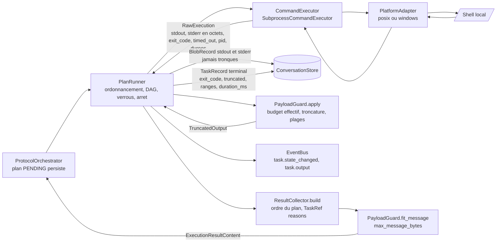
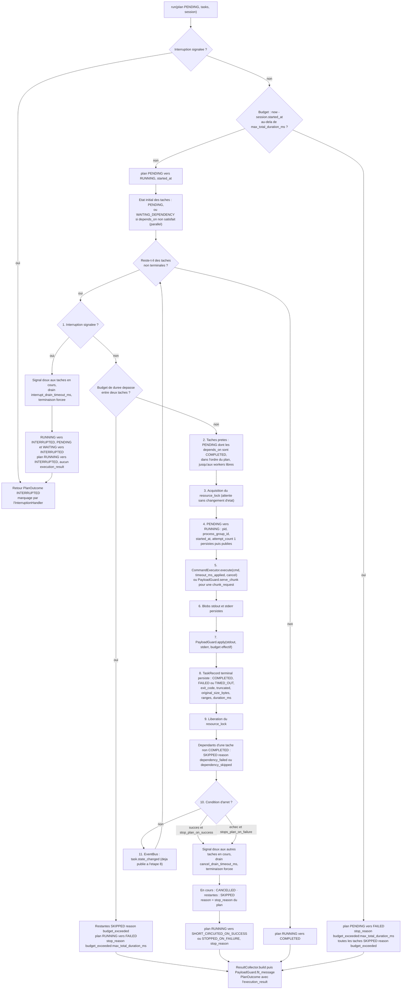
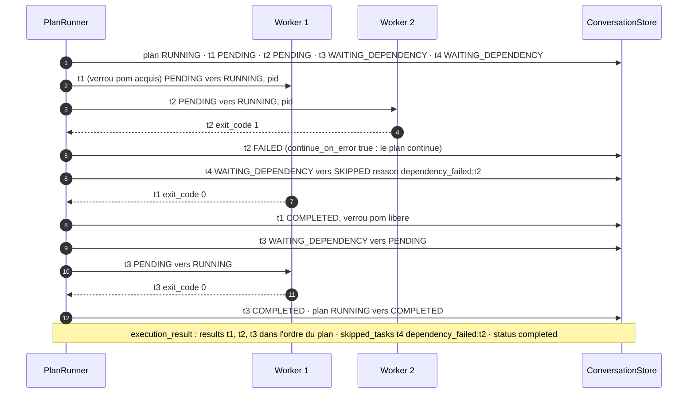
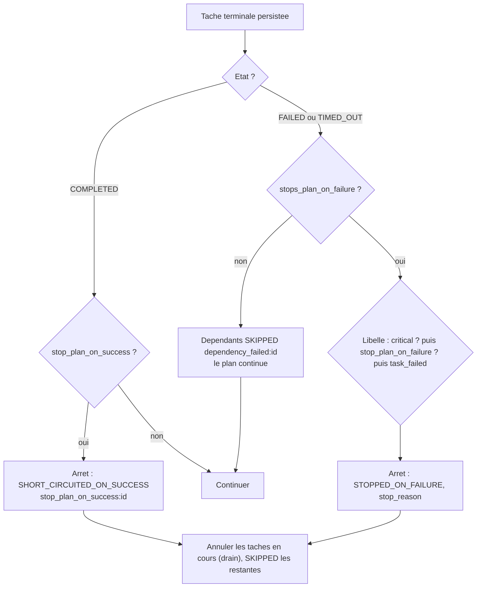
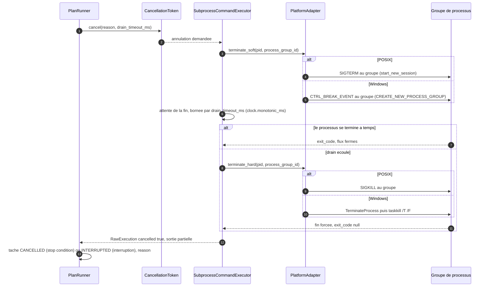
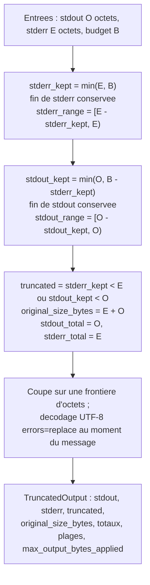
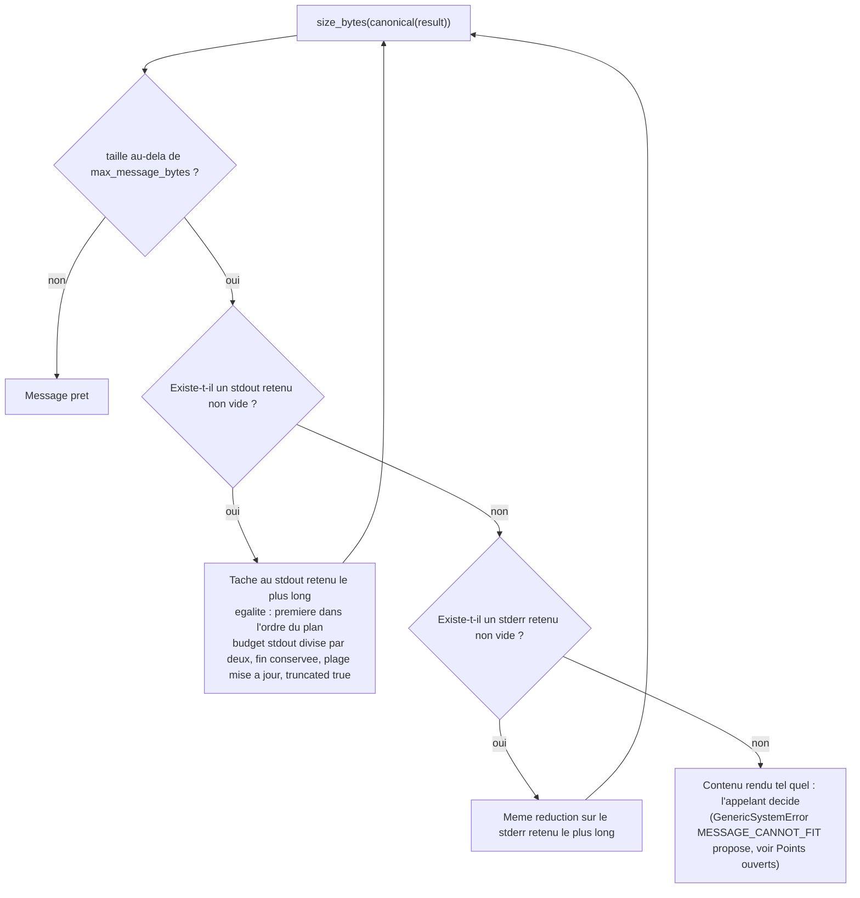

# 03 — Modèle d'exécution

**Ce que dit la spec.** Un plan est exécuté « exactement comme reçu » ([§8.1](../spec/SPEC-v1.1.md#8-deterministic-plan-execution-rules)) par le `PlanRunner` (§3.7), séquentiellement ou en parallèle (§2.4), en suivant les onze étapes de [§8.2](../spec/SPEC-v1.1.md#82-task-execution-rules), les conditions d'arrêt de [§8.3](../spec/SPEC-v1.1.md#83-stop-conditions) et les règles d'interruption de [§8.4](../spec/SPEC-v1.1.md#84-interruption-during-execution). Le `CommandExecutor` (§3.8) lance les commandes, le `PayloadGuard` (§3.10, §2.5) borne les sorties, le `ResultCollector` (§3.9) produit **exactement un** `execution_result` par plan (§19.9).

**Ce que précisent les ADR.** [ADR-003](../adr/ADR-003-plateformes-cibles.md) : couche plateforme POSIX / Windows, terminaison en deux temps, octets bruts ; [ADR-008](../adr/ADR-008-timeout-et-retry-de-tache.md) : `timeout_ms`, aucun retry de tâche, `TIMED_OUT` = échec ; [ADR-009](../adr/ADR-009-drapeaux-d-arret.md) : règle effective des drapeaux, `stop_reason`, `{task_id, reason}` ; [ADR-010](../adr/ADR-010-limites-de-payload.md) : quatre bornes de payload, `fit_message` ; [ADR-011](../adr/ADR-011-troncature-et-chunks.md) : algorithme de troncature, plages, `chunk_request` avec `stream` ; [ADR-012](../adr/ADR-012-budget-de-session.md) : budget vérifié **entre deux tâches** ; [ADR-016](../adr/ADR-016-politique-de-reprise.md) : `pid` persisté avant le lancement ; [ADR-017](../adr/ADR-017-determinisme-des-resultats-et-identifiants.md) : résultats dans l'ordre du plan ; [ADR-018](../adr/ADR-018-api-pour-un-front-et-flux-live.md) : flux live `task.output`.

Les machines à états de plan et de tâche sont dans [01-state-machines](01-state-machines.md#6-plan-52-amendé-par-adr-007) ; les records `PlanRecord` / `TaskRecord` / `BlobRecord` dans [04-persistence-and-audit](04-persistence-and-audit.md). Modules : `execution/plan_runner.py`, `execution/executor.py`, `execution/platform.py`, `execution/payload_guard.py`, `execution/result_collector.py` (phases 4 et 5, voir [09-module-map](09-module-map.md)).

## 1. Les composants et le flux d'une tâche



## 2. PlanRunner : l'algorithme de §8.2 amendé

`PlanRunner.run(plan, tasks, session) -> PlanOutcome`. Le prélude vérifie le budget et démarre le plan ; la boucle applique, pour chaque tâche, les étapes de §8.2 dans l'ordre, augmentées du contrôle de budget entre deux tâches (ADR-012 §3), de la persistance du `pid` (ADR-016) et de la règle « persister puis publier » (ADR-015 : l'étape 11 « notifier le bus » vient toujours après l'étape 8 « persister »).



Points de contrôle du budget (ADR-012 §3) tels que le runner les voit :

| Moment | Borne | Effet |
|---|---|---|
| Après persistance du plan, avant `PENDING → RUNNING` | `max_plans` (compteur incrémenté à la persistance), `max_total_duration_ms` | plan `PENDING → FAILED`, `stop_reason = budget_exceeded:<borne>`, tâches `SKIPPED` (`budget_exceeded`) ; session `FAILED` (`BUDGET_EXCEEDED`) |
| Entre deux tâches | `max_total_duration_ms` uniquement (`clock.monotonic_ms()` contre l'échéance dérivée de `session.started_at`) | une tâche déjà lancée n'est **jamais** tuée pour cause de budget ; aucune nouvelle tâche ne démarre ; plan `RUNNING → FAILED`, restantes `SKIPPED` |
| `max_cycles` | vérifié par l'orchestrateur aux frontières de cycle, pas par le runner | voir [05](05-transport-and-failures.md) et [06](06-context-rotation.md#5-interaction-avec-le-budget-adr-012) |

Un plan `FAILED` pour budget produit bien un `execution_result` (`status = failed`, ADR-009 §4) qui est **persisté** mais n'est pas envoyé : la session est `FAILED` et rien n'est envoyé au modèle (ADR-012 §4). L'invariant « un plan ⇒ zéro ou un `execution_result` » ([00](00-overview.md#5-les-invariants-que-tout-le-code-respecte)) est respecté.

## 3. Ordonnancement parallèle

| Règle | Réalisation | Réf. |
|---|---|---|
| `max_parallel_workers` | `asyncio.Semaphore(max_parallel_workers)` ; `sequential` ⇔ 1 worker | §2.4 |
| `depends_on` | graphe validé sans cycle par le `ProtocolAdapter` ; une tâche est **prête** quand toutes ses dépendances sont `COMPLETED` ; elle est `WAITING_DEPENDENCY` tant qu'au moins une ne l'est pas ; si une dépendance finit `FAILED`, `TIMED_OUT`, `SKIPPED` ou `CANCELLED`, la tâche passe `SKIPPED` (`dependency_failed:<id>` ou `dependency_skipped:<id>`), et ses propres dépendants aussi (propagation transitive) — **même si le plan continue** | §2.4, §5.3, ADR-009 §5 |
| `resource_lock` | un `asyncio.Lock` par clé de verrou ; l'attente d'un verrou ne change pas l'état de la tâche (`PENDING`) ; le verrou est libéré à l'étape 9, y compris en cas d'échec, de timeout ou d'annulation | §2.4, §8.2 |
| Choix des tâches prêtes | dans l'**ordre de déclaration** (`order_index`) : deux exécutions du même plan démarrent les tâches dans le même ordre ; seul l'ordre d'achèvement varie, et il n'influence pas le résultat (ADR-017) | ADR-017 |
| Mode `sequential` | une seule tâche à la fois, dans l'ordre du plan ; les dépendances ne pointant que vers l'arrière (ADR-007), une tâche n'est jamais `WAITING_DEPENDENCY` : soit elle démarre, soit elle est `SKIPPED` | ADR-007 |

Exemple : plan `parallel`, `max_parallel_workers = 2`, tâches `t1`, `t2` indépendantes, `t3` dépend de `t1`, `t4` dépend de `t2` et partage `resource_lock = "pom"` avec `t1`, `t2` échoue avec `continue_on_error: true`.



## 4. Conditions d'arrêt (§8.3 + ADR-009)

### 4.1 Règle effective des drapeaux

Calculée une fois à la validation du plan et persistée sur la `TaskRecord` (`stops_plan_on_failure`) ; champ absent ⇒ `false` (ADR-009 §1).

```
stops_plan_on_failure = critical or stop_plan_on_failure or not continue_on_error
stops_plan_on_success = stop_plan_on_success
```

| `critical` | `continue_on_error` | `stop_plan_on_failure` | `stops_plan_on_failure` | À l'échec (`FAILED` ou `TIMED_OUT`) | `stop_reason` |
|---|---|---|---|---|---|
| false | false (ou absent) | false (ou absent) | **true** | le plan s'arrête | `task_failed:<task_id>` |
| false | false | true | **true** | le plan s'arrête | `stop_plan_on_failure:<task_id>` |
| false | true | false | false | le plan continue ; les dépendants sont `SKIPPED` | — |
| false | true | true | **true** | le plan s'arrête | `stop_plan_on_failure:<task_id>` |
| true | false | false | **true** | le plan s'arrête | `critical_task_failed:<task_id>` |
| true | false | true | **true** | le plan s'arrête | `critical_task_failed:<task_id>` |
| true | true | false | **true** (avertissement `CONTRADICTORY_FLAGS`) | le plan s'arrête | `critical_task_failed:<task_id>` |
| true | true | true | **true** (avertissement) | le plan s'arrête | `critical_task_failed:<task_id>` |

`stop_plan_on_success = true` et tâche `COMPLETED` ⇒ le plan s'arrête, `stop_reason = stop_plan_on_success:<task_id>`, quel que soit le reste. Quand plusieurs libellés s'appliquent à la même tâche, la **première ligne applicable** du tableau d'ADR-009 l'emporte (`critical_task_failed` avant `stop_plan_on_failure` avant `task_failed`). Les 16 combinaisons × {succès, échec} plus les cas « champ absent » sont la table paramétrée de la phase 5.

### 4.2 Table des `stop_reason` et du statut rapporté

| Cause | `plan.status` | `stop_reason` | `execution_result.content.status` | Tâches en cours | Tâches restantes |
|---|---|---|---|---|---|
| aucune condition ; toutes les tâches terminales | `COMPLETED` | `null` | `completed` | — | — |
| échec d'une tâche `critical` | `STOPPED_ON_FAILURE` | `critical_task_failed:<task_id>` | `stopped_on_failure` | `CANCELLED` | `SKIPPED` |
| échec avec `stop_plan_on_failure` | `STOPPED_ON_FAILURE` | `stop_plan_on_failure:<task_id>` | `stopped_on_failure` | `CANCELLED` | `SKIPPED` |
| échec sans `continue_on_error` | `STOPPED_ON_FAILURE` | `task_failed:<task_id>` | `stopped_on_failure` | `CANCELLED` | `SKIPPED` |
| succès avec `stop_plan_on_success` | `SHORT_CIRCUITED_ON_SUCCESS` | `stop_plan_on_success:<task_id>` | `short_circuited_on_success` | `CANCELLED` | `SKIPPED` |
| interruption utilisateur | `INTERRUPTED` | `user_interrupt` | **aucun message** (§8.4) | `INTERRUPTED` | `INTERRUPTED` |
| redémarrage (ADR-016) | `INTERRUPTED` | `restart` | aucun message | `INTERRUPTED` | `INTERRUPTED` |
| budget dépassé entre deux tâches | `FAILED` | `budget_exceeded:max_total_duration_ms` | `failed` (persisté, non envoyé) | — (jamais tuées) | `SKIPPED` (`budget_exceeded`) |
| budget dépassé avant démarrage | `FAILED` | `budget_exceeded:<max_plans ou max_total_duration_ms>` | `failed` (persisté, non envoyé) | — | `SKIPPED` |

Le `reason` porté par chaque `TaskRef` (`skipped_tasks`, `cancelled_tasks`) est le `stop_reason` du plan pour les tâches sautées ou annulées par une condition d'arrêt, `dependency_failed:<id>` / `dependency_skipped:<id>` pour une dépendance, `budget_exceeded` pour le budget.

### 4.3 Décision après chaque tâche



## 5. Annulation et drain en deux temps (ADR-003)

Même mécanique pour une condition d'arrêt (`cancel_drain_timeout_ms`), une interruption utilisateur (`interrupt_drain_timeout_ms`) et un timeout de tâche : signal **doux** au groupe de processus, attente bornée, puis terminaison **forcée**. La sortie capturée jusqu'à la terminaison est conservée dans le blob.



| Situation | Délai de drain | État final de la tâche | Réf. |
|---|---|---|---|
| condition d'arrêt en mode `parallel` | `execution.cancel_drain_timeout_ms` (5 000) | `CANCELLED`, `reason = <stop_reason>` | §2.4, §8.3, §8.5 |
| interruption utilisateur | `execution.interrupt_drain_timeout_ms` (5 000) | `INTERRUPTED`, `reason = user_interrupt` | §2.9, §8.4 |
| timeout de tâche | `execution.cancel_drain_timeout_ms` | `TIMED_OUT`, `timed_out = true`, `exit_code = null` | ADR-008 §3 |
| orphelin au redémarrage | `cancel_drain_timeout_ms` (par le `RecoveryCoordinator`) | `INTERRUPTED`, `reason = restart` | ADR-016 |

§17.2 : « les conditions d'arrêt parallèles drainent toujours les tâches en cours avant de marquer le plan terminal » — le plan ne passe dans son état terminal qu'après le retour de toutes les annulations.

## 6. PayloadGuard (§2.5, §3.10, ADR-010, ADR-011)

### 6.1 Budget effectif d'une tâche (ADR-010)

```
effective = min(task.max_output_bytes ?? plan.default_max_output_bytes ?? payload.default_max_output_bytes,
                payload.hard_max_output_bytes)
```

`max_output_bytes_applied` = `effective`, rapporté dans le résultat (une déclaration au-dessus du plafond est **ramenée**, jamais rejetée).

| Borne | Où | Défaut | Rôle |
|---|---|---|---|
| `task.max_output_bytes` | tâche (modèle) | — | budget déclaré pour cette tâche |
| `plan.default_max_output_bytes` | plan (modèle) | — | appliqué aux tâches qui ne déclarent rien |
| `payload.default_max_output_bytes` | config | 8 192 | appliqué si ni la tâche ni le plan ne déclarent rien |
| `payload.hard_max_output_bytes` | config | 262 144 | plafond absolu par tâche |
| `payload.max_message_bytes` | config | 1 048 576 | taille maximale d'un message sortant sérialisé |

### 6.2 `apply(stdout, stderr, budget)` — fonction pure (ADR-011)

Soit `B` le budget, `E = len(stderr)`, `O = len(stdout)`.



Propriétés vérifiées en phase 4 : `stdout_kept + stderr_kept ≤ B` ; la concaténation des plages reçues et manquantes reconstitue le flux d'origine ; `E ≥ B` ⇒ `stdout_kept = 0` (stderr garde la priorité, de façon réalisable).

| E (stderr) | O (stdout) | B | `stderr_kept` | `stdout_kept` | `stderr_range` | `stdout_range` | `truncated` | `original_size_bytes` |
|---|---|---|---|---|---|---|---|---|
| 0 | 48 211 | 16 384 | 0 | 16 384 | [0, 0) | [31 827, 48 211) | true | 48 211 |
| 300 | 10 000 | 8 192 | 300 | 7 892 | [0, 300) | [2 108, 10 000) | true | 10 300 |
| 1 500 | 3 000 | 1 024 | 1 024 | 0 | [476, 1 500) | [3 000, 3 000) | true | 4 500 |
| 100 | 500 | 2 048 | 100 | 500 | [0, 100) | [0, 500) | false | 600 |
| 2 048 | 0 | 2 048 | 2 048 | 0 | [0, 2 048) | [0, 0) | false | 2 048 |
| 0 | 0 | 512 | 0 | 0 | [0, 0) | [0, 0) | false | 0 |

Une plage vide s'écrit `[T, T)` avec `T` la taille du flux (`[0, 0)` pour un flux vide, comme dans l'exemple d'ADR-011).

### 6.3 `fit_message(result, max_message_bytes)` — plafond message (ADR-010)

Le cas « un seul message trop gros » n'est **jamais** une cause de rotation. Après construction de l'`execution_result` :



Exemple avec `max_message_bytes = 20 000` (valeur de test) : trois résultats dont les stdout retenus font 8 000, 8 000 et 6 000 octets, métadonnées 500 octets, total 22 500 > 20 000 → le premier stdout de 8 000 passe à 4 000 (fin conservée, `stdout_range` recalculée) → 18 500 ≤ 20 000 : terminé en une itération. Rien n'est perdu : le blob complet reste lisible par `chunk_request`. La taille mesurée est celle du `content` sérialisé canoniquement **sans** les champs `None` (`PayloadGuard.message_size`), la même mesure que celle appliquée au message sortant par l'adaptateur.

### 6.4 `serve_chunk(store, session_id, ref_task_id, stream, offset, max_bytes)` (ADR-011)

| Étape | Règle |
|---|---|
| plafond | `n = min(max_bytes, payload.hard_max_output_bytes, budget effectif de la tâche chunk_request si elle en déclare un)` |
| lecture | `blob = store.get_blob_for_task(session_id, ref_task_id, stream)` puis `store.read_blob_range(blob_id, offset, n)` — les blobs de **toutes** les conversations de la session restent lisibles après rotation |
| résultat | `ChunkResult {ref_task_id, stream, range = [offset, offset + lu), total = blob.size_bytes, eof = offset + lu ≥ total, data}` ; tâche `COMPLETED` |
| erreurs | pas de blob (tâche interrompue au redémarrage, ADR-016) → tâche `FAILED`, `reason = CHUNK_REF_NOT_FOUND` ; `offset ≥ total` → `FAILED`, `CHUNK_RANGE_INVALID` ; jamais une erreur de protocole (ADR-008 §5) ; le plan continue selon les drapeaux de la tâche `chunk_request` |
| timeout | aucun (lecture locale, ADR-008 §5) |

## 7. ResultCollector (§3.9, ADR-009, ADR-017)

`ResultCollector.build(plan, tasks, task_outputs, chunk_results) -> ExecutionResultContent`, appelé quand toutes les tâches sont terminales et le plan dans un état terminal autre qu'`INTERRUPTED`.

| État de la tâche | Où dans l'`execution_result` | Champs |
|---|---|---|
| `COMPLETED` | `results[]`, `status = completed` | `exit_code`, `stdout`, `stderr` (décodés UTF-8 avec remplacement), `truncated`, `original_size_bytes`, `*_total`, `*_range`, `max_output_bytes_applied`, `timed_out = false`, `timeout_ms_applied`, `duration_ms` ; pour une `chunk_request` : `ref_task_id`, `stream`, `range`, `total`, `eof`, `data` |
| `FAILED` | `results[]`, `status = failed` | idem ; `exit_code` non nul, ou `null` avec `reason` (`SPAWN_FAILED`, `CHUNK_REF_NOT_FOUND`, `CHUNK_RANGE_INVALID`) |
| `TIMED_OUT` | `results[]`, `status = timed_out` | `exit_code = null`, `timed_out = true`, sortie capturée jusqu'à la terminaison |
| `SKIPPED` | `skipped_tasks[]` | `TaskRef {task_id, reason}` |
| `CANCELLED` | `cancelled_tasks[]` | `TaskRef {task_id, reason}` |
| `INTERRUPTED` | `interrupted_tasks[]` | jamais rempli en pratique : un plan interrompu ne produit pas d'`execution_result` (§8.4) ; la liste reste pour la compatibilité du schéma §12.5 |

Ordre : `results[]`, `skipped_tasks[]`, `cancelled_tasks[]`, `interrupted_tasks[]` suivent l'**ordre de déclaration** des tâches (`order_index`), jamais l'ordre d'achèvement (ADR-017 §1) ; l'ordre réel reste lisible par `started_at` / `ended_at` et dans l'audit. `content.status` est `plan.status.protocol_value` (minuscules) ; `stop_reason` celui du plan.

## 8. CommandExecutor et couche plateforme (§3.8, ADR-003, ADR-016)

`CommandExecutor` (ABC) : `async execute(spec: CommandSpec, *, cancel: CancellationToken, on_output=None, on_spawn=None) -> RawExecution`. `CommandSpec` = `{task_id, cmd, shell, cwd, timeout_ms, live_output_chunk_bytes, live_output_interval_ms}` ; `RawExecution` = `{stdout: bytes, stderr: bytes, exit_code: int | None, timed_out: bool, cancelled: bool, pid: int, process_group_id: int | None, started_at, ended_at, duration_ms}`. `on_spawn(pid, process_group_id)` est appelé dès le spawn, **avant** l'attente du résultat, pour que le `PlanRunner` persiste le `pid` avec la transition `RUNNING` (ADR-016 §1). L'échec du lancement lui-même lève `TaskExecutionError(SPAWN_FAILED)` → tâche `FAILED`, `exit_code = null`, `FailureRecord` `TASK_EXECUTION_ERROR` (ADR-008 §4).

| | POSIX (Linux, macOS) | Windows |
|---|---|---|
| Lancement | `asyncio.create_subprocess_shell(cmd, executable=<shell>, start_new_session=True)` | `create_subprocess_shell(cmd, creationflags=CREATE_NEW_PROCESS_GROUP)` via `powershell.exe -NoProfile -Command` (défaut) ou `cmd.exe /c` |
| Shell par défaut (`execution.shell = ""`) | `/bin/bash` s'il existe, sinon `/bin/sh` | PowerShell |
| Identité du processus | `pid` + `process_group_id` (= pid, nouveau groupe) | `pid` |
| Terminaison douce | `SIGTERM` au groupe | `CTRL_BREAK_EVENT` au groupe |
| Terminaison forcée | `SIGKILL` au groupe | `TerminateProcess` puis `taskkill /T /F` sur l'arbre |
| Orphelin au redémarrage | `terminate_orphan(pid, started_at)` : vérifie que le processus a démarré après `started_at` avant de le terminer | idem |
| Encodage | octets bruts capturés et stockés tels quels ; décodage UTF-8 `errors="replace"` seulement à la construction du message ; plages en **octets** | idem |

Les deux seuls réglages d'environnement de l'application sont `execution.shell` et `execution.cwd` : ils ne sont **jamais** injectés dans le protocole, le modèle découvre l'environnement par son `discovery_plan` et une commande n'est jamais réécrite (§1, §17.5, ADR-003 §3). Le `FakeCommandExecutor` (`testing/fake_executor.py`) reproduit sorties, délais (`FakeClock`), échec de spawn, blocage jusqu'à annulation et tranches de sortie live sans processus ; les tests marqués `real_subprocess` valident le vrai comportement sur les deux OS.

## 9. Flux live `task.output` (ADR-018)

Le `SubprocessCommandExecutor` lit stdout et stderr par morceaux (nécessaire pour le blob) et appelle `on_output(stream, offset, data)` ; le `PlanRunner` publie alors `task.output` sur le bus.

| Règle | Valeur |
|---|---|
| taille maximale d'une tranche | `execution.live_output_chunk_bytes` (4 096) |
| cadence maximale par tâche | une tranche au plus toutes les `execution.live_output_interval_ms` (250 ms) ; les octets lus entre deux émissions sont agrégés |
| payload | `{stream, offset, size, data}` — `offset` = position du premier octet dans le flux, `size` en octets, `data` décodé UTF-8 avec remplacement (le payload d'un événement ne contient jamais d'octets bruts) |
| audit | **non audité** (`NON_AUDITED_EVENT_TYPES`) : c'est une copie de confort, le blob reste la vérité |
| consommateurs | `GET /tasks/{tid}/output/live` (SSE), la CLI ; l'`ExecutionTracker` ne l'utilise pas |

## 10. Timeouts (ADR-008)

| Règle | Valeur |
|---|---|
| timeout effectif | `timeout_ms_applied = min(task.timeout_ms ?? execution.default_task_timeout_ms, execution.max_task_timeout_ms)` — une valeur supérieure au plafond est **ramenée**, pas rejetée, et le plafonnement est visible dans le résultat |
| défaut / plafond | 60 000 ms / 900 000 ms |
| mesure | `clock.monotonic_ms()` depuis le spawn |
| à l'expiration | terminaison en deux temps (§5), `TIMED_OUT`, `exit_code = null`, `timed_out = true`, sortie capturée conservée |
| conditions d'arrêt | `TIMED_OUT` ∈ `FAILED_TASK_STATES` : traité exactement comme `FAILED` |
| retry | **aucun** : `attempt_count` vaut 1 après exécution ; si le modèle veut réessayer, il émet une nouvelle tâche |
| `chunk_request` | pas de timeout |
| `FailureManager` | un timeout de commande n'est **pas** une `TIMEOUT_ERROR` (celle-ci ne concerne que le transport) : c'est un résultat de tâche |

## 11. Clés de configuration

| Section | Clé | Défaut | Utilisée par | Réf. |
|---|---|---|---|---|
| `[execution]` | `shell` | `""` (défaut plateforme) | PlatformAdapter | ADR-003 |
| `[execution]` | `cwd` | `"."` | PlatformAdapter | ADR-003 |
| `[execution]` | `default_task_timeout_ms` | 60 000 | PlanRunner / CommandExecutor | ADR-008 |
| `[execution]` | `max_task_timeout_ms` | 900 000 | PlanRunner | ADR-008 |
| `[execution]` | `cancel_drain_timeout_ms` | 5 000 | PlanRunner (stop condition, timeout), RecoveryCoordinator | ADR-003 |
| `[execution]` | `interrupt_drain_timeout_ms` | 5 000 | InterruptionHandler / PlanRunner | §2.9, ADR-003 |
| `[execution]` | `live_output_chunk_bytes` | 4 096 | CommandExecutor | ADR-018 |
| `[execution]` | `live_output_interval_ms` | 250 | CommandExecutor | ADR-018 |
| `[payload]` | `default_max_output_bytes` | 8 192 | PayloadGuard | ADR-010 |
| `[payload]` | `hard_max_output_bytes` | 262 144 | PayloadGuard (`apply`, `serve_chunk`) | ADR-010, ADR-011 |
| `[payload]` | `max_message_bytes` | 1 048 576 | PayloadGuard (`fit_message`) | ADR-010 |
| `[payload]` | `max_state_summary_bytes` | 4 096 | ProtocolAdapter | ADR-005 |

## 12. Ce que les phases 4 et 5 testent (§18.2)

| Phase | Exigence | Tests attendus |
|---|---|---|
| 4 | CommandExecutor : succès, échec, timeout, annulation | `given_task_running_when_timeout_exceeded_then_task_marked_timed_out`, `given_declared_timeout_above_cap_when_task_runs_then_cap_applied_and_reported`, `given_running_command_when_cancelled_then_terminated_within_drain_timeout` |
| 4 | PayloadGuard : table (E, O, B), propriétés, `fit_message`, `serve_chunk` | `given_stderr_larger_than_budget_when_applied_then_stdout_dropped_and_stderr_tail_kept`, `given_message_over_limit_when_fitted_then_longest_stdout_halved_until_fit`, `given_offset_beyond_total_when_chunk_served_then_task_failed_chunk_range_invalid` |
| 4 | ResultCollector : complet, arrêté, sauté, ordre du plan | `given_parallel_completion_order_when_result_built_then_results_follow_plan_order` |
| 5 | séquentiel, parallèle avec `max_parallel_workers`, `depends_on`, `resource_lock`, conditions d'arrêt (table 16 × 2), interruption dans le drain, budget entre tâches | `given_timed_out_task_with_stop_on_failure_when_plan_runs_then_plan_stopped_on_failure`, `given_running_plan_when_user_interrupts_then_all_tasks_marked_interrupted`, `given_deadline_passed_between_tasks_when_next_task_due_then_plan_failed_and_remaining_skipped`, `given_dependency_failed_with_continue_on_error_when_plan_runs_then_dependent_skipped_and_plan_completed` |

## 13. Points ouverts

1. **`fit_message` sans issue.** ADR-010 ne dit pas quoi faire si le message dépasse encore `max_message_bytes` une fois tous les `stdout` et `stderr` ramenés à zéro (métadonnées seules, plusieurs milliers de tâches). Le `PayloadGuard` de phase 4 rend alors le contenu tel quel et laisse l'appelant décider ; ce document propose que l'orchestrateur lève une `GenericSystemError(MESSAGE_CANNOT_FIT)` non rejouable (session `FAILED`) plutôt que de rotater (interdit par ADR-010) ; à confirmer par un ADR.
2. **Drain appliqué au timeout de tâche.** ADR-008 dit « la sortie capturée jusqu'à la terminaison » sans nommer le délai ; ce document réutilise `cancel_drain_timeout_ms`. À confirmer.
3. **Tâche `INTERRUPTED` dans un `execution_result`.** `interrupted_tasks[]` ne peut jamais être non vide (§8.4) ; la liste est conservée pour la compatibilité du schéma. Un ADR pourrait la déclarer toujours vide.
4. **Ambiguïté du point de contrôle `max_cycles`** (ADR-012 §2 vs §3 : « incrémenté à l'ouverture d'un cycle » et « vérifié avant de traiter un message entrant »). Hors du runner ; voir [05](05-transport-and-failures.md#11-points-ouverts).
