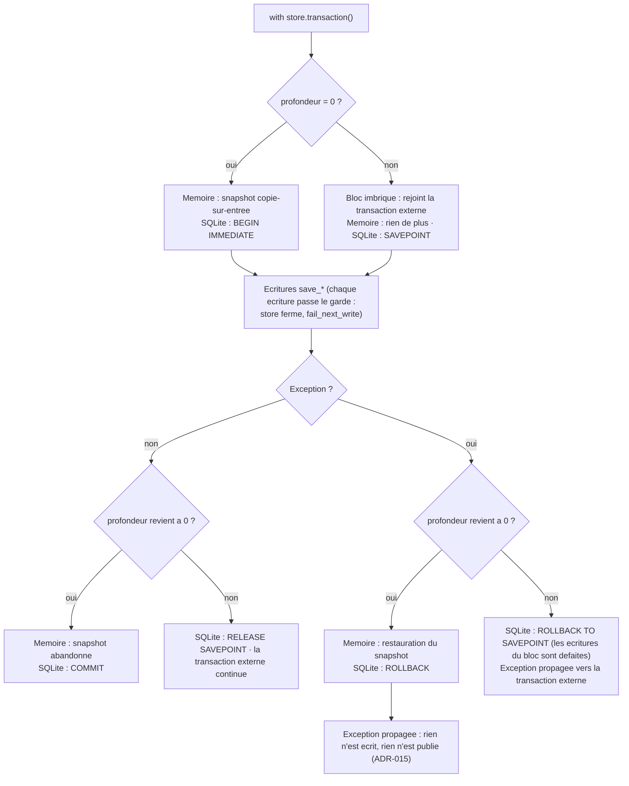
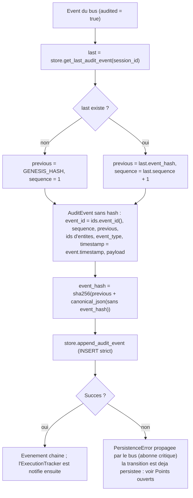
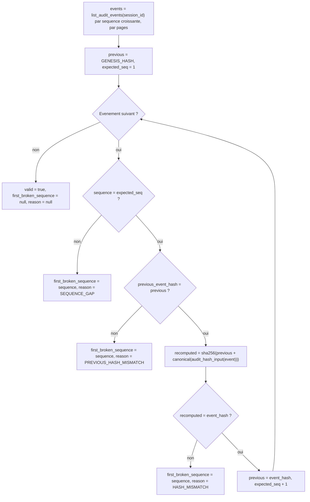
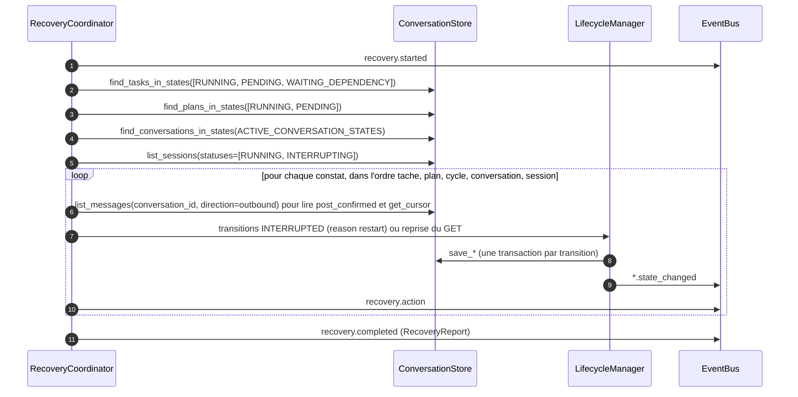

# 04 — Persistance et audit

**Ce que dit la spec.** Le `ConversationStore` (§3.6) persiste « tout l'état d'exécution », des checkpoints stables, et les sorties brutes en blobs référencés ; le modèle de persistance imposé est en [§16](../spec/SPEC-v1.1.md#16-required-persistence-model) (Conversation, Cycle, Plan, Task, AuditEvent, Failure, ContextSummary, Blob). L'`AuditLog` (§3.16) est un journal append-only dont chaque événement porte le hash du précédent ; §17.1 impose que toute transition soit persistée avant d'être exploitée et qu'il n'y ait aucun état critique en mémoire seule ; §7.5 décrit la reprise depuis le dernier checkpoint.

**Ce que précisent les ADR.** [ADR-001](../adr/ADR-001-stack-technique.md) : SQLite en mode WAL derrière une interface **synchrone**, implémentation mémoire pour les tests ; [ADR-012](../adr/ADR-012-budget-de-session.md) : `SessionRecord` ; [ADR-015](../adr/ADR-015-persister-avant-publier.md) : un checkpoint = l'état du store après une transition complète, pas de table de checkpoints ; [ADR-016](../adr/ADR-016-politique-de-reprise.md) : `pid`, `process_group_id`, politique de reprise ; [ADR-017](../adr/ADR-017-determinisme-des-resultats-et-identifiants.md) : sérialisation canonique, formule du hash, hash de genèse ; [ADR-011](../adr/ADR-011-troncature-et-chunks.md) : lecture par plage, rétention des blobs ; [ADR-004](../adr/ADR-004-contrat-de-transport.md) et [ADR-014](../adr/ADR-014-continuation-apres-rotation.md) : `MessageRecord` (idempotence, retransmission) ; §7.3 : décisions de retry persistées (`RetryDecisionRecord`).

Code : [`domain/models.py`](../../src/agentic_local_app/domain/models.py) (records), [`persistence/interface.py`](../../src/agentic_local_app/persistence/interface.py) (ABC), [`persistence/memory.py`](../../src/agentic_local_app/persistence/memory.py) (mémoire), `persistence/sqlite_store.py` (phase 3), [`domain/canonical.py`](../../src/agentic_local_app/domain/canonical.py) (hash), `observability/audit_log.py` (phase 10).

## 1. Modèle de données

Tous les records héritent de `Record` (pydantic, `frozen = True`, `extra = forbid`) : un changement produit un **nouveau** record validé, persisté avant toute publication (ADR-015). Identifiants : chaînes ; horodatages : UTC avec fuseau. Portées d'unicité : `plan_id` et `task_id` viennent du modèle et sont uniques **dans la session** (pour qu'un `ref_task_id` reste non ambigu après rotation) ; les plans sont indexés par `(session_id, plan_id)`, les tâches par `(session_id, task_id)`.

```mermaid
erDiagram
    SessionRecord ||--|{ ConversationRecord : "session_id"
    ConversationRecord |o--o{ ConversationRecord : "parent_conversation_id"
    ConversationRecord ||--o{ CycleRecord : "conversation_id"
    CycleRecord ||--o| PlanRecord : "cycle_id"
    PlanRecord ||--|{ TaskRecord : "session_id, plan_id"
    TaskRecord ||--o{ BlobRecord : "session_id, task_id"
    ConversationRecord ||--o{ MessageRecord : "conversation_id"
    CycleRecord |o--o{ MessageRecord : "cycle_id"
    MessageRecord |o--o| MessageRecord : "retransmission_of"
    SessionRecord ||--o{ AuditEvent : "session_id, sequence"
    SessionRecord ||--o{ FailureRecord : "session_id"
    SessionRecord ||--o{ RetryDecisionRecord : "session_id"
    ConversationRecord ||--o{ ContextSummaryRecord : "source_conversation_id"
    ConversationRecord ||--o| ContextSummaryRecord : "target_conversation_id"

    SessionRecord {
        str session_id PK
        enum status "SessionState"
        str goal
        str user_message
        str user_id
        bool auto_close_on_final_answer
        json budget "SessionBudget max_cycles max_plans max_total_duration_ms"
        int consumed_cycles
        int consumed_plans
        int rotations_count
        str current_conversation_id FK
        json final_answer
        str last_failure_id FK
        datetime started_at
        datetime ended_at
        datetime interrupted_at
        datetime created_at
        datetime updated_at
    }
    ConversationRecord {
        str conversation_id PK
        str session_id FK
        str parent_conversation_id FK
        str remote_conversation_id "id rendu par l'init distant"
        enum status "ConversationState"
        bool auto_close_on_final_answer
        enum context_window_state "ContextWindowState"
        int context_bytes
        int protocol_error_count
        str last_model_response_state
        str current_cycle_id FK
        str current_plan_id FK
        str last_completed_plan_id FK
        bool final_answer_received
        str last_outbound_message_id FK
        str last_inbound_message_id FK
        str get_cursor
        json session_budget_json "copie de lecture du budget"
        str closure_reason
        datetime interrupted_at
        datetime created_at
        datetime updated_at
    }
    CycleRecord {
        str cycle_id PK
        str conversation_id FK
        str session_id FK
        enum cycle_type "discovery execution clarification resume"
        enum status "CycleState"
        int retry_count
        str outbound_message_id FK
        str inbound_message_id FK
        str plan_id FK
        datetime started_at
        datetime ended_at
    }
    PlanRecord {
        str plan_id PK
        str session_id PK
        str conversation_id FK
        str cycle_id FK
        enum plan_type "PlanType"
        str objective
        enum execution_policy "sequential parallel"
        int max_parallel_workers
        enum status "PlanState"
        str stop_reason
        int task_count
        int completed_task_count
        int failed_task_count
        int skipped_task_count
        int cancelled_task_count
        int interrupted_task_count
        int default_max_output_bytes
        json state_summary
        datetime started_at
        datetime ended_at
        datetime created_at
        datetime updated_at
    }
    TaskRecord {
        str task_id PK
        str session_id PK
        str plan_id FK
        str conversation_id FK
        int order_index
        enum type "cmd chunk_request"
        str cmd
        enum status "TaskState"
        bool critical
        bool continue_on_error
        bool stop_plan_on_failure
        bool stop_plan_on_success
        bool stops_plan_on_failure "regle effective ADR-009"
        json depends_on
        str resource_lock
        int max_output_bytes
        int max_output_bytes_applied
        int timeout_ms
        int timeout_ms_applied
        str ref_task_id
        enum stream
        int byte_offset
        int max_bytes
        int attempt_count
        int exit_code
        bool timed_out
        str stdout_ref FK
        str stderr_ref FK
        bool truncated
        int original_size_bytes
        int stdout_total
        int stderr_total
        json stdout_range
        json stderr_range
        str reason
        int pid
        int process_group_id
        datetime started_at
        datetime ended_at
        int duration_ms
        datetime created_at
        datetime updated_at
    }
    MessageRecord {
        str message_id PK
        str session_id FK
        str conversation_id FK
        enum direction "outbound inbound"
        enum message_type "MessageType"
        json payload
        int size_bytes
        str cycle_id FK
        bool post_confirmed
        datetime posted_at
        datetime received_at
        str validation_status "valid invalid null"
        str retransmission_of FK
        datetime created_at
    }
    AuditEvent {
        str event_id PK
        int sequence UK "unique par session"
        str previous_event_hash
        str event_hash
        str session_id FK
        str conversation_id FK
        str cycle_id FK
        str plan_id FK
        str task_id FK
        str event_type
        datetime timestamp
        json payload
    }
    FailureRecord {
        str failure_id PK
        str session_id FK
        str conversation_id FK
        str plan_id FK
        str task_id FK
        enum error_type "ErrorType"
        str error_code
        enum severity
        str origin
        bool retryable
        bool recoverable
        int attempt
        int max_attempts
        json details
        datetime timestamp
    }
    ContextSummaryRecord {
        str summary_id PK
        str session_id FK
        str source_conversation_id FK
        str target_conversation_id FK
        json summary_payload
        int summary_size_bytes
        int reduction_step "palier ADR-005"
        datetime created_at
    }
    BlobRecord {
        str blob_id PK
        str session_id FK
        str task_id FK
        enum blob_type "stdout stderr"
        bytes content "jamais tronque"
        int size_bytes
        datetime created_at
    }
    RetryDecisionRecord {
        str decision_id PK
        str session_id FK
        str conversation_id FK
        str cycle_id FK
        str operation "POST GET INIT"
        enum error_type
        str error_code
        int attempt
        int max_attempts
        str decision "retry abort rotate fail"
        int delay_ms
        datetime created_at
    }
```



### 1.1 Origine des champs : §16 et ajouts des ADR

| Record | Champs de §16 | Ajouts | Motif |
|---|---|---|---|
| `SessionRecord` | *(nouveau)* | tous | budget porté à travers rotations et interruptions, état `READY` (ADR-006, ADR-012) ; `rotations_count` (ADR-013 §5) ; `final_answer` copié pour l'API ; `last_failure_id` |
| `ConversationRecord` | `conversation_id`, `parent_conversation_id`, `status`, `auto_close_on_final_answer`, `context_window_state`, `last_model_response_state`, `current_cycle_id`, `current_plan_id`, `session_budget_json`, `interrupted_at`, `created_at`, `updated_at` | `session_id` (ADR-012), `remote_conversation_id`, `get_cursor`, `last_outbound_message_id`, `last_inbound_message_id` (ADR-004, ADR-016 « POST sans GET »), `context_bytes`, `protocol_error_count` (ADR-013), `last_completed_plan_id`, `final_answer_received` (§4.1), `closure_reason` (`rotated`, `auto_close`, ADR-007) | — |
| `CycleRecord` | `cycle_id`, `conversation_id`, `cycle_type`, `status`, `retry_count`, `started_at`, `ended_at` | `session_id`, `outbound_message_id`, `inbound_message_id`, `plan_id` | bornes du cycle d'ADR-007, reprise ADR-016 |
| `PlanRecord` | `plan_id`, `conversation_id`, `cycle_id`, `plan_type`, `objective`, `execution_policy`, `max_parallel_workers`, `status`, `stop_reason`, `started_at`, `ended_at` | `session_id`, six compteurs de §4.1, `default_max_output_bytes` (ADR-010), `state_summary` (ADR-005), `created_at`, `updated_at` | — |
| `TaskRecord` | `task_id`, `plan_id`, `type`, `cmd`, `status`, `critical`, `continue_on_error`, `stop_plan_on_failure`, `stop_plan_on_success`, `depends_on`, `resource_lock`, `max_output_bytes`, `attempt_count`, `exit_code`, `stdout_ref`, `stderr_ref`, `truncated`, `original_size_bytes`, `started_at`, `ended_at` | `session_id`, `conversation_id`, `order_index` (ADR-017), `stops_plan_on_failure` (ADR-009), `max_output_bytes_applied` (ADR-010), `timeout_ms`, `timeout_ms_applied`, `timed_out` (ADR-008), `ref_task_id`, `stream`, `byte_offset`, `max_bytes`, `stdout_total`, `stderr_total`, `stdout_range`, `stderr_range` (ADR-011), `reason` (ADR-009), `pid`, `process_group_id` (ADR-016), `duration_ms` (§4.1) | — |
| `MessageRecord` | *(nouveau)* | tous | idempotence du POST par `message_id` (ADR-004), reprise « POST envoyé, pas de GET » (ADR-016), `context_bytes` (ADR-013), retransmission (ADR-014), API de debug (ADR-018) |
| `AuditEvent` | `event_id`, `previous_event_hash`, `conversation_id`, `cycle_id`, `plan_id`, `task_id`, `event_type`, `timestamp`, `payload` | `sequence`, `event_hash`, `session_id` | chaîne par session, vérification (ADR-017) |
| `FailureRecord` | `failure_id`, `conversation_id`, `plan_id`, `task_id`, `error_type`, `error_code`, `retryable`, `recoverable`, `details`, `timestamp` | `session_id`, `severity`, `origin`, `attempt`, `max_attempts` | attributs normalisés complets de §6 (c'est le `system_error` interne d'ADR-007) |
| `ContextSummaryRecord` | `summary_id`, `source_conversation_id`, `target_conversation_id`, `summary_payload`, `summary_size_bytes`, `created_at` | `session_id`, `reduction_step` | palier de réduction appliqué (ADR-005 §3) |
| `BlobRecord` | `blob_id`, `task_id`, `blob_type`, `content`, `size_bytes`, `created_at` | `session_id` | lecture par plage après rotation (ADR-011) |
| `RetryDecisionRecord` | *(nouveau)* | tous | « les décisions de retry sont persistées dans l'état » (§7.3), séquence de délais (ADR-017 §5) |

## 2. L'interface `ConversationStore` (§3.6)

Interface **synchrone** (ADR-001) : chaque méthode est un *upsert* ou une lecture, transactionnelle par appel ; `transaction()` groupe plusieurs écritures. Toute erreur remonte en `PersistenceError` (`error_type = PERSISTENCE_ERROR`, `severity = critical`, `transient` dans `details` ; rejouable seulement si transitoire).

| Famille | Méthodes | Sémantique |
|---|---|---|
| Transactions | `transaction()` | contexte atomique ; l'imbrication **rejoint** la transaction externe (un échec interne annule le tout) |
| Sessions | `save_session`, `get_session`, `list_sessions(statuses, limit, offset)` | liste du plus récent au plus ancien (`created_at`, `session_id`) |
| Conversations | `save_conversation`, `get_conversation`, `list_conversations(session_id)`, `find_conversations_in_states(states)` | liste dans l'ordre de création = ordre de la chaîne de rotations ; `find_*` sert au `RecoveryCoordinator` |
| Cycles | `save_cycle`, `get_cycle`, `list_cycles(conversation_id)` | du plus ancien au plus récent |
| Plans | `save_plan`, `get_plan(session_id, plan_id)`, `list_plans(session_id, conversation_id=None)`, `find_plans_in_states` | clé composite |
| Tâches | `save_task`, `save_tasks` (*bulk* atomique à la réception d'un plan), `get_task(session_id, task_id)`, `list_tasks(session_id, plan_id=None, statuses=None)`, `find_tasks_in_states` | ordre : création du plan puis `order_index` (ADR-017) |
| Messages | `save_message`, `get_message`, `list_messages(conversation_id, direction=None)` | du plus ancien au plus récent |
| Échecs et retries | `save_failure`, `list_failures(session_id)`, `save_retry_decision`, `list_retry_decisions(session_id)` | — |
| Résumés | `save_context_summary`, `get_context_summary_for_target(target_conversation_id)`, `list_context_summaries(session_id)` | un résumé au plus par conversation cible |
| Blobs | `save_blob`, `get_blob`, `get_blob_for_task(session_id, task_id, blob_type)`, `read_blob_range(blob_id, offset, max_bytes)` | `size_bytes` doit égaler `len(content)` (`BLOB_SIZE_MISMATCH`) ; plage rognée à la taille ; blob inconnu → `BLOB_NOT_FOUND` ; offset ou taille négatifs → `BLOB_RANGE_INVALID` |
| Audit | `append_audit_event`, `get_last_audit_event(session_id)`, `list_audit_events(session_id, after_sequence, limit)`, `count_audit_events` | **append-only** : réécrire un `event_id` ou une `sequence` → `AUDIT_APPEND_ONLY_VIOLATION` ; trou dans la séquence → `AUDIT_SEQUENCE_GAP` |
| Maintenance | `close()` | écriture après fermeture → `STORE_CLOSED` |

### 2.1 Sémantique de `transaction()`



Exemple : `create_conversation` écrit la conversation puis la session mise à jour dans une seule transaction ; si la seconde écriture échoue, la première est annulée et `conversation.created` n'est pas publié (test `given_store_failing_on_session_write_when_conversation_created_then_nothing_persisted_and_no_event`). Nuance entre les deux implémentations (phase 3) : avec SQLite, une exception qui s'échappe d'un bloc **imbriqué** défait les écritures de ce bloc même si le bloc externe l'attrape et valide (`SAVEPOINT`) ; le store mémoire les conserve dans ce cas. Le code de l'application ne s'appuie pas sur cette différence (il n'attrape jamais une `PersistenceError` à l'intérieur d'une transaction).

## 3. Implémentations

### 3.1 `InMemoryConversationStore` (tests unitaires, §18.3)

Dictionnaires par famille, clés composites pour plans et tâches, ordre d'insertion mémorisé pour des listes stables, rollback par snapshot (`copy.deepcopy` à l'entrée de la transaction externe). Crochets de test : `fail_next_write` (la prochaine écriture lève `PersistenceError("SIMULATED_WRITE_FAILURE")`), `closed`. La suite de contrat de la phase 3 s'exécute **à l'identique** sur les deux implémentations.

### 3.2 `SqliteConversationStore` (exécution, phase 3, ADR-001)

| Sujet | Conception |
|---|---|
| Fichier | `<app.data_dir>/agentic.sqlite3` (+ `-wal`, `-shm`) ; `data_dir` créé au démarrage ; `persistence/factory.py` choisit l'implémentation d'après la configuration |
| Pragmas | `journal_mode = WAL` (fichiers seulement), `synchronous = NORMAL`, `foreign_keys = ON` ; `busy_timeout_ms` (5 000 par défaut) borne l'attente sur une base verrouillée par une autre connexion — voir *Points ouverts* n°5 sur `NORMAL` / `FULL` |
| Connexion | **une** connexion `sqlite3` par store (`check_same_thread=False`, `isolation_level=None`) : transactions **explicites** (`BEGIN IMMEDIATE` / `COMMIT` / `ROLLBACK`) pilotées par `transaction()`, blocs imbriqués en `SAVEPOINT` ; une écriture hors transaction est une instruction unique, atomique par construction |
| Tables | une par record, **générées depuis `model_fields`** des modèles pydantic : colonnes typées d'après l'annotation (`TEXT` / `INTEGER` / `REAL` / `BLOB`), `NOT NULL` quand `None` n'est pas admis ; clés primaires `(session_id, plan_id)` pour les plans, `(session_id, task_id)` pour les tâches, `event_id` + `UNIQUE (session_id, sequence)` pour l'audit ; un nouveau champ de modèle est une nouvelle colonne, **aucun champ ne peut être perdu en silence** |
| Types | énumérations par leur valeur en `TEXT` ; horodatages ISO-8601 UTC à largeur fixe en `TEXT` (l'ordre textuel est l'ordre chronologique) ; dictionnaires, listes, tuples et modèles imbriqués (`depends_on`, `*_range`, `payload`, `details`, `budget`…) en `TEXT` JSON canonique (ADR-017) ; `bytes` en `BLOB` |
| Ordres de tri | insertion (`rowid`) du plus ancien au plus récent, sauf sessions (plus récentes d'abord) ; tâches par ordre d'insertion du plan puis `order_index` (ADR-017) |
| Upsert | par clé du record ; `audit_events` en `INSERT` strict : la violation d'unicité devient `AUDIT_APPEND_ONLY_VIOLATION`, le trou de séquence `AUDIT_SEQUENCE_GAP` |
| Erreurs | toute `sqlite3.Error` → `PersistenceError("SQLITE_ERROR", details.sqlite=…)`, **transitoire** (rejouable) quand le message mentionne une base verrouillée ou occupée ; toute opération après `close()` → `STORE_CLOSED` ; le rollback est garanti par `transaction()` |
| Lecture par plage | `read_blob_range` lit `[offset, offset + max_bytes)` rogné à la taille ; les mêmes erreurs `BLOB_NOT_FOUND` / `BLOB_RANGE_INVALID` que le store mémoire |
| Schéma | créé idempotemment (`CREATE TABLE IF NOT EXISTS`) et estampillé dans `schema_version` ; une base d'une autre version est **refusée** (pas de migration en v1) |
| Horloge | aucune : tous les horodatages viennent des records (ADR-017) |

**Ce que le journal d'audit porte et que les records ne portent pas (ADR-030 §4).** Quand le dictionnaire entre dialectes a réécrit la commande d'une tâche, la charge utile de son `task.state_changed` vers `RUNNING` nomme `cmd_executed`, `translation_rules` et `translated_to` (ou `translation_note` quand rien n'a été réécrit). C'est **la** trace durable de ce qui a réellement tourné : un événement est du JSON dans une chaîne de hachage, écrit une fois et jamais réécrit, là où une colonne aurait coûté une migration. La `TaskRecord` ne garde que la commande du modèle, et le champ `translation` du résultat est redérivé d'elle à la construction du message, comme `execution` et `failure_is_verdict` (ADR-029 §4).

## 4. Blobs et lecture par plage (§3.6, ADR-003, ADR-011)

| Règle | Détail |
|---|---|
| Quand | étape 6 de §8.2, dans la **même transaction** que la tâche terminale : deux `BlobRecord` (stdout, stderr) même vides, référencés par `stdout_ref` / `stderr_ref` |
| Contenu | octets **bruts**, jamais tronqués, jamais décodés (ADR-003 §4) ; `size_bytes = len(content)` |
| Lecture | `read_blob_range(blob_id, offset, max_bytes)` renvoie `content[offset : offset + max_bytes]`, rogné à la taille ; utilisé par `PayloadGuard.serve_chunk` (`chunk_request`) et par `GET /tasks/{tid}/output` (ADR-018) : **même moteur** |
| Après rotation | les blobs de toutes les conversations d'une session restent lisibles (clé `(session_id, task_id, blob_type)`) |
| Tâche interrompue au redémarrage | `stdout_ref` / `stderr_ref` nuls (ADR-016) : un `chunk_request` la visant échoue en `CHUNK_REF_NOT_FOUND` |
| Rétention | conservés tant que la session existe ; `agentic-app purge --older-than` fournie, **rien** n'est supprimé automatiquement en v1 (ADR-011) |

## 5. Chaîne d'audit (§3.16, ADR-017)

L'`AuditLog` est l'abonné **critique** de l'`EventBus` (ADR-015) : il reçoit chaque événement (sauf `task.output`, ADR-018), le transforme en `AuditEvent` chaîné et l'écrit ; s'il échoue, l'exception (`PersistenceError`) remonte à l'appelant.

### 5.1 Formule

```
GENESIS_HASH          = "0" * 64
event_without_hash    = AuditEvent.model_dump() sans la clé "event_hash"
                        (contient event_id, sequence, previous_event_hash, session_id, conversation_id,
                         cycle_id, plan_id, task_id, event_type, timestamp ISO-8601, payload)
event_hash            = sha256( previous_event_hash + canonical_json(event_without_hash) )
canonical_json(obj)   = json.dumps(obj, sort_keys=True, separators=(",", ":"), ensure_ascii=False)
```

La chaîne est **par session** (`sequence` démarre à 1 et `previous_event_hash = GENESIS_HASH` pour le premier événement d'une session) ; elle traverse rotations et interruptions puisque toutes les conversations d'une session partagent la chaîne. `chain_hash` de [`domain/canonical.py`](../../src/agentic_local_app/domain/canonical.py) est la seule fonction utilisée ; les `datetime` sont sérialisés en ISO-8601, les énumérations par leur valeur.

### 5.2 Ajout d'un événement



### 5.3 Vérification `AuditLog.verify(session_id) -> AuditVerification`



`verify(session_id) -> AuditVerification {valid, count, first_broken_sequence, reason}` signale la **première** rupture ; `audit_hash_input(event)` (`observability/audit_log.py`) est le dictionnaire exact qui entre dans le hash — le contrat d'ADR-017, vérifiable depuis n'importe quel langage. Il est exposé par `GET /sessions/{sid}/audit/verify` (ADR-018) et testé en phase 10 sur une chaîne altérée (`given_tampered_audit_event_when_chain_verified_then_first_break_reported`).

## 6. Checkpoints et reprise (§3.6, §7.5, ADR-015, ADR-016)

Il n'y a **pas** de table de checkpoints : un checkpoint stable est l'état du store après une transition complète, garanti par « une transaction par transition » et le mode WAL. Le `RecoveryCoordinator` relit l'état persisté au démarrage (toujours, même sur un store vide : no-op audité).



Ce que le store doit permettre de retrouver pour appliquer la politique d'ADR-016 (détaillée dans [07-interruption-and-recovery](07-interruption-and-recovery.md#4-recoverycoordinator-adr-016)) : les tâches `RUNNING` avec leur `pid` / `process_group_id` / `started_at` (orphelins) ; les plans non terminaux et leurs tâches (recalcul des compteurs) ; les cycles `RUNNING` ; les conversations actives ; pour une conversation `WAITING_MODEL_RESPONSE`, le dernier `MessageRecord` sortant (`post_confirmed`) et le `get_cursor` de la conversation.

## 7. Clés de configuration `[app]`

| Clé | Défaut | Rôle |
|---|---|---|
| `name` | `agentic-local-app` | nom affiché (CLI, `/health`) |
| `data_dir` | `./data` | base SQLite, blobs (dans la base), journal d'audit (dans la base) ; créé si absent |
| `log_level` | `INFO` | niveau de journalisation applicative (distinct de l'audit) |
| `env_file` | `.env` | chargé au démarrage sans écraser les variables existantes (secrets, ADR-018) |

## 8. Ce que la phase 3 teste (§18.2)

| Exigence | Tests attendus (sur les deux implémentations) |
|---|---|
| create / read / update pour chaque record | `given_each_record_type_when_saved_then_read_back_identical` (×11), `given_saved_record_when_saved_again_then_updated_not_duplicated` |
| checkpoint = état après transition | `given_transition_committed_when_store_reopened_then_state_visible`, `given_transaction_failing_midway_when_reopened_then_nothing_of_it_visible` |
| blobs et plages | `given_blob_when_range_read_then_exact_bytes_clipped_to_size`, `given_unknown_blob_when_range_read_then_persistence_error_blob_not_found`, `given_negative_offset_when_range_read_then_blob_range_invalid` |
| audit append-only | `given_existing_sequence_when_appended_again_then_append_only_violation`, `given_gap_in_sequence_when_appended_then_sequence_gap` |
| ordres de tri | `given_tasks_of_two_plans_when_listed_then_plan_creation_then_order_index`, `given_sessions_when_listed_then_newest_first` |
| SQLite | mode WAL effectif, `busy` transitoire, réouverture d'un fichier existant, schéma versionné |

## 9. Points ouverts

1. **Taille des blobs non bornée.** Le blob est la sortie **brute** ; `hard_max_output_bytes` ne borne que ce qui est envoyé au modèle. Une commande très verbeuse peut produire des centaines de mégaoctets stockés dans SQLite. Aucune clé de configuration ne plafonne le blob ; à décider par ADR (`payload.max_blob_bytes` avec arrêt de la capture et drapeau `blob_truncated`, ou laisser tel quel au nom de l'auditabilité).
2. **Abonné d'audit en échec après persistance de la transition** (déjà noté en phase 1) : la transition est écrite mais l'événement n'est pas chaîné, et l'exception remonte à l'appelant. La politique de reprise correspondante (rejouer l'événement manquant depuis l'état, ou marquer la chaîne `degraded`) appartient aux phases 9/10.
3. **`ConversationRecord.session_budget_json`** est une copie de lecture (ADR-012) ; le snapshot §4.1 expose le budget au niveau session. Le champ pourrait dériver dans le temps par rapport au `SessionRecord` si le budget devenait modifiable — il ne l'est pas en v1.
4. **`AuditEvent.timestamp`** est le `timestamp` de l'événement publié (= horodatage persisté sur le record par le propriétaire de la transition) et non l'instant d'écriture dans l'audit : voulu pour la cohérence record / événement (ADR-017), mais à documenter dans l'API (`/audit`).
5. **`synchronous = NORMAL`.** Le store SQLite de phase 3 retient `NORMAL` : en mode WAL, une transaction validée survit à un crash de l'**application** (le cas visé par §17.4) mais les dernières transactions peuvent être perdues sur une coupure de courant ou un crash de l'OS. `FULL` fermerait ce cas au prix d'un `fsync` par transition. Aucun ADR ne tranche ; à décider (une clé `[app] sqlite_synchronous` serait le plus simple).
