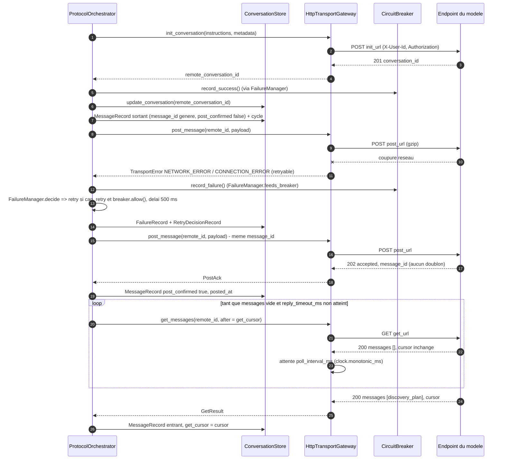
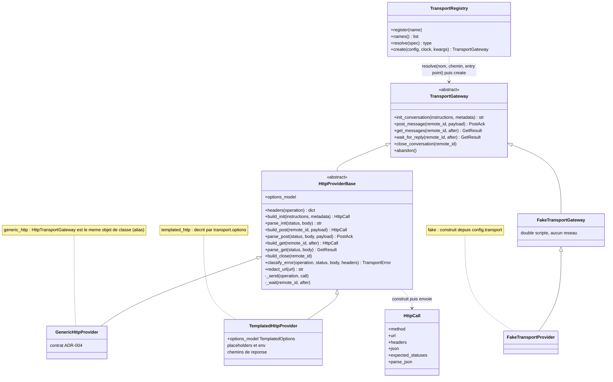
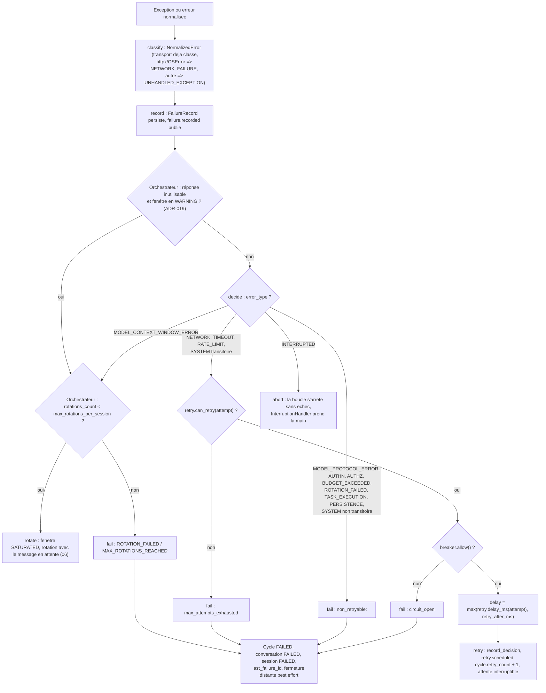
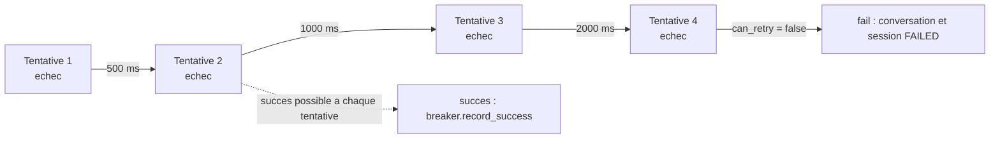
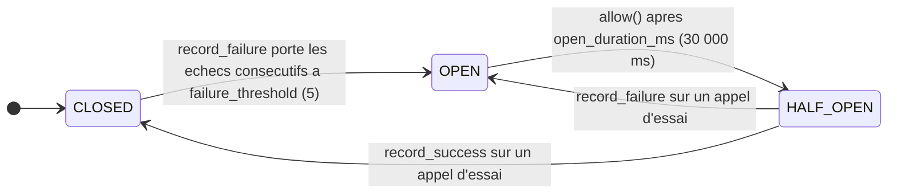
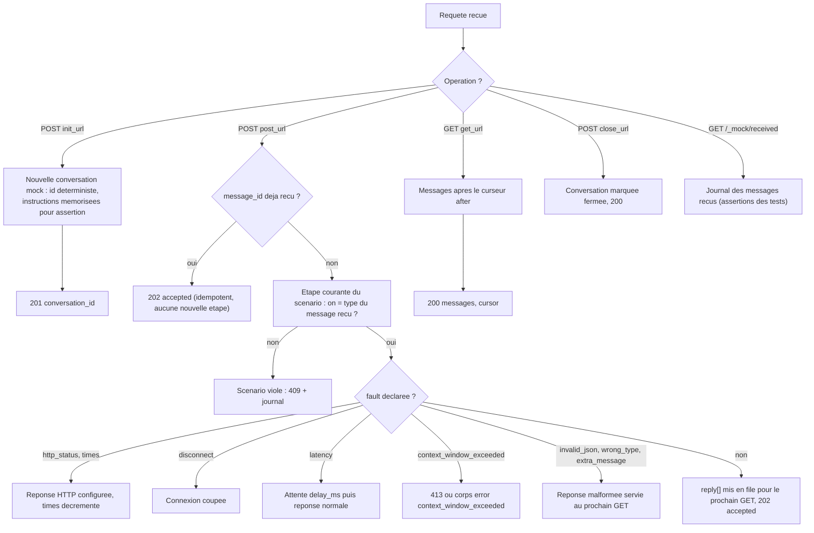

# 05 — Transport et échecs

**Ce que dit la spec.** Le modèle n'est joignable que par `POST message` / `GET messages` ([§2.1](../spec/SPEC-v1.1.md#21-conversation-model)) à travers le `TransportGateway` (§3.12 : gzip optionnel, erreurs normalisées, abandon des appels en vol). Toute défaillance est classée dans la taxonomie fermée de [§6](../spec/SPEC-v1.1.md#6-error-taxonomy) et traitée par la politique déterministe de [§7](../spec/SPEC-v1.1.md#7-deterministic-failure-policy) : retry borné sur les seuls types rejouables (§7.1), aucun retry sur les autres (§7.2), backoff exponentiel borné et décisions persistées (§7.3), disjoncteur (§7.4). `FailureManager` classe et décide (§3.13), `RetryController` calcule (§3.14), `CircuitBreaker` protège (§3.15).

**Ce que précisent les ADR.** [ADR-004](../adr/ADR-004-contrat-de-transport.md) : endpoints configurables (`init`, `post`, `get`, `close`), jeton et `user_id`, GET en polling avec curseur, POST idempotent par `message_id`, mapping HTTP → §6, serveur mock à scénarios ; [ADR-020](../adr/ADR-020-transport-enfichable.md) : plusieurs implémentations (*providers*) du même contrat, choisies par `transport.provider` (registre, base « template method », provider `templated_http` décrit par configuration) ; [ADR-018](../adr/ADR-018-api-pour-un-front-et-flux-live.md) : le jeton vient de la variable nommée par `transport.token_env` ; [ADR-017](../adr/ADR-017-determinisme-des-resultats-et-identifiants.md) : backoff `min(base × 2^attempt, cap)` sans gigue par défaut, `message_id` généré et persisté avant le POST ; [ADR-013](../adr/ADR-013-metrique-de-saturation.md) : `MODEL_CONTEXT_WINDOW_ERROR` et erreurs de protocole répétées déclenchent la rotation (décision `rotate`) ; [ADR-008](../adr/ADR-008-timeout-et-retry-de-tache.md) : la retryabilité ne concerne que le transport, jamais une commande ; [ADR-006](../adr/ADR-006-interruption-nouvelle-conversation.md) / [ADR-012](../adr/ADR-012-budget-de-session.md) : fermeture distante en *best effort*, rien n'est envoyé au modèle sur `BUDGET_EXCEEDED`.

Code : [`domain/errors.py`](../../src/agentic_local_app/domain/errors.py) (`ErrorType`, `NormalizedError`, `TransportError`…), [`config.py`](../../src/agentic_local_app/config.py) (`TransportSection`, `RetrySection`, `CircuitBreakerSection`), `transport/base.py` (contrat), `transport/http_base.py`, `transport/registry.py`, `transport/providers/*`, `transport/fake.py`, `transport/gateway.py` (façade de compatibilité), `resilience/*`, `testing/mock_model_server.py` (phase 7). La machine à états du disjoncteur est dans [01](01-state-machines.md#9-disjoncteur-74).

## 1. Contrat d'endpoints (ADR-004)

Les URL sont des gabarits dont les seuls placeholders sont `{conversation_id}` (identifiant **distant**) et `{after}` (curseur). Les corps sont JSON canonique (ADR-017), compressés `gzip` si `transport.gzip`.

| Opération | Requête | Corps | Réponse attendue | Idempotence | Erreur de forme |
|---|---|---|---|---|---|
| **init** | `POST init_url` | `{ "user_id", "instructions": <texte du protocole>, "metadata": { "session_id", "parent_conversation_id" } }` | `201 { "conversation_id": "…" }` | non ; un retry après échec réseau peut créer une conversation distante orpheline (voir *Points ouverts* n°3) | `RESPONSE_SCHEMA_INVALID` |
| **post** | `POST post_url` | le message protocolaire complet `{ type, conversation_id, message_id, content }` | `202 { "accepted": true, "message_id": "…" }` | **oui** : re-POST du même `message_id` ⇒ même accusé, aucun doublon côté modèle | `RESPONSE_SCHEMA_INVALID` |
| **get** | `GET get_url` avec `after` = dernier `message_id` connu (`ConversationRecord.get_cursor`, vide au premier appel) | — | `200 { "messages": [ … ], "cursor": "<message_id du dernier>" }` ; liste vide tant que le modèle n'a pas répondu | lecture ; le curseur garantit qu'aucun message n'est lu deux fois ni sauté | `RESPONSE_NOT_JSON`, `RESPONSE_SCHEMA_INVALID` |
| **close** (option) | `POST close_url` | `{ "conversation_id" }` | `200` | *best effort* : jamais retenté, jamais bloquant (ADR-006) ; `close_url` vide ⇒ fermeture locale seulement | ignorée (journalisée) |

En-têtes envoyés sur chaque requête :

| En-tête | Valeur | Condition |
|---|---|---|
| `X-User-Id` | `transport.user_id` | toujours |
| `Authorization` | `Bearer <jeton>` | si la variable `transport.token_env` (défaut `AGENTIC_TRANSPORT_TOKEN`) est définie et non vide ; le jeton n'est jamais persisté ni journalisé |
| `Content-Type` | `application/json` | POST |
| `Content-Encoding` | `gzip` | POST, si `transport.gzip = true` |
| `Accept` / `Accept-Encoding` | `application/json` / `gzip` | toujours |

### 1.1 Séquence : init, POST idempotent, GET en polling



Le GET est un **polling** : chaque requête est bornée par `request_timeout_ms` ; l'attente globale d'une réponse est bornée par `reply_timeout_ms` (défaut 120 000 ms) → `TIMEOUT_ERROR / MODEL_GET_TIMEOUT`, rejouable (§7.1). `abandon()` annule les appels en vol et la boucle de polling (interruption, §2.9) ; le `MessageRecord` sortant reste persisté pour la reprise (ADR-016).

Interface (`TransportGateway`, ABC) : `init_conversation(instructions, metadata) -> str` · `post_message(remote_conversation_id, payload) -> PostAck {accepted, message_id, http_status}` · `get_messages(remote_conversation_id, after) -> GetResult {messages, cursor, http_status, polls}` · `close_conversation(remote_conversation_id)` · `abandon()`. Implémentations : `HttpTransportGateway` (httpx, `timeout = request_timeout_ms`, `verify = verify_tls`) — désormais le provider `generic_http` — et `FakeTransportGateway` (réponses scriptées, erreurs injectables, aucun réseau) ; les autres providers sont décrits en §1.2.

### 1.2 Providers : plusieurs implémentations du contrat (ADR-020)

Le contrat reste unique, mais le modèle réel branché n'expose pas forcément les endpoints d'ADR-004. Un **provider** est une classe concrète de `TransportGateway`, construite par convention `Provider(config.transport, clock, **kwargs)` (`kwargs` : `transport` httpx et `sleep`, injectés par les tests) et choisie **par configuration seulement** : `transport.provider` désigne un nom enregistré (`generic_http`, `templated_http`, `fake`), un chemin d'import `paquet.module:Classe` ou un entry point du groupe `agentic_local_app.transports` ; `transport.options` est la sous-table propre au provider, validée par son `options_model` (pydantic, `extra = forbid`).



`HttpProviderBase` (« template method ») porte tout le commun : client httpx et timeouts, `InFlightGuard` / `abandon()`, JSON canonique et gzip, polling de `wait_for_reply` (`MODEL_GET_TIMEOUT`), statuts attendus, table HTTP → `ErrorType` du §2 (`classify_error`, surchargeable) et les `details` `operation` / `http_status` / `url` estampillés sur chaque erreur. Un provider décrit chaque opération par un `HttpCall` (`build_*`) et lit chaque réponse (`parse_*`) ; un corps hors contrat se signale par `InvalidResponseError`, transformé par la base en `MODEL_PROTOCOL_ERROR / INVALID_RESPONSE_BODY`.

| Provider | Classe | Options | Ce qu'il fait |
|---|---|---|---|
| `generic_http` (défaut) | `GenericHttpProvider` = `HttpTransportGateway` | aucune | le contrat du §1 tel quel ; `close_url` avec `transport.close_method` (`POST` / `DELETE`) |
| `templated_http` | `TemplatedHttpProvider` | `TemplatedOptions` : `headers` communs, tables `init` / `post` / `get` / `close` (`method`, `url`, `headers`, `body`, `expected_statuses`, chemins de réponse) | méthode, URL, en-têtes et corps de chaque opération sont des gabarits (`{conversation_id}`, `{after}`, `{instructions}`, `{user_id}`, `{metadata_json}`, `{message_json}`, `{message_id}`, `{message_type}`, `{token}`, `${env:VAR}` résolu à l'appel) ; les réponses se lisent par chemins pointés avec index (`data.items[0].id`) ; n'envoie ni `X-User-Id` ni `Authorization` sans que les options le disent |
| `fake` | `FakeTransportProvider` (sous-classe de `FakeTransportGateway`) | aucune | le double scripté, pour un lancement sans réseau |
| chemin d'import / entry point | n'importe quelle classe concrète de `TransportGateway` | son `options_model` | extension sans modification du dépôt (ADR-020 §6) |

Le `TransportRegistry` résout le nom (nom enregistré > chemin d'import > entry point, découverte paresseuse) et instancie le provider après validation des options ; `build_application` l'appelle avant d'ouvrir le store quand aucun transport n'est injecté. Erreurs : `TRANSPORT_PROVIDER_UNKNOWN` (avec les noms disponibles), `TRANSPORT_PROVIDER_INVALID`, `TRANSPORT_OPTIONS_INVALID`, et à l'appel `TRANSPORT_ENV_MISSING` (variable `${env:…}` ou `{token}` absente). CLI : `agentic-app transport list` et `agentic-app transport show` (options masquées : valeurs `${env:…}` et clés `*key*` / `*token*` / `*secret*`).

## 2. Classification HTTP → taxonomie (ADR-004)

Le `TransportGateway` lève toujours une `TransportError` **déjà classée** (`origin = TransportGateway`) ; le `FailureManager` ne regarde que `error_type` et `details`.

| HTTP / situation | `error_type` | `error_code` (proposé) | `retryable` | `details` |
|---|---|---|---|---|
| 401 | `AUTHN_ERROR` | `HTTP_401` | non | `operation`, `status` |
| 403 | `AUTHZ_ERROR` | `HTTP_403` | non | idem |
| 429 | `RATE_LIMIT_ERROR` | `HTTP_429` | oui | `retry_after_ms` si `Retry-After` présent |
| 408, 504 | `TIMEOUT_ERROR` | `HTTP_408`, `HTTP_504` | oui | `timeout_ms` |
| délai client `request_timeout_ms` dépassé | `TIMEOUT_ERROR` | `REQUEST_TIMEOUT` | oui | `timeout_ms` |
| aucune réponse du modèle en `reply_timeout_ms` | `TIMEOUT_ERROR` | `MODEL_GET_TIMEOUT` | oui | `timeout_ms`, `polls` (exemple §12.10) |
| 413, ou corps `{"error": "context_window_exceeded"}` | `MODEL_CONTEXT_WINDOW_ERROR` | `HTTP_413`, `CONTEXT_WINDOW_EXCEEDED` | non (→ `rotate`) | `status`, `body_excerpt` |
| erreur de connexion, DNS, TLS, coupure | `NETWORK_ERROR` | `CONNECTION_ERROR` | oui | `exception` |
| 502, 503 | `NETWORK_ERROR` | `HTTP_502`, `HTTP_503` | oui | `retry_after_ms` éventuel |
| autre 5xx (500, 501, 505…) | `SYSTEM_ERROR` | `HTTP_5XX` | oui (`transient = true`) | `status` |
| corps non JSON | `MODEL_PROTOCOL_ERROR` | `RESPONSE_NOT_JSON` | non | `operation`, `status`, `body_excerpt` |
| JSON hors contrat (pas de `conversation_id` à l'init, pas de `messages`/`cursor` au GET, `accepted` absent au POST) | `MODEL_PROTOCOL_ERROR` | `RESPONSE_SCHEMA_INVALID` | non | idem |
| exception `httpx.TransportError` / `OSError` non classée par le gateway | `NETWORK_ERROR` | `NETWORK_FAILURE` (classification de repli du `FailureManager.classify`) | oui | `exception`, `message` |
| exception inattendue | `SYSTEM_ERROR` | `UNHANDLED_EXCEPTION` (`severity = critical`) | non | `type`, `message` |
| autre 4xx (400, 404, 409…) | `SYSTEM_ERROR` | `HTTP_4XX` | non (`transient = false`) | `status`, `body_excerpt` — le gateway de phase 7 les classe ainsi ; hors table ADR-004, voir *Points ouverts* n°2 |

Le disjoncteur n'est **pas** une erreur de transport : c'est le `FailureManager` qui consulte `breaker.allow()` au moment de décider un retry (voir §4 et §7). Le mapping est implémenté dans [`transport/gateway.py`](../../src/agentic_local_app/transport/gateway.py) (phase 7) ; un corps `{"error": "context_window_exceeded"}` est reconnu quel que soit le statut 4xx.

## 3. Taxonomie §6 et politique §7

| `error_type` | Origines typiques | `retryable` | `recoverable` | Décision du `FailureManager` | Réf. |
|---|---|---|---|---|---|
| `AUTHN_ERROR` | transport 401 | non | non | `fail` | §7.2 |
| `AUTHZ_ERROR` | transport 403 | non | non | `fail` | §7.2 |
| `NETWORK_ERROR` | connexion, 502, 503 | oui | oui | `retry` borné (si le disjoncteur autorise), puis `fail` | §7.1 |
| `TIMEOUT_ERROR` | 408, 504, délai client, `MODEL_GET_TIMEOUT` | oui | oui | `retry` borné, puis `fail` | §7.1 |
| `RATE_LIMIT_ERROR` | 429 | oui | oui | `retry` (délai ≥ `Retry-After`), puis `fail` | §7.1 |
| `MODEL_PROTOCOL_ERROR` | `ProtocolAdapter` (catalogue [02 §5.3](02-protocol.md#53-catalogue-des-codes-protocolerror)), corps de réponse invalide | non | non | `fail` (§7.2) — sauf si la fenêtre de contexte est en `WARNING` : l'orchestrateur rotate une fois (ADR-019 §2) | §7.2, ADR-013 |
| `MODEL_CONTEXT_WINDOW_ERROR` | 413, `context_window_exceeded` | non | oui | `rotate` ; l'orchestrateur transforme en `ROTATION_FAILED` si `max_rotations_per_session` est atteint | §10, ADR-013 |
| `TASK_EXECUTION_ERROR` | `CommandExecutor` : `SPAWN_FAILED` | non (non transitoire) | oui | aucune décision de boucle : tâche `FAILED`, `FailureRecord`, le plan suit ses drapeaux | ADR-008 §4 |
| `PERSISTENCE_ERROR` | store : `SQLITE_ERROR` (transitoire quand la base est verrouillée ou occupée), `AUDIT_APPEND_ONLY_VIOLATION`, `BLOB_NOT_FOUND`… | transitoire seulement | transitoire seulement | `fail` par la politique de phase 7 (non listée comme rejouable) ; un retry court des seules erreurs transitoires est proposé en *Points ouverts* n°5 | §7.2 |
| `BUDGET_EXCEEDED` | `ProtocolOrchestrator` / `PlanRunner` : `BUDGET_MAX_CYCLES`, `BUDGET_MAX_PLANS`, `BUDGET_MAX_TOTAL_DURATION_MS` | non | non | `fail` : conversation et session `FAILED`, rien n'est envoyé au modèle | §2.8, ADR-012 |
| `ROTATION_FAILED` | `ContextReducer` (`SUMMARY_OVER_BUDGET`), orchestrateur (`MAX_ROTATIONS_REACHED`, `ACK_NOT_RECEIVED`) | non | non | `fail` | §2.6, ADR-005, ADR-013 |
| `INTERRUPTED` | `InterruptionHandler` : `USER_INTERRUPT` | non | oui | `abort` : la boucle s'arrête sans échec de session, le nettoyage est fait par l'`InterruptionHandler` | §2.9, ADR-006 |
| `SYSTEM_ERROR` | 5xx transitoires (`HTTP_5XX`), `INVALID_TRANSITION`, `CONFIG_*`, `UNHANDLED_EXCEPTION`, abonné du bus en échec | si `details.transient` | si `transient` | `retry` borné si transitoire, sinon `fail` | §7.1 « transitoire sélectionné » |

Attributs normalisés (`NormalizedError`) : `error_type`, `error_code`, `severity` (low, medium, high, critical), `origin`, `retryable`, `recoverable`, `attempt`, `max_attempts`, `details`. Chaque échec devient un `FailureRecord` (le `system_error` interne d'ADR-007), un événement `failure.recorded`, et une métrique.

## 4. Flowchart de décision du `FailureManager` (§7, ADR-013)

`FailureManager.decide(error, attempt, *, operation) -> Decision(kind ∈ {retry, abort, rotate, fail}, delay_ms, reason)` ([`resilience/failure_manager.py`](../../src/agentic_local_app/resilience/failure_manager.py), phase 7) ; `classify(exc)` normalise une exception quelconque, `record(...)` persiste le `FailureRecord` et publie `failure.recorded`, `record_decision(...)` persiste la `RetryDecisionRecord` et publie `retry.scheduled`. Le seuil d'erreurs de protocole (ADR-013) et le plafond de rotations sont évalués par l'**orchestrateur** autour de cette politique.



Sémantique des quatre décisions :

| Décision | `reason` | Effet sur le cycle | Effet sur la conversation / session | Suite |
|---|---|---|---|---|
| `retry` | `retryable_error` | `retry_count + 1`, reste `RUNNING` | inchangées | même opération, même `message_id`, après `delay_ms` |
| `abort` | `interrupted` | `RUNNING → INTERRUPTED` (par l'`InterruptionHandler`) | interruption en cours (ADR-006) | aucune : le nettoyage appartient à l'`InterruptionHandler` ([07](07-interruption-and-recovery.md)) |
| `rotate` | `context_window_exceeded` (ou seuil d'erreurs de protocole, évalué par l'orchestrateur) | `RUNNING → FAILED` (`reason = rotation`) | conversation `→ ROTATING` | séquence de [06](06-context-rotation.md#3-séquence-complète-de-rotation-adr-014) |
| `fail` | `max_attempts_exhausted`, `circuit_open`, `non_retryable:<type>` | `RUNNING → FAILED` | conversation `→ FAILED`, session `→ FAILED` | `close_url` en *best effort* ; l'API et la CLI exposent le `FailureRecord` |

## 5. Backoff déterministe (§7.3, ADR-017)

`RetryController(config.retry)` : `can_retry(attempt) = attempt < max_attempts` ; `delay_ms(attempt) = min(base_delay_ms × 2^(attempt − 1), max_delay_ms)` où `attempt` est le numéro (à partir de 1) de la tentative qui vient d'échouer — c'est le `min(base × 2^attempt, cap)` d'ADR-017 avec un index de retry compté à partir de 0. La gigue (`jitter_ratio`, défaut 0) multiplie le délai par un facteur dans `[1 − r, 1 + r]` ; c'est le seul aléa autorisé hors `domain/ids.py`, désactivé dans les tests. La séquence de délais est persistée avec chaque décision (`RetryDecisionRecord.delay_ms`).

Exemple avec les défauts de [`config.toml`](../../config.toml) (`max_attempts = 4`, `base_delay_ms = 500`, `max_delay_ms = 8000`) sur un GET qui échoue en `NETWORK_ERROR` :

| Tentative échouée | `can_retry` | Délai avant la suivante | Cumul d'attente | `NormalizedError.attempt / max_attempts` |
|---|---|---|---|---|
| 1 | oui | min(500 × 1, 8000) = **500 ms** | 500 ms | 1 / 4 |
| 2 | oui | min(500 × 2, 8000) = **1 000 ms** | 1 500 ms | 2 / 4 |
| 3 | oui | min(500 × 4, 8000) = **2 000 ms** | 3 500 ms | 3 / 4 |
| 4 | **non** | — → décision `fail` | 3 500 ms | 4 / 4 |

Le plafond `max_delay_ms` n'intervient qu'à partir de la sixième tentative (500 × 32 = 16 000 → 8 000) avec un `max_attempts` plus élevé. Un `429` avec `Retry-After: 5` à la première tentative donne `max(500, 5000) = 5 000 ms`. L'exemple §12.10 (`attempt = 2`, `max_attempts = 4`, `MODEL_GET_TIMEOUT`) correspond à la deuxième ligne.



L'attente est un `asyncio.sleep` piloté par l'horloge injectée en test (`FakeClock.advance`) et **interruptible** : un signal d'interruption pendant le backoff abandonne le retry (§2.9).

## 6. Où et quand l'appel est retenté

Un retry rejoue **la même opération avec le même `message_id`** : c'est sûr parce que le `MessageRecord` est persisté avant le premier POST et que le POST distant est idempotent (ADR-004). Un retry de GET reprend avec le même `after`. La retryabilité ne s'applique **qu'au transport** : une commande qui échoue ou dépasse son temps est un résultat de tâche, jamais une `TIMEOUT_ERROR` (ADR-008 §3).

| Opération | Retry | Après épuisement |
|---|---|---|
| `INIT` | oui | conversation `FAILED` (`NEW → FAILED` ou `ACTIVE → FAILED`), session `FAILED` |
| `POST` | oui, même `message_id` | cycle `FAILED`, conversation `FAILED`, session `FAILED` |
| `GET` | oui, même curseur | idem |
| `CLOSE` | **jamais** (*best effort*) | journalisé |

## 7. CircuitBreaker (§7.4)



| Règle | Détail |
|---|---|
| Ce qui compte comme échec | les échecs « de classe transport » (§7.4 « repeated transport failures ») : `NETWORK_ERROR`, `TIMEOUT_ERROR`, `RATE_LIMIT_ERROR`, `SYSTEM_ERROR` transitoire — `FailureManager.feeds_breaker(error)` ; **pas** AUTHN/AUTHZ, ni les erreurs de protocole ou de contexte |
| `allow()` | `CLOSED` → vrai ; `OPEN` → faux tant que `monotonic_ms − opened_at < open_duration_ms`, puis passage `HALF_OPEN` ; `HALF_OPEN` → vrai pour au plus `half_open_max_calls` appels d'essai (1), faux au-delà |
| `record_success()` | `HALF_OPEN → CLOSED` (compteurs remis à zéro) ; en `CLOSED` remet le compteur d'échecs consécutifs à zéro ; en `OPEN` un succès tardif ne ferme **pas** le disjoncteur |
| `record_failure()` | incrémente les échecs consécutifs ; `CLOSED → OPEN` au seuil ; `HALF_OPEN → OPEN` immédiatement ; en `OPEN` compté sans rouvrir la fenêtre |
| Refus | consulté par le `FailureManager` au moment de décider un retry : `allow()` faux ⇒ décision `fail` (`reason = circuit_open`), aucun nouvel appel n'est tenté — c'est ainsi que « les appels distants s'arrêtent temporairement » (§7.4) ; voir *Points ouverts* n°7 |
| « Conversation dégradée » | pas d'état de conversation (§5.1 n'en a aucun) : propriété `CircuitBreaker.degraded` (état ≠ `CLOSED`), événement d'audit `breaker.state_changed`, `FailureRecord`, exposition par `/health` et la métrique `breaker_state` |
| Portée | un disjoncteur par endpoint (instance unique en v1, l'application ne parle qu'à un modèle) ; état en mémoire, reconstruit `CLOSED` au redémarrage (le premier appel réel dira la vérité) ; transitions vérifiées par `assert_transition(CIRCUIT_TRANSITIONS, …)` |
| Événement | `breaker.state_changed` `{from, to, reason, consecutive_failures}` |

## 8. Serveur mock et scénarios (ADR-004)

`testing/mock_model_server.py` : application FastAPI qui implémente **exactement** le contrat du §1 et joue le modèle à partir d'un scénario JSON. Usages : tests d'intégration de la phase 9, démonstrations (`agentic-app mock-server --scenario fichier.json`), injection de pannes en phase 7.



Format de scénario (proposé) :

```json
{
  "name": "java-mismatch-with-503",
  "steps": [
    { "on": "user_request",     "reply": [ { "type": "discovery_plan", "content": { "...": "..." } } ] },
    { "on": "execution_result", "reply": [ { "type": "execution_plan", "content": { "...": "..." } } ],
      "fault": { "kind": "http_status", "status": 503, "times": 1 } },
    { "on": "execution_result", "reply": [ { "type": "final_answer",   "content": { "...": "..." } } ],
      "fault": { "kind": "latency", "delay_ms": 300 } }
  ]
}
```

Le mock renseigne lui-même `conversation_id` et `message_id` des réponses (identifiants déterministes `mock-msg-0001`…), conserve tout ce qu'il reçoit, et sert un `context_resume_ack` automatique à un `context_resume_request` sauf si le scénario dit le contraire.

## 9. Clés de configuration

| Section | Clé | Défaut | Rôle | Réf. |
|---|---|---|---|---|
| `[transport]` | `init_url` | `http://127.0.0.1:9000/v1/conversations` | création d'une conversation distante | ADR-004 |
| `[transport]` | `post_url` | `…/conversations/{conversation_id}/messages` | dépôt d'un message ; doit contenir `{conversation_id}` (validé au chargement) | ADR-004 |
| `[transport]` | `get_url` | `…/messages?after={after}` | lecture ; doit contenir `{conversation_id}` et `{after}` | ADR-004 |
| `[transport]` | `close_url` | `""` | fermeture distante optionnelle ; vide = locale seulement | ADR-004, ADR-006 |
| `[transport]` | `token_env` | `AGENTIC_TRANSPORT_TOKEN` | nom de la variable d'environnement du jeton (jamais le jeton lui-même) | ADR-018 |
| `[transport]` | `user_id` | `local-user` | `X-User-Id` et corps de l'init | ADR-004 |
| `[transport]` | `request_timeout_ms` | 15 000 | délai d'un appel HTTP | ADR-004 |
| `[transport]` | `poll_interval_ms` | 1 000 | intervalle entre deux GET sans réponse | ADR-004 |
| `[transport]` | `reply_timeout_ms` | 120 000 | attente maximale d'une réponse (`MODEL_GET_TIMEOUT`) | ADR-004 |
| `[transport]` | `gzip` | `true` | `Content-Encoding: gzip` sur les POST | §3.12 |
| `[transport]` | `verify_tls` | `true` | vérification TLS (à ne désactiver que pour un mock local) | — |
| `[transport]` | `provider` | `generic_http` | implémentation du transport : nom enregistré, `paquet.module:Classe` ou entry point `agentic_local_app.transports` | ADR-020 |
| `[transport]` | `close_method` | `POST` | méthode HTTP de `close_url` pour `generic_http` (`POST` ou `DELETE`) | ADR-020 |
| `[transport.options]` | (sous-table) | `{}` | options propres au provider, validées par son `options_model` (`templated_http` : `headers`, `init`, `post`, `get`, `close`) | ADR-020 |
| `[retry]` | `max_attempts` | 4 | tentatives au total, retries compris | §7.3 |
| `[retry]` | `base_delay_ms` | 500 | base du backoff | ADR-017 |
| `[retry]` | `max_delay_ms` | 8 000 | plafond d'un délai | ADR-017 |
| `[retry]` | `jitter_ratio` | 0.0 | gigue optionnelle (0 = déterministe) | ADR-017 |
| `[circuit_breaker]` | `failure_threshold` | 5 | échecs consécutifs avant ouverture | §7.4 |
| `[circuit_breaker]` | `open_duration_ms` | 30 000 | durée d'ouverture avant `HALF_OPEN` | §7.4 |
| `[circuit_breaker]` | `half_open_max_calls` | 1 | appels d'essai admis en `HALF_OPEN` | §7.4 |

## 10. Ce que la phase 7 teste (§18.2)

| Exigence | Tests attendus |
|---|---|
| POST / GET succès et erreurs (`FakeTransportGateway`, puis `HttpTransportGateway` contre le mock) | `given_post_accepted_when_same_message_reposted_then_single_ack_no_duplicate`, `given_empty_replies_when_reply_timeout_reached_then_model_get_timeout_error`, `given_each_http_status_when_mapped_then_expected_error_type` (table §2) |
| Classification pour chaque type de §6 | `given_each_error_type_when_decided_then_expected_decision` (table §3) |
| Backoff et bornes | `given_default_retry_config_when_delays_computed_then_500_1000_2000`, `given_attempt_equal_to_max_when_can_retry_then_false`, `given_retry_after_header_when_delay_computed_then_at_least_retry_after` |
| Disjoncteur | `given_five_consecutive_failures_when_recorded_then_breaker_open`, `given_open_breaker_when_open_duration_elapsed_then_half_open`, `given_half_open_breaker_when_probe_succeeds_then_closed`, `given_half_open_breaker_when_probe_fails_then_open_again` |
| Persistance des décisions | `given_retry_decided_when_persisted_then_retry_decision_record_matches_delay_sequence` |

## 11. Points ouverts

1. **Erreurs de protocole répétées vs « aucun retry » (§7.2 / ADR-013).** ADR-013 déclenche la rotation à la deuxième erreur de protocole de la même conversation ; le `FailureManager` de phase 7 décide `fail` dès la première (lecture littérale de §7.2). Avec le défaut `protocol_errors_before_rotation = 2`, la branche « rotation » n'est donc atteignable que si l'orchestrateur re-sollicite le modèle après la première erreur (retransmission du message en attente dans un nouveau cycle, bornée par `max_cycles`), ce que §7.2 peut être lu comme interdisant. Un ADR devrait trancher entre cette re-sollicitation, un seuil à 1, ou l'abandon de la règle.
2. **Codes HTTP 4xx hors table.** ADR-004 ne classe ni 400, ni 404, ni 409. Ce document les range en `SYSTEM_ERROR` non transitoire (`fail`) ; un 404 sur `post_url` (conversation distante disparue) pourrait mériter une rotation plutôt qu'un échec. À décider.
3. **Idempotence de l'`init`.** Le contrat ne fournit pas de clé d'idempotence pour l'`init` ; un retry après coupure réseau peut créer une conversation distante orpheline, inoffensive mais non fermée. Proposer un en-tête `Idempotency-Key = <conversation_id local>` dans le contrat.
4. **`token` vs `token_env`, `close_url: null` vs `""`.** Le YAML d'ADR-004 montre `token:` et `close_url: null` ; ADR-018 et `config.py` retiennent `token_env` et une chaîne vide. ADR-018 étant postérieur, c'est lui qui fait foi ; ADR-004 devrait être annoté.
5. **`PERSISTENCE_ERROR` transitoire.** §7.2 exclut les erreurs de persistance *persistantes* ; le store SQLite marque `transient = true` quand la base est verrouillée ou occupée, mais la politique de phase 7 ne rejoue que `NETWORK`, `TIMEOUT`, `RATE_LIMIT` et `SYSTEM` transitoire : une erreur de persistance transitoire échoue donc au premier coup. Un retry court (même `RetryController`) serait cohérent avec §7.1 ; aucun ADR ne le décrit.
6. **Point de contrôle `max_cycles`.** ADR-012 §2 incrémente `consumed_cycles` à l'ouverture d'un cycle et §3 vérifie « avant de traiter un message entrant ». Lecture retenue : le contrôle `consumed_cycles ≥ max_cycles` a lieu **avant d'ouvrir** un nouveau cycle (donc avant de persister le message sortant suivant), ce qui revient à refuser de traiter le tour suivant ; à confirmer en phase 9.
7. **Le disjoncteur n'est consulté qu'au retry.** Le `TransportGateway` de phase 7 n'appelle pas `allow()` avant un appel ; seul le `FailureManager` le consulte pour décider un retry. Un premier appel d'une nouvelle opération pendant l'ouverture est donc tenté (et échouera probablement, nourrissant le compteur). §7.4 « stop remote calls temporarily » serait mieux servi par un `allow()` dans l'orchestrateur avant chaque opération ; à décider en phase 9.
