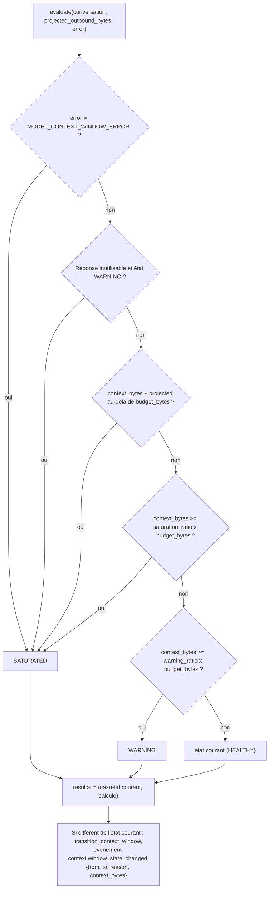
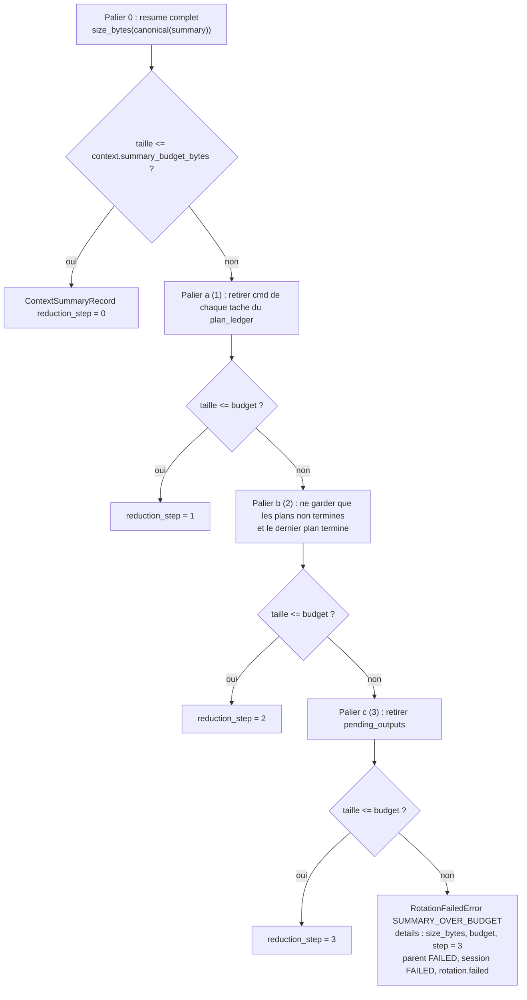
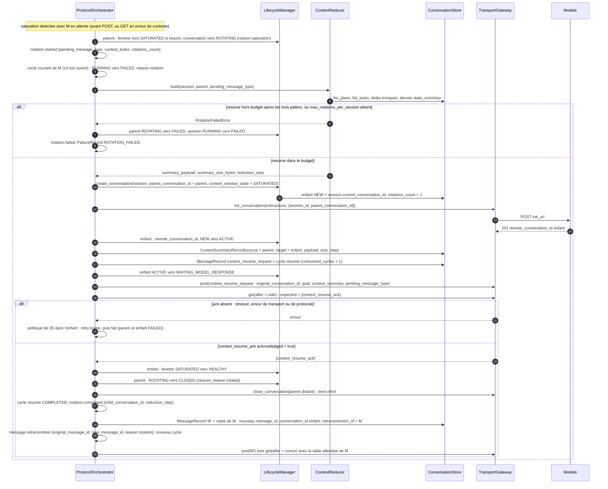
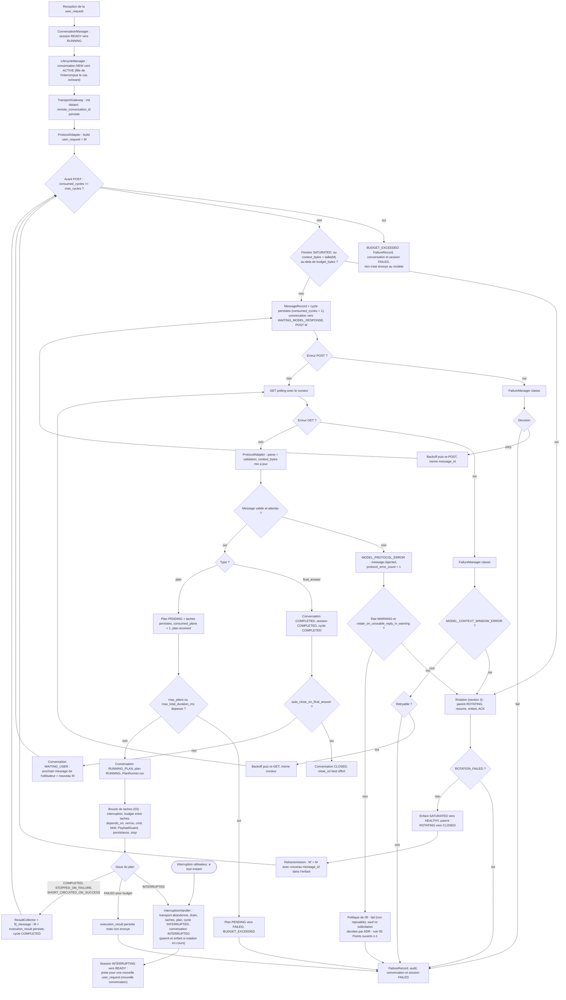

# 06 — Rotation de contexte

**Ce que dit la spec.** Quand la conversation « devient trop grande pour continuer en sécurité », le système rotate automatiquement ([§2.6](../spec/SPEC-v1.1.md#26-context-model)) : nouvelle conversation, résumé **structuré** injecté, acquittement obligatoire du modèle, échec explicite si le résumé dépasse le budget. La fenêtre de contexte suit `HEALTHY → WARNING → SATURATED → HEALTHY` ([§5.4](../spec/SPEC-v1.1.md#54-context-window-state-machine)) ; les causes et les neuf étapes de la rotation sont en [§10](../spec/SPEC-v1.1.md#10-conversation-rotation-policy) ; le `ContextReducer` (§3.11) « ne préserve que les découvertes critiques et l'état d'exécution courant dans un schéma défini » ; le diagramme d'activité de [§14](../spec/SPEC-v1.1.md#14-activity-diagram) fait boucler la rotation sur un GET.

**Ce que précisent les ADR.** [ADR-013](../adr/ADR-013-metrique-de-saturation.md) : la grandeur mesurée (`context_bytes`), les seuils, la projection avant POST, les erreurs qui saturent, `max_rotations_per_session` ; [ADR-005](../adr/ADR-005-resume-de-contexte-par-le-modele.md) : le résumé assemble le `state_summary` **écrit par le modèle**, jamais une interprétation de l'application, avec réduction déterministe par paliers ; [ADR-014](../adr/ADR-014-continuation-apres-rotation.md) : la rotation se déclenche toujours avec un message sortant en attente `M`, retransmis dans l'enfant après l'ACK ; [ADR-007](../adr/ADR-007-amendements-machines-a-etats.md) : parent `ROTATING → CLOSED`, enfant créé `SATURATED` ; [ADR-010](../adr/ADR-010-limites-de-payload.md) : un message trop gros n'est **jamais** une cause de rotation ; [ADR-012](../adr/ADR-012-budget-de-session.md) : une rotation coûte un cycle et le budget traverse les rotations ; [ADR-004](../adr/ADR-004-contrat-de-transport.md) : la taille des instructions compte dans le contexte.

Code : `context/window.py` (`ContextWindowMonitor`), `context/reducer.py` (`ContextReducer`) — phase 8 ; `ProtocolOrchestrator.rotate(pending_message)` — phase 9 ; [`config.py`](../../src/agentic_local_app/config.py) (`ContextSection`) ; machine à états de la fenêtre dans [01](01-state-machines.md#8-fenêtre-de-contexte-54--adr-013).

## 1. La métrique de saturation (ADR-013)

L'application ne connaît pas le tokenizer du modèle ; elle connaît exactement ce qu'elle a envoyé et reçu.

```
context_bytes(conversation) = size_bytes(instructions de l'init)
                            + Σ size_bytes(canonical(message)) pour tout message envoyé (POST accepté)
                            + Σ size_bytes(canonical(message)) pour tout message reçu (GET), valide ou rejeté
```

Taille = octets de la sérialisation canonique JSON **avant** gzip ([`domain/canonical.py`](../../src/agentic_local_app/domain/canonical.py)). `context_bytes` est persisté sur la `ConversationRecord` et mis à jour à chaque POST accepté et à chaque GET (`update_conversation`).

| Seuil | Formule | Valeur par défaut (`budget_bytes = 400 000`) | Transition |
|---|---|---|---|
| avertissement | `context_bytes ≥ warning_ratio × budget_bytes` | 0,70 × 400 000 = **280 000** | `HEALTHY → WARNING` |
| saturation | `context_bytes ≥ saturation_ratio × budget_bytes` | 0,90 × 400 000 = **360 000** | `WARNING → SATURATED` |
| projection (avant chaque POST) | `context_bytes + size_bytes(M) > budget_bytes` | 400 000 | `→ SATURATED`, **M n'est pas envoyé**, rotation d'abord (§10 « payload exchange becomes unsafe ») |
| erreur de contexte | `MODEL_CONTEXT_WINDOW_ERROR` du transport (413, `context_window_exceeded`) | — | saut direct `HEALTHY ou WARNING → SATURATED` |
| réponses inutilisables | `MODEL_PROTOCOL_ERROR` ou `MODEL_GET_TIMEOUT` épuisé **alors que l'état est `WARNING`** (ADR-019 §2) | `rotate_on_unusable_reply_in_warning = true` | saut direct `→ SATURATED` (§10 « replies missing or unusable ») |
| retour | `context_resume_ack` reçu par l'**enfant** | — | `SATURATED → HEALTHY` sur l'enfant |

Exemples : contexte 300 000 et `M` de 50 000 → 350 000 ≤ 400 000, `M` est envoyé (puis l'état passe `SATURATED` au-delà de 360 000, et la rotation aura lieu au **prochain** POST) ; contexte 300 000 et `M` de 120 000 → 420 000 > 400 000, rotation **avant** d'envoyer, `M` devient le message en attente.

### 1.1 `ContextWindowMonitor.evaluate` — fonction pure

`evaluate(conversation, *, projected_outbound_bytes=0, error=None) -> ContextWindowState`. Le résultat est monotone (`HEALTHY < WARNING < SATURATED`) : l'état ne redescend jamais sur la même conversation ; seul l'enfant repart `HEALTHY` à l'ACK. L'orchestrateur applique `transition_context_window` quand le résultat diffère de l'état courant.



Points d'évaluation : après chaque POST accepté et chaque GET (mise à jour de `context_bytes`), **avant** chaque POST (projection), à chaque erreur classée `MODEL_CONTEXT_WINDOW_ERROR` ou `MODEL_PROTOCOL_ERROR`. La rotation elle-même n'intervient qu'aux **frontières de cycle** : avant un POST (`RUNNING_PLAN → ROTATING` quand `M` est un `execution_result`, ou depuis `WAITING_USER` / `ACTIVE` pour un `user_request` — voir *Points ouverts* n°4) ou après un GET en erreur (`WAITING_MODEL_RESPONSE → ROTATING`). Jamais pendant un plan, jamais à cause d'un message isolé trop gros (ADR-010 : `fit_message` s'en charge).

## 2. ContextReducer (ADR-005)

Le `ContextReducer` **n'interprète rien**. Il assemble, dans un ordre fixe et une forme canonique, des données déjà structurées : le dernier `state_summary` écrit par le modèle (persisté sur le `PlanRecord`), le registre des plans et tâches du store, le budget de la session.

### 2.1 Sections du résumé et sources

| Section | Source | Nature | Contenu |
|---|---|---|---|
| `goal`, `user_message` | `SessionRecord` (copie de la `user_request` initiale) | copie | — |
| `environment`, `findings`, `current_state`, `next_expected_step` | dernier `state_summary` reçu dans la **session** (tous plans, toutes conversations) ; sections absentes si aucun plan n'en a porté | copie verbatim | ce que le modèle a écrit, jamais une lecture des sorties par l'application |
| `plan_ledger` | store : `list_plans(session_id)`, `list_tasks` | dérivé structurel | par plan : `plan_id`, `plan_type`, `objective`, `status`, `stop_reason` ; par tâche : `task_id`, `cmd`, `status`, `exit_code`, `truncated`, `original_size_bytes` |
| `pending_outputs` | store : tâches `truncated = true` dont les blobs existent | dérivé structurel | `task_id`, `stream`, `total_bytes` — ce que le modèle peut encore récupérer par `chunk_request` (les blobs traversent les rotations, ADR-011) |
| `budget` | `SessionRecord` | copie | `max_cycles`, `consumed_cycles`, `max_plans`, `consumed_plans`, `max_total_duration_ms`, `consumed_duration_ms` |

Forme canonique (clés triées, séparateurs fixes ; exemple complet dans [02 §8.4](02-protocol.md#84-context_resume_request-avec-pending_message_type-128--adr-005014)) :

```json
{
  "budget": { "consumed_cycles": 3, "consumed_duration_ms": 81234, "consumed_plans": 1,
              "max_cycles": 20, "max_plans": 10, "max_total_duration_ms": 300000 },
  "current_state": "…", "environment": { "…": "…" }, "findings": [ "…" ],
  "goal": "…", "next_expected_step": "…",
  "pending_outputs": [ { "stream": "stdout", "task_id": "t4", "total_bytes": 48211 } ],
  "plan_ledger": [ { "objective": "…", "plan_id": "plan-0", "plan_type": "discovery_plan",
                     "status": "stopped_on_failure", "stop_reason": "critical_task_failed:t5",
                     "tasks": [ { "cmd": "…", "exit_code": 0, "original_size_bytes": 55,
                                  "status": "completed", "task_id": "t1", "truncated": false } ] } ],
  "user_message": "…"
}
```

Correspondance avec l'exemple §12.8 : `environment`, `current_state`, `next_expected_step` viennent du `state_summary` ; les `completed_plans[].key_findings` de §12.8 sont remplacés par `findings` (global, du modèle) et `plan_ledger` (factuel, du store) — ADR-005 : « le `context_summary` de §12.8 est produit à partir de ces sections ».

### 2.2 Réduction déterministe par paliers et échec explicite



Le palier appliqué est enregistré dans `ContextSummaryRecord.reduction_step` et dans l'événement `rotation.completed`. Le résumé est **reproductible** : deux constructions depuis le même store donnent les mêmes octets (test `given_same_store_when_summary_built_twice_then_identical_bytes`). Le `state_summary` lui-même est déjà borné à l'entrée par `payload.max_state_summary_bytes` (4 096, `STATE_SUMMARY_TOO_LARGE` sinon) : il ne peut pas, seul, faire déborder le résumé (`summary_budget_bytes = 32 768`).

Précondition supplémentaire vérifiée avant d'ouvrir l'enfant (esprit de §2.6, « pas de boucle de rotation silencieuse ») : `size_bytes(instructions) + size_bytes(context_resume_request) + size_bytes(M) ≤ context.budget_bytes`, sinon `RotationFailedError(PENDING_MESSAGE_EXCEEDS_CONTEXT_BUDGET)` — voir *Points ouverts* n°2.

## 3. Séquence complète de rotation (ADR-014)

Une rotation se déclenche toujours avec un message sortant en attente `M` : soit `M` est prêt et son POST projeté dépasse le budget (`M` = `execution_result`, ou `user_request` de suivi), soit `M` a été envoyé et le GET a échoué pour cause de contexte (`M` = `execution_result` ou `user_request`).



Invariants : le contenu de `M'` est **identique** à celui de `M` (même `plan_id`, mêmes résultats) — « un plan ⇒ exactement un `execution_result` » (§19.9) est préservé, il s'agit d'une retransmission tracée ; l'enfant porte `parent_conversation_id`, le même `session_id`, et commence avec `context_bytes = size(instructions) + size(context_resume_request) + size(ack)` ; les blobs du parent restent lisibles par `chunk_request` depuis l'enfant ; une interruption pendant la rotation marque parent **et** enfant `INTERRUPTED` (ADR-014).

## 4. Le diagramme d'activité §14, amendé

Amendements par rapport à la spec : (1) la branche `context_resume_ack` **retransmet `M`** au lieu de refaire un GET (ADR-014) ; (2) « payload trop gros » n'est plus une cause de rotation — `fit_message` borne le message avant, seule la **saturation projetée** déclenche (ADR-010, ADR-013) ; (3) le contrôle de saturation a lieu **avant** chaque POST, y compris le premier ; (4) le contrôle de budget porte sur `max_cycles` avant chaque cycle et sur `max_plans` / durée après persistance du plan, puis entre les tâches (ADR-012) ; (5) une erreur de protocole compte vers la saturation (ADR-013) ; (6) l'interruption termine la conversation et remet la **session** `READY` (ADR-006) ; (7) `system_error` n'est jamais envoyé (ADR-007) ; (8) le parent finit `CLOSED` après l'ACK (ADR-007).



## 5. Interaction avec le budget (ADR-012)

| Règle | Détail |
|---|---|
| Le budget survit à la rotation | compteurs sur le `SessionRecord`, pas sur la conversation ; l'enfant reçoit une **copie de lecture** (`session_budget_json`) |
| Une rotation coûte un cycle | le cycle `resume` incrémente `consumed_cycles` à son ouverture (persistance du `context_resume_request`) |
| La retransmission n'ouvre pas de cycle | `M'` poursuit le cycle de `M` (`PendingOutbound.cycle_id`) ; seule la rotation (cycle `resume`) incrémente `consumed_cycles` (ADR-019 §5) |
| Nombre de rotations borné | `SessionRecord.rotations_count` incrémenté à la création de l'enfant ; `rotations_count ≥ context.max_rotations_per_session` (5) avant une nouvelle rotation ⇒ `ROTATION_FAILED / MAX_ROTATIONS_REACHED` |
| Contrôle `max_cycles` | avant d'ouvrir un cycle (donc avant le POST du `context_resume_request` et avant celui de `M'`) : une rotation qui ferait dépasser `max_cycles` échoue en `BUDGET_EXCEEDED`, pas en boucle |
| Durée | `max_total_duration_ms` continue de courir pendant la rotation (`now − session.started_at`) |

Exemple : `max_cycles = 20`, trois rotations dans la session → 3 cycles `resume` consommés par les rotations, 17 tours utiles restants ; avec `max_rotations_per_session = 5`, au plus 5 cycles peuvent être absorbés par des rotations. Combiné à `max_rotations_per_session`, « aucune boucle de rotation silencieuse » (§2.6) est garanti par deux bornes indépendantes.

Le résumé transmis au modèle contient la section `budget` : le modèle sait combien de tours il lui reste.

## 6. Ce qui se passe dans les cas limites

| Cas | Comportement | Réf. |
|---|---|---|
| Saturation pendant un plan | rien : la rotation attend la fin du plan (le résultat devient `M`) | ADR-013 §4 |
| `M` est un `user_request` de suivi dans une conversation `WAITING_USER` saturée | rotation avant le POST ; `M'` = `user_request` retransmis ; ensemble attendu = celui du message d'origine | §11, ADR-014, [02 §4](02-protocol.md#4-table-des-messages-attendus-adr-007) |
| ACK avec `acknowledged = false` ou autre type | `MODEL_PROTOCOL_ERROR` dans l'enfant (`ACK_NOT_ACKNOWLEDGED`, `UNEXPECTED_MESSAGE_TYPE`) ; politique de [05](05-transport-and-failures.md#4-flowchart-de-décision-du-failuremanager-7-adr-013) dans l'enfant ; au seuil, une **nouvelle** rotation depuis l'enfant est possible dans la limite de `max_rotations_per_session` | ADR-014 |
| Interruption pendant la rotation | parent (`ROTATING`) et enfant (`ACTIVE` ou `WAITING_MODEL_RESPONSE`) → `INTERRUPTED` ; session `READY` ; rien n'est envoyé | ADR-014, ADR-006 |
| Redémarrage pendant la rotation | `RecoveryCoordinator` : parent `ROTATING → INTERRUPTED` (`restart`) ; enfant selon son état (GET d'abord s'il attendait l'ACK) | ADR-016, [07](07-interruption-and-recovery.md) |
| Rotation d'une conversation déjà enfant | possible : la chaîne `parent_conversation_id` s'allonge (`GET /sessions/{sid}/conversations` la rend) ; les blobs de toute la chaîne restent lisibles | ADR-011, ADR-018 |

## 7. Clés de configuration `[context]`

| Clé | Défaut | Rôle | Réf. |
|---|---|---|---|
| `budget_bytes` | 400 000 | budget d'octets cumulés par conversation | ADR-013 |
| `warning_ratio` | 0.70 | `HEALTHY → WARNING` | ADR-013 |
| `saturation_ratio` | 0.90 | `WARNING → SATURATED` | ADR-013 |
| `rotate_on_unusable_reply_in_warning` | true | réponse inutilisable en `WARNING` ⇒ rotation unique au lieu d'échec | ADR-019 §2 |
| `max_rotations_per_session` | 5 | au-delà : `ROTATION_FAILED` | ADR-013 |
| `summary_budget_bytes` | 32 768 | budget dur du résumé (le `context_summary_budget_bytes` d'ADR-005/010) | ADR-005 |
| `[payload] max_state_summary_bytes` | 4 096 | borne du `state_summary` porté par chaque plan | ADR-005 |

Le budget par défaut est volontairement prudent ; il se règle **par modèle** dans `config.toml`.

## 8. Ce que la phase 8 teste (§18.2)

| Exigence | Tests attendus |
|---|---|
| Construction du résumé, copie verbatim, reproductibilité | `given_last_state_summary_when_summary_built_then_findings_copied_verbatim`, `given_same_store_when_summary_built_twice_then_identical_bytes` |
| Réduction par paliers et échec explicite | `given_ledger_exceeding_budget_when_reduction_applied_then_steps_recorded`, `given_summary_exceeding_budget_after_all_steps_when_built_then_rotation_failed`, `given_context_saturated_when_summary_exceeds_budget_then_rotation_fails_explicitly` (exemple §18.4) |
| Moniteur avec des budgets minuscules | `given_bytes_at_warning_ratio_when_evaluated_then_warning`, `given_projected_post_over_budget_when_evaluated_then_saturated`, `given_context_window_error_when_evaluated_then_saturated_from_healthy`, `given_two_protocol_errors_when_evaluated_then_saturated` |
| Flux complet saturé → enfant → ACK → HEALTHY, retransmission | `given_context_saturated_when_rotation_completes_then_pending_result_retransmitted_in_child`, `given_rotation_when_ack_missing_then_failure_policy_applies_in_child`, `given_max_rotations_reached_when_saturated_then_rotation_failed` |

## 9. Points ouverts

1. **Nom de la clé du budget de résumé.** ADR-005 et ADR-010 écrivent `context_summary_budget_bytes` ; `config.py` et `config.toml` retiennent `context.summary_budget_bytes` (32 768, valeur qu'aucun ADR ne fixe). Aligner le texte des ADR sur la clé réelle.
2. **`payload.max_message_bytes` (1 048 576) > `context.budget_bytes` (400 000).** Avec les défauts, un `execution_result` à la borne du plafond message ne peut **jamais** être envoyé, même après rotation : la projection sature l'enfant aussitôt. Ce document ajoute la précondition `instructions + context_resume_request + M ≤ budget_bytes` avec un `ROTATION_FAILED` explicite ; il faudrait aussi que `load_config` refuse `max_message_bytes > budget_bytes × (1 − warning_ratio)` ou qu'un ADR fixe des défauts cohérents.
3. **Coût d'une rotation en cycles.** ADR-012 : « une rotation coûte un cycle » ; ADR-007 borne le cycle `resume` à l'ACK et ADR-014 retransmet `M` ensuite, ce qui ouvre un second cycle. Ce document compte les deux (lecture conservatrice, bornée) ; un ADR pourrait exempter le cycle de retransmission.
4. **États d'origine de `ROTATING`.** `CONVERSATION_TRANSITIONS` n'autorise `→ ROTATING` que depuis `WAITING_MODEL_RESPONSE` et `RUNNING_PLAN`. Un `user_request` de suivi projeté trop gros depuis `WAITING_USER`, ou un `user_request` initial depuis `ACTIVE` (instructions déjà volumineuses), ne peut donc pas déclencher de rotation par la table : soit on ajoute `WAITING_USER → ROTATING` et `ACTIVE → ROTATING` (amendement d'ADR-007), soit on traite ces cas en `FAILED` explicite. À trancher avant la phase 9.
5. **Signature de `ContextReducer.build`.** Le module map retourne un `ContextSummaryRecord`, qui exige `target_conversation_id` ; ADR-014 construit le résumé **avant** de créer l'enfant. Ce document fait produire le payload par le reducer et persister le record par l'orchestrateur une fois l'enfant créé ; adapter le module map ou la signature.
6. **Deux écritures pour `context_bytes` puis l'état** (`update_conversation` puis `transition_context_window`, note de phase 1) : acceptable, mais un `**updates` sur `transition_context_window` permettrait une seule écriture.
