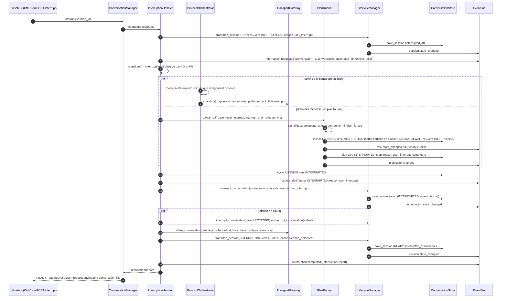
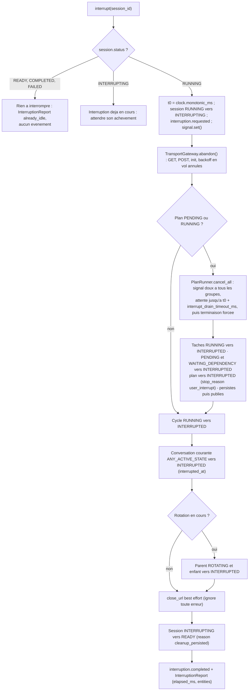
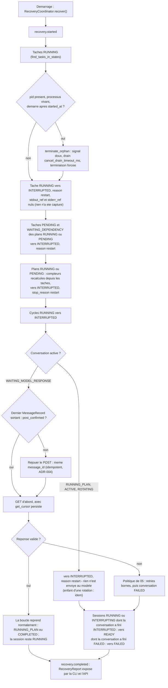
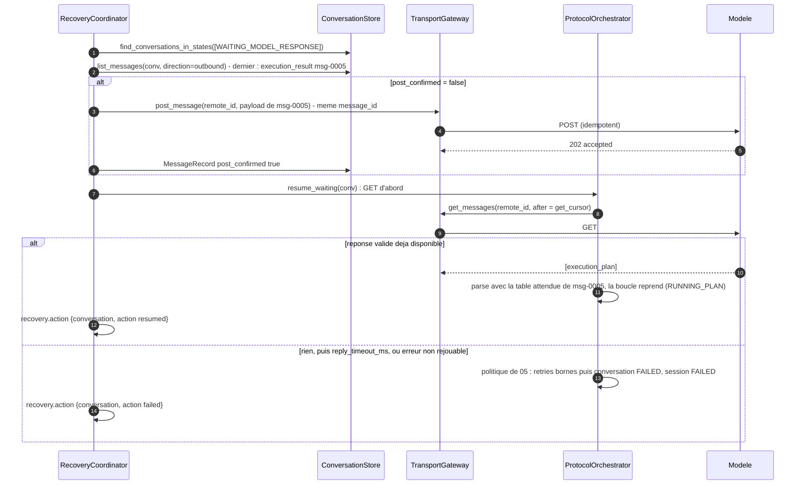

# 07 — Interruption et reprise

**Ce que dit la spec.** L'utilisateur peut interrompre « à tout instant, quel que soit l'état » ([§2.9](../spec/SPEC-v1.1.md#29-user-interruption-model)) : SIGTERM et drain des tâches, tout marqué `INTERRUPTED`, appels de transport abandonnés, tout persisté et audité avant de se déclarer prêt, le tout dans `interrupt_drain_timeout_ms`. Le flux est en [§9](../spec/SPEC-v1.1.md#9-user-interruption-flow), les règles pendant un plan en [§8.4](../spec/SPEC-v1.1.md#84-interruption-during-execution) (« ne pas construire ni envoyer d'`execution_result` »), les responsabilités de l'`InterruptionHandler` en §3.4. Après un crash, le `RecoveryCoordinator` (§3.18, [§7.5](../spec/SPEC-v1.1.md#75-recovery-strategy)) reprend depuis le dernier checkpoint avec une politique explicite : tâche `RUNNING` → `INTERRUPTED` sans ré-exécution, plan `RUNNING` reconstruit, « POST envoyé sans GET » → GET d'abord, tâches `COMPLETED` jamais rejouées.

**Ce que précisent les ADR.** [ADR-006](../adr/ADR-006-interruption-nouvelle-conversation.md) : `INTERRUPTED` est **terminal** pour la conversation, `READY` est l'état de la **session** ; une nouvelle demande ouvre une nouvelle conversation fille dans la même session ; rien n'est envoyé au modèle, fermeture distante en *best effort* ; [ADR-003](../adr/ADR-003-plateformes-cibles.md) : terminaison en deux temps POSIX / Windows, `interrupt_drain_timeout_ms` distinct de `cancel_drain_timeout_ms` ; [ADR-002](../adr/ADR-002-interfaces-utilisateur.md) : Ctrl-C = interruption, second Ctrl-C = sortie forcée, `POST /sessions/{sid}/interrupt` répond quand `READY` est atteint ; [ADR-014](../adr/ADR-014-continuation-apres-rotation.md) : interruption pendant une rotation ⇒ parent **et** enfant `INTERRUPTED` ; [ADR-016](../adr/ADR-016-politique-de-reprise.md) : `pid` persistés, orphelins terminés, interruption de cause `restart`, rejeu du POST idempotent, `RecoveryReport` ; [ADR-015](../adr/ADR-015-persister-avant-publier.md) : chaque marquage est persisté puis publié.

Code : `interruption/handler.py` (`InterruptSignal`, `InterruptionHandler`, phase 6), `orchestration/recovery.py` (`RecoveryCoordinator`, `RecoveryReport`, phase 9), [`lifecycle/conversation_lifecycle.py`](../../src/agentic_local_app/lifecycle/conversation_lifecycle.py) (`interrupt_conversation`, `transition_session`), [`domain/errors.py`](../../src/agentic_local_app/domain/errors.py) (`SessionInterruptedError`). Machines à états : [01](01-state-machines.md).

## 1. Flux d'interruption (§9 amendé par ADR-006)

Deux niveaux : la **conversation** finit `INTERRUPTED` (terminal) ; la **session** passe `RUNNING → INTERRUPTING → READY`. Chaque entité affectée reçoit sa propre transition persistée et son propre événement d'audit (`reason = user_interrupt`).



### 1.1 L'algorithme du handler



Aucun `execution_result`, aucun `system_error`, aucun message d'aucune sorte n'est envoyé au modèle (§8.4, ADR-006 §4). Le drain utilise `execution.interrupt_drain_timeout_ms` (5 000 ms), distinct de `cancel_drain_timeout_ms` réservé aux conditions d'arrêt (ADR-003).

## 2. État des entités après une interruption

| Entité | État avant | État après | Champs posés | Événement (`reason = user_interrupt`) | Réf. |
|---|---|---|---|---|---|
| Tâche `RUNNING` | `RUNNING` | `INTERRUPTED` (terminal) | `reason`, `ended_at`, `duration_ms`, `exit_code = null`, blobs de la sortie **partielle** capturée jusqu'à la terminaison, `stdout_ref` / `stderr_ref` | `task.state_changed` | §2.9, §8.4 |
| Tâche `PENDING` / `WAITING_DEPENDENCY` | non démarrée | `INTERRUPTED` | `reason` ; pas de blob, pas de `pid` | `task.state_changed` | §5.3, §8.4 |
| Tâche déjà terminale (`COMPLETED`, `FAILED`, `TIMED_OUT`, `SKIPPED`, `CANCELLED`) | inchangée | inchangée | — | — | §17.4 |
| Plan `PENDING` / `RUNNING` | — | `INTERRUPTED` (terminal) | `stop_reason = user_interrupt`, `interrupted_task_count` et autres compteurs, `ended_at` ; **aucun** `execution_result` | `plan.state_changed` | §2.9, §8.4, ADR-009 |
| Cycle `RUNNING` | — | `INTERRUPTED` (terminal) | `ended_at` | `cycle.ended` | ADR-007 |
| Conversation (`ACTIVE`, `WAITING_MODEL_RESPONSE`, `RUNNING_PLAN`, `ROTATING`) | active | `INTERRUPTED` (**terminal**, conservée pour l'audit) | `interrupted_at` ; `current_plan_id` / `current_cycle_id` conservés pour la lecture | `conversation.state_changed` | §2.9, ADR-006 |
| Conversation enfant d'une rotation en cours | `ACTIVE` / `WAITING_MODEL_RESPONSE` | `INTERRUPTED` | `interrupted_at` | `conversation.state_changed` | ADR-014 |
| Message sortant en vol | persisté (`post_confirmed` vrai ou faux) | inchangé | — | — | ADR-004, ADR-016 |
| Fenêtre de contexte | — | inchangée (la conversation est terminale) | — | — | §5.4 |
| Session | `RUNNING` | `INTERRUPTING` puis `READY` | `interrupted_at` (conservé), compteurs de budget **conservés**, `current_conversation_id` pointe encore l'interrompue jusqu'à la prochaine demande | `session.state_changed` ×2, `interruption.requested`, `interruption.completed` | §9, ADR-006, ADR-012 |
| Conversation distante | ouverte | fermée en *best effort* si `close_url`, sinon abandonnée ; **jamais réutilisée** | — | — | ADR-006 |
| Nouvelle demande | — | nouvelle conversation `NEW → ACTIVE`, `parent_conversation_id = <interrompue>`, `discovery_plan` à nouveau obligatoire | — | `conversation.created` | ADR-006 §3 |

### 2.1 Ce qui est abandonné selon l'état de la conversation

| État au moment du signal | Ce qui est en cours | Ce que fait le handler |
|---|---|---|
| `ACTIVE` | `init` distant ou construction du premier message | `abandon()` de l'init ; conversation `INTERRUPTED` ; si l'init avait abouti, `close_url` best effort |
| `WAITING_MODEL_RESPONSE` | POST en vol, polling GET ou backoff | `abandon()` ; le `MessageRecord` reste ; la réponse éventuelle du modèle ne sera jamais lue |
| `RUNNING_PLAN` | tâches en cours et à venir | drain borné, marquage des tâches, plan et cycle ; pas d'`execution_result` |
| `ROTATING` | résumé, init de l'enfant, POST `context_resume_request` ou attente de l'ACK | `abandon()` ; parent et enfant `INTERRUPTED` ; `ContextSummaryRecord` conservé pour l'audit |

## 3. Garanties temporelles

| Garantie | Réalisation | Réf. |
|---|---|---|
| Acquittement borné | l'attente de drain est bornée par `t0 + interrupt_drain_timeout_ms` (horloge monotone injectée) ; à l'échéance la terminaison est forcée, sans attendre davantage | §2.9, §3.4 |
| Persistance complète avant `READY` | chaque marquage est une écriture locale (SQLite WAL, une transaction par transition) exécutée **avant** `INTERRUPTING → READY` ; la réponse de l'API et le retour de la CLI attendent `READY` | §2.9, §17.1, ADR-002 |
| Auditabilité | un événement par entité, chaîné dans l'audit avant que le snapshot ne le reflète (ordre d'abonnement, ADR-015) ; l'`InterruptionReport` récapitule `elapsed_ms` et les entités touchées | §2.9, §17.3 |
| Nouvelle demande acceptée aussitôt | `READY → RUNNING` puis `create_conversation(parent=…)` ; test `given_interrupted_session_when_new_user_request_then_new_conversation_becomes_active` | §19.16, ADR-006 |
| Interruption pendant un backoff ou un polling | le `sleep` et la boucle de GET observent le signal : abandon immédiat, pas d'attente du délai en cours | §2.9 |
| Second Ctrl-C pendant le drain | sortie forcée du processus (ADR-002) : les entités non encore marquées le seront par le `RecoveryCoordinator` au prochain démarrage (`reason = restart`) | ADR-002, ADR-016 |

Chronologie type : `t0` signal → `t0 + quelques ms` session `INTERRUPTING` persistée, signal doux envoyé → `≤ t0 + 5 000 ms` fin des processus (ou terminaison forcée) → écritures locales (tâches, plan, cycle, conversation : quelques ms) → `READY`. Voir *Points ouverts* n°1 sur la lecture stricte de « dans `interrupt_drain_timeout_ms` ».

## 4. RecoveryCoordinator (ADR-016)

Exécuté **toujours** au démarrage (`agentic-app run` / `serve`), avant d'accepter une demande ; sur un store vide c'est un no-op audité (`recovery.started` / `recovery.completed`). Chaque action est persistée et auditée (`recovery.action`, transitions `reason = restart`).



### 4.1 Politique par constat

| Constat au démarrage | Action | Justification |
|---|---|---|
| Tâche `RUNNING` avec `pid` | orphelin terminé si vivant **et** démarré après `started_at` (jamais un pid réattribué) → `INTERRUPTED` (`restart`), jamais ré-exécutée | §7.5, ADR-016 §1-2 |
| Tâche `RUNNING` sans `pid` (crash entre la transition et le spawn) | `INTERRUPTED` (`restart`) | ADR-016 |
| Tâche `PENDING` / `WAITING_DEPENDENCY` d'un plan non terminal | `INTERRUPTED` (`restart`) | ADR-016 |
| Tâche `COMPLETED` / `FAILED` / `TIMED_OUT` / `SKIPPED` / `CANCELLED` | inchangée, **jamais rejouée** | §17.4, ADR-016 §3 |
| Plan `RUNNING` ou `PENDING` | compteurs recalculés depuis les tâches → `INTERRUPTED` (`stop_reason = restart`) ; aucun `execution_result` | §7.5, ADR-016 |
| Cycle `RUNNING` | `INTERRUPTED` | ADR-016 |
| Conversation `RUNNING_PLAN`, `ACTIVE`, `ROTATING` | `INTERRUPTED` (`restart`), même chemin que l'interruption utilisateur, rien n'est envoyé ; fermeture distante best effort | ADR-006, ADR-016 |
| Conversation `WAITING_MODEL_RESPONSE`, message sortant `post_confirmed = true` | **GET d'abord** avec le curseur persisté ; réponse valide ⇒ reprise ; sinon politique de §7 | §7.5, ADR-016 |
| Conversation `WAITING_MODEL_RESPONSE`, message sortant `post_confirmed = false` | POST **rejoué** (même `message_id`, idempotent) puis GET | ADR-004, ADR-016 |
| Session `RUNNING` / `INTERRUPTING` dont la conversation a fini `INTERRUPTED` | `READY` (un crash pendant le nettoyage reprend le nettoyage là où il s'était arrêté) | ADR-016 |
| Session `RUNNING` dont la conversation a repris | reste `RUNNING` | ADR-016 |
| Session `RUNNING` dont la conversation a fini `FAILED` | `FAILED` | §7 |
| Session `READY` / `COMPLETED` / `FAILED` | inchangée | — |

### 4.2 Séquence « POST envoyé, pas de GET »



### 4.3 `RecoveryReport`

```json
{
  "started_at": "…", "ended_at": "…", "elapsed_ms": 42,
  "orphans_terminated": [ { "task_id": "t5", "pid": 4242, "forced": false } ],
  "tasks_interrupted": [ "t5", "t6" ],
  "plans_interrupted": [ "plan-1" ],
  "cycles_interrupted": [ "cyc-0003" ],
  "conversations_interrupted": [ "conv-0002" ],
  "conversations_resumed": [],
  "conversations_failed": [],
  "sessions_ready": [ "sess-0001" ],
  "sessions_failed": [],
  "actions": [ { "entity": "task", "id": "t5", "from": "RUNNING", "to": "INTERRUPTED", "reason": "restart" } ]
}
```

Exposé par `ConversationManager.recovery_report`, la CLI (au démarrage de `run`) et `GET /health` (ADR-016 §3, ADR-018). Après un redémarrage qui a interrompu un plan, la session est `READY` : l'utilisateur relance une demande, qui ouvre une nouvelle conversation fille (ADR-006) — l'application ne relance **jamais** un plan d'elle-même.

## 5. Clés de configuration

| Section | Clé | Défaut | Rôle | Réf. |
|---|---|---|---|---|
| `[execution]` | `interrupt_drain_timeout_ms` | 5 000 | drain après une interruption utilisateur | §2.9, ADR-003 |
| `[execution]` | `cancel_drain_timeout_ms` | 5 000 | drain des orphelins au redémarrage (et des conditions d'arrêt) | ADR-003, ADR-016 |
| `[transport]` | `close_url` | `""` | fermeture distante best effort de la conversation interrompue | ADR-006 |
| `[cli]` | `refresh_interval_ms` | 250 | rafraîchissement de l'affichage pendant le drain | ADR-002 |

## 6. Ce que les phases 6 et 9 testent (§18.2)

| Phase | Exigence | Tests attendus |
|---|---|---|
| 6 | interruption depuis chaque état actif de conversation | `given_conversation_in_each_active_state_when_interrupted_then_conversation_interrupted_and_session_ready` (×4) |
| 6 | drain et marquage `INTERRUPTED` | `given_running_plan_when_user_interrupts_then_all_tasks_marked_interrupted` (exemple §18.4), `given_task_ignoring_soft_signal_when_interrupted_then_forced_after_drain_timeout` |
| 6 | un événement d'audit par entité interrompue | `given_interrupted_plan_when_events_inspected_then_one_state_changed_per_task_plan_cycle_conversation` |
| 6 | `READY` après nettoyage complet, dans le délai | `given_interruption_when_completed_then_session_ready_within_drain_timeout` |
| 6 | nouvelle `user_request` acceptée immédiatement | `given_interrupted_session_when_new_user_request_then_new_conversation_becomes_active` |
| 6 | rien n'est envoyé au modèle | `given_interrupted_plan_when_transport_inspected_then_no_execution_result_posted` |
| 9 | reprise : tâche `RUNNING` interrompue, non ré-exécutée ; GET d'abord ; `COMPLETED` jamais rejouées | `given_store_with_running_task_when_recovery_runs_then_task_interrupted_and_not_reexecuted`, `given_posted_message_without_reply_when_recovery_runs_then_get_retried_first`, `given_completed_tasks_when_recovery_runs_then_none_reexecuted`, `given_unconfirmed_post_when_recovery_runs_then_post_replayed_with_same_message_id` |
| 9 | orphelins | `given_live_orphan_started_after_task_when_recovery_runs_then_terminated`, `given_reused_pid_started_before_task_when_recovery_runs_then_not_killed` (double de table de processus) |

## 7. Points ouverts

1. **Lecture stricte de « dans `interrupt_drain_timeout_ms` »** (§2.9, §3.4, §17.2, §19.15). Le délai borne l'attente du drain ; la terminaison forcée et les écritures locales qui suivent ajoutent quelques millisecondes. Deux lectures possibles : le délai couvre tout (le drain effectif est alors `interrupt_drain_timeout_ms − marge`), ou il ne couvre que l'attente. Ce document retient la seconde ; à fixer par ADR si le test de phase 6 doit mesurer le total.
2. **Propriété des transitions de tâches à l'interruption.** §3.4 confie le marquage à l'`InterruptionHandler`, §8.4 au `PlanRunner`, ADR-015 au propriétaire nominal (`PlanRunner`). Ce document fait marquer tâches et plan par le `PlanRunner` (dans `cancel_all`), cycle, conversation et session par le handler ; si le runner ne rend pas la main à l'échéance, le handler force le marquage (défensif). À confirmer en phase 6.
3. **Sortie partielle d'une tâche interrompue.** ADR-016 dit que `stdout_ref` / `stderr_ref` **peuvent** être nuls pour une tâche interrompue au redémarrage ; pour une interruption utilisateur, ce document persiste la sortie partielle capturée (auditabilité). À confirmer.
4. **Interruption d'une session `COMPLETED`** (conversation `WAITING_USER`) : rien à interrompre ; `POST /sessions/{sid}/interrupt` renvoie `200` avec `already_idle = true` plutôt qu'une erreur. À confirmer côté API.
5. **Vérification du pid orphelin sous Windows.** ADR-016 exige de vérifier que le processus a démarré après `started_at` ; sous Windows cela demande `GetProcessTimes` (via `ctypes` ou un utilitaire) — à prévoir dans `PlatformAdapter.terminate_orphan` avec un double de table de processus pour les tests.
6. **Reprise automatique d'une conversation `WAITING_MODEL_RESPONSE` en mode `serve`.** ADR-016 fait reprendre la boucle ; la session redevient active sans action de l'utilisateur. Acceptable pour `serve`, à documenter pour `run` (session interactive rattachée à un terminal qui n'existe plus).
