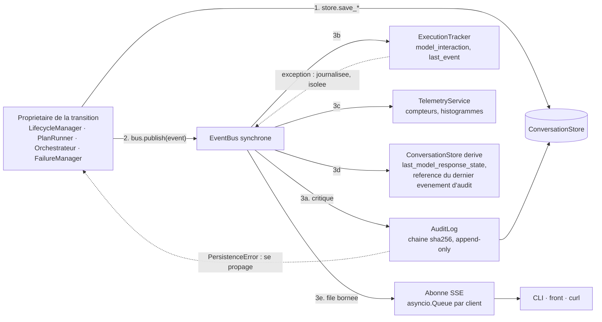
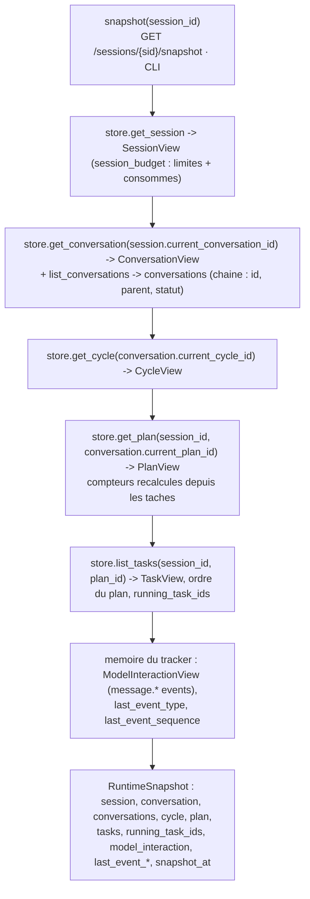
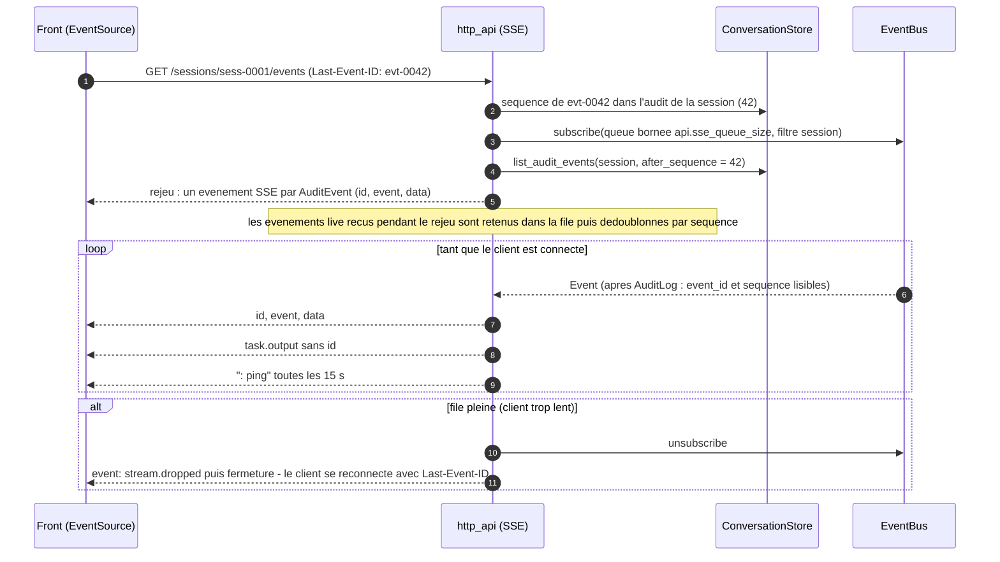

# 08 — Observabilité

**Ce que dit la spec.** Le système doit être « observable à tout instant » (§1) : un snapshot cohérent avec les champs obligatoires de [§4.1](../spec/SPEC-v1.1.md#41-mandatory-visibility-fields) (conversation, cycle, plan, tâches, interaction avec le modèle), exposé par l'`ExecutionTracker` (§3.19) abonné à l'`EventBus` (§3.20 : découplage, routage vers `AuditLog`, `TelemetryService`, `ExecutionTracker`, `ConversationStore`, ordre de livraison garanti). L'`AuditLog` (§3.16) chaîne des événements immuables ; le `TelemetryService` (§3.17) publie latence, retries, saturation, échecs, interruptions et débit ; §17.3 exige que « toute action importante émette un événement structuré via l'EventBus » et que les sessions interrompues soient reconstructibles depuis l'audit.

**Ce que précisent les ADR.** [ADR-015](../adr/ADR-015-persister-avant-publier.md) : bus **synchrone**, ordre d'inscription fixé (`AuditLog → ExecutionTracker → TelemetryService → ConversationStore (dérivé)`), abonné critique (`AuditLog`), le store n'est abonné que pour des données dérivées ; [ADR-018](../adr/ADR-018-api-pour-un-front-et-flux-live.md) : flux SSE rejouant les événements du bus (`id = event_id`, reprise `Last-Event-ID`), événements `task.output` non audités, API REST pour un front, `config.toml` unique ; [ADR-006](../adr/ADR-006-interruption-nouvelle-conversation.md) / [ADR-012](../adr/ADR-012-budget-de-session.md) / [ADR-013](../adr/ADR-013-metrique-de-saturation.md) : snapshot à **deux niveaux** (session, conversation) avec budget, `context_bytes`, `rotations_count` ; [ADR-017](../adr/ADR-017-determinisme-des-resultats-et-identifiants.md) : sérialisation canonique des payloads d'audit ; [ADR-002](../adr/ADR-002-interfaces-utilisateur.md) : la CLI est un client de l'API.

Code : [`observability/event_bus.py`](../../src/agentic_local_app/observability/event_bus.py) (`EventBus`, `RecordingSubscriber`), [`domain/events.py`](../../src/agentic_local_app/domain/events.py) (`EventType`, `Event`, `state_change_payload`, `NON_AUDITED_EVENT_TYPES`), `observability/audit_log.py`, `observability/execution_tracker.py`, `observability/telemetry.py`, `interfaces/http_api.py` (phases 9/10). La chaîne d'audit (formule, vérification) est détaillée dans [04 §5](04-persistence-and-audit.md#5-chaîne-daudit-316-adr-017).

## 1. EventBus (§3.20, ADR-015)

| Propriété | Réalisation |
|---|---|
| Synchrone, en process | `publish(event)` appelle les abonnés **dans l'ordre d'inscription**, dans le thread appelant, et ne rend la main qu'une fois tous notifiés : ordre total, snapshot cohérent immédiatement |
| Persister avant publier | le propriétaire de la transition écrit dans le store puis publie ; un abonné qui lit le store pendant l'événement voit déjà le nouvel état |
| Abonné critique | `subscribe(handler, name=…, critical=True)` : une exception **se propage** (l'`AuditLog` : l'audit fait partie de l'état critique, son échec est une `PERSISTENCE_ERROR`) |
| Abonné isolé | tout autre abonné qui lève est journalisé, compté (`subscriber_errors`), transformé en `SYSTEM_ERROR` non bloquante ; la publication continue |
| Filtrage | `event_types=` permet de ne recevoir qu'un sous-ensemble (chemins chauds : `task.output`) |
| Abonné asynchrone | l'abonné SSE ne fait qu'empiler dans une `asyncio.Queue` bornée (`api.sse_queue_size`) : jamais de blocage du cœur ; un client trop lent est abandonné (ADR-018) |
| Unicité | un nom d'abonné ne peut être inscrit qu'une fois (`ValueError`) |
| Test | `RecordingSubscriber` conserve les événements dans l'ordre ; fixture `recorder` inscrite **en premier** pour observer tout le flux |



Ordre d'inscription fixé au démarrage par `wiring.build_application` : `AuditLog` (critique) → `ExecutionTracker` → `TelemetryService` (si `telemetry.enabled`) → `ConversationStore` (dérivé) → abonnés SSE (dynamiques, filtrés par session). L'événement est donc chaîné dans l'audit **avant** que le snapshot ne le reflète et avant qu'un client ne le voie (test phase 10 : `given_two_transitions_when_published_then_audit_order_equals_publication_order`).

## 2. Catalogue des événements (`EventType`)

Enveloppe commune (`Event`) : `event_type`, `timestamp` (= horodatage persisté sur le record par le propriétaire), `session_id` (toujours), `conversation_id`, `cycle_id`, `plan_id`, `task_id` (selon l'entité), `payload` (JSON, jamais d'octets bruts). Tous les payloads `*.state_changed` sont `state_change_payload(from, to, reason)` — `reason` absent quand non fourni. Les 30 types de [`domain/events.py`](../../src/agentic_local_app/domain/events.py) :

| `event_type` | Émetteur | Moment | Identifiants portés | Payload (contrat) | Audité |
|---|---|---|---|---|---|
| `session.created` | LifecycleManager | après `save_session` (`READY`) | `session_id` | `{goal, budget: {max_cycles, max_plans, max_total_duration_ms}}` | oui |
| `session.state_changed` | LifecycleManager | après chaque transition de session | `session_id` | `{from, to, reason?}` — raisons : `user_request`, `final_answer`, `user_interrupt`, `restart`, `cleanup_persisted`, `budget_exceeded`, `rotation_failed`, `failure` | oui |
| `conversation.created` | LifecycleManager | après la transaction conversation + session | `session_id`, `conversation_id` | `{parent_conversation_id, context_window_state}` | oui |
| `conversation.state_changed` | LifecycleManager | après chaque transition de conversation | `session_id`, `conversation_id` | `{from, to, reason?}` | oui |
| `cycle.started` | ProtocolOrchestrator | message sortant persisté, cycle `RUNNING` | + `cycle_id` | `{cycle_type, outbound_message_id, outbound_message_type, consumed_cycles}` | oui |
| `cycle.ended` | ProtocolOrchestrator · InterruptionHandler · RecoveryCoordinator | cycle terminal | + `cycle_id`, `plan_id?` | `{status, reason?, retry_count, duration_ms, inbound_message_id?}` | oui |
| `message.outbound` | ProtocolOrchestrator | POST **accepté** (`post_confirmed`) | + `cycle_id` | `{message_type, message_id, size_bytes, post_status, attempts, retransmission_of?}` | oui |
| `message.inbound` | ProtocolOrchestrator | message reçu **et** validé | + `cycle_id` | `{message_type, message_id, size_bytes, get_status, polls, validation_status: "valid"}` | oui |
| `message.rejected` | ProtocolOrchestrator (via ProtocolAdapter) | message reçu et refusé | + `cycle_id` | `{message_type?, message_id?, size_bytes, get_status, validation_status: "invalid", error_code, details}` | oui |
| `message.retransmitted` | ProtocolOrchestrator | retransmission persistée après une rotation (ADR-014) | + `cycle_id` (nouveau) | `{original_message_id, new_message_id, message_type, reason: "rotation"}` | oui |
| `plan.received` | ProtocolOrchestrator | plan + tâches persistés `PENDING` | + `cycle_id`, `plan_id` | `{plan_type, objective, execution_policy, max_parallel_workers, task_count, consumed_plans, contradictory_flags: [task_id]}` | oui |
| `plan.state_changed` | PlanRunner · InterruptionHandler · RecoveryCoordinator | après chaque transition de plan | + `cycle_id`, `plan_id` | `{from, to, reason?, stop_reason?, counters: {completed, failed, skipped, cancelled, interrupted}, duration_ms?}` | oui |
| `task.state_changed` | PlanRunner · InterruptionHandler · RecoveryCoordinator | après chaque transition de tâche | + `cycle_id`, `plan_id`, `task_id` | `{from, to, reason?}` + selon l'état : `RUNNING` → `{pid, timeout_ms_applied}` ; terminal → `{exit_code, duration_ms, timed_out, truncated, original_size_bytes}` | oui |
| `task.output` | PlanRunner (via `on_output` de l'exécuteur) | par tranche, ≤ `live_output_chunk_bytes`, ≥ `live_output_interval_ms` d'écart | + `plan_id`, `task_id` | `{stream, offset, size, data}` — `data` décodé UTF-8 avec remplacement | **non** |
| `final_answer.received` | ProtocolOrchestrator | `final_answer` validé et persisté | + `cycle_id` | `{message_id, status, auto_close_on_final_answer, consumed_cycles, consumed_plans, session_duration_ms}` | oui |
| `failure.recorded` | FailureManager | `FailureRecord` persisté | + ids de l'entité concernée | `{failure_id, error_type, error_code, severity, origin, retryable, recoverable, attempt, max_attempts, operation?, details}` | oui |
| `retry.scheduled` | FailureManager | `RetryDecisionRecord` persisté, décision `retry` | + `cycle_id` | `{decision_id, operation, error_type, error_code, attempt, max_attempts, delay_ms}` | oui |
| `breaker.state_changed` | CircuitBreaker | transition du disjoncteur | `session_id` (courante) | `{from, to, reason, consecutive_failures}` | oui |
| `context.window_state_changed` | LifecycleManager (`transition_context_window`) | après persistance du nouvel état de fenêtre | + `conversation_id` | `{from, to, reason?, context_bytes}` | oui |
| `rotation.started` | ProtocolOrchestrator | parent passé `ROTATING` | + `conversation_id` (parent) | `{pending_message_type, trigger, context_bytes, context_budget_bytes, rotations_count}` — `trigger` ∈ {projection, saturation_ratio, context_window_error, protocol_errors} | oui |
| `rotation.completed` | ProtocolOrchestrator | ACK reçu, parent `CLOSED` | + `conversation_id` (parent) | `{child_conversation_id, summary_id, summary_size_bytes, reduction_step, resume_cycle_id, retransmitted_message_id}` | oui |
| `rotation.failed` | ProtocolOrchestrator | `ROTATION_FAILED` | + `conversation_id` (parent) | `{error_code, summary_size_bytes?, summary_budget_bytes, reduction_step?, rotations_count}` | oui |
| `budget.updated` | ProtocolOrchestrator | compteur consommé modifié et persisté | `session_id` | `{consumed_cycles, consumed_plans, consumed_duration_ms, max_cycles, max_plans, max_total_duration_ms}` | oui |
| `budget.exceeded` | ProtocolOrchestrator · PlanRunner | borne atteinte | + ids concernés | `{limit, limit_value, consumed, stage}` — `stage` ∈ {before_cycle, before_plan, between_tasks} | oui |
| `interruption.requested` | InterruptionHandler | signal reçu, session `INTERRUPTING` | + `conversation_id`, `plan_id?` | `{conversation_state, running_tasks: [task_id], source}` — `source` ∈ {cli, api} | oui |
| `interruption.completed` | InterruptionHandler | session `READY` | + `conversation_id` | `{elapsed_ms, within_timeout, tasks_interrupted, plan_id?, cycle_id?, conversations_interrupted, forced_kills}` | oui |
| `recovery.started` | RecoveryCoordinator | démarrage du processus | `session_id` par session touchée (ou `"*"` si aucune) | `{findings: {running_tasks, open_plans, running_cycles, active_conversations, open_sessions}}` | oui |
| `recovery.action` | RecoveryCoordinator | chaque action de reprise | + ids de l'entité | `{entity, id, from, to, reason, details}` — `reason` ∈ {restart, resumed, failed, orphan_terminated} | oui |
| `recovery.completed` | RecoveryCoordinator | fin de la reprise | idem `recovery.started` | `RecoveryReport` (voir [07 §4.3](07-interruption-and-recovery.md#43-recoveryreport)) | oui |
| `audit.warning` | ProtocolOrchestrator (à partir d'`InboundMessage.warnings` de l'adaptateur) · PlanRunner | anomalie non bloquante | + ids concernés | `{code, entity, id, details}` — codes de l'adaptateur : `CONTRADICTORY_FLAGS:<task_id>`, `DEFAULT_WORKERS_APPLIED`, `WORKERS_IGNORED_IN_SEQUENTIAL` (ADR-009, ADR-007) ; proposés côté exécution : `MAX_OUTPUT_BYTES_CAPPED`, `TIMEOUT_MS_CAPPED` (ADR-010, ADR-008) | oui |

Seul `task.output` est hors chaîne d'audit (`NON_AUDITED_EVENT_TYPES`, `Event.audited`) ; le blob reste la vérité (ADR-018).

## 3. AuditLog (§3.16)

`AuditLog(store, clock, ids)` ([`observability/audit_log.py`](../../src/agentic_local_app/observability/audit_log.py)) : `subscribe(bus)` l'inscrit comme abonné **critique**, `handle(event) -> AuditEvent | None` (rien pour `task.output`), `last(session_id)`, `verify(session_id, page_size=1000) -> AuditVerification`. Pour chaque événement audité : lecture du dernier `AuditEvent` de la session (reprise après redémarrage comprise), `sequence + 1`, `previous_event_hash` (ou `GENESIS_HASH`), `event_hash = sha256(previous + canonical(audit_hash_input(event)))`, `append_audit_event` (INSERT strict). Les abonnés suivants (`ExecutionTracker`, SSE), notifiés dans le même `publish`, lisent `event_id` et `sequence` par `AuditLog.last(session_id)` — possible uniquement parce que le bus est synchrone et ordonné. Détails, formule et diagrammes dans [04 §5](04-persistence-and-audit.md#5-chaîne-daudit-316-adr-017).

## 4. ExecutionTracker et le snapshot §4.1

`ExecutionTracker(store)` ([`observability/execution_tracker.py`](../../src/agentic_local_app/observability/execution_tracker.py), phase 10) : `handle(event)` entretient, par session, la partie **dérivée** du snapshot (interaction avec le modèle, dernier événement) ; `snapshot(session_id) -> RuntimeSnapshot` assemble le reste **depuis le store** (qui est déjà à jour quand l'événement arrive, ADR-015). Le snapshot est donc cohérent à tout instant sans double vérité : les états viennent des records, seuls les indicateurs transitoires vivent en mémoire (et sont reconstructibles depuis l'audit). Les vues sont des modèles pydantic gelés (`SessionView`, `ConversationView`, `ConversationSummary`, `CycleView`, `PlanView`, `TaskView`, `ModelInteractionView`, `BudgetView`).



Structure complète (deux niveaux, ADR-006 ; les champs de §4.1 sont tous présents) :

```json
{
  "snapshot_at": "2026-09-18T14:03:07.412000+00:00",
  "last_event_type": "task.state_changed", "last_event_sequence": 42,
  "session": {
    "session_id": "sess-0001", "status": "RUNNING", "goal": "…", "auto_close_on_final_answer": false,
    "session_budget": { "max_cycles": 20, "max_plans": 10, "max_total_duration_ms": 300000,
                        "consumed_cycles": 3, "consumed_plans": 2, "consumed_duration_ms": 81234 },
    "rotations_count": 0, "current_conversation_id": "conv-0001",
    "started_at": "…", "ended_at": null, "interrupted_at": null, "created_at": "…", "updated_at": "…"
  },
  "conversation": {
    "conversation_id": "conv-0001", "parent_conversation_id": null,
    "status": "RUNNING_PLAN", "auto_close_on_final_answer": false,
    "context_window_state": "WARNING", "context_bytes": 284120,
    "last_model_response_state": "received_valid",
    "current_cycle_id": "cyc-0003", "current_plan_id": "plan-1", "last_completed_plan_id": "plan-0",
    "final_answer_received": false, "interrupted_at": null,
    "session_budget": { "max_cycles": 20, "max_plans": 10, "max_total_duration_ms": 300000,
                        "consumed_cycles": 3, "consumed_plans": 2, "consumed_duration_ms": 81234 },
    "created_at": "…", "updated_at": "…"
  },
  "conversations": [ { "conversation_id": "conv-0001", "parent_conversation_id": null, "status": "RUNNING_PLAN" } ],
  "cycle": { "cycle_id": "cyc-0003", "cycle_type": "execution", "status": "RUNNING", "retry_count": 0,
             "started_at": "…", "ended_at": null, "conversation_id": "conv-0001" },
  "plan": { "plan_id": "plan-1", "plan_type": "execution_plan", "objective": "…",
            "execution_policy": "parallel", "max_parallel_workers": 2, "status": "RUNNING", "stop_reason": null,
            "task_count": 2, "completed_task_count": 1, "failed_task_count": 0, "skipped_task_count": 0,
            "cancelled_task_count": 0, "interrupted_task_count": 0, "started_at": "…", "ended_at": null },
  "tasks": [
    { "task_id": "t6", "plan_id": "plan-1", "type": "cmd", "cmd": "echo $JAVA_HOME", "status": "COMPLETED",
      "critical": false, "continue_on_error": true, "stop_plan_on_failure": false, "stop_plan_on_success": false,
      "depends_on": [], "resource_lock": null, "max_output_bytes": 512, "attempt_count": 1, "exit_code": 0,
      "truncated": false, "original_size_bytes": 19, "started_at": "…", "ended_at": "…", "duration_ms": 8,
      "timed_out": false, "reason": null },
    { "task_id": "t7", "plan_id": "plan-1", "type": "cmd", "cmd": "grep -n … pom.xml", "status": "RUNNING",
      "critical": true, "continue_on_error": false, "stop_plan_on_failure": true, "stop_plan_on_success": false,
      "depends_on": [], "resource_lock": "pom.xml", "max_output_bytes": 2048, "attempt_count": 1, "exit_code": null,
      "truncated": false, "original_size_bytes": null, "started_at": "…", "ended_at": null, "duration_ms": null,
      "timed_out": false, "reason": null }
  ],
  "running_task_ids": [ "t7" ],
  "model_interaction": {
    "last_outbound_message_type": "execution_result", "last_inbound_message_type": "execution_plan",
    "last_post_status": 202, "last_get_status": 200, "last_protocol_validation_status": "valid"
  }
}
```

Conventions : `session.session_budget` porte limites **et** consommés (`BudgetView`, ADR-012 §5, critère 12) ; `conversation.session_budget` reprend la même vue (§4.1 place le budget au niveau conversation) ; `conversation.last_model_response_state` est une chaîne dérivée (valeurs proposées : `none`, `awaiting`, `received_valid`, `received_invalid`, `timeout`, `transport_error`, `abandoned` — écrite par l'abonné « store dérivé », ADR-015 §3 ; la spec ne fixe pas ces valeurs) ; `tasks[]` dans l'ordre du plan, `TaskView` ajoute `timed_out` (ADR-008) et `reason` (ADR-009) ; `interrupted_at` figure aux deux niveaux ; `context_window_state`, `context_bytes` et `rotations_count` sont présents (ADR-013). Compléments **hors** snapshot : `context_budget_bytes` (configuration, `/config`), état du disjoncteur (`CircuitBreaker.degraded`, `/health`), `RecoveryReport` (`/health`), retry en attente (`retry.scheduled` dans le flux) — voir *Points ouverts* n°7.

## 5. TelemetryService (§3.17)

Compteurs et histogrammes en mémoire, alimentés par les événements ; `render_text()` produit le format texte type Prometheus servi par `GET /metrics` ; `metrics()` le dictionnaire brut (CLI). Désactivable (`telemetry.enabled = false` : l'abonné n'est pas inscrit).

| Indicateur (§3.17) | Métrique | Type | Étiquettes | Source |
|---|---|---|---|---|
| latence | `transport_request_duration_ms` | histogramme | `operation` (init, post, get, close), `status` | `message.outbound`, `message.inbound`, `failure.recorded` |
| latence | `model_reply_wait_ms` (du POST accepté au message reçu) | histogramme | `message_type` | `message.outbound` → `message.inbound` |
| latence | `task_duration_ms`, `plan_duration_ms`, `cycle_duration_ms` | histogrammes | `status` | `*.state_changed`, `cycle.ended` |
| retry | `retries_total` | compteur | `operation`, `error_type` | `retry.scheduled` |
| retry | `retry_delay_ms` | histogramme | `operation` | `retry.scheduled` |
| saturation | `context_bytes`, `context_budget_bytes`, `context_saturation_ratio` | jauges | `conversation_id` | `context.window_state_changed`, `message.*` |
| saturation | `context_window_transitions_total`, `rotations_total` | compteurs | `to` / `outcome` (completed, failed) | `context.window_state_changed`, `rotation.*` |
| échecs | `failures_total` | compteur | `error_type`, `error_code`, `origin` | `failure.recorded` |
| échecs | `protocol_errors_total` | compteur | `error_code` | `message.rejected` |
| échecs | `breaker_state` (0 fermé, 1 demi-ouvert, 2 ouvert), `breaker_transitions_total` | jauge, compteur | — | `breaker.state_changed` |
| interruption | `interruptions_total`, `interruption_duration_ms`, `interruption_within_timeout_total` | compteur, histogramme, compteur | `source` | `interruption.*` |
| débit | `messages_total` | compteur | `direction`, `message_type` | `message.outbound`, `message.inbound` |
| débit | `tasks_total`, `plans_total`, `cycles_total`, `sessions_total` | compteurs | `status` / `type` | `*.state_changed`, `cycle.ended`, `session.*` |
| débit | `running_tasks`, `running_sessions` | jauges | — | `task.state_changed`, `session.state_changed` |
| budget | `budget_consumed_ratio` | jauge | `limit` | `budget.updated` |
| budget | `budget_exceeded_total` | compteur | `limit` | `budget.exceeded` |
| reprise | `recovery_actions_total` | compteur | `entity`, `reason` | `recovery.action` |
| sortie live | `task_output_bytes_total` | compteur | `stream` | `task.output` |

Aucune métrique n'est persistée (redémarrage ⇒ remise à zéro) : la vérité historique est l'audit.

## 6. Flux live SSE et API pour le front (ADR-018)

Base `http://{api.host}:{api.port}/api/v1` (défaut `127.0.0.1:8765`). Aucun état côté serveur autre que le store ; pagination par `limit` / `cursor` (`api.page_size`) ; CORS restreint à `api.cors_origins`. Les erreurs sont les attributs normalisés de §6 en JSON.

| Méthode | Route | Rôle | Réponse |
|---|---|---|---|
| POST | `/sessions` | crée et démarre une session (`goal`, `user_message`, `session_budget?`, `auto_close_on_final_answer?`) | `201 {session_id}` |
| GET | `/sessions?status=running,ready&limit=&cursor=` | liste paginée, filtrable | `[SessionRecord]` + `next_cursor` |
| GET | `/sessions/{sid}` | `SessionRecord` + conversation courante | — |
| POST | `/sessions/{sid}/interrupt` | interruption ; répond quand `READY` est atteint | `200 InterruptionReport` (`already_idle` si rien à interrompre) |
| POST | `/sessions/{sid}/messages` | message de suivi (conversation réutilisable, §11) | `202` |
| GET | `/sessions/{sid}/snapshot` | snapshot complet §4 (une requête pour tout afficher) | `RuntimeSnapshot` |
| GET | `/sessions/{sid}/conversations` · `/conversations/{cid}` | chaîne des conversations (rotations, interruptions) | `[ConversationRecord]` |
| GET | `/sessions/{sid}/plans` · `/plans/{pid}?include=tasks` | plans avec compteurs, tâches à la demande | `[PlanRecord]` |
| GET | `/sessions/{sid}/tasks?status=running&plan_id=` | tâches filtrables — la vue « en cours » du front | `[TaskRecord]` |
| GET | `/tasks/{tid}` | détail d'une tâche (tous les champs §4.1) | `TaskRecord` |
| GET | `/tasks/{tid}/output?stream=stdout&offset=0&max_bytes=65536` | lecture par plage de la sortie brute (même moteur que `chunk_request`) | octets + en-têtes `X-Range`, `X-Total`, `X-Eof` |
| GET | `/sessions/{sid}/messages?direction=in,out` | messages protocolaires échangés (debug) | `[MessageRecord]` |
| GET | `/sessions/{sid}/failures` | `FailureRecord` (le `system_error` interne) | `[FailureRecord]` |
| GET | `/sessions/{sid}/audit?after=&limit=` · `/sessions/{sid}/audit/verify` | chaîne d'audit paginée ; vérification | `[AuditEvent]` · `AuditVerification` |
| GET | `/sessions/{sid}/events` **(SSE)** | flux live d'une session, reprise `Last-Event-ID` | `text/event-stream` |
| GET | `/events` **(SSE)** | flux live toutes sessions (tableau de bord) | `text/event-stream` |
| GET | `/tasks/{tid}/output/live` **(SSE)** | sortie d'une tâche pendant qu'elle tourne (`task.output`) | `text/event-stream` |
| GET | `/metrics` | métriques `TelemetryService` | texte type Prometheus |
| GET | `/health` · `/config` | santé (processus, disjoncteur, store, `RecoveryReport`), configuration effective (jeton masqué) | JSON |

### 6.1 Format d'un événement SSE

```
id: evt-0042
event: task.state_changed
data: {"conversation_id":"conv-0001","cycle_id":"cyc-0003","event_id":"evt-0042","event_type":"task.state_changed","payload":{"duration_ms":8,"exit_code":0,"from":"RUNNING","to":"COMPLETED"},"plan_id":"plan-1","sequence":42,"session_id":"sess-0001","task_id":"t6","timestamp":"2026-09-18T14:03:07.412000+00:00"}

event: task.output
data: {"event_type":"task.output","payload":{"data":"[INFO] Scanning…","offset":4096,"size":1024,"stream":"stdout"},"plan_id":"plan-1","session_id":"sess-0001","task_id":"t7","timestamp":"…"}

: ping
```

`data` est le JSON canonique (ADR-017) de l'événement : `event_id`, `sequence`, `event_type`, `timestamp`, `session_id`, `conversation_id`, `cycle_id`, `plan_id`, `task_id`, `payload`. `id` = séquence d'audit de la session (`"<sequence>"` pour un événement audité, `"<sequence>.<n>"` pour un `task.output`), `event_id` et `sequence` étant repris dans `data` ; un `task.output` porte un `id` dérivé (`"<sequence>.<n>"`) mais n'est pas rejouable (non audité) — la sortie complète se relit par `/tasks/{tid}/output`. Un commentaire `: ping` est envoyé périodiquement pour garder la connexion.

### 6.2 Reprise avec `Last-Event-ID`



`/events` (toutes sessions) suit la même logique sans filtre ; la reprise s'y fait par session (le `Last-Event-ID` identifie une session par son `event_id`). La CLI (`agentic-app run`, `status`) consomme exactement ce flux : ce qui est visible en console l'est pour le front, sans exception (ADR-018).

## 7. Clés de configuration

| Section | Clé | Défaut | Rôle |
|---|---|---|---|
| `[api]` | `host` | `127.0.0.1` | liaison locale uniquement (ADR-002) |
| `[api]` | `port` | 8765 | — |
| `[api]` | `cors_origins` | `["http://localhost:3000"]` | origines autorisées pour le front |
| `[api]` | `page_size` | 100 | taille de page des listes |
| `[api]` | `sse_queue_size` | 1 000 | événements en attente par client SSE avant abandon du client |
| `[cli]` | `refresh_interval_ms` | 250 | rafraîchissement de l'affichage du snapshot |
| `[telemetry]` | `enabled` | `true` | inscription du `TelemetryService` sur le bus et exposition de `/metrics` |

## 8. Ce que la phase 10 (et 9 pour l'API) teste (§18.2)

| Exigence | Tests attendus |
|---|---|
| Intégrité de la chaîne d'audit | `given_events_when_appended_then_each_hash_chains_previous`, `given_tampered_audit_event_when_chain_verified_then_first_break_reported`, `given_first_event_when_appended_then_previous_hash_is_genesis` |
| Ordre bus = ordre audit | `given_two_transitions_when_published_then_audit_order_equals_publication_order` |
| Snapshot cohérent après chaque transition | `given_each_state_transition_when_snapshot_read_then_reflects_persisted_state`, `given_subscriber_reading_store_when_state_changed_event_received_then_new_state_already_persisted` |
| Deux niveaux et budget | `given_running_session_when_snapshot_read_then_session_budget_has_limits_and_consumed_values`, `given_rotated_session_when_snapshot_read_then_conversation_chain_lists_parent_and_child` |
| Métriques sur les événements clés | `given_failure_recorded_when_metrics_rendered_then_failures_total_incremented`, `given_interruption_completed_when_metrics_rendered_then_interruption_duration_observed` |
| Aucun appel direct à l'horloge ou à l'aléa dans le code | `given_source_tree_when_inspected_then_no_wall_clock_or_randomness_outside_domain` |
| SSE | `given_running_task_when_client_subscribes_to_events_then_task_output_chunks_streamed_in_order`, `given_last_event_id_when_client_reconnects_then_missing_audited_events_replayed_once` |

## 9. Points ouverts

1. **Propagation de `event_id` / `sequence` aux abonnés non critiques.** L'`Event` publié ne porte pas d'identifiant ; c'est l'`AuditLog` qui l'attribue. Ce document fait lire `AuditLog.last(session_id)` par les abonnés suivants, ce qui repose sur l'ordre d'inscription (ADR-015) et sur la synchronicité du bus. Une alternative plus explicite serait que le propriétaire demande `ids.event_id()` avant de publier et le mette dans l'`Event` (champ à ajouter au modèle).
2. **Échec de l'abonné critique après persistance de la transition** (noté en phases 1 et 4) : l'état est écrit, l'événement n'est pas chaîné, l'exception remonte. Politique de reprise à définir (rejouer l'événement manquant depuis l'état persisté au démarrage, ou marquer la chaîne dégradée dans `/audit/verify`).
3. **`last_model_response_state`** : la spec (§4.1, §16) nomme le champ sans en fixer les valeurs ; l'énumération proposée en §4 est à valider et à figer dans `domain/states.py`.
4. **`task.output` non rejouable** : voulu (ADR-018, volume), mais un front qui se reconnecte pendant une longue tâche doit relire `/tasks/{tid}/output` depuis l'offset du dernier chunk reçu ; documenter côté front.
5. **`/events` toutes sessions et `Last-Event-ID`** : un seul identifiant ne peut désigner qu'une chaîne (par session) ; la reprise multi-sessions demande soit un curseur composite, soit d'accepter que seule la session du dernier événement soit rejouée.
6. **Vérification du snapshot « à tout instant »** pendant une transaction multi-écritures (`create_conversation`) : un lecteur concurrent (thread de l'API) peut voir la conversation sans le `current_conversation_id` mis à jour tant que la transaction n'est pas validée ; SQLite WAL donne l'isolation par instantané, le store mémoire n'est pas concerné (mono-thread de test). À vérifier en phase 9 avec le client de test FastAPI.
7. **Champs d'ADR-013 absents du `RuntimeSnapshot` de phase 10.** ADR-013 demande que l'`ExecutionTracker` expose `context_window_state`, `context_bytes`, `context_budget_bytes` et `rotations_count` ; la vue livrée porte les trois premiers sauf `context_budget_bytes` (valeur de configuration, disponible par `/config`). L'ajouter à `ConversationView` est trivial ; à faire en phase 9 lors du câblage de l'API, avec l'état du disjoncteur (`degraded`) dans `/health`.
