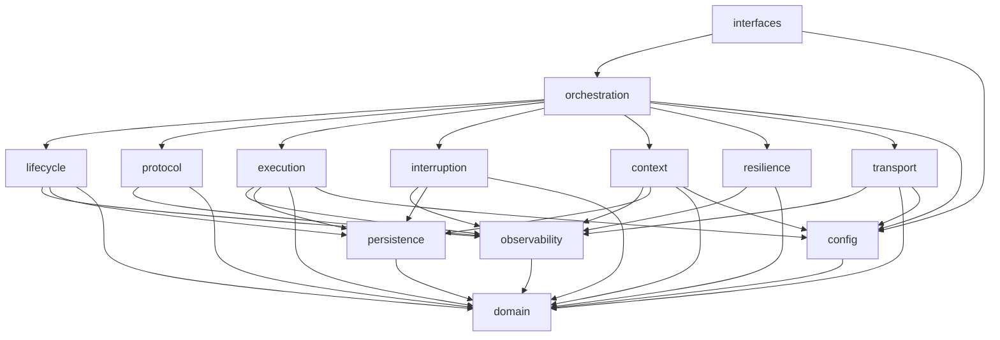

# Module map — paquets Python, classes, règles de dépendance

Ce document est le **contrat de structure** : chaque composant de la spec a un module, une classe et un fichier de tests désignés. Les agents qui implémentent une phase ne créent pas d'autres modules publics sans mettre ce document à jour.

## 1. Arborescence

```
src/agentic_local_app/
├── __init__.py
├── config.py                      AppConfig, load_config, load_dotenv          (ADR-018)
├── domain/                        pur, aucune I/O
│   ├── states.py                  toutes les énumérations (§5, §6, §12)
│   ├── transitions.py             tables de transitions + assert_transition     (§5, ADR-007)
│   ├── models.py                  records persistés (§16 + ADR)
│   ├── errors.py                  ErrorType, NormalizedError, exceptions        (§6)
│   ├── events.py                  EventType, Event                              (ADR-015/018)
│   ├── clock.py                   Clock, SystemClock, FakeClock                 (ADR-017)
│   ├── ids.py                     IdGenerator, UuidIdGenerator, SequentialIdGenerator
│   └── canonical.py               canonical_json, size_bytes, chain_hash        (ADR-017)
├── lifecycle/
│   └── conversation_lifecycle.py  ConversationLifecycleManager (sessions + conversations)  [phase 1]
├── protocol/
│   ├── messages.py                schémas pydantic de tous les messages (§12 + ADR)        [phase 2]
│   ├── adapter.py                 ProtocolAdapter : build / parse / validate, EXPECTED_INBOUND
│   └── PROTOCOL_INSTRUCTIONS.md   texte envoyé au modèle à l'init (ADR-004)
├── persistence/
│   ├── interface.py               ConversationStore (ABC)
│   ├── memory.py                  InMemoryConversationStore
│   └── sqlite_store.py            SqliteConversationStore (WAL, transactions)               [phase 3]
├── execution/
│   ├── platform.py                PlatformAdapter (posix / windows) : shell, spawn, terminate [phase 4]
│   ├── executor.py                CommandExecutor (ABC), SubprocessCommandExecutor, RawExecution
│   ├── payload_guard.py           PayloadGuard : apply(), fit_message(), serve_chunk()
│   ├── result_collector.py        ResultCollector : un execution_result par plan
│   └── plan_runner.py             PlanRunner : DAG, locks, workers, stop conditions, drain     [phase 5]
├── interruption/
│   └── handler.py                 InterruptionHandler (jeton = CancellationToken par session)   [phase 6]
├── transport/
│   ├── gateway.py                 TransportGateway (ABC), HttpTransportGateway                  [phase 7]
│   └── fake.py                    FakeTransportGateway (scénarios scriptés)
├── resilience/
│   ├── failure_manager.py         FailureManager : classify(), decide()                         [phase 7]
│   ├── retry_controller.py        RetryController : backoff borné déterministe
│   └── circuit_breaker.py         CircuitBreaker : CLOSED / OPEN / HALF_OPEN
├── context/
│   ├── window.py                  ContextWindowMonitor (octets, seuils, erreurs)                [phase 8]
│   ├── reducer.py                 ContextReducer : compose()/persist()/build(), paliers
│   └── rotation.py                RotationCoordinator : séquence ADR-014, PendingOutbound
├── observability/
│   ├── event_bus.py               EventBus, RecordingSubscriber
│   ├── audit_log.py               AuditLog (chaîne sha256), verify()                            [phase 10]
│   ├── execution_tracker.py       ExecutionTracker : snapshot §4.1 à deux niveaux
│   └── telemetry.py               TelemetryService : compteurs, histogrammes, export texte
├── orchestration/
│   ├── protocol_orchestrator.py   ProtocolOrchestrator : la boucle, budget, rotation             [phase 9]
│   ├── conversation_manager.py    ConversationManager : façade demandes / interruptions
│   ├── recovery.py                RecoveryCoordinator + RecoveryReport
│   └── wiring.py                  build_application(config) : assemble tout (injection)
├── interfaces/
│   ├── cli.py                     typer : run / serve / status / config / mock-server            [phase 9]
│   └── http_api.py                FastAPI : REST + SSE (ADR-018)
└── testing/
    ├── fake_executor.py           FakeCommandExecutor (sorties, délais, annulation simulés)     [phase 4]
    └── mock_model_server.py       serveur FastAPI jouant le modèle à partir d'un scénario     [phase 7/9]

tests/
├── conftest.py                    fixtures partagées : clock, ids, store mémoire, bus enregistreur, config
├── unit/
│   ├── test_phase1_state_machines.py
│   ├── test_phase2_protocol.py
│   ├── test_phase3_persistence.py
│   ├── test_phase4_task_execution.py
│   ├── test_phase5_plan_execution.py
│   ├── test_phase6_interruption.py
│   ├── test_phase7_transport_failures.py
│   ├── test_phase8_context_rotation.py
│   └── test_phase10_observability.py
└── integration/
    └── test_phase9_orchestration.py
```

Un fichier de tests par phase peut être découpé en plusieurs (`test_phase7_transport.py`, `test_phase7_resilience.py`…) tant que le préfixe `test_phaseN_` et le marqueur `@pytest.mark.phaseN` sont conservés.

## 2. Règles de dépendance



1. `domain` ne dépend de rien d'autre que pydantic et la bibliothèque standard.
2. Personne n'importe `interfaces` ni `orchestration` en dehors d'eux-mêmes.
3. `persistence`, `execution.executor`, `transport` sont des **frontières** : une ABC + une implémentation réelle + un double. Le reste du code ne connaît que l'ABC.
4. Aucune horloge (`datetime.now`, `time.*`) ni aléa (`uuid4`, `random`) en dehors de `domain/clock.py`, `domain/ids.py` et du `jitter` optionnel de `RetryController` (test d'inspection en phase 10).
5. Toute transition d'état passe par `domain.transitions.assert_transition` puis est **persistée avant publication** (ADR-015).

## 3. Signatures publiques attendues

Les agents implémentent exactement ces surfaces (les paramètres optionnels peuvent être ajoutés). Les lignes des phases livrées reflètent les signatures effectives du code ; en cas de doute, le code fait foi.

| Classe | Méthodes publiques |
|---|---|
| `ConversationLifecycleManager(store, bus, clock, ids)` | `create_session(goal, user_message, user_id, budget, auto_close) -> SessionRecord` · `transition_session(session_id, to, *, reason=None, **updates) -> SessionRecord` · `create_conversation(session_id, *, parent_conversation_id=None, context_window_state=HEALTHY) -> ConversationRecord` · `transition_conversation(conversation_id, to, *, reason=None, **updates) -> ConversationRecord` · `transition_context_window(conversation_id, to, *, reason=None) -> ConversationRecord` · `update_conversation(conversation_id, **updates)` · `update_session(session_id, **updates)` · `interrupt_conversation(conversation_id, *, reason) -> ConversationRecord` · `get_session / get_conversation` |
| `ProtocolAdapter(config)` | `build_user_request(conversation, message_id, goal, user_message, budget)`, `build_execution_result(conversation, message_id, content)`, `build_context_resume_request(conversation, message_id, *, original_conversation_id, goal, context_summary, pending_message_type)` → `OutboundMessage(envelope, payload, canonical, size_bytes, message_type)` · `parse_inbound(raw_messages: list[dict], *, expected, conversation, known_message_ids, known_plan_ids, known_task_ids, stored_output_task_ids, expected_original_conversation_id=None) -> InboundMessage` · `expected_inbound(last_outbound: MessageRecord | None, conversation) -> frozenset[MessageType]` · `plan_to_records(inbound, *, session, conversation, cycle_id, clock) -> (PlanRecord, list[TaskRecord])` · `render_instructions(config) -> str` |
| `SqliteConversationStore(path)` | toute l'ABC `ConversationStore` |
| `CommandExecutor` (ABC) | `async execute(spec: CommandSpec, *, cancel: CancellationToken, on_output=None) -> RawExecution` |
| `PayloadGuard(config.payload)` | `apply(stdout: bytes, stderr: bytes, budget: int) -> TruncatedOutput` · `fit_message(result: ExecutionResultContent, max_message_bytes) -> ExecutionResultContent` · `serve_chunk(store, session_id, ref_task_id, stream, offset, max_bytes) -> ChunkResult` · `effective_budget(task, plan_default) -> int` |
| `ResultCollector()` | `build(plan: PlanRecord, tasks: list[TaskRecord], task_outputs: dict[str, TruncatedOutput], chunk_results: dict[str, ChunkResult]) -> ExecutionResultContent` |
| `PlanRunner(store, bus, executor, payload_guard, clock, ids, config, *, failure_manager=None)` | `async run(plan: PlanRecord, tasks: list[TaskRecord], session: SessionRecord, *, interrupt: CancellationToken) -> PlanOutcome(plan, tasks, execution_result \| None, interrupted, budget_exceeded, stop_reason)` |
| `InterruptionHandler(store, bus, lifecycle, clock, ids, config, *, transport=None)` | `token_for(session_id) -> CancellationToken` · `register_loop(session_id) -> asyncio.Event` · `loop_finished(session_id)` · `async interrupt(session_id, *, reason="user_interrupt") -> InterruptionReport` (borné par `interrupt_drain_timeout_ms`) · `is_interrupting(session_id)` · `raise_if_interrupted(session_id)` |
| `HttpTransportGateway(config.transport, clock, *, transport=None, sleep=asyncio.sleep)` | `async init_conversation(instructions, metadata) -> str` · `async post_message(remote_conversation_id, payload) -> PostAck` · `async get_messages(remote_conversation_id, after) -> GetResult` · `async wait_for_reply(remote_conversation_id, after) -> GetResult` (polling borné, `MODEL_GET_TIMEOUT`) · `async close_conversation(remote_conversation_id)` · `abandon()` |
| `FailureManager(config, store, bus, clock, ids, retry=None, breaker=None)` | `classify(exc) -> NormalizedError` · `decide(error, attempt, *, operation) -> Decision(kind: retry \| abort \| rotate \| fail, delay_ms, reason)` · `record(error, *, session_id, conversation_id=None, plan_id=None, task_id=None) -> FailureRecord` · `record_decision(...) -> RetryDecisionRecord` · `handle(exc, attempt, *, operation, session_id, ...) -> (NormalizedError, Decision)` · `note_success()` |
| `RetryController(config.retry)` | `delay_ms(attempt) -> int` · `can_retry(attempt) -> bool` |
| `CircuitBreaker(config.circuit_breaker, clock, bus)` | `allow() -> bool` · `record_success()` · `record_failure()` · `state` |
| `ContextWindowMonitor(config.context)` | `evaluate(conversation, *, projected_outbound_bytes=0, error=None) -> ContextWindowState` (monotone) · `should_rotate_on_unusable_reply(conversation, error) -> bool` (ADR-019 §2) · `thresholds()` · `account(conversation_bytes, message_bytes)` |
| `ContextReducer(config, store, clock, ids)` | `compose(session, source, *, pending_message_type, target_conversation_id) -> (payload, size, step)` (pur, lève `RotationFailedError`) · `persist(...) -> ContextSummaryRecord` · `build(...) -> ContextSummaryRecord` |
| `RotationCoordinator(config, store, bus, clock, ids, lifecycle, adapter, transport, reducer, monitor, instructions)` | `async rotate(session, source, pending: PendingOutbound(message_type, original_message_id, build)) -> RotationResult(child, source, summary, resume_cycle, retransmitted_message_id, ack_message_id)` |
| `AuditLog(store, clock, ids)` | `handle(event) -> AuditEvent \| None` (abonné critique via `subscribe(bus)`) · `verify(session_id, *, page_size=…) -> AuditVerification` · `recompute_hash(event)` · `last(session_id)` |
| `ExecutionTracker(store, clock)` | `handle(event)` · `subscribe(bus)` · `snapshot(session_id) -> RuntimeSnapshot` · `rebuild(session_id) -> RuntimeSnapshot` |
| `TelemetryService(clock)` | `handle(event)` · `subscribe(bus)` · `render_text() -> str` · `metrics() -> dict` · `reset()` |
| `ProtocolOrchestrator(...)` | `async run_session(session_id)` · `async continue_session(session_id, user_message)` |
| `ConversationManager(...)` | `async start(goal, user_message, budget=None, auto_close=None) -> str` · `async interrupt(session_id)` · `snapshot(session_id)` · `recovery_report` |
| `RecoveryCoordinator(store, lifecycle, bus, executor_platform, clock)` | `recover() -> RecoveryReport` |

## 4. Doubles de test (§18.3)

| Frontière | Double | Où |
|---|---|---|
| shell | `FakeCommandExecutor` : sorties configurables par `cmd` ou par `task_id`, délai simulé (avec `FakeClock`), échec de spawn, blocage jusqu'à annulation, tranches de sortie live | `testing/fake_executor.py` |
| réseau | `FakeTransportGateway` : file de réponses scriptées par conversation, erreurs injectables (type, code, HTTP), latence, `init` retournant un id déterministe | `transport/fake.py` |
| base | `InMemoryConversationStore` (+ `fail_next_write`) | `persistence/memory.py` |
| temps / ids | `FakeClock`, `SequentialIdGenerator` | `domain/` |
| bus | `RecordingSubscriber` | `observability/event_bus.py` |

Fixtures communes dans `tests/conftest.py` : `clock`, `ids`, `store`, `bus`, `recorder` (abonné à tout), `config` (défauts + `data_dir` temporaire), `lifecycle`.
