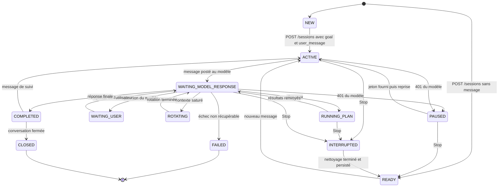
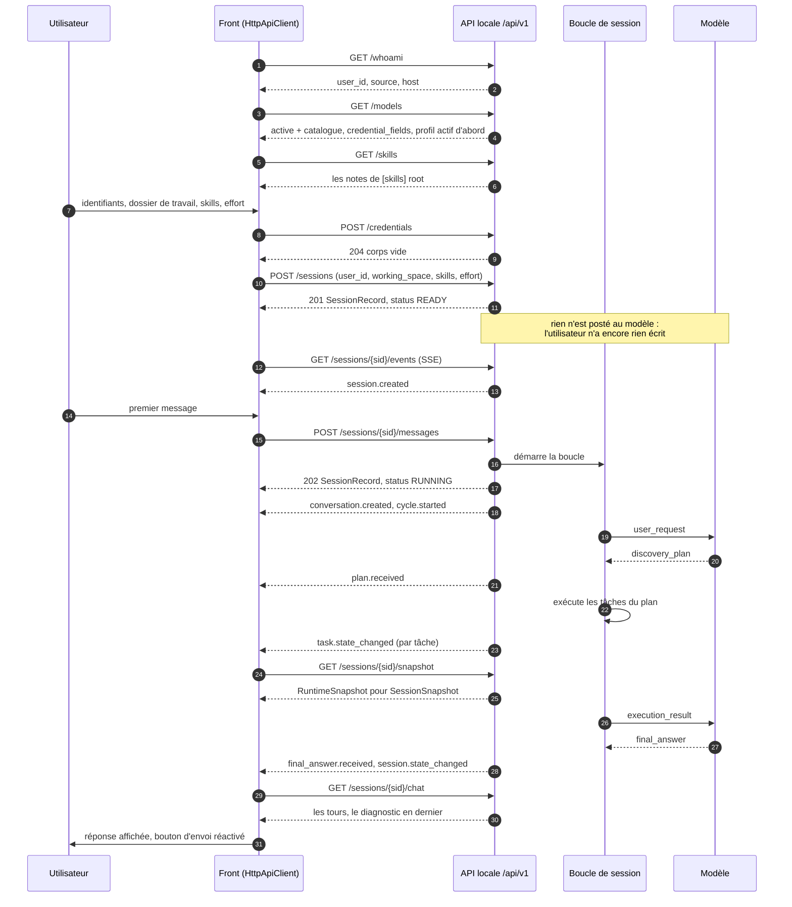
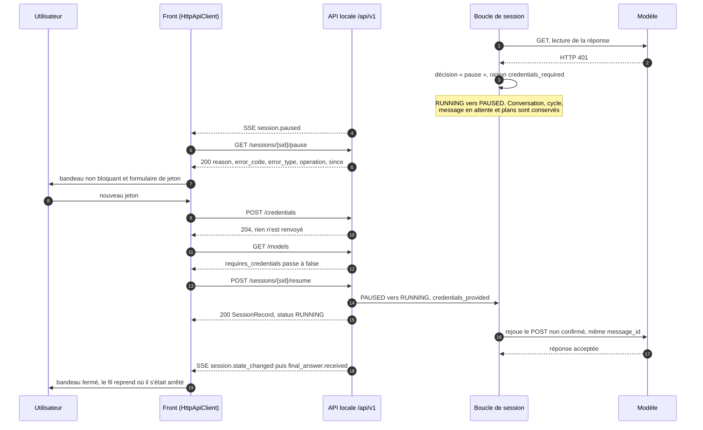

# Contrat front ↔ application — v1

Ce document est la référence entre le front de bureau (`agentic-front` : React 19, TypeScript, Vite, Tauri 2) et cette application. Il décrit le transport, chaque route avec sa requête, sa réponse et ses modes d'échec, l'enveloppe d'erreur et la liste fermée des codes que le front doit savoir traiter, la machine à états **telle que le front la voit**, les trois décisions du propriétaire et ce qu'elles imposent à l'IHM, et il finit par un état des lieux méthode par méthode de l'interface `ApiClient` du front.

Cette version-ci est postérieure à [ADR-027](../adr/ADR-027-champs-d-identifiants-par-modele.md) (`credential_fields`, `GET /skills`, `skills` / `effort`) et à [ADR-028](../adr/ADR-028-ouverture-de-session-sans-message.md) (message d'ouverture facultatif, `user_id`, origines CORS du front), et son §9 est écrit **après** un test d'intégration de bout en bout des deux applications : le front n'est plus un client hypothétique, il appelle vraiment ces routes.

La source de vérité du comportement décrit ici est [`src/agentic_local_app/interfaces/http_api.py`](../../src/agentic_local_app/interfaces/http_api.py) et les formes exactes sont épinglées par `tests/integration/test_phase9_api.py`. Quand ce document et le code divergent, c'est le code qui a raison et ce document qui est en retard.

Le client TypeScript de référence qui met ce contrat en œuvre est [`contracts/front-client/HttpApiClient.ts`](../../contracts/front-client/HttpApiClient.ts) ; les numéros de section cités dans ses commentaires sont ceux de ce document, et les marqueurs « G-n » sont les écarts numérotés du §9.

---

## 1. Périmètre

| Dans le contrat | Hors du contrat |
|---|---|
| l'API HTTP locale `/api/v1` et son flux SSE | l'API du modèle distant ([ADR-004](../adr/ADR-004-contrat-de-transport.md)), que le front ne voit jamais |
| ce que le front lit, écrit et affiche | le protocole de messages ([§12 de la spec](../spec/SPEC-v1.1.md)), interne à l'application |
| les erreurs que le front doit traiter | la configuration du poste (`config.toml`), qui n'est ni lue ni écrite par le front |

Le front ne parle **jamais** au modèle. Tout ce qu'il envoie va à l'application locale, qui décide seule quand et comment appeler le modèle. C'est ce qui rend le §7.2 possible : un 401 du modèle n'est pas un 401 du front.

---

## 2. Transport

| Point | Valeur |
|---|---|
| Base | `http://127.0.0.1:8765/api/v1` (`api.host` / `api.port` de `config.toml`) |
| Format | JSON en entrée et en sortie, UTF-8 ; horodatages ISO 8601 (`2026-09-19T05:04:25.086239Z`) |
| Authentification | **aucune** — l'API écoute sur la boucle locale et sert un seul utilisateur (ADR-002) |
| CORS | restreint à `api.cors_origins` ; par défaut `http://localhost:1420`, `http://127.0.0.1:1420`, `http://localhost:3000`, `http://localhost:5173`, `http://127.0.0.1:5173` et `tauri://localhost` — le serveur de développement du front (port **1420**, épinglé par `vite.config.ts` avec `strictPort`), le port Vite par défaut, le port historique et la fenêtre Tauri. Les deux orthographes de la boucle locale sont listées à chaque fois : pour un navigateur, `localhost` et `127.0.0.1` ne sont pas la même origine ([ADR-028](../adr/ADR-028-ouverture-de-session-sans-message.md) §3) |
| Flux live | SSE (`text/event-stream`), reprise par `Last-Event-ID` ou `?last_event_id=` |
| Pagination | `?limit=&offset=` avec `next_offset` dans le corps, sauf la chaîne d'audit qui pagine en `?after=&limit=` avec `next_after` |
| Documentation vivante | `GET /api/v1/docs` (Swagger) et `GET /api/v1/openapi.json` |

Trois conventions valent partout :

- les enregistrements sont des modèles pydantic sérialisés en JSON — jamais d'octets bruts, les énumérations sortent par leur valeur, la sortie d'une tâche est décodée en UTF-8 avec des caractères de remplacement ;
- toute erreur est un objet `{"error": …}` unique (§4) : il n'y a pas deux formes d'erreur à gérer ;
- aucune route ne renvoie de secret. Ni jeton, ni URL de modèle, ni option de provider — `GET /config` masque le jeton, `GET /models` ne montre ni URL ni option, et `POST /credentials` ne réémet jamais ce qu'on lui a posté.

Le front n'a **pas** besoin d'ajouter d'en-tête : `Content-Type: application/json` sur les corps, c'est tout.

---

## 3. Les routes

### 3.1 Identité — `GET /whoami`

| | |
|---|---|
| Requête | aucune |
| Réponse | `200 {user_id, source, host}` |
| Échecs | aucun : la résolution ne lève jamais et retombe sur `unknown` |

`source` nomme l'étape d'[ADR-024 §5](../adr/ADR-024-profils-de-modele.md) qui a répondu (`env:USER`, `cmd:id`, `config`, `unknown`) : le front peut afficher un badge « détecté » honnête au lieu de faire passer un repli pour une certitude. `host` peut être `null`.

### 3.2 Catalogue de modèles — `GET /models`

| | |
|---|---|
| Requête | aucune |
| Réponse | `200 {active, models: [{name, display_name, description, provider, codec, requires_credentials, active, credential_fields}]}` |
| Échecs | aucun |

Le profil actif est **premier** dans la liste et porte `active: true`. `requires_credentials` est calculé **à la lecture** : au moins un champ déclaré par le profil n'a pas de valeur dans l'environnement *maintenant*. Juste après un `POST /credentials` réussi, un nouvel appel voit le profil cesser de réclamer un jeton — c'est le signal que le formulaire d'identifiants a fait son travail.

`credential_fields` ([ADR-027 §1](../adr/ADR-027-champs-d-identifiants-par-modele.md)) est **toujours présent**, éventuellement vide, dans l'ordre de déclaration. Chaque entrée est exactement ce qu'un formulaire a besoin de savoir :

| Clé | Type | Sens |
|---|---|---|
| `key` | `string` | l'identifiant à renvoyer dans `POST /credentials` (`access_token`, `chat_id`…) |
| `label` | `string` | le libellé affiché au-dessus du champ |
| `placeholder` | `string \| null` | facultatif |
| `secret` | `boolean` | **vrai par défaut** ; seul un `false` explicite autorise le front à retenir la valeur entre deux lancements |

La **variable d'environnement** derrière un champ ne traverse jamais cette route : un formulaire n'en a pas l'usage (`GET /config`, qui rend la configuration effective, la montre comme il montre déjà `token_env`). Aucun secret non plus : ni jeton, ni URL, ni option de provider.

Un profil qui ne déclare **rien** répond un champ implicite unique, construit sur `token_env` : `{key: "access_token", label: "Access token", placeholder: "Paste an access token", secret: true}` — et une liste vide quand `token_env` l'est aussi. C'est mot pour mot la règle que le front applique déjà à un `requires_credentials` nu, écrite des deux côtés pour que les deux dessinent le même formulaire.

`requires_credentials` ne dit pas si le jeton est **bon**, seulement s'il existe (ADR-024, point ouvert 2). Un jeton invalide se découvre à l'appel suivant, sous la forme d'une pause (§7.2).

### 3.3 Skills — `GET /skills`

| | |
|---|---|
| Requête | aucune |
| Réponse | `200 {skills: [{name, path}]}`, triés par `name` |
| Échecs | **aucun** |

Les fichiers `*.md` trouvés sous `[skills] root` ([ADR-027 §4](../adr/ADR-027-champs-d-identifiants-par-modele.md)), `name` étant le nom du fichier sans son extension et `path` son chemin absolu sur le poste. La route **ne rend jamais d'erreur** : racine absente, vide, illisible, désactivée ou pointant sur un fichier répondent `200` et une liste vide, pour que l'écran de connexion dégrade en champ de saisie libre au lieu de tomber en panne. Le parcours est borné en profondeur et en nombre, et l'ordre est déterministe.

Rien n'est lu du contenu d'un fichier : ni titre, ni description, ni taille.

### 3.4 Créer une session — `POST /sessions`

| | |
|---|---|
| Requête | `{goal?, user_message?, user_id?, session_budget?, auto_close_on_final_answer?, working_space?, skills?, effort?}` — tout champ inconnu est refusé, tout champ présent doit être non vide |
| Réponse | `201 SessionRecord` (`session_id`, `status`, `budget`, `user_id`, `goal`, …) |
| Échecs | `400 GOAL_REQUIRED` · `400 USER_MESSAGE_REQUIRED` · `400 EFFORT_INVALID` · `400 WORKING_SPACE_INVALID` · `422 VALIDATION_ERROR` |

**Le message d'ouverture est facultatif, et c'est une paire** ([ADR-028](../adr/ADR-028-ouverture-de-session-sans-message.md) §1) :

| Corps | Réponse | Ce qui se passe |
|---|---|---|
| `goal` **et** `user_message` | `201`, `status: "RUNNING"` | la boucle a déjà démarré quand la réponse arrive |
| **ni l'un ni l'autre** | `201`, `status: "READY"` | la session existe, et rien d'autre : aucune conversation, aucun cycle, **rien de posté au modèle**, aucun `user_request` persisté. `goal` et `user_message` sont `""`, `current_conversation_id` est `null`, `started_at` est `null` |
| un seul des deux | `400 GOAL_REQUIRED` (le `goal` manque) ou `400 USER_MESSAGE_REQUIRED` | refusé **avant** toute création : aucune session, aucun événement. `details.field` nomme le champ manquant |

C'est la forme qu'attend un écran de connexion : il demande un utilisateur, un modèle, des identifiants, un dossier, des skills et un effort — **jamais une phrase**. Une session ouverte ainsi attend, `READY`, et son premier `POST /sessions/{sid}/messages` (§3.6) ouvre sa première conversation exactement comme un message après un Stop. **Ce premier message devient le `goal`** de la session, qui n'en avait pas ; une session ouverte avec un but ne le voit jamais réécrit.

Une session vide est une session ordinaire : listée par `GET /sessions?status=ready`, lisible par `GET /sessions/{sid}` (`conversation: null`) et `/snapshot` (`conversation: null`, `conversations: []`), acceptée par `POST .../interrupt` (qui répond `nothing_to_interrupt`, sans rien écrire), et **elle survit à un redémarrage intacte** — la reprise au démarrage ne règle que les sessions que la boucle tenait. `POST .../resume` la refuse en `409 SESSION_NOT_RESUMABLE` : ce qu'il faut lui envoyer, c'est un message.

`user_id` ([ADR-028](../adr/ADR-028-ouverture-de-session-sans-message.md) §2) est qui possède la session. Omis, la session porte **exactement ce que `GET /whoami` répond** — le front peut donc afficher les deux sans les voir se contredire. Ce n'est pas une authentification : l'API locale n'en a pas (§4.2), rien ne vérifie le nom et aucune route ne filtre sur lui.

`session_budget` est `{max_cycles, max_plans, max_total_duration_ms}` : les trois, tous `> 0`. Un budget partiel est refusé en `422` — écart **G-5**.

`working_space` est le dossier « Working folder » du front ([ADR-026 §3](../adr/ADR-026-espace-de-travail-et-fichiers-temporaires.md)) : absolu, existant, lisible. Il est validé **avant** que quoi que ce soit ne soit créé — un chemin mal tapé ne laisse aucune session derrière lui —, il est offert aux commandes du modèle par une variable d'environnement, et il n'est **jamais** supprimé ni archivé, quelle que soit la politique de nettoyage. Les raisons de refus sont explicites dans `details.reason` : `blank`, `not_absolute`, `does_not_exist`, `not_a_directory`, `unreadable`.

`skills` (une liste de chaînes, par nom ou par chemin) et `effort` (`low`, `medium` ou `high`, sinon `400 EFFORT_INVALID` avec la liste attendue dans les détails) sont acceptés et **journalisés dans l'événement `session.created`, rien de plus** ([ADR-027 §4](../adr/ADR-027-champs-d-identifiants-par-modele.md)) : aucun fichier n'est ouvert, aucune consigne n'en est dérivée, le modèle reçoit exactement ce qu'il recevait avant, et aucun enregistrement ne les porte. Les deux clés sont toujours présentes dans la charge de l'événement (`[]` et `null` quand rien n'a été choisi).

### 3.5 Lire l'état — `GET /sessions/{sid}/snapshot`

| | |
|---|---|
| Requête | aucune |
| Réponse | `200 RuntimeSnapshot` : `{session, conversation, conversations, cycle, plan, tasks, running_task_ids, model_interaction, last_event_type, last_event_sequence, snapshot_at}` |
| Échecs | `404 NOT_FOUND` |

C'est **la** route d'affichage : une requête, tout ce qu'un écran montre. `GET /sessions/{sid}` existe aussi et rend l'enregistrement de session plus sa conversation courante ; il est plus léger mais ne porte ni cycle, ni plan, ni tâches.

La correspondance champ par champ avec le `SessionSnapshot` du front est au §6.3.

### 3.6 Envoyer un message — `POST /sessions/{sid}/messages`

| | |
|---|---|
| Requête | `{user_message}` non vide |
| Réponse | `202 SessionRecord` (`status: "RUNNING"`) |
| Échecs | `409 SESSION_BUSY` (la boucle tient encore la session) · `409 CONFLICT` (la session n'est pas réutilisable) · `404 NOT_FOUND` · `422 VALIDATION_ERROR` |

La réponse est l'**enregistrement de session**, pas le tour de conversation créé : le front qui veut afficher la bulle doit relire `GET /sessions/{sid}/chat` (écart **G-7**).

Quand la route accepte :

| État de la session | Résultat |
|---|---|
| `RUNNING`, `INTERRUPTING` | `409 SESSION_BUSY` — voir §7.3 |
| `READY` | accepté : nouvelle conversation enfant, même session, même budget. C'est aussi le cas d'une session **ouverte sans message** (§3.4) : sa première conversation n'a simplement pas de parent, et ce message devient son `goal` |
| `COMPLETED` avec une conversation `COMPLETED` ou `WAITING_USER` | accepté : suivi dans la même conversation |
| `COMPLETED` fermée automatiquement, `FAILED`, `PAUSED` | `409 CONFLICT` |

**Il n'y a pas de file d'attente.** La proposition (a) du contrat d'interface du front (§7, « le backend accepte le message et l'applique plus tard ») n'a pas été retenue : la session refuse, et c'est au front de bloquer son bouton (§7.3).

### 3.7 Interrompre — `POST /sessions/{sid}/interrupt`

| | |
|---|---|
| Requête | aucune |
| Réponse | `200 InterruptionReport` : `{session_id, reason, requested_at, completed_at, …}` (`already_idle` s'il n'y avait rien à interrompre) |
| Échecs | `404 NOT_FOUND` |

La route **ne répond qu'une fois `READY` atteint** : les tâches en cours ont reçu SIGTERM puis ont été drainées dans la borne configurée, les tâches en attente sont `SKIPPED`, la conversation est `INTERRUPTED`, tout est persisté et audité. Un `GET .../snapshot` juste après n'attrape donc jamais un état à moitié nettoyé.

Elle est acceptée dans tous les états, y compris `PAUSED` — c'est la moitié « le bouton Stop reste vivant » du §7.3. Elle rend un rapport, pas un instantané : le client relit l'instantané derrière (écart **G-7**).

### 3.8 Lire la conversation — `GET /sessions/{sid}/chat`

| | |
|---|---|
| Requête | `?include_system=true|false` (défaut `true`) |
| Réponse | `200 {messages: [{id, role, text, created_at, message_type, plan_id?}]}`, du plus ancien au plus récent |
| Échecs | `404 NOT_FOUND` |

Un tour par message protocolaire, **toutes conversations confondues** : une rotation ou une interruption ouvre une conversation mais l'échange reste un seul fil.

| Message | `role` | `text` |
|---|---|---|
| `user_request` | `user` | le message de l'utilisateur |
| `user_response` | `assistant` | le corps de la réponse |
| `final_answer` | `assistant` | le `diagnosis` **seul** (`evidence` et `recommended_next_step` restent dans `GET /sessions/{sid}/final-answer`) |
| plan, `execution_result`, correction, rotation | `system` | un résumé d'une ligne (`plan-1 · 5 tâches`, `plan-1 · completed · 2 résultats`, `correction 1/5 · UNPARSEABLE_REPLY`) |

Un message entrant que le protocole a **rejeté** n'est pas un tour : il n'en est jamais devenu un, et la demande de correction qui suit raconte cette partie de l'histoire.

### 3.9 Pause et reprise — `GET /sessions/{sid}/pause`, `POST /sessions/{sid}/resume`

| Route | Requête | Réponse | Échecs |
|---|---|---|---|
| `GET /sessions/{sid}/pause` | aucune | `200 {reason, error_code, error_type, operation, since}` | `404 NOT_PAUSED` (elle ne l'est pas) · `404 NOT_FOUND` |
| `POST /sessions/{sid}/resume` | aucune | `200 SessionRecord` (`status: "RUNNING"`) | `409 SESSION_NOT_RESUMABLE` · `404 NOT_FOUND` |

`reason` vaut `credentials_required`, `operation` dit quel appel au modèle a été refusé (`INIT`, `POST`, `GET`), `since` est l'instant de la pause. De quoi écrire le bandeau en toutes lettres : « la lecture de la réponse du modèle a été refusée (HTTP 401) il y a trois minutes ». Rien du jeton n'y figure.

La reprise n'est **pas bornée** : reprendre sans jeton valide remet en pause, indéfiniment, et c'est voulu ([ADR-025 §5](../adr/ADR-025-pause-sur-erreur-d-authentification.md)). Ce qui borne réellement, c'est le budget de session, qui continue de courir pendant la pause.

### 3.10 Identifiants — `POST /credentials`

| | |
|---|---|
| Requête | `{"credentials": {"<clé>": "<valeur>", …}}` — une entrée par champ déclaré par le profil actif (§3.2) |
| Réponse | `204`, corps vide |
| Échecs | `400 CREDENTIALS_EMPTY` · `400 CREDENTIAL_FIELD_UNKNOWN` · `409 CREDENTIALS_NOT_CONFIGURED` · `422 VALIDATION_ERROR` (corps non JSON, champ absent, valeur non textuelle) |

Les clés sont celles de `credential_fields` ([ADR-027 §3](../adr/ADR-027-champs-d-identifiants-par-modele.md)). `{"token": "<jeton>"}` reste accepté comme **alias** du champ implicite `access_token` — c'est la forme que postent la CLI et les clients antérieurs à cet ADR.

Les trois refus, et ce qu'ils veulent dire pour un formulaire :

| `error_code` | Statut | Quand | `details` |
|---|---|---|---|
| `CREDENTIALS_EMPTY` | 400 | rien n'a été posté, ou une valeur est vide ou blanche | `key` (pour une valeur vide) |
| `CREDENTIAL_FIELD_UNKNOWN` | 400 | une clé que le profil actif ne déclare pas — **refusée, pas ignorée** : la laisser passer silencieusement laisserait croire au front qu'il s'est connecté | `key`, `expected` (les clés attendues) |
| `CREDENTIALS_NOT_CONFIGURED` | 409 | le profil actif ne déclare **aucun** champ : il n'y a rien à renseigner, le formulaire n'a pas lieu d'être | `field`, `provider` |

**Rien n'est écrit tant que tout n'a pas été accepté** : une entrée refusée laisse l'environnement exactement comme il était, il n'y a pas de demi-connexion.

Le corps porte des secrets. Chaque valeur est détourée, écrite dans la variable d'environnement de **son** champ — celle que le transport relit à chaque appel —, et c'est tout : aucune valeur n'est jamais renvoyée, journalisée, mise dans le détail d'une erreur ni dans un événement audité. Les refus nomment une **clé** et le provider, jamais ce qui a été posté, et pas même la variable derrière la clé (`GET /models` ne l'expose pas non plus). Le prochain appel au modèle utilise les nouvelles valeurs sans que rien ne soit reconstruit.

Le jeton est celui du profil **actif**, et de lui seul : un processus sert un modèle (§7.1). Préparer le jeton d'un autre profil demanderait un redémarrage de toute façon.

Côté front, la règle miroir : ne jamais écrire ce champ dans un journal, une trace de rendu, un fichier de préférences ou un état persisté.

### 3.11 Les trois vues d'administration — `GET /admin/{sessions,events,audit}`

| Route | Contenu | Pagination |
|---|---|---|
| `GET /admin/sessions` | toutes les sessions du poste, du plus récent au plus ancien, sans filtre | `{items, limit, offset, next_offset}` |
| `GET /admin/events` | les événements audités de toutes les sessions — `event_id`, `sequence`, identifiants, `event_type`, `timestamp`, `payload` — **sans** les colonnes de chaîne | idem |
| `GET /admin/audit` | les mêmes lignes lues comme une chaîne : `previous_event_hash` et `event_hash` en plus | idem |

C'est l'écran « base en direct ». La **vérification** d'une chaîne reste par session (`GET /sessions/{sid}/audit/verify`) : la chaîne est construite par session et n'a de sens que là.

### 3.12 Chaîne d'audit d'une session — `GET /sessions/{sid}/audit`

| | |
|---|---|
| Requête | `?after=<sequence>&limit=` |
| Réponse | `200 {items, after, limit, next_after}`, du plus ancien au plus récent |
| Échecs | `404 NOT_FOUND` |

`GET /sessions/{sid}/audit/verify` rend `{valid, …}` : la relecture complète de la chaîne, empreinte par empreinte.

### 3.13 Vider la base — `POST /admin/reset-database`

| | |
|---|---|
| Requête | aucune |
| Réponse | `204` |
| Échecs | `403 ADMIN_DISABLED` tant que `api.allow_destructive_admin` est `false` — et **rien n'est touché** |

Le garde-fou est côté application, pas côté front : par défaut la route refuse. Les lignes partent toutes (sessions, plans, tâches, messages, blobs, échecs, chaîne d'audit) mais le schéma n'est ni migré, ni supprimé, ni recréé : une base vidée est exactement une base neuve.

Le front garde sa confirmation obligatoire et doit présenter le `403` comme un **réglage**, pas comme une panne : « l'administration destructive est désactivée sur ce poste ».

### 3.14 Les autres routes utiles

| Route | Contenu |
|---|---|
| `GET /health` | `{status, version, sessions_running, recovery_report}` — le test de vie de l'écran « Connecting » |
| `GET /skills` | les notes réutilisables de `[skills] root` (§3.3) |
| `GET /config` | la configuration effective, jeton masqué ; c'est là que le front lit `api.allow_destructive_admin` |
| `GET /sessions?status=&limit=&offset=` | la liste filtrable des sessions |
| `GET /sessions/{sid}/plans?include=tasks`, `/tasks?status=&plan_id=`, `/tasks/{tid}` | plans et tâches, pour le graphe de dépendances |
| `GET /sessions/{sid}/tasks/{tid}/output?stream=&offset=&max_bytes=` | une plage de la sortie stockée ; `404 CHUNK_REF_NOT_FOUND`, `422 CHUNK_RANGE_INVALID` |
| `GET /sessions/{sid}/messages?direction=in,out` | les messages protocolaires bruts (écran Debug) |
| `GET /sessions/{sid}/final-answer`, `/responses`, `/reply` | la réponse finale complète, les réponses directes, la dernière réponse concluante (`404 REPLY_NOT_FOUND`) |
| `GET /sessions/{sid}/failures`, `/corrections` | les échecs enregistrés, les demandes de correction envoyées au modèle |
| `GET /metrics` | métriques au format Prometheus |

---

## 4. Erreurs

### 4.1 L'enveloppe, une seule pour toutes les routes

```json
{
  "error": {
    "error_type": "SYSTEM_ERROR",
    "error_code": "SESSION_BUSY",
    "severity": "low",
    "origin": "http_api",
    "retryable": false,
    "recoverable": true,
    "attempt": 1,
    "max_attempts": 1,
    "details": { "message": "session sess-… is still running", "session_id": "sess-…" }
  }
}
```

Toujours ces neuf champs, sur toutes les routes, y compris sur une route inconnue et sur une erreur de validation. Le front branche sur **`error_code`** et sur lui seul ; `error_type` sert à classer (réseau, authentification, budget…) et `retryable` dit si réessayer a un sens — il est calculé par l'application, le front ne le redéduit jamais du statut HTTP. `details` est libre et ne contient jamais de secret.

### 4.2 La liste fermée des codes

Codes propres aux routes, ceux qu'un écran doit reconnaître :

| `error_code` | Statut | Route | Ce que le front en fait |
|---|---|---|---|
| `VALIDATION_ERROR` | 422 | toutes | bug du front : le corps ou un paramètre est invalide |
| `NOT_FOUND` | 404 | toutes les routes de session | la session, le plan ou la tâche n'existe pas (ou la base a été vidée) |
| `CONFLICT` | 409 | `POST .../messages` | la session n'est pas réutilisable : proposer d'en ouvrir une nouvelle |
| `HTTP_404`, `HTTP_405`, … | = | route ou méthode inconnue | bug du front : mauvaise URL |
| `SESSION_BUSY` | 409 | `POST .../messages` | la boucle tourne : bouton d'envoi bloqué, bouton Stop actif (§7.3) |
| `SESSION_NOT_RESUMABLE` | 409 | `POST .../resume` | la session n'est ni en pause ni reprenable : fermer le bandeau |
| `NOT_PAUSED` | 404 | `GET .../pause` | réponse normale d'une session qui tourne : pas d'erreur à afficher |
| `REPLY_NOT_FOUND` | 404 | `GET .../reply` | le modèle n'a pas encore conclu : attendre |
| `WORKING_SPACE_INVALID` | 400 | `POST /sessions` | erreur de saisie : afficher `details.reason` sous le champ « Working folder » |
| `GOAL_REQUIRED` | 400 | `POST /sessions` | bug du front : `user_message` a été envoyé sans `goal` — les deux ou aucun (§3.4) |
| `USER_MESSAGE_REQUIRED` | 400 | `POST /sessions` | bug du front : `goal` a été envoyé sans `user_message` |
| `EFFORT_INVALID` | 400 | `POST /sessions` | niveau d'effort hors `low` / `medium` / `high` ; `details.expected` les liste |
| `CREDENTIALS_EMPTY` | 400 | `POST /credentials` | rien de posté, ou champ vide : erreur de formulaire |
| `CREDENTIAL_FIELD_UNKNOWN` | 400 | `POST /credentials` | clé non déclarée par le profil actif : relire `credential_fields` (§3.2) |
| `CREDENTIALS_NOT_CONFIGURED` | 409 | `POST /credentials` | le profil actif ne déclare aucun champ : masquer le formulaire |
| `ADMIN_DISABLED` | 403 | `POST /admin/reset-database` | réglage du poste, pas une panne |
| `CHUNK_REF_NOT_FOUND` | 404 | `GET .../output` | aucune sortie stockée pour ce flux |
| `CHUNK_RANGE_INVALID` | 422 | `GET .../output` | plage demandée hors de la sortie |
| `INVALID_TRANSITION` | 409 | toutes | transition d'état refusée : relire l'instantané |

Codes remontés par le cœur de l'application (`AppError`), dont le statut vient du **type** :

| `error_type` | Statut | Sens pour le front |
|---|---|---|
| `AUTHN_ERROR` | 502 | le modèle a refusé les identifiants — en session, cela **ne remonte pas** : cela met la session en pause (§7.2) |
| `AUTHZ_ERROR` | 502 | le modèle a accepté l'identité et refuse l'opération : erreur définitive, pas de pause |
| `NETWORK_ERROR` | 502 | le modèle est injoignable ; `retryable` est vrai |
| `TIMEOUT_ERROR` | 504 | le modèle n'a pas répondu à temps |
| `RATE_LIMIT_ERROR` | 503 | quota : réessayer plus tard |
| `MODEL_PROTOCOL_ERROR`, `MODEL_CONTEXT_WINDOW_ERROR` | 502 | le modèle a répondu quelque chose d'inutilisable |
| `BUDGET_EXCEEDED` | 409 | budget de session épuisé : proposer d'en ouvrir une nouvelle |
| `INTERRUPTED` | 409 | l'action visait une session interrompue |
| `TASK_EXECUTION_ERROR`, `PERSISTENCE_ERROR`, `ROTATION_FAILED`, `SYSTEM_ERROR` | 500 | panne locale : afficher `details` et l'identifiant de session |

**L'API locale ne renvoie jamais 401 ni 403 sur les routes de session.** Elle n'est pas authentifiée. Le seul `403` du contrat est `ADMIN_DISABLED`. Un front qui écoute un `401` HTTP pour ouvrir sa pop-in de jeton ne la verra jamais s'ouvrir : le déclencheur est l'événement `session.paused` et la route `GET .../pause` (§7.2).

---

## 5. Le flux live

### 5.1 Format d'une trame

```
id: 42
event: task.state_changed
data: {"conversation_id":"conv-0001","cycle_id":"cyc-0003","event_id":"evt-0042","event_type":"task.state_changed","payload":{"duration_ms":8,"exit_code":0,"from":"RUNNING","to":"COMPLETED"},"plan_id":"plan-1","sequence":42,"session_id":"sess-0001","task_id":"t6","timestamp":"2026-09-19T05:04:25.086239Z"}

: keep-alive
```

`event:` est **toujours** rempli : un client `EventSource` doit donc enregistrer un écouteur par type attendu, `onmessage` ne recevra rien. `id:` est la séquence d'audit de la session (`"<sequence>"`, ou `"<sequence>.<n>"` pour une trame `task.output`, qui n'est pas auditée et n'est jamais rejouée). `data:` est le JSON canonique de l'événement, identique octet pour octet entre une trame live et la même trame rejouée.

Trois routes : `GET /sessions/{sid}/events` (une session), `GET /events` (toutes), `GET /sessions/{sid}/tasks/{tid}/output/live` (la sortie d'une tâche). Toutes acceptent `?event_types=` (valeurs séparées par des virgules) ; un type inconnu donne un `422 VALIDATION_ERROR` qui **liste les valeurs attendues**.

### 5.2 Les types d'événements

`session.created`, `session.state_changed`, `session.paused`, `conversation.created`, `conversation.state_changed`, `cycle.started`, `cycle.ended`, `message.outbound`, `message.inbound`, `message.rejected`, `message.retransmitted`, `correction.requested`, `plan.received`, `plan.state_changed`, `task.state_changed`, `task.output`, `final_answer.received`, `user_response.received`, `failure.recorded`, `retry.scheduled`, `breaker.state_changed`, `context.window_state_changed`, `rotation.started`, `rotation.completed`, `rotation.failed`, `budget.updated`, `budget.exceeded`, `interruption.requested`, `interruption.completed`, `recovery.started`, `recovery.action`, `recovery.completed`, `audit.warning`.

**Le flux porte des événements, pas des instantanés, et jamais le corps d'un message.** Un `message.inbound` porte `{message_type, message_id, get_status, validation_status, size_bytes}` : de quoi savoir qu'un message est arrivé, pas ce qu'il dit. Un front qui veut l'état complet relit `GET .../snapshot` ; un front qui veut le texte relit `GET .../chat` (écart **G-9**).

### 5.3 Reprise, perte, reconnexion

- **Reprise.** Un client qui se reconnecte avec l'en-tête `Last-Event-ID` (ou `?last_event_id=`) **reçoit d'abord ce qu'il a manqué**, relu depuis la chaîne d'audit, puis bascule sur le direct sans doublon ni désordre. `?last_event_id=0` rejoue donc toute la session depuis le début — pratique pour un écran qui s'ouvre sur une session déjà commencée.
- **Client trop lent.** Il n'est jamais attendu : sa file se remplit, il est débranché sur-le-champ avec une dernière trame `event: dropped` et son flux se termine. Il se reconnecte avec son dernier identifiant et ne perd rien de ce qui était audité.
- **Reconnexion.** La reconnexion native d'`EventSource` fonctionne, mais `HttpApiClient` la reprend à son compte pour la **borner** : délai `min(15 s, 500 ms × 2^n)` avec un peu de dispersion, remis à zéro dès qu'une connexion s'ouvre. Une application locale qui redémarre ne doit pas être martelée.
- **Battement.** Un commentaire `: keep-alive` est envoyé régulièrement pour garder la connexion ouverte.

---

## 6. Identifiants et états

### 6.1 `conversationId` du front est un **identifiant de session**

Le front appelle `conversationId` ce que l'application appelle `session_id` — l'identifiant que prennent toutes les routes `/sessions/{sid}`. Ce n'est pas un détail de nommage :

| Côté application | Ce que c'est | Le front l'adresse-t-il ? |
|---|---|---|
| **session** | le fil complet : budget, historique, espace de travail, tout ce qui survit | **oui** — c'est son `conversationId` |
| **conversation** | l'objet interne qu'une rotation de contexte ou une interruption remplace ; une session en enchaîne plusieurs | non — il en voit seulement l'état, agrégé dans l'instantané |
| **cycle** | un aller-retour avec le modèle | non — il en voit l'identifiant et le type |

Une interruption suivie d'un nouveau message crée une **nouvelle conversation dans la même session** : l'identifiant que tient le front ne change pas, et c'est ce qui permet au fil de continuer après un Stop.

### 6.2 La machine à états telle que le front la voit



Cette machine est une **vue** : elle superpose les deux machines de l'application, celle de la session (6 états) et celle de la conversation (10 états). La règle de composition appliquée par `HttpApiClient` :

| État de session | Ce que le front affiche |
|---|---|
| `RUNNING` avec une conversation | l'état de la **conversation** — `ACTIVE`, `WAITING_MODEL_RESPONSE`, `RUNNING_PLAN`, `WAITING_USER`, `ROTATING`, `INTERRUPTED`, `COMPLETED`, `FAILED`, `CLOSED`, `NEW` |
| `RUNNING` sans conversation | `ACTIVE` |
| `READY` | `READY` |
| `INTERRUPTING` | `INTERRUPTING` (le nettoyage est en cours) |
| `COMPLETED` | `COMPLETED` |
| `FAILED` | `FAILED` |
| `PAUSED` | `PAUSED` |

`READY` est un état de **session** : il n'existe pas au niveau conversation. C'est l'état « prête à recevoir un message ». On l'atteint de deux façons : après un Stop, et **dès la création** quand `POST /sessions` n'a reçu ni `goal` ni `user_message` (§3.4). Dans les deux cas la session n'a pas de conversation courante utilisable, le composeur est ouvert et le bouton d'envoi est actif.

L'union `ConversationStatus` du front porte désormais les trois états de session qui lui manquaient (`PAUSED`, `RUNNING`, `INTERRUPTING`) : la table ci-dessus est l'identité, plus rien n'est traduit ni élargi — l'écart **G-6** est fermé.

`PAUSED` n'est pas terminal, et on n'y entre que depuis `RUNNING` — seule la boucle sait ce qui était en vol. Trois sorties : reprise (jeton fourni), `READY` (l'utilisateur a interrompu), `FAILED` (abandon).

### 6.3 `SessionSnapshot` du front, champ par champ

| Champ du front | Source dans `RuntimeSnapshot` | Note |
|---|---|---|
| `conversationId` | `session.session_id` | §6.1 |
| `status` | `session.status` + `conversation.status` | table du §6.2 |
| `currentCycleId` | `cycle.cycle_id` | `null` sans cycle en cours |
| `cycleType` | `cycle.cycle_type` | `discovery` · `execution` · `clarification` · `resume` — union identique des deux côtés |
| `retryCount` | `cycle.retry_count` | `0` sans cycle |
| `cycleStartedAt` | `cycle.started_at` | ISO 8601 |
| `currentPlan.planId` | `plan.plan_id` | |
| `currentPlan.status` | `plan.status` | union identique des deux côtés (7 valeurs) |
| `currentPlan.tasks[].taskId` | `tasks[].task_id` | filtrées sur le plan courant |
| `currentPlan.tasks[].summary` | `tasks[].cmd`, sinon `tasks[].type` | il n'y a pas de résumé en prose côté application |
| `currentPlan.tasks[].status` | `tasks[].status` | union identique des deux côtés (9 valeurs) |
| `currentPlan.tasks[].dependsOn` | `tasks[].depends_on` | |
| `currentPlan.tasks[].error` | `tasks[].reason` | un **code** (`timeout`, `dependency_failed`, …), pas un message |
| `contextWindow` | `conversation.context_window_state` | `HEALTHY` · `WARNING` · `SATURATED`, identique |
| `budget.maxCycles` / `usedCycles` | `session.session_budget.max_cycles` / `consumed_cycles` | |
| `budget.maxPlans` / `usedPlans` | `.max_plans` / `.consumed_plans` | |
| `budget.maxTotalDurationMs` / `usedDurationMs` | `.max_total_duration_ms` / `.consumed_duration_ms` | le temps court aussi pendant une pause |

Trois unions sont **identiques** des deux côtés (`PlanStatus`, `TaskStatus`, `ContextWindowStatus`, `CycleType`) : rien à traduire, et une valeur nouvelle côté application se verrait immédiatement.

---

## 7. Les trois décisions du propriétaire

### 7.1 Le modèle est choisi une fois, au démarrage

**La décision** ([ADR-024 §2](../adr/ADR-024-profils-de-modele.md)). Le profil de modèle — provider, codec, endpoints, jeton — est résolu au lancement du processus. Aucune route, aucune commande, aucune interface ne le change en marche. Changer de modèle, c'est **relancer l'application** avec un autre `models.active`, transport compris. Ce n'est pas une limite temporaire : échanger un transport en vol signifierait remplacer l'objet que tiennent déjà l'orchestrateur, la rotation et l'interruption, pendant qu'une conversation distante est ouverte et qu'une lecture est peut-être en cours — une commodité d'interface contre une classe entière de bugs d'état partagé, pour un geste rare.

**Ce que l'IHM doit faire.**

1. Le sélecteur de modèle est un **affichage**, pas un choix effectif. Il liste le catalogue de `GET /models` avec son profil actif en tête ; les autres profils sont visibles mais **désactivés**, avec la raison écrite : « ce poste sert *default* ; choisir un autre modèle demande de relancer l'application ».
2. Un `signIn` qui demande un autre profil que l'actif est refusé **côté front**, avant toute requête : `HttpApiClient` lève `ApiError(code: "MODEL_NOT_ACTIVE")` avec le profil demandé et le profil actif dans `details`. Aucune route ne l'aurait refusé — elle aurait simplement ignoré le champ, ce qui est pire.
3. `requires_credentials` pilote le formulaire de jeton, et sa valeur **change** après un `POST /credentials` réussi : relire `GET /models` juste après est la façon de vérifier que le jeton a bien été pris.
4. Le catalogue ne porte ni URL, ni option de provider, ni nom de variable d'environnement. Il n'y a rien à masquer dans l'écran.

L'écart **G-2** est ici : `ModelOption` n'a pas de champ `active`, donc le front ne peut pas, avec l'interface actuelle, marquer le seul profil utilisable. `HttpApiClient` expose `activeModelName()` en attendant.

### 7.2 Un 401 met la session en pause

**La décision** ([ADR-025](../adr/ADR-025-pause-sur-erreur-d-authentification.md)). Quand le modèle répond 401 à un appel de la boucle (`INIT`, `POST` ou `GET`), la session passe `RUNNING → PAUSED` au lieu d'échouer. **Rien n'est perdu** : la conversation reste ouverte, le cycle reste ouvert, le message en attente reste en attente, les plans et les tâches restent tels quels. Un 403 ne met **pas** en pause : le serveur dit « je sais qui tu es et tu n'as pas le droit », un autre jeton de la même identité obtiendrait le même refus, et échanger une erreur claire contre une attente indéfinie serait pire que l'échec.

**Ce que l'IHM doit faire.**

1. **Le déclencheur n'est pas un 401 HTTP.** L'API locale n'est pas authentifiée et ne renverra jamais 401 au front. La pause s'apprend par l'événement SSE `session.paused`, ou en constatant `status === "PAUSED"` dans l'instantané. Le front ouvre alors `GET /sessions/{sid}/pause` pour le détail.
2. **Un bandeau, pas une boîte modale bloquante.** La session n'est pas morte : l'utilisateur doit pouvoir continuer à lire le fil, l'écran Debug et l'historique pendant qu'elle attend. Le bandeau dit l'opération refusée, le code, et depuis quand — les trois champs de la route.
3. **Le formulaire d'identifiants** envoie `POST /credentials`, puis le front appelle `POST /sessions/{sid}/resume`. Deux appels, dans cet ordre : le premier écrit le jeton là où le transport le relit, le second relance la boucle exactement où elle s'était arrêtée, dans la même conversation, avec les mêmes cycles et les mêmes plans. Un POST non confirmé est rejoué avec le **même** identifiant de message ; une pause survenue sur l'`init` repart du début sans rien avoir perdu non plus.
4. **Reprendre avec un mauvais jeton remet en pause**, indéfiniment et sans borne. Le front doit présenter cela comme un nouvel essai, pas comme une panne. Ce qui finit par arrêter les frais, c'est le budget de session : `max_total_duration_ms` court pendant la pause, et une session laissée en pause trop longtemps échoue en `BUDGET_EXCEEDED` — un échec normal, lisible, et qui dit la vérité.
5. **Le jeton ne sort pas du formulaire.** Il n'est ni journalisé, ni persisté, ni remis dans un champ pré-rempli, ni renvoyé par quoi que ce soit : `POST /credentials` répond `204` avec un corps vide, et aucune autre route ne le montre.
6. L'écart **G-6** est ici : tant que `'PAUSED'` n'est pas dans l'union `ConversationStatus`, le `switch` d'un écran tombera dans son cas par défaut alors que c'est précisément l'état qui a besoin d'un rendu propre.

### 7.3 Le bouton d'envoi est bloqué pendant qu'une session tourne, le bouton Stop reste vivant

**La décision.** Les deux options que le contrat d'interface du front proposait (§7 : mettre le message en file, ou interrompre automatiquement) ont été écartées. `POST /sessions/{sid}/messages` répond `409 SESSION_BUSY` tant que la boucle tient la session (`RUNNING` ou `INTERRUPTING`). Le refus est la **ceinture** ; les bretelles sont côté front : le bouton d'envoi est désactivé pendant ce temps. `POST /sessions/{sid}/interrupt`, lui, est accepté dans tous les états.

**Ce que l'IHM doit faire.**

| Statut affiché | Bouton d'envoi | Bouton Stop | Composeur |
|---|---|---|---|
| `NEW` | actif | inactif | ouvert |
| `ACTIVE`, `WAITING_MODEL_RESPONSE`, `RUNNING_PLAN`, `ROTATING` | **bloqué** | **actif** | ouvert en saisie, envoi refusé |
| `WAITING_USER` | actif — le modèle attend une réponse | actif | ouvert |
| `PAUSED` | bloqué — c'est la reprise qui relance, pas l'envoi | **actif** (`PAUSED → READY`) | ouvert |
| `INTERRUPTED` | bloqué — le nettoyage se termine | inactif | ouvert |
| `READY`, `COMPLETED` | actif | inactif | ouvert |
| `FAILED`, `CLOSED` | inactif — proposer une nouvelle session | inactif | fermé |

Trois points de détail qui se voient à l'usage :

- **Le composeur reste ouvert en saisie** quand l'envoi est bloqué. L'utilisateur peut écrire pendant que ça tourne ; c'est seulement l'envoi qui attend. Bloquer la frappe punirait l'utilisateur d'une contrainte technique.
- **Un `409 SESSION_BUSY` n'est pas une erreur à afficher en rouge.** C'est la course normale entre l'état affiché et l'état réel : le front réaffiche l'état courant et garde le texte saisi. `ApiError.isSessionBusy` est là pour ça.
- **Le Stop est toujours disponible quand quelque chose tourne, y compris en pause.** C'est la seule action qui ne dépend d'aucune condition, et c'est ce qui rend le blocage de l'envoi acceptable : l'utilisateur n'est jamais coincé, il a toujours un moyen de reprendre la main.

---

## 8. Les deux parcours

### 8.1 Session nominale



### 8.2 401 → pause → identifiants → reprise



---

## 9. État des lieux

Le front **appelle réellement cette application** : `ApiProvider` (`agentic-front/src/api/context.tsx`) construit un `HttpApiClient` sur `VITE_API_BASE_URL` dès que cette variable est renseignée, et retombe sur le client en mémoire sinon. Ce qui suit est le relevé d'un test d'intégration de bout en bout des deux ensemble, méthode par méthode de l'interface `ApiClient` (`agentic-front/src/api/ApiClient.ts`), et non plus une lecture de deux fichiers côte à côte.

> L'interface déclare **14** méthodes : `whoAmI`, `listModels`, `listKnownSkills`, `signIn`, `getSession`, `sendMessage`, `interrupt`, `subscribeSession`, `subscribeMessages`, `listHistorySessions`, `listHistoryEvents`, `listLiveDb`, `clearDatabase`, `listAudit`.

Trois verdicts, et un seul sens pour chacun :

- **marche** — l'appel aboutit et ce qui revient est utilisé tel quel à l'écran ;
- **accepté mais inerte** — l'application prend le champ, le valide, le trace, et **n'en fait rien** ; l'écran ne ment pas, mais il ne produit aucun effet ;
- **manque** — l'appel ne peut pas être fait, ou le résultat est incomplet et il faut compenser.

| # | Méthode | Route(s) | Verdict | Détail |
|---|---|---|---|---|
| 1 | `whoAmI` | `GET /whoami` | **marche** | la route rend `{user_id, source, host}` ; `WhoAmI` ne garde que `userId`, le badge « détecté » de l'écran de connexion est donc affiché sans savoir d'où vient le nom — **front** (G-1) |
| 2 | `listModels` | `GET /models` | **marche**, une case en moins | `credential_fields` est rendu et le front le dessine champ par champ (`ModelOption.credentialFields`, `secret` fermé par défaut) ; il manque `active` sur `ModelOption`, donc le sélecteur ne peut pas désactiver les profils inutilisables — **front** (G-2) |
| 3 | `listKnownSkills` | `GET /skills` | **marche** | la route existe et ne rend jamais d'erreur ; `supportsKnownSkills` vaut `true` et l'écran propose un choix guidé (G-3 fermé par ADR-027) |
| 4 | `signIn` | `GET /models` + `POST /credentials` + `POST /sessions` + `GET .../snapshot` | **marche**, avec un reste à faire côté front | l'application n'exige plus de message d'ouverture et accepte `user_id` (§3.4) ; le client, lui, poste encore `openingGoal` / `openingMessage` et **jette** `config.userId` — **front** (G-4) |
| 4b | `signIn` — `skills` et `effort` | `POST /sessions` | **acceptés mais inertes** | validés (`400 EFFORT_INVALID` hors des trois niveaux), journalisés dans `session.created`, et rien de plus : aucun fichier lu, aucune consigne dérivée, **le modèle ne les voit pas** ([ADR-027](../adr/ADR-027-champs-d-identifiants-par-modele.md), point ouvert 1) |
| 4c | `signIn` — `sessionBudget` | `POST /sessions` | **marche si complet** | `Partial<SessionBudget>` côté front, trois limites obligatoires côté route ; le client n'envoie le budget que s'il a les trois et l'omet sinon (les défauts du poste s'appliquent) — **front** (G-5) |
| 5 | `getSession` | `GET /sessions/{sid}/snapshot` | **marche** | correspondance complète (§6.3), y compris sur une session ouverte sans message (`conversation: null`) ; l'union d'états du front couvre désormais les trois états de session (G-6 fermé) |
| 6 | `sendMessage` | `POST .../messages` puis `GET .../chat` | **marche en deux appels** | la route rend un `SessionRecord`, pas le tour créé : le client relit le fil et y retrouve sa bulle — **application** (G-7). `ChatMessage.queued` n'est jamais rempli : il n'y a pas de file (G-8) |
| 7 | `interrupt` | `POST .../interrupt` puis `GET .../snapshot` | **marche en deux appels** | la route rend un `InterruptionReport` — **application** (G-7) |
| 8 | `subscribeSession` | SSE `.../events` + `GET .../snapshot` | **marche** | le flux porte des événements, pas des instantanés : un instantané relu par rafale, coalescé par le client |
| 9 | `subscribeMessages` | SSE `.../events` + `GET .../chat` | **marche, au prix d'une relecture par message** | aucune trame ne porte le corps d'un message — **application** (G-9) ; et `ApiClient` n'ayant pas de lecture d'historique du fil, cet abonnement doit rejouer les tours déjà stockés — **front** (G-11) |
| 10 | `listHistorySessions` | `GET /admin/sessions` | **marche** | l'union d'états du front couvre les états de session, une ligne d'historique n'a plus à mentir (G-6 fermé) |
| 11 | `listHistoryEvents` | `GET .../audit` + `GET .../messages` | **marche en deux appels** | les corps de messages ne sont pas dans l'audit : jointure côté client sur `message_id` — **application** (G-10) |
| 12 | `listLiveDb` | `GET /admin/{sessions,events,audit}` | **marche** | rien à signaler |
| 13 | `clearDatabase` | `POST /admin/reset-database` | **marche, fermée par défaut** | `403 ADMIN_DISABLED` tant que `api.allow_destructive_admin` est `false` — **configuration du poste**, pas une panne |
| 14 | `listAudit` | `GET /admin/audit` | **marche** | rien à signaler |

**Le compte.** 14 méthodes utilisables de bout en bout ; **aucune ne manque plus**. Quatre demandent deux appels là où un suffirait (G-7 sur `sendMessage` et sur `interrupt`, G-9, G-10), deux champs de l'écran de connexion sont acceptés sans effet (`skills`, `effort`), et neuf écarts restent ouverts : **G-1**, **G-2**, **G-4**, **G-5**, **G-8** et **G-11** côté front, **G-7**, **G-9** et **G-10** côté application. Deux écarts de la version précédente de ce document sont fermés : **G-3** (les skills, par ADR-027) et **G-6** (l'union d'états, par le front). Le troisième, **G-4**, l'est **côté application** par ADR-028 : ce qu'il en reste est une ligne à retirer du client.

### Les écarts, un par un

**G-1 — `WhoAmI` perd `source` et `host`.** *Côté front.* `GET /whoami` rend `{user_id, source, host}` ; `WhoAmI` ne déclare que `userId`. Le badge « Auto-detected » de l'écran de connexion est donc affiché sans savoir si l'identifiant vient de l'environnement, d'une commande ou d'un repli de configuration. *Correctif :* ajouter `source: string` et `host: string | null` à `WhoAmI`. En attendant, `HttpApiClient.whoAmIVerbose()` rend les trois.

**G-2 — `ModelOption` n'a pas `active`.** *Côté front.* `GET /models` marque le profil actif et le place en tête ; `ModelOption` ne porte pas l'information, donc le sélecteur ne peut pas désactiver les autres cartes comme le §7.1 l'exige. *Correctif :* ajouter `active: boolean` à `ModelOption`. En attendant, `HttpApiClient.activeModelName()` rend le nom du profil actif en un appel.

**G-3 — fermé.** *Résolu côté application par [ADR-027](../adr/ADR-027-champs-d-identifiants-par-modele.md).* `GET /skills` existe (§3.3), `POST /sessions` accepte `skills`, et `ModelOption.credentialFields` est rendu par `GET /models` (§3.2). Reste le point ouvert 1 d'ADR-027 : les skills sont **acceptées et inertes**, parce que décider ce que le modèle en fait — une référence de fichier accessible depuis le `working_space`, ou le contenu injecté dans le contexte sous [ADR-010](../adr/ADR-010-limites-de-payload.md) — est une décision à part entière.

**G-4 — le message d'ouverture fabriqué, et `userId` qui n'allait nulle part.** *Côté application : réglé. Côté front : une ligne à retirer.* C'était le défaut le plus visible de ce contrat : `POST /sessions` exigeait `goal` et `user_message`, que l'écran de connexion n'a pas, donc `HttpApiClient` envoyait un `openingGoal` / `openingMessage` par défaut — **le modèle recevait un `user_request` que personne n'avait tapé**, un cycle et un plan du budget partaient avant le premier mot, et la trace d'audit contenait un tour utilisateur inventé.

[ADR-028](../adr/ADR-028-ouverture-de-session-sans-message.md) tranche pour la solution (b) que ce document écartait : **l'application accepte une session sans message initial** (§3.4), et l'état « créée, pas démarrée » qui semblait manquer était déjà là — c'est `READY`, l'état d'ADR-006 §3 après un Stop. La même décision fait voyager `user_id` avec la session, avec pour défaut ce que `GET /whoami` répond.

*Ce qu'il reste à faire, côté front :* `signIn` doit poster `{user_id: config.userId, working_space, skills, effort, session_budget?}` **sans** `goal` ni `user_message`, et envoyer le premier message de l'utilisateur par `sendMessage` — c'est-à-dire supprimer `openingGoal` / `openingMessage` et cesser de jeter `config.userId`. Attention : les deux champs restent une **paire**, en envoyer un seul est refusé en `400 GOAL_REQUIRED` / `400 USER_MESSAGE_REQUIRED`.

**G-5 — un budget partiel est refusé.** *Côté front.* `SignInConfig.sessionBudget` est un `Partial<SessionBudget>` ; `POST /sessions` exige les trois limites, toutes `> 0`, et refuse le reste en `422`. Les trois champs `used*` du type front n'ont rien à faire dans une requête. `HttpApiClient` envoie le budget seulement si les trois limites sont présentes, et l'omet sinon. *Correctif :* un type de requête distinct, avec les trois limites obligatoires.

**G-6 — fermé.** *Résolu côté front.* L'union `ConversationStatus` porte maintenant `PAUSED`, `RUNNING` et `INTERRUPTING` en plus des états de conversation : un `switch` exhaustif couvre la session en pause du §7.2, et une ligne d'historique (`HistorySession.state`, qui est un état de **session**) n'a plus à être traduite. La table de composition du §6.2 est devenue l'identité.

**G-7 — deux méthodes demandent deux appels.** *Côté application.* `POST .../messages` rend un `SessionRecord` et `POST .../interrupt` un `InterruptionReport`, quand le front attend un `ChatMessage` et un `SessionSnapshot`. Le client relit donc `GET .../chat` et `GET .../snapshot` derrière. Ce n'est pas faux, c'est un aller-retour de plus à chaque envoi et à chaque Stop. *Correctif :* un `?include=snapshot` sur les deux routes, ou l'instantané dans le corps de la réponse.

**G-8 — `ChatMessage.queued` ne correspond à rien.** *Côté front.* Le champ suppose l'option (a) du contrat d'interface (file d'attente), qui n'a pas été retenue : l'application refuse en `409 SESSION_BUSY` (§7.3). Il n'est jamais rempli. *Correctif :* retirer le champ, ou le documenter comme réservé.

**G-9 — le flux live ne porte pas le corps des messages.** *Côté application.* `message.inbound` / `message.outbound` portent `message_id`, `message_type`, le statut HTTP et la taille — jamais le texte. Chaque événement de message coûte donc une relecture de `GET .../chat` (le client la mutualise, mais elle reste). *Correctif :* soit un événement qui porte le tour de chat, soit une route `GET .../chat?after=<id>` qui rende l'incrément.

**G-10 — l'audit ne porte pas le corps des messages non plus.** *Côté application.* `HistoryEvent.messageIn` / `messageOut` n'ont pas de source directe : la charge d'un événement audité de message ne contient que `message_id` et `message_type`. Le client joint `GET /sessions/{sid}/messages` sur cet identifiant, un appel de plus par session lue. *Correctif :* un `?include=messages` sur la route d'audit.

**G-11 — il manque une lecture du fil, et `ChatMessage` perd la nature du tour.** *Côté front.* `ApiClient` n'a aucune méthode pour lire l'historique du chat : `subscribeMessages` est le seul chemin, et doit donc rejouer les tours déjà stockés au moment de l'abonnement (`HttpApiClient` le fait par une méthode privée `readChat`). Par ailleurs `ChatMessage` n'a pas de champ pour `message_type` : un tour `system` arrive comme du texte, et l'écran ne peut pas distinguer un plan d'une demande de correction autrement qu'en lisant la chaîne. `planSummary` n'est donc pas rempli. *Correctif :* ajouter `listMessages(conversationId): Promise<ChatMessage[]>` et un champ `kind` (ou `messageType`) sur `ChatMessage`.

### Ce que le contrat d'interface du front annonçait, et où il en est

| Besoin (`agentic-front/contrat-interface.md`) | Statut réel |
|---|---|
| §1 Identité | **couvert** — `GET /whoami`, plus riche que demandé (G-1) ; l'identifiant qu'il rend est aussi celui que porte une session créée sans `user_id` (§3.4) |
| §2 Modèles | **couvert** — `requires_credentials` et `credential_fields` (§3.2), le front dessine le formulaire champ par champ |
| §3 Skills | **couvert en lecture et en écriture, sans effet** — `GET /skills` et le champ `skills` existent ; rien n'en est transmis au modèle (ADR-027, point ouvert 1) |
| §4 Effort | **accepté et validé, sans effet** — `low` / `medium` / `high`, tracé dans `session.created` et nulle part ailleurs |
| §5 Session | **couvert** — création avec ou **sans** message d'ouverture (§3.4), lecture, suivi |
| §6 Interruption | **couvert**, y compris sur une session qui n'a jamais rien envoyé |
| §7 Message pendant un traitement | **tranché autrement** : ni file ni interruption automatique, mais un refus explicite (§7.3) |
| §8 Flux live | **couvert** — SSE avec reprise ; le repli par polling n'est pas nécessaire |
| §9 Plan et graphe | **couvert** — `depends_on` et statuts dans l'instantané |
| §10 Historique | **couvert**, aux corps de messages près (G-10) |
| §11 Inspection de la base | **couvert** — les trois routes `/admin` ont été retenues plutôt que l'accès direct au fichier SQLite |
| §12 Vidage de la base | **couvert**, fermé par défaut derrière `api.allow_destructive_admin` |
| §13 Reprise sur 401 | **couvert autrement, et mieux** : la session est mise en pause côté application, le front ne rejoue rien lui-même (§7.2) |
| §14 `working_space` | **couvert** — champ de `POST /sessions`, validé avant toute création, jamais supprimé |
| §15 Branding | sans objet, purement local au front |

---

## 10. Vérification

- **Client TypeScript de référence.** [`contracts/front-client/HttpApiClient.ts`](../../contracts/front-client/HttpApiClient.ts), sans dépendance, `fetch` et `EventSource` injectables. Il compile en TypeScript strict (`strict`, `noUncheckedIndexedAccess`, aucun `any`) et est structurellement assignable à `ApiClient`. Le front en tient sa propre copie (`agentic-front/src/api/http.ts`), qui a divergé sur les points listés au §9 ; les deux envoient encore le message d'ouverture fabriqué de **G-4**, que plus rien ici n'exige.
- **Vérification de bout en bout.** [`contracts/front-client/smoke.mjs`](../../contracts/front-client/smoke.mjs) — Node seul, aucune dépendance. Il ne démarre rien et parcourt le contrat contre un serveur qui tourne : identité, catalogue, refus d'identifiants, enveloppe d'erreur, création de session, `409 SESSION_BUSY`, flux SSE, instantané, conversation, suivi, interruption, chaîne d'audit, les trois vues d'administration et le garde-fou du vidage. Une ligne par vérification, code de sortie non nul à la première qui tombe. Mode d'emploi : [`contracts/front-client/README.md`](../../contracts/front-client/README.md).
- **Côté application.** `tests/integration/test_phase9_api.py` épingle chacune des formes décrites ici — création avec et sans message d'ouverture, les deux `400` de la paire, `user_id` fourni et par défaut, `credential_fields`, les refus de `POST /credentials`, `GET /skills`, les origines CORS par défaut ; `uv run pytest -q` est la vérification de référence.
- **Les schémas.** Les trois blocs Mermaid de ce document (§6.2, §8.1, §8.2) sont rendus avant publication : un schéma qui ne se compile pas n'est pas une documentation, c'est un bloc de texte entre trois accents graves.
