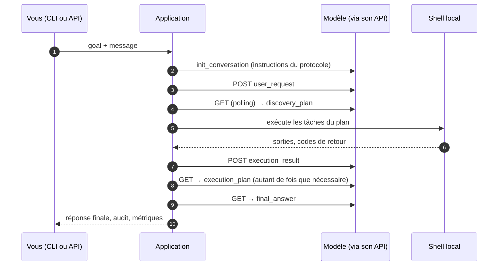

# Guide 01 — Prendre en main l'application

Ce guide va de l'installation à une première session terminée sur le modèle simulé, puis montre comment suivre une session en direct et lire ce qui s'est passé. Il ne suppose rien d'autre que Python et un terminal. Pour brancher un vrai modèle, passer ensuite au [guide 02](02-brancher-un-modele.md).

## 1. Ce que fait l'application, en une image

L'application pilote **un** modèle distant à travers un protocole strict de messages : elle lui envoie la demande de l'utilisateur, reçoit un *plan* (une liste de commandes), exécute les commandes sur la machine locale, renvoie les résultats, et recommence jusqu'à ce que le modèle rende une *réponse finale*. Tout ce qui se passe est journalisé dans une chaîne d'audit et publié en direct.



Les quatre opérations vers le modèle — **init**, **post**, **get** (polling), **close** — sont les seules choses qui dépendent de l'API du modèle ; elles sont décrites dans la configuration (guide 02) ou, pour les cas que la configuration ne couvre pas, dans une petite classe (guide 03).

## 2. Installer

Prérequis : Python ≥ 3.11 et [uv](https://docs.astral.sh/uv/). Windows, Linux et macOS sont supportés (les commandes sont exécutées par PowerShell sur Windows, par `bash`/`sh` ailleurs — réglable dans `[execution] shell`).

```bash
git clone https://github.com/moabidi91/agentic-local-app.git
cd agentic-local-app
uv sync --extra dev            # crée .venv, installe le projet et les outils de test
uv run agentic-app version     # vérifie l'installation
uv run pytest -q               # facultatif : toute la suite (quelques minutes)
```

Toutes les commandes du guide sont préfixées par `uv run` pour utiliser l'environnement créé ; après `source .venv/bin/activate` (ou `.venv\Scripts\Activate.ps1`), `agentic-app` s'appelle directement.

## 3. La configuration : un seul fichier

Tout ce qui est externe ou réglable est dans [`config.toml`](../../config.toml), à la racine du dépôt, abondamment commenté. L'application le cherche dans cet ordre : l'option `--config <chemin>`, la variable d'environnement `AGENTIC_APP_CONFIG`, puis `./config.toml` dans le répertoire courant ; sans fichier, les valeurs par défaut du code s'appliquent (elles sont identiques à celles du fichier livré).

Chaque valeur peut être surchargée par une variable d'environnement `AGENTIC__<SECTION>__<CLE>` (deux tirets bas), par exemple `AGENTIC__API__PORT=9001` ou `AGENTIC__TRANSPORT__USER_ID=alice`. Les secrets ne sont jamais dans le fichier : le jeton du modèle est lu dans la variable nommée par `transport.token_env` (`AGENTIC_TRANSPORT_TOKEN` par défaut), qu'un fichier `.env` local, ignoré par git, peut fournir (`[app] env_file`, chargé au démarrage sans écraser les variables déjà définies).

| Section | Ce qu'elle règle | Quand y toucher |
|---|---|---|
| `[app]` | dossier des données (`data_dir` : base SQLite, blobs de sortie, audit), niveau de log, fichier `.env` | pour déplacer les données |
| `[transport]` | **le modèle** : provider, codec, endpoints, jeton, identifiant utilisateur, timeouts, polling, gzip, TLS ; `[transport.options]` et `[transport.codec_options]` | pour brancher un modèle (guide 02) |
| `[execution]` | shell, répertoire de travail des commandes, timeouts de tâche, drains d'interruption, cadence du flux de sortie | pour adapter la machine cible |
| `[payload]` | tailles maximales des sorties renvoyées au modèle et des messages | si le modèle a une fenêtre étroite |
| `[context]` | budget d'octets d'une conversation, seuils d'alerte et de saturation, rotations | idem |
| `[budget]` | budget par défaut d'une session (cycles, plans, durée) et fermeture automatique | pour borner les sessions |
| `[retry]`, `[circuit_breaker]` | retries de transport et disjoncteur | si l'API est instable |
| `[api]`, `[cli]`, `[telemetry]` | hôte et port de l'API locale, CORS, pagination, taille des files SSE, rafraîchissement console | pour un front |

Deux commandes pour ne jamais deviner : `uv run agentic-app config validate` (le fichier est-il correct ?) et `uv run agentic-app config show` (la configuration **effective** en JSON, surcharges comprises, secrets masqués). Les deux acceptent `--config`.

## 4. Première session, sur le modèle simulé

Le dépôt embarque un **serveur mock** qui joue le rôle du modèle : il respecte le contrat HTTP par défaut ([ADR-004](../adr/ADR-004-contrat-de-transport.md)) et rejoue le scénario de la spec (diagnostic d'un build Java : plan de découverte, plan d'exécution, réponse finale). C'est le point de départ recommandé, parce qu'il permet de voir toute la boucle sans aucun compte ni jeton.

Terminal 1 — le modèle simulé :

```bash
uv run agentic-app mock-server --host 127.0.0.1 --port 9000
```

Terminal 2 — une session :

```bash
uv run agentic-app run "Understand the root cause of a Java build failure" \
    --message "Please debug the Java error in my project."
```

La console affiche la session en direct : l'état de la session et de la conversation, le cycle en cours, les tâches lancées et leurs sorties, les messages échangés, puis la réponse finale. **Ctrl-C interrompt proprement** la session (les commandes en cours sont arrêtées, l'état est persisté) ; un second Ctrl-C force la sortie. Codes de retour : `0` session terminée, `1` session échouée (l'erreur normalisée est affichée : type, code, détails), `2` interrompue. Options utiles : `--budget-cycles`, `--budget-plans`, `--budget-duration-ms` (budget de la session), `--auto-close` (fermer la conversation distante sur la réponse finale), `--json` (sortie machine), `--config`.

> Les commandes du scénario simulé (`uname`, `java -version`, `mvn`…) sont **réellement exécutées** dans `[execution] cwd` par le shell configuré : celles qui n'existent pas sur la machine échouent, ce que le modèle simulé ignore puisque son scénario est écrit d'avance. C'est voulu : on voit ainsi de vrais résultats, de vraies troncatures et de vrais codes de retour circuler dans le protocole.

Après la session, `data_dir` (`./data` par défaut) contient `agentic.db` : sessions, conversations, cycles, plans, tâches, messages, échecs, blobs des sorties et la chaîne d'audit. Rien n'est écrit ailleurs.

## 5. Suivre une session en direct par l'API

L'API locale (REST + SSE, [ADR-018](../adr/ADR-018-api-pour-un-front-et-flux-live.md)) est faite pour un front ou un autre outil ; elle expose exactement ce que la console affiche.

```bash
# terminal 2 : servir l'API (le mock tourne toujours dans le terminal 1)
uv run agentic-app serve                      # http://127.0.0.1:8765/api/v1 par défaut

# terminal 3 : créer une session
curl -s -X POST http://127.0.0.1:8765/api/v1/sessions \
     -H "Content-Type: application/json" \
     -d '{"goal": "Understand the root cause of a Java build failure",
          "user_message": "Please debug the Java error in my project."}'
# -> 201 {"session_id": "…", "status": "RUNNING", …}

# le flux live : tous les événements, ou ceux d'une session, ou la sortie d'une tâche
curl -N http://127.0.0.1:8765/api/v1/events
curl -N "http://127.0.0.1:8765/api/v1/sessions/<sid>/events?event_types=task.state_changed,task.output"
curl -N http://127.0.0.1:8765/api/v1/sessions/<sid>/tasks/<tid>/output/live
```

Chaque trame SSE porte `id:` (le numéro de séquence de l'audit), `event:` (le type, par exemple `session.state_changed`, `plan.received`, `task.state_changed`, `task.output`, `message.outbound`, `final_answer.received`, `failure.recorded`) et `data:` (le JSON de l'événement). Un client qui se reconnecte envoie l'en-tête `Last-Event-ID` (ou `?last_event_id=`) et **reçoit ce qu'il a manqué** depuis l'audit avant de basculer sur le direct ; un client trop lent est débranché avec une trame `event: dropped` plutôt que de ralentir l'application. `: keep-alive` est envoyé régulièrement.

Les mêmes informations en lecture ponctuelle :

| Route (`/api/v1`) | Contenu |
|---|---|
| `GET /sessions`, `GET /sessions/{sid}` | liste filtrée et paginée (`?status=running,ready`), détail |
| `GET /sessions/{sid}/snapshot` | l'état d'exécution (§4.1 de la spec) : session, conversation, cycle, plan, tâches en cours |
| `GET /sessions/{sid}/tasks?status=running` | les tâches (filtres `status`, `plan_id`) |
| `GET /sessions/{sid}/tasks/{tid}/output?stream=stdout&offset=0&max_bytes=8192` | une plage de la sortie stockée (le moteur de `chunk_request`) |
| `GET /sessions/{sid}/messages`, `/failures`, `/audit`, `/audit/verify` | les messages échangés, les échecs enregistrés, la chaîne d'audit et sa vérification |
| `GET /sessions/{sid}/final-answer` | la réponse finale |
| `GET /sessions/{sid}/responses`, `GET /sessions/{sid}/reply` | les réponses directes du modèle (`user_response`, ADR-022) ; la dernière réponse, finale ou directe |
| `POST /sessions/{sid}/interrupt`, `POST /sessions/{sid}/messages` | interrompre ; envoyer un message de suivi (§11) ou répondre à une question du modèle |
| `GET /metrics`, `GET /health`, `GET /config` | métriques texte, santé, configuration effective masquée |

La CLI a des clients de ces routes : `agentic-app sessions [--status running]`, `agentic-app status <sid>`, `agentic-app interrupt <sid>`, `agentic-app reply <sid> "…"` (répondre à une question du modèle, ou envoyer un suivi), `agentic-app audit verify <sid>` (option `--api-url` si l'API n'est pas à l'adresse de la configuration).

## 6. Lire ce qui s'est passé

Quand une session se termine en `FAILED`, la première chose à lire est l'événement `failure.recorded` (flux SSE, `GET /sessions/{sid}/failures`, ou l'erreur affichée par `run`). Il porte l'erreur normalisée : `error_type` (la famille : `NETWORK_ERROR`, `TIMEOUT_ERROR`, `MODEL_PROTOCOL_ERROR`, `AUTHN_ERROR`…), `error_code` (le cas précis : `MODEL_GET_TIMEOUT`, `INVALID_RESPONSE_BODY`, `UNPARSEABLE_REPLY`, `HTTP_401`…), `retryable`, et des `details` qui nomment l'opération (`INIT` / `POST` / `GET` / `CLOSE`), le statut HTTP, l'URL sans secret, et selon le cas le chemin de réponse manquant, un extrait du corps ou de la réponse brute du modèle. Le [guide 02, §7](02-brancher-un-modele.md#7-dépanner) donne la table de lecture.

La chaîne d'audit est vérifiable à tout moment (`agentic-app audit verify <sid>`, `GET /sessions/{sid}/audit/verify`) : chaque événement est haché avec le précédent ; une chaîne rompue est signalée avec le premier maillon fautif.

## 7. Dépanner le démarrage

| Symptôme | Cause | Que faire |
|---|---|---|
| `CONFIG_FILE_NOT_FOUND` | le chemin donné à `--config` ou `AGENTIC_APP_CONFIG` n'existe pas | corriger le chemin |
| `CONFIG_FILE_INVALID_TOML` | erreur de syntaxe TOML (`error` donne la ligne) | corriger le fichier |
| `CONFIG_INVALID` | une valeur hors domaine (`errors` : `loc`, `msg`) ; les contraintes croisées sont vérifiées aussi (`hard_max_output_bytes ≤ max_message_bytes ≤ budget_bytes / 2`, `summary_budget_bytes ≤ max_message_bytes`) | `config validate` montre toutes les erreurs d'un coup |
| `TRANSPORT_PROVIDER_UNKNOWN` (avec `available`) | `transport.provider` n'est ni un nom intégré, ni un entry point, ni un chemin d'import importable (`error` donne l'`ImportError`) | `agentic-app transport list` ; pour un chemin d'import, vérifier `PYTHONPATH` |
| `TRANSPORT_OPTIONS_INVALID`, `CODEC_OPTIONS_INVALID` | une clé inconnue ou une valeur invalide dans `[transport.options]` / `[transport.codec_options]` (`errors` : `loc`, `msg`, `type`) | `agentic-app transport show` / `codec show` |
| `CODEC_UNKNOWN`, `CODEC_INVALID` | idem pour `transport.codec` | `agentic-app codec list` |
| `DATA_DIR_UNAVAILABLE` | `data_dir` non créable | droits ou chemin |
| `serve` : adresse déjà utilisée | un autre `serve` tourne | `--port` ou `[api] port` |
| `run` reste sur `WAITING_MODEL_RESPONSE` puis `MODEL_GET_TIMEOUT` | rien ne répond aux GET pendant `reply_timeout_ms` : mock non lancé, mauvais port, mauvaise URL | vérifier le terminal 1, `transport show`, les URL |

## 8. Les commandes en un coup d'œil

| Commande | Rôle |
|---|---|
| `agentic-app run <goal> [--message …] [--budget-…] [--auto-close] [--json]` | une session en console, suivie en direct, Ctrl-C = interruption |
| `agentic-app serve [--host] [--port]` | l'API locale REST + SSE |
| `agentic-app mock-server [--scenario fichier.json] [--host] [--port]` | le modèle simulé (scénario Java par défaut) |
| `agentic-app sessions`, `status <sid>`, `interrupt <sid>`, `audit verify <sid>` | clients de l'API (`--api-url`) |
| `agentic-app config show`, `config validate` | la configuration effective, sa validation |
| `agentic-app transport list`, `transport show` | les providers disponibles, celui qui est actif (et son codec) |
| `agentic-app codec list`, `codec show` | les codecs disponibles, celui qui est actif |
| `agentic-app version` | la version |

Option globale `--config <chemin>` avant la commande ; `--json` sur `run`, `sessions`, `status`, `interrupt`, `audit verify`, `transport list/show` et `codec list/show`.

## Et ensuite

- Brancher un modèle réel : [guide 02](02-brancher-un-modele.md).
- Comprendre la conception : [docs/architecture/00-overview.md](../architecture/00-overview.md) puis les guides de phase.
- Ce que la v1 ne fait pas encore (isolation des commandes, correction des réponses mal formées, nettoyage des fichiers temporaires) : [README §9](../../README.md#9-périmètre-de-la-v1--à-lire-avant-de-lancer-lapplication-sur-une-vraie-machine).
