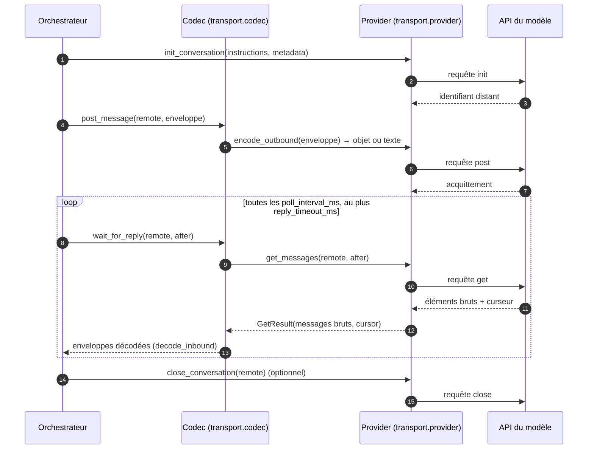
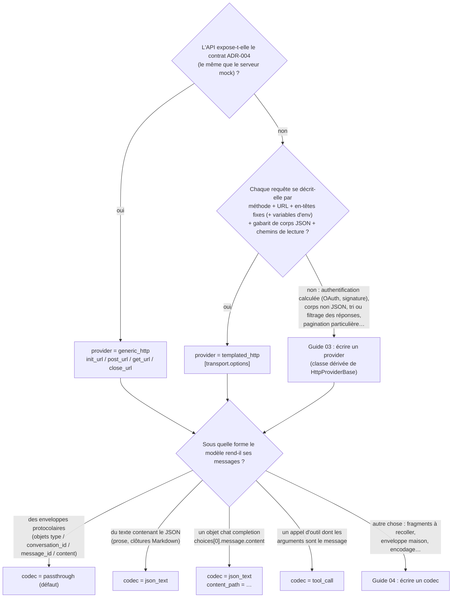

# Guide 02 — Brancher un modèle

Ce guide explique comment faire dialoguer l'application avec un modèle réel **sans écrire de code** : décrire ses quatre requêtes HTTP dans `config.toml`, choisir le codec qui lit la forme de ses réponses, vérifier, lancer, dépanner. Il dit aussi précisément *quand* la configuration ne suffit plus et qu'il faut passer aux guides [03](03-ecrire-un-provider.md) (provider) et [04](04-ecrire-un-codec.md) (codec).

## 1. Ce que l'application attend du modèle : quatre requêtes

Le contrat abstrait est le même pour tous les modèles ([`TransportGateway`](../../src/agentic_local_app/transport/base.py)). Ce qui change d'un modèle à l'autre, c'est *comment* chaque opération se traduit en HTTP.

| Opération | Quand | Ce que l'application fournit | Ce qu'elle doit lire en retour |
|---|---|---|---|
| **init** | au début de chaque conversation (une session en a une, plus une par rotation de contexte) | les **instructions** du protocole (le texte de [`PROTOCOL_INSTRUCTIONS.md`](../../src/agentic_local_app/protocol/PROTOCOL_INSTRUCTIONS.md), que le modèle doit suivre), des **métadonnées** (`session_id`, identifiant utilisateur…) | l'**identifiant de conversation distant**, réutilisé dans toutes les requêtes suivantes |
| **post** | à chaque message sortant (`user_request`, `execution_result`, `context_resume_request`) | une **enveloppe protocolaire** complète : `type`, `conversation_id`, `message_id`, `content` — ou sa forme texte si un codec le demande | un **acquittement** (accepté ou non) |
| **get** | après chaque post, en boucle toutes les `poll_interval_ms` jusqu'à recevoir au moins un message ou atteindre `reply_timeout_ms` | le **curseur** `after` (la position du dernier message lu) | les **messages du modèle** après le curseur, et le **nouveau curseur** |
| **close** | à la fin si `auto_close_on_final_answer` (ou `--auto-close`), après une interruption, et sur la conversation source d'une rotation de contexte — toujours **au mieux** : un échec de fermeture n'est ni rejoué ni fatal | l'identifiant de conversation | rien (un statut 2xx suffit) |



Le **provider** traduit les opérations en HTTP ; le **codec** convertit la forme des messages (dans les deux sens). Les deux sont choisis par `transport.provider` et `transport.codec` ; l'orchestrateur ne change jamais.

## 2. Décider en trois questions



`generic_http` est le contrat de référence ([ADR-004](../adr/ADR-004-contrat-de-transport.md)) : trois URL avec les placeholders `{conversation_id}` et `{after}`, corps et réponses de forme fixée, jeton `Authorization: Bearer` lu dans `token_env`, en-tête `X-User-Id`. Le serveur mock l'implémente ; si un petit adaptateur devant le modèle peut le respecter, c'est la voie la plus courte.

## 3. Décrire les quatre requêtes avec `templated_http`

`templated_http` décrit **n'importe quelle API HTTP JSON** dans `[transport.options]`, une sous-table par opération. Ce qui suit est la référence complète ; l'exemple commenté de [`config.toml`](../../config.toml) en est la version condensée.

### 3.1 Les en-têtes et l'authentification

```toml
[transport]
provider = "templated_http"
gzip = false                       # voir §6 : la plupart des API refusent un corps compressé

[transport.options]
headers = { "Authorization" = "Bearer ${env:MY_MODEL_KEY}", "X-Client" = "agentic-local-app" }
```

`headers` (commun) et `headers` de chaque opération sont des gabarits : `${env:VAR}` est remplacé par la variable d'environnement **au moment de l'appel** (jamais stockée, masquée dans toute erreur) ; une variable absente est refusée dès le premier appel (`TRANSPORT_ENV_MISSING`, avec `variable` et `operation`). `{token}` vaut la variable nommée par `transport.token_env` et `{user_id}` vaut `transport.user_id` ; ils sont utilisables partout. Par défaut **rien** d'identifiant ni d'authentifiant n'est envoyé : ni le jeton ADR-004, ni `X-User-Id` — seulement ce que les options écrivent. La base ajoute `Accept: application/json`, `Content-Type: application/json` quand il y a un corps, et `Content-Encoding: gzip` si `gzip = true`.

### 3.2 init

```toml
[transport.options.init]
method = "POST"                                          # défaut
url = "https://api.example.com/v1/threads"
body = { instructions = "{instructions}", user = "{user_id}", meta = "{metadata_json}" }
conversation_id_path = "data.id"                         # obligatoire : où lire l'identifiant distant
expected_statuses = [200, 201]                           # défaut
```

Placeholders disponibles : `{instructions}`, `{metadata_json}`, `{user_id}`, `{token}`. Une feuille du corps valant **exactement** `"{metadata_json}"` reçoit l'objet JSON des métadonnées ; à l'intérieur d'une chaîne plus longue, elle devient du JSON canonique en texte. Seules les feuilles `str` sont substituées, les autres valeurs (nombres, booléens, listes) passent telles quelles. Un placeholder utilisé dans une opération qui ne le fournit pas est refusé à la validation (`TRANSPORT_OPTIONS_INVALID`).

### 3.3 post

```toml
[transport.options.post]
url = "https://api.example.com/v1/threads/{conversation_id}/messages"
body = { role = "user", content = "{message_json}" }     # la valeur ENTIÈRE => l'objet du message
accepted_path = "ok"                                     # optionnel : absent => accepté si le statut est attendu
message_id_path = "id"                                   # optionnel : absent => message_id du message envoyé
expected_statuses = [200, 201, 202]                      # défaut
```

Placeholders : `{conversation_id}`, `{message_json}`, `{message_id}`, `{message_type}`, `{user_id}`, `{token}`. `{message_json}` en feuille exacte reçoit l'**objet** de l'enveloppe ; dans une chaîne plus longue, son JSON canonique. Quand le codec poste du **texte** (`outbound = "text"`, §4), `{message_json}` reçoit ce texte, `{message_id}` et `{message_type}` sont vides, et l'acquittement reprend le `message_id` de l'enveloppe (ou celui lu à `message_id_path`). `accepted_path` faux → `POST_NOT_ACCEPTED`. Les valeurs des placeholders dans une **URL** sont percent-encodées.

### 3.4 get

```toml
[transport.options.get]
method = "GET"                                           # défaut
url = "https://api.example.com/v1/threads/{conversation_id}/messages?since={after}"
messages_path = "items"                                  # obligatoire : la liste des messages
message_path = "payload"                                 # optionnel : le message protocolaire dans chaque élément
cursor_path = "next_cursor"                              # optionnel : absent ou null => message_id du dernier message
expected_statuses = [200]                                # défaut
```

Placeholders : `{conversation_id}`, `{after}` (vide au premier appel), `{user_id}`, `{token}`. `messages_path` doit désigner une **liste d'objets** ; chaque objet est remis tel quel au codec (ou son sous-objet à `message_path`). Avec `passthrough`, chaque objet doit donc déjà être une enveloppe ; avec `json_text` + `content_path`, c'est l'objet brut (une *chat completion*, par exemple). Une liste vide est une réponse « pas encore » : l'application attend `poll_interval_ms` et rappelle avec le même curseur. Le **curseur** est ce que l'application renverra dans `{after}` au prochain appel : `cursor_path` s'il est renseigné et non nul, sinon le `message_id` de la dernière enveloppe.

### 3.5 close

```toml
[transport.options.close]                                # table optionnelle : absente => fermeture locale seulement
method = "DELETE"
url = "https://api.example.com/v1/threads/{conversation_id}"
expected_statuses = [200, 204]                           # défaut : tout 2xx
```

### 3.6 Les chemins de lecture

Notation pointée avec index de liste : `data.items[0].id`, `choices[0].message.content`. Un chemin absent ou de type inattendu dans une réponse est `MODEL_PROTOCOL_ERROR / INVALID_RESPONSE_BODY` avec `details.path` et `details.reason` (`path_not_found`, `unexpected_type`) — jamais rejoué, puisque rejouer ne changerait rien.

### 3.7 Exemple complet : une API de type *chat completions*

```toml
[transport]
provider = "templated_http"
codec = "json_text"
gzip = false
[transport.codec_options]
content_path = "choices[0].message.content"   # chaque élément de messages_path est l'objet complet
outbound = "text"                              # nos messages partent en JSON canonique dans content
[transport.options]
headers = { "Authorization" = "Bearer ${env:MY_MODEL_KEY}" }
[transport.options.init]
url = "https://api.example.com/v1/threads"
body = { instructions = "{instructions}", user = "{user_id}" }
conversation_id_path = "id"
[transport.options.post]
url = "https://api.example.com/v1/threads/{conversation_id}/chat/completions"
body = { messages = [{ role = "user", content = "{message_json}" }] }   # content reçoit le texte
[transport.options.get]
url = "https://api.example.com/v1/threads/{conversation_id}/completions?since={after}"
messages_path = "data"                         # chaque élément est l'objet chat-completion brut
cursor_path = "next_cursor"
```

## 4. Choisir le codec : la forme des réponses du modèle

Le provider a rendu, pour chaque message, ce que l'API contient (un « élément brut ») ; le codec en tire les enveloppes que l'adaptateur protocolaire valide, et transforme nos enveloppes dans ce que l'API veut recevoir.

| `transport.codec` | Élément brut attendu | `[transport.codec_options]` | Ce qui part au post |
|---|---|---|---|
| `passthrough` (défaut) | déjà une enveloppe | aucune (le transport n'est même pas enveloppé) | l'enveloppe (objet) |
| `json_text` | une chaîne — ou un objet dont `content_path` donne la chaîne — contenant le JSON du message, éventuellement entouré de prose ou de clôtures ```` ```json ```` | `content_path`, `strip_code_fences` (défaut `true`), `extract_first_json_object` (défaut `true` ; `false` = tout le texte doit être du JSON), `id_path` (d'où prendre `message_id` s'il manque), `conversation_id_fallback` (défaut `true`), `outbound` (`object` \| `text`) | l'enveloppe, ou son JSON canonique en texte |
| `tool_call` | un objet portant un appel d'outil dont les `arguments` (JSON en chaîne ou objet) sont le message | `arguments_path` (défaut `arguments`), `name_path` + `tool_name` (refuse tout autre outil), `id_path`, `conversation_id_fallback`, `outbound` | idem |
| `paquet.module:Classe` | ce que vous voulez | les siennes | ce que vous voulez — [guide 04](04-ecrire-un-codec.md) |

Deux règles communes. Un codec **n'invente jamais** de `conversation_id` : avec `conversation_id_fallback` une enveloppe qui n'en a pas est transmise à l'adaptateur, qui la rejette (`SCHEMA_INVALID`, la réponse est persistée et comptée comme une erreur de protocole) ; sans l'option, le codec la refuse d'emblée. Un `message_id` manquant n'est synthétisé que si `id_path` le désigne.

Une réponse que le codec ne sait pas lire est un échec `MODEL_PROTOCOL_ERROR / UNPARSEABLE_REPLY`, jamais rejoué, dont l'enregistrement d'échec garde le nom du codec, l'index de l'élément, un **extrait de la forme brute** (`excerpt`, 500 caractères) et une `reason` (`no_json_found`, `json_unbalanced`, `json_invalid`, `path_not_found`, `unexpected_type`, `missing_conversation_id`, `unexpected_tool`, `no_envelope`). Si la fenêtre de contexte est déjà en `WARNING`, l'application **rotationne** (nouvelle conversation, résumé) au lieu d'échouer, la réponse inutilisable étant lue comme un signe de saturation ([ADR-019](../adr/ADR-019-consolidation-vague-1.md)).

## 5. Vérifier, puis lancer

```bash
uv run agentic-app config validate          # syntaxe, domaines, contraintes croisées
uv run agentic-app transport show           # provider résolu, classe, origine, options masquées, codec effectif
uv run agentic-app codec show               # codec résolu et ses options
```

`transport show` et `codec show` **résolvent réellement** le provider et le codec (import, validation des options) : ce qu'ils acceptent, `run` et `serve` l'accepteront. Puis une première session avec un budget serré, en observant les événements :

```bash
export MY_MODEL_KEY=...                     # PowerShell : $env:MY_MODEL_KEY = "..."
uv run agentic-app run "Say hello and stop" --message "Reply with a final_answer immediately." \
    --budget-cycles 2 --budget-plans 1 --budget-duration-ms 60000
```

Si la session échoue, l'erreur affichée (et l'événement `failure.recorded`) nomme l'opération, le statut HTTP, l'URL sans secret et, pour un problème de forme, le chemin manquant ou l'extrait de la réponse : la table du §7 s'applique.

Une façon sûre de valider une description `templated_http` **avant** d'avoir accès au modèle : la faire pointer sur le serveur mock (`uv run agentic-app mock-server`) en reproduisant le contrat ADR-004 (`conversation_id_path = "conversation_id"`, `messages_path = "messages"`, `cursor_path = "cursor"`, `accepted_path = "accepted"`, `message_id_path = "message_id"`, corps `{ user_id = "{user_id}", instructions = "{instructions}", metadata = "{metadata_json}" }` à l'init et `"{message_json}"` en corps entier au post) ; le dépôt a ce test d'équivalence.

## 6. Ce qu'il faut savoir sur le comportement en ligne

- **Compression.** `transport.gzip = true` par défaut (contrat ADR-004) : les corps sont envoyés compressés avec `Content-Encoding: gzip`. La plupart des API tierces ne l'acceptent pas — mettre `gzip = false` est presque toujours la première chose à faire.
- **Timeouts.** `request_timeout_ms` borne chaque appel HTTP (`TIMEOUT_ERROR / REQUEST_TIMEOUT`, rejoué) ; `poll_interval_ms` sépare deux GET vides ; `reply_timeout_ms` borne l'attente totale d'une réponse (`TIMEOUT_ERROR / MODEL_GET_TIMEOUT`, rejoué selon `[retry]`).
- **Retries et disjoncteur.** Les erreurs marquées rejouables (réseau, timeouts, 429 avec `Retry-After` ou `retry_after_ms`, 5xx transitoires) sont rejouées avec backoff exponentiel `[retry]` — **le même message, le même curseur** (le post est idempotent sur `message_id` côté serveur, c'est une exigence du contrat) ; les échecs consécutifs ouvrent le disjoncteur `[circuit_breaker]`. Les erreurs de contrat (`MODEL_PROTOCOL_ERROR`), d'authentification (401/403) et les autres 4xx ne sont jamais rejouées : rejouer le même message ne changerait rien.
- **Table HTTP → erreur** (héritée par tout provider HTTP) : 401 `AUTHN_ERROR`, 403 `AUTHZ_ERROR`, 408/504 `TIMEOUT_ERROR`, 413 ou corps `{"error": "context_window_exceeded"}` `MODEL_CONTEXT_WINDOW_ERROR` (déclenche une rotation), 429 `RATE_LIMIT_ERROR`, 502/503 `NETWORK_ERROR`, autre 5xx `SYSTEM_ERROR` transitoire, autre 4xx `SYSTEM_ERROR` définitif, statut inattendu (3xx, 2xx non listé) `MODEL_PROTOCOL_ERROR / UNEXPECTED_STATUS`.
- **Rotation de contexte.** Quand la conversation approche du budget d'octets (`[context]`), l'application ouvre une **nouvelle** conversation (un nouvel **init**), lui envoie un résumé et continue : le modèle doit accepter plusieurs conversations par session.
- **Interruption.** Ctrl-C ou `POST /sessions/{sid}/interrupt` annule les appels HTTP en cours (`INTERRUPTED / ABANDONED`) puis ferme la conversation distante si `close` est décrit.
- **TLS.** `verify_tls = false` désactive la vérification du certificat ; à réserver à un serveur de test.
- **Secrets.** Rien de ce qui vient de `${env:…}` ou de `token_env` n'apparaît dans les logs, les erreurs, `config show` ou `transport show` ; les options dont la clé ressemble à un secret (`*key*`, `*token*`, `*secret*`, `*password*`, `*authorization*`) sont masquées aussi.

## 7. Dépanner

| `error_code` (et `details`) | Signification | Piste |
|---|---|---|
| `TRANSPORT_OPTIONS_INVALID` (`errors[].loc`) | une clé inconnue, un placeholder hors de son opération, un chemin mal formé | corriger `[transport.options]` ; `transport show` |
| `TRANSPORT_ENV_MISSING` (`variable`, `operation`) | une variable `${env:…}` ou `token_env` absente au moment de l'appel | exporter la variable, ou la mettre dans `.env` |
| `INVALID_RESPONSE_BODY` (`path`, `reason`, `operation`, `http_status`) | la réponse n'a pas la forme décrite : chemin absent, type inattendu, corps qui n'est pas du JSON (`reason = not_json`, `body` = extrait) | comparer avec une réponse réelle de l'API ; ajuster `*_path` |
| `UNEXPECTED_STATUS` (`http_status`, `body`) | statut hors `expected_statuses` mais pas une erreur connue (par exemple `204` non listé) | ajouter le statut à `expected_statuses` |
| `HTTP_401` / `HTTP_403` | authentification refusée | en-têtes, valeur de la clé, droits |
| `HTTP_429` (`retry_after_ms`) | limitation de débit ; rejoué en respectant `Retry-After` | `[retry]`, cadence de polling |
| `REQUEST_TIMEOUT`, `CONNECTION_ERROR` (`cause`, `message`) | réseau : délai dépassé, connexion refusée, DNS, TLS | URL, proxy, `verify_tls`, `request_timeout_ms` |
| `MODEL_GET_TIMEOUT` (`polls`, `elapsed_ms`) | aucun message pendant `reply_timeout_ms` : le modèle ne répond pas, ou `messages_path` pointe à côté (liste toujours vide) | vérifier la réponse réelle du GET ; augmenter `reply_timeout_ms` |
| `POST_NOT_ACCEPTED` | `accepted_path` vaut faux | lire `reason` renvoyée par l'API |
| `UNPARSEABLE_REPLY` (`codec`, `reason`, `excerpt`) | le codec n'a pas trouvé de message dans la réponse brute | lire `excerpt` : mauvais `content_path` ? prose sans JSON ? mauvais `outbound` (le modèle a reçu un objet là où il attendait du texte) ? |
| `SCHEMA_INVALID` sur un `message.rejected` | l'enveloppe est lue mais ne respecte pas le schéma (champ manquant, `type` inattendu, `conversation_id` absent) | le modèle ne suit pas les instructions du protocole ; voir l'événement pour le champ fautif |
| `CONTEXT_WINDOW_EXCEEDED` / `HTTP_413` | le modèle refuse un message trop grand : l'application rotationne | réduire `[payload]` (`max_message_bytes`, `default_max_output_bytes`) |

## 8. Quand la configuration ne suffit plus

`templated_http` couvre les en-têtes statiques et les variables d'environnement, les corps JSON par gabarit et les réponses lisibles par chemin. Il ne couvre pas, et c'est le rôle d'un provider écrit en Python ([guide 03](03-ecrire-un-provider.md)) : une authentification calculée (OAuth, jeton à rafraîchir, signature de requête), un corps qui n'est pas du JSON, une réponse à trier ou filtrer (ne garder que les événements d'un certain type), une liste de messages qui ne sont pas des objets, un curseur à calculer, un statut d'erreur maison à reclasser. Côté forme du modèle, `json_text` et `tool_call` couvrent le texte, les *chat completions* et les appels d'outil ; le reste (fragments à recoller, enveloppe maison, encodage) est un codec ([guide 04](04-ecrire-un-codec.md)). Dans les deux cas la classe se sélectionne dans `config.toml` par son chemin d'import, sans toucher à l'application.
