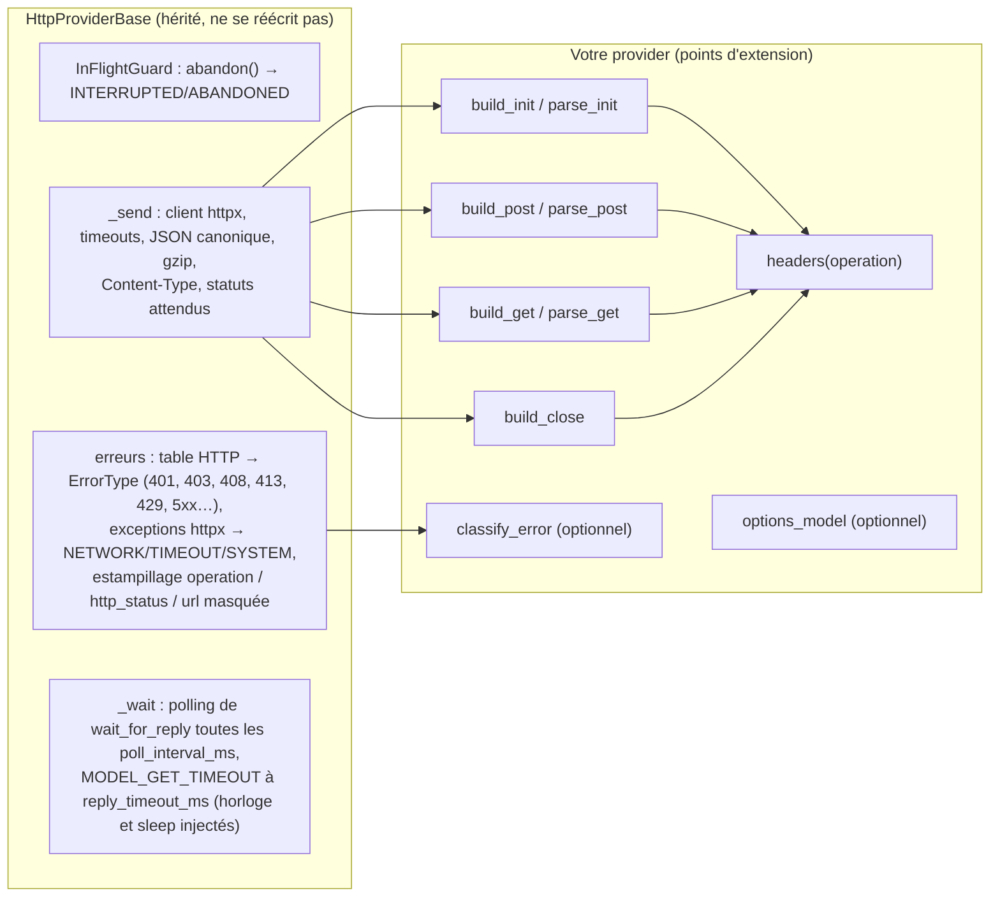

# Guide 03 — Écrire un provider de transport

Un **provider** est l'implémentation du contrat `TransportGateway` pour une API donnée : il traduit les quatre opérations (init, post, get, close) dans le dialecte HTTP de cette API. Ce guide montre comment en écrire un **hors du dépôt**, le sélectionner par configuration, le tester sans réseau. Le fil conducteur est [`examples/acme_model_plugin/provider.py`](../../examples/acme_model_plugin/provider.py), un provider complet pour une API fictive, couvert par `tests/unit/test_phase7_examples_plugin.py` et par une boucle protocolaire entière dans `tests/integration/test_phase9_examples_plugin.py`.

## 1. Faut-il vraiment écrire un provider ?

Non si l'API se décrit par des en-têtes fixes (ou des variables d'environnement), des corps JSON à gabarit et des réponses lisibles par chemin : c'est `templated_http` ([guide 02](02-brancher-un-modele.md)). Oui dès qu'il faut **calculer** quelque chose : une authentification (OAuth, jeton à rafraîchir, signature HMAC), un corps qui n'est pas du JSON, une réponse à filtrer (ne garder que certains événements) ou à trier, un curseur à dériver, une erreur maison à reclasser, une API sans HTTP (SDK, websocket).

Le provider ACME de l'exemple cumule plusieurs de ces raisons : clé d'API lue dans une variable dont le **nom** est une option, URL construites à partir d'un espace de travail, réponses de forme maison, liste d'événements à **filtrer** (`status`, `typing`, `message`…), fermeture par `DELETE` sans corps, et un `429` qui porte son délai dans le corps plutôt que dans `Retry-After`.

## 2. Ce que la base fait pour vous

Presque tout provider HTTP dérive de [`HttpProviderBase`](../../src/agentic_local_app/transport/http_base.py) (*template method*). Le provider **décrit** chaque requête et **lit** chaque réponse ; la base fait le reste.



| Point d'extension | Signature | Ce qu'il doit faire | Défaut |
|---|---|---|---|
| `options_model` | attribut de classe, modèle pydantic ou `None` | valider `[transport.options]` ; l'instance validée est `self.options` | `None` : aucune option admise |
| `headers(operation)` | `-> dict[str, str]` | les en-têtes communs d'un appel (`OP_INIT`, `OP_POST`, `OP_GET`, `OP_CLOSE`) | `Accept`, `X-User-Id`, `Authorization: Bearer` si `token_env` est renseigné (contrat ADR-004) |
| `build_init(instructions, metadata)` | `-> HttpCall` | la requête qui crée la conversation distante | abstrait |
| `parse_init(status, body)` | `-> str` | l'identifiant distant lu dans la réponse | abstrait |
| `build_post(remote_id, payload)` | `-> HttpCall` | la requête qui dépose un message (`payload` : l'enveloppe, ou sa forme texte si un codec poste du texte) | abstrait |
| `parse_post(status, body, *, payload)` | `-> PostAck` | l'acquittement (`message_id`, `accepted`, `http_status`) | abstrait |
| `build_get(remote_id, after)` | `-> HttpCall` | la requête qui lit après le curseur (`after` vaut `None` au premier appel) | abstrait |
| `parse_get(status, body)` | `-> GetResult` | les éléments bruts des messages, dans l'ordre, et le nouveau curseur (`None` = pas de progression) | abstrait |
| `build_close(remote_id)` | `-> HttpCall \| None` | la requête de fermeture ; `None` = rien n'est envoyé | abstrait |
| `classify_error(operation, status, body, headers)` | `-> TransportError` | reclasser un statut hors `expected_statuses` | la table ADR-004 |
| `redact_url(url)` | `-> str` | l'URL telle qu'écrite dans les erreurs | jeton `token_env` masqué |

Un `HttpCall` est `HttpCall(method, url, headers, json, expected_statuses, parse_json=True)` : `json` est le corps (`None` = aucun ; sinon encodé en JSON canonique, compressé si `transport.gzip`), `expected_statuses` les statuts qui portent une réponse valide (tout autre statut passe par `classify_error`), `parse_json=False` remet `None` au `parse_*` au lieu de décoder le corps (un `204`, par exemple).

À l'intérieur du provider : `self._config` (la section `[transport]`, dont `user_id`, `token`, `request_timeout_ms`…), `self.options` (les options validées), `self._clock` (jamais `time.*`), `self._sleep` (jamais `asyncio.sleep` directement : les tests injectent une attente instantanée).

## 3. Le squelette minimal

```python
from typing import Any, ClassVar
from pydantic import BaseModel, ConfigDict
from agentic_local_app.transport.base import OP_CLOSE, OP_GET, OP_INIT, OP_POST, GetResult, PostAck
from agentic_local_app.transport.http_base import HttpCall, HttpProviderBase, InvalidResponseError

class MyOptions(BaseModel):
    model_config = ConfigDict(extra="forbid", frozen=True)   # une clé inconnue = erreur au démarrage
    base_url: str

class MyProvider(HttpProviderBase):
    options_model: ClassVar[type[BaseModel] | None] = MyOptions

    def build_init(self, instructions: str, metadata: dict[str, Any]) -> HttpCall: ...
    def parse_init(self, status: int, body: Any) -> str: ...
    def build_post(self, remote_conversation_id: str, payload: dict[str, Any]) -> HttpCall: ...
    def parse_post(self, status: int, body: Any, *, payload: dict[str, Any]) -> PostAck: ...
    def build_get(self, remote_conversation_id: str, after: str | None) -> HttpCall: ...
    def parse_get(self, status: int, body: Any) -> GetResult: ...
    def build_close(self, remote_conversation_id: str) -> HttpCall | None: ...
```

Le constructeur hérité est `MyProvider(config.transport, clock, *, transport=None, sleep=asyncio.sleep)` : c'est la convention du registre ([ADR-020](../adr/ADR-020-transport-enfichable.md)), qui instancie `cls(config.transport, clock, **kwargs)` — un provider **ignore les kwargs qu'il ne connaît pas** et peut en ajouter pour ses tests (l'exemple ajoute `environ`).

## 4. Pas à pas sur l'exemple ACME

### 4.1 Les options

```python
class AcmeOptions(BaseModel):
    model_config = ConfigDict(extra="forbid", frozen=True)

    base_url: str = Field(min_length=1)
    workspace: str = Field(min_length=1)
    api_key_env: str = "ACME_API_KEY"
    page_size: int = Field(default=50, ge=1, le=500)

    @field_validator("base_url")
    @classmethod
    def _without_trailing_slash(cls, value: str) -> str:
        value = value.strip().rstrip("/")
        if not value.startswith(("http://", "https://")):
            raise ValueError("base_url must start with http:// or https://")
        return value
```

`extra = "forbid"` fait d'une faute de frappe (`page_sizee`) une erreur `TRANSPORT_OPTIONS_INVALID` au démarrage (avec `loc`, `msg`, `type`) plutôt qu'une valeur par défaut silencieuse. Le **nom** de la variable qui porte la clé est une option ; sa **valeur** n'est jamais dans la configuration. Dans le provider, `self.settings = cast(AcmeOptions, self.options)` donne la vue typée.

### 4.2 L'authentification : un seul point d'extension

```python
def headers(self, operation: str) -> dict[str, str]:
    key = self._environ.get(self.settings.api_key_env, "").strip()
    if not key:
        raise ConfigError(ENV_MISSING_CODE, variable=self.settings.api_key_env, operation=operation)
    return {"Accept": "application/json", "X-Api-Key": key, "X-Workspace": self.settings.workspace}
```

La clé est lue **à chaque appel** (jamais stockée dans l'objet), la variable absente est une `ConfigError` avec le code `TRANSPORT_ENV_MISSING` — le même que `templated_http`, pour que la table de dépannage du guide 02 reste vraie. Comme `headers` est redéfini, le jeton ADR-004 et `X-User-Id` ne partent **pas** vers cette API : un provider n'envoie que ce qu'il décide. `self._environ` est `os.environ` par défaut et injectable pour les tests.

### 4.3 init : décrire, puis lire

```python
def build_init(self, instructions: str, metadata: dict[str, Any]) -> HttpCall:
    url = f"{self.settings.base_url}/workspaces/{quote(self.settings.workspace, safe='')}/threads"
    body = {"system": instructions, "owner": self._config.user_id, "labels": metadata}
    return HttpCall("POST", url, self.headers(OP_INIT), body, _INIT_STATUSES)   # {200, 201}

def parse_init(self, status: int, body: Any) -> str:
    thread = body.get("thread") if isinstance(body, dict) else None
    thread_id = thread.get("id") if isinstance(thread, dict) else None
    if not isinstance(thread_id, str) or not thread_id:
        raise InvalidResponseError(reason="path_not_found", path="thread.id")
    return thread_id
```

Un `parse_*` ne connaît ni l'opération, ni l'URL, ni le statut : il lève `InvalidResponseError(code="INVALID_RESPONSE_BODY", **details)` et la base en fait une `TransportError(MODEL_PROTOCOL_ERROR, code)` **non rejouable**, estampillée `operation`, `http_status`, `url`. Réutiliser les `reason` standard (`path_not_found`, `unexpected_type`, avec `path`) garde la table de dépannage valable. Les valeurs insérées dans une URL sont percent-encodées (`quote(..., safe="")`).

### 4.4 post : l'acquittement nomme le message protocolaire

```python
def build_post(self, remote_conversation_id: str, payload: dict[str, Any]) -> HttpCall:
    body = {"kind": "message", "payload": payload}     # l'enveloppe, ou son texte si un codec poste du texte
    return HttpCall("POST", self._thread_url(remote_conversation_id, "/events"),
                    self.headers(OP_POST), body, _POST_STATUSES)          # {200, 202}

def parse_post(self, status: int, body: Any, *, payload: dict[str, Any]) -> PostAck:
    event = body.get("event") if isinstance(body, dict) else None
    if not isinstance(event, dict) or not event.get("id"):
        raise InvalidResponseError(reason="path_not_found", path="event.id")
    message_id = payload.get("message_id") if isinstance(payload, dict) else None
    return PostAck(message_id=str(message_id) if message_id else "", accepted=True, http_status=status)
```

Le contrat veut que l'acquittement **nomme le message envoyé** (ADR-004), or l'API ACME ne connaît que son propre identifiant d'événement : le provider reprend donc le `message_id` du `payload`. Quand un codec poste la forme **texte** du message, `payload` est une chaîne ; le provider rend alors un `message_id` vide et c'est le décorateur de codec qui le restaure depuis l'enveloppe ([ADR-021 §4](../adr/ADR-021-codec-de-messages-par-modele.md)). Un provider qui doit refuser un dépôt (`accepted: false`) lève `InvalidResponseError("POST_NOT_ACCEPTED", ...)`.

### 4.5 get : filtrer, et rendre un curseur honnête

```python
def parse_get(self, status: int, body: Any) -> GetResult:
    events = body.get("events") if isinstance(body, dict) else None
    if not isinstance(events, list):
        raise InvalidResponseError(reason="path_not_found", path="events")
    messages: list[dict[str, Any]] = []
    for index, event in enumerate(events):
        ...
        if event.get("kind") != "message":
            continue                                  # "status", "typing"… : pas de message protocolaire
        messages.append(payload)
    cursor = body.get("next")
    ...
    return GetResult(messages=messages, cursor=cursor or None, http_status=status)
```

`GetResult.messages` contient les **éléments bruts** dans l'ordre (des enveloppes avec `passthrough`, n'importe quoi que le codec configuré sait lire sinon) ; une liste vide signifie « pas encore » et la base rappellera après `poll_interval_ms`. Le **curseur** est ce que l'application repassera dans `after` : rendre celui de l'API quand elle en donne un ; sinon `None`, et le décorateur de codec (ou, avec `passthrough`, le contrat ADR-004) prendra le `message_id` de la dernière enveloppe. Ne jamais rendre un curseur qui ferait relire les mêmes messages.

### 4.6 close : une requête sans corps de réponse

```python
def build_close(self, remote_conversation_id: str) -> HttpCall | None:
    return HttpCall("DELETE", self._thread_url(remote_conversation_id), self.headers(OP_CLOSE),
                    None, _CLOSE_STATUSES, parse_json=False)                # {200, 204}
```

`parse_json=False` : la base ne tente pas de décoder un corps (un `204` n'en a pas). Rendre `None` quand rien ne doit être envoyé (fermeture locale seulement).

### 4.7 Reclasser une erreur que la base ne connaît pas

```python
def classify_error(self, operation, status, body, headers) -> TransportError:
    error = super().classify_error(operation, status, body, headers)    # la table ADR-004 d'abord
    if status == 429:
        retry_in_ms = _retry_in_ms(body)                                # {"error": {"retry_in_ms": N}}
        if retry_in_ms is not None:
            normalized = error.error
            return TransportError(ErrorType.RATE_LIMIT_ERROR, normalized.error_code, retryable=True,
                                  **{**normalized.details, "retry_after_ms": retry_in_ms})
    return error
```

Partir de la classification de la base et n'ajouter que la connaissance propre à l'API. `retry_after_ms` dans les `details` est honoré par la politique de retry (le délai est `max(backoff, retry_after_ms)`). La base estampille ensuite `operation`, `http_status` et `url` : ne pas les ajouter soi-même.

## 5. Les erreurs, en résumé

| Situation | Ce que le provider fait | Ce que l'application voit |
|---|---|---|
| réponse hors contrat sur un statut attendu | `raise InvalidResponseError(reason=…, path=…)` dans un `parse_*` | `MODEL_PROTOCOL_ERROR / INVALID_RESPONSE_BODY`, non rejoué, échec de session (ou rotation si la fenêtre est en `WARNING`) |
| dépôt refusé | `raise InvalidResponseError("POST_NOT_ACCEPTED", …)` | `MODEL_PROTOCOL_ERROR / POST_NOT_ACCEPTED`, non rejoué |
| statut inattendu | rien : la base appelle `classify_error` | 401 `AUTHN_ERROR`, 429 `RATE_LIMIT_ERROR` (rejoué), 5xx transitoire (rejoué)… |
| erreur propre à l'API | `classify_error` surchargé, rendant une `TransportError(error_type, code, retryable=…, **details)` | selon `error_type` et `retryable` : rejoué, disjoncteur, échec |
| secret ou variable absente | `raise ConfigError("TRANSPORT_ENV_MISSING", variable=…, operation=…)` | échec de session immédiat, sans retry |
| réseau, délais | rien : la base traduit les exceptions httpx | `NETWORK_ERROR / CONNECTION_ERROR`, `TIMEOUT_ERROR / REQUEST_TIMEOUT`, rejoués |
| aucun message pendant `reply_timeout_ms` | rien : la base borne le polling | `TIMEOUT_ERROR / MODEL_GET_TIMEOUT`, rejoué selon `[retry]` |
| interruption | rien : `abandon()` annule les appels en cours | `INTERRUPTED / ABANDONED`, la boucle s'arrête proprement |

Rien de ce que le provider écrit dans les `details` ne doit contenir un secret : les URL passent par `redact_url` (à surcharger si un secret peut apparaître ailleurs que dans le jeton ADR-004).

## 6. Sans HTTP : implémenter `TransportGateway` directement

Pour un SDK, un websocket ou une file de messages, dériver directement de [`TransportGateway`](../../src/agentic_local_app/transport/base.py) et honorer ce que la base HTTP garantit :

- le constructeur `cls(config.transport, clock, **kwargs)`, en ignorant les kwargs inconnus ;
- **`abandon()`** : tout appel en cours est annulé et lève `TransportError(INTERRUPTED, "ABANDONED")` — `InFlightGuard` (`await self._guard.run(OP_GET, coroutine)`) le fait pour vous ;
- **`wait_for_reply`** : au moins un message ou `TransportError(TIMEOUT_ERROR, "MODEL_GET_TIMEOUT", retryable=True, operation=OP_GET, …)` après `reply_timeout_ms`, en attendant par la fonction `sleep` injectée et en lisant l'heure sur `clock.monotonic_ms()` ;
- chaque échec est une `TransportError` classée (type, code, `retryable`) avec `operation` dans ses `details` ; jamais une exception nue ;
- `aclose()` (facultatif, `async`) pour libérer les ressources : l'application l'appelle à l'arrêt si elle existe.

[`FakeTransportGateway`](../../src/agentic_local_app/transport/fake.py) est une implémentation complète sans réseau qui montre tout cela en peu de lignes.

## 7. Tester sans réseau

Trois injections suffisent : `httpx.MockTransport` (le serveur scripté), `FakeClock` (le temps) et `sleep` (l'attente).

```python
server = AcmeServer()                                    # un handler async (httpx.Request) -> httpx.Response
server.on("POST", "/workspaces/demo/threads", lambda r: httpx.Response(201, json={"thread": {"id": "thr_1"}}))
provider = AcmeHttpProvider(section, FakeClock(), transport=httpx.MockTransport(server), environ={"ACME_API_KEY": "k"})
assert await provider.init_conversation("INSTRUCTIONS", {"session_id": "s-1"}) == "thr_1"
assert server.last.headers["X-Api-Key"] == "k"
assert json.loads(server.last.content) == {"labels": {"session_id": "s-1"}, "owner": "local-user", "system": "INSTRUCTIONS"}
```

Ce qu'il faut couvrir, et que l'exemple couvre : les en-têtes et le corps de chaque requête ; l'identifiant, l'acquittement, les messages et le curseur lus ; une réponse hors contrat par opération (`INVALID_RESPONSE_BODY` avec `path`, `operation`, `http_status`) ; la variable absente ; une erreur reclassée (`429` → `RATE_LIMIT_ERROR` + `retry_after_ms`) et une héritée (`401` → `AUTHN_ERROR`) ; le polling jusqu'à `MODEL_GET_TIMEOUT` avec un `sleep` qui **avance l'horloge** (quatre GET pour `reply_timeout_ms = 3000` et `poll_interval_ms = 1000`) ; la fermeture `204`. Pour la boucle complète, `build_application(config, transport=provider, …)` avec un `InMemoryConversationStore`, un `FakeCommandExecutor` et le `sleep` avançant — `tests/integration/test_phase9_examples_plugin.py` va jusqu'à la `final_answer` et vérifie le `DELETE` de fermeture. Ne pas oublier de passer le même `sleep` au provider **et** à `build_application` : un provider construit par le registre sans `sleep=` attend pour de vrai.

## 8. Rendre le provider atteignable

Trois façons, sans modifier l'application ([ADR-020 §6](../adr/ADR-020-transport-enfichable.md)) :

1. **Chemin d'import** — la classe est importable, c'est tout :
   ```toml
   [transport]
   provider = "acme_model_plugin.provider:AcmeHttpProvider"
   ```
   Depuis la racine du dépôt, `PYTHONPATH=examples uv run agentic-app --config examples/config.acme.toml transport show` (PowerShell : `$env:PYTHONPATH = "examples"`). Un paquet installé dans l'environnement n'a pas besoin de `PYTHONPATH`.
2. **Entry point** — dans le `pyproject.toml` de la distribution qui contient la classe :
   ```toml
   [project.entry-points."agentic_local_app.transports"]
   acme = "acme_model_plugin.provider:AcmeHttpProvider"
   ```
   puis `provider = "acme"` ; `transport list` l'affiche avec l'origine `entry point`.
3. **Intégré au dépôt** — `@TransportRegistry.register("acme")` sur la classe, un import dans `transport/__init__.py`, l'entry point dans `pyproject.toml`, une ligne dans `transport list` de la documentation, et ses tests dans `tests/unit/test_phase7_providers.py`.

Dans tous les cas `agentic-app transport show` résout la classe, valide les options et affiche l'origine ; ce qu'il accepte, `run` et `serve` l'acceptent.

## 9. Liste de contrôle avant de livrer

- `options_model` avec `extra = "forbid"` ; aucun secret en configuration, seulement des noms de variables.
- Aucun `time.*`, aucun `asyncio.sleep` direct : `self._clock`, `self._sleep`.
- Chaque `parse_*` refuse ce qu'il ne comprend pas avec `InvalidResponseError` et un `reason` standard.
- Le curseur rendu ne fait jamais relire un message ; une liste vide signifie « pas encore ».
- `classify_error` part de `super()` ; `retryable` est vrai seulement si rejouer **le même** message peut réussir.
- Les tests passent sans réseau et sans attente réelle ; `ruff`, `mypy --strict` verts (le dépôt vérifie `examples/` comme le code de l'application).
- `transport show` affiche le provider, ses options masquées, et le codec choisi.
