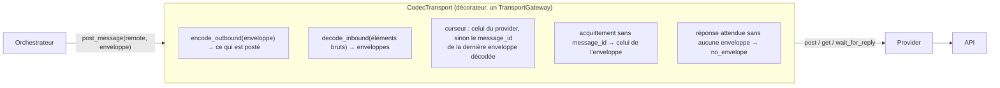

# Guide 04 — Écrire un codec de messages

Un **codec** convertit la forme brute des réponses d'un modèle en enveloppes du protocole, et nos enveloppes dans la forme que l'API attend. Le provider parle l'API ; le codec parle le modèle. Ce guide montre comment en écrire un hors du dépôt, avec [`examples/acme_model_plugin/codec.py`](../../examples/acme_model_plugin/codec.py) comme fil conducteur : un codec pour un modèle qui **répond en fragments** (`{"chunks": [{"delta": "…"}, …]}`) à recoller avant de pouvoir lire le JSON du message. Il est couvert par `tests/unit/test_phase7_examples_plugin.py` et par la boucle complète de `tests/integration/test_phase9_examples_plugin.py`.

## 1. Faut-il vraiment écrire un codec ?

Non si le modèle rend des enveloppes (`passthrough`), du texte contenant le JSON du message — nu, en prose ou dans une clôture Markdown — éventuellement à un chemin d'un objet *chat completion* (`json_text`), ou un appel d'outil dont les arguments sont le message (`tool_call`) : leurs options couvrent ces cas ([guide 02 §4](02-brancher-un-modele.md#4-choisir-le-codec--la-forme-des-réponses-du-modèle)). Oui pour tout le reste : des fragments à concaténer, une enveloppe maison à traduire (`{"kind": "plan", "steps": […]}` → `execution_plan`), un encodage (base64, compression), plusieurs formes selon le type de réponse, ou une forme de sortie que `outbound = "object" | "text"` ne décrit pas.

## 2. Le contrat



[`MessageCodec`](../../src/agentic_local_app/transport/codecs/base.py) demande peu :

| Membre | Rôle |
|---|---|
| `decode_inbound(raw_messages: list[Any]) -> list[dict]` | **obligatoire.** Les enveloppes portées par les éléments bruts d'un GET, dans l'ordre ; un élément peut en porter plusieurs (un tableau) ou aucune. Lève `CodecError` pour un élément illisible. |
| `encode_outbound(payload: dict) -> Any` | ce que le transport doit poster pour l'enveloppe `payload` ; défaut : l'enveloppe elle-même |
| `options_model` | modèle pydantic de `[transport.codec_options]`, ou `None` (aucune option admise) ; l'instance validée arrive au constructeur (`cls(options)`) et se trouve dans `self.options` |
| `name` | le nom que le codec se donne dans ses erreurs (`details["codec"]`) ; vide = le nom de la classe |
| `self.error(index, raw, reason, **details) -> CodecError` | fabrique l'erreur standard : `MODEL_PROTOCOL_ERROR / UNPARSEABLE_REPLY`, non rejouable, avec `codec`, `index`, l'`excerpt` de l'élément brut (500 caractères ; la chaîne telle quelle, sinon son JSON canonique) et `reason` |

Un codec est **pur** : ni réseau, ni horloge, ni état entre deux appels. C'est ce qui le rend trivial à tester. Le décorateur [`CodecTransport`](../../src/agentic_local_app/transport/codecs/decorator.py) l'applique autour de n'importe quel provider (celui du registre ou un transport injecté) et s'occupe du reste : estampiller `operation` / `http_status` sur les `CodecError`, restaurer le `message_id` de l'acquittement quand le provider a posté du texte, faire avancer le curseur quand le provider ne le peut pas, et refuser une réponse attendue qui ne porte aucune enveloppe (`no_envelope`). Avec `passthrough` le transport n'est même pas enveloppé.

## 3. Pas à pas sur l'exemple

### 3.1 Les options

```python
class StreamedTextOptions(BaseModel):
    model_config = ConfigDict(extra="forbid", frozen=True)

    chunks_path: str | None = None        # où est la liste de fragments dans l'élément brut (absent : c'est la liste)
    delta_path: str | None = None         # où est le texte dans un fragment (absent : les fragments sont des chaînes)
    id_path: str | None = None            # d'où synthétiser message_id s'il manque
    conversation_id_fallback: bool = True
    outbound: OutboundForm = "object"     # "text" : l'enveloppe est postée en JSON canonique

    _paths = field_validator("chunks_path", "delta_path", "id_path")(_validate_path)
```

Un chemin mal formé est refusé à la validation (`CODEC_OPTIONS_INVALID`), pas au premier message. Reprendre les noms d'options des codecs intégrés (`id_path`, `conversation_id_fallback`, `outbound`) quand la sémantique est la même : l'opérateur n'a qu'un vocabulaire à connaître.

### 3.2 Le constructeur et la vue typée

```python
class StreamedTextCodec(MessageCodec):
    options_model: ClassVar[type[BaseModel] | None] = StreamedTextOptions
    name: ClassVar[str] = "streamed_text"

    def __init__(self, options: BaseModel | None = None) -> None:
        settings = options if options is not None else StreamedTextOptions()
        if not isinstance(settings, StreamedTextOptions):
            raise TypeError(...)
        super().__init__(settings)
        self.settings: StreamedTextOptions = settings
```

Le registre appelle `cls(options)` avec l'instance validée, ou `None` si `[transport.codec_options]` est vide : accepter les deux.

### 3.3 Décoder : recoller, puis réutiliser

```python
def decode_inbound(self, raw_messages: list[Any]) -> list[dict[str, Any]]:
    envelopes: list[dict[str, Any]] = []
    for index, raw in enumerate(raw_messages):
        text = self._join_chunks(index, raw)                       # la partie propre à ce modèle
        try:
            document = extract_first_json(strip_code_fence(text))  # la partie commune à tout texte
        except UnparseableTextError as exc:
            raise self.error(index, raw, exc.reason, **exc.details) from exc
        envelopes.extend(envelopes_of(self, index, raw, document,
                                      id_path=self.settings.id_path,
                                      conversation_id_fallback=self.settings.conversation_id_fallback))
    return envelopes
```

Tout ce qui n'est pas propre au modèle est emprunté à `json_text` : `strip_code_fence` (le contenu de la première clôture ```` ``` ````), `extract_first_json` (le premier objet ou tableau JSON équilibré, chaînes et échappements respectés, ou `UnparseableTextError` avec `no_json_found` / `json_unbalanced` / `json_invalid`), `parse_strict` (tout le texte doit être du JSON), `envelopes_of` (un document JSON → une ou plusieurs enveloppes) et `complete_envelope` (`message_id` depuis `id_path`, règle du `conversation_id`). `extract_path` / `parse_path` (chemins pointés avec index) viennent de `templated_http`.

La partie propre au modèle :

```python
def _join_chunks(self, index: int, raw: Any) -> str:
    chunks = raw if self.settings.chunks_path is None else extract_path(raw, self.settings.chunks_path)
    ...  # extract_path lève InvalidResponseError → self.error(index, raw, "path_not_found", path=…)
    if not isinstance(chunks, list):
        raise self.error(index, raw, "unexpected_type", path=self.settings.chunks_path, expected="array")
    fragments = [...]      # delta_path dans chaque fragment ; un fragment non-texte → unexpected_type (+ chunk=position)
    if not fragments:
        raise self.error(index, raw, "no_json_found", chunks=0)
    return "".join(fragments)
```

Chaque impossibilité passe par `self.error(...)` avec un `reason` du vocabulaire standard — `path_not_found`, `unexpected_type`, `no_json_found`, `json_unbalanced`, `json_invalid`, `missing_conversation_id` — complété par ce qui aide à comprendre (`path`, `expected`, `chunk`). C'est ce vocabulaire que la table de dépannage du guide 02 explique, et que la future politique de correction citera au modèle.

### 3.4 Encoder

```python
def encode_outbound(self, payload: dict[str, Any]) -> Any:
    return encode_payload(payload, self.settings.outbound)     # l'enveloppe, ou canonical_json(enveloppe)
```

Ce que `encode_outbound` rend est ce que le provider reçoit comme `payload` : avec `templated_http`, `{message_json}` en feuille entière prend cette valeur (objet ou texte) ; avec un provider maison, `build_post` la place où il veut. Une forme de sortie plus riche (par exemple `{"role": "user", "content": …}`) se construit ici — et si le provider a besoin de savoir qu'il a reçu du texte pour l'acquittement, il rend un `message_id` vide et le décorateur le restaure.

## 4. Les règles à respecter

- **Ne jamais inventer un `conversation_id`.** Avec `conversation_id_fallback` (défaut), une enveloppe qui n'en a pas est transmise telle quelle à l'adaptateur, qui la rejette proprement (`SCHEMA_INVALID`, événement `message.rejected`, réponse persistée et comptée comme erreur de protocole) ; sans l'option, la refuser d'emblée (`missing_conversation_id`). Un codec qui remplirait `conversation_id` masquerait un modèle qui mélange ses conversations.
- **Ne synthétiser un `message_id` que si `id_path` le désigne** (chaîne non vide ou entier) ; un tableau de plusieurs enveloppes sans `message_id` reçoit le même — c'est de toute façon un tour à plusieurs messages, que l'adaptateur refuse (ADR-007).
- **Un élément brut peut porter zéro, une ou plusieurs enveloppes** ; rendre la liste dans l'ordre. Une réponse attendue (`wait_for_reply`) qui n'en porte aucune devient `no_envelope` par le décorateur : ne pas « inventer » une enveloppe vide pour l'éviter.
- **L'`excerpt` est pris par `self.error`** sur l'élément brut tel que le provider l'a rendu : c'est lui qui apparaît dans l'enregistrement d'échec, il ne doit pas contenir de secret (un provider ne met pas ses en-têtes dans les éléments bruts).
- **Ne rien décider du protocole** : le codec ne valide ni `type` ni `content`, c'est le rôle de l'adaptateur ; il ne compte rien, ne journalise rien, ne lit pas l'heure.

## 5. Ce que le provider lui donne

La forme des éléments bruts dépend du provider : avec `generic_http`, chaque élément de `messages` (des enveloppes, donc `passthrough`) ; avec `templated_http`, chaque élément de `messages_path` (un objet, ou son sous-objet `message_path`) ; avec un provider maison, ce que son `parse_get` a mis dans `GetResult.messages` — l'exemple ACME y met le `payload` des seuls événements `kind = "message"`, c'est-à-dire l'objet `{"chunks": […]}` que `StreamedTextCodec` attend. Le curseur, lui, reste l'affaire du provider ; le codec n'y touche pas.

## 6. Tester

Le codec se teste sans rien d'autre que lui-même :

```python
codec = StreamedTextCodec(StreamedTextOptions(chunks_path="chunks", delta_path="delta"))
raw = {"chunks": [{"delta": "Here:\n```json\n{\"type\": \"fin"}, {"delta": "al_answer\", …}\n```"}]}
assert codec.decode_inbound([raw]) == [envelope]

with pytest.raises(CodecError) as exc:
    codec.decode_inbound([{"chunks": [{"delta": "I cannot help."}]}])
assert exc.value.error.error_code == "UNPARSEABLE_REPLY"
assert exc.value.error.details["reason"] == "no_json_found"
assert exc.value.error.details["excerpt"].startswith('{"chunks":')
```

À couvrir : le cas nominal (prose + clôture + JSON coupé n'importe où), chaque `reason` (chemin absent, type inattendu, aucun JSON, JSON invalide), les deux formes de sortie, la validation des options (`CodecRegistry.validate(StreamedTextCodec, {...})` → `CODEC_OPTIONS_INVALID`), la résolution par chemin d'import (`CodecRegistry.describe("acme_model_plugin.codec:StreamedTextCodec")`). Pour le décorateur, `apply_codec(provider, codec)` puis un `post_message` en texte : l'acquittement porte le `message_id` de l'enveloppe. Pour la boucle complète, `build_application(config, transport=provider, …)` avec `transport.codec` pointant sur la classe : le câblage crée le codec depuis la configuration et enveloppe le transport injecté (`app.transport` est un `CodecTransport`, `app.transport.inner` le provider) — le test d'intégration de l'exemple vérifie aussi qu'une réponse sans JSON produit **un** `failure.recorded` `UNPARSEABLE_REPLY` avec le bon `excerpt`, sans aucun retry.

## 7. Rendre le codec atteignable

Comme un provider ([ADR-021 §8](../adr/ADR-021-codec-de-messages-par-modele.md)) :

1. **Chemin d'import** : `codec = "acme_model_plugin.codec:StreamedTextCodec"` (avec `PYTHONPATH` si le paquet n'est pas installé).
2. **Entry point** dans la distribution qui contient la classe :
   ```toml
   [project.entry-points."agentic_local_app.codecs"]
   streamed_text = "acme_model_plugin.codec:StreamedTextCodec"
   ```
   puis `codec = "streamed_text"`.
3. **Intégré au dépôt** : `@CodecRegistry.register("streamed_text")`, un import dans `transport/codecs/__init__.py`, l'entry point dans `pyproject.toml`, une ligne dans la table du guide 02 et les tests dans `tests/unit/test_phase7_codecs.py`.

`agentic-app codec show` résout la classe, valide les options et affiche l'origine ; `transport show` affiche le codec effectif à côté du provider.

## 8. Liste de contrôle avant de livrer

- Pur : aucun import de réseau, d'horloge ou de store ; aucun état entre deux appels.
- Chaque impossibilité est un `self.error(...)` avec un `reason` standard et les détails utiles.
- Aucun `conversation_id` inventé ; `message_id` seulement via `id_path`.
- Les options réutilisent les noms des codecs intégrés quand le sens est le même ; `extra = "forbid"`.
- Tests sans I/O pour le codec, un test de décorateur, un test de boucle complète ; `ruff` et `mypy --strict` verts.
- Le guide 02 reste vrai : si un nouveau `reason` ou une nouvelle option apparaît, l'ajouter à sa table.
