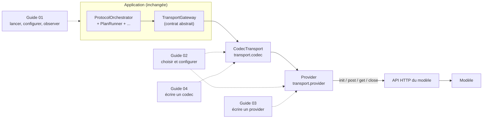

# Guides pratiques

Les ADR disent *pourquoi* et les guides de phase disent *comment c'est construit*. Les guides de ce dossier disent **comment s'en servir** : installer et lancer l'application, la brancher sur un vrai modèle, et écrire ce qu'il manque quand la configuration ne suffit pas. Chaque guide est autonome, se lit dans l'ordre ci-dessous, et tout ce qu'il affirme est tenu par un test du dépôt.

| Guide | Pour qui | Question à laquelle il répond |
|---|---|---|
| [01 — Prendre en main l'application](01-prise-en-main.md) | tout le monde | Comment installer, configurer, lancer une session sur le modèle simulé, suivre en direct, lire ce qui s'est passé ? |
| [02 — Brancher un modèle](02-brancher-un-modele.md) | l'intégrateur | Comment décrire les quatre requêtes (init, post, get, close) et la forme des réponses d'un modèle réel **sans écrire de code** ; quand faut-il en écrire ? |
| [03 — Écrire un provider de transport](03-ecrire-un-provider.md) | le développeur | Comment implémenter le contrat HTTP d'une API que `templated_http` ne couvre pas (authentification calculée, formes de corps exotiques, filtrage d'événements…) ? |
| [04 — Écrire un codec de messages](04-ecrire-un-codec.md) | le développeur | Comment convertir la forme brute des réponses d'un modèle (texte, flux, appel d'outil, enveloppe maison) en messages du protocole, et inversement ? |

## Où se situe chaque guide

Le **provider** parle le dialecte HTTP de l'API (URL, en-têtes, authentification, forme des corps et des réponses) ; le **codec** parle la forme du modèle (texte avec du JSON dedans, objet *chat completion*, appel d'outil, fragments à recoller). Les deux se choisissent dans `config.toml` et l'orchestrateur ne connaît ni l'un ni l'autre : il ne voit que le contrat `TransportGateway`.

## L'exemple qui accompagne les guides

[`examples/acme_model_plugin/`](../../examples/acme_model_plugin/) est un provider **et** un codec écrits hors de l'application pour une API fictive (« ACME Threads », authentification par clé, corps et événements maison, modèle qui répond en fragments). [`examples/config.acme.toml`](../../examples/config.acme.toml) les sélectionne par leur chemin d'import. Les guides 03 et 04 les commentent ligne par ligne, et `tests/unit/test_phase7_examples_plugin.py` + `tests/integration/test_phase9_examples_plugin.py` (boucle complète jusqu'au `final_answer`) garantissent que le code cité reste exact.

## Références

- Contrat de transport ADR-004 et serveur mock : [docs/adr/ADR-004](../adr/ADR-004-contrat-de-transport.md)
- Providers enfichables : [ADR-020](../adr/ADR-020-transport-enfichable.md) · codecs : [ADR-021](../adr/ADR-021-codec-de-messages-par-modele.md)
- Conception du transport et des échecs : [architecture/05](../architecture/05-transport-and-failures.md)
- API et flux live : [ADR-018](../adr/ADR-018-api-pour-un-front-et-flux-live.md), [phases/phase-09-interfaces](../phases/phase-09-interfaces.md)
- README du paquet `transport` (carte des modules et points d'extension) : [src/agentic_local_app/transport/README.md](../../src/agentic_local_app/transport/README.md)
