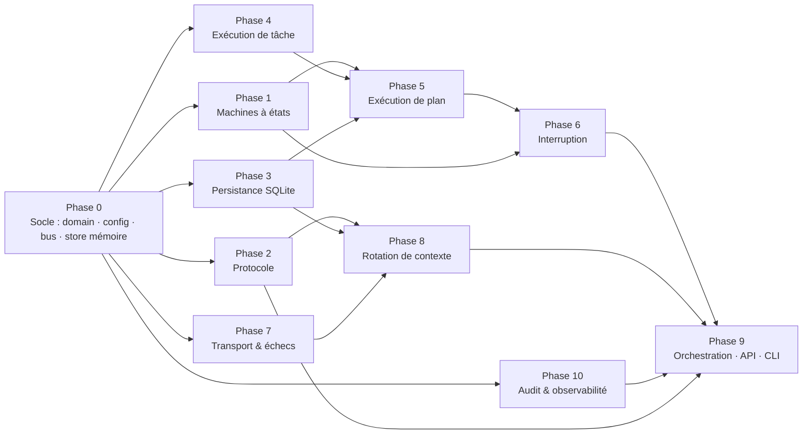

# Phases d'implémentation — feuille de route et état d'avancement

La spec impose dix phases testables, chacune fermée par une **gate** (suite de tests entièrement verte) avant d'ouvrir celles qui en dépendent (§18, §20). Chaque phase a son guide : objectif, périmètre, conception (diagrammes), invariants, plan de tests nommés `given_…_when_…_then_…`, étapes TDD, critères de gate, livrables.

## Ordre et dépendances

L'ordre de priorité de la spec (§20) est 1 → 3 → 2 → 4 → 5 → 6 → 7 → 8 → 10 → 9. Les dépendances réelles entre phases permettent de mener en **parallèle** celles qui ne dépendent que du socle (`domain`, `config`, `EventBus`, interface du store) ; la règle des gates reste entière : une phase n'est ouverte que lorsque **toutes** celles dont elle dépend sont vertes, et n'est déclarée close que lorsque sa propre suite est verte.

Vagues d'exécution :

| Vague | Phases | Condition d'ouverture |
|---|---|---|
| 0 | socle | — |
| 1 | 1, 3, 2, 4, 7, 10 (en parallèle) | socle vert |
| 2 | 5, 8 | 1 + 4 + 3 verts (pour 5) ; 2 + 3 + 7 verts (pour 8) |
| 3 | 6 | 5 vert |
| 4 | 9 | tout le reste vert |

## État d'avancement

| Phase | Guide | Composants | Gate | État |
|---|---|---|---|---|
| 0 — Socle | *(ce document)* | `domain`, `config`, `EventBus`, `InMemoryConversationStore` | `tests/unit/test_phase0_foundation.py` | ✅ vert |
| 1 — Machines à états | [phase-01](phase-01-state-machines.md) | `ConversationLifecycleManager`, tables de transitions | `pytest -m phase1` | ✅ vert — 521 tests |
| 2 — Protocole | [phase-02](phase-02-protocol.md) | `ProtocolAdapter`, schémas, instructions du protocole | `pytest -m phase2` | ✅ vert — 243 tests |
| 3 — Persistance | [phase-03](phase-03-persistence.md) | `SqliteConversationStore`, blobs, audit append-only | `pytest -m phase3` | ✅ vert — 405 tests |
| 4 — Exécution de tâche | [phase-04](phase-04-task-execution.md) | `CommandExecutor`, `PayloadGuard`, `ResultCollector` | `pytest -m phase4` | ✅ vert — 151 tests |
| 5 — Exécution de plan | [phase-05](phase-05-plan-execution.md) | `PlanRunner` | `pytest -m phase5` | ✅ vert — 107 tests |
| 6 — Interruption | [phase-06](phase-06-interruption.md) | `InterruptionHandler` | `pytest -m phase6` | ✅ vert — 48 tests |
| 7 — Transport & échecs | [phase-07](phase-07-transport-failures.md) | `TransportGateway`, `FailureManager`, `RetryController`, `CircuitBreaker`, serveur mock | `pytest -m phase7` | ✅ vert — 325 tests |
| 8 — Rotation de contexte | [phase-08](phase-08-context-rotation.md) | `ContextWindowMonitor`, `ContextReducer`, `RotationCoordinator` | `pytest -m phase8` | ✅ vert — 78 tests |
| 9 — Orchestration | [phase-09-orchestration](phase-09-orchestration.md) · [phase-09-interfaces](phase-09-interfaces.md) | `ProtocolOrchestrator`, `ConversationManager`, `RecoveryCoordinator`, API, CLI | `pytest -m phase9` | ✅ vert — 185 tests (68 orchestration + 117 API/CLI) |
| 10 — Audit & observabilité | [phase-10](phase-10-observability.md) | `AuditLog`, `ExecutionTracker`, `TelemetryService` | `pytest -m phase10` | ✅ vert — 73 tests |

## Discipline TDD appliquée à chaque phase

1. Écrire le fichier de tests de la phase (tous les cas du §18.2 plus ceux exigés par les ADR), les voir **échouer** (import manquant, `NotImplementedError`).
2. Implémenter le minimum pour faire passer un test à la fois, dans l'ordre du guide.
3. Refactorer sous tests verts ; `ruff check`, `ruff format`, `mypy --strict` verts.
4. Mettre à jour le guide de phase (section *Résultat*) et ce tableau ; commit `feat(phaseN): …`.
