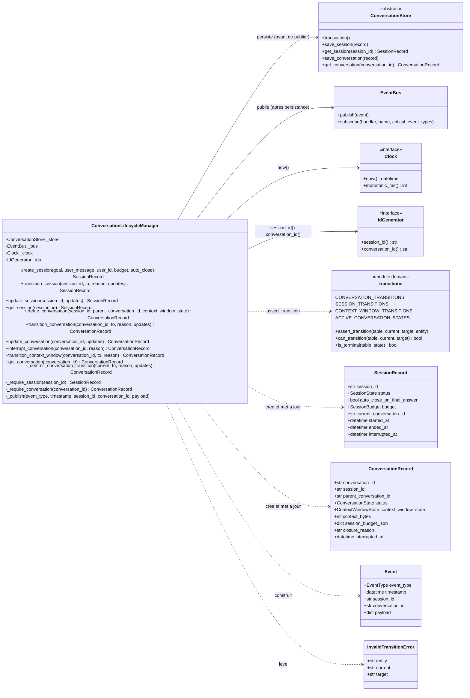
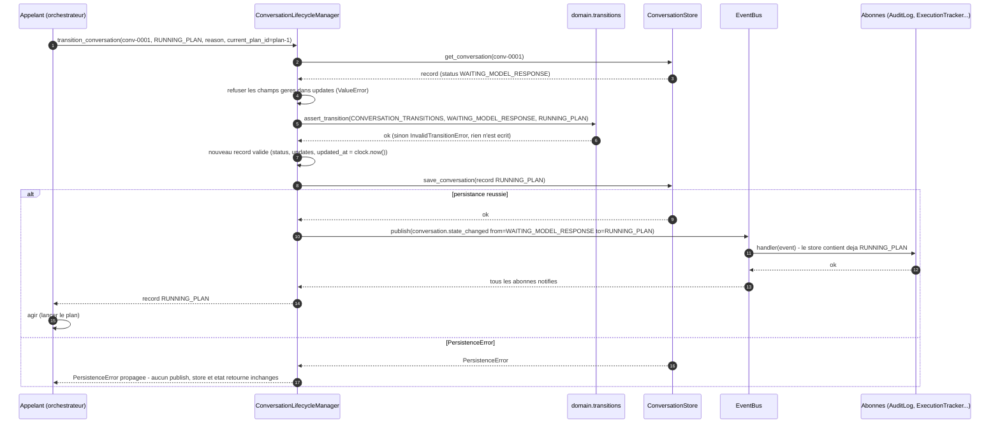
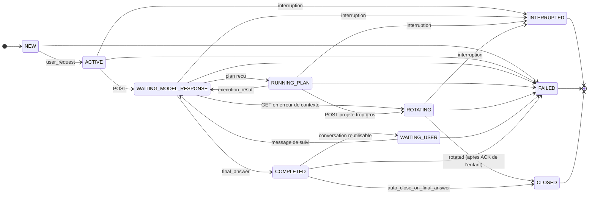
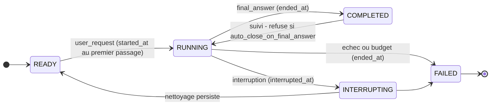
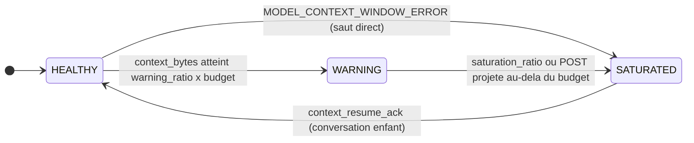
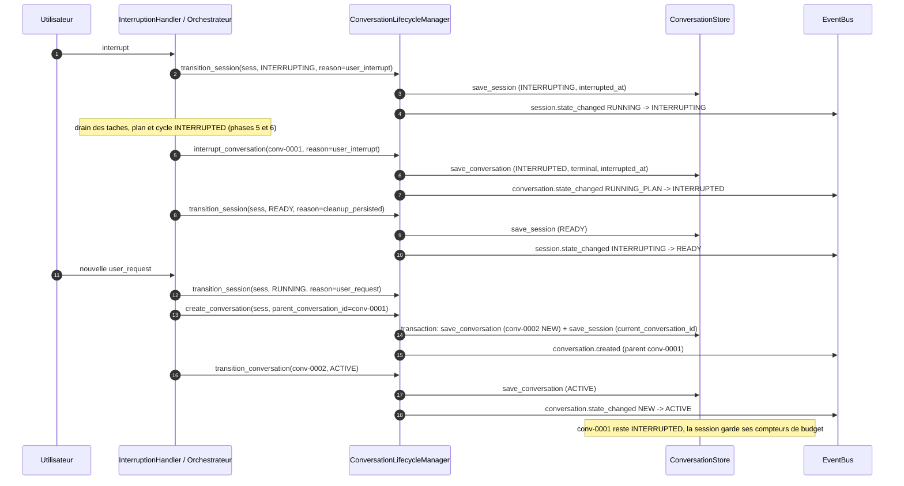

# Phase 1 — Machines à états

**Composants** : `domain/transitions.py` (tables, déjà livrées par le socle), `lifecycle/conversation_lifecycle.py` (`ConversationLifecycleManager`).
**Gate** : `pytest -m phase1` entièrement vert · `ruff check` · `ruff format --check` · `mypy --strict`.
**État** : ✅ vert — 521 tests (`tests/unit/test_phase1_state_machines.py`).

## 1. Objectif et périmètre

La spec fait des transitions d'état le socle du déterminisme (§17.1 : « toutes les transitions sont explicites, gérées par `ConversationLifecycleManager`, et persistées avant d'être exploitées »). Cette phase livre :

1. la **preuve exhaustive** que les sept tables de `domain/transitions.py` (`CONVERSATION`, `SESSION`, `PLAN`, `TASK`, `CYCLE`, `CONTEXT_WINDOW`, `CIRCUIT`) sont la seule source de vérité : chaque paire `(état courant, état cible)` du produit cartésien est un test identifiable, acceptée si elle est listée, rejetée par `InvalidTransitionError` sinon ;
2. le **`ConversationLifecycleManager`**, propriétaire unique des transitions de **session** (ADR-006, ADR-012) et de **conversation** (§5.1, ADR-007), ainsi que de la fenêtre de contexte portée par la conversation (§5.4, ADR-013), avec la discipline *valider → persister → publier → retourner* (ADR-015).

Hors périmètre : les machines à états de **plan**, **tâche** et **cycle** sont vérifiées ici au niveau des tables, mais leurs transitions sont appliquées par `PlanRunner` (phase 5) ; le disjoncteur par `CircuitBreaker` (phase 7) ; l'orchestration de l'interruption (drain, marquage des tâches) par `InterruptionHandler` (phase 6) ; le déclenchement effectif de la rotation par `ProtocolOrchestrator` (phases 8/9).

## 2. Prérequis

- Socle (phase 0) vert : `domain/states.py`, `domain/transitions.py`, `domain/models.py` (`SessionRecord`, `ConversationRecord`, `SessionBudget`), `domain/errors.py` (`InvalidTransitionError`, `PersistenceError`), `domain/events.py` (`EventType`, `Event`, `state_change_payload`), `domain/clock.py`, `domain/ids.py`.
- `persistence/interface.py` (`ConversationStore`, `transaction()`) et `persistence/memory.py` (`InMemoryConversationStore` avec le crochet `fail_next_write`).
- `observability/event_bus.py` (`EventBus` synchrone, `RecordingSubscriber`).
- Fixtures de `tests/conftest.py` : `clock` (`FakeClock`), `ids` (`SequentialIdGenerator`), `store`, `bus`, `recorder`.
- Décisions applicables : ADR-006 (INTERRUPTED terminal pour la conversation, READY au niveau session), ADR-007 (amendements des tables), ADR-012 (`SessionRecord`, budget), ADR-013 (fenêtre de contexte, saut direct HEALTHY → SATURATED), ADR-015 (persister avant publier), ADR-017 (horloge et identifiants injectés).

## 3. Conception

### 3.1 Le manager et ses dépendances

Choix de conception :

| Sujet | Décision | Motif |
|---|---|---|
| Source des transitions | Uniquement `assert_transition(table, current, to, entity=…)` ; aucune paire d'états codée dans le manager. La seule règle hors table est le refus de `COMPLETED → RUNNING` quand `auto_close_on_final_answer` est vrai (annoncé dans `transitions.py`, ADR-007). | §17.1, ADR-007 |
| Application des `updates` | `type(record).model_validate({**record.model_dump(), **changes})` — jamais `model_copy(update=…)`, qui ne valide rien (clé inconnue ou type erroné seraient persistés en silence). Champ inconnu ou type erroné → `ValueError` (`ValidationError` pydantic) **avant** toute écriture. | robustesse, §17.1 |
| Champs gérés | `status`, `context_window_state`, identifiants, `created_at`, `updated_at` sont refusés dans `**updates` (`ValueError`) : l'état ne change que par les méthodes `transition_*`. | §19.2 |
| Identifiant inconnu | `KeyError("unknown session: …")` / `KeyError("unknown conversation: …")` pour toute méthode d'écriture ; `get_session` / `get_conversation` renvoient `None`. | explicite et sans nouvelle exception dans `domain/errors.py` |
| Horodatages de session | `started_at` posé au **premier** passage `RUNNING` ; `ended_at` posé sur `COMPLETED` / `FAILED` et **remis à `None`** quand la session repasse `RUNNING` (suivi) ; `interrupted_at` posé sur `INTERRUPTING` et conservé au retour `READY` (audit). | ADR-012 (durée = `now − started_at`), ADR-006 |
| Horodatage de conversation | `interrupted_at` posé à l'entrée en `INTERRUPTED` (sauf valeur explicite dans `updates`, cas du `RecoveryCoordinator`). | §16, ADR-016 |
| Création de conversation | `status = NEW`, `auto_close_on_final_answer` et `session_budget_json` (snapshot du budget) copiés depuis la session ; `session.current_conversation_id` mis à jour dans la **même** `store.transaction()` ; le parent, s'il est donné, doit exister (`KeyError`) et appartenir à la même session (`ValueError`). | ADR-012, ADR-006, ADR-014 |
| Événements | `Event.timestamp` = le `clock.now()` persisté sur le record ; `session_id` toujours renseigné, `conversation_id` renseigné pour les événements de conversation (les événements de session n'en portent pas). Payloads : `session.created` → `{goal, budget}` ; `conversation.created` → `{parent_conversation_id, context_window_state}` ; `*.state_changed` → `state_change_payload(from, to, reason)` ; `context.window_state_changed` → idem + `context_bytes`. Les mises à jour sans changement d'état (`update_*`) ne publient rien. | ADR-015, ADR-018 |

### 3.2 Persister → publier → agir, et l'échec de persistance

La création d'une conversation suit le même schéma avec deux écritures groupées dans `store.transaction()` (la conversation puis la session mise à jour) : si la seconde échoue, la première est annulée et rien n'est publié (test `given_store_failing_on_session_write_when_conversation_created_then_nothing_persisted_and_no_event`).

### 3.3 Machine à états de conversation (§5.1 amendée, ADR-006 / ADR-007)

`ANY_ACTIVE_STATE` = {`ACTIVE`, `WAITING_MODEL_RESPONSE`, `RUNNING_PLAN`, `ROTATING`} (`ACTIVE_CONVERSATION_STATES`) ; `INTERRUPTED` n'est atteignable **que** depuis ces quatre états, `FAILED` depuis tout état non terminal. Terminaux : `INTERRUPTED`, `FAILED`, `CLOSED`. `ROTATING → WAITING_MODEL_RESPONSE` n'existe pas sur le parent : c'est l'enfant qui suit `NEW → ACTIVE → WAITING_MODEL_RESPONSE` (ADR-007).

### 3.4 Machine à états de session (ADR-006 / ADR-012)

### 3.5 Fenêtre de contexte (§5.4, ADR-013)

### 3.6 Interruption puis nouvelle demande (§9 amendé par ADR-006)

## 4. Invariants

1. **Une transition = une entrée de table.** Toute paire absente est rejetée par `InvalidTransitionError` (avec `entity`, `current`, `target` et l'erreur normalisée `SYSTEM_ERROR / INVALID_TRANSITION`), sans écriture ni événement.
2. **Valider → persister → publier → retourner.** Le store est écrit avant `bus.publish` ; un abonné qui lit le store pendant l'événement voit déjà le nouvel état. Une `PersistenceError` laisse le store, l'état retourné et le flux d'événements inchangés, et le manager reste utilisable ensuite.
3. **Aucun état critique uniquement en mémoire.** Le manager ne garde aucun cache : chaque méthode relit le record dans le store et retourne exactement ce qui vient d'être persisté (`store.get_*(id) == record retourné`).
4. **Déterminisme.** Tous les horodatages viennent de `Clock.now()` (record et événement portent la même valeur), tous les identifiants de `IdGenerator` ; le module ne référence ni `datetime.now`, ni `time.*`, ni `uuid`, ni `random` (test d'inspection du source).
5. **INTERRUPTED est terminal pour la conversation, READY appartient à la session.** Une nouvelle demande après interruption ouvre une nouvelle conversation, fille de l'interrompue, dans la même session (compteurs et `started_at` conservés).
6. **Le statut ne se modifie que par `transition_*`.** `update_*` refuse `status` (et `context_window_state`, identifiants, horodatages) ; les `updates` passés à `transition_*` sont écrits dans la même écriture que le changement d'état.
7. **Les événements sont minimaux et uniformes** : `state_change_payload(from, to, reason)` pour tout `*.state_changed`, `reason` absent du payload quand il n'est pas fourni.

## 5. Plan de tests

Fichier `tests/unit/test_phase1_state_machines.py`, marqueur `phase1`, nommage `given_<état>_when_<action>_then_<résultat>` (§18.4). Les tests paramétrés produisent un identifiant par paire (`conversation:NEW->ACTIVE`, …). Les mises en situation (« conversation en état X ») passent **par le manager** (chemin le plus court dans la table, calculé en ordre d'énumération pour rester déterministe).

### 5.1 Tables de transitions (`domain/transitions.py`)

| Test | Vérifie | Réf. |
|---|---|---|
| `given_transition_table_when_compared_to_its_enum_then_every_state_has_an_entry` (×7 tables) | chaque état de l'énumération a une entrée, cibles du bon type, pas d'auto-transition | §5, ADR-007 |
| `given_listed_pair_when_asserted_then_accepted_and_can_transition_true` (×60 paires) | toute paire listée passe `assert_transition` et `can_transition` vaut `True` | §5, ADR-007 |
| `given_unlisted_pair_when_asserted_then_invalid_transition_error_and_can_transition_false` (×229 paires) | toute paire absente lève `InvalidTransitionError` avec `entity/current/target` renseignés, `can_transition` vaut `False` | §5, §18.2, ADR-007 |
| `given_unlisted_pair_when_rejected_then_error_carries_normalized_system_error` | erreur normalisée `SYSTEM_ERROR / INVALID_TRANSITION`, non rejouable, `details` complets, message lisible | §6 |
| `given_each_table_when_is_terminal_evaluated_then_true_only_for_states_without_exit` (×7) | `is_terminal` ⇔ aucune transition sortante | §5 |
| `given_conversation_table_when_active_states_read_then_match_spec_any_active_state` | `ACTIVE_CONVERSATION_STATES` = {ACTIVE, WAITING_MODEL_RESPONSE, RUNNING_PLAN, ROTATING} | §5.1 |
| `given_conversation_table_when_terminal_states_read_then_interrupted_failed_closed` | `TERMINAL_CONVERSATION_STATES` = {INTERRUPTED, FAILED, CLOSED} et cohérent avec `is_terminal` | ADR-006, ADR-007 |
| `given_conversation_table_when_interrupted_target_checked_then_reachable_exactly_from_active_states` | INTERRUPTED atteignable exactement depuis ANY_ACTIVE_STATE | §5.1, §9 |
| `given_conversation_table_when_failed_target_checked_then_reachable_from_every_non_terminal_state` | ANY (non terminal) → FAILED | §5.1, ADR-007 |
| `given_conversation_table_when_adr007_amendments_checked_then_present` | WAITING_MODEL_RESPONSE → ROTATING et ROTATING → CLOSED ajoutées ; ROTATING → WAITING_MODEL_RESPONSE absente ; INTERRUPTED sans sortie ; pas d'état READY de conversation | ADR-006, ADR-007 |
| `given_session_table_when_adr006_flow_checked_then_interrupting_returns_to_ready` | RUNNING → INTERRUPTING → READY, COMPLETED → RUNNING listé, FAILED terminal | ADR-006 |
| `given_plan_and_task_tables_when_terminal_sets_read_then_equal_states_without_exit` | `TERMINAL_PLAN_STATES`, `TERMINAL_TASK_STATES` | §5.2, §5.3 |
| `given_task_table_when_failed_task_states_read_then_failed_and_timed_out` | `FAILED_TASK_STATES` = {FAILED, TIMED_OUT} ⊆ terminaux | ADR-008 |
| `given_plan_table_when_adr007_additions_checked_then_pending_can_fail_or_be_interrupted` | PENDING → FAILED, PENDING → INTERRUPTED | ADR-007 |
| `given_context_window_table_when_adr013_shortcut_checked_then_healthy_to_saturated_listed` | HEALTHY → SATURATED listée, WARNING → HEALTHY absente | §5.4, ADR-013 |

### 5.2 Sessions (`ConversationLifecycleManager`)

| Test | Vérifie | Réf. |
|---|---|---|
| `given_no_session_when_created_then_ready_record_persisted_and_created_event_published` | READY, champs copiés, `created_at = updated_at = clock.now()`, persistée, `session.created` `{goal, budget}` | ADR-012, ADR-015 |
| `given_store_failing_when_session_created_then_persistence_error_nothing_stored_no_event` | échec du store à la création : rien stocké, rien publié | ADR-015 |
| `given_ready_session_when_started_then_running_with_started_at_and_state_changed_event` | READY → RUNNING, `started_at`, événement `from/to/reason`, `timestamp = clock.now()` | ADR-006, ADR-012 |
| `given_running_session_when_completed_then_ended_at_set` · `…_when_failed_then_ended_at_set` | `ended_at` posé, `started_at` conservé | ADR-012 |
| `given_running_session_when_interrupting_then_interrupted_at_set_and_ended_at_untouched` | `interrupted_at` posé sur INTERRUPTING | ADR-006 |
| `given_interrupting_session_when_reset_then_ready_and_event_from_interrupting_to_ready` | INTERRUPTING → READY (« reset » de §18.2), `interrupted_at` conservé | §9, §18.2, ADR-006 |
| `given_completed_session_with_auto_close_when_follow_up_then_rejected` | COMPLETED → RUNNING refusé si `auto_close_on_final_answer`, sans écriture ni événement | §11, ADR-007 |
| `given_completed_session_without_auto_close_when_follow_up_then_running` | COMPLETED → RUNNING accepté, `started_at` inchangé, `ended_at` remis à `None` | §11, ADR-007 |
| `given_session_in_each_state_when_listed_transition_applied_then_persisted_and_event_exact` (×7) | chaque transition valide via le manager : persistée, événement `from/to` exact | §18.2 |
| `given_session_in_each_state_when_unlisted_transition_attempted_then_rejected_without_write_or_event` (×18) | chaque transition invalide rejetée, aucune écriture, aucun événement | §18.2 |
| `given_running_session_when_transitioned_with_updates_then_fields_applied_in_same_write` | `**updates` (`last_failure_id`, `consumed_cycles`) écrits avec l'état | ADR-012 |
| `given_session_when_transition_receives_status_in_updates_then_value_error_and_nothing_written` | `status` refusé dans `updates` | §19.2 |
| `given_session_when_updated_then_fields_changed_updated_at_refreshed_and_no_event` | `update_session` : champs, `updated_at`, aucun événement | ADR-012 |
| `given_session_when_update_contains_forbidden_field_then_value_error_and_nothing_written` (×5) | `status`, `created_at`, `updated_at`, champ inconnu, type erroné → `ValueError` | §17.1 |
| `given_unknown_session_id_when_session_method_called_then_key_error_and_no_event` (×3) · `given_unknown_session_id_when_get_session_then_none` | id inconnu → `KeyError` ; `get_session` → `None` | — |

### 5.3 Conversations

| Test | Vérifie | Réf. |
|---|---|---|
| `given_ready_session_when_conversation_created_then_new_record_with_session_snapshot_and_event` | NEW, `auto_close` et `session_budget_json` copiés, HEALTHY, `conversation.created` `{parent_conversation_id, context_window_state}` | §16, ADR-012 |
| `given_session_with_auto_close_when_conversation_created_then_flag_copied` | copie du drapeau | §2.7 |
| `given_conversation_created_when_session_read_then_current_conversation_id_points_to_it` | `session.current_conversation_id` suit chaque création, ordre de `list_conversations` | ADR-012 |
| `given_existing_conversation_when_child_created_then_parent_linked_and_context_state_inherited` | `parent_conversation_id`, état de fenêtre hérité (SATURATED) | ADR-006, ADR-014 |
| `given_unknown_parent_when_conversation_created_then_key_error_and_nothing_written` · `given_parent_from_other_session_when_conversation_created_then_value_error_and_nothing_written` | filiation contrôlée | ADR-006 |
| `given_store_failing_on_session_write_when_conversation_created_then_nothing_persisted_and_no_event` | atomicité de `store.transaction()` : la conversation écrite en premier est annulée | ADR-015 |
| `given_conversation_in_each_state_when_listed_transition_applied_then_persisted_and_event_exact` (×22) | chaque transition valide via le manager : `updated_at`, `created_at` conservé, persistée, événement `from/to/reason` exact avec `session_id`/`conversation_id` | §18.2, ADR-015 |
| `given_conversation_in_each_state_when_unlisted_transition_attempted_then_rejected_without_write_or_event` (×78) | chaque transition invalide rejetée sans écriture ni événement | §18.2 |
| `given_transition_without_reason_when_published_then_payload_has_no_reason_key` | payload `{from, to}` seul | ADR-015 |
| `given_waiting_model_response_when_running_plan_with_updates_then_fields_written_in_same_record` | `current_plan_id`, `current_cycle_id`, `remote_conversation_id`, `last_completed_plan_id`… dans la même écriture ; champs non cités conservés | §16 |
| `given_conversation_when_transition_receives_forbidden_update_then_value_error_and_nothing_written` (×7) | `status`, `context_window_state`, `session_id`, horodatages, champ inconnu, type erroné refusés | §19.2 |
| `given_active_conversation_when_transitioned_to_interrupted_then_interrupted_at_set` · `…_elsewhere_then_interrupted_at_stays_none` | `interrupted_at` uniquement pour INTERRUPTED | §16 |
| `given_each_active_state_when_user_interrupts_then_conversation_interrupted_with_reason` (×4) | interruption depuis ACTIVE, WAITING_MODEL_RESPONSE, RUNNING_PLAN, ROTATING → INTERRUPTED terminal, `reason` dans le payload | §9, §18.2 |
| `given_each_non_active_state_when_user_interrupts_then_rejected_without_write_or_event` (×6) | refus depuis NEW, WAITING_USER, INTERRUPTED, COMPLETED, FAILED, CLOSED | §5.1 |
| `given_store_failing_when_transition_attempted_then_state_unchanged_and_no_event_published` | test nominatif ADR-015 (+ manager réutilisable ensuite) | ADR-015 |
| `given_store_failing_when_session_transition_attempted_…` · `…_when_interrupt_attempted_…` · `…_when_update_attempted_then_state_unchanged` · `…_when_window_transition_attempted_…` | même garantie pour chaque chemin d'écriture | ADR-015 |
| `given_interrupted_session_when_new_user_request_then_new_conversation_becomes_active` | RUNNING → INTERRUPTING → READY → RUNNING ; ancienne conversation INTERRUPTED ; nouvelle NEW → ACTIVE avec `parent_conversation_id` ; `current_conversation_id` mis à jour ; ordre des événements | §9, §18.2, §18.4, ADR-006 |
| `given_conversation_when_updated_then_fields_changed_updated_at_refreshed_and_no_event` | `update_conversation` (`context_bytes`, `remote_conversation_id`, `get_cursor`, …), aucun événement | ADR-013 |
| `given_conversation_when_update_contains_forbidden_field_then_value_error_and_nothing_written` (×5) | champs gérés, champ inconnu, type erroné | §19.2 |
| `given_unknown_conversation_id_when_conversation_method_called_then_key_error_and_no_event` (×4) · `given_unknown_conversation_id_when_get_conversation_then_none` | id inconnu | — |

### 5.4 Fenêtre de contexte

| Test | Vérifie | Réf. |
|---|---|---|
| `given_healthy_window_when_warning_then_saturated_then_healthy_then_each_step_persisted_and_published` | HEALTHY → WARNING → SATURATED → HEALTHY, statut de conversation inchangé, payload `from/to/reason/context_bytes` | §5.4, ADR-013 |
| `given_healthy_window_when_context_window_error_then_direct_saturated` | saut direct HEALTHY → SATURATED | ADR-013 |
| `given_warning_window_when_healthy_requested_then_rejected_without_write_or_event` | WARNING → HEALTHY rejeté (`entity = context_window`) | §5.4 |
| `given_window_in_each_state_when_unlisted_transition_attempted_then_rejected` (×5) | toutes les paires absentes via le manager | §5.4 |

### 5.5 Ordre, déterminisme, scénarios

| Test | Vérifie | Réf. |
|---|---|---|
| `given_new_conversation_when_driven_to_running_plan_then_events_published_in_exact_order` | `session.created`, `conversation.created`, puis NEW→ACTIVE, ACTIVE→WAITING_MODEL_RESPONSE, WAITING_MODEL_RESPONSE→RUNNING_PLAN, ids portés | ADR-015 |
| `given_subscriber_reading_store_when_state_changed_event_received_then_new_state_already_persisted` | persister **avant** publier, observé depuis un abonné | ADR-015, §17.1 |
| `given_advanced_clock_when_transition_applied_then_timestamps_follow_the_injected_clock` | `updated_at` et `Event.timestamp` = `FakeClock.now()`, `created_at` conservé | ADR-017 |
| `given_sequential_ids_when_sessions_and_conversations_created_then_ids_deterministic` | `sess-0001`, `conv-0001`… | ADR-017 |
| `given_running_plan_when_rotation_scenario_played_then_parent_closed_and_child_healthy` | parent ROTATING → CLOSED (`closure_reason = rotated`), enfant SATURATED → HEALTHY, filiation, session pointant sur l'enfant | §10, ADR-014 |
| `given_waiting_model_response_when_final_answer_then_completed_then_closed_or_reusable` (×2) | §11 : CLOSED si `auto_close`, sinon WAITING_USER → WAITING_MODEL_RESPONSE et session COMPLETED → RUNNING | §11 |
| `given_lifecycle_source_when_inspected_then_no_wall_clock_or_randomness_used` | aucun `datetime.now` / `time.*` / `uuid` / `random` dans le module | ADR-017 |

## 6. Étapes TDD suivies

1. Lecture du socle (`domain/*`, `persistence/*`, `observability/event_bus.py`, `conftest.py`, tests de phase 0) et des textes de référence (§5, §9, §17.1, §18.2, ADR-006/007/012/013/015/017, module map §3).
2. Vérification d'un point de conception avant d'écrire : `model_copy(update=…)` de pydantic n'effectue **aucune** validation (clé inconnue et type erroné acceptés) → choix de `model_validate` sur le dump du record.
3. **Rouge** : écriture du fichier de tests complet (521 cas), exécution → `ModuleNotFoundError: agentic_local_app.lifecycle`.
4. **Vert** : `lifecycle/__init__.py` et `lifecycle/conversation_lifecycle.py` minimaux → 518 verts, 3 échecs. Les trois échecs étaient des défauts des tests eux-mêmes (passer `session_id=` / `conversation_id=` dans `**updates` déclenche un `TypeError` de Python avant le manager : la clé primaire est inatteignable par construction) → cas retirés au profit de cas atteignables (`session_id` sur une conversation, types erronés) → 521 verts.
5. **Refactor** sous tests verts : extraction de `_commit_conversation_transition` (une seule lecture du record dans `interrupt_conversation`, chemin persister → publier partagé) ; `ruff format`, `ruff check`, `mypy --strict` verts ; suite complète `pytest -q` verte.
6. Rédaction de ce guide et validation des diagrammes Mermaid.

## 7. Gate

| Contrôle | Commande | Résultat |
|---|---|---|
| Tests de la phase | `.venv/bin/pytest -q -m phase1` | 540 verts (521 phase 1 + 19 du fichier de phase 0, marqué `phase1`) |
| Suite complète | `.venv/bin/pytest -q` | 540 verts |
| Lint | `.venv/bin/ruff check src tests` | ✅ |
| Format | `.venv/bin/ruff format --check src tests` | ✅ |
| Types | `.venv/bin/mypy` (strict, tout le paquet) | ✅ |
| Diagrammes | `check_mermaid.py docs/phases/phase-01-state-machines.md` | tous rendus |

## 8. Résultat

- **521 tests** dans `tests/unit/test_phase1_state_machines.py` (≈ 0,6 s) : 289 paires exhaustives sur les 7 tables (60 listées, 229 absentes) + 25 tests structurels sur les tables + 207 tests du manager (46 sessions, 144 conversations, 9 fenêtre de contexte, 8 ordre/déterminisme/scénarios — dont 22 transitions de conversation valides et 78 invalides via le manager, 7 et 18 pour la session, 4 interruptions acceptées et 6 refusées, 7 tests d'échec de persistance, scénarios ADR-006 / ADR-014 / §11).
- Fichiers livrés : `src/agentic_local_app/lifecycle/__init__.py`, `src/agentic_local_app/lifecycle/conversation_lifecycle.py`, `tests/unit/test_phase1_state_machines.py`, ce guide.
- Exigences couvertes : §5.1–§5.4 (tables), §9 (interruption depuis chaque état actif, reset au niveau session), §11 (politique de réponse finale au niveau session), §17.1 (transitions explicites, persistées avant d'être exploitées, aucun état critique en mémoire), §18.2 Phase 1 (toutes les puces), §18.4 (nommage), ADR-006, ADR-007, ADR-012, ADR-013, ADR-015 (test nominatif), ADR-017.

## 9. Points ouverts

1. **Fixture `lifecycle` commune.** Le module map (§4) la liste dans `tests/conftest.py` ; elle n'y est pas et `conftest.py` est hors périmètre de cette phase : elle est définie localement dans le fichier de tests. À ajouter dans `conftest.py` (`ConversationLifecycleManager(store=store, bus=bus, clock=clock, ids=ids)`) pour les phases 5, 6 et 9.
2. **Abonné critique en échec.** Si l'`AuditLog` (abonné `critical`, phase 10) lève pendant `publish`, l'exception remonte à l'appelant **après** la persistance de la transition : l'état est déjà écrit mais l'événement n'est pas chaîné. C'est le comportement voulu par ADR-015 (l'audit fait partie de l'état critique) ; la politique de reprise correspondante (`RecoveryCoordinator`) appartient aux phases 9/10.
3. **`transition_context_window` sans `**updates`.** Signature volontairement conforme à l'énoncé ; `context_bytes` se met à jour par `update_conversation(...)` avant la transition (deux écritures). Si la phase 8 préfère une seule écriture, ajouter `**updates` est trivial et compatible.
4. **Événements de session sans `conversation_id`.** Choix de minimalisme ; si l'`ExecutionTracker` (phase 10) veut corréler, il lit `session.current_conversation_id` dans le store.
5. **Politique `auto_close` au niveau conversation.** Le manager refuse le suivi de **session** (`COMPLETED → RUNNING`) quand `auto_close_on_final_answer` est vrai, mais laisse `COMPLETED → WAITING_USER` possible sur la conversation : l'orchestrateur (phase 9) est responsable de choisir `CLOSED` dans ce cas (§11).
6. **Documents référencés absents.** `docs/architecture/01-state-machines.md` est cité par `domain/errors.py` et ADR-007 mais n'existe pas encore ; les diagrammes §3.3–§3.5 de ce guide peuvent servir de base.
