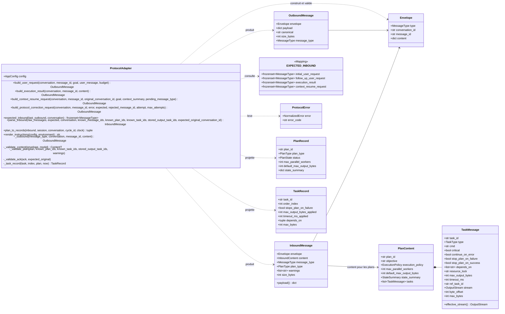
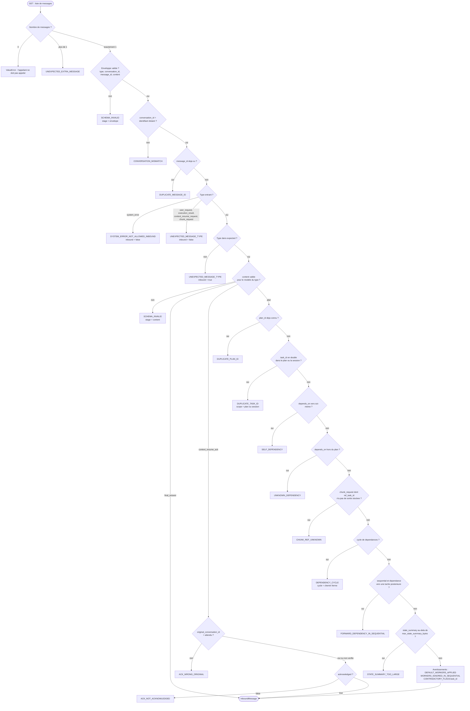
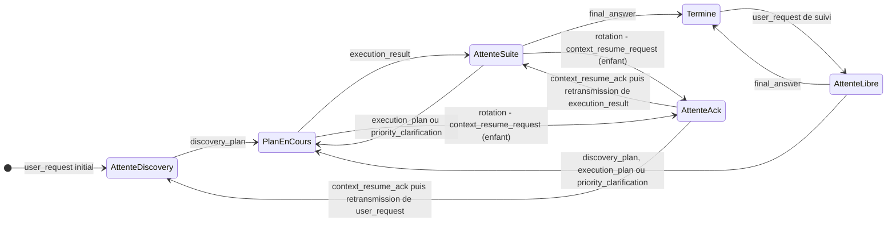

# Phase 2 — Protocole

**Composants** : `protocol/messages.py` (schémas pydantic, livrés par le socle, étendus de façon additive uniquement), `protocol/adapter.py` (`ProtocolAdapter`, `EXPECTED_INBOUND`, `OutboundMessage`, `InboundMessage`), `protocol/PROTOCOL_INSTRUCTIONS.md` (texte envoyé au modèle à l'init, ADR-004).
**Gate** : `pytest -m phase2` entièrement vert · `ruff check` · `ruff format --check` · `mypy --strict`.
**État** : ✅ vert — 243 tests (`tests/unit/test_phase2_protocol.py`).

## 1. Objectif et périmètre

Le `ProtocolAdapter` est la frontière entre le modèle et l'application (§3.5) : il « construit les messages sortants, analyse les messages entrants, valide la conformité au protocole et rejette les réponses malformées ou non déterministes ». Cette phase livre :

1. la **construction** des messages sortants — `user_request` (§12.1), `execution_result` (§12.5), `context_resume_request` (§12.8 + `pending_message_type` d'ADR-014), et `protocol_correction_request` (ADR-023, hors §12 : la faute citée au modèle, les types valides à cet instant, un rappel engendré depuis les modèles de contenu et un exemple minimal valide, le tout ramené sous `payload.max_message_bytes`) — en JSON canonique (ADR-017), les trois premiers comparés à l'octet près aux exemples de la spec ;
2. la **table des messages attendus** d'ADR-007 (`EXPECTED_INBOUND`) : quel type le modèle a le droit d'envoyer après chaque message sortant ;
3. l'**analyse et la validation** de chaque message entrant : enveloppe, direction, attente, schéma du contenu, puis règles structurelles d'ADR-007 (unicité, dépendances, `chunk_request`), borne du `state_summary` d'ADR-005 — chaque violation étant une `ProtocolError` (`MODEL_PROTOCOL_ERROR`, non rejouable) avec un code et des `details` explicites, sérialisables en JSON ;
4. la **projection** d'un plan accepté en `PlanRecord` / `TaskRecord` `PENDING`, avec les valeurs effectives d'ADR-008 (timeouts), ADR-009 (drapeaux, règle d'arrêt), ADR-010 (budgets de sortie) et ADR-011 (champs de `chunk_request`) ;
5. les **instructions du protocole** (anglais, destinées au modèle), rendues avec les valeurs de configuration.

Hors périmètre : le transport (phase 7), la troncature effective et le service des chunks (`PayloadGuard`, phase 4), la construction de l'`ExecutionResultContent` (`ResultCollector`, phase 4), le résumé de rotation (`ContextReducer`, phase 8), la boucle qui enchaîne ces appels (`ProtocolOrchestrator`, phase 9). L'adaptateur ne persiste rien, ne publie rien et ne connaît ni horloge ni générateur d'identifiants : `message_id` est fourni par l'appelant, `plan_to_records` reçoit la `Clock`.

## 2. Prérequis

- Socle (phase 0) vert : `domain/states.py` (`MessageType`, `PLAN_MESSAGE_TYPES`, `INBOUND_MESSAGE_TYPES`, `OUTBOUND_MESSAGE_TYPES`, `plan_type_for_message`), `domain/models.py` (`ConversationRecord`, `MessageRecord`, `SessionRecord`, `PlanRecord`, `TaskRecord`, `SessionBudget`), `domain/errors.py` (`ProtocolError`), `domain/canonical.py` (`canonical_json`, `size_bytes`), `domain/clock.py`, `domain/ids.py`, `config.py` (sections `payload` et `execution`).
- `protocol/messages.py` : schémas de tous les messages, validés sur les dix exemples de §12 (test de non-régression inclus dans cette phase).
- Fixtures de `tests/conftest.py` : `config`, `clock`, `ids`.
- Décisions applicables : ADR-004 (bootstrap du protocole par `instructions`), ADR-005 (`state_summary`), ADR-007 (table des messages attendus, validation structurelle, `system_error` interne, `chunk_request` type de tâche), ADR-008 (`timeout_ms`), ADR-009 (drapeaux et défauts), ADR-010 (limites de payload), ADR-011 (troncature, `stream`, plages), ADR-014 (`pending_message_type`, retransmission), ADR-017 (sérialisation canonique, identifiants injectés).

## 3. Conception

### 3.1 Classes et objets-valeurs



`InboundContent = PlanContent | FinalAnswerContent | ContextResumeAckContent`. `OutboundMessage` et `InboundMessage` sont des dataclasses gelées ; `InboundMessage.payload` (propriété) redonne le message tel que reçu pour le `MessageRecord` et le compte d'octets de contexte (ADR-013).

Choix de conception :

| Sujet | Décision | Motif |
|---|---|---|
| `conversation_id` sortant | `conversation.remote_conversation_id`, repli sur `conversation.conversation_id` s'il est `None` (avant l'init distant). Le contrôle `CONVERSATION_MISMATCH` utilise la même règle. | ADR-004 : l'identifiant vu par le modèle est celui du serveur distant |
| Payload sortant | Exactement `Envelope.model_dump(mode="json")` avec `content = modele.model_dump(mode="json", exclude_none=True)`. Deux différences visibles avec le texte de §12.5, toutes deux documentées dans les instructions : `stop_reason: null` est **omis** (absence = pas d'arrêt), et `timed_out: false` **apparaît** dans chaque résultat de tâche (booléen non nul d'ADR-008). Le `context_summary` (dict libre) est transmis **verbatim**, `exclude_none` ne s'appliquant qu'aux champs de modèles. | §12, ADR-008, ADR-017 |
| Taille | `size_bytes = len(canonical.encode("utf-8"))`, identique à `domain.canonical.size_bytes(payload)` ; côté entrant, `size_bytes(raw)` sur le message reçu. | ADR-010, ADR-013 |
| Un message par tour | `parse_inbound` reçoit la **liste** lue par un GET : vide → `ValueError` (bug d'appel, l'orchestrateur ne doit pas appeler) ; plusieurs → `UNEXPECTED_EXTRA_MESSAGE` avec les `message_id` et `type` lus. | ADR-007 |
| Ordre des contrôles | Fixe et documenté (§3.2) : le premier défaut rencontré donne le code. L'enveloppe est vérifiée avant le contenu ; la direction du type avant l'attente ; les règles par tâche dans l'ordre de déclaration ; le cycle avant la dépendance avant (un cycle en `sequential` est donc `DEPENDENCY_CYCLE`, diagnostic plus fondamental). | déterminisme, §17.1 |
| `system_error` entrant | Code dédié `SYSTEM_ERROR_NOT_ALLOWED_INBOUND` (`inbound = false`) : le type est interne et sa réception signale une tentative d'injection ; les autres types non entrants (`user_request`, `execution_result`, `context_resume_request`, `chunk_request` en tant que message) → `UNEXPECTED_MESSAGE_TYPE` avec `inbound = false`. | ADR-007 |
| `details` des erreurs | Uniquement des scalaires, listes et dicts JSON ; les erreurs pydantic sont réduites à `{loc, type, msg}` (`loc` pointé, préfixé `content.` pour le contenu) pour rester persistables dans un `FailureRecord` et l'audit. | §16, ADR-017 |
| `CHUNK_REF_UNKNOWN` | `ref_task_id` doit appartenir à `stored_output_task_ids` **seulement** : une tâche du plan courant n'a pas encore de sortie. | ADR-007 (validation structurelle) — voir point ouvert 2 |
| Borne du `state_summary` | `size_bytes(state_summary.model_dump(mode="json"))` comparée à `payload.max_state_summary_bytes` ; c'est ce même dump qui est persisté dans `PlanRecord.state_summary`, donc la valeur mesurée et la valeur stockée coïncident. | ADR-005 |
| Avertissements | `warnings` (liste, jamais une erreur) : `DEFAULT_WORKERS_APPLIED` (parallel sans `max_parallel_workers`), `CONTRADICTORY_FLAGS:<task_id>` (`critical` et `continue_on_error` vrais, ADR-009), `WORKERS_IGNORED_IN_SEQUENTIAL` (ajout : `max_parallel_workers ≠ 1` déclaré en `sequential`). | ADR-009 |
| Budgets effectifs | `max_output_bytes_applied = min(task ?? plan.default ?? payload.default, payload.hard_max)` ; `timeout_ms_applied = min(task.timeout_ms ?? execution.default, execution.max)`. Les valeurs déclarées sont conservées telles quelles (`max_output_bytes`, `timeout_ms`) pour l'audit. | ADR-008, ADR-010 |
| `chunk_request` projetée | `max_bytes = min(task.max_bytes, hard_max[, task.max_output_bytes si déclaré])` (ADR-011), et `max_output_bytes_applied = max_bytes` (un seul nombre gouverne la taille de `data`) ; `stream` effectif (`stdout` par défaut) ; `timeout_ms_applied = None` (lecture locale sans timeout, ADR-008 §5). | ADR-008, ADR-011 |
| Règle d'arrêt | `stops_plan_on_failure = critical or stop_plan_on_failure or not continue_on_error`, drapeaux absents → `False`, calculée une fois et persistée. | ADR-009 |
| Table des attendus | `EXPECTED_INBOUND` est un `MappingProxyType` (immuable) indexé par `OutboundSituation` (quatre lignes) ; `situation_for(last_outbound, conversation)` classe le dernier message sortant (`user_request` initial ou de suivi selon `conversation.final_answer_received`) et refuse (`ValueError`) un `MessageRecord` entrant. | ADR-007 |
| Instructions | Fichier lu via `importlib.resources` (embarqué dans la roue), mis en cache ; les placeholders `{nom}` sont remplacés par regex (les accolades des exemples JSON ne sont pas touchées) ; un placeholder inconnu lève `ValueError`. Depuis ADR-030 §3 le gabarit porte aussi l'annonce de l'environnement (`{environment_os}`, `{environment_shell}`, `{environment_shell_source}`, `{environment_dialect}`, `{environment_dialect_hint}`, `{environment_cwd}`) et la règle de traduction (`{translation_rule}`). | ADR-004, ADR-030 |
| Déterminisme | Aucun appel à `datetime.now`, `time.*`, `uuid`, `random` (test d'inspection du source) ; les constructions sont pures. `render_instructions` l'est aussi **à environnement donné** : c'est la seule fonction de l'adaptateur qui touche au système (`shutil.which`, pour annoncer le shell), et l'appelant peut lui passer l'`ExecutionEnvironment` pour la rendre totalement pure. | ADR-017, ADR-030 |

### 3.2 Validation d'un message entrant



Les contrôles par tâche (`DUPLICATE_TASK_ID`, `SELF_DEPENDENCY`, `UNKNOWN_DEPENDENCY`, `CHUNK_REF_UNKNOWN`) parcourent les tâches dans l'ordre de déclaration ; le premier défaut rencontré est rapporté. Le cycle est cherché par un parcours en profondeur déterministe (ordre de déclaration) et rapporté comme chemin fermé, par exemple `["t1", "t3", "t2", "t1"]`.

### 3.3 Grammaire du protocole (§2.2 amendée par ADR-007 et ADR-014)



Chaque état d'attente correspond à une ligne de `EXPECTED_INBOUND` : `AttenteDiscovery` → `initial_user_request`, `AttenteLibre` → `follow_up_user_request`, `AttenteSuite` → `execution_result`, `AttenteAck` → `context_resume_request`. Après l'ACK, l'application **retransmet** le message en attente dans la conversation enfant (nouveau `message_id`, ADR-014) et la ligne applicable redevient celle de ce message.

## 4. Table des messages attendus (ADR-007)

| `OutboundSituation` | Dernier message sortant | Condition | Types entrants autorisés |
|---|---|---|---|
| `initial_user_request` | `user_request` | `conversation.final_answer_received = False` | `discovery_plan` ; `user_response` si `protocol.allow_direct_response` (ADR-022, défaut `true`) |
| `follow_up_user_request` | `user_request` | `conversation.final_answer_received = True` (conclu par un `final_answer` ou un `user_response`) | `discovery_plan`, `execution_plan`, `priority_clarification`, `final_answer`, `user_response` |
| `execution_result` | `execution_result` | — | `execution_plan`, `priority_clarification`, `final_answer`, `user_response` |
| `context_resume_request` | `context_resume_request` | — | `context_resume_ack` |
| *(aucun)* | `last_outbound = None` | rien n'est en attente | ∅ — tout message reçu est `UNEXPECTED_MESSAGE_TYPE` |

Exactement un message par tour ; `system_error`, `user_request`, `execution_result`, `context_resume_request`, `protocol_correction_request` et `chunk_request` ne sont jamais des messages entrants. Un `protocol_correction_request` (ADR-023) n'ajoute par ailleurs **aucune ligne** à la table : il redemande le message déjà attendu, si bien que `situation_for` se lit sur le dernier message sortant **substantiel** (`last_substantive_outbound`, qui saute les corrections et les rejets qu'elles corrigent) et qu'une réponse à une correction est validée contre la ligne qui était pendante avant la faute. La table de base `EXPECTED_INBOUND` garde la ligne initiale stricte de §14 ; `expected_inbound_for(situation, allow_direct_response=…)` y applique le drapeau d'ADR-022, que `ProtocolAdapter.expected_inbound` lit dans sa configuration. Le contenu d'un `user_response` (`UserResponseContent` : `format`, `body` opaque non vide, `status`, `expects_reply`) n'a qu'une règle sémantique, la borne `USER_RESPONSE_TOO_LARGE` (`body` ≤ `payload.max_message_bytes` en UTF-8).

## 5. Catalogue des codes `ProtocolError`

Toutes ces erreurs portent `error_type = MODEL_PROTOCOL_ERROR`, `origin = "ProtocolAdapter"`, `retryable = False`, `recoverable = False` (§6, §7.2).

| Code | Cause | `details` |
|---|---|---|
| `UNEXPECTED_EXTRA_MESSAGE` | plus d'un message lu par le même GET | `expected = 1`, `received`, `message_ids`, `types` |
| `SCHEMA_INVALID` | enveloppe invalide (champ manquant, type inconnu, champ en trop, message non objet) ou contenu invalide pour le type (tâche `cmd` sans `cmd`, plan sans tâche, `max_output_bytes` / `timeout_ms` / `max_bytes` ≤ 0, `max_parallel_workers` < 1, champ inconnu, champ requis absent) | `stage` (`envelope` \| `content`), `message_type`, `message_id` (contenu), `errors = [{loc, type, msg}]` |
| `CONVERSATION_MISMATCH` | `conversation_id` ≠ identifiant distant de la conversation courante | `received`, `expected`, `message_id` |
| `DUPLICATE_MESSAGE_ID` | `message_id` déjà vu dans la session | `message_id` |
| `SYSTEM_ERROR_NOT_ALLOWED_INBOUND` | le modèle envoie un `system_error` (type interne) | `received`, `expected`, `inbound = false`, `message_id` |
| `UNEXPECTED_MESSAGE_TYPE` | type non entrant (`inbound = false`) ou type entrant hors de la table (`inbound = true`) | `received`, `expected` (liste triée), `inbound`, `message_id` |
| `DUPLICATE_PLAN_ID` | `plan_id` déjà connu dans la session | `plan_id` |
| `DUPLICATE_TASK_ID` | `task_id` répété dans le plan (`scope = plan`) ou déjà connu dans la session (`scope = session`) | `task_id`, `plan_id`, `scope` |
| `SELF_DEPENDENCY` | une tâche se liste dans son `depends_on` | `task_id`, `plan_id` |
| `UNKNOWN_DEPENDENCY` | `depends_on` référence une tâche absente du plan courant (même connue d'un plan antérieur) | `task_id`, `dependency`, `plan_id` |
| `CHUNK_REF_UNKNOWN` | `ref_task_id` d'une `chunk_request` sans sortie stockée | `task_id`, `ref_task_id`, `plan_id` |
| `DEPENDENCY_CYCLE` | cycle dans le graphe `depends_on` | `cycle` (chemin fermé), `plan_id` |
| `FORWARD_DEPENDENCY_IN_SEQUENTIAL` | en `sequential`, dépendance vers une tâche déclarée après | `task_id`, `dependency`, `plan_id`, `execution_policy` |
| `STATE_SUMMARY_TOO_LARGE` | dump du `state_summary` > `payload.max_state_summary_bytes` | `size_bytes`, `max_bytes`, `plan_id` |
| `ACK_WRONG_ORIGINAL` | `original_conversation_id` ≠ `expected_original_conversation_id` (quand fourni) | `received`, `expected` |
| `ACK_NOT_ACKNOWLEDGED` | `acknowledged = false` | `original_conversation_id` |

Hors erreurs : `ValueError` pour une liste vide, pour un `MessageRecord` entrant passé à `expected_inbound`, pour `plan_to_records` sur un message sans plan, pour un `message_id` vide à la construction, pour un placeholder inconnu dans les instructions.

## 6. Plan de tests

Fichier `tests/unit/test_phase2_protocol.py`, marqueur `phase2`, nommage `given_<état>_when_<action>_then_<résultat>` (§18.4). Les exemples de §12 sont **extraits de `docs/spec/SPEC-v1.1.md`** au chargement (regex sur les titres `### 12.x` et leurs blocs ```json), de sorte que les schémas ne peuvent pas dériver du texte de référence. Aucun réseau, shell ni base ; fixtures `config`, `clock`, `ids` de `conftest.py`.

### 6.1 Non-régression des schémas (11 tests)

| Test | Vérifie | Réf. |
|---|---|---|
| `given_spec_example_when_validated_against_schemas_then_accepted` (×10) | chaque exemple §12.1–§12.10 valide `Envelope` + modèle de contenu (extension additive de `messages.py`) | §12 |
| `given_spec_when_examples_loaded_then_all_ten_sections_of_paragraph_12_present` | l'extraction trouve exactement les dix sections | §12 |

### 6.2 Messages sortants (13 tests)

| Test | Vérifie | Réf. |
|---|---|---|
| `given_conversation_with_remote_id_when_user_request_built_then_canonical_json_equals_spec_12_1` | payload, canonique et taille identiques à §12.1 ; `conversation_id` = identifiant distant | §12.1, ADR-004, ADR-017 |
| `given_conversation_without_remote_id_when_user_request_built_then_local_id_used_as_fallback` | repli sur l'identifiant local | ADR-004 |
| `given_sequential_ids_when_user_request_built_then_message_id_reproducible` | `msg-0001`, `msg-0002`, chaîne canonique attendue à l'octet | ADR-017 |
| `given_unicode_goal_when_user_request_built_then_utf8_preserved_and_size_counts_bytes` | `ensure_ascii=False`, taille en octets UTF-8 | ADR-017 |
| `given_execution_result_content_when_built_then_canonical_json_equals_spec_12_5_modulo_adr_fields` | §12.5 modulo `stop_reason` omis et `timed_out` ajouté (documentés) | §12.5, ADR-008 |
| `given_execution_result_with_stop_reason_when_built_then_stop_reason_serialised` | `stop_reason`, `skipped_tasks` en objets `{task_id, reason}`, statut minuscule | ADR-009 |
| `given_truncated_result_with_ranges_when_built_then_adr011_fields_serialised_as_lists` | plages `[début, fin)` en listes, `max_output_bytes_applied` | ADR-010, ADR-011 |
| `given_child_conversation_when_context_resume_request_built_then_equals_spec_12_8_plus_pending` | §12.8 + `pending_message_type` | §12.8, ADR-014 |
| `given_pending_message_type_when_context_resume_request_built_then_type_value_carried` (×2) | valeur du type en attente | ADR-014 |
| `given_same_inputs_when_outbound_built_twice_then_byte_identical` · `given_outbound_message_when_canonical_parsed_then_round_trips_to_payload_and_envelope` | déterminisme, aller-retour canonique ↔ payload ↔ enveloppe | ADR-017 |
| `given_empty_message_id_when_outbound_built_then_value_error` | `message_id` vide refusé | §12 |

### 6.3 Analyse de chaque type entrant (16 tests)

| Test | Vérifie | Réf. |
|---|---|---|
| `given_spec_12_2_discovery_plan_when_parsed_after_initial_request_then_plan_content_typed` | `PlanContent`, `plan_type`, ordre des tâches, `depends_on`, `warnings = []`, `size_bytes`, `payload` | §12.2, ADR-007 |
| `given_spec_12_3_execution_plan_when_parsed_after_result_then_parallel_workers_kept` | `parallel`, `max_parallel_workers = 2` | §12.3 |
| `given_spec_12_4_priority_clarification_when_parsed_after_result_then_plan_type_clarification` | `PlanType.PRIORITY_CLARIFICATION` | §12.4 |
| `given_spec_12_6_chunk_request_plan_when_parsed_with_stored_output_then_chunk_task_typed` | tâche `chunk_request`, `stream` par défaut `stdout` | §12.6, ADR-011 |
| `given_spec_12_7_final_answer_when_parsed_after_result_then_final_answer_content_typed` · `given_final_answer_with_extra_fields_when_parsed_then_accepted_and_extras_kept` | `FinalAnswerContent`, `plan_type = None`, champs supplémentaires tolérés | §12.7 |
| `given_spec_12_9_ack_when_parsed_after_resume_request_then_ack_content_typed` · `given_ack_when_parsed_without_expected_original_then_original_not_checked` | `ContextResumeAckContent`, contrôle optionnel de l'original | §12.9, ADR-014 |
| `given_each_inbound_spec_example_when_parsed_then_envelope_and_type_match` (×6) | enveloppe et type de chaque exemple entrant | §12 |
| `given_plan_without_optional_flags_when_parsed_then_flags_none_and_no_warning` · `given_plan_with_adr_extensions_when_parsed_then_timeout_stream_default_and_summary_kept` | drapeaux absents = `None` dans le message ; `timeout_ms`, `stream`, `default_max_output_bytes`, `state_summary` (clés libres) | ADR-005, ADR-008, ADR-009, ADR-010, ADR-011 |

### 6.4 Rejets — un test par code (45 tests)

| Test | Vérifie | Réf. |
|---|---|---|
| `given_no_message_when_parsed_then_value_error_not_protocol_error` | liste vide → `ValueError` | ADR-007 |
| `given_two_messages_in_one_turn_when_parsed_then_unexpected_extra_message` | `UNEXPECTED_EXTRA_MESSAGE`, `message_ids`, `types` | ADR-007 |
| `given_envelope_missing_message_id_…` · `given_unknown_type_string_…` · `given_non_object_message_…` · `given_envelope_with_unknown_field_…` | `SCHEMA_INVALID` `stage = envelope`, `errors` `{loc, type, msg}` sérialisables | §12, §16 |
| `given_cmd_task_without_cmd_…` · `given_plan_without_tasks_…` · `given_non_positive_task_limit_…` (×2) · `given_chunk_task_with_non_positive_max_bytes_…` · `given_parallel_plan_with_zero_workers_…` · `given_content_with_unknown_field_…` · `given_ack_content_missing_field_…` · `given_final_answer_missing_diagnosis_…` | `SCHEMA_INVALID` `stage = content`, `loc` préfixé `content.` | §12, ADR-007 (« strictement positifs », « ≥ 1 ») |
| `given_final_answer_after_initial_request_when_parsed_then_unexpected_message_type` · `given_nothing_expected_when_any_message_parsed_then_unexpected_message_type` | `UNEXPECTED_MESSAGE_TYPE`, `expected` trié, `inbound = true` ; attente vide | ADR-007 |
| `given_message_for_other_conversation_when_parsed_then_conversation_mismatch` · `given_conversation_without_remote_id_when_message_addressed_to_local_id_then_accepted` | `CONVERSATION_MISMATCH` ; repli sur l'identifiant local | ADR-004, ADR-007 |
| `given_already_seen_message_id_…` · `given_already_seen_plan_id_…` | `DUPLICATE_MESSAGE_ID`, `DUPLICATE_PLAN_ID` | ADR-007 |
| `given_task_id_repeated_inside_plan_…` · `given_task_id_known_in_session_…` | `DUPLICATE_TASK_ID` `scope = plan` / `session` | ADR-007, §16 |
| `given_task_depending_on_itself_…` · `given_dependency_outside_plan_…` · `given_dependency_on_task_of_previous_plan_…` | `SELF_DEPENDENCY`, `UNKNOWN_DEPENDENCY` (le plan courant seulement) | ADR-007 |
| `given_cyclic_dependencies_in_parallel_plan_…` · `given_cycle_in_sequential_plan_…` | `DEPENDENCY_CYCLE`, chemin fermé déterministe ; cycle avant dépendance avant | ADR-007 |
| `given_forward_dependency_in_sequential_plan_…` · `given_forward_dependency_in_parallel_plan_when_parsed_then_accepted` · `given_backward_dependencies_in_sequential_plan_when_parsed_then_accepted` | `FORWARD_DEPENDENCY_IN_SEQUENTIAL` ; accepté en `parallel` ; dépendances arrière acceptées | ADR-007 |
| `given_chunk_request_on_unstored_output_…` · `given_chunk_request_referencing_task_of_same_plan_…` | `CHUNK_REF_UNKNOWN` : seules les sorties stockées comptent | ADR-007 |
| `given_state_summary_over_bound_…` · `given_state_summary_within_bound_…` · `given_small_configured_bound_…` | `STATE_SUMMARY_TOO_LARGE`, borne lue dans la config | ADR-005 |
| `given_ack_not_acknowledged_…` · `given_ack_for_other_original_conversation_…` | `ACK_NOT_ACKNOWLEDGED`, `ACK_WRONG_ORIGINAL` | §10, ADR-014 |
| `given_system_error_message_from_model_…` | `SYSTEM_ERROR_NOT_ALLOWED_INBOUND`, `inbound = false` | ADR-007 |
| `given_non_inbound_type_as_message_when_parsed_then_unexpected_message_type_not_inbound` (×4) | `user_request`, `execution_result`, `context_resume_request`, `chunk_request` reçus → `inbound = false`, même si « tout » est attendu | ADR-007 |
| `given_protocol_error_when_raised_then_normalized_error_is_model_protocol_not_retryable` | erreur normalisée §6 : type, origine, non rejouable, message lisible | §6, §7.2 |
| `given_message_with_several_defects_when_parsed_then_envelope_checked_before_content` | ordre des contrôles | §17.1 |

### 6.5 Table des messages attendus (12 tests)

| Test | Vérifie | Réf. |
|---|---|---|
| `given_no_outbound_message_when_expected_inbound_asked_then_nothing_expected` | `None` → `frozenset()` | ADR-007 |
| `given_initial_user_request_…_then_only_discovery_plan` · `given_follow_up_user_request_…_then_any_plan_or_final_answer` · `given_execution_result_…_then_plan_or_clarification_or_final` · `given_execution_result_after_final_answer_…_then_same_row` · `given_context_resume_request_…_then_only_ack` | les quatre lignes, `final_answer_received` ne joue que pour `user_request` | §2.2, §2.3, ADR-007, ADR-014 |
| `given_inbound_record_as_last_outbound_when_expected_inbound_asked_then_value_error` (×5) | un `MessageRecord` entrant est refusé | — |
| `given_expected_inbound_table_when_inspected_then_four_rows_only_inbound_types_and_immutable` | quatre lignes, sous-ensembles de `INBOUND_MESSAGE_TYPES`, table immuable | ADR-007 |

### 6.6 Produit cartésien types × états (50 tests)

| Test | Vérifie | Réf. |
|---|---|---|
| `given_protocol_state_when_each_message_type_received_then_accepted_iff_in_expected_table` (×50 : 5 états dont « rien en attente » × 10 types) | accepté si et seulement si le type est dans la ligne ; sinon `UNEXPECTED_MESSAGE_TYPE` (`inbound` selon la direction, `expected` = ligne triée) ou `SYSTEM_ERROR_NOT_ALLOWED_INBOUND` | §18.2 Phase 2 (« unexpected message types per protocol state »), ADR-007 |

### 6.7 Projection en records (31 tests)

| Test | Vérifie | Réf. |
|---|---|---|
| `given_spec_12_2_plan_when_projected_then_plan_record_pending_with_counters_and_timestamps` | `PlanRecord` complet (égalité), `order_index`, `depends_on` en tuple, budgets déclarés, timeout par défaut, `created_at = updated_at = clock.now()` | §16, ADR-008, ADR-010, ADR-017 |
| `given_spec_12_2_plan_when_projected_then_flags_and_effective_stop_rule_follow_adr009` | drapeaux copiés, `stops_plan_on_failure` sur les tâches tolérantes et critiques | ADR-009 |
| `given_task_without_any_declaration_when_projected_then_config_defaults_applied` | tout absent : défauts config, `stops_plan_on_failure = True`, champs chunk `None` | ADR-008, ADR-009, ADR-010 |
| `given_limits_declared_under_caps_…` · `given_limits_declared_above_caps_…` | déclaré sous / au-dessus des plafonds : appliqué = déclaré / plafond, déclaré conservé | ADR-008, ADR-010 |
| `given_plan_default_output_budget_…` · `given_plan_default_above_hard_cap_…` | `default_max_output_bytes` du plan pour les tâches muettes seulement, plafonné | ADR-010 |
| `given_custom_config_when_projected_then_defaults_and_caps_come_from_config` | valeurs lues dans `AppConfig` | ADR-010, ADR-008 |
| `given_flag_combination_when_projected_then_stops_plan_on_failure_is_or_of_adr009_rule` (×8) | les 8 combinaisons de (`critical`, `continue_on_error`, `stop_plan_on_failure`) ; avertissement `CONTRADICTORY_FLAGS` ssi contradiction | ADR-009 |
| `given_stop_plan_on_success_when_projected_then_flag_copied` · `given_contradictory_flags_when_parsed_then_warning_not_error_and_plan_stops_on_failure` | `stop_plan_on_success` ; contradiction = avertissement, le plan s'arrête | ADR-009 |
| `given_parallel_plan_without_workers_…_then_default_one_and_warning` · `given_parallel_plan_with_workers_…` · `given_sequential_plan_with_workers_declared_…` | `DEFAULT_WORKERS_APPLIED` et 1 appliqué ; 2 conservé ; `WORKERS_IGNORED_IN_SEQUENTIAL` | §2.4, ADR-007 |
| `given_spec_12_6_chunk_plan_when_projected_then_chunk_fields_and_no_timeout` · `given_chunk_task_with_stream_and_huge_max_bytes_…` · `given_chunk_task_declaring_output_budget_…` | `ref_task_id`, `stream` effectif, `byte_offset`, `max_bytes` plafonné (`hard_max`, puis budget déclaré), `timeout_ms_applied = None` | ADR-008 §5, ADR-011 |
| `given_plan_with_state_summary_when_projected_then_dump_persisted_on_plan_record` · `given_plan_with_partial_state_summary_…` | dump persisté (clés libres conservées, défauts complétés), sérialisable | ADR-005 |
| `given_plan_with_resource_locks_and_dependencies_when_projected_then_copied_as_tuples` | `resource_lock`, `depends_on` | §2.4 |
| `given_advanced_clock_when_projected_then_timestamps_follow_injected_clock` | horloge injectée, `started_at = None` | ADR-017 |
| `given_final_answer_inbound_when_projected_then_value_error` · `given_ack_inbound_when_projected_then_value_error` | pas de plan → `ValueError` | — |
| `given_same_plan_when_projected_twice_then_records_identical` | déterminisme | ADR-017 |

### 6.8 Instructions du protocole (62 tests)

| Test | Vérifie | Réf. |
|---|---|---|
| `given_default_config_when_instructions_rendered_then_config_values_injected` · `given_custom_config_…_then_custom_values_replace_defaults` | les six valeurs (défaut et plafond de sortie, taille de message, borne du résumé, timeout par défaut et plafond) | ADR-004, ADR-005, ADR-008, ADR-010 |
| `given_instructions_when_rendered_then_no_placeholder_left_unresolved` · `given_instructions_when_rendered_twice_then_identical` | aucun `{placeholder}` résiduel ; rendu déterministe | ADR-004 |
| `given_instructions_when_rendered_then_rule_keyword_present` (×55) | mots-clés de chaque règle : rôle (« trusted planner », « exactly one message », « as-is »), grammaire et types, unicité, `depends_on` / `resource_lock` / `max_parallel_workers`, drapeaux et défauts, budgets et troncature (`stdout_range`, `stderr_range`, `chunk_request`, `stream`, `eof`), `timeout_ms` / `timed_out`, `state_summary`, raisons des tâches non exécutées, `session_budget`, `final_answer` | §2.2–§2.5, §12, ADR-004/005/008/009/010/011/012/014 |
| `given_instructions_when_json_examples_extracted_then_every_message_validates_against_schemas` · `given_instructions_when_rendered_then_every_protocol_message_type_exemplified` | chaque exemple JSON embarqué valide les schémas ; les huit types échangés sont exemplifiés, jamais `system_error` | §12, ADR-007 |
| `given_instructions_plan_examples_when_parsed_by_adapter_then_accepted` | les plans donnés en exemple au modèle passent notre propre `parse_inbound` | cohérence |

### 6.9 Déterminisme et hygiène (3 tests)

| Test | Vérifie | Réf. |
|---|---|---|
| `given_adapter_source_when_inspected_then_no_wall_clock_or_randomness_used` | ni `datetime.now`, `time.*`, `uuid`, `random` dans `adapter.py` | ADR-017 |
| `given_adapter_when_constructed_then_config_exposed_and_reusable` · `given_inbound_message_when_payload_read_then_equals_raw_message` | adaptateur sans état, `payload` = message reçu | — |

## 7. Étapes TDD suivies

1. Lecture du socle (`protocol/messages.py`, `domain/*`, `config.py`, `conftest.py`, tests de phase 0 et 1) et des textes de référence (§2.2, §2.3, §2.5, §3.5, §12, §18.2, ADR-004/005/007/008/009/010/011/014/017, module map §3). Vérification préalable que les dix exemples de §12 valident les schémas et du format des erreurs pydantic.
2. **Rouge** : écriture du fichier de tests complet (243 cas, exemples extraits de la spec), exécution → `ImportError: cannot import name 'adapter'`.
3. **Vert** : `protocol/adapter.py` (objets-valeurs, table, `parse_inbound`, `plan_to_records`, `render_instructions`) → 180 verts ; puis `PROTOCOL_INSTRUCTIONS.md` → 243 verts. Un seul ajustement de test en chemin : le résultat construit à partir de §12.5 porte `timed_out: false` (champ booléen d'ADR-008 déjà présent dans `TaskResult`) — écart voulu, intégré à l'attendu et documenté.
4. **Refactor** sous tests verts : `PLAN_MESSAGE_TYPES` réutilisé, `_validate_content` générique (`TypeVar` borné à `BaseModel`), suppression d'un `assert` de production, `ruff format`, `ruff check`, `mypy --strict` verts ; exports dans `protocol/__init__.py`.
5. Rédaction de ce guide et validation des diagrammes Mermaid.

## 8. Gate

| Contrôle | Commande | Résultat |
|---|---|---|
| Tests de la phase | `.venv/bin/pytest -q -m phase2 --continue-on-collection-errors` | 243 verts (les erreurs de collecte affichées proviennent de fichiers de tests d'autres phases, écrits en parallèle, dont les modules n'existent pas encore) |
| Phases 0, 1 et 2 | `.venv/bin/pytest -q tests/unit/test_phase0_foundation.py tests/unit/test_phase1_state_machines.py tests/unit/test_phase2_protocol.py` | 783 verts |
| Lint | `.venv/bin/ruff check src/agentic_local_app/protocol tests/unit/test_phase2_protocol.py` | ✅ |
| Format | `.venv/bin/ruff format --check src/agentic_local_app/protocol tests/unit/test_phase2_protocol.py` | ✅ |
| Types | `.venv/bin/mypy src/agentic_local_app/protocol tests/unit/test_phase2_protocol.py` (strict, code et tests de la phase) | ✅ |
| Diagrammes | `check_mermaid.py docs/phases/phase-02-protocol.md` | 3/3 rendus |

## 9. Résultat

- **243 tests** dans `tests/unit/test_phase2_protocol.py` (≈ 0,5 s) : 11 de non-régression des schémas, 13 de construction, 16 d'analyse, 45 de rejet (un par code, détails vérifiés), 12 pour la table des attendus, 50 pour le produit cartésien types × états, 31 pour la projection en records (dont les 8 combinaisons de drapeaux), 62 pour les instructions, 3 de déterminisme.
- Fichiers livrés : `src/agentic_local_app/protocol/adapter.py`, `src/agentic_local_app/protocol/PROTOCOL_INSTRUCTIONS.md` (≈ 22,9 Ko rendus, soit ≈ 5,7 % du `context.budget_bytes` par défaut, comptés dans `context_bytes` à l'init — ADR-013), `src/agentic_local_app/protocol/__init__.py` (exports), `tests/unit/test_phase2_protocol.py`, ce guide. `protocol/messages.py` n'a pas eu besoin d'être modifié.
- Exigences couvertes : §2.2 (grammaire), §2.3 (`discovery_plan` obligatoire), §2.4 (`depends_on`, `resource_lock`, `max_parallel_workers`), §2.5 (`max_output_bytes`, `chunk_request`), §3.5 (les quatre responsabilités), §12 (dix schémas et exemples), §18.2 Phase 2 (les quatre puces), §18.4 (nommage), ADR-004 (instructions, identifiant distant), ADR-005 (borne et persistance du `state_summary`), ADR-007 (table, validation structurelle, `system_error` interne, `chunk_request` tâche), ADR-008 (timeouts effectifs, pas de timeout pour un chunk), ADR-009 (défauts, règle d'arrêt, `CONTRADICTORY_FLAGS`, `{task_id, reason}`), ADR-010 (quatre bornes, plafonnement), ADR-011 (`stream`, plages, `max_bytes` plafonné), ADR-014 (`pending_message_type`, ligne applicable après retransmission), ADR-017 (canonique, ids et horloge injectés).

## 10. Points ouverts

1. **Signature de `parse_inbound`.** Le module map (§3) écrit `parse_inbound(raw: dict, …, stored_task_ids)` ; l'implémentation suit l'énoncé de la phase : `parse_inbound(raw_messages: list[dict], *, expected, conversation, known_message_ids, known_plan_ids, known_task_ids, stored_output_task_ids, expected_original_conversation_id=None)` (la liste lue par un GET, pour porter la règle « un message par tour »). `docs/architecture/09-module-map.md` (hors périmètre de cette phase) est à aligner ; y ajouter aussi `plan_to_records(...)` et `render_instructions(config)`.
2. **`CHUNK_REF_UNKNOWN` et ADR-008 §5 / ADR-011.** Ces ADR disent qu'un `ref_task_id` inconnu donne une tâche `FAILED` (`CHUNK_REF_NOT_FOUND`), « jamais une erreur de protocole », alors qu'ADR-007 range « `chunk_request.ref_task_id` désigne une tâche dont la sortie brute est stockée » dans la validation structurelle. La phase applique ADR-007 à l'analyse (le plan est refusé avant toute exécution, avec l'ensemble des sorties stockées fourni par l'appelant) ; `CHUNK_REF_NOT_FOUND` / `CHUNK_RANGE_INVALID` restent les résultats d'exécution du `PayloadGuard` (blob disparu entre analyse et exécution, `byte_offset ≥ total`). Une note d'amendement dans ADR-008/ADR-011 lèverait l'ambiguïté.
3. **Écarts de forme avec §12.5.** `stop_reason: null` omis (`exclude_none`) et `timed_out: false` présent sur chaque résultat ; les instructions du modèle décrivent exactement cette forme. Si l'on préfère la conformité littérale, retirer `exclude_none` pour `ExecutionResultContent` ferait apparaître toutes les extensions optionnelles d'ADR-011 à `null`.
4. **`chunk_request` : `timeout_ms_applied = None` et `max_output_bytes_applied = max_bytes`.** Choix documentés (ADR-008 §5, ADR-011) ; les phases 4/5 doivent traiter `timeout_ms_applied` comme optionnel pour ce type de tâche.
5. **`max_message_bytes` non appliqué ici.** L'adaptateur ne tronque pas un `execution_result` trop gros : c'est `PayloadGuard.fit_message` (phase 4) qui le fait avant la construction ; `OutboundMessage.size_bytes` permet à l'orchestrateur de vérifier la borne et à `ContextWindowMonitor` (phase 8) de projeter `context_bytes`.
6. **Avertissement `WORKERS_IGNORED_IN_SEQUENTIAL`.** Ajout non prévu par les ADR (traçabilité d'un `max_parallel_workers` déclaré en `sequential`) ; à supprimer si jugé superflu, aucun autre composant n'en dépend.
7. **Table d'avancement.** `docs/phases/README.md` (hors périmètre) indique encore la phase 2 « en cours » ; à passer à « ✅ vert — 243 tests ».
8. **Taille des instructions.** ≈ 22,9 Ko par conversation (donc par rotation). Acceptable avec le budget par défaut ; si un modèle a une fenêtre plus étroite, une version condensée (sans les exemples redondants) peut être fournie via la configuration, ce qui demanderait un chemin de fichier configurable (`transport.instructions_path`) — hors périmètre.
9. **Alignement avec `docs/architecture/02-protocol.md`** (rédigé en parallèle, hors périmètre). Trois écarts de nommage à trancher : le code `ACK_WRONG_ORIGINAL` (énoncé de la phase, implémenté) y est appelé `ACK_ORIGINAL_MISMATCH` ; les `details` `received` (nombre de messages) et `max_bytes` (borne du résumé) y sont nommés `count` et `limit` ; `UNEXPECTED_MESSAGE_TYPE` n'y porte pas `inbound` mais `last_outbound`, que `parse_inbound` ne reçoit pas (il reçoit l'ensemble `expected`, déjà dérivé du dernier message sortant). Par ailleurs, ce document ajoute une ligne « `user_request` retransmis après rotation → ensemble attendu du message d'origine » (ADR-014) : l'adaptateur ne lit que `conversation.final_answer_received`, donc l'orchestrateur (phase 9) doit reporter ce drapeau du parent sur l'enfant lorsqu'il retransmet un `user_request` **de suivi** ; pour un `user_request` initial ou un `execution_result`, la table courante donne déjà la bonne ligne.
