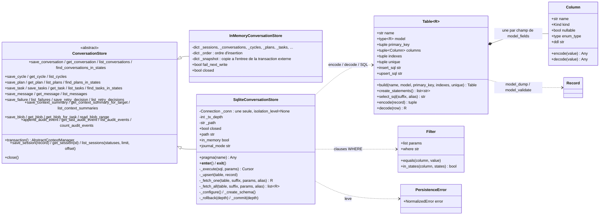
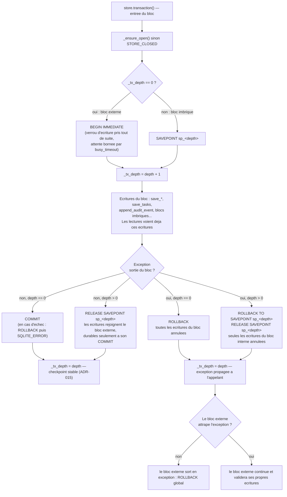
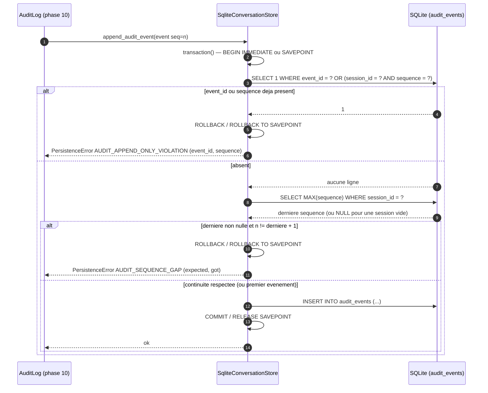

# Phase 3 — Persistance

**Composants** : `persistence/sqlite_store.py` (`SqliteConversationStore`), `persistence/factory.py` (`open_store`), exports dans `persistence/__init__.py`. L'interface `persistence/interface.py` (`ConversationStore`) et la référence de comportement `persistence/memory.py` (`InMemoryConversationStore`) viennent du socle et ne sont pas modifiées.
**Gate** : `pytest -m phase3` entièrement vert · `ruff check` · `ruff format --check` · `mypy --strict`.
**État** : ✅ vert — 405 cas (78 fonctions) dans `tests/unit/test_phase3_persistence.py`.

## 1. Objectif et périmètre

La spec fait du `ConversationStore` le dépositaire de **tout l'état d'exécution** (§3.6 : état courant, checkpoints stables, conversations, plans, tâches, résumés, erreurs, références d'audit, sorties brutes des tâches sous forme de blobs) et exige qu'aucun état critique ne vive uniquement en mémoire (§17.1), que le système reprenne depuis l'état persisté après un redémarrage (§7.5, §17.4) et que la chaîne d'audit soit une séquence *append-only* vérifiable (§17.3). Cette phase livre :

1. **`SqliteConversationStore(path)`** — implémentation complète de l'ABC `ConversationStore` sur SQLite (ADR-001 : module standard `sqlite3`, WAL, store **synchrone**), avec la sémantique exacte d'`InMemoryConversationStore` : mêmes clés d'upsert, mêmes ordres de listing, mêmes codes d'erreur (`BLOB_SIZE_MISMATCH`, `BLOB_NOT_FOUND`, `BLOB_RANGE_INVALID`, `AUDIT_APPEND_ONLY_VIOLATION`, `AUDIT_SEQUENCE_GAP`, `STORE_CLOSED`) ; `":memory:"` accepté.
2. **Un schéma SQL généré depuis les modèles** : une table par record de `domain/models.py`, colonnes typées d'après les annotations pydantic, JSON canonique (ADR-017) pour les dictionnaires, tuples et modèles imbriqués, `BLOB` pour les octets, ISO-8601 UTC pour les horodatages ; index sur les clés de recherche ; table `schema_version` ; création idempotente.
3. **Transactions imbriquées** : `BEGIN IMMEDIATE` / `COMMIT` / `ROLLBACK` au premier niveau, `SAVEPOINT` en dessous — un checkpoint stable (ADR-015) est simplement l'état du store après une transaction validée.
4. **`open_store(config)`** : crée `app.data_dir` si besoin et ouvre `<data_dir>/agentic.db`.
5. **La suite de contrat** (§18.2 phase 3) exécutée sur les trois saveurs — mémoire, SQLite fichier, SQLite `:memory:` — de façon à ce que les phases suivantes puissent substituer l'une à l'autre sans surprise.

Hors périmètre : la politique de reprise elle-même (`RecoveryCoordinator`, phase 9 — le store fournit `find_*_in_states` et les checkpoints), la troncature et le service des `chunk_request` (`PayloadGuard`, phase 4 — le store fournit `read_blob_range`), le chaînage des hashes d'audit (`AuditLog`, phase 10 — le store garantit l'append-only et la continuité des séquences), la purge des blobs (ADR-011, CLI de phase 9), toute migration de schéma (v1 : version 1 unique).

## 2. Prérequis

- Socle (phase 0) vert : `domain/models.py` (les 11 records + `SessionBudget`), `domain/states.py`, `domain/errors.py` (`PersistenceError`), `domain/canonical.py` (`canonical_json`), `config.py` (`AppConfig.app.data_dir`).
- `persistence/interface.py` (ABC `ConversationStore`, 34 méthodes abstraites) et `persistence/memory.py` (référence de comportement, y compris le crochet `fail_next_write` utilisé par les autres phases).
- Fixture `config` de `tests/conftest.py` (`data_dir` temporaire) ; `tmp_path` de pytest.
- Décisions applicables : ADR-001 (SQLite, store synchrone, WAL), ADR-011 (blobs jamais tronqués, lecture par plage, blobs de toute la session lisibles après rotation), ADR-012 (`SessionRecord`, clés `(session_id, plan_id)` / `(session_id, task_id)`), ADR-015 (persister avant publier, checkpoint = état après transaction), ADR-016 (reprise par relecture des états `RUNNING` / `WAITING_MODEL_RESPONSE`), ADR-017 (JSON canonique, aucun `datetime.now()` / aléa dans le code de production, ordre déterministe des tâches).
- **Exception d'isolation propre à cette phase** (§18.3) : les tests ouvrent de vraies bases SQLite sur `tmp_path` et en mémoire — la couche testée *est* la base. Aucun shell, aucun réseau.

## 3. Conception

### 3.1 Les trois classes et le mapping générique

Le mapping est **piloté par les annotations** : `Table.build(nom, Modèle, clé_primaire)` parcourt `Modèle.model_fields`, retire l'éventuel `| None` (colonne `NULL`able) et classe chaque champ :

| Annotation | Kind | Type SQL | Écriture (`model_dump()` → paramètre) | Lecture (ligne → `model_validate`) |
|---|---|---|---|---|
| `str` | TEXT | `TEXT` | telle quelle | `str` |
| `int` | INTEGER | `INTEGER` | `int` | `int` |
| `bool` (testé avant `int`) | BOOLEAN | `INTEGER` | `1` / `0` | `bool` |
| `float` | REAL | `REAL` | `float` | `float` |
| `bytes` | BLOB | `BLOB` | `bytes` | `bytes` |
| `datetime` | DATETIME | `TEXT` | UTC, largeur fixe `YYYY-MM-DDTHH:MM:SS.ffffff+00:00` ; naïf → `DATETIME_NOT_TZ_AWARE` | `datetime.fromisoformat` |
| `StrEnum` (testé avant `str`) | ENUM | `TEXT` | `.value` | `Enum(value)` |
| `dict` / `list` / `tuple` / `set` / `BaseModel` imbriqué | JSON | `TEXT` | `canonical_json` (clés triées, compact, UTF-8) | `json.loads` |

Une annotation non prise en charge lève `TypeError` **à l'import** du module (échec immédiat, pas au premier enregistrement). Une ligne que le modèle rejette (base corrompue, enum inconnue, JSON invalide) devient `PersistenceError(RECORD_INVALID, table, error)`.

Choix de conception :

| Sujet | Décision | Motif |
|---|---|---|
| Connexion | Une seule connexion `sqlite3` par store, `isolation_level=None` (le store émet lui-même `BEGIN` / `COMMIT` / `SAVEPOINT`), `check_same_thread=False`, `timeout = busy_timeout_ms / 1000` (5 s par défaut). | ADR-001 (store synchrone) ; l'orchestrateur est mono-thread ; le `busy_timeout` borne l'attente d'un verrou. |
| PRAGMA | `journal_mode=WAL` (fichiers seulement — `:memory:` reste `memory`), `synchronous=NORMAL`, `foreign_keys=ON`. | ADR-001, ADR-015 (une transaction par transition suffit comme checkpoint) ; en WAL + NORMAL les commits ne forcent pas de fsync, d'où 1000 événements d'audit en ~0,1 s. |
| Clés | `sessions(session_id)`, `conversations(conversation_id)`, `cycles(cycle_id)`, `plans(session_id, plan_id)`, `tasks(session_id, task_id)`, `messages(message_id)`, `failures(failure_id)`, `retry_decisions(decision_id)`, `context_summaries(summary_id)`, `blobs(blob_id)`, `audit_events(session_id, sequence)` + `UNIQUE(event_id)`. | §16, ADR-007/ADR-012 (`plan_id`, `task_id` uniques par session). |
| Upsert | `INSERT … ON CONFLICT(clé) DO UPDATE SET col = excluded.col` : la ligne est modifiée **en place**, son `rowid` — donc sa position dans les listings — ne change pas. Jamais `INSERT OR REPLACE` (qui supprime puis réinsère). | Ordres de listing stables après mise à jour. |
| Ordre d'insertion | `ORDER BY rowid` (sans `INTEGER PRIMARY KEY` explicite, `rowid` croît à chaque insertion ; `VACUUM` peut le renuméroter mais conserve l'ordre relatif, seul utilisé ici). | Équivalent de `_order` du store mémoire. |
| Contraintes FK | Aucune contrainte `REFERENCES` déclarée bien que `foreign_keys=ON` : les records sont persistés indépendamment (une tâche peut précéder son plan, un record peut être testé seul), exactement comme en mémoire. | Sémantique identique aux deux implémentations. |
| Version de schéma | Table `schema_version(version)` ; à l'ouverture : créée si absente et estampillée `1` ; si une autre version est trouvée → `SCHEMA_VERSION_UNSUPPORTED` et la connexion est fermée. | Pas de migration en v1 ; refuser vaut mieux que corrompre. |
| Erreurs SQLite | Toute `sqlite3.Error` → `PersistenceError("SQLITE_ERROR", transient=…, sqlite=str(exc), sqlite_type=…)` ; `transient=True` (donc `retryable`/`recoverable`) pour une `OperationalError` mentionnant `locked` ou `busy`. | §6, §7.1 (FailureManager décide du retry sur `transient`). |
| Après `close()` | **Toute** opération (lecture, écriture, `transaction()`) → `STORE_CLOSED` ; `close()` est idempotent ; `with SqliteConversationStore(p) as store:` ferme à la sortie. | Robustesse ; le store mémoire ne garde que les écritures — voir points ouverts. |
| Déterminisme | Aucun `datetime.now()`, `time.*`, `uuid`, `random` : tous les horodatages viennent des records (test d'inspection du source). | ADR-017 |

### 3.2 Schéma SQL (version 1)

Toutes les colonnes sont dérivées des records ; `NOT NULL` partout où l'annotation n'admet pas `None`. Les relations dessinées sont **logiques** (aucune contrainte de clé étrangère n'est déclarée, cf. §3.1).

```mermaid
erDiagram
    schema_version {
        INTEGER version PK "= 1"
    }
    sessions {
        TEXT session_id PK
        TEXT status "SessionState"
        TEXT goal
        TEXT user_message
        TEXT user_id
        INTEGER auto_close_on_final_answer "bool"
        TEXT budget "JSON SessionBudget"
        INTEGER consumed_cycles
        INTEGER consumed_plans
        INTEGER rotations_count
        TEXT current_conversation_id "NULL"
        TEXT final_answer "JSON, NULL"
        TEXT last_failure_id "NULL"
        TEXT started_at "ISO UTC, NULL"
        TEXT ended_at "ISO UTC, NULL"
        TEXT interrupted_at "ISO UTC, NULL"
        TEXT created_at "ISO UTC, index"
        TEXT updated_at "ISO UTC"
    }
    conversations {
        TEXT conversation_id PK
        TEXT session_id "index"
        TEXT parent_conversation_id "NULL"
        TEXT remote_conversation_id "NULL"
        TEXT status "ConversationState, index"
        INTEGER auto_close_on_final_answer "bool"
        TEXT context_window_state "ContextWindowState"
        INTEGER context_bytes
        INTEGER protocol_error_count
        TEXT last_model_response_state
        TEXT current_cycle_id "NULL"
        TEXT current_plan_id "NULL"
        TEXT last_completed_plan_id "NULL"
        INTEGER final_answer_received "bool"
        TEXT last_outbound_message_id "NULL"
        TEXT last_inbound_message_id "NULL"
        TEXT get_cursor "NULL"
        TEXT session_budget_json "JSON"
        TEXT closure_reason "NULL"
        TEXT interrupted_at "ISO UTC, NULL"
        TEXT created_at "ISO UTC"
        TEXT updated_at "ISO UTC"
    }
    cycles {
        TEXT cycle_id PK
        TEXT conversation_id "index"
        TEXT session_id "index"
        TEXT cycle_type "CycleType"
        TEXT status "CycleState, index"
        INTEGER retry_count
        TEXT outbound_message_id "NULL"
        TEXT inbound_message_id "NULL"
        TEXT plan_id "NULL"
        TEXT started_at "ISO UTC"
        TEXT ended_at "ISO UTC, NULL"
    }
    plans {
        TEXT plan_id PK "index"
        TEXT session_id PK
        TEXT conversation_id "index"
        TEXT cycle_id
        TEXT plan_type "PlanType"
        TEXT objective
        TEXT execution_policy "ExecutionPolicy"
        INTEGER max_parallel_workers
        TEXT status "PlanState, index"
        TEXT stop_reason "NULL"
        INTEGER task_count
        INTEGER completed_task_count
        INTEGER failed_task_count
        INTEGER skipped_task_count
        INTEGER cancelled_task_count
        INTEGER interrupted_task_count
        INTEGER default_max_output_bytes "NULL"
        TEXT state_summary "JSON, NULL"
        TEXT started_at "ISO UTC, NULL"
        TEXT ended_at "ISO UTC, NULL"
        TEXT created_at "ISO UTC"
        TEXT updated_at "ISO UTC"
    }
    tasks {
        TEXT task_id PK
        TEXT plan_id "index (session_id, plan_id)"
        TEXT session_id PK
        TEXT conversation_id "index"
        INTEGER order_index
        TEXT type "TaskType"
        TEXT cmd "NULL"
        TEXT status "TaskState, index"
        INTEGER critical "bool"
        INTEGER continue_on_error "bool"
        INTEGER stop_plan_on_failure "bool"
        INTEGER stop_plan_on_success "bool"
        INTEGER stops_plan_on_failure "bool"
        TEXT depends_on "JSON liste"
        TEXT resource_lock "NULL"
        INTEGER max_output_bytes "NULL"
        INTEGER max_output_bytes_applied "NULL"
        INTEGER timeout_ms "NULL"
        INTEGER timeout_ms_applied "NULL"
        TEXT ref_task_id "NULL"
        TEXT stream "OutputStream, NULL"
        INTEGER byte_offset "NULL"
        INTEGER max_bytes "NULL"
        INTEGER attempt_count
        INTEGER exit_code "NULL"
        INTEGER timed_out "bool"
        TEXT stdout_ref "NULL"
        TEXT stderr_ref "NULL"
        INTEGER truncated "bool"
        INTEGER original_size_bytes "NULL"
        INTEGER stdout_total "NULL"
        INTEGER stderr_total "NULL"
        TEXT stdout_range "JSON [debut, fin], NULL"
        TEXT stderr_range "JSON [debut, fin], NULL"
        TEXT reason "NULL"
        INTEGER pid "NULL"
        INTEGER process_group_id "NULL"
        TEXT started_at "ISO UTC, NULL"
        TEXT ended_at "ISO UTC, NULL"
        INTEGER duration_ms "NULL"
        TEXT created_at "ISO UTC"
        TEXT updated_at "ISO UTC"
    }
    messages {
        TEXT message_id PK
        TEXT session_id "index"
        TEXT conversation_id "index"
        TEXT direction "MessageDirection"
        TEXT message_type "MessageType"
        TEXT payload "JSON"
        INTEGER size_bytes
        TEXT cycle_id "NULL"
        INTEGER post_confirmed "bool"
        TEXT posted_at "ISO UTC, NULL"
        TEXT received_at "ISO UTC, NULL"
        TEXT validation_status "NULL"
        TEXT retransmission_of "NULL"
        TEXT created_at "ISO UTC"
    }
    failures {
        TEXT failure_id PK
        TEXT session_id "index"
        TEXT conversation_id "NULL"
        TEXT plan_id "NULL"
        TEXT task_id "NULL"
        TEXT error_type "ErrorType"
        TEXT error_code
        TEXT severity "Severity"
        TEXT origin
        INTEGER retryable "bool"
        INTEGER recoverable "bool"
        INTEGER attempt
        INTEGER max_attempts
        TEXT details "JSON"
        TEXT timestamp "ISO UTC"
    }
    retry_decisions {
        TEXT decision_id PK
        TEXT session_id "index"
        TEXT conversation_id "NULL"
        TEXT cycle_id "NULL"
        TEXT operation "POST | GET | INIT"
        TEXT error_type "ErrorType"
        TEXT error_code
        INTEGER attempt
        INTEGER max_attempts
        TEXT decision "retry | abort | rotate | fail"
        INTEGER delay_ms "NULL"
        TEXT created_at "ISO UTC"
    }
    context_summaries {
        TEXT summary_id PK
        TEXT session_id "index"
        TEXT source_conversation_id
        TEXT target_conversation_id "index"
        TEXT summary_payload "JSON"
        INTEGER summary_size_bytes
        INTEGER reduction_step
        TEXT created_at "ISO UTC"
    }
    blobs {
        TEXT blob_id PK
        TEXT session_id "index (session_id, task_id, blob_type)"
        TEXT task_id
        TEXT blob_type "OutputStream"
        BLOB content "jamais tronque"
        INTEGER size_bytes
        TEXT created_at "ISO UTC"
    }
    audit_events {
        TEXT event_id UK
        INTEGER sequence PK
        TEXT previous_event_hash
        TEXT event_hash
        TEXT session_id PK
        TEXT conversation_id "NULL"
        TEXT cycle_id "NULL"
        TEXT plan_id "NULL"
        TEXT task_id "NULL"
        TEXT event_type
        TEXT timestamp "ISO UTC"
        TEXT payload "JSON"
    }

    sessions ||--o{ conversations : "session_id"
    sessions ||--o{ plans : "session_id"
    sessions ||--o{ tasks : "session_id"
    sessions ||--o{ failures : "session_id"
    sessions ||--o{ retry_decisions : "session_id"
    sessions ||--o{ context_summaries : "session_id"
    sessions ||--o{ blobs : "session_id"
    sessions ||--o{ audit_events : "session_id"
    conversations ||--o{ cycles : "conversation_id"
    conversations ||--o{ plans : "conversation_id"
    conversations ||--o{ messages : "conversation_id"
    conversations |o--o{ conversations : "parent_conversation_id"
    conversations ||--o| context_summaries : "target_conversation_id"
    cycles ||--o{ plans : "cycle_id"
    plans ||--o{ tasks : "(session_id, plan_id)"
    tasks ||--o{ blobs : "(session_id, task_id)"
```

Index créés : `sessions(status)`, `sessions(created_at)`, `conversations(session_id)`, `conversations(status)`, `cycles(conversation_id)`, `cycles(session_id)`, `cycles(status)`, `plans(conversation_id)`, `plans(status)`, `plans(plan_id)`, `tasks(session_id, plan_id)`, `tasks(conversation_id)`, `tasks(status)`, `messages(conversation_id)`, `messages(session_id)`, `failures(session_id)`, `retry_decisions(session_id)`, `context_summaries(session_id)`, `context_summaries(target_conversation_id)`, `blobs(session_id, task_id, blob_type)`, plus l'index automatique de `UNIQUE(audit_events.event_id)` ; les clés primaires composées couvrent `session_id` pour `plans`, `tasks` et `audit_events`.

### 3.3 Transaction imbriquée avec savepoints

Points saillants : `save_tasks` et `append_audit_event` s'exécutent toujours dans `transaction()` (donc dans un savepoint quand un bloc externe existe) ; une `PersistenceError` levée *à l'intérieur* d'un bloc (par exemple `BLOB_SIZE_MISMATCH`) suit le même chemin de rollback qu'une exception quelconque ; `close()` pendant un bloc laisse la connexion annuler la transaction et remet `_tx_depth` à zéro.

### 3.4 Ajout d'un événement d'audit (append-only)

## 4. Règles (invariants vérifiés par la suite de contrat)

1. **Upsert par clé.** Sauvegarder deux fois la même clé remplace la version précédente ; les listings ne contiennent qu'une entrée par clé ; la position d'insertion est conservée.
2. **Ordres de listing.** `list_sessions` : `created_at` décroissant puis `session_id` décroissant, avec `limit` / `offset` et filtre `statuses` (itérable vide → liste vide). `list_conversations`, `list_cycles`, `list_plans`, `list_messages`, `list_failures`, `list_retry_decisions`, `list_context_summaries` : **plus ancien d'abord, dans l'ordre d'insertion** (pas l'ordre des horodatages). `list_tasks` / `find_tasks_in_states` : ordre d'insertion du **plan** (`plans.rowid` ; une tâche dont le plan est inconnu se classe avant — ordre 0 comme en mémoire), puis `order_index`, puis ordre d'insertion de la tâche. `find_conversations_in_states` / `find_plans_in_states` : ordre d'insertion, toutes sessions confondues. `get_context_summary_for_target` et `get_blob_for_task` : première correspondance insérée.
3. **Audit append-only.** Un `event_id` déjà présent (dans toute la base) ou une `sequence` déjà présente pour la session → `AUDIT_APPEND_ONLY_VIOLATION` ; une séquence différente de `dernière + 1` → `AUDIT_SEQUENCE_GAP` (`expected`, `got`) ; le premier événement d'une session peut porter n'importe quelle séquence (c'est l'`AuditLog` qui fixe le départ) ; les chaînes de deux sessions sont indépendantes ; un événement ajouté dans une transaction annulée disparaît et sa séquence redevient utilisable.
4. **Blobs et plages.** `save_blob` refuse `size_bytes != len(content)` (`BLOB_SIZE_MISMATCH`, rien n'est écrit). `read_blob_range(blob_id, offset, max_bytes)` : blob inconnu → `BLOB_NOT_FOUND` (vérifié **avant** la plage) ; `offset < 0` ou `max_bytes < 0` → `BLOB_RANGE_INVALID` (`blob_id`, `offset`, `max_bytes`) ; sinon exactement `content[offset : offset + max_bytes]` (plage clipée, `offset ≥ taille` → `b""`), calculé par SQLite (`substr` sur le `BLOB`) sans charger le blob entier.
5. **Transactions.** Une exception qui sort du bloc externe annule toutes les écritures du bloc ; les écritures sont visibles à l'intérieur du bloc avant validation ; les blocs imbriqués réussis sont validés ensemble ; le store reste utilisable après un rollback.
6. **Round-trip exact.** Pour chacun des 11 records, un enregistrement avec **tous** les champs optionnels renseignés (tuples, `bytes`, dictionnaires imbriqués, enums, datetimes) et un enregistrement minimal (valeurs par défaut, `None`) relus valent `==` l'original ; les types Python sont conservés (`tuple`, `bytes`, `SessionBudget`, membres d'enum, datetimes UTC).
7. **Fermeture.** Toute écriture après `close()` → `STORE_CLOSED` (les deux implémentations) ; toute lecture ou `transaction()` après `close()` → `STORE_CLOSED` (SQLite) ; `close()` idempotent.
8. **Fichier.** Les données survivent à `close()` / réouverture (WAL) ; deux instances sur le même fichier voient les écritures l'une de l'autre ; `open_store(config)` crée `data_dir` (récursivement) et `agentic.db`.

## 5. Plan de tests

Fichier `tests/unit/test_phase3_persistence.py`, marqueur `phase3`, nommage `given_<état>_when_<action>_then_<résultat>` (§18.4). La fixture `store_impl` est paramétrée sur `["memory", "sqlite_file", "sqlite_memory"]` : chaque test de contrat produit trois cas. Les fabriques `make_<record>()` renseignent **tous** les champs ; `minimal()` ne garde que les champs requis (les nullables à `None`) ; `Case` décrit, pour chaque type de record, comment le sauver, le relire, le lister et le modifier.

### 5.1 Contrat — un test, trois implémentations (113 cas × 3)

| Test | Vérifie | Réf. |
|---|---|---|
| `given_full_record_factory_when_built_then_every_field_is_set` (×11) | méta-test : chaque fabrique renseigne tous les champs (sinon une colonne perdue passerait inaperçue) | §16 |
| `given_empty_store_when_full_record_saved_then_read_back_equal` (×11) | create / read exact (`==`) de chaque record, listing = `[record]` | §18.2 |
| `given_empty_store_when_minimal_record_saved_then_defaults_and_nulls_read_back_equal` (×11) | valeurs par défaut et `NULL` | §16 |
| `given_empty_store_when_unknown_key_read_then_none` (×11) | `get_*` inconnu → `None`, listings vides | — |
| `given_saved_record_when_saved_again_with_changes_then_new_version_read_and_single_entry` (×10) | update = upsert par clé, une seule entrée (l'audit est exclu : append-only) | §18.2 |
| `given_task_read_back_when_types_inspected_then_tuples_bytes_enums_and_utc_datetimes_preserved` | types Python conservés, datetimes UTC | ADR-017 |
| `given_sessions_saved_in_scrambled_order_when_listed_then_newest_first_by_created_at_then_id` · `…_with_limit_and_offset_…` · `…_filtered_by_statuses_…` | ordre des sessions, pagination, filtre (dont itérable vide et générateur) | interface |
| `given_conversations_saved_out_of_timestamp_order_when_listed_then_insertion_order_kept` · `given_conversation_updated_when_listed_then_original_position_kept` | ordre d'insertion, stable après upsert | interface |
| `given_cycles_…` · `given_plans_…` · `given_messages_…` · `given_failures_and_retry_decisions_…` · `given_summaries_for_two_targets_…` | ordre d'insertion, filtres (`conversation_id`, `direction`), scoping, première correspondance | interface |
| `given_two_plans_when_tasks_listed_then_ordered_by_plan_insertion_then_order_index` · `…_with_plan_and_status_filters_…` · `given_task_whose_plan_is_unknown_…` · `given_task_updated_when_listed_…` | ordre des tâches (ADR-017), filtres, plan inconnu en tête, stabilité après update | ADR-017 |
| `given_tasks_when_saved_in_bulk_then_all_present_in_declaration_order` · `given_bulk_save_whose_iterator_fails_midway_when_called_then_no_task_persisted` | `save_tasks` atomique | interface |
| `given_crashed_session_when_running_tasks_searched_…` · `given_tasks_in_pending_and_waiting_states_…` · `given_plans_in_various_states_when_running_or_pending_searched_…` · `given_conversations_when_waiting_model_response_searched_…` · `given_checkpoint_of_interrupted_plan_when_reloaded_then_plan_and_tasks_consistent` | récupération des checkpoints pour la reprise : tâche `RUNNING`, plan `RUNNING`, conversation `WAITING_MODEL_RESPONSE`, ordre, états multiples, itérable vide | §7.5, §17.4, §18.2, ADR-016 |
| `given_committed_data_when_transaction_raises_then_writes_inside_rolled_back_and_store_usable` · `…_several_record_types_written_then_exception_then_nothing_visible` · `…_own_writes_visible_before_commit` · `given_nested_transactions_when_both_succeed_…` · `…_when_inner_raises_through_outer_then_everything_rolled_back` · `…_persistence_error_raised_inside_…` · `given_audit_events_in_failed_transaction_…` | transactions : rollback, écriture partielle invisible, lecture de ses écritures, imbrication, audit annulé | ADR-015 |
| `given_blob_with_wrong_size_when_saved_then_blob_size_mismatch_and_nothing_stored` · `given_stdout_and_stderr_blobs_when_looked_up_for_task_…` · `given_blob_when_range_read_then_slice_clipped_to_blob_size` (×10 : début, milieu, fin, clipée, entière, `offset == taille`, `offset > taille`, longueur 0, dernier octet) · `given_empty_blob_…` · `given_unknown_blob_…` · `…_negative_bounds_…` (×3) · `given_large_blob_…` (300 000 octets) · `given_blob_when_saved_again_…` | stockage des blobs et lecture par plage | §18.2, ADR-011 |
| `given_empty_session_when_events_appended_then_last_count_and_ascending_list` · `given_chain_when_listed_after_sequence_with_limit_…` · `…_sequence_gap_…` · `…_lower_sequence_…` · `…_existing_event_id_…` · `…_same_event_appended_twice_…` · `given_two_sessions_when_events_appended_then_chains_independent` · `given_empty_session_when_first_event_has_arbitrary_sequence_…` | audit : append, séquence, gap, doublons, `after_sequence` / `limit`, `count`, `get_last`, indépendance des sessions | §3.16, §17.3 |
| `given_closed_store_when_write_attempted_then_store_closed_error` (×12 écritures) · `given_store_when_closed_twice_then_no_error` | `STORE_CLOSED`, `close()` idempotent | — |
| `given_records_of_two_sessions_when_session_scoped_listings_used_then_other_session_invisible` | isolation par session (blobs lisibles par session après rotation) | ADR-011 |

### 5.2 SQLite — durabilité, schéma, erreurs, savepoints, fabrique (66 cas)

| Test | Vérifie | Réf. |
|---|---|---|
| `given_file_store_with_data_when_closed_and_reopened_then_data_present` | réouverture : sessions, conversations, tâches, blobs, audit ; la chaîne continue | §17.4 |
| `given_file_store_when_opened_then_wal_journal_and_pragmas_applied` · `given_memory_store_when_opened_then_memory_journal_and_instances_independent` | `journal_mode = wal` (persisté dans le fichier) / `memory`, `foreign_keys = 1`, `synchronous = 1`, `path`, `in_memory` | ADR-001 |
| `given_existing_database_when_opened_twice_then_schema_idempotent_and_writes_visible_across` | deux instances simultanées + troisième ouverture par `str` | ADR-001 |
| `given_new_database_when_created_then_every_model_field_has_a_typed_column_and_keys_match` | via `PRAGMA table_info` : chaque champ de chaque modèle a une colonne du bon type SQL et du bon `NOT NULL`, clés primaires exactes, `schema_version = 1`, colonnes indexées | §16 |
| `given_database_with_unsupported_schema_version_when_opened_then_persistence_error` | `SCHEMA_VERSION_UNSUPPORTED` (`found`, `supported`) | — |
| `given_unreachable_directory_when_store_created_then_sqlite_error_mapped` · `given_store_when_used_as_context_manager_then_closed_on_exit` | erreur d'ouverture mappée ; `with` ferme | — |
| `given_closed_sqlite_store_when_read_attempted_then_store_closed_error` (×25 lectures) · `…_when_transaction_opened_…` | toute opération après `close()` | — |
| `given_sqlite_error_when_mapped_then_persistence_error_with_details_and_transient_flag` (×7) | mapping `sqlite3.Error` → `SQLITE_ERROR`, `details.sqlite`, `transient` seulement pour `locked` / `busy` | §6, §7.1 |
| `given_locked_database_when_write_attempted_then_transient_sqlite_error_then_recovers` · `…_when_transaction_begins_…` | vrai verrou tenu par une seconde connexion (`BEGIN IMMEDIATE`), `busy_timeout_ms = 20` → erreur transitoire, puis reprise normale | §7.1 |
| `given_corrupted_row_when_read_then_record_invalid_error` | ligne altérée par une connexion externe → `RECORD_INVALID` | robustesse |
| `given_naive_datetime_when_saved_then_datetime_not_tz_aware_error_and_nothing_written` · `given_non_utc_aware_datetime_when_saved_then_stored_as_utc_text_and_read_back_equal` · `given_timestamps_with_and_without_microseconds_when_sessions_listed_then_chronological` | normalisation UTC largeur fixe, refus des datetimes naïfs, ordre textuel = ordre chronologique | ADR-017 |
| `given_inner_transaction_failure_caught_by_outer_when_outer_commits_then_only_outer_writes_kept` · `given_inner_savepoint_rolled_back_when_sibling_inner_transaction_follows_then_it_commits` | sémantique des savepoints | ADR-015 |
| `given_sqlite_file_store_when_1000_audit_events_appended_then_within_sanity_bound` | 1000 `append_audit_event` sur fichier sous une borne de sûreté de 15 s (mesuré ≈ 0,1 s sous Linux, ≈ 4 s sur les runners Windows avec `synchronous=FULL`) | performance |
| `given_config_with_missing_nested_data_dir_when_open_store_then_directory_and_database_created` · `given_config_fixture_when_open_store_twice_then_same_database_reused` · `given_data_dir_path_occupied_by_a_file_when_open_store_then_persistence_error` | `open_store(config)` : création récursive de `data_dir`, `agentic.db`, réutilisation, `DATA_DIR_UNAVAILABLE` | ADR-018 |
| `given_sqlite_store_class_when_inspected_then_every_abstract_method_implemented` · `given_persistence_sources_when_inspected_then_no_wall_clock_or_randomness_used` | ABC intégralement implémentée ; aucun `datetime.now` / `time.*` / `uuid` / `random` dans `sqlite_store.py` et `factory.py` | ADR-017 |

## 6. Étapes TDD suivies

1. Lecture du socle (`interface.py`, `memory.py`, `models.py`, `errors.py`, `states.py`, `canonical.py`, `config.py`, `conftest.py`, tests de phase 0 et 1) et des textes de référence (§3.6, §7.5, §16, §17.1, §17.4, §18.2, ADR-001/011/012/015/016/017, module map).
2. Vérification de trois points de conception avant d'écrire : `model_fields[...].annotation` expose bien `types.UnionType` pour `X | None` et l'origine générique pour `tuple[int, int]` ; `INSERT … ON CONFLICT DO UPDATE` conserve le `rowid` (contrairement à `INSERT OR REPLACE`) ; `substr()` sur un `BLOB` vide renvoie `NULL` (d'où la coercition en `b""`).
3. **Rouge** : écriture du fichier de tests complet (78 fonctions, 405 cas) → `ImportError: cannot import name 'SqliteConversationStore'`.
4. **Vert** : `sqlite_store.py`, `factory.py`, exports → 403 verts, 2 échecs : un défaut du test (le résumé « étranger » partageait la cible `conv-0002` et avait été inséré avant `s1` — corrigé côté test) et une vraie faiblesse de l'implémentation (une enum corrompue levait `ValueError` avant la validation pydantic au lieu de `RECORD_INVALID` — le décodage colonne par colonne est désormais couvert par la même conversion en `PersistenceError`) → 405 verts.
5. **Refactor** sous tests verts : `_Filter` factorise les clauses `WHERE` optionnelles (sessions, plans, tâches, messages, `find_*`) ; index redondants retirés (`tasks(plan_id)` couvert par `tasks(session_id, plan_id)`, `audit_events(event_id)` couvert par `UNIQUE`) ; docstring précisée sur la sémantique des savepoints ; `ruff format`, `ruff check`, `mypy --strict` verts (paquet et fichier de tests).
6. Rédaction de ce guide et validation des quatre diagrammes Mermaid.

## 7. Gate

| Contrôle | Commande | Résultat |
|---|---|---|
| Tests de la phase | `.venv/bin/pytest -q -m phase3` | 405 verts (≈ 2,3 s) |
| Phases 0 + 1 + 3 | `.venv/bin/pytest -q tests/unit/test_phase0_foundation.py tests/unit/test_phase1_state_machines.py tests/unit/test_phase3_persistence.py` | 945 verts |
| Suite complète | `.venv/bin/pytest -q` | les fichiers de tests des phases 4, 7 et 10 (en cours par d'autres agents) échouent à la collecte faute d'implémentation ; aucun test de cette phase ni des phases 0/1 n'est affecté |
| Lint | `.venv/bin/ruff check src/agentic_local_app/persistence tests/unit/test_phase3_persistence.py` | ✅ |
| Format | `.venv/bin/ruff format --check src/agentic_local_app/persistence tests/unit/test_phase3_persistence.py` | ✅ |
| Types | `.venv/bin/mypy --strict src/agentic_local_app/persistence` · `.venv/bin/mypy --strict tests/unit/test_phase3_persistence.py` | ✅ (le paquet complet ne signale que `transport/`, hors périmètre) |
| Diagrammes | `check_mermaid.py docs/phases/phase-03-persistence.md` | 4/4 rendus |

## 8. Résultat

- **405 cas** (78 fonctions) : 339 cas de contrat (113 × 3 implémentations) + 66 cas SQLite / fabrique / structure ; 1000 événements d'audit persistés en ≈ 0,1 s sur fichier.
- Fichiers livrés : `src/agentic_local_app/persistence/sqlite_store.py` (`SqliteConversationStore`, `SCHEMA_VERSION`, `MEMORY_PATH`, `persistence_error_from_sqlite`), `src/agentic_local_app/persistence/factory.py` (`open_store`, `DB_FILENAME`), `src/agentic_local_app/persistence/__init__.py` (exports), `tests/unit/test_phase3_persistence.py`, ce guide.
- Exigences couvertes : §3.6 (tout l'état, checkpoints, blobs), §7.5 / §17.4 (relecture des checkpoints via `find_*_in_states`, `list_tasks` par plan), §16 (les 11 records, tous les champs, étendus par les ADR), §17.1 (aucun état critique en mémoire, transactions), §17.3 (audit append-only à séquence continue), §18.2 phase 3 (create / read / update de chaque record, checkpoints, blobs et chunks), §18.4 (nommage), ADR-001 (SQLite standard, WAL, synchrone), ADR-011 (`read_blob_range`, blobs par session), ADR-012 (`SessionRecord`, clés composées), ADR-015 (transaction = checkpoint), ADR-016 (états de reprise interrogeables), ADR-017 (JSON canonique, déterminisme, ordre des tâches).
- Codes d'erreur émis : `STORE_CLOSED`, `SQLITE_ERROR` (transient sur `locked` / `busy`), `BLOB_SIZE_MISMATCH`, `BLOB_NOT_FOUND`, `BLOB_RANGE_INVALID`, `AUDIT_APPEND_ONLY_VIOLATION`, `AUDIT_SEQUENCE_GAP`, `RECORD_INVALID`, `SCHEMA_VERSION_UNSUPPORTED`, `DATETIME_NOT_TZ_AWARE`, `DATA_DIR_UNAVAILABLE` (fabrique).

## 9. Points ouverts

1. **Savepoints vs store mémoire.** Quand un bloc externe *attrape* l'exception d'un bloc imbriqué, SQLite annule les écritures du bloc interne (savepoint) alors qu'`InMemoryConversationStore` les conserve (un seul snapshot au niveau 0). Les deux se comportent à l'identique dès que l'exception sort du bloc externe (cas testé sur les trois saveurs). Changement suggéré dans `memory.py` (hors périmètre) : une pile de snapshots, un par niveau, pour rétablir la sémantique savepoint en mémoire.
2. **Lectures après `close()`.** SQLite refuse toute opération (`STORE_CLOSED`) ; le store mémoire ne garde que les écritures et laisse les lectures et `transaction()` passer. Aligner `memory.py` (ajouter `_write_guard()` en lecture et dans `transaction()`) rendrait la suite de contrat plus stricte.
3. **`event_id` unique globalement.** `UNIQUE(event_id)` et le contrôle d'append-only portent sur toute la base ; le store mémoire ne vérifie l'unicité qu'au sein d'une session. Sans effet en pratique (les identifiants viennent d'`IdGenerator`), mais à harmoniser.
4. **Aucune contrainte de clé étrangère.** Choix délibéré pour conserver la sémantique du store mémoire (records persistés indépendamment). `foreign_keys=ON` est prêt ; si une phase ultérieure veut des contraintes, les déclarer `DEFERRABLE INITIALLY DEFERRED` pour ne pas casser l'ordre d'écriture conversation → session de `ConversationLifecycleManager`.
5. **Concurrence.** Une connexion par store, aucun verrou côté Python : le store est conçu pour l'orchestrateur asyncio mono-thread ; `check_same_thread=False` permet à l'API HTTP (phase 9) de lire depuis un autre thread mais la synchronisation, si nécessaire, revient à l'appelant.
6. **Migrations.** `SCHEMA_VERSION = 1` sans mécanisme de migration ; une version différente est refusée à l'ouverture. Ajouter une colonne à un record change le DDL généré : une base existante devra passer par une migration explicite (`ALTER TABLE … ADD COLUMN`) dans une version 2.
7. **`list_audit_events(limit)` / `list_sessions(limit)` négatifs.** Non définis par l'interface (SQLite : `LIMIT -1` = tout ; mémoire : tranche Python). À interdire dans l'interface si le besoin apparaît.
8. **Fixture `store_impl` commune.** Elle vit dans le fichier de tests de la phase ; les phases 5, 8 et 9 qui voudront exercer SQLite pourront la déplacer dans `conftest.py`.
