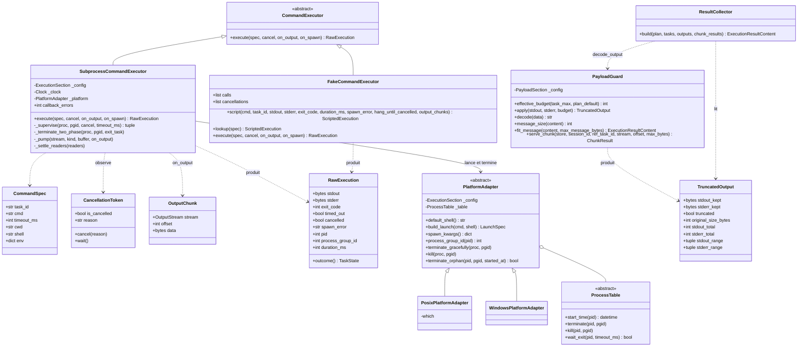
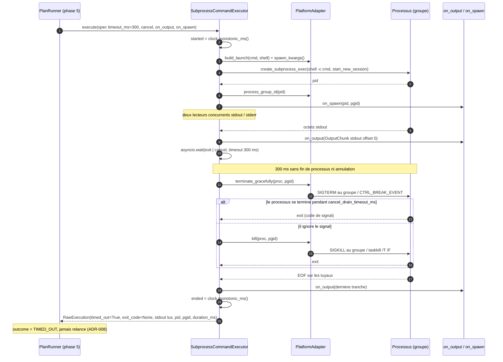
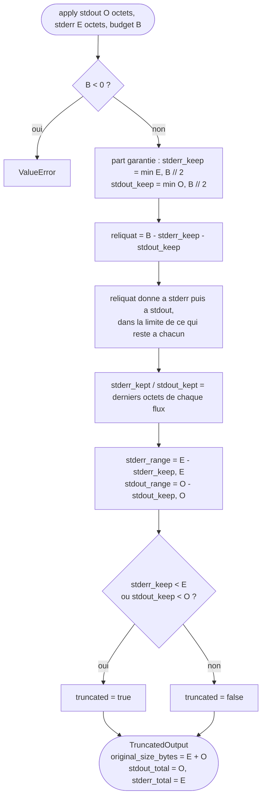
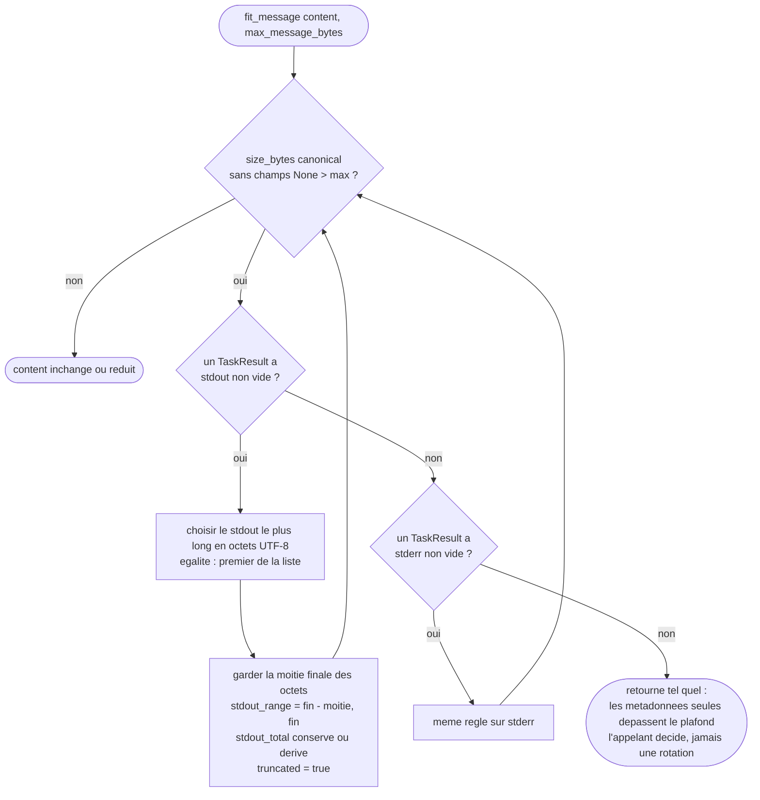

# Phase 4 — Exécution de tâche

**Composants** : `execution/platform.py` (`PlatformAdapter`, `PosixPlatformAdapter`, `WindowsPlatformAdapter`, `ProcessTable`), `execution/executor.py` (`CommandExecutor`, `SubprocessCommandExecutor`, `CommandSpec`, `CancellationToken`, `OutputChunk`, `RawExecution`), `execution/payload_guard.py` (`PayloadGuard`, `TruncatedOutput`, `ChunkResult`, `ChunkError`), `execution/result_collector.py` (`ResultCollector`), `testing/fake_executor.py` (`FakeCommandExecutor`).
**Gate** : `pytest -m phase4` entièrement vert · `ruff check` · `ruff format --check` · `mypy --strict`.
**État** : ✅ vert — 151 tests (136 unitaires sans processus dans `tests/unit/test_phase4_task_execution.py`, 15 `real_subprocess` dans `tests/unit/test_phase4_real_subprocess.py`).

## 1. Objectif et périmètre

La spec confie à trois composants tout ce qui entoure **une** commande : l'exécuter et la borner dans le temps (`CommandExecutor`, §3.8), limiter ce qui en est renvoyé au modèle et servir les relectures par plage (`PayloadGuard`, §3.10, §2.5), et assembler l'unique `execution_result` d'un plan (`ResultCollector`, §3.9, §12.5). Cette phase livre :

1. la **frontière shell** (module map §2, règle 3) : une ABC, une implémentation réelle asynchrone qui délègue le lancement et la terminaison à une **couche plateforme** Windows / POSIX (ADR-003), et un **double** scriptable sans processus (§18.3) ;
2. l'exécution **bornée et non rejouée** d'une tâche : `timeout_ms` effectif appliqué par l'exécuteur, `TIMED_OUT` rapporté comme un résultat et jamais relancé (ADR-008), `pid` / `pgid` remontés **dès le spawn** pour la persistance (ADR-016), sortie **live** par tranches bornées et cadencées (ADR-018), **terminaison en deux temps** sur timeout et sur annulation (ADR-003) ;
3. la **troncature** pure et déterministe de la sortie (ADR-011), les **quatre bornes** de payload (ADR-010) dont le plafond message par re-troncature déterministe, et la **réponse aux `chunk_request`** depuis les blobs (ADR-011) ;
4. la **construction** de l'`execution_result` dans l'ordre du plan (ADR-017), avec les statuts en minuscules et les listes `{task_id, reason}` (ADR-009), et l'interdiction de le construire pour un plan interrompu (§8.4).

Hors périmètre : l'itération sur les tâches, les dépendances, les verrous de ressource, les conditions d'arrêt et la persistance des transitions (`PlanRunner`, phase 5) ; l'écriture des blobs dans le store et la création des `FailureRecord` `SPAWN_FAILED` (phase 5, à partir de `RawExecution`) ; la publication des événements `task.output` sur le bus (phase 5, à partir de `on_output`) ; l'usage de `terminate_orphan` au redémarrage (`RecoveryCoordinator`, phase 9).

## 2. Prérequis

- Socle (phase 0) vert : `domain/states.py` (`TaskState`, `PlanState.protocol_value`, `OutputStream`, `TaskType`), `domain/models.py` (`TaskRecord`, `PlanRecord`, `BlobRecord`), `domain/errors.py` (`TaskExecutionError`), `domain/clock.py` (`Clock`, `FakeClock`, `SystemClock`), `domain/canonical.py` (`size_bytes`), `config.py` (`ExecutionSection`, `PayloadSection`).
- `persistence/interface.py` (`get_blob_for_task`, `read_blob_range`) et `persistence/memory.py`.
- `protocol/messages.py` : `ExecutionResultContent`, `TaskResult`, `TaskRef` — **le** format de sortie du `ResultCollector` (phase 2, schémas livrés par le socle).
- Décisions applicables : ADR-003 (plateformes, deux temps, octets), ADR-008 (timeout, pas de retry, `TIMED_OUT` = échec), ADR-009 (statuts et raisons), ADR-010 (bornes de payload, `fit_message`), ADR-011 (troncature, plages, `chunk_request` avec `stream`), ADR-016 (`pid`/`pgid` dès le spawn, orphelins), ADR-017 (ordre du plan, horloge injectée), ADR-018 (flux live).

## 3. Conception

### 3.1 Les classes et leurs dépendances

Choix de conception :

| Sujet | Décision | Motif |
|---|---|---|
| Échec ≠ exception | `exit_code ≠ 0` **et** échec de spawn (`spawn_error`, `exit_code = None`) sont des `RawExecution`, jamais des exceptions. `TaskExecutionError` (`OUTPUT_READ_FAILED`) n'est levée que si l'exécuteur lui-même est défaillant. | §3.8, ADR-008 §4 |
| Lancement | `create_subprocess_exec(shell, "-c", cmd)` et non `create_subprocess_shell(cmd, executable=shell)` : cette dernière forme laisse `argv[0] = /bin/sh` et **bash invoqué sous le nom `sh` passe en mode POSIX** (vérifié : `shopt -o posix` → `on`). La forme suit le **dialecte détecté**, pas le système d'exploitation ; seul PowerShell reçoit un script enveloppé (épilogue `exit $LASTEXITCODE`, `-EncodedCommand`), `cmd /c` et les shells POSIX recevant la commande verbatim. | ADR-003 §2, ADR-030 §2 |
| Horodatages | `started_monotonic_ms` / `ended_monotonic_ms` / `duration_ms` viennent de `clock.monotonic_ms()` ; seule l'**attente** passe par `asyncio.wait(timeout=…)`. Aucun `time.*`, `datetime.now`, `uuid`, `random` dans les cinq modules (test d'inspection). | ADR-017 |
| `outcome` | `cancelled` > `timed_out` > `exit_code` : l'annulation est une décision du runner, le timeout une décision de l'exécuteur ; `exit_code == 0` → `COMPLETED`, sinon `FAILED` (y compris `spawn_error`). Sur timeout ou annulation `exit_code = None` (le code du signal n'est pas exposé). | ADR-008 §3 |
| Annulation | Deux chemins : le **jeton** (`CancellationToken`, chemin gracieux : deux temps avec drain, `cancelled = True`) et l'**annulation asyncio** de la coroutine `execute` (arrêt dur, attente bornée, `CancelledError` propagée). Un jeton déjà levé à l'entrée ne lance rien (`pid = None`). | §2.4, §8.3, §8.4 |
| Sortie live | Deux lecteurs concurrents ; tranches ≤ `live_output_chunk_bytes` ; au plus une émission par `live_output_interval_ms` **et par flux**, les octets intermédiaires étant regroupés puis vidés par minuterie ou à l'EOF (dernière tranche exemptée). Une émission peut contenir plusieurs tranches consécutives quand plus d'un chunk s'est accumulé. Une exception de `on_output` est comptée (`callback_errors`) et n'interrompt jamais la tâche : le blob reste la vérité. | ADR-018 |
| `on_spawn` | Appelé juste après le spawn avec `(pid, pgid)` — `pgid = os.getpgid(pid)` sous POSIX (égal au pid grâce à `start_new_session=True`), `None` sous Windows. S'il lève (persistance impossible), le processus est tué et l'exception propagée : rien ne tourne sans trace. | ADR-016 §1 |
| `env` | `os.environ` copié puis surchargé par `spec.env` ; `shell` = `spec.shell`, sinon `config.shell`, sinon le shell **détecté** (`bash`, `zsh`, `sh` / `pwsh`, `powershell`, à défaut `/bin/sh` ou `powershell`). | ADR-003 §3, ADR-030 §1 |
| Orphelins | `terminate_orphan` n'agit que si le processus existe **et** a démarré à ± `ORPHAN_START_TOLERANCE_MS` (5 s) de `started_at` : un pid réattribué à un processus lancé plus tard, ou un processus antérieur à la tâche, n'est jamais signalé. Sous Linux le démarrage vient de `/proc/<pid>/stat` (champ 22) + `btime` ; sans `/proc` (macOS) il est inconnu → aucune action (limite documentée). Windows : `Get-Process … StartTime`, `taskkill /T` puis `/T /F`, en *best effort*. | ADR-016 §1, ADR-003 |
| Attente bloquante | `ProcessTable.wait_exit` (API synchrone du `RecoveryCoordinator`) attend par pas de 50 ms avec `threading.Event().wait`, borné en nombre de pas : aucune lecture d'horloge. | ADR-017 |
| Décodage | Uniquement dans `decode_output` (UTF-8, `errors="replace"`), appelé par le `ResultCollector` et `fit_message` ; budgets et plages sont toujours en **octets** du flux brut. | ADR-003 §4, ADR-011 |
| Double | `FakeCommandExecutor` : correspondance `task_id` → `cmd` exact → défaut ; avance la `FakeClock` de `min(duration_ms, timeout_ms)` (l'horloge s'arrête là où le vrai exécuteur termine le processus) ; garde **toute** la sortie scriptée même en timeout (simplification documentée) ; émet les `output_chunks` scriptés ou, à défaut, une tranche par flux non vide ; `hang_until_cancelled` attend le jeton ; `calls` et `cancellations` (`(task_id, reason)`) enregistrés ; pids factices croissants (`pgid = pid`) ; `await asyncio.sleep(0)` après le spawn pour laisser les workers s'entrelacer. | §18.3, module map §4 |

### 3.2 Règles plateforme (ADR-003)

| | POSIX (`PosixPlatformAdapter`) | Windows (`WindowsPlatformAdapter`) |
|---|---|---|
| `default_shell()` | `shutil.which("bash")`, sinon `which("sh")`, sinon `/bin/sh` | `powershell` |
| `build_launch(cmd, shell)` | `(<shell>, "-c", cmd)` | `shell` vide → `(powershell, -NoProfile, -NonInteractive, -Command, cmd)` ; nom contenant `cmd` → `(cmd, /c, cmd)` ; `pwsh`/`powershell*` → mêmes drapeaux PowerShell ; autre (Git bash…) → `(-c, cmd)` |
| `spawn_kwargs()` | `{"start_new_session": True}` | `{"creationflags": CREATE_NEW_PROCESS_GROUP}` (`0x200`) |
| `process_group_id(pid)` | `os.getpgid(pid)` (repli : `pid`) | `None` |
| `terminate_gracefully` | `SIGTERM` au **groupe** (`os.killpg`) | `proc.send_signal(CTRL_BREAK_EVENT)` (repli `taskkill /T`) |
| `kill` | `SIGKILL` au groupe | `taskkill /T /F /PID` (l'arbre) puis `proc.kill()` |
| `terminate_orphan` | `/proc/<pid>/stat` → fenêtre ± 5 s → `SIGTERM` groupe → `wait_exit(drain)` → `SIGKILL` | `Get-Process` → fenêtre → `taskkill /T` → `wait_exit(drain)` → `taskkill /T /F` |

`select_platform(config, platform=None, process_table=None)` choisit selon `sys.platform` (`win32` → Windows) ; les deux paramètres nommés servent aux tests.

### 3.3 Mapping `RawExecution` → `TaskState`

| `cancelled` | `timed_out` | `spawn_error` | `exit_code` | `outcome` | Note |
|---|---|---|---|---|---|
| `True` | * | * | `None` | `CANCELLED` | jeton levé (stop condition §8.3) ; le processus a été terminé en deux temps |
| `False` | `True` | `None` | `None` | `TIMED_OUT` | `spec.timeout_ms` dépassé ; traité comme `FAILED` par les conditions d'arrêt (ADR-008 §4) |
| `False` | `False` | `None` | `0` | `COMPLETED` | |
| `False` | `False` | `None` | `≠ 0` | `FAILED` | code de retour, ou code de signal négatif (POSIX) si le processus a été tué par un tiers |
| `False` | `False` | `"…"` | `None` | `FAILED` | interpréteur ou `cwd` introuvable : `FailureRecord` `SPAWN_FAILED` à créer par le runner |
| `False` | `False` | `None` | `None` | `FAILED` | processus toujours vivant après `SIGKILL` + drain (cas extrême) |

### 3.4 Exécution avec timeout et terminaison en deux temps

Le chemin d'**annulation** est identique à partir de l'étape 11 : `cancel.wait()` se termine avant le timeout, la même terminaison en deux temps s'applique et le résultat porte `cancelled = True`. Si le processus finit de lui-même pendant la même itération de boucle que la levée du jeton, il est rapporté par son code de retour (seule une terminaison **effectuée** par l'exécuteur pose `timed_out` / `cancelled`).

### 3.5 Algorithme de troncature (ADR-011, règle 1 amendée par ADR-029 §1)

Propriétés vérifiées par la table paramétrée : `len(stdout_kept) + len(stderr_kept) ≤ B` ; `flux[start:end] == kept` pour chaque plage ; `truncated` exact ; **aucun flux n'est coupé sous `min(taille, B // 2)`**, donc un stderr plus gros que le budget ne supprime plus stdout — le cas des outils de compilation JVM, qui écrivent leurs `[ERROR]` et leur `BUILD FAILURE` sur stdout (ADR-029 §1).

### 3.6 Plafond message (`fit_message`, ADR-010)

Points d'attention : la première division **ajoute** `stdout_range` et `stdout_total` au résultat (≈ 40 octets), donc le gain net d'une division est inférieur à la moitié du texte et l'algorithme peut itérer plusieurs fois — il termine toujours car chaque étape réduit strictement un texte non vide. La division se fait sur les octets UTF-8 du texte conservé : la plage est exacte quand ces octets étaient de l'UTF-8 valide (cas courant) et approximative de la largeur des caractères de remplacement sinon. Rien n'est perdu : le blob brut reste récupérable par `chunk_request`. La mesure est celle du **contenu** (`message_size`) ; l'appelant retranche l'enveloppe s'il veut un plafond strict sur le message complet.

### 3.7 `chunk_request` (`serve_chunk`, ADR-011)

`serve_chunk(store, session_id, ref_task_id, stream, offset, max_bytes)` :

1. `store.get_blob_for_task(session_id, ref_task_id, stream)` absent → `ChunkError("CHUNK_REF_NOT_FOUND", {ref_task_id, stream})` ;
2. `capped = min(max_bytes, hard_max_output_bytes)` ; `offset < 0`, `offset ≥ total` ou `capped ≤ 0` → `ChunkError("CHUNK_RANGE_INVALID", {…, offset, max_bytes, total})` — un flux **vide** n'a donc aucun offset valide ;
3. sinon `ChunkResult(data, range=(offset, offset + len(data)), total, eof = fin ≥ total)`.

Jamais une erreur de protocole : le runner marque la tâche `FAILED` avec `reason = code` (ADR-008 §5). **Contrat pour la phase 5** : persister un blob par flux pour chaque tâche `cmd` exécutée, même vide, pour qu'une `chunk_request` sur un flux vide réponde `CHUNK_RANGE_INVALID` (exact) plutôt que `CHUNK_REF_NOT_FOUND`.

### 3.8 `ResultCollector.build`

- `plan.status` `INTERRUPTED` → `ValueError` (§8.4) ; `PENDING` / `RUNNING` → `ValueError` (un résultat par plan **terminal**).
- Tâches triées par `order_index` (ADR-017) ; une tâche d'un autre plan ou encore non terminale → `ValueError` (défaut du runner rendu visible).
- `COMPLETED` / `FAILED` / `TIMED_OUT` → `results[]` : tâche `cmd` → `TaskResult(status minuscule, exit_code, stdout/stderr décodés depuis `TruncatedOutput`, truncated, original_size_bytes, *_total, *_range, max_output_bytes_applied, timed_out, timeout_ms_applied, duration_ms, reason)` ; sans entrée dans `outputs` (spawn raté) → métadonnées du record et textes vides ; tâche `chunk_request` → `ref_task_id`, `stream` (défaut `stdout`), `range`, `total`, `eof`, `data` décodé — `None` si elle a échoué (`reason` porte le code).
- `SKIPPED` / `CANCELLED` / `INTERRUPTED` → `skipped_tasks` / `cancelled_tasks` / `interrupted_tasks` en `TaskRef(task_id, reason)` (`reason` = nom d'état en minuscules si absent).
- `status = plan.status.protocol_value`, `stop_reason = plan.stop_reason`. Le dump `exclude_none` d'un plan simple reproduit exactement la forme de §12.5.

## 4. Plan de tests

Fichiers `tests/unit/test_phase4_task_execution.py` (`phase4`, **aucun processus**) et `tests/unit/test_phase4_real_subprocess.py` (`phase4` + `real_subprocess`, seuls tests autorisés à lancer un processus). Nommage `given_<état>_when_<action>_then_<résultat>` (§18.4) ; tests asynchrones en mode `asyncio_mode = auto`.

### 4.1 Contrat de l'exécuteur (16)

| Test | Vérifie | Réf. |
|---|---|---|
| `given_command_spec_when_created_then_frozen_with_defaults` · `…_non_positive_timeout_…` (×2) · `…_blank_cmd_…` | dataclass gelée, `timeout_ms > 0`, `cmd` non vide | ADR-008 |
| `given_fresh_token_when_cancelled_then_flag_reason_set_and_waiters_released` · `given_cancelled_token_when_cancelled_again_then_first_reason_kept` | `is_cancelled`, `reason`, `wait()` libéré, première raison conservée | ADR-009 §5 |
| `given_raw_execution_*_when_outcome_then_*` (×8) | `COMPLETED` (0), `FAILED` (1, 2, 127, −9), `TIMED_OUT` même avec code 0, priorité `cancelled` > `timed_out`, `spawn_error` → `FAILED` | ADR-008 |
| `given_command_executor_abc_when_instantiated_then_type_error` · `given_fake_executor_when_type_checked_then_it_is_a_command_executor` | ABC et frontière | module map §2 |

### 4.2 `FakeCommandExecutor` (13)

| Test | Vérifie | Réf. |
|---|---|---|
| `given_scripted_success_when_executed_then_completed_with_outputs_and_call_recorded` | succès, `calls` | §18.2 |
| `given_scripted_exit_2_when_executed_then_failed_with_stderr` | échec (exit 2) | §18.2 |
| `given_duration_above_timeout_when_executed_then_timed_out_and_clock_stops_at_timeout` | `TIMED_OUT`, `exit_code = None`, horloge avancée de `timeout_ms`, sortie conservée | ADR-008 (`given_task_running_when_timeout_exceeded_then_task_marked_timed_out`) |
| `given_duration_within_timeout_when_executed_then_fake_clock_advanced_by_duration` | `now()` et `monotonic_ms()` avancés ensemble | ADR-017 |
| `given_hanging_script_when_token_cancelled_then_cancelled_and_cancellation_recorded` | `CANCELLED`, `cancellations == [(t3, raison)]` | §8.3 |
| `given_already_cancelled_token_when_executed_then_cancelled_without_spawn` | jeton déjà levé : pas de `on_spawn`, `pid = None` | §8.2 étape 1 |
| `given_spawn_error_script_when_executed_then_failed_with_spawn_error_and_no_pid` | `FAILED`, pas de `on_spawn` | ADR-008 §4 |
| `given_two_executions_when_on_spawn_observed_then_pids_increase_and_pgid_equals_pid` | `on_spawn` appelé, pids croissants | ADR-016 |
| `given_scripted_chunks_when_executed_then_emitted_in_order_with_coherent_offsets` · `given_no_scripted_chunks_when_executed_then_one_chunk_per_non_empty_stream` | ordre, offsets cumulés par flux, concaténation = sortie | ADR-018 |
| `given_scripts_by_task_id_and_cmd_when_executed_then_task_id_wins_then_cmd_then_default` · `given_unscripted_executor_when_executed_then_empty_success_by_default` | priorité des correspondances | module map §4 |
| `given_non_fake_clock_when_fake_executes_then_no_sleep_and_duration_from_clock` | aucun sommeil réel avec une horloge non factice | §18.3 |

### 4.3 Adaptateurs de plateforme (36, sans processus)

| Test | Vérifie | Réf. |
|---|---|---|
| `given_bash_available_when_posix_default_shell_resolved_then_bash` · `…_no_bash_…_then_sh` · `…_no_shell_found_…_then_bin_sh_fallback` | résolution du shell par un double de `which` | ADR-003 |
| `given_posix_adapter_when_launch_built_then_shell_dash_c_and_cmd_untouched` · `given_configured_shell_when_posix_launch_built_then_configured_shell_used` · `given_posix_adapter_when_spawn_kwargs_read_then_new_session_only` | `(-c, cmd)`, commande intacte, `start_new_session` | ADR-003, §1 |
| `given_windows_adapter_when_default_shell_resolved_then_powershell` · `given_windows_shell_setting_when_launch_built_then_interpreter_flags_match` (×6) · `given_windows_adapter_when_spawn_kwargs_read_then_new_process_group_flag` | PowerShell / `pwsh` / `cmd` / `cmd.exe` / Git bash, `CREATE_NEW_PROCESS_GROUP` | ADR-003 |
| `given_sys_platform_when_platform_selected_then_matching_adapter` (×3) · `given_no_platform_override_when_platform_selected_then_current_platform_used` | `select_platform` | ADR-003 §2 |
| `given_posix_adapter_when_terminated_gracefully_then_sigterm_sent_to_group` · `…_killed_then_sigkill_sent_to_group` · `given_windows_adapter_when_terminated_gracefully_then_ctrl_break_sent_to_handle` · `…_killed_then_tree_killed_and_handle_killed` | deux temps via la table de processus / le handle (doubles) | ADR-003 |
| `given_running_orphan_started_with_task_when_terminated_then_soft_signal_suffices` · `given_orphan_ignoring_sigterm_when_terminated_then_killed_after_drain` · `given_windows_adapter_when_orphan_terminated_then_same_two_phase_mechanics` | `terminate_orphan` : SIGTERM, `wait_exit(drain)`, SIGKILL | ADR-016 |
| `given_absent_process_…` · `given_pid_reused_by_later_process_…` · `given_process_started_before_task_…` · `given_start_time_within_tolerance_either_side_…` · `given_naive_started_at_…` | fenêtre ± 5 s, jamais de signal hors fenêtre, `started_at` naïf traité en UTC | ADR-016 §1 |
| `given_proc_stat_line_with_spaces_in_comm_when_parsed_then_start_ticks_is_field_22` · `given_malformed_proc_stat_line_when_parsed_then_value_error` | analyse de `/proc/<pid>/stat` | ADR-016 |
| `given_current_process_when_start_time_read_from_proc_then_recent_utc_datetime` · `given_live_current_process_when_wait_exit_polled_then_false_after_bounded_wait` · `given_missing_proc_root_when_start_time_read_then_none_and_orphan_untouched` · `given_impossible_pid_when_real_table_queried_then_none_and_no_signal` | vraie `PosixProcessTable` sur le processus courant (lecture seule), sans `/proc` → aucune action | ADR-016 |

### 4.4 `PayloadGuard` (45)

| Test | Vérifie | Réf. |
|---|---|---|
| `given_streams_and_budget_when_applied_then_budget_respected_and_ranges_match_origin` (×12 : `E ≥ B`, `E = B`, `E + O ≤ B`, `E + O = B`, `O` seul trop grand, les deux trop grands, flux vides, `B = 0`, `B = 1` ×2, stderr seul) | budget respecté, plages = octets d'origine, `truncated` exact, totaux | ADR-011 |
| `given_stderr_at_least_budget_when_applied_then_stdout_not_transmitted_at_all` · `given_negative_budget_when_applied_then_value_error` · `given_multibyte_char_cut_when_decoded_then_replacement_char_and_no_exception` · `given_valid_utf8_when_decoded_then_text_preserved` | priorité stderr, coupe multi-octets, décodage | ADR-011 §4, ADR-003 §4 |
| `given_declared_budgets_when_effective_budget_computed_then_min_rule_applied` (×5) | tâche, plan, défaut app, plafond (tâche et plan) | ADR-010 |
| `given_content_within_limit_when_fitted_then_returned_unchanged` · `given_oversized_content_when_fitted_then_longest_stdout_halved_and_range_updated` · `given_untruncated_result_when_halved_then_range_and_total_derived_from_its_length` · `given_metadata_overhead_when_halving_saves_less_than_needed_then_halving_repeats` · `given_two_equal_stdouts_when_fitted_then_first_in_list_reduced_first` · `given_same_content_when_fitted_twice_then_identical_results` · `given_still_oversized_when_all_stdouts_empty_then_stderr_reduced_last` · `given_oversized_stderr_only_when_fitted_then_stderr_halved` · `given_everything_empty_and_still_oversized_when_fitted_then_returned_as_is` · `given_limit_unreachable_when_fitted_then_all_text_emptied_and_returned_best_effort` · `given_fitted_content_when_measured_then_size_uses_canonical_json_without_none_fields` | `fit_message` : réduction, déterminisme, égalités, stderr en dernier, retour tel quel, mesure canonique | ADR-010 |
| `given_blob_when_chunk_served_from_start_…` · `…_from_middle_…` · `…_reaches_end_then_clipped_and_eof` · `…_ends_exactly_at_total_then_eof` · `given_offset_outside_blob_…` (×3) · `given_unknown_ref_task_…` · `given_blob_of_other_session_…` · `given_stderr_stream_requested_…` · `given_max_bytes_above_hard_cap_…_then_capped` · `given_non_positive_max_bytes_…` · `given_empty_blob_…` | `serve_chunk` sur `InMemoryConversationStore` | ADR-011 |

### 4.5 `ResultCollector` (21)

| Test | Vérifie | Réf. |
|---|---|---|
| `given_completed_plan_when_built_then_status_results_and_task_fields_mapped` · `given_completed_plan_when_dumped_then_matches_spec_12_5_shape` · `given_truncated_output_when_built_then_truncation_metadata_reported` | plan complet, forme §12.5 à l'octet, métadonnées de troncature | §12.5, ADR-011 |
| `given_plan_stopped_on_failure_when_built_then_skipped_tasks_with_reasons_and_stop_reason` · `given_short_circuited_plan_when_built_then_cancelled_tasks_listed_in_plan_order` · `given_failed_plan_when_built_then_status_failed_and_budget_stop_reason` | arrêt sur échec, court-circuit, échec budget ; `TaskRef` ; `stop_reason` | §8.3, §8.5, ADR-009 |
| `given_timed_out_task_when_built_then_status_timed_out_lower_case_and_null_exit_code` · `given_every_terminal_task_state_when_built_then_protocol_statuses_are_lower_case` | statuts minuscules, `timed_out`, `exit_code = null` | ADR-008, ADR-009 §4 |
| `given_interrupted_plan_when_built_then_value_error` · `given_non_terminal_plan_when_built_then_value_error` (×2) | plan interrompu / non terminal | §8.4 |
| `given_chunk_request_task_when_built_then_chunk_fields_and_decoded_data` · `given_chunk_request_without_stream_when_built_then_stdout_assumed` · `given_failed_chunk_request_when_built_then_failed_with_reason_code_and_no_data` | résultats de `chunk_request` | ADR-011 |
| `given_disordered_tasks_and_outputs_when_built_then_results_follow_order_index` · `given_interrupted_tasks_in_non_interrupted_plan_when_built_then_listed_with_reason` · `given_task_without_reason_when_listed_as_skipped_then_state_name_used_as_reason` | ordre du plan malgré des entrées désordonnées, listes de références | ADR-017, ADR-009 §5 |
| `given_task_without_output_entry_when_built_then_record_fields_used_and_empty_text` · `given_non_terminal_task_in_terminal_plan_when_built_then_value_error` · `given_task_of_another_plan_when_built_then_value_error` | repli sur le record, erreurs de programmation visibles | — |
| `given_built_result_when_fitted_by_payload_guard_then_pipeline_composes` | `ResultCollector` → `fit_message` | ADR-010 |

### 4.6 Déterminisme (5)

`given_execution_module_when_inspected_then_no_wall_clock_or_randomness_used` (×5 modules) : aucun `datetime.now`, `time.time`, `time.monotonic`, `time.sleep`, `uuid`, `random` dans `executor.py`, `platform.py`, `payload_guard.py`, `result_collector.py`, `fake_executor.py`.

### 4.7 `real_subprocess` (15, `sys.executable -c <extrait sans guillemets>`)

| Test | Vérifie | Réf. |
|---|---|---|
| `given_printing_command_when_executed_then_completed_with_stdout_hi` | `COMPLETED`, `stdout = hi`, `pid > 0` | §18.2 |
| `given_command_exiting_3_when_executed_then_failed_with_exit_code_3` · `given_command_writing_stderr_when_executed_then_stderr_captured_separately` | échec, flux séparés | §18.2 |
| `given_sleeping_command_when_timeout_300ms_then_timed_out_quickly` | `TIMED_OUT` en < 3 s, `exit_code = None`, processus disparu | ADR-008 |
| `given_command_ignoring_sigterm_when_timeout_then_killed_after_drain_and_timed_out` (POSIX) | SIGTERM ignoré → SIGKILL après le drain (0,7 s ≤ t < 3 s), sortie lue conservée | ADR-003 |
| `given_sleeping_command_when_token_cancelled_then_cancelled_and_process_gone` · `given_running_command_when_execute_coroutine_cancelled_then_process_killed_hard` | annulation par jeton (`CANCELLED`) et par annulation asyncio (`CancelledError`, processus tué) | §8.3, §8.4 |
| `given_streaming_command_when_executed_then_live_chunks_received_in_order` · `given_interval_configured_when_streaming_then_slices_coalesced_but_complete` · `given_large_output_when_executed_then_fully_captured_and_chunks_bounded` | `on_output` : ordre, offsets, regroupement par intervalle, tranches ≤ `live_output_chunk_bytes`, 200 Ko intégralement capturés | ADR-018 |
| `given_command_when_spawned_then_on_spawn_receives_pid_before_completion` | `on_spawn(pid, pgid)`, `pgid == pid` sous POSIX, `None` sous Windows | ADR-016 |
| `given_custom_env_when_executed_then_merged_with_inherited_environment` | `spec.env` + `PATH` hérité | ADR-003 |
| `given_missing_cwd_when_executed_then_spawn_error_reported_not_raised` · `given_missing_shell_when_executed_then_spawn_error_names_the_interpreter` · `given_already_cancelled_token_when_executed_then_nothing_spawned` | erreurs de spawn en résultat, jeton déjà levé | ADR-008 §4 |

## 5. Étapes TDD suivies

1. Lecture du socle (`domain/*`, `config.py`, `persistence/*`, `protocol/messages.py`, `conftest.py`, tests des phases 0 et 1) et des textes de référence (§2.5, §3.8–§3.10, §8.2, §8.5, §12.5, §12.6, §18 ; ADR-003/008/009/010/011/016/017/018 ; module map §3–§4).
2. Vérification de deux points de conception avant d'écrire : bash lancé avec `argv[0] = sh` passe en mode POSIX (d'où `create_subprocess_exec`) ; en Python 3.11 `Process.wait()` ne se résout qu'après la fermeture des tuyaux (d'où le drain borné des lecteurs et la limite documentée en §7).
3. **Rouge** : écriture des deux fichiers de tests, exécution → `ModuleNotFoundError: agentic_local_app.execution`.
4. **Vert** : `platform.py`, `executor.py`, `testing/fake_executor.py`, `payload_guard.py`, `result_collector.py`, `execution/__init__.py` → 126 verts, 4 échecs, tous dans les tests `fit_message` : mes attentes ignoraient que la première division **ajoute** `stdout_range` / `stdout_total` (gain net < moitié du texte). Tests réécrits pour construire le résultat attendu et mesurer sa taille ; un helper de test corrigé (clé dupliquée). → 132 + 13 verts.
5. **Refactor** sous tests verts : revue critique → ajout de l'arrêt dur sur annulation asyncio de la coroutine (test réel `…_execute_coroutine_cancelled_then_process_killed_hard`), assertions « processus disparu » après timeout et annulation, tests de la vraie `PosixProcessTable` sur le processus courant, test de regroupement live par intervalle ; `ruff format`, `ruff check`, `mypy --strict` verts ; suite `real_subprocess` rejouée 10 fois sans échec ; mode `PYTHONASYNCIODEBUG` sans tâche détruite ni transport non fermé.
6. Rédaction de ce guide et validation des diagrammes Mermaid.

## 6. Gate

| Contrôle | Commande | Résultat |
|---|---|---|
| Tests de la phase | `.venv/bin/pytest -q -m phase4` | 151 verts (136 unitaires + 15 `real_subprocess`, ≈ 2,9 s) |
| Suite complète | `.venv/bin/pytest -q` | 1 737 verts (toutes phases livrées à cet instant) |
| Lint | `.venv/bin/ruff check src/agentic_local_app/execution src/agentic_local_app/testing tests/unit/test_phase4_*.py` | ✅ |
| Format | `.venv/bin/ruff format --check` (mêmes chemins) | ✅ |
| Types | `.venv/bin/mypy src/agentic_local_app/execution src/agentic_local_app/testing` (strict) | ✅ |
| Diagrammes | `check_mermaid.py docs/phases/phase-04-task-execution.md` | 4/4 rendus |

## 7. Résultat

- **151 tests** : 16 contrat de l'exécuteur, 13 `FakeCommandExecutor`, 36 plateforme, 45 `PayloadGuard` (16 `apply`, 5 `effective_budget`, 11 `fit_message`, 13 `serve_chunk`), 21 `ResultCollector`, 5 déterminisme, 15 processus réels.
- Fichiers livrés : `src/agentic_local_app/execution/__init__.py`, `platform.py`, `executor.py`, `payload_guard.py`, `result_collector.py` ; `src/agentic_local_app/testing/__init__.py`, `fake_executor.py` ; `tests/unit/test_phase4_task_execution.py`, `tests/unit/test_phase4_real_subprocess.py` ; ce guide.
- Exigences couvertes : §2.5 (négociation, troncature stderr puis fin de stdout, `truncated`, `original_size_bytes`, `chunk_request`), §3.8 (exécution, collecte, timeout, normalisation, annulation dans le drain — le stockage en blob revient au runner), §3.9, §3.10, §8.2 étapes 5–7, §8.4 (pas d'`execution_result` pour un plan interrompu), §8.5, §12.5, §12.6, §17.2 (« toute exécution est minutée et normalisée », « jamais de payload surdimensionné tel quel »), §17.5, §18.2 Phase 4 (toutes les puces), §18.3 (double sans processus), §18.4 ; ADR-003, ADR-008, ADR-009 §4–§5, ADR-010, ADR-011, ADR-016 §1, ADR-017, ADR-018.

## 8. Points ouverts

1. **Écart assumé vis-à-vis d'ADR-003 §2** : lancement par `create_subprocess_exec(shell, "-c", cmd)` au lieu de `create_subprocess_shell(cmd, executable=shell)`, pour que bash ne bascule pas en mode POSIX (`argv[0]`). Comportement identique par ailleurs ; l'ADR pourrait être amendé d'une ligne.
2. **`Process.wait()` et tuyaux (Python 3.11/3.12)** : l'attente ne se résout qu'à la fermeture de stdout/stderr. Une commande qui laisse un démon en arrière-plan **en gardant les tuyaux** (`nohup x &` sans redirection) reste `RUNNING` jusqu'à son `timeout_ms`, puis la terminaison en deux temps tue le groupe → `TIMED_OUT`. C'est le même comportement que `subprocess.run(capture_output=True)` ; à signaler au modèle dans les instructions du protocole (ADR-004) : rediriger la sortie des démons.
3. **Orphelins sous macOS et Windows** : sans `/proc`, `PosixProcessTable.start_time` renvoie `None` et `terminate_orphan` ne fait rien (sûr mais inerte) ; la table Windows repose sur `Get-Process` / `tasklist` / `taskkill` non testés ici (CI `windows-latest` : seuls les tests réels génériques s'y exécutent). Une implémentation `ps -o lstart=` pour macOS est possible sans dépendance.
4. **Fenêtre de démarrage des orphelins** : `ORPHAN_START_TOLERANCE_MS = 5 s` autour de `started_at` (constante de module, pas encore une clé de configuration). Elle suppose que le `PlanRunner` pose `started_at` à quelques secondes au plus du spawn.
5. **Contrat pour la phase 5** : persister un blob par flux et par tâche `cmd` exécutée, **même vide** (§3.7 de ce guide) ; construire le `FailureRecord` `SPAWN_FAILED` à partir de `RawExecution.spawn_error` ; publier `task.output` depuis `on_output` ; passer `spec.timeout_ms` déjà plafonné par `max_task_timeout_ms` (le test `given_declared_timeout_above_cap_when_task_runs_then_cap_applied_and_reported` d'ADR-008 relève du runner, qui calcule `timeout_ms_applied`).
6. **`fit_message` et enveloppe** : la mesure porte sur le contenu (`model_dump(mode="json", exclude_none=True)` canonique). Si l'adaptateur de protocole sérialise autrement (champs `None` inclus), la borne effective diffère de quelques octets par champ ; l'orchestrateur peut passer `max_message_bytes − taille(enveloppe)`.
7. **Plages après `fit_message` sur de l'UTF-8 invalide** : approximatives de la largeur des caractères de remplacement (§3.6). Une version exacte exigerait de refaire la troncature sur les octets bruts (`TruncatedOutput`) plutôt que sur le texte — envisageable en phase 5 puisque le runner a les deux sous la main.
8. **Émissions groupées** : une émission live peut porter plusieurs tranches consécutives (≤ `live_output_chunk_bytes` chacune) lorsqu'un intervalle a accumulé plus d'un chunk ; la cadence porte sur les instants d'émission, pas sur le nombre de tranches.
9. **PowerShell et codes de sortie** : `powershell -Command <cmd>` renvoie 1 pour tout code natif autre que 0/1 et décore le stderr des commandes natives (`NativeCommandError`). Les tests réels acceptent ce comportement sous Windows (`FAILED` reste garanti). Y remédier imposerait d'envelopper la commande (`; exit $LASTEXITCODE`), ce qui contredit la règle « jamais de réécriture » et casse les cmdlets ; à trancher par ADR si la fidélité du code est jugée nécessaire (`pwsh` 7 se comporte mieux).
10. **`callback_errors`** : les exceptions de `on_output` sont comptées et avalées ; rien ne les remonte encore au bus ou à la télémétrie (phase 10 pourrait exposer ce compteur).
