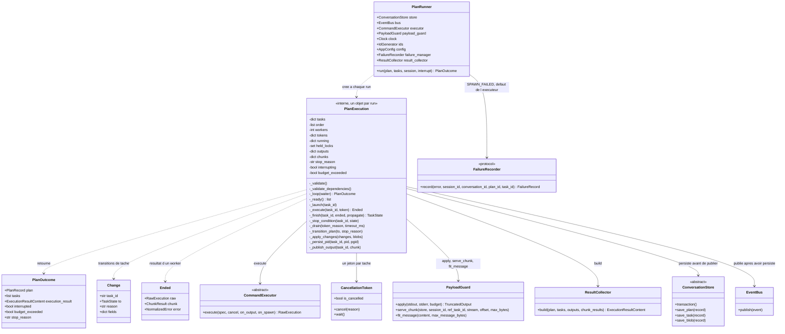
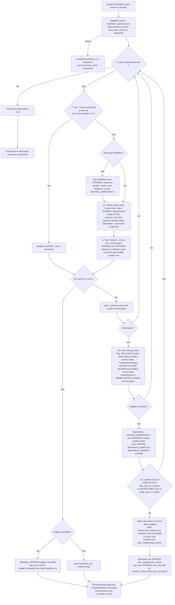
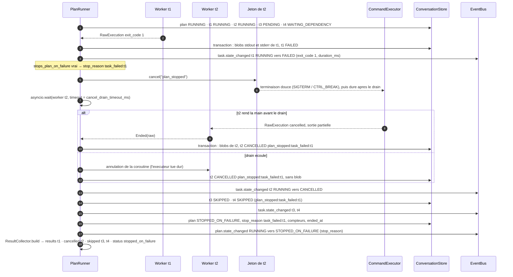
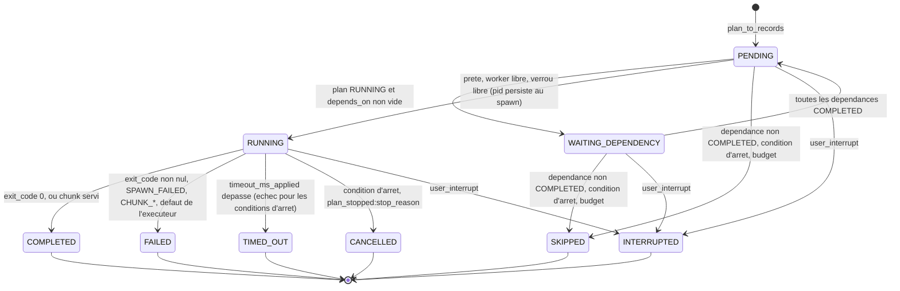

# Phase 5 — Exécution de plan

**Composants** : `execution/plan_runner.py` (`PlanRunner`, `PlanOutcome`, `FailureRecorder`, constantes de raisons), `execution/__init__.py` (exports), `testing/fake_executor.py` (extension additive du double de phase 4 : barrière `hold` / `release`, `active` / `max_active` / `spawn_order`, `wait_spawned`, `ignore_cancel`, `executor_error`).
**Gate** : `pytest -m phase5` entièrement vert · `ruff check` · `ruff format --check` · `mypy --strict`.
**État** : ✅ vert — 107 tests (`tests/unit/test_phase5_plan_execution.py`, aucun processus, aucune attente réelle au-delà de quelques millisecondes).

## 1. Objectif et périmètre

Le `PlanRunner` exécute **un** plan « exactement comme reçu » (§8.1) : il applique la politique séquentielle ou parallèle (§2.4), résout `depends_on`, fait respecter `resource_lock`, itère les tâches selon les onze étapes de §8.2, évalue les conditions d'arrêt (§8.3), draine les tâches en cours sur arrêt ou interruption (§8.4, ADR-003) et notifie chaque transition sur le bus (§3.7). Cette phase livre :

1. la **boucle d'ordonnancement** unique pour les deux politiques : `sequential` = un worker dans l'ordre strict d'`order_index` ; `parallel` = jusqu'à `max_parallel_workers` tâches `RUNNING`, choisies parmi les tâches **prêtes** (`PENDING`, dépendances `COMPLETED`, verrou libre) dans l'ordre de déclaration — lancement déterministe (ADR-017), seul l'ordre d'achèvement varie ;
2. la **propriété de toutes les transitions** de plan et de tâche (module map §2, règle 5) : `assert_transition` sur les tables de `domain/transitions.py`, puis persistance (record + blobs dans **une** transaction du store), puis publication (ADR-015) ; aucun état codé en dur hors des tables ;
3. les **règles d'arrêt** d'ADR-009 (règle effective des drapeaux, libellés `critical_task_failed` > `stop_plan_on_failure` > `task_failed` > `stop_plan_on_success`, `TIMED_OUT` = échec, ADR-008) avec drain borné par `cancel_drain_timeout_ms`, `CANCELLED` (`plan_stopped:<stop_reason>`) pour les tâches en cours et `SKIPPED` pour les restantes ;
4. l'**interruption utilisateur** (§8.4, ADR-006) : jeton observé avant chaque lancement **et** pendant les exécutions, drain borné par `interrupt_drain_timeout_ms`, tout ce qui reste `INTERRUPTED` (`user_interrupt`), plan `INTERRUPTED`, **aucun** `execution_result` ;
5. le **budget de durée entre deux tâches** (ADR-012 §3) : après l'échéance aucune tâche ne démarre, celles en cours finissent, les restantes sont `SKIPPED` (`budget_exceeded`) et le plan finit `FAILED` (`budget_exceeded:max_total_duration_ms`) avec un `execution_result` `failed` ;
6. le **cycle de vie d'une tâche `cmd`** : `pid` / `process_group_id` persistés dès `on_spawn` (ADR-016, sans événement), `task.output` publié depuis `on_output` (ADR-018), un `BlobRecord` par flux **même vide** (ADR-019 §1), `PayloadGuard.apply` avec `max_output_bytes_applied` (ADR-010/011), échec de spawn → `FAILED` / `SPAWN_FAILED` + `FailureRecord` (ADR-008 §4) ; et d'une **`chunk_request`** : `PayloadGuard.serve_chunk` → `COMPLETED` ou `FAILED` (`CHUNK_REF_NOT_FOUND`, `CHUNK_RANGE_INVALID`), sans timeout ;
7. le **`PlanOutcome`** : plan terminal (compteurs recalculés, `started_at` / `ended_at`), tâches dans l'ordre du plan, `execution_result` construit par le `ResultCollector` puis plafonné par `fit_message` — `None` si le plan est interrompu.

Hors périmètre : la décision de lancer un plan et la vérification de `max_plans` avant démarrage (`ProtocolOrchestrator`, phase 9) ; la transition de conversation / session et le nettoyage complet après interruption (`InterruptionHandler`, phase 6) ; l'envoi de l'`execution_result` (phase 9) ; la terminaison des orphelins au redémarrage (`RecoveryCoordinator`, phase 9) ; l'avertissement d'audit `CONTRADICTORY_FLAGS` (validateur du plan, phase 2/9).

## 2. Prérequis

- Phases 0, 1, 3, 4 vertes : `domain/transitions.py` (`PLAN_TRANSITIONS`, `TASK_TRANSITIONS`, `FAILED_TASK_STATES`, `TERMINAL_*`, `assert_transition`), `domain/models.py` (`PlanRecord`, `TaskRecord`, `BlobRecord`, `SessionRecord`), `domain/events.py` (`PLAN_STATE_CHANGED`, `TASK_STATE_CHANGED`, `TASK_OUTPUT`, `state_change_payload`), `domain/errors.py` (`TaskExecutionError`, `InvalidTransitionError`, `PersistenceError`, `GenericSystemError`), `domain/clock.py`, `domain/ids.py`, `config.py` (`ExecutionSection`, `PayloadSection`).
- Phase 4 : `execution/executor.py` (`CommandExecutor`, `CommandSpec`, `CancellationToken`, `RawExecution.outcome`, `OutputChunk`), `execution/payload_guard.py` (`apply`, `effective_budget`, `serve_chunk`, `fit_message`, `decode`), `execution/result_collector.py`, `testing/fake_executor.py`.
- Phase 3 : `ConversationStore` (`transaction`, `save_plan`, `save_task`, `save_blob`, `get_blob_for_task`, `read_blob_range`) et `InMemoryConversationStore` (`fail_next_write`).
- Phase 2 : `ProtocolAdapter.plan_to_records` — les tests fabriquent leurs plans à partir de JSON exactement comme l'orchestrateur (drapeaux effectifs, `timeout_ms_applied`, `max_output_bytes_applied` calculés par l'adaptateur).
- Phase 7 (optionnelle à l'exécution) : `FailureManager.record` pour les `FailureRecord` `TASK_EXECUTION_ERROR`.
- Phase 10 : contrat des payloads d'événements (guide phase 10 §4), vérifié ici par un test croisé `AuditLog` → `ExecutionTracker` → `TelemetryService`.
- Décisions applicables : ADR-003 (drains, terminaison deux temps), ADR-006 (interruption), ADR-007 (tables, `PENDING → FAILED` / `PENDING → INTERRUPTED` du plan), ADR-008 (`TIMED_OUT` = échec, `SPAWN_FAILED`, pas de retry, `chunk_request` sans timeout), ADR-009 (règle effective, `stop_reason`, `TaskRef` reasons, dépendances), ADR-010/011 (budgets, blobs, chunk), ADR-012 §3 (budget entre deux tâches), ADR-015 (persister → publier → agir), ADR-016 (`pid` dès le spawn), ADR-017 (ordre du plan, horloge et identifiants injectés), ADR-018 (`task.output`), ADR-019 §1 (un blob par flux même vide).

## 3. Conception

### 3.1 Les classes et leurs dépendances

Choix de conception :

| Sujet | Décision | Motif |
|---|---|---|
| Un objet d'exécution par `run` | `PlanRunner` est sans état ; `_PlanExecution` porte les records courants, les jetons, les futures, les verrous, les sorties tronquées et les chunks servis. | Plusieurs plans peuvent être exécutés par le même runner sans fuite d'état. |
| Verrous de ressource **dans l'ordonnanceur** | Un ensemble `held_locks` de clés tenues ; une tâche dont la clé est tenue n'est pas « prête » : elle reste `PENDING`, ne consomme **pas** de worker et sera choisie dès la libération, toujours dans l'ordre de déclaration. Deux tâches de même clé ne sont jamais `RUNNING` ensemble ; le verrou est libéré à l'étape 9 quel que soit le résultat (échec, timeout, annulation). | §2.4, §8.2 étapes 3 et 9. Équivalent observable d'un `asyncio.Lock` par clé (proposé par `03-execution-model` §3) sans bloquer un worker en attente, et sans dépendre de l'ordre de réveil des coroutines (ADR-017). |
| Jetons | Un `CancellationToken` **par tâche**, annulé par le runner (`plan_stopped` ou `user_interrupt`) ; le jeton d'interruption reçu par `run` est observé par un `waiter` concurrent aux exécutions **et** au sommet de chaque tour de boucle. | §8.2 étape 1, §8.4. |
| Drain | `asyncio.wait(futures, timeout=drain)` puis annulation des coroutines encore en vol (l'exécuteur tue dur et ne laisse aucun processus) ; une tâche qui a fini d'elle-même pendant le drain garde son **vrai** résultat ; une tâche forcée est enregistrée sans sortie ni blob. Le plan ne devient terminal qu'après le retour de toutes les annulations. | ADR-003, §17.2. |
| Budget vs conditions d'arrêt | La condition d'arrêt de la tâche qui **vient de finir** (étape 10) est évaluée avant la barrière de budget de la tâche **suivante** (« entre deux tâches ») ; une fois l'échéance observée par le runner, plus aucun lancement n'a lieu et le sort du plan est `FAILED` / `budget_exceeded` : les tâches encore en cours finissent normalement, gardent leur résultat réel, mais leurs drapeaux ne changent plus le statut du plan. | ADR-012 §3, §8.2. Deux tests épinglent ce point (§4.5). |
| Validation amont | Avant toute écriture : plan et tâches `PENDING` (`InvalidTransitionError` sinon), tâches du bon plan, identifiants uniques, dépendances connues, **sans cycle** (Kahn) et uniquement vers l'arrière en `sequential` — `ValueError`. | ADR-007 (l'adaptateur le garantit pour les plans du modèle ; les records construits à la main ont la même garantie plutôt qu'un ordonnanceur bloqué après avoir persisté le plan `RUNNING`). |
| Défaut de l'exécuteur | `TaskExecutionError` levée par `execute` (`OUTPUT_READ_FAILED`…) → tâche `FAILED`, `reason` = code, `exit_code = null`, sans blob, `FailureRecord` si un `FailureManager` est fourni ; le plan continue selon les drapeaux. Un échec de commande ou de spawn n'est jamais une exception (résultat de phase 4). | ADR-008 §4, §17.2 (jamais de plan laissé `RUNNING`). |
| `FailureRecorder` | Protocole structurel de `record(...)` : `execution` n'importe pas `resilience` (module map §2) ; le `FailureManager` de phase 7 le satisfait tel quel. | Règles de dépendance. |
| Déterminisme | Aucun `datetime.now` / `time.*` / `uuid` / `random` : `clock.now()` pour les estampilles, `clock.monotonic_ms()` pour `duration_ms`, `ids.blob_id()` pour les blobs ; les tâches finies dans un même tour sont traitées dans l'ordre de déclaration. | ADR-017 (test d'inspection du source). |

### 3.2 L'algorithme d'ordonnancement (§8.2 amendé)

L'étape 11 de §8.2 (« notifier le bus ») est réalisée à chaque transition, immédiatement après sa persistance (ADR-015) : il n'y a pas de publication différée.

### 3.3 Condition d'arrêt en parallèle avec drain (§8.3, ADR-003, ADR-009)

Plan `parallel`, `max_parallel_workers = 2` : `t1` échoue sans `continue_on_error`, `t2` tourne encore, `t3` est `PENDING`, `t4` dépend de `t2`.

L'interruption utilisateur suit exactement la même séquence avec le jeton reçu par `run`, la raison `user_interrupt`, le drain `interrupt_drain_timeout_ms`, les états `INTERRUPTED` pour **toutes** les tâches non terminales, le plan `INTERRUPTED` (`stop_reason = user_interrupt`, depuis `PENDING` ou `RUNNING`) et **aucun** `execution_result` (§8.4).

### 3.4 États d'une tâche pendant un plan parallèle (§5.3)

En mode `sequential`, `WAITING_DEPENDENCY` n'est jamais utilisé : les dépendances ne pointent que vers l'arrière (ADR-007), donc à son tour une tâche démarre ou est déjà `SKIPPED` par propagation.

### 3.5 Tables de référence

**Drapeaux → décision après la tâche (ADR-009, appliquée par `_stop_condition`)** — `stops_plan_on_failure = critical or stop_plan_on_failure or not continue_on_error` est lu sur la `TaskRecord` (calculé par l'adaptateur) ; le libellé suit la première ligne applicable :

| Issue de la tâche | Condition | `plan.status` | `stop_reason` | En cours (parallèle) | Restantes |
|---|---|---|---|---|---|
| `COMPLETED` | `stop_plan_on_success` | `SHORT_CIRCUITED_ON_SUCCESS` | `stop_plan_on_success:<id>` | `CANCELLED` `plan_stopped:<stop_reason>` | `SKIPPED` `plan_stopped:<stop_reason>` |
| `FAILED` / `TIMED_OUT` | `critical` | `STOPPED_ON_FAILURE` | `critical_task_failed:<id>` | idem | idem |
| `FAILED` / `TIMED_OUT` | `stop_plan_on_failure` | `STOPPED_ON_FAILURE` | `stop_plan_on_failure:<id>` | idem | idem |
| `FAILED` / `TIMED_OUT` | `not continue_on_error` | `STOPPED_ON_FAILURE` | `task_failed:<id>` | idem | idem |
| `FAILED` / `TIMED_OUT` | `continue_on_error` seul | le plan continue | — | — | dépendants `SKIPPED` `dependency_failed:<id>` |
| toutes terminales | — | `COMPLETED` | `null` | — | — |
| interruption | jeton levé | `INTERRUPTED` | `user_interrupt` | `INTERRUPTED` `user_interrupt` | `INTERRUPTED` `user_interrupt` |
| échéance de durée | avant un lancement | `FAILED` | `budget_exceeded:max_total_duration_ms` | finissent normalement | `SKIPPED` `budget_exceeded` |

Les 16 combinaisons des quatre drapeaux × {succès, échec} sont la table paramétrée `given_flag_combination_…` (32 cas), plus le cas « aucun drapeau » (défauts d'ADR-009 §1 : l'échec arrête le plan).

**Issue de l'exécution → état terminal de la tâche (`_finish`)** :

| Ce que rend le worker | État | `reason` | `exit_code` | Blobs | Autres champs |
|---|---|---|---|---|---|
| `RawExecution.outcome = COMPLETED` | `COMPLETED` | — | 0 | stdout + stderr | `truncated`, `original_size_bytes`, `*_total`, `*_range`, `duration_ms`, `pid` |
| `outcome = FAILED`, `spawn_error = None` | `FAILED` | — | ≠ 0 | stdout + stderr | idem |
| `outcome = FAILED`, `spawn_error` | `FAILED` | `SPAWN_FAILED` | `null` | vides | `pid = null` ; `FailureRecord` `TASK_EXECUTION_ERROR` si `failure_manager` |
| `outcome = TIMED_OUT` | `TIMED_OUT` | — | `null` | sortie capturée | `timed_out = true` |
| `outcome = CANCELLED` (jeton du runner) | `CANCELLED` ou `INTERRUPTED` | `plan_stopped:<stop_reason>` ou `user_interrupt` | `null` | sortie partielle | — |
| coroutine forcée après le drain | `CANCELLED` ou `INTERRUPTED` | idem | `null` | **aucun** | `stdout_ref` / `stderr_ref` nuls |
| `ChunkResult` | `COMPLETED` | — | `null` | — | résultat conservé pour le `ResultCollector` |
| `ChunkError` | `FAILED` | `CHUNK_REF_NOT_FOUND` / `CHUNK_RANGE_INVALID` | `null` | — | — |
| `TaskExecutionError` levée par l'exécuteur | `FAILED` | code de l'erreur | `null` | **aucun** | `pid` du spawn conservé ; `FailureRecord` si `failure_manager` |

**Événements publiés (contrat du guide phase 10 §4)** — tous portent `session_id`, `conversation_id`, `cycle_id`, `plan_id` du plan, `task_id` pour les événements de tâche, `timestamp = clock.now()` du record persisté :

| `EventType` | Quand | Payload |
|---|---|---|
| `plan.state_changed` | chaque transition du plan | `{"from", "to", "stop_reason"?}` — `stop_reason` présent sur les états terminaux avec raison (`COMPLETED` n'en a pas) |
| `task.state_changed` | chaque transition de tâche | `{"from", "to", "reason"?}` + sur les transitions depuis `RUNNING` : `"exit_code"`, `"duration_ms"`, `"timed_out"`, `"truncated"` |
| `task.output` | chaque tranche `on_output` | `{"stream", "offset", "size", "data"}` (`data` décodé UTF-8 avec remplacement, jamais d'octets bruts) ; non audité |
| `failure.recorded` | via `FailureManager.record` | après la transition `FAILED` de la tâche |

Aucun événement n'accompagne la persistance du `pid` (mise à jour silencieuse, ADR-016).

**Clés de configuration lues** : `execution.cwd`, `execution.shell` (→ `CommandSpec`), `execution.cancel_drain_timeout_ms`, `execution.interrupt_drain_timeout_ms`, `execution.default_task_timeout_ms` / `max_task_timeout_ms` (repli si `timeout_ms_applied` manque), `payload.max_message_bytes` (`fit_message`) et, par le `PayloadGuard`, les bornes d'ADR-010 (repli si `max_output_bytes_applied` manque).

## 4. Plan de tests

Fichier `tests/unit/test_phase5_plan_execution.py` (`phase5`), 107 tests. Doubles uniquement : `FakeCommandExecutor`, `FakeClock`, `InMemoryConversationStore`, `EventBus` + `RecordingSubscriber`, `SequentialIdGenerator` ; plans produits par `ProtocolAdapter.plan_to_records` depuis du JSON. Toute attente réelle est bornée (`asyncio.wait_for(…, 1 s)`), les drains forcés utilisent 10 ms.

### 4.1 Barrière du double (4)

| Test | Vérifie | Réf. |
|---|---|---|
| `given_held_script_when_released_then_completes_with_scripted_result` | `hold`, `wait_spawned`, `active`, `is_held`, `release`, `max_active`, `spawn_order` | §18.3 |
| `given_held_script_when_token_cancelled_then_cancelled_like_a_hang` · `…_ignoring_cancel_when_token_cancelled_then_still_held_until_release` | le jeton libère la barrière (`cancelled`) sauf `ignore_cancel` | ADR-003 |
| `given_two_held_scripts_when_both_running_then_active_and_peak_tracked` | pic de concurrence observable | §2.4 |

### 4.2 Séquentiel nominal (6)

| Test | Vérifie | Réf. |
|---|---|---|
| `given_sequential_plan_of_three_tasks_when_run_then_tasks_execute_in_order_and_plan_completed` | ordre des appels, un seul actif, états, `attempt_count = 1`, `PlanOutcome` = store, résultats dans l'ordre | §8.2, ADR-017 |
| `given_cmd_task_with_empty_streams_when_run_then_one_blob_per_stream_persisted_even_empty` | `blob-0001`… par flux, même vides, `stdout_ref` / `stderr_ref` | ADR-019 §1 |
| `given_sequential_plan_when_run_then_state_changes_published_in_order_with_ids` | séquence exacte des événements, identifiants, payloads `{from,to}` et terminal `{exit_code,duration_ms,timed_out,truncated}` | ADR-015, phase 10 §4 |
| `given_plan_when_run_then_timestamps_and_durations_come_from_the_injected_clock` | `started_at` / `ended_at` / `duration_ms` = `FakeClock` | ADR-017 |
| `given_cmd_task_when_run_then_command_spec_carries_applied_timeout_cwd_and_shell` · `given_default_shell_when_run_then_spec_shell_is_none` | `CommandSpec(timeout_ms_applied plafonné, cwd, shell or None)` | ADR-003, ADR-008 |

### 4.3 Conditions d'arrêt (41)

| Test | Vérifie | Réf. |
|---|---|---|
| `given_failed_task_with_continue_on_error_when_plan_runs_then_next_tasks_run_and_plan_completed` | poursuite, `failed_task_count`, résultat `failed` puis `completed` | §8.3 |
| `given_failed_task_without_continue_on_error_when_plan_runs_then_stopped_on_failure_and_remaining_skipped` | `task_failed:t2`, restantes `SKIPPED` `plan_stopped:task_failed:t2`, `execution_result`, payload plan | ADR-009 |
| `given_critical_task_failing_…_then_stop_reason_is_critical_task_failed` · `given_stop_plan_on_failure_task_failing_…` | libellés `critical_task_failed` / `stop_plan_on_failure` (priorité) | ADR-009 §3 |
| `given_stop_plan_on_success_task_completing_…_then_short_circuited_and_remaining_skipped` · `…_failing_with_continue_on_error_…_then_plan_continues` | `SHORT_CIRCUITED_ON_SUCCESS`, succès seulement | §8.3 |
| `given_timed_out_task_with_stop_on_failure_when_plan_runs_then_plan_stopped_on_failure` · `…_with_continue_on_error_…_then_plan_continues` | `TIMED_OUT` = échec, `timed_out`, `exit_code = null`, `timeout_ms_applied` | ADR-008 §4 |
| `given_flag_combination_when_first_task_ends_then_plan_status_and_stop_reason_follow_adr_009` (×32) | les 16 combinaisons × {succès, échec} | ADR-009 |
| `given_task_without_any_flag_when_it_fails_then_plan_stops_with_task_failed` | défauts des champs absents | ADR-009 §1 |

### 4.4 Parallèle (11)

| Test | Vérifie | Réf. |
|---|---|---|
| `given_parallel_plan_with_two_workers_when_run_then_never_more_than_two_tasks_running` | jamais plus de `max_parallel_workers` actives (barrière), relance dans l'ordre | §2.4 |
| `given_parallel_plan_when_tasks_complete_out_of_order_then_results_follow_plan_order` | lancement déterministe, achèvement inverse, résultats dans l'ordre du plan | ADR-017 |
| `given_parallel_plan_with_dependency_when_run_then_dependent_waits_then_pending_then_runs` | `PENDING → WAITING_DEPENDENCY → PENDING → RUNNING → COMPLETED` | §5.3 |
| `given_dependency_failed_with_continue_on_error_when_plan_runs_then_dependent_skipped_and_plan_completed` | `dependency_failed:t1` puis `dependency_skipped:t2` (transitif) même si le plan continue | ADR-009 §5 |
| `given_sequential_plan_with_failed_dependency_when_run_then_dependent_skipped_without_waiting_state` | en séquentiel : `PENDING → SKIPPED` directement | ADR-007 |
| `given_two_tasks_sharing_a_resource_lock_when_run_in_parallel_then_never_running_together` · `given_lock_held_by_failed_task_when_released_then_next_holder_runs` | exclusion mutuelle, attente sans changement d'état, libération après échec | §2.4, §8.2 étape 9 |
| `given_parallel_stop_condition_when_a_task_fails_then_running_cancelled_after_drain_and_pending_skipped` | `cancellations == [(t2, plan_stopped)]`, `CANCELLED` `plan_stopped:task_failed:t1`, sortie partielle en blob, plan terminal après les annulations, `TaskRef` | §8.3, §17.2 |
| `given_parallel_short_circuit_when_a_task_succeeds_then_running_cancelled_with_success_reason` | même mécanique pour `stop_plan_on_success` | §2.4 |
| `given_task_ignoring_cancellation_when_plan_stops_then_forced_after_cancel_drain_timeout` | terminaison forcée après `cancel_drain_timeout_ms` (10 ms), sans blob, `active` vide | ADR-003 |
| `given_two_tasks_ending_in_the_same_round_when_first_stops_the_plan_then_second_keeps_its_real_outcome` | une tâche finie dans le même tour garde `COMPLETED` | ADR-017 |

### 4.5 Interruption (4) et budget (6)

| Test | Vérifie | Réf. |
|---|---|---|
| `given_interrupt_signalled_before_first_task_when_run_then_everything_interrupted_without_result` | `PENDING → INTERRUPTED` (plan et tâches), pas d'appel, `execution_result None`, payload `stop_reason user_interrupt` | §8.4, ADR-007 |
| `given_running_plan_when_user_interrupts_then_all_tasks_marked_interrupted` | tâche pendante annulée avec `user_interrupt`, `RUNNING/PENDING/WAITING → INTERRUPTED`, blob partiel, < 0,4 s | §8.4, §18.2 |
| `given_task_ignoring_cancellation_when_user_interrupts_then_forced_within_interrupt_drain_timeout` | borne `interrupt_drain_timeout_ms` + marge | §2.9 |
| `given_interrupt_between_two_sequential_tasks_when_next_task_due_then_not_started` | jeton levé pendant la publication de la fin de t1 → t2 jamais lancée | §8.2 étape 1 |
| `given_deadline_passed_between_tasks_when_next_task_due_then_plan_failed_and_remaining_skipped` | t1 finit, t2/t3 `SKIPPED` `budget_exceeded`, plan `FAILED`, résultat `failed` | ADR-012 §3 |
| `given_deadline_already_passed_when_run_then_no_task_started_and_plan_failed_from_pending` | `PENDING → FAILED`, échéance inclusive | ADR-007 |
| `given_session_without_started_at_when_run_then_duration_budget_not_checked` | pas de contrôle sans `started_at` | — |
| `given_parallel_plan_over_deadline_when_running_task_finishes_then_it_completes_and_no_new_task_starts` | une tâche lancée n'est jamais tuée pour le budget | ADR-012 §3 |
| `given_task_pushing_past_deadline_when_it_fails_with_stop_flag_then_stop_condition_wins_over_budget` | étape 10 avant la barrière de budget | §8.2 |
| `given_deadline_observed_when_a_still_running_task_later_fails_with_stop_flag_then_plan_failed_for_budget` | après l'échéance observée, le sort du plan est `FAILED` / budget | ADR-012 §3 |

### 4.6 `chunk_request` (6), spawn et défauts de l'exécuteur (5), pid / live / troncature (4)

| Test | Vérifie | Réf. |
|---|---|---|
| `given_chunk_request_on_stored_blob_when_run_then_completed_with_exact_bytes` | aucun appel à l'exécuteur, `COMPLETED`, `range/total/eof/data` exacts | ADR-011 |
| `given_chunk_request_on_known_task_without_blob_when_run_then_failed_chunk_ref_not_found` · `…_with_offset_beyond_total_…_then_failed_chunk_range_invalid_and_plan_stops` · `…_on_empty_stream_of_executed_task_…_then_range_invalid_not_ref_not_found` | erreurs de chunk = tâche `FAILED` avec code, drapeaux appliqués | ADR-008 §5, ADR-019 §1 |
| `given_chunk_request_referencing_earlier_task_of_same_plan_when_run_then_served_from_fresh_blob` · `…_with_max_bytes_over_hard_limit_…_then_capped_by_adapter` | lecture d'un blob du même plan (stdout et stderr), plafond | ADR-011 |
| `given_spawn_error_when_task_runs_then_failed_with_spawn_failed_reason_and_null_exit_code` · `…_with_failure_manager_…_then_failure_record_task_execution_error` | `SPAWN_FAILED`, `pid = null`, `FailureRecord` (`origin CommandExecutor`, détails), ordre `FAILED` puis `failure.recorded` | ADR-008 §4 |
| `given_executor_raising_task_execution_error_when_task_runs_then_task_failed_with_error_code` · `…_with_failure_manager_…_then_failure_recorded_and_plan_stopped` · `given_executor_raising_in_parallel_when_task_fails_then_other_running_task_cancelled_after_drain` | `TaskExecutionError` → `FAILED` `OUTPUT_READ_FAILED`, sans blob, `pid` du spawn conservé, `FailureRecord`, drain des autres | ADR-008 §4, §17.2 |
| `given_spawned_task_when_on_spawn_called_then_pid_persisted_silently` | `pid` / `pgid` persistés pendant `RUNNING`, aucun événement | ADR-016 |
| `given_scripted_output_chunks_when_task_runs_then_task_output_events_in_order_with_offsets` | `task.output` `{stream,offset,size,data}`, ordre, `audited False`, encadrés par `RUNNING` et `COMPLETED` | ADR-018 |
| `given_output_over_declared_budget_when_task_runs_then_truncation_metadata_persisted_and_reported` · `given_plan_default_max_output_bytes_when_task_declares_none_then_plan_default_applied` | `truncated`, `original_size_bytes`, `ranges`, blob jamais tronqué, défaut du plan | ADR-010/011 |

### 4.7 Compteurs (2), persistance avant publication (3), transitions et graphe invalides (11), déterminisme et contrat (4)

| Test | Vérifie | Réf. |
|---|---|---|
| `given_mixed_outcomes_when_plan_ends_then_plan_counters_recomputed_and_persisted` · `given_plan_outcome_when_returned_then_tasks_in_plan_order_and_equal_to_store` | compteurs §4.1 (`TIMED_OUT` compté en échec), aucune tâche `RUNNING` résiduelle, `PlanOutcome` | §4.1 |
| `given_store_failing_on_first_write_when_run_then_persistence_error_and_no_event` · `…_on_terminal_write_when_task_ends_then_error_propagates_without_terminal_event` · `…_on_pid_write_when_spawned_…` | `fail_next_write` → `PersistenceError` propagée, transition ni appliquée ni publiée, blob annulé par la transaction | ADR-015 |
| `given_plan_not_pending_when_run_then_invalid_transition_error_and_nothing_happens` (×6) · `given_task_not_pending_when_run_then_invalid_transition_error_before_any_write` · `given_task_of_another_plan_when_run_then_value_error` | tables de transitions, rien n'est écrit | §5.2, §5.3 |
| `given_parallel_plan_with_dependency_cycle_when_run_then_value_error_before_any_write` · `given_sequential_plan_with_forward_dependency_…` · `given_task_depending_on_itself_…` | validation amont du graphe | ADR-007 |
| `given_same_plan_run_twice_on_fresh_doubles_when_compared_then_events_and_result_identical` | événements (types, ids, horodatages, payloads) et `execution_result` identiques à l'octet | ADR-017 |
| `given_phase5_events_when_consumed_by_audit_tracker_and_telemetry_then_phase10_contract_honoured` | chaîne d'audit valide sans `task.output`, snapshot cohérent pendant et après (`running_task_ids`, compteurs), métriques `task_terminal_total` / `plan_terminal_total` / `task_duration_ms` | phase 10 §4, §11.2 |
| `given_plan_runner_module_when_inspected_then_no_wall_clock_or_randomness` · `given_execution_package_when_imported_then_plan_runner_exported` | hygiène, exports | ADR-017 |

## 5. Étapes TDD suivies

1. Lecture de la spec (§2.4, §3.7, §5.2, §5.3, §8, §18.2), des ADR 003/006/007/008/009/010/011/012/015/016/017/018/019, de `03-execution-model.md`, du contrat d'événements de la phase 10, puis du code des phases 4, 3, 1, 0 (`executor`, `payload_guard`, `result_collector`, `fake_executor`, `models`, `transitions`, `events`, `interface`, `failure_manager`, `plan_to_records`).
2. **Rouge** : fichier de tests écrit section par section (harnais qui fabrique les plans par `plan_to_records`, barrière du fake, séquentiel, table ADR-009, parallèle, interruption, budget, chunks, spawn, pid/live/troncature, compteurs, ADR-015, transitions invalides, déterminisme) → `ImportError` puis échecs.
3. **Vert** : extension additive du `FakeCommandExecutor` (barrière `hold`/`release`, `active`, `max_active`, `spawn_order`, `wait_spawned`, `ignore_cancel`), puis `plan_runner.py` : validation, boucle unique, `_ready`, `_launch`, `_finish`, propagation des dépendances, conditions d'arrêt, drains, budget, `_apply_changes` / `_transition_plan` (persister puis publier), `_persist_pid`, `_publish_output`.
4. **Refactor** sous tests verts : un objet `_PlanExecution` par `run`, verrous portés par l'ordonnanceur, traitement des tâches finies dans l'ordre du plan, sortie partielle conservée dans les blobs sur annulation.
5. **Revue critique → rouge → vert** : (a) un graphe cyclique ou une arête « en avant » en `sequential` (records construits à la main) bloquait l'ordonnanceur **après** avoir persisté le plan `RUNNING` (`PLAN_SCHEDULER_STALLED`) → trois tests, validation amont par Kahn ; (b) une `TaskExecutionError` levée par l'exécuteur traversait `run` et laissait le plan `RUNNING` → trois tests, option `executor_error` du fake, tâche `FAILED` + `FailureRecord` ; (c) deux tests épinglent l'ordre « condition d'arrêt de la tâche finie » puis « barrière de budget » ; (d) test croisé avec les abonnés réels de la phase 10.
6. `ruff check`, `ruff format`, `mypy --strict` verts ; suite complète rejouée ; rédaction de ce guide et validation des diagrammes Mermaid.

## 6. Gate

| Contrôle | Commande | Résultat |
|---|---|---|
| Tests de la phase | `.venv/bin/pytest -q -m phase5` | 107 verts (≈ 0,6 s) |
| Suite complète | `.venv/bin/pytest -q` | 1 922 verts (1 737 des phases livrées + 107 phase 5 + 78 de la phase 8 livrée en parallèle) |
| Lint | `.venv/bin/ruff check src/agentic_local_app/execution/plan_runner.py src/agentic_local_app/execution/__init__.py src/agentic_local_app/testing/fake_executor.py tests/unit/test_phase5_plan_execution.py` | ✅ |
| Format | `.venv/bin/ruff format --check` (mêmes chemins) | ✅ |
| Types | `.venv/bin/mypy --strict` (mêmes chemins) | ✅ |
| Diagrammes | `check_mermaid.py docs/phases/phase-05-plan-execution.md` | 4/4 rendus |

## 7. Résultat

- **107 tests** : 4 barrière du double, 6 séquentiel, 41 conditions d'arrêt (dont la table 16 × 2), 11 parallèle, 4 interruption, 6 budget, 6 `chunk_request`, 5 spawn / défauts de l'exécuteur, 4 pid / live / troncature, 2 compteurs, 3 persistance avant publication, 11 transitions et graphe invalides, 4 déterminisme et contrat.
- Fichiers livrés : `src/agentic_local_app/execution/plan_runner.py`, `src/agentic_local_app/execution/__init__.py` (exports), `src/agentic_local_app/testing/fake_executor.py` (additif), `tests/unit/test_phase5_plan_execution.py`, ce guide.
- Exigences couvertes : §2.4 (politiques, `depends_on`, `resource_lock`, `max_parallel_workers`, annulation avec drain sur `stop_plan_on_failure` / `stop_plan_on_success`), §2.9 et §8.4 (interruption immédiate, drain borné, `INTERRUPTED`, pas d'`execution_result`), §3.7 (toutes les responsabilités), §5.2 / §5.3 (transitions par les tables uniquement), §8.1–§8.5, §17.1 (déterminisme, persistance avant exploitation), §17.2 (drain avant état terminal, jamais de plan laissé `RUNNING`), §18.2 Phase 5 (les six puces), §18.3, §18.4 ; ADR-003, ADR-006, ADR-007, ADR-008 §4–§5, ADR-009 §1–§5, ADR-010, ADR-011, ADR-012 §3, ADR-015, ADR-016 §1, ADR-017, ADR-018, ADR-019 §1 ; contrat des payloads du guide phase 10 §4.
- Signature effective : `PlanRunner(store, bus, executor, payload_guard, clock, ids, config, *, failure_manager=None, result_collector=None)` · `async run(plan, tasks, session, *, interrupt: CancellationToken) -> PlanOutcome(plan, tasks, execution_result, interrupted, budget_exceeded, stop_reason)`.

## 8. Points ouverts

1. **Module map §3** : la ligne `PlanRunner(store, bus, executor, payload_guard, clock, config, interrupt_signal)` / `run(plan, tasks, session)` est à aligner sur la signature effective (jeton d'interruption passé à `run`, `ids` et `failure_manager` injectés) ; `docs/phases/README.md` doit passer la phase 5 à « ✅ vert — 107 tests ». Hors périmètre de cette livraison.
2. **Verrous dans l'ordonnanceur plutôt qu'`asyncio.Lock`** (`03-execution-model` §3) : comportement observable identique (jamais deux tâches de même clé `RUNNING`, attente sans changement d'état, libération à l'étape 9), mais une tâche en attente de verrou ne consomme pas de worker, ce qui peut lancer une tâche plus loin dans l'ordre pendant l'attente. Une ligne du document d'architecture pourrait l'entériner.
3. **Budget observé vs drapeaux d'arrêt tardifs** (§3.1) : après l'échéance observée, l'échec d'une tâche encore en cours ne change plus le statut du plan (`FAILED` / `budget_exceeded`). ADR-012 §3 et ADR-009 ne tranchent pas explicitement ce croisement ; le choix est épinglé par un test et pourrait être confirmé par un ADR.
4. **Blobs d'un échec de spawn** : deux blobs vides sont persistés (la commande a atteint l'exécuteur), donc une `chunk_request` vers cette tâche donne `CHUNK_RANGE_INVALID` et non `CHUNK_REF_NOT_FOUND` ; une tâche forcée après le drain ou victime d'un défaut de l'exécuteur n'a **aucun** blob (`CHUNK_REF_NOT_FOUND`). À confirmer par ADR-019 §1 si la distinction importe.
5. **`PLAN_SCHEDULER_STALLED`** (`GenericSystemError`) reste une garde défensive : avec la validation amont, il est inatteignable ; il signalerait un défaut du runner lui-même.
6. **Échec de publication** : une `PersistenceError` de l'`AuditLog` (abonné critique) pendant `bus.publish` se propage depuis `run` après la persistance de la transition ; le plan reste alors `RUNNING` dans le store et relève de la reprise (ADR-016). Cohérent avec ADR-015 (l'audit est un état critique) ; à documenter dans la phase 9.
7. **Interruption pendant une `chunk_request`** : lecture locale synchrone, jamais réellement « en cours » ; la tâche garde son vrai résultat même si le jeton est levé au même instant.
