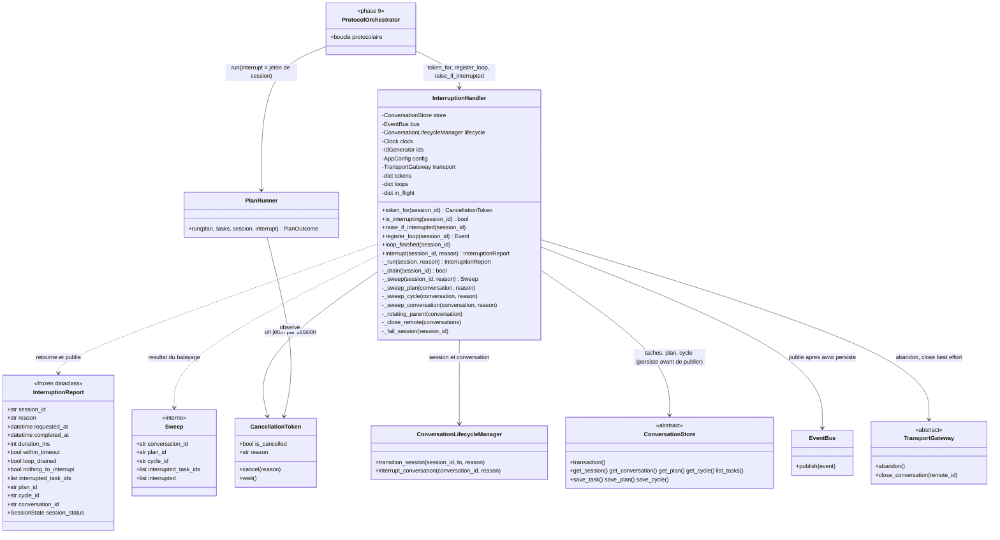
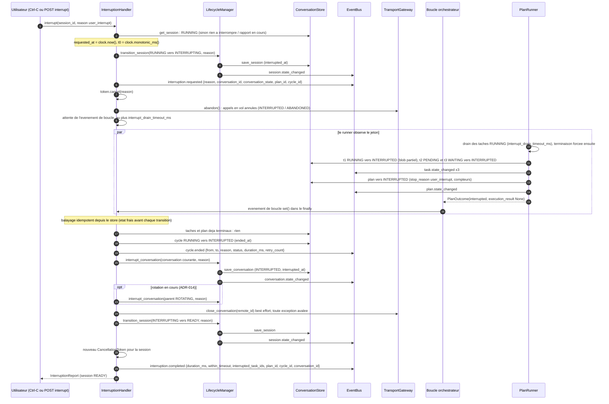
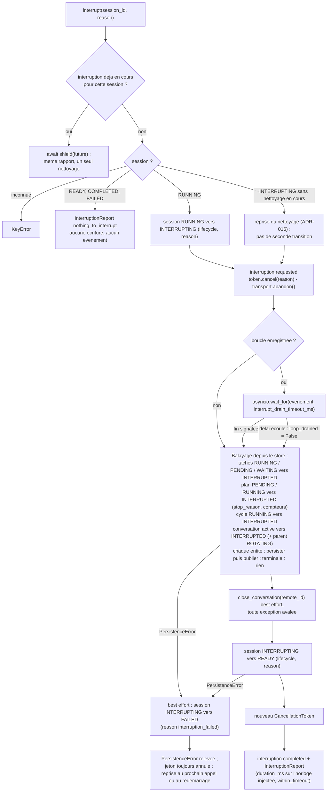
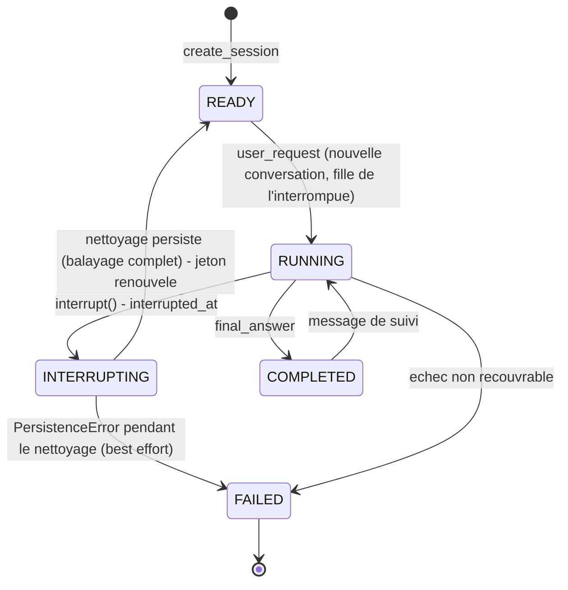

# Phase 6 — Interruption

**Composants** : `interruption/handler.py` (`InterruptionHandler`, `InterruptionReport`, constantes `USER_INTERRUPT_REASON`, `INTERRUPTION_FAILED_REASON`, `CYCLE_ENTITY`), `interruption/__init__.py` (exports).
**Gate** : `pytest -m phase6` entièrement vert · `ruff check` · `ruff format --check` · `mypy --strict`.
**État** : ✅ vert — 48 tests (`tests/unit/test_phase6_interruption.py`, aucun processus, aucun réseau, attentes réelles bornées à 200 ms).

## 1. Objectif et périmètre

L'utilisateur peut interrompre la session « à tout instant, quel que soit l'état » (§2.9). L'`InterruptionHandler` reçoit le signal, fait cesser la boucle protocolaire et le `PlanRunner`, attend un drain **borné**, marque `INTERRUPTED` tout ce qui était en cours, persiste et audite chaque marquage, puis rend la session `READY` (§3.4, §9). Deux niveaux, arbitrés par ADR-006 : la **conversation** finit `INTERRUPTED` (terminal, conservée pour l'audit) et la **session** passe `RUNNING → INTERRUPTING → READY` ; une nouvelle `user_request` ouvre ensuite une conversation **fille** dans la même session. Rien n'est jamais envoyé au modèle (§8.4) ; la conversation distante est fermée en *best effort*, hors du chemin critique.

Cette phase livre :

1. le **jeton de session** (`token_for`) : un `CancellationToken` par session, créé à la demande, que l'orchestrateur passe à `PlanRunner.run(..., interrupt=...)` et surveille autour de ses appels de transport (`raise_if_interrupted` lève `SessionInterruptedError`) ; il est **remplacé** par un jeton neuf quand la session redevient `READY` ;
2. l'**enregistrement de la boucle** (`register_loop` / `loop_finished`) : l'événement « boucle terminée » que l'orchestrateur `set()` dans son `finally`, et que le handler attend au plus `execution.interrupt_drain_timeout_ms` ;
3. la **procédure `interrupt`** (§9 amendé) : garde-fous (session inconnue, rien à interrompre, interruption déjà en cours), session `INTERRUPTING`, `interruption.requested`, annulation du jeton, `abandon()` du transport, drain borné, **balayage idempotent** depuis le store (tâches → plan → cycle → conversation, et le parent `ROTATING` d'une rotation en cours, ADR-014), fermeture distante best effort, session `READY`, `interruption.completed`, `InterruptionReport` ;
4. la **robustesse** : idempotence face à un `PlanRunner` qui a déjà marqué ses tâches, appels concurrents fusionnés en un seul nettoyage, échec de persistance → session `FAILED` en best effort puis erreur propagée, reprise du nettoyage d'une session laissée `INTERRUPTING` (même chemin que la reprise après crash, ADR-016, `reason = restart`).

Hors périmètre : l'arrêt de la boucle protocolaire elle-même et la levée de `SessionInterruptedError` dans les appels de transport (`ProtocolOrchestrator`, phase 9) ; la façade `ConversationManager.interrupt` et `POST /sessions/{sid}/interrupt` (phase 9, ADR-002/018) ; la terminaison des orphelins et la politique de reprise complète (`RecoveryCoordinator`, phase 9) ; la mécanique de terminaison en deux temps des processus (phase 4, ADR-003) et le marquage des tâches par le runner pendant son propre drain (phase 5).

## 2. Prérequis

- Phase 1 : `ConversationLifecycleManager` (`transition_session`, `interrupt_conversation`, `create_conversation`, `update_conversation`), tables `SESSION_TRANSITIONS`, `CONVERSATION_TRANSITIONS`, `ACTIVE_CONVERSATION_STATES`.
- Phase 5 : `PlanRunner.run(plan, tasks, session, *, interrupt: CancellationToken)`, `PlanOutcome.interrupted`, drain `interrupt_drain_timeout_ms`, constantes `INTERRUPT_REASON`, `PLAN_ENTITY`, `TASK_ENTITY` ; phase 4 : `CancellationToken` (`cancel(reason)`, `is_cancelled`, `reason`, `wait()`), `FakeCommandExecutor` (`hang_until_cancelled`, `hold` / `ignore_cancel`, `cancellations`).
- Phase 3 / 0 : `ConversationStore` (`transaction`, `get_*`, `list_tasks`, `save_task` / `save_plan` / `save_cycle`), `InMemoryConversationStore.fail_next_write`, tables `PLAN_TRANSITIONS`, `TASK_TRANSITIONS`, `CYCLE_TRANSITIONS`, `FAILED_TASK_STATES`, `assert_transition`.
- Phase 7 : `TransportGateway` (`abandon()`, `close_conversation`) et `FakeTransportGateway` (`hang_next`, `wait_until_hanging`, `enqueue_error`, `closed`, `posted`).
- Phase 10 : contrat des payloads (guide phase 10 §4) — vérifié ici par un test croisé `AuditLog` → `ExecutionTracker` → `TelemetryService`.
- Phase 2 : `ProtocolAdapter.plan_to_records` pour fabriquer les plans des tests exactement comme l'orchestrateur.
- Décisions applicables : ADR-006 (deux niveaux, terminalité, nouvelle conversation fille, rien au modèle, fermeture best effort), ADR-007 (machines à états, `INTERRUPTING → FAILED`, `PENDING → INTERRUPTED` du plan, cycle `RUNNING → INTERRUPTED`), ADR-014 (rotation en cours : parent **et** enfant `INTERRUPTED`), ADR-015 (persister → publier → agir, idempotence), ADR-016 (même chemin pour la reprise, `reason = restart`), ADR-017 (horloge et identifiants injectés).

## 3. Conception

### 3.1 Les classes et leurs dépendances

Choix de conception :

| Sujet | Décision | Motif |
|---|---|---|
| Deux niveaux | La conversation courante finit `INTERRUPTED` (terminal) via `lifecycle.interrupt_conversation` ; la session fait `RUNNING → INTERRUPTING → READY` via `lifecycle.transition_session`, avec la **même** `reason` sur les deux transitions (`user_interrupt`, ou `restart` en reprise). | ADR-006, ADR-016 : l'audit relie toutes les transitions d'une interruption à la même cause. |
| Un jeton par session, renouvelé | `token_for` crée le jeton à la demande ; `interrupt` l'annule (`cancel(reason)`) et le **remplace** après `READY`. L'ancien jeton reste annulé (une boucle attardée s'arrête), le nouveau est vierge pour la prochaine `user_request`. | §8.4 (le runner observe le jeton), §19.16 (nouvelle demande acceptée aussitôt). |
| Drain = attente de la boucle | Le handler n'attend pas les tâches une à une : il attend l'événement `register_loop` que l'orchestrateur `set()` en `finally` (le `PlanRunner`, lui, draine ses tâches avec le même `interrupt_drain_timeout_ms`). Sans boucle enregistrée, aucune attente. | §3.4 « attendre le drain » ; le propriétaire nominal des transitions de tâches reste le runner (ADR-015, point ouvert n°2 du document 07). |
| Balayage idempotent | Après le drain, tout est **relu depuis le store** : seules les entités non terminales sont transitionnées (`assert_transition` sur les tables), chacune persistée puis publiée. Une entité déjà `INTERRUPTED` (par le runner, l'orchestrateur…) n'est **jamais** retouchée. | §17.1 (état terminal entièrement persisté), ADR-015 ; robustesse face à un runner encore en train de marquer. |
| Ordre du balayage | tâches (ordre du plan) → plan → cycle → conversation, puis le parent `ROTATING` éventuel (ses tâches, plan, cycle, conversation). | §9 ; l'ordre des événements d'audit reproduit l'ordre du flux. |
| Rotation en cours | La conversation courante est l'enfant ; si son `parent_conversation_id` est encore `ROTATING`, le parent est balayé à son tour (`INTERRUPTED`, fermeture distante best effort). Un parent déjà `CLOSED` n'est pas touché. | ADR-014. |
| Rien au modèle | Aucun POST, aucun GET, aucun `init` ; seul `close_conversation(remote_id)` est tenté, dans un `try` qui avale **toute** exception, après le balayage et avant `READY`. | §8.4, ADR-006 §4. |
| Concurrence | Un `Future` par session en cours d'interruption : un second appel pendant le nettoyage attend (`asyncio.shield`) et reçoit le **même** rapport ; un second appelant annulé n'annule pas le nettoyage. | §2.9 (« à tout instant »), Ctrl-C répétés (ADR-002). |
| Échec de persistance | Après la transition `INTERRUPTING`, toute `PersistenceError` (store ou `AuditLog`, abonné critique) déclenche `INTERRUPTING → FAILED` en best effort (`reason = interruption_failed`) puis est relevée ; le jeton reste annulé. Un appel ultérieur sur une session restée `INTERRUPTING` **reprend** le nettoyage (pas de seconde transition `RUNNING → INTERRUPTING`). | ADR-015, ADR-016 (« un crash pendant le nettoyage reprend le nettoyage là où il s'était arrêté »). |
| Déterminisme | `requested_at` / `completed_at` = `clock.now()`, `duration_ms` = `clock.monotonic_ms()` ; seule l'attente réelle passe par `asyncio.wait_for`. Le handler ne génère aucun identifiant (`ids` reçu pour le câblage). | ADR-017 (test d'inspection du source). |

### 3.2 Flux d'interruption (§9 amendé par ADR-006)

Conversation `RUNNING_PLAN`, une tâche `RUNNING` qui honore le signal, une `PENDING`, une `WAITING_DEPENDENCY` ; le `PlanRunner` marque ses tâches et son plan pendant le drain, le handler finit le travail par le balayage.

Si la boucle ne signale pas sa fin dans le délai (`loop_drained = False`), le balayage marque lui-même les tâches encore `RUNNING` / `PENDING` / `WAITING_DEPENDENCY`, le plan (`PENDING` ou `RUNNING`) et le cycle : c'est la garantie défensive de §3.4 « marquer toutes les entités affectées ».

### 3.3 La procédure du handler

### 3.4 Machine à états de la session (ADR-006 / ADR-007)

`READY`, `COMPLETED` et `FAILED` : rien à interrompre (`nothing_to_interrupt`, sans écriture ni événement). `INTERRUPTING` : un nettoyage en cours est rejoint, un nettoyage abandonné est repris.

### 3.5 États des entités après une interruption

| Entité | État avant | État après | Champs posés par le handler | Événement (`reason` = celle de l'appel) | Réf. |
|---|---|---|---|---|---|
| Tâche `RUNNING` | `RUNNING` | `INTERRUPTED` | `reason`, `ended_at`, `updated_at`, `duration_ms` (depuis `started_at`) ; `exit_code` inchangé (`null`), `pid` conservé, **aucun blob** (rien n'a été capturé par le handler ; si le runner l'a marquée avant, ses blobs partiels restent) | `task.state_changed` | §2.9, §8.4 |
| Tâche `PENDING` / `WAITING_DEPENDENCY` | non démarrée | `INTERRUPTED` | `reason`, `ended_at`, `updated_at` ; pas de `pid`, pas de `duration_ms` | `task.state_changed` | §5.3, §8.4 |
| Tâche terminale (`COMPLETED`, `FAILED`, `TIMED_OUT`, `SKIPPED`, `CANCELLED`, `INTERRUPTED`) | inchangée | inchangée | — | — | §17.4, idempotence |
| Plan `PENDING` / `RUNNING` | — | `INTERRUPTED` (terminal) | `stop_reason = reason`, compteurs recalculés depuis les tâches (`TIMED_OUT` compté en échec), `ended_at`, `updated_at` ; `started_at` reste `null` pour un plan jamais démarré ; **aucun** `execution_result` | `plan.state_changed` | §2.9, §8.4, ADR-007 |
| Plan terminal | inchangé | inchangé | — | — | idempotence |
| Cycle `RUNNING` | — | `INTERRUPTED` (terminal) | `ended_at` | `cycle.ended` | ADR-007 |
| Cycle terminal | inchangé | inchangé | — | — | — |
| Conversation (`ACTIVE`, `WAITING_MODEL_RESPONSE`, `RUNNING_PLAN`, `ROTATING`) | active | `INTERRUPTED` (**terminal**, conservée pour l'audit) | `interrupted_at` ; `current_plan_id` / `current_cycle_id` conservés pour la lecture | `conversation.state_changed` (via lifecycle) | §2.9, ADR-006 |
| Conversation déjà terminale (`INTERRUPTED`, `FAILED`, `CLOSED`) ou `NEW` / `COMPLETED` / `WAITING_USER` | inchangée | inchangée | — | — | idempotence |
| Parent `ROTATING` de la conversation courante | `ROTATING` | `INTERRUPTED` (ses tâches, plan, cycle balayés de même) | `interrupted_at` | `conversation.state_changed` | ADR-014 |
| Conversation distante | ouverte | fermée en best effort (`close_conversation`) si `remote_conversation_id` ; jamais réutilisée ; toute erreur ignorée | — | — | ADR-006 |
| Session | `RUNNING` | `INTERRUPTING` puis `READY` (`interrupted_at` conservé, budget conservé, `current_conversation_id` pointe encore l'interrompue) | — | `session.state_changed` ×2, `interruption.requested`, `interruption.completed` | §9, ADR-006, ADR-012 |
| Session | `INTERRUPTING` (échec de persistance) | `FAILED` (best effort) | `ended_at` | `session.state_changed` (`interruption_failed`) | ADR-007, ADR-016 |
| Jeton de session | annulé (`reason`) | remplacé par un jeton neuf à `READY` ; reste annulé si le nettoyage a échoué | — | — | §8.4 |
| Nouvelle demande | — | `READY → RUNNING`, conversation `NEW → ACTIVE` avec `parent_conversation_id = <interrompue>` | — | `conversation.created` | ADR-006 §3, §19.16 |

### 3.6 Événements publiés (contrat du guide phase 10 §4)

Tous portent `session_id` et `timestamp = clock.now()` du record persisté ; les événements d'entité portent en plus les identifiants de leur plan (`conversation_id`, `cycle_id`, `plan_id`, `task_id`).

| `EventType` | Publieur | Identifiants | Payload |
|---|---|---|---|
| `session.state_changed` | lifecycle (appelé par le handler) | `session_id` | `{"from": "RUNNING", "to": "INTERRUPTING", "reason"}` puis `{"from": "INTERRUPTING", "to": "READY", "reason"}` ; en échec `{"from": "INTERRUPTING", "to": "FAILED", "reason": "interruption_failed"}` |
| `interruption.requested` | handler | `session_id`, `conversation_id` | `{"reason": str, "conversation_id": str \| null, "conversation_state": str \| null, "plan_id": str \| null, "cycle_id": str \| null}` — `conversation_state` est le champ lu par la phase 10 ; télémétrie `interruptions_total` |
| `task.state_changed` | handler (balayage) ou runner | + `conversation_id`, `cycle_id`, `plan_id`, `task_id` | `{"from", "to": "INTERRUPTED", "reason"}` + depuis `RUNNING` : `"exit_code": null, "duration_ms", "timed_out": false, "truncated": false` |
| `plan.state_changed` | handler (balayage) | + `conversation_id`, `cycle_id`, `plan_id` | `{"from": "PENDING" \| "RUNNING", "to": "INTERRUPTED", "reason", "stop_reason": reason}` (le runner, lui, publie `{"from", "to", "stop_reason"}` sans `reason`) |
| `cycle.ended` | handler (balayage) | + `conversation_id`, `cycle_id` | `{"from": "RUNNING", "to": "INTERRUPTED", "reason", "status": "INTERRUPTED", "duration_ms", "retry_count", "inbound_message_type": null}` — les quatre derniers champs sont le contrat phase 10 (`duration_ms` → `cycle_duration_ms`) |
| `conversation.state_changed` | lifecycle (`interrupt_conversation`) | `session_id`, `conversation_id` | `{"from": <état actif>, "to": "INTERRUPTED", "reason"}` |
| `interruption.completed` | handler | `session_id`, `conversation_id` | `{"reason", "duration_ms", "within_timeout", "loop_drained", "interrupted_task_ids": [..], "plan_id", "cycle_id", "conversation_id"}` + les noms du contrat phase 10 : `"interrupted_tasks": int, "interrupted_plan_id", "interrupted_cycle_id", "within_drain_timeout"` |

Ordre garanti par le balayage : `session.state_changed(INTERRUPTING)` → `interruption.requested` → `task.state_changed`… (ordre du plan) → `plan.state_changed` → `cycle.ended` → `conversation.state_changed` → (parent `ROTATING`) → `session.state_changed(READY)` → `interruption.completed`. C'est ainsi qu'« un événement d'audit `INTERRUPTED` est émis pour chaque entité affectée » (§2.9) : l'`AuditLog` abonné les enchaîne, l'`ExecutionTracker` relit le store à chacun.

**Clés de configuration lues** : `execution.interrupt_drain_timeout_ms` (attente de la boucle et borne de `within_timeout`). `execution.cancel_drain_timeout_ms` n'est pas lu par le handler (réservé aux conditions d'arrêt et aux orphelins, ADR-003).

### 3.7 Garanties temporelles

| Garantie | Réalisation | Réf. |
|---|---|---|
| Acquittement borné | l'attente de la boucle est `asyncio.wait_for(evenement, interrupt_drain_timeout_ms)` ; à l'échéance le handler n'attend plus rien et balaie lui-même (`loop_drained = False`) | §2.9, §3.4, §17.2 |
| Mesure sur l'horloge injectée | `duration_ms = clock.monotonic_ms() − t0` mesuré **après** la transition `READY` ; `within_timeout = duration_ms ≤ interrupt_drain_timeout_ms` ; `requested_at` / `completed_at` = `clock.now()` | ADR-017, §19.15 |
| Persistance complète avant `READY` | chaque marquage est une écriture du store dans sa propre transaction, publiée ensuite, **avant** `INTERRUPTING → READY` ; la fermeture distante précède `READY` mais ne peut ni échouer ni bloquer le nettoyage (exception avalée ; un transport qui pendrait serait un problème d'implémentation du transport, voir points ouverts) | §2.9, §17.1, ADR-015 |
| Aucun message au modèle | `FakeTransportGateway.posted`, `get_calls`, `inits` restent vides après l'interruption | §8.4, ADR-006 |
| Nouvelle demande acceptée aussitôt | `READY → RUNNING` puis `create_conversation(parent = interrompue)` ; jeton neuf | §19.16 |
| Reprise après crash | le même `interrupt(session_id, reason="restart")` s'applique à une session laissée `RUNNING` ou `INTERRUPTING` : toutes les entités portent `reason = restart` | ADR-016 |

Chronologie type (drain nominal) : `t0` signal → session `INTERRUPTING` persistée, jeton annulé, transport abandonné (quelques µs) → le runner draine (≤ `interrupt_drain_timeout_ms`) et marque tâches et plan → la boucle signale sa fin → balayage (cycle, conversation : quelques écritures locales) → `close_conversation` → `READY` → rapport.

## 4. Plan de tests

Fichier `tests/unit/test_phase6_interruption.py` (`phase6`), 48 tests. Doubles uniquement : `FakeCommandExecutor`, `FakeTransportGateway`, `FakeClock`, `InMemoryConversationStore`, `EventBus` + `RecordingSubscriber`, `SequentialIdGenerator`, plus les vrais `ConversationLifecycleManager`, `PlanRunner`, `AuditLog`, `ExecutionTracker`, `TelemetryService`. Drains configurés à 200 ms (`interrupt_drain_timeout_ms` et `cancel_drain_timeout_ms`), attentes bornées par `asyncio.wait_for`.

### 4.1 Rien à interrompre (5)

| Test | Vérifie | Réf. |
|---|---|---|
| `given_unknown_session_when_user_interrupts_then_key_error` | `KeyError`, aucun événement | — |
| `given_idle_session_when_user_interrupts_then_nothing_to_interrupt_and_no_event` (×3 : `READY`, `COMPLETED`, `FAILED`) | rapport `nothing_to_interrupt`, statut inchangé, aucun événement, aucune écriture, jeton non annulé | §2.9, ADR-006 |
| `given_ready_session_when_user_interrupts_then_no_write_at_all` | `fail_next_write` jamais consommé | ADR-015 |

### 4.2 Chaque état actif de conversation (5)

| Test | Vérifie | Réf. |
|---|---|---|
| `given_active_conversation_when_user_interrupts_then_conversation_interrupted_and_session_ready` · `given_waiting_model_response_conversation_…` · `given_running_plan_conversation_…` · `given_rotating_conversation_…` | conversation `INTERRUPTED` (`interrupted_at`), session `READY` (`interrupted_at`, `started_at` conservé, `current_conversation_id` inchangé), séquence exacte des cinq événements, payload `{from, to, reason}` | §18.2 phase 6, §5.1, ADR-006 |
| `given_running_session_without_conversation_when_user_interrupts_then_session_ready_with_session_events_only` | session sans conversation : quatre événements de session seulement | — |

### 4.3 Plan en cours avec un vrai `PlanRunner` (4)

| Test | Vérifie | Réf. |
|---|---|---|
| `given_running_plan_when_user_interrupts_then_all_tasks_marked_interrupted` | `hang_until_cancelled` + `PENDING` + `WAITING_DEPENDENCY` : `cancellations == [(t1, user_interrupt)]`, `PlanOutcome.interrupted` sans `execution_result`, tâches / plan / cycle / conversation `INTERRUPTED`, session `READY`, rapport (`within_timeout`, `duration_ms`, `interrupted_task_ids`, ids), un seul événement `INTERRUPTED` par entité, rien de posté | §18.4, §2.9, §8.4 |
| `given_interrupted_plan_when_transport_inspected_then_no_execution_result_posted` | `posted`, `get_calls`, `inits` vides | §8.4, ADR-006 |
| `given_plan_already_marked_by_runner_when_sweep_runs_then_no_duplicate_events` | tâches et plan déjà `INTERRUPTED` : aucun événement de tâche / plan, un `cycle.ended`, rapport complet | idempotence |
| `given_task_ignoring_soft_signal_when_interrupted_then_forced_after_drain_timeout` | `hold` + `ignore_cancel` : retour < 200 ms + marge, `active` vide, état final cohérent, au moins un événement `INTERRUPTED` par entité, cycle / conversation / `interruption.completed` uniques, chaîne d'audit valide | §2.9, ADR-003 |

### 4.4 Drain borné et mesure du temps (5)

| Test | Vérifie | Réf. |
|---|---|---|
| `given_loop_never_signalling_end_when_user_interrupts_then_returns_after_drain_timeout_with_sweep_done` | 200 ms ≤ durée réelle < 700 ms, `loop_drained False`, jeton annulé, balayage effectué, `READY` | §3.4, §17.2, critère 15 |
| `given_interruption_when_completed_then_session_ready_within_drain_timeout` | boucle qui avance la `FakeClock` de 50 ms : `duration_ms == 50`, `within_timeout True`, `requested_at` / `completed_at`, payload de `interruption.completed` | §19.15, ADR-017 |
| `given_loop_draining_slower_than_timeout_when_measured_on_the_clock_then_within_timeout_false` | 201 ms sur l'horloge : `within_timeout False`, session tout de même `READY` | §2.9 |
| `given_no_loop_registered_when_user_interrupts_then_no_wait_and_loop_drained` · `given_loop_already_finished_when_user_interrupts_then_drained_without_waiting` | aucune attente sans boucle ou boucle déjà finie ; `loop_finished` sans enregistrement inoffensif | — |

### 4.5 Balayage depuis le store (5)

| Test | Vérifie | Réf. |
|---|---|---|
| `given_persisted_running_plan_when_user_interrupts_then_events_ordered_tasks_plan_cycle_conversation_session` | ordre exact des dix événements, payloads complets (tâche depuis `RUNNING` avec `duration_ms` 1 500, plan avec `stop_reason`, cycle avec `status` / `duration_ms` / `retry_count`, `interruption.requested` et `.completed`), champs des records (`ended_at`, `duration_ms`, `pid` conservé, compteurs du plan) | §9, phase 10 §4 |
| `given_pending_plan_when_user_interrupts_then_plan_interrupted_from_pending` | `PENDING → INTERRUPTED`, `started_at` nul | ADR-007 |
| `given_terminal_plan_and_completed_cycle_when_user_interrupts_then_they_are_left_untouched` | plan `STOPPED_ON_FAILURE` et cycle `COMPLETED` intacts, rapport sans plan / cycle | idempotence |
| `given_conversation_already_interrupted_when_user_interrupts_then_no_second_transition` | aucune double transition de conversation | ADR-015 |
| `given_reason_restart_when_interrupt_called_then_reason_carried_by_every_entity` | `reason = restart` sur les sept types d'événements et les records | ADR-016 |

### 4.6 Audit et tracker (1)

| Test | Vérifie | Réf. |
|---|---|---|
| `given_interrupted_plan_when_events_inspected_then_one_interrupted_event_per_task_plan_cycle_conversation` | `AuditLog` (critique) + `ExecutionTracker` + `TelemetryService` abonnés dans l'ordre ADR-015, vrai runner : un événement `to == INTERRUPTED` par entité (t1, t2, t3, plan, cycle, conversation), `verify()` valide, miroir exact du bus, snapshot `READY` / `INTERRUPTED` / plan `INTERRUPTED` (3 interrompues) / `running_task_ids` vide, `snapshot == rebuild`, `interruptions_total == 1` | §2.9, §17.3, critère 14 |

### 4.7 Transport (5)

| Test | Vérifie | Réf. |
|---|---|---|
| `given_transport_call_in_flight_when_user_interrupts_then_abandoned_and_remote_closed` | GET pendu → `TransportError(INTERRUPTED, ABANDONED)`, `closed == [remote]`, rien de posté | §2.9, ADR-004 |
| `given_transport_close_failing_when_user_interrupts_then_error_swallowed_and_session_ready` · `given_transport_close_raising_unexpected_exception_when_user_interrupts_then_still_ready` | `TransportError` et `RuntimeError` à la fermeture avalées, `READY` | ADR-006 |
| `given_conversation_without_remote_id_when_user_interrupts_then_no_close_attempted` · `given_no_transport_when_user_interrupts_then_cleanup_completes_without_remote_calls` | pas de `remote_conversation_id` / pas de transport : aucun appel | — |

### 4.8 Concurrence, échecs de persistance, reprise (6)

| Test | Vérifie | Réf. |
|---|---|---|
| `given_interruption_in_progress_when_second_interrupt_requested_then_single_cleanup_and_identical_reports` | deux appels concurrents : un nettoyage, deux rapports identiques, chaque événement une fois | §2.9 |
| `given_second_interrupt_waiter_cancelled_when_first_completes_then_cleanup_unaffected` | l'annulation du second appelant ne touche pas le nettoyage (`shield`) | — |
| `given_session_already_interrupting_after_a_failed_attempt_when_interrupt_called_then_cleanup_resumed` | session `INTERRUPTING` sans nettoyage en cours : reprise sans seconde transition, `READY` | ADR-016 |
| `given_store_failing_during_sweep_when_user_interrupts_then_persistence_error_and_session_failed` | `PersistenceError` propagée, transition ni appliquée ni publiée, session `FAILED` (`interruption_failed`), pas de `interruption.completed`, jeton toujours annulé | ADR-015 |
| `given_store_failing_on_session_failure_too_when_sweep_fails_then_original_error_raised` | l'erreur d'origine est relevée même si `FAILED` échoue ; session restée `INTERRUPTING` | best effort |
| `given_failed_attempt_when_interrupt_retried_then_second_call_finishes_the_cleanup` | second appel sur une session `INTERRUPTING` : nettoyage terminé | ADR-016 |

### 4.9 Rotation (2), jetons et boucles (5), nouvelle demande (2), rapport et hygiène (3)

| Test | Vérifie | Réf. |
|---|---|---|
| `given_rotating_parent_with_active_child_when_user_interrupts_then_both_conversations_interrupted` | enfant courant et parent `ROTATING` `INTERRUPTED`, leurs deux cycles aussi, deux fermetures distantes, rapport sur l'enfant | ADR-014 |
| `given_child_with_closed_parent_when_user_interrupts_then_only_child_interrupted` | parent `CLOSED` intact | ADR-014 |
| `given_handler_when_token_requested_twice_then_same_token_until_reset` · `given_interrupted_session_when_token_requested_then_fresh_token_and_old_one_stays_cancelled` | un jeton par session, renouvelé après `READY`, l'ancien reste annulé | §8.4 |
| `given_token_cancelled_by_handler_when_checked_then_session_interrupted_error` · `given_handler_when_is_interrupting_checked_then_reflects_the_current_token` | `raise_if_interrupted` → `SessionInterruptedError` (`session_id`, `reason`), `is_interrupting` | §3.2 |
| `given_loop_registered_twice_when_interrupted_then_latest_registration_is_awaited` | le dernier enregistrement fait foi | — |
| `given_interrupted_session_when_new_user_request_then_new_conversation_becomes_active` | `READY → RUNNING`, conversation fille `NEW → ACTIVE` (`parent_conversation_id`), l'ancienne reste `INTERRUPTED`, budget conservé, jeton neuf, trois événements | §19.16, ADR-006 |
| `given_session_interrupted_twice_when_each_run_ends_then_each_interruption_independent` | deux interruptions successives sur deux conversations | — |
| `given_interruption_report_when_compared_then_value_semantics` · `given_interruption_handler_module_when_inspected_then_no_wall_clock_or_randomness` · `given_interruption_package_when_imported_then_handler_and_report_exported` | dataclass gelée, hygiène ADR-017, exports | ADR-017 |

## 5. Étapes TDD suivies

1. Lecture de la spec (§2.9, §3.4, §5.1–5.3, §8.4, §9, §17, §18.2, §19), des ADR 006/007/014/015/016/017, de `07-interruption-and-recovery.md`, du module map, du contrat d'événements de la phase 10, puis du code des phases 1, 4, 5, 7, 10 (`conversation_lifecycle`, `executor`, `plan_runner`, `fake_executor`, `gateway`, `fake`, `audit_log`, `execution_tracker`, `transitions`, `models`, `events`).
2. **Rouge** : fichier de tests écrit en douze sections (harnais qui fabrique sessions, conversations, cycles et plans par le lifecycle et `plan_to_records`, et lance le runner comme l'orchestrateur : `register_loop` + `token_for` + `set()` en `finally`) → `ModuleNotFoundError`.
3. **Vert** : `interruption/handler.py` — jetons, boucles, `interrupt` (garde-fous, future partagé), `_run` (sept étapes), `_drain`, balayage par entité (`_interrupt_task`, `_interrupt_plan`, `_interrupt_cycle`, `_sweep_conversation`, `_rotating_parent`), `_close_remote`, `_fail_session`. Un test corrigé : l'événement de plan du runner porte `stop_reason` et non `reason` (contrat de phase 5).
4. Scénario de course épinglé (`ignore_cancel`) : observation des événements sur plusieurs exécutions, assertions réduites aux garanties tenues (état final, unicité cycle / conversation / complétion, chaîne d'audit valide).
5. **Refactor** sous tests verts : extraction de `_request_payload` / `_completion_payload`, `ruff format`, `ruff check`, `mypy --strict` (fichiers de la phase et paquet entier).

## 6. Gate

- `.venv/bin/pytest -q -m phase6` → 48 passed.
- `.venv/bin/pytest -q` → 1970 passed (1922 + 48), dont le test d'inspection du source de la phase 10 qui couvre `interruption/handler.py`.
- `.venv/bin/ruff check` / `.venv/bin/ruff format --check` sur `src/agentic_local_app/interruption` et `tests/unit/test_phase6_interruption.py` : sans remarque.
- `.venv/bin/mypy --strict` sur ces fichiers et sur le paquet entier : sans erreur.
- Diagrammes Mermaid validés par `check_mermaid.py`.

## 7. Résultat

- Exigences couvertes : §2.9 (toutes les puces, avec la précision ADR-006 : les tâches non démarrées sont `INTERRUPTED`, pas `SKIPPED`), §3.4 (les sept responsabilités), §5.1 (`ANY_ACTIVE_STATE → INTERRUPTED`), §5.2 / §5.3 (`RUNNING` / `PENDING` / `WAITING_DEPENDENCY → INTERRUPTED`, `PENDING → INTERRUPTED` du plan), §8.4 (aucun `execution_result`), §9 (flux amendé), §17.1 (état terminal entièrement persisté et audité), §17.2 (acquittement borné), §17.3 (un événement par entité, snapshot cohérent), §18.2 phase 6 (les cinq puces), §18.4 (nommage), critères 15 et 16 ; ADR-006, ADR-007, ADR-014, ADR-015, ADR-016 (même chemin, `reason = restart`, reprise du nettoyage), ADR-017.
- Signature effective : `InterruptionHandler(store, bus, lifecycle, clock, ids, config, *, transport=None)` avec `token_for`, `is_interrupting`, `raise_if_interrupted`, `register_loop`, `loop_finished`, `async interrupt(session_id, *, reason="user_interrupt") -> InterruptionReport` — le module map (§3, ligne `InterruptionHandler(store, bus, lifecycle, clock, config)` · `signal: InterruptSignal`) est à aligner : le « signal » est le `CancellationToken` de session, il n'y a pas de classe `InterruptSignal`.
- Dépendances : `interruption` importe `lifecycle` (manager), `execution.executor` (`CancellationToken`), `execution.plan_runner` (constantes de raisons et d'entités), `transport.gateway` (ABC), `persistence.interface`, `observability.event_bus`, `domain`, `config` — le diagramme des dépendances du module map (§2) n'affiche pas les flèches `IH → LC`, `IH → EX`, `IH → TR` ; à compléter.
- Fichiers hors périmètre non modifiés : `docs/phases/README.md` (ligne phase 6 « ⏳ en cours » à passer à « ✅ vert — 48 tests ») et `docs/architecture/09-module-map.md` sont à mettre à jour par le mainteneur.

## 8. Points ouverts

1. **Double marquage dans le cas limite du drain.** Le handler et le runner attendent tous deux `interrupt_drain_timeout_ms`, mais le handler arme son délai quelques centaines de µs **avant** que le runner n'observe le jeton : quand une tâche ignore le signal doux, le délai du handler expire le premier, son balayage marque tâches et plan, puis le runner — qui travaille sur ses copies mémoire de phase 5 sans relire le store — les remarque (`RUNNING → INTERRUPTED` depuis sa copie, transition valide) et publie des événements en double. L'état persisté final est identique et la chaîne d'audit reste valide, mais la télémétrie compte deux fois `task_terminal_total{INTERRUPTED}`. Deux remèdes possibles, hors périmètre de cette phase : faire relire l'état du store au `PlanRunner` avant chaque marquage (phase 5), ou donner au handler une marge au-delà de `interrupt_drain_timeout_ms` (lecture stricte du délai : point ouvert n°1 du document 07, à trancher par ADR).
2. **Lecture stricte de « dans `interrupt_drain_timeout_ms` »** : `within_timeout` compare la durée totale (drain + écritures + fermeture distante) au délai, sur l'horloge injectée ; l'attente réelle, elle, est bornée exactement au délai. Avec un drain nominal la marge est de quelques ms ; à confirmer par ADR si l'API doit garantir le total.
3. **Fermeture distante et transport pendu.** `close_conversation` est hors chemin critique (toute exception avalée) mais reste attendue avant `READY` ; un transport qui ne répond jamais bloquerait le rapport. Le `HttpTransportGateway` borne ses requêtes par `request_timeout_ms` ; si l'on veut une garantie indépendante du transport, envelopper la fermeture dans un `asyncio.wait_for` (délai à définir) ou la lancer en tâche de fond.
4. **Sortie partielle d'une tâche marquée par le handler.** Quand c'est le balayage (et non le runner) qui marque une tâche `RUNNING`, aucun blob n'est écrit (`stdout_ref` / `stderr_ref` nuls, comme pour la reprise ADR-016) : le handler n'a pas accès aux flux. La sortie partielle n'est conservée que si le runner a fini son drain.
5. **Conversation `NEW` au moment du signal.** `NEW → INTERRUPTED` n'est pas dans la table (§5.1) : une conversation créée mais pas encore `ACTIVE` est laissée `NEW` ; la session repasse `READY` et la prochaine demande ouvre une nouvelle conversation. À confirmer (ou ajouter `NEW → FAILED` avec `reason = user_interrupt`) en phase 9, quand l'orchestrateur fixera la fenêtre exacte entre `create_conversation` et `ACTIVE`.
6. **Payload de `interruption.completed`** : il porte à la fois les champs de cette phase (`within_timeout`, `interrupted_task_ids`, `plan_id`, `cycle_id`) et les noms du contrat phase 10 (`within_drain_timeout`, `interrupted_tasks`, `interrupted_plan_id`, `interrupted_cycle_id`). À consolider dans le guide phase 10 §4 en gardant un seul jeu de noms.
