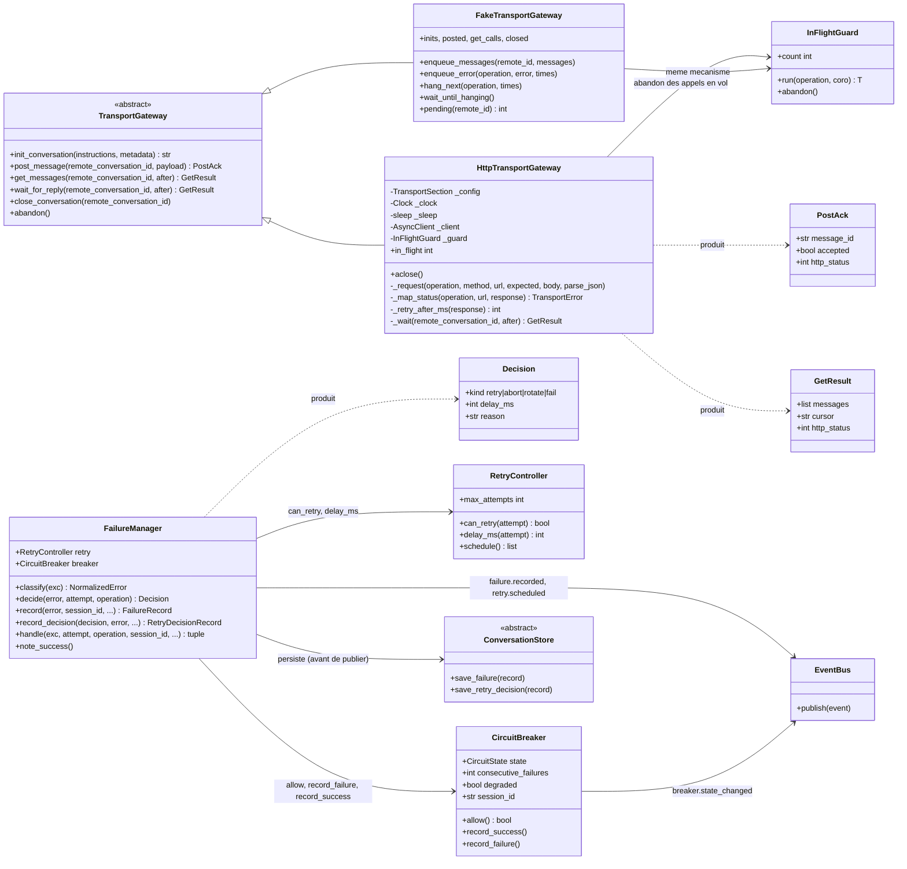
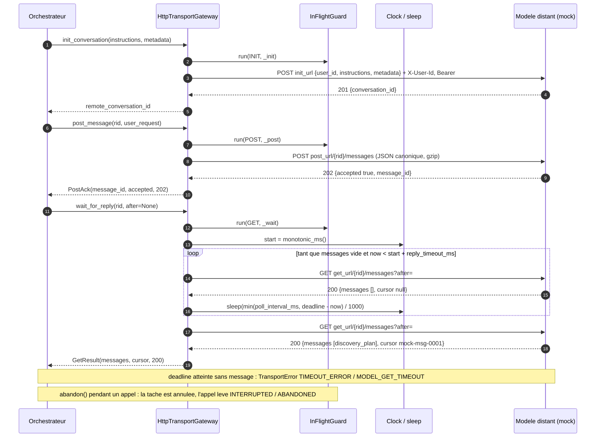
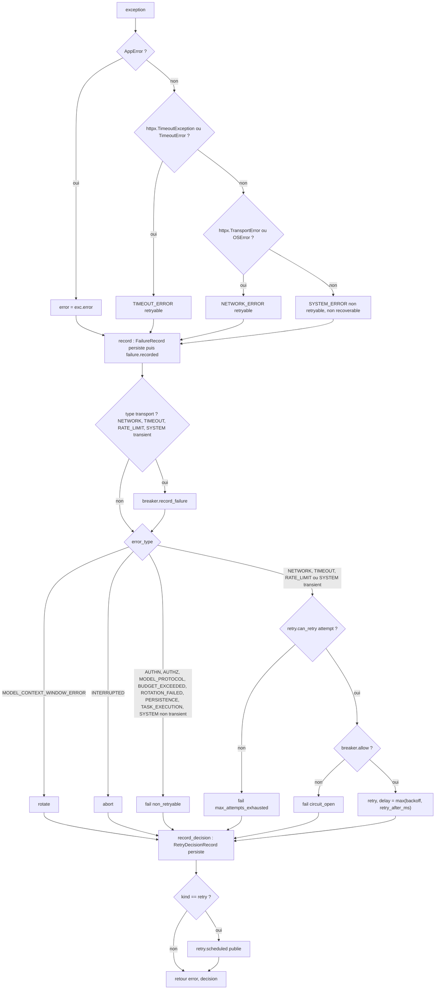
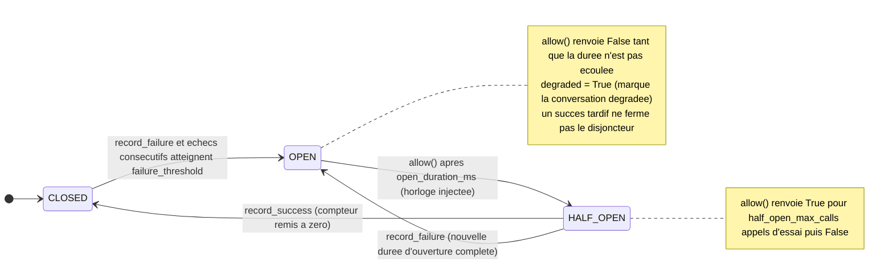

# Phase 7 — Transport et gestion des échecs

**Composants** : `transport/gateway.py` (`TransportGateway`, `HttpTransportGateway`, `InFlightGuard`, `PostAck`, `GetResult`), `transport/fake.py` (`FakeTransportGateway`), `resilience/retry_controller.py` (`RetryController`), `resilience/circuit_breaker.py` (`CircuitBreaker`), `resilience/failure_manager.py` (`FailureManager`, `Decision`), `testing/mock_model_server.py` (serveur mock FastAPI, moteur de scénario).
**Gate** : `pytest -m phase7` entièrement vert · `ruff check` · `ruff format --check` · `mypy --strict`.
**État** : ✅ vert — 325 tests (`tests/unit/test_phase7_transport.py` 102 · `tests/unit/test_phase7_resilience.py` 173 · `tests/unit/test_phase7_mock_server.py` 50).

## 1. Objectif et périmètre

La spec confine tout le réseau dans le `TransportGateway` (§2.1 : communication uniquement par `POST message` / `GET messages` ; §3.12) et centralise la politique d'échec dans le `FailureManager` (§3.13 : classifier, décider `retry | abort | rotate | fail`), épaulé par le `RetryController` (§3.14 : backoff exponentiel borné) et le `CircuitBreaker` (§3.15, §7.4). Cette phase livre :

1. le **contrat de transport** d'ADR-004 sous forme d'une frontière (ABC) + une implémentation réelle (`HttpTransportGateway`, httpx) + un double scripté (`FakeTransportGateway`) — module map §2.3 ;
2. la **table HTTP → taxonomie §6** appliquée à chaque réponse, chaque exception httpx, et le polling GET borné par `reply_timeout_ms` (`MODEL_GET_TIMEOUT`, exemple §12.10) ;
3. l'**abandon des appels en vol** (§2.9 « all in-flight transport calls are abandoned ») : `abandon()` synchrone, l'appel lève `TransportError(INTERRUPTED, ABANDONED)`, la passerelle est réutilisable immédiatement ;
4. la **politique déterministe §7** : types rejouables (§7.1), non rejouables (§7.2), backoff borné sans aléa (ADR-017), décisions persistées (`RetryDecisionRecord`, §7.3), disjoncteur avec événement d'audit et signal « degraded » (§7.4) ;
5. le **serveur mock** (ADR-004 « Serveur mock ») : application FastAPI jouant le modèle à partir d'un scénario JSON, avec injection de pannes, utilisé ici à travers `httpx.ASGITransport` et destiné aux tests d'intégration de la phase 9 et à la commande `agentic-app mock-server`.

Hors périmètre : la boucle qui *consomme* les décisions (attendre `delay_ms`, rejouer le POST, déclencher la rotation) appartient au `ProtocolOrchestrator` (phase 9) ; le passage de la conversation en `ROTATING` sur `MODEL_CONTEXT_WINDOW_ERROR` à la phase 8 ; le texte `PROTOCOL_INSTRUCTIONS.md` envoyé à l'init à la phase 2 ; la CLI `mock-server` à la phase 9 (la fonction `run_mock_server` est prête).

## 2. Prérequis

- Socle (phase 0) vert : `config.py` (`TransportSection` : `init_url`, `post_url`, `get_url`, `close_url`, `token_env`, `user_id`, `request_timeout_ms`, `poll_interval_ms`, `reply_timeout_ms`, `gzip`, `verify_tls` ; `RetrySection` ; `CircuitBreakerSection`), `domain/errors.py` (`ErrorType`, `NormalizedError`, `TransportError`, `AppError`, `RETRYABLE_ERROR_TYPES`), `domain/models.py` (`FailureRecord`, `RetryDecisionRecord`), `domain/states.py` (`CircuitState`), `domain/transitions.py` (`CIRCUIT_TRANSITIONS`, `assert_transition`), `domain/events.py` (`FAILURE_RECORDED`, `RETRY_SCHEDULED`, `BREAKER_STATE_CHANGED`), `domain/clock.py`, `domain/ids.py`, `domain/canonical.py`.
- `persistence/interface.py` (`save_failure`, `save_retry_decision`) et `persistence/memory.py` (`fail_next_write`) ; `observability/event_bus.py`.
- Bibliothèques : `httpx` (client, `MockTransport`, `ASGITransport`), `fastapi`, `uvicorn`, `pydantic`, `pytest-asyncio` en mode auto.
- Décisions applicables : ADR-004 (contrat, mapping, mock, bootstrap), ADR-007 (`system_error` interne, jamais envoyé au modèle), ADR-012 (budget : la fake avance l'horloge du temps de polling consommé), ADR-013 (`MODEL_CONTEXT_WINDOW_ERROR` → rotation), ADR-014 (rotation : le scénario du mock continue dans la conversation enfant), ADR-015 (persister avant publier), ADR-017 (backoff déterministe, horloge et identifiants injectés, sérialisation canonique).

## 3. Conception

### 3.1 Les composants et leurs dépendances

Choix de conception :

| Sujet | Décision | Motif |
|---|---|---|
| Frontière | Le reste du code ne connaît que l'ABC `TransportGateway` ; `HttpTransportGateway(config, clock, *, transport=None, sleep=asyncio.sleep)` reçoit un `httpx.AsyncBaseTransport` injectable (`MockTransport` en test unitaire, `ASGITransport` pour le mock) et une fonction `sleep` injectable pour le polling. | §18.3, module map §2.3 |
| URL | Gabarits `str.replace` de `{conversation_id}` et `{after}`, valeurs encodées par `urllib.parse.quote(..., safe="")` ; aucune autre accolade n'est interprétée. | ADR-004 |
| En-têtes | `Accept: application/json` et `X-User-Id` partout (l'en-tête est omis si `user_id` est vide, ce que le mock refuse par 400) ; `Authorization: Bearer <token>` si le jeton est présent **au moment de l'appel** (`TransportSection.token` lit l'environnement, rien n'est mémorisé) ; `Content-Type: application/json` et `Content-Encoding: gzip` uniquement sur les requêtes avec corps. | ADR-004, §3.12 |
| Corps | Sérialisation canonique (`canonical_bytes`, ADR-017) puis `gzip.compress(mtime=0)` : deux envois du même message produisent les mêmes octets. | ADR-017 |
| Réponses attendues | init 200/201 → `{"conversation_id": str}` ; post 200/202 → `{"accepted": bool, "message_id": str}` (`accepted: false` → `MODEL_PROTOCOL_ERROR / POST_NOT_ACCEPTED`) ; get 200 → `{"messages": [objets], "cursor": str\|null}` (curseur absent ou `null` avec des messages → `message_id` du dernier) ; close : tout 2xx, corps ignoré. Toute autre forme → `MODEL_PROTOCOL_ERROR / INVALID_RESPONSE_BODY` avec `details.reason`. | ADR-004 |
| Statut hors table | 1xx, 2xx inattendu (204…), 3xx (httpx ne suit pas les redirections) → `MODEL_PROTOCOL_ERROR / UNEXPECTED_STATUS` : le serveur a rompu le contrat. | ADR-004 |
| Détails d'erreur | Toujours `operation` (`INIT` / `POST` / `GET` / `CLOSE`), `http_status` (`None` pour une exception) et `url` ; le jeton, s'il apparaissait dans une URL par mauvaise configuration, est remplacé par `***` ; un extrait du corps (256 caractères) et, pour une exception, `cause` (nom de la classe) et `message`. | §6, §12.10 |
| Polling | `wait_for_reply` : GET, puis tant que la liste est vide, `sleep(min(poll_interval_ms, deadline − now))` et nouveau GET ; le dernier GET a lieu exactement à `reply_timeout_ms` (mesuré par `clock.monotonic_ms`) puis `TIMEOUT_ERROR / MODEL_GET_TIMEOUT` (`retryable=True`, `details.operation="GET"`, `timeout_ms`, `poll_interval_ms`, `elapsed_ms`, `polls`). Une erreur du GET pendant le polling se propage immédiatement. Le curseur `after` ne change pas tant que rien n'est reçu. | ADR-004, §12.10 |
| Abandon | `InFlightGuard.run(operation, coro)` exécute chaque appel public dans une `asyncio.Task` enregistrée ; `abandon()` annule les tâches non terminées et les marque ; l'appelant reçoit `TransportError(INTERRUPTED, "ABANDONED", retryable=False, details.operation)`. Une annulation qui ne vient **pas** d'`abandon()` (la tâche appelante elle-même annulée) est propagée telle quelle. Après `abandon()`, rien ne subsiste : l'appel suivant fonctionne. | §2.9, §3.12 |
| Décisions | La politique est **indexée sur `error_type`**, jamais sur le drapeau `retryable` posé par le producteur : un type absent de §7.1 n'est jamais rejoué même avec `retryable=True` ; un type de §7.1 est rejoué même avec `retryable=False`. `can_retry` est évalué **avant** `breaker.allow()` pour ne pas consommer un créneau HALF_OPEN quand le retry n'aura pas lieu. | §7.1, §7.2 |
| `Retry-After` | Entier (secondes) ou date HTTP (relative à `clock.now()`) → `details.retry_after_ms` ; le délai de retry est `max(backoff, retry_after_ms)`, l'indication du serveur est respectée même au-delà de `max_delay_ms`. | ADR-004 |
| Disjoncteur | Un seul disjoncteur pour l'endpoint distant (partagé entre sessions) ; `handle()` lui affecte le `session_id` courant avant de l'alimenter, de sorte que `breaker.state_changed` porte la session dont l'échec a provoqué le changement. Seuls NETWORK / TIMEOUT / RATE_LIMIT et `SYSTEM_ERROR` transitoire l'alimentent (« repeated transport failures »). | §7.4 |
| Persistance | `record` écrit le `FailureRecord` puis publie `failure.recorded` ; `record_decision` écrit un `RetryDecisionRecord` pour **chaque** décision et publie `retry.scheduled` pour les retries ; une `PersistenceError` remonte à l'appelant sans événement. | §7.3, ADR-015 |
| Temps réel du mock | Le seul endroit qui mesure du temps réel est la disponibilité différée des réponses (`delay_ms`) ; il passe par `now_ms` injectable, par défaut `SystemClock().monotonic_ms` du domaine (aucun `time.*` dans le module) ; les tests injectent `FakeClock.monotonic_ms`. Outil de test, jamais importé par le code de production. | ADR-017 |

### 3.2 Séquence nominale : init → POST → polling GET → réponse

### 3.3 Table HTTP → `ErrorType` (ADR-004, appliquée par `_map_status`)

| HTTP / situation | `error_type` | `error_code` | `retryable` | Détails particuliers |
|---|---|---|---|---|
| 401 | AUTHN_ERROR | `HTTP_401` | non | |
| 403 | AUTHZ_ERROR | `HTTP_403` | non | |
| 429 | RATE_LIMIT_ERROR | `HTTP_429` | **oui** | `retry_after_ms` si `Retry-After` (secondes ou date HTTP) |
| 408, 504 | TIMEOUT_ERROR | `HTTP_408` / `HTTP_504` | **oui** | |
| `httpx.TimeoutException` (connect, read, write, pool) | TIMEOUT_ERROR | `REQUEST_TIMEOUT` | **oui** | `http_status=None`, `cause`, `message` |
| 413 | MODEL_CONTEXT_WINDOW_ERROR | `HTTP_413` | non (`recoverable=True`) | déclenche la rotation (ADR-013) |
| tout 4xx avec corps `{"error": "context_window_exceeded"}` | MODEL_CONTEXT_WINDOW_ERROR | `CONTEXT_WINDOW_EXCEEDED` | non (`recoverable=True`) | prioritaire sur le statut (même 401/403/429) |
| `httpx.NetworkError` (connect, read, write, close), `RemoteProtocolError`, `ProxyError` | NETWORK_ERROR | `CONNECTION_ERROR` | **oui** | `http_status=None`, `cause` |
| 502, 503 | NETWORK_ERROR | `HTTP_502` / `HTTP_503` | **oui** | |
| autre 5xx (500, 501, 505…) | SYSTEM_ERROR | `HTTP_5xx` | **oui** | `transient=True` |
| corps non JSON ou forme inattendue sur un statut de succès | MODEL_PROTOCOL_ERROR | `INVALID_RESPONSE_BODY` | non | `reason` (`not_json`, `missing_or_invalid:…`) |
| `accepted: false` sur un POST | MODEL_PROTOCOL_ERROR | `POST_NOT_ACCEPTED` | non | `message_id`, `reason` du serveur |
| autre 4xx (400, 404, 409, 410, 422…) | SYSTEM_ERROR | `HTTP_4xx` | non | pas de `transient` |
| 1xx, 2xx inattendu, 3xx | MODEL_PROTOCOL_ERROR | `UNEXPECTED_STATUS` | non | |
| autre erreur client httpx (`LocalProtocolError`, `UnsupportedProtocol`, `InvalidURL`) | SYSTEM_ERROR | `HTTP_CLIENT_ERROR` | non | erreur de configuration, `cause` |
| polling sans réponse pendant `reply_timeout_ms` | TIMEOUT_ERROR | `MODEL_GET_TIMEOUT` | **oui** | `timeout_ms`, `poll_interval_ms`, `elapsed_ms`, `polls` |
| appel en vol abandonné (`abandon()`) | INTERRUPTED | `ABANDONED` | non | `operation` |

Côté mock, `X-User-Id` manquant → 400 (`missing_user_id`) et jeton invalide → 401 (`invalid_token`) : à travers la passerelle, le premier devient `SYSTEM_ERROR / HTTP_400` non rejouable (erreur de configuration locale, inutile de réessayer) et le second `AUTHN_ERROR / HTTP_401`. Un type de message inattendu pour l'étape courante → 409 → `SYSTEM_ERROR / HTTP_409` ; un POST sur une conversation fermée → 410 → `SYSTEM_ERROR / HTTP_410`.

### 3.4 Décision du `FailureManager` (§7)

Table des décisions par `ErrorType` (tests un par type × cas) :

| `error_type` | Cas | Décision | `reason` |
|---|---|---|---|
| MODEL_CONTEXT_WINDOW_ERROR | quel que soit `attempt` | `rotate` | `context_window_exceeded` |
| NETWORK_ERROR, TIMEOUT_ERROR, RATE_LIMIT_ERROR | `attempt < max_attempts`, disjoncteur passant | `retry`, `delay_ms = max(delay_ms(attempt), retry_after_ms)` | `retryable_error` |
| idem | `attempt ≥ max_attempts` | `fail` (disjoncteur non consulté) | `max_attempts_exhausted` |
| idem | disjoncteur OPEN ou HALF_OPEN saturé | `fail` | `circuit_open` |
| SYSTEM_ERROR avec `details.transient is True` | comme les types rejouables | `retry` / `fail` | idem |
| SYSTEM_ERROR sans `transient` (ou `transient` ≠ `True`) | — | `fail` | `non_retryable:SYSTEM_ERROR` |
| INTERRUPTED | — | `abort` | `interrupted` |
| AUTHN_ERROR, AUTHZ_ERROR, MODEL_PROTOCOL_ERROR, BUDGET_EXCEEDED, ROTATION_FAILED, PERSISTENCE_ERROR (même `transient`), TASK_EXECUTION_ERROR | même avec `retryable=True` | `fail` | `non_retryable:<type>` |

Séquence de backoff (`RetryController`, `delay = min(base_delay_ms × 2^(attempt−1), max_delay_ms)`) :

| Configuration | `attempt` 1 | 2 | 3 | 4 | 5 | `can_retry` |
|---|---|---|---|---|---|---|
| défauts (500 ms, plafond 8 000 ms, 4 tentatives) — `schedule() = [500, 1000, 2000]` | 500 | 1 000 | 2 000 | 4 000 (jamais utilisé : `can_retry(4)` est faux) | 8 000 | `attempt < 4` |
| base 100 ms, plafond 1 000 ms, 6 tentatives — `schedule() = [100, 200, 400, 800, 1000]` | 100 | 200 | 400 | 800 | 1 000 | `attempt < 6` |
| gigue `jitter_ratio = 0,5` avec `random_source` tirant 1,0 / 0,0 / 0,5 | 750 / 250 / 500 | | | | | sans `random_source` : aucune gigue |

`attempt` désigne la tentative qui vient d'échouer (1 = premier essai) ; `delay_ms(attempt)` est l'attente avant la tentative `attempt + 1` ; `attempt < 1` → `ValueError`. La gigue est `± jitter_ratio` autour du délai **plafonné** ; le tirage est borné à `[0, 1]` et n'est jamais demandé quand `jitter_ratio = 0`.

### 3.5 Disjoncteur (§7.4, table `CIRCUIT_TRANSITIONS`)

Chaque changement d'état passe par `assert_transition(CIRCUIT_TRANSITIONS, …, entity="circuit_breaker")` et publie `breaker.state_changed` avec `{"from", "to", "consecutive_failures"}` lorsqu'un bus **et** un `session_id` sont connus (un `Event` exige une session). `degraded` vaut `True` dès que l'état n'est pas `CLOSED`.

### 3.6 Serveur mock : moteur de scénario

- `Scenario(steps, token=None)`, `Step(on="*", respond=[…], delay_ms=0, fault=None)`, `Fault(status=None, body=None, times=1, on_operation="post")` sont des modèles pydantic (`extra="forbid"`, figés) ; `load_scenario(path)` lit un JSON (`ValueError` si non conforme) ; `default_java_debug_scenario()` reproduit la boucle §12 : `user_request → discovery_plan (§12.2) → execution_result → execution_plan (§12.3) → execution_result → final_answer (§12.7)`.
- Les étapes sont consommées **une par POST accepté, globalement** (pas par conversation) : après une rotation, le script continue dans la conversation enfant (`context_resume_request → context_resume_ack`, ADR-014). Étape non concordante (`on` ≠ type) → 409, étape conservée ; étapes épuisées → 202 mais silence du modèle (l'application atteindra `MODEL_GET_TIMEOUT`).
- Idempotence : un re-POST du même `message_id` renvoie l'accusé mémorisé, sans republier ni ré-enregistrer.
- Réponses : `{conversation_id}` remplacé dans toutes les chaînes, `"message_id": "auto"` → `mock-msg-0001`, `mock-msg-0002`… ; visibles au GET après `delay_ms` ; le GET renvoie les messages **postérieurs au curseur** disponibles, sans jamais en sauter un, et `cursor` = dernier `message_id` rendu (ou `after` tel quel si rien n'est rendu).
- Fautes : `on_operation="post"` frappe le POST qui consommerait l'étape (message non enregistré, le re-POST suivant est traité normalement) ; `"init"` frappe l'init effectué pendant que l'étape est en attente ; `"get"` / `"close"` sont armées à la consommation de l'étape et frappent les GET / close suivants ; `times` fois puis comportement normal. `status=None` → 200 (réponse hors protocole), `body=None` → `{"error": "injected_fault", "operation": …}`.
- Corps gzip acceptés (`Content-Encoding: gzip`), JSON invalide → 400 `invalid_json`, message sans `type`/`message_id` → 400 `invalid_message`, conversation inconnue → 404, fermée → 410. L'état est exposé en `app.state.engine` (`inits`, `received`, `closed`, `conversations`, `scenario`) pour les assertions.

## 4. Invariants

1. **Aucun réseau réel, aucun temps réel dans les tests** : `httpx.MockTransport` / `ASGITransport`, `FakeClock`, `sleep` injecté qui avance l'horloge ; les 325 tests s'exécutent en ≈ 1 s.
2. **Toute erreur de transport est un `TransportError` classé** : `error_type` selon la table §3.3, `origin="TransportGateway"`, `details.operation` / `http_status` / `url` toujours présents, jamais de jeton dans les détails.
3. **La politique prime sur le drapeau** : `decide()` ne lit jamais `error.retryable` ; seule la table de §7 (par type) décide.
4. **Persister avant publier** : `FailureRecord` puis `failure.recorded` ; `RetryDecisionRecord` puis `retry.scheduled` ; un abonné qui lit le store pendant l'événement voit déjà l'enregistrement ; une `PersistenceError` laisse le flux d'événements vide.
5. **Déterminisme** : aucun `datetime.now`, `time.*`, `uuid`, `random` dans `transport/*` ni `resilience/*` (test d'inspection du source) ; la gigue n'existe que via `random_source` injecté ; les délais sont reproductibles ; le gzip est reproductible (`mtime=0`).
6. **Abandon sans fuite** : après `abandon()`, `in_flight == 0`, aucune tâche marquée ne subsiste, l'appel suivant réussit ; une annulation externe n'est jamais convertie en `ABANDONED`.
7. **Le disjoncteur suit sa table** : toute transition passe par `assert_transition(CIRCUIT_TRANSITIONS)` ; le parcours complet CLOSED → OPEN → HALF_OPEN → OPEN → HALF_OPEN → CLOSED est vérifié paire par paire contre `can_transition`.

## 5. Plan de tests

Trois fichiers, marqueur `phase7`, nommage `given_<état>_when_<action>_then_<résultat>` (§18.4).

### 5.1 `tests/unit/test_phase7_transport.py` — 102 tests

| Test | Vérifie | Réf. |
|---|---|---|
| `given_init_endpoint_when_init_conversation_then_body_headers_and_remote_id` · `…_token_in_environment_…_bearer_header_present` · `…_init_returning_200_…` · `…_empty_user_id_…_no_user_id_header` | corps `{user_id, instructions, metadata}`, en-têtes, 200/201 acceptés, jeton lu à l'appel | ADR-004 |
| `given_gzip_enabled_when_post_message_then_body_gzip_encoded_and_decodable` · `…_gzip_disabled_…_plain_canonical_json_body` · `…_post_url_template_…_conversation_id_quoted_in_url` · `…_post_accepted_…_ack_…` · `…_post_returning_200_…` · `…_post_not_accepted_…_model_protocol_error` | gzip décodé côté mock = JSON canonique, `quote` de l'identifiant, `PostAck`, `POST_NOT_ACCEPTED` | ADR-004, ADR-017 |
| `given_get_url_template_when_get_messages_then_cursor_quoted_in_url` · `…_no_cursor_…_after_parameter_empty` · `…_get_request_…_without_body_headers` · `…_get_returning_messages_…` · `…_get_body_without_cursor_…_derived_from_last_message` · `…_empty_get_body_…` | un seul GET, `after` encodé, `GetResult`, curseur dérivé | ADR-004 |
| `given_empty_close_url_when_close_conversation_then_no_request_sent` · `…_close_url_…_post_sent_to_formatted_url` · `…_close_url_returning_error_…_close_operation` | close optionnel, `details.operation = CLOSE` | ADR-004 |
| **Mapping, un test par ligne** : `given_401_…_authn_error` · `given_403_…_authz_error` · `given_429_with_retry_after_seconds_…` · `…_without_retry_after_…` · `…_http_date_retry_after_…_from_clock` · `…_unparseable_retry_after_…` · `given_timeout_status_…` (×2) · `given_httpx_timeout_…` (×3) · `given_413_…` · `given_4xx_with_context_window_body_…` (×5) · `given_connection_failure_…_network_error` (×4) · `given_bad_gateway_status_…` (×2) · `given_other_5xx_…_transient_system_error` (×4) · `given_non_json_body_…_invalid_response_body` · `given_unexpected_json_shape_…` (×9) · `given_other_4xx_…_system_error_not_retryable` (×4) · `given_unexpected_non_error_status_…` (×3) · `given_failing_operation_…_details_carry_operation_status_and_url` (×4) · `given_token_appearing_in_url_…_redacted` | chaque ligne de la table §3.3, détails systématiques, redaction | ADR-004, §6 |
| `given_empty_gets_when_wait_for_reply_then_polls_every_interval_until_a_message` · `…_first_get_has_messages_…_no_sleep` · `…_no_reply_…_model_get_timeout_after_reply_timeout` · `…_get_error_during_polling_…_propagates_immediately` · `…_reply_timeout_shorter_than_poll_interval_…_single_short_sleep` | polling déterministe (sleep factice + `FakeClock`), GET final à l'échéance, `MODEL_GET_TIMEOUT` | ADR-004, §12.10 |
| `given_in_flight_get_when_abandon_then_call_raises_interrupted_abandoned` · `…_abandoned_gateway_when_called_again_then_works_normally` · `…_nothing_in_flight_…` · `…_wait_for_reply_sleeping_when_abandon_…` · `…_two_in_flight_calls_…_both_abandoned` · `…_outer_task_cancelled_…_cancelled_error_not_transport_error` · `…_completed_call_when_abandon_…` · `…_aclose_…` | abandon en vol (requête et sommeil), reset, non-conversion d'une annulation externe | §2.9, §3.12 |
| `given_fake_gateway_when_init_twice_…` · `…_post_…_posted_recorded` · `…_enqueued_messages_…_one_entry_consumed_…` · `…_two_enqueued_entries_…_in_order` · `…_other_conversation_…` · `…_empty_queue_when_get_messages_…` · `…_empty_queue_when_wait_for_reply_then_model_get_timeout` · `…_fake_clock_…_advanced_by_reply_timeout` · `given_enqueued_error_when_operation_called_…` (×4) · `…_times_two_…` · `…_get_error_when_wait_for_reply_…` · `…_unknown_operation_…_value_error` · `…_close_…` · `…_hanging_operation_when_abandon_…` · `…_hanging_post_…_not_recorded_as_posted` | le double : file par conversation, erreurs injectées, journal, abandon | §18.3, module map §4 |

### 5.2 `tests/unit/test_phase7_resilience.py` — 173 tests

| Test | Vérifie | Réf. |
|---|---|---|
| `given_default_config_when_schedule_then_500_1000_2000` · `…_delay_computed_then_base_doubles_per_attempt` (×4) · `…_exponential_beyond_cap_…_capped` (×4) · `…_custom_base_and_cap_…` · `…_attempt_below_one_…_value_error` (×3) · `…_can_retry_…` (×5) · `…_max_attempts_1_…` · `…_zero_base_delay_…` · `…_jitter_ratio_without_random_source_…_no_jitter` · `…_random_source_…_scaled_within_plus_minus_ratio` (×4) · `…_out_of_unit_interval_…_clamped` (×2) · `…_jitter_ratio_zero_then_source_never_called` · `…_never_negative_and_capped_before_jitter` · `…_same_inputs_…_identical` · `…_max_attempts_read_…` | backoff exact, plafond, bornes, gigue injectée, déterminisme | §7.3, ADR-017 |
| `given_new_breaker_…_closed_allows_calls_and_not_degraded` · `…_failures_below_threshold_…` · `…_failures_reach_threshold_then_open_blocks_and_degraded` · `…_success_between_failures_…_reset` · `…_open_duration_not_elapsed_…_allow_false` · `…_open_duration_elapsed_then_half_open_and_allows_one_trial_call` · `…_two_max_calls_…` · `…_half_open_…_success_then_closed_…` · `…_half_open_…_failure_then_open_again_…` · `…_open_…_failure_recorded_…` · `…_late_success_…` · `…_bus_and_session_…_events_with_from_to_and_failures` · `…_half_open_to_open_event_…` · `…_without_bus_…` · `…_bus_without_session_…_nothing_published` · `…_session_id_assigned_later_…` · `…_full_cycle_…_listed_circuit_transition` | CLOSED→OPEN au seuil, OPEN bloque, OPEN→HALF_OPEN après `open_duration_ms` (FakeClock), HALF_OPEN→CLOSED / →OPEN, événements, `degraded` | §7.4, §18.2 |
| `given_app_error_of_each_type_when_classified_…` (×13) · `…_concrete_app_error_subclass_…` (×8) · `…_timeout_exception_…` (×5) · `…_network_exception_…` (×6) · `…_unknown_exception_…_system_error_…_type_and_message` (×4) | classification de **chaque** `ErrorType` et des exceptions natives | §6, §18.2 |
| `given_context_window_error_when_decided_then_rotate_…` (×3) · `…_retryable_type_when_attempts_remain_then_retry_with_backoff_delay` (×9) · `…_attempts_exhausted_…` (×6) · `…_rate_limit_with_retry_after_…` (×3) · `…_retry_after_beyond_max_delay_…_honoured` · `…_transient_system_error_…_retry` · `…_non_transient_system_error_…_fail` (×3) · `…_open_breaker_…_fail_circuit_open` · `…_half_open_breaker_…_trial_slot_consumed_by_retry` · `…_exhausted_attempts_…_breaker_not_consulted` · `…_interrupted_…_abort` · `…_each_non_retryable_type_…_fail` (×14) · `…_non_listed_type_flagged_retryable_…_policy_wins_and_fails` (×7) · `…_transient_persistence_error_…_fail` · `…_listed_type_flagged_non_retryable_…_retries` · `…_decision_when_built_then_frozen_and_kind_validated` | table §3.4, un test par type × cas | §7.1, §7.2 |
| `given_error_when_recorded_then_failure_record_persisted_with_all_fields_then_event_published` · `…_subscriber_reading_store_…_already_there` · `…_store_failing_when_recorded_…_no_event` · `…_retry_decision_when_recorded_…_retry_scheduled_published` · `…_non_retry_decision_…_no_retry_event` (×3) · `…_store_failing_when_decision_recorded_…` | `FailureRecord`, `RetryDecisionRecord`, événements, ADR-015 | §7.3, §16, ADR-015 |
| `given_network_exception_when_handled_then_records_events_and_retry_decision_in_order` · `…_transport_error_…_attempt_counters` · `…_repeated_transport_failures_…_breaker_opens_and_decision_fails_circuit_open` · `…_each_fed_type_…_breaker_failure_recorded` (×4) · `…_non_transport_or_non_transient_failure_…_breaker_not_fed` (×8) · `…_context_window_error_when_handled_then_rotate_…` · `…_interrupted_when_handled_then_abort_…` · `…_half_open_breaker_when_note_success_then_closed` · `…_manager_built_without_retry_and_breaker_…_defaults_from_config` · `…_two_sessions_…_events_carry_current_session` · `…_persistence_failure_during_handle_…_propagates` | chaînage complet, disjoncteur alimenté, `note_success` | §3.13, §7.4 |
| `given_production_module_when_inspected_then_no_wall_clock_or_randomness_used` (×5) · `…_breaker_payload_built_then_json_serialisable` | déterminisme des cinq modules | ADR-017, module map §2.4 |

### 5.3 `tests/unit/test_phase7_mock_server.py` — 50 tests

| Test | Vérifie | Réf. |
|---|---|---|
| `given_default_scenario_when_inspected_then_three_steps_reproduce_spec_section_12` · `…_json_file_when_load_scenario_…` · `…_unknown_field_…_value_error` · `…_fault_…_defaults` · `…_run_mock_server_…_injected_runner_…` (×2) | modèle de scénario, chargement, lancement uvicorn injectable | ADR-004 |
| `given_mock_app_when_init_without_user_id_header_then_400` · `…_operation_without_user_id_header_then_400` (×3) · `…_token_when_request_without_matching_bearer_then_401` (×4) · `…_matching_bearer_then_201` · `…_without_token_…_bearer_…_ignored` | en-têtes obligatoires | ADR-004 |
| `…_init_twice_…_sequential_conversation_ids` · `…_init_with_invalid_json_…_400` · `…_unknown_conversation_…_404` · `…_body_lacks_type_or_message_id_…_400` · `…_same_message_id_twice_then_same_ack_and_single_message_recorded` · `…_gzip_body_…_decoded` · `…_corrupt_gzip_…_400` · `…_step_on_mismatch_…_409_and_step_not_consumed` · `…_steps_exhausted_…_model_stays_silent` · `…_several_replies_…_in_order_with_cursor` · `…_get_with_cursor_…_only_messages_after_cursor` · `…_without_available_messages_…_cursor_echoes_after` · `…_delay_ms_…_visible_once_elapsed` · `…_post_fault_…_times_then_message_processed` · `…_get_fault_…` · `…_init_fault_…` · `…_close_fault_…` · `…_fault_without_status_…_200_with_given_body` · `…_close_…_further_posts_rejected_with_410` · `…_placeholders_…_filled` · `…_explicit_message_id_…_kept_verbatim` · `…_default_scenario_when_driven_over_raw_http_…` | contrat HTTP brut : idempotence, curseur, délai (temps injecté), fautes sur les quatre opérations | ADR-004 |
| `given_default_scenario_when_full_loop_driven_through_http_gateway_then_types_and_cursors_follow_protocol` · `…_gzip_gateway_…_decoded_server_side` · `…_post_repeated_…_same_ack_and_no_duplicate` · `…_503_fault_on_post_…_network_error_then_success` · `…_context_window_fault_…_model_context_window_error` · `…_413_fault_on_get_…` · `…_empty_user_id_…_400_maps_to_system_error_not_retryable` · `…_wrong_token_…_authn_error` · `…_right_token_…_accepted` · `…_mismatching_message_type_…_409_maps_to_system_error` · `…_silent_model_…_model_get_timeout` · `…_delayed_reply_…_polls_until_available` | `HttpTransportGateway` + `ASGITransport` : boucle §12 complète (init → user_request → discovery_plan → execution_result → execution_plan → execution_result → final_answer → close), pannes et reprise | ADR-004, §12, §18.2 |

## 6. Étapes TDD suivies

1. Lecture du socle (`config.py`, `domain/*`, `persistence/*`, `observability/event_bus.py`, `protocol/messages.py`, `conftest.py`, tests de phase 0) et des textes (§2.1, §3.12–3.15, §6, §7, §12.10, §18 ; ADR-004/007/012/013/014/017 ; module map §3–4).
2. Deux vérifications techniques **avant** d'écrire (script jetable) : annuler la tâche interne fait remonter `CancelledError` chez l'appelant **sans** marquer sa propre tâche (`cancelling() == 0`), ce qui autorise la conversion en `ABANDONED` sans masquer une annulation externe ; httpx conserve les séquences `%XX` dans les URL et refuse de parser `Retry-After: soon` par `ValueError`.
3. **Rouge** : écriture des trois fichiers de tests (325 cas) → `ModuleNotFoundError` sur `transport`, `resilience`, `testing.mock_model_server`.
4. **Vert** transport : `gateway.py` + `fake.py` → 100/102 ; deux défauts de conception révélés par les tests et corrigés : une erreur injectée doit quand même figurer dans `get_calls` (journal des tentatives), et le test « appel bloqué puis abandon » pouvait annuler la tâche avant que le blocage soit consommé → la fake expose `is_hanging` puis, au refactor, `wait_until_hanging()`.
5. **Vert** résilience (173/173 du premier coup) puis serveur mock (50/50 du premier coup).
6. **Refactor** sous tests verts : `ruff format` ; remplacement de trois attentes actives des tests (`while …: await asyncio.sleep(0)`, ASYNC110) par des `asyncio.Event` — dont un handler `_Hanging(expected=2)` qui signale « N requêtes entrées » (la version « une requête » était sujette à une course quand les deux tâches entrent dans la même itération de boucle) ; `2 ** (attempt-1)` typé `Any` par mypy → `1 << (attempt-1)` ; suppression de deux membres non testés de `FailureManager` ; `asyncio.TimeoutError` est `TimeoutError` en 3.11 (UP041).
7. Gate complète, rédaction de ce guide et validation des diagrammes Mermaid.

## 7. Gate

| Contrôle | Commande | Résultat |
|---|---|---|
| Tests de la phase | `.venv/bin/pytest -q -m phase7` | 325 verts (≈ 1,1 s), stables sur trois exécutions |
| Phases 0 + 1 + 7 | `.venv/bin/pytest -q -m "phase0 or phase1 or phase7"` | 865 verts |
| Suite complète | `.venv/bin/pytest -q` | 1 737 verts (incluant les phases livrées en parallèle) |
| Lint | `.venv/bin/ruff check src tests` | ✅ |
| Format | `.venv/bin/ruff format --check src tests` | ✅ |
| Types | `.venv/bin/mypy` (strict, tout le paquet) | ✅ |
| Diagrammes | `check_mermaid.py docs/phases/phase-07-transport-failures.md` | 4/4 rendus |

## 8. Résultat

- **325 tests** : 102 transport (84 `HttpTransportGateway` : 3 objets-valeurs, 19 init/post/get/close, 49 pour la table HTTP → `ErrorType`, 5 polling, 8 abandon ; 18 `FakeTransportGateway`), 173 résilience (37 `RetryController`, 17 `CircuitBreaker`, 105 `FailureManager` — 36 classification, 39 décision, 8 persistance, 19 `handle` / disjoncteur / défauts —, 6 déterminisme et sérialisation), 50 serveur mock (6 modèle de scénario, 32 contrat HTTP brut, 12 boucle complète à travers la passerelle).
- Fichiers livrés : `src/agentic_local_app/transport/__init__.py`, `transport/gateway.py`, `transport/fake.py`, `src/agentic_local_app/resilience/__init__.py`, `resilience/retry_controller.py`, `resilience/circuit_breaker.py`, `resilience/failure_manager.py`, `src/agentic_local_app/testing/mock_model_server.py`, `tests/unit/test_phase7_transport.py`, `tests/unit/test_phase7_resilience.py`, `tests/unit/test_phase7_mock_server.py`, ce guide. (`testing/__init__.py` existait déjà, créé par la phase 4 ; non modifié.)
- Exigences couvertes : §2.1 (POST/GET seulement), §2.9 (abandon des appels en vol), §3.12 (POST, GET, gzip, erreurs normalisées, abandon), §3.13 (classifier, décider retry/abort/rotate/fail, politique centralisée), §3.14 (backoff borné), §3.15 (disjoncteur), §6 (taxonomie, attributs normalisés portés par `TransportError` / `FailureRecord`), §7.1–7.4 (types rejouables et non rejouables, stratégie de retry persistée, disjoncteur avec événement et « degraded »), §12.10 (`MODEL_GET_TIMEOUT` avec `details.operation` / `timeout_ms`), §18.2 Phase 7 (les quatre puces), §18.3 (double `FakeTransportGateway`, aucun réseau réel), §18.4 (nommage), ADR-004 (endpoints configurables, en-têtes, polling, idempotence, mapping exact, serveur mock, `abandon()`), ADR-007 (`system_error` jamais envoyé : le mapping produit des `TransportError` internes), ADR-013 (`MODEL_CONTEXT_WINDOW_ERROR` → `rotate`), ADR-014 (scénario du mock global aux conversations), ADR-015 (persister avant publier), ADR-017 (déterminisme, gigue injectée, sérialisation canonique).

## 9. Points ouverts

1. **Signature du module map.** `FailureManager(config, store, bus, clock, ids)` et `decide(error, attempt, context)` y sont annoncés ; l'implémentation prend `retry` et `breaker` optionnels (construits depuis la config sinon) et `decide(error, attempt, *, operation)`. `docs/architecture/09-module-map.md` (§3) gagnerait à refléter ces signatures ainsi que `wait_for_reply`, `note_success`, `handle` et `InFlightGuard` ; le document est hors périmètre de cette phase.
2. **`PERSISTENCE_ERROR` transitoire.** §7.2 n'exclut que la `PERSISTENCE_ERROR` *persistante* ; la politique livrée (conforme à l'énoncé de la phase) fait échouer aussi la variante transitoire (`PersistenceError(transient=True)` porte `retryable=True` mais n'est pas dans §7.1). Si la phase 9 veut rejouer une écriture SQLite `BUSY`, ajouter `PERSISTENCE_ERROR` transitoire à `_is_policy_retryable` est un changement d'une ligne, à tester.
3. **`TASK_EXECUTION_ERROR` transitoire.** Même remarque : §7.2 parle de « non-transient TASK_EXECUTION_ERROR » ; aucune variante transitoire n'est rejouée aujourd'hui (le retry d'une tâche relève d'ADR-008 côté `PlanRunner`, pas du transport).
4. **Types de §7.1 marqués `retryable=False`.** La politique par type rejoue un `NETWORK_ERROR` même si son producteur l'a marqué non rejouable (cohérent avec « la politique prime ») ; si un producteur doit pouvoir interdire le retry, il faudra un code d'erreur dédié plutôt que le drapeau.
5. **`abandon()` et threads.** `InFlightGuard.abandon()` appelle `Task.cancel()`, qui n'est pas thread-safe : depuis un gestionnaire de signal ou un autre thread, l'appelant (phase 6/9) devra passer par `loop.call_soon_threadsafe(gateway.abandon)`.
6. **Disjoncteur partagé et `session_id`.** Un seul disjoncteur pour l'endpoint ; `handle()` réaffecte `breaker.session_id` à chaque échec pour attribuer l'événement à la session déclencheuse. La transition `OPEN → HALF_OPEN` provoquée par `allow()` porte donc la session du **dernier** échec, pas nécessairement celle qui appelle `allow()` ; acceptable pour l'audit (§7.4), à revoir si l'`ExecutionTracker` (phase 10) veut un état « degraded » par conversation.
7. **`Retry-After` au-delà du plafond.** L'indication du serveur est honorée telle quelle (`max(backoff, retry_after_ms)`) ; un serveur hostile pourrait imposer une longue attente. Le budget `max_total_duration_ms` (ADR-012) borne de toute façon la session ; un plafond dédié (`retry.max_retry_after_ms`) est possible sans casser l'API.
8. **Corps des réponses de fautes du mock.** `Fault.body` est un objet JSON ; un corps brut non JSON (pour tester `not_json` à travers le mock) n'est pas exprimable dans un scénario — le cas est couvert par `MockTransport` en unitaire.
9. **Test d'inspection global (phase 10).** `testing/mock_model_server.py` ne contient aucun `time.*` (il passe par `SystemClock`), mais il mesure bien du temps réel par défaut ; si le test d'inspection de la phase 10 vérifie aussi l'usage de `SystemClock` hors `wiring`, ajouter ce module à sa liste d'exceptions (outil de test).
