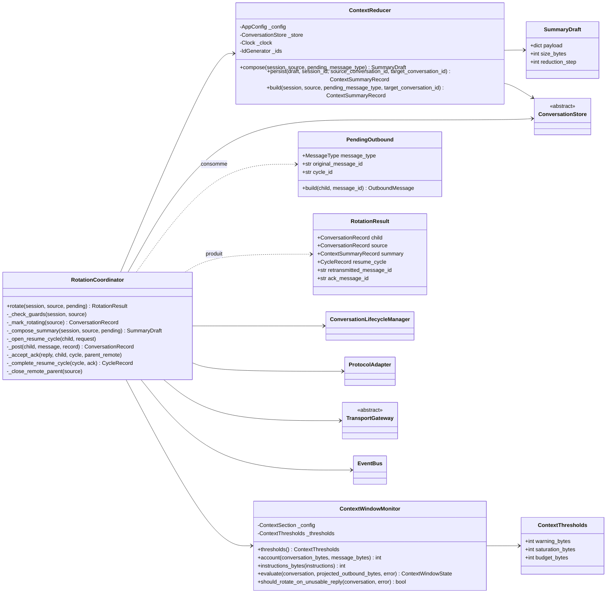
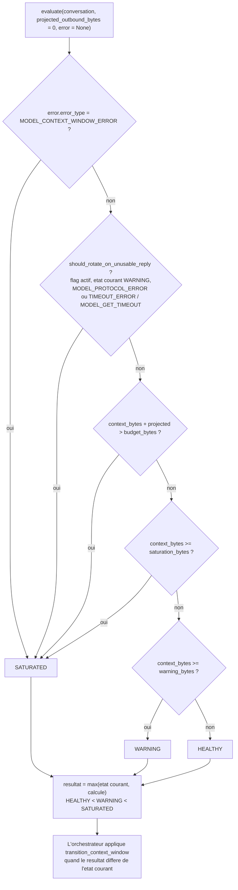
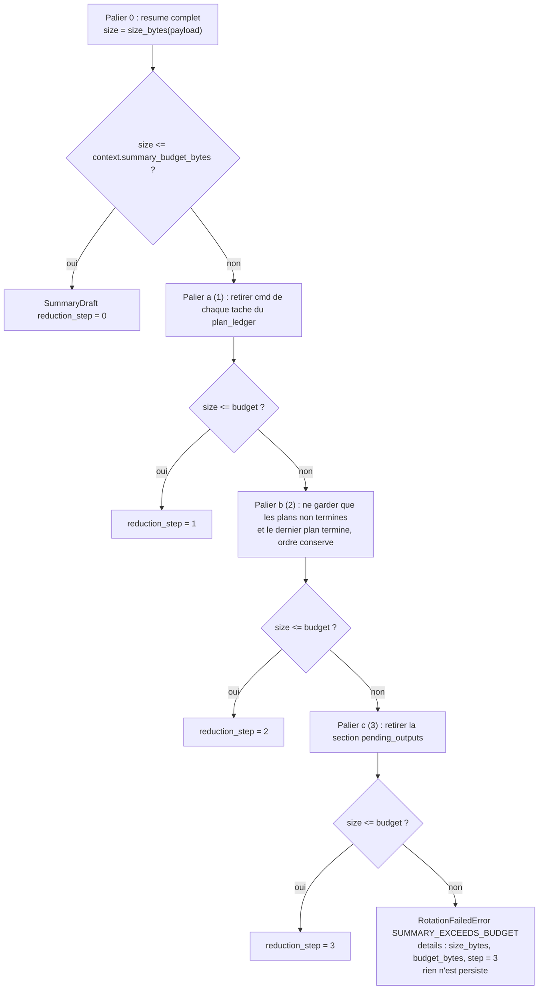
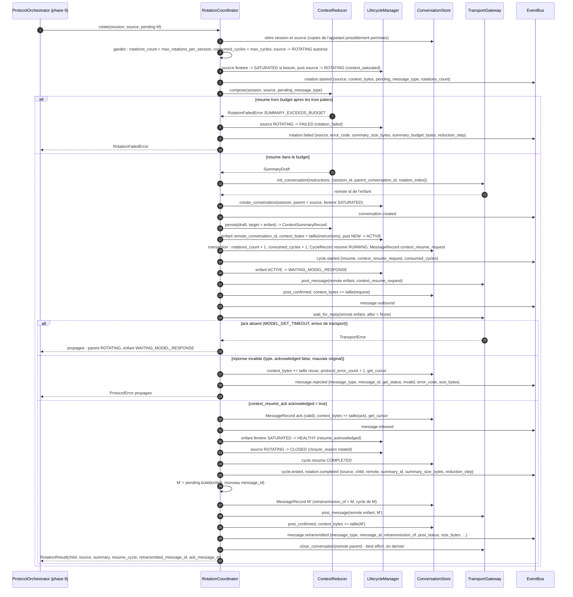

# Phase 8 — Rotation de contexte

**Composants** : `context/window.py` (`ContextWindowMonitor`, `ContextThresholds`), `context/reducer.py` (`ContextReducer`, `SummaryDraft`, paliers de réduction), `context/rotation.py` (`RotationCoordinator`, `PendingOutbound`, `RotationResult`), `context/__init__.py` (exports).
**Gate** : `pytest -m phase8` entièrement vert · `ruff check` · `ruff format --check` · `mypy --strict`.
**État** : ✅ vert — 78 tests (`tests/unit/test_phase8_context_rotation.py`).

## 1. Objectif et périmètre

La spec demande qu'une conversation « trop grande pour continuer en sécurité » soit rotatée automatiquement (§2.6) : nouvelle conversation, résumé **structuré** injecté, acquittement obligatoire du modèle, échec explicite si le résumé ne tient pas dans le budget — « aucune boucle de rotation silencieuse ». La fenêtre de contexte suit `HEALTHY → WARNING → SATURATED → HEALTHY` (§5.4), les causes et les neuf étapes de la rotation sont en §10, le `ContextReducer` « ne préserve que les découvertes critiques et l'état d'exécution courant dans un schéma défini » (§3.11), les messages de reprise sont §12.8 / §12.9. Cette phase livre :

1. la **métrique de saturation** d'ADR-013 et son évaluation pure (`ContextWindowMonitor`) : octets canoniques cumulés, seuils `warning_ratio` / `saturation_ratio`, projection avant POST, saut direct sur `MODEL_CONTEXT_WINDOW_ERROR`, règle « réponse inutilisable en `WARNING` » d'ADR-019 §2, résultat **monotone** ;
2. le **résumé structuré** d'ADR-005 (`ContextReducer`) : assemblage dans un ordre fixe de données déjà structurées — `state_summary` du modèle copié **verbatim**, registre des plans, sorties tronquées encore récupérables, budget de session —, taille canonique, réduction déterministe par **trois paliers**, échec explicite `ROTATION_FAILED / SUMMARY_EXCEEDS_BUDGET`, `ContextSummaryRecord` persisté, reproductibilité ;
3. la **séquence de rotation** d'ADR-014 (`RotationCoordinator.rotate`) : parent `ROTATING`, résumé, `init` distant, enfant créé `SATURATED` avec filiation (ADR-006/007), cycle `resume` (une rotation = un cycle, ADR-012 / ADR-019 §5), `context_resume_request` POSTé, `context_resume_ack` seul type attendu, enfant `SATURATED → HEALTHY`, parent `ROTATING → CLOSED` (`rotated`), **retransmission** du message en attente `M` avec un nouveau `message_id` et `retransmission_of`, événements du contrat de la phase 10, état persisté cohérent à chaque point d'échec, annulation propagée.

Hors périmètre : le **déclenchement** (qui appelle `evaluate` puis `rotate`, avec quel `M`) et la politique d'échec appliquée dans l'enfant (retry du GET, `FAILED` du parent et de l'enfant, session `FAILED`) appartiennent au `ProtocolOrchestrator` (phase 9) ; l'interruption pendant la rotation (parent **et** enfant `INTERRUPTED`) à la phase 6 ; le `RecoveryCoordinator` (parent `ROTATING → INTERRUPTED` au redémarrage) à la phase 9.

## 2. Prérequis

- Phases 0, 1, 2, 3, 7, 10 vertes (1 737 tests) : `config.py` (`ContextSection` : `budget_bytes`, `warning_ratio`, `saturation_ratio`, `rotate_on_unusable_reply_in_warning`, `max_rotations_per_session`, `summary_budget_bytes` ; invariants croisés d'ADR-019 §4, dont `summary_budget_bytes ≤ payload.max_message_bytes`), `domain/models.py` (`ConversationRecord.context_window_state / context_bytes / protocol_error_count / get_cursor / remote_conversation_id`, `SessionRecord.rotations_count / consumed_cycles`, `ContextSummaryRecord.reduction_step`, `CycleRecord`, `MessageRecord.retransmission_of`, `PlanRecord.state_summary`), `domain/transitions.py` (`CONTEXT_WINDOW_TRANSITIONS`, `WAITING_USER → ROTATING` d'ADR-019 §3, `ROTATING → CLOSED` d'ADR-007), `domain/errors.py` (`RotationFailedError`, `TransportError`, `ProtocolError`, `BudgetExceededError`, `NormalizedError`), `domain/events.py`, `domain/canonical.py` (`size_bytes`).
- `lifecycle/conversation_lifecycle.py` : `create_conversation(session_id, *, parent_conversation_id, context_window_state)`, `transition_conversation`, `transition_context_window`, `update_conversation`, `update_session` — **toute** transition de conversation ou de session passe par lui (ADR-015).
- `protocol/adapter.py` : `build_context_resume_request(conversation, message_id, *, original_conversation_id, goal, context_summary, pending_message_type)`, `parse_inbound(..., expected={CONTEXT_RESUME_ACK}, expected_original_conversation_id=…)` avec les codes `ACK_NOT_ACKNOWLEDGED`, `ACK_WRONG_ORIGINAL`, `UNEXPECTED_MESSAGE_TYPE`, `SCHEMA_INVALID` ; `build_execution_result` / `build_user_request` pour reconstruire `M`.
- `transport/gateway.py` (ABC : `init_conversation`, `post_message`, `wait_for_reply`, `close_conversation`, `abandon`) et `transport/fake.py` (`FakeTransportGateway` : `inits`, `posted`, `get_calls`, `closed`, `enqueue_messages`, `enqueue_error`, `hang_next`, `wait_until_hanging`).
- `persistence/interface.py` (`save_context_summary`, `get_context_summary_for_target`, `list_plans`, `list_tasks`, `get_blob_for_task`, `save_cycle`, `save_message`, `transaction`) et `persistence/memory.py` (`fail_next_write`, savepoints).
- Contrat des événements : `docs/phases/phase-10-observability.md` §4 (payloads de `message.outbound`, `message.inbound`, `message.rejected`, `message.retransmitted`, `cycle.started`, `cycle.ended`, `rotation.*`) ; les abonnés de la phase 10 (`AuditLog`, `ExecutionTracker`, `TelemetryService`) sont rejoués dans un test.
- Décisions applicables : ADR-005, ADR-006, ADR-007, ADR-012, ADR-013, ADR-014, ADR-015, ADR-017, ADR-019 (§2, §4, §5, §7) ; conception détaillée `docs/architecture/06-context-rotation.md`.

## 3. Conception

### 3.1 Les composants et leurs dépendances

Règles de dépendance (module map §2) : `context` dépend de `domain`, `config`, `persistence` (ABC), `observability` (bus), `lifecycle`, `protocol` et `transport` (ABC) ; personne dans `context` n'écrit un état de conversation ou de session directement dans le store — le `ConversationLifecycleManager` est l'unique propriétaire de ces transitions (ADR-015). Les enregistrements propres à la rotation (`ContextSummaryRecord`, `CycleRecord`, `MessageRecord`) sont écrits par le reducer et le coordinateur, toujours **avant** l'événement qui les rapporte.

### 3.2 Métrique et évaluation de la fenêtre (ADR-013, ADR-019 §2)

`context_bytes` = taille des instructions de l'init (UTF-8, `instructions_bytes`) + Σ tailles canoniques (JSON trié, séparateurs compacts, **avant** gzip) de tout message envoyé (POST accepté) et reçu (GET, valide ou rejeté). `account` est une simple addition documentée ; les seuils sont calculés exactement (`Fraction` de la représentation décimale du ratio : `0,7 × 100 = 70`, jamais `70,000000000000014`), arrondis vers le haut.

| Seuil | Formule | Défaut (`budget_bytes = 400 000`) |
|---|---|---|
| `warning_bytes` | `ceil(warning_ratio × budget_bytes)` | 280 000 |
| `saturation_bytes` | `ceil(saturation_ratio × budget_bytes)` | 360 000 |
| `budget_bytes` | — | 400 000 |

Les ratios s'appliquent au `context_bytes` **persisté** ; seule la projection compare `context_bytes + taille(M)` au budget (ADR-013 §3, exemple de 06 §1 : 300 000 + 50 000 → `M` est envoyé ; 300 000 + 120 000 → rotation d'abord). Le résultat ne redescend jamais : `WARNING` avec des octets sous le seuil reste `WARNING`, `SATURATED` reste `SATURATED` — la seule descente est `SATURATED → HEALTHY` sur l'enfant, à l'acquittement, faite par la rotation et non par `evaluate`. `should_rotate_on_unusable_reply` isole la règle d'ADR-019 §2 pour l'orchestrateur : `True` uniquement si `rotate_on_unusable_reply_in_warning`, état `WARNING`, et erreur `MODEL_PROTOCOL_ERROR` ou `TIMEOUT_ERROR` de code `MODEL_GET_TIMEOUT` (un `REQUEST_TIMEOUT` de POST ne compte pas).

### 3.3 Le résumé structuré (ADR-005) : sections et sources

Le reducer **n'interprète rien**. `compose` (pure) assemble le payload ci-dessous dans cet ordre, `persist` écrit le `ContextSummaryRecord`, `build` enchaîne les deux (signature du module map).

| Section | Source | Nature | Contenu |
|---|---|---|---|
| `goal`, `user_message` | `SessionRecord` | copie | — |
| `environment`, `findings`, `current_state`, `next_expected_step` | dernier `PlanRecord.state_summary` non nul de la **session** (tous plans, toutes conversations, le plus récent par ordre d'insertion) | copie verbatim (`deepcopy`) | sections absentes si aucun plan n'en a porté ; un plan sans `state_summary` n'efface pas le dernier connu |
| `plan_ledger` | `list_plans(session_id)` puis `list_tasks(session_id, plan_id=…)` | dérivé structurel | par plan : `plan_id`, `plan_type`, `objective`, `status` (orthographe protocole §12.5), `stop_reason` ; par tâche : `task_id`, `cmd`, `status`, `exit_code`, `truncated`, `original_size_bytes` |
| `pending_outputs` | tâches `truncated = true` dont un blob **existe, est non vide et n'a pas été livré en entier** (`stdout_range` / `stderr_range`) | dérivé structurel | `task_id`, `stream`, `total_bytes` — ce que le modèle peut encore lire par `chunk_request` (ADR-011) |
| `budget` | `SessionRecord` + horloge injectée | copie | `max_cycles`, `max_plans`, `max_total_duration_ms`, `consumed_cycles`, `consumed_plans`, `consumed_duration_ms` (= `now − started_at`) |
| `pending_message_type` | la demande de rotation | copie | `execution_result` ou `user_request` (ADR-014) |
| `original_conversation_id` | conversation source | copie | l'identifiant **connu du modèle** (`remote_conversation_id`, sinon l'id local) |

Taille = `size_bytes(payload)` (canonique). Reproductibilité : deux constructions sur le même store au même instant d'horloge donnent le même JSON canonique (testé) ; le payload est isolé du store (une mutation ultérieure du `state_summary` ne le change pas).

### 3.4 Réduction déterministe par paliers et échec explicite (ADR-005 §3)

| Palier | Transformation | Ce qui reste |
|---|---|---|
| 0 | — | résumé complet |
| a (1) | `cmd` retiré de chaque tâche du `plan_ledger` | identités, statuts, codes de sortie, troncatures |
| b (2) | plans terminés retirés sauf le dernier (ordre d'insertion conservé) | plans ouverts + dernier plan clos |
| c (3) | `pending_outputs` retiré | le modèle redemandera les sorties tronquées via le registre |
| échec | — | `RotationFailedError("SUMMARY_EXCEEDS_BUDGET", size_bytes, budget_bytes, step=3)` |

Les paliers sont cumulatifs et s'arrêtent dès que la taille tient (`<=` budget). Le `state_summary` est déjà borné à l'entrée par `payload.max_state_summary_bytes` (4 096, phase 2) : il ne peut pas seul faire déborder `summary_budget_bytes` (32 768).

### 3.5 Séquence complète de rotation (ADR-014) avec retransmission

Invariants : le contenu de `M'` est **identique** à celui de `M` (même `plan_id`, mêmes résultats ; seul le `message_id` change et l'enveloppe porte l'identifiant distant de l'enfant) — l'appelant fournit la reconstruction par la closure `PendingOutbound.build`, ce qui préserve « un plan ⇒ exactement un `execution_result` » (§19.9) ; l'enfant porte `parent_conversation_id`, le même `session_id`, une copie de lecture du budget, et finit avec `context_bytes = taille(instructions) + taille(request) + taille(ack) + taille(M')` ; la retransmission **n'ouvre pas** de cycle : elle porte le `cycle_id` de `M` (ADR-019 §5, `PendingOutbound.cycle_id`, `None` si `M` n'en avait pas encore) et `child.current_cycle_id` y est repositionné ; `session.current_conversation_id` pointe l'enfant dès sa création ; la copie de `M` dans le parent est intacte.

### 3.6 État persisté à chaque point d'échec

`rotate` ne rattrape aucune erreur de transport ni de protocole : il les laisse remonter **après** avoir persisté un état cohérent, que l'orchestrateur exploitera avec la politique de §7 (retry borné du GET dans l'enfant, sinon parent et enfant `FAILED`).

| Point d'échec | Exception | Parent | Enfant | Session / autres |
|---|---|---|---|---|
| garde `max_rotations_per_session` | `RotationFailedError(ROTATION_LIMIT_REACHED)` | inchangé | aucun | `rotation.failed` publié, rien d'autre |
| garde `max_cycles` | `BudgetExceededError(max_cycles)` | inchangé | aucun | aucun événement |
| garde table de transitions | `InvalidTransitionError(conversation, état → ROTATING)` | inchangé | aucun | aucun événement |
| résumé hors budget | `RotationFailedError(SUMMARY_EXCEEDS_BUDGET)` | `FAILED` (`rotation_failed`) | aucun | pas de `ContextSummaryRecord`, compteurs inchangés, `rotation.failed` |
| `init` distant | `TransportError` | `ROTATING` | aucun | pas de résumé persisté, compteurs inchangés |
| écriture du résumé / du groupe cycle | `PersistenceError` | `ROTATING` | `NEW` / `ACTIVE` | le groupe (compteurs, cycle, message) est annulé ensemble, pas de `cycle.started` |
| POST du `context_resume_request` | `TransportError` | `ROTATING` | `WAITING_MODEL_RESPONSE`, requête **non confirmée** | compteurs et cycle `RUNNING` déjà écrits, pas de `message.outbound` |
| GET (timeout `MODEL_GET_TIMEOUT`, erreur) | `TransportError` | `ROTATING` | `WAITING_MODEL_RESPONSE`, `get_cursor` intact | cycle `RUNNING` |
| ack invalide | `ProtocolError` | `ROTATING` | `WAITING_MODEL_RESPONSE`, curseur avancé, `protocol_error_count + 1`, octets comptés | `message.rejected` |
| POST de `M'` | `TransportError` | `CLOSED` | `WAITING_MODEL_RESPONSE`, `HEALTHY`, `M'` persisté non confirmé | rotation déjà `completed` |
| fermeture distante du parent | `TransportError` non `INTERRUPTED` **ignorée** ; `INTERRUPTED/ABANDONED` propagée | `CLOSED` | `WAITING_MODEL_RESPONSE`, `M'` confirmé | la rotation est complète |

Annulation : `rotate` ne peut être interrompu qu'à un `await` de transport (`init`, POST, GET, close) ; une `asyncio.CancelledError` ou l'`abandon()` de la passerelle (`TransportError(INTERRUPTED, ABANDONED)`) remontent inchangés et l'état persisté est l'une des lignes ci-dessus (testé pendant l'attente de l'ack et pendant la fermeture distante). Aucune écriture n'est en cours au moment d'un `await` : chaque groupe d'écritures est synchrone et transactionnel.

### 3.7 Événements publiés (contrat de la phase 10)

| Événement | `conversation_id` | Moment | Payload |
|---|---|---|---|
| `context.window_state_changed` | parent | avant `ROTATING`, seulement si la fenêtre n'était pas `SATURATED` | `{"from", "to": "SATURATED", "reason": "rotation_requested", "context_bytes"}` (publié par le lifecycle) |
| `conversation.state_changed` | parent | `→ ROTATING` | `{"from", "to": "ROTATING", "reason": "context_saturated"}` |
| `rotation.started` | parent | après `ROTATING` | `{"source_conversation_id", "context_bytes", "pending_message_type", "rotations_count"}` |
| `rotation.failed` | parent | résumé hors budget (après `→ FAILED`) ou limite de rotations | `{"source_conversation_id", "error_code", "summary_size_bytes", "summary_budget_bytes", "reduction_step"}` / `{"source_conversation_id", "error_code", "rotations_count", "max_rotations_per_session"}` |
| `conversation.created` | enfant | après l'`init` distant | `{"parent_conversation_id", "context_window_state": "SATURATED"}` (lifecycle) |
| `conversation.state_changed` | enfant | `NEW → ACTIVE` (`rotation`), `ACTIVE → WAITING_MODEL_RESPONSE` (`context_resume_request`) | `{"from", "to", "reason"}` |
| `cycle.started` (+ `cycle_id`) | enfant | après la transaction compteurs + cycle + message | `{"cycle_type": "resume", "outbound_message_type": "context_resume_request", "consumed_cycles"}` |
| `message.outbound` (+ `cycle_id`) | enfant | après POST confirmé | `{"message_type", "message_id", "post_status", "size_bytes"}` |
| `message.inbound` (+ `cycle_id`) | enfant | ack valide persisté | `{"message_type": "context_resume_ack", "message_id", "get_status", "validation_status": "valid", "size_bytes"}` |
| `message.rejected` (+ `cycle_id`) | enfant | réponse invalide (après mise à jour de l'enfant) | `{"message_type", "message_id", "get_status", "validation_status": "invalid", "error_code", "size_bytes"}` (`null` pour les champs illisibles) |
| `context.window_state_changed` | enfant | `SATURATED → HEALTHY` | `{"from": "SATURATED", "to": "HEALTHY", "reason": "resume_acknowledged", "context_bytes"}` |
| `conversation.state_changed` | parent | `ROTATING → CLOSED` | `{"from": "ROTATING", "to": "CLOSED", "reason": "rotated"}` |
| `cycle.ended` (+ `cycle_id`) | enfant | cycle `resume` COMPLETED persisté | `{"status": "COMPLETED", "duration_ms", "retry_count", "inbound_message_type": "context_resume_ack"}` |
| `rotation.completed` | enfant | après la fermeture du cycle | `{"source_conversation_id", "target_conversation_id", "remote_conversation_id", "summary_id", "summary_size_bytes", "reduction_step"}` |
| `message.retransmitted` (+ `cycle_id` de `M`) | enfant | POST de `M'` confirmé | `{"message_type", "message_id", "retransmission_of", "original_message_id", "new_message_id", "post_status", "size_bytes", "reason": "rotation"}` |

Ordre nominal (13 événements, tous audités, chaîne vérifiée par `AuditLog.verify`) : `conversation.state_changed` (parent) · `rotation.started` · `conversation.created` · `conversation.state_changed` (enfant ACTIVE) · `cycle.started` · `conversation.state_changed` (enfant WAITING) · `message.outbound` · `message.inbound` · `context.window_state_changed` (enfant) · `conversation.state_changed` (parent CLOSED) · `cycle.ended` · `rotation.completed` · `message.retransmitted`.

### 3.8 Codes de `RotationFailedError`

| `error_code` | Levé par | `details` | Conséquence |
|---|---|---|---|
| `SUMMARY_EXCEEDS_BUDGET` | `ContextReducer.compose` | `size_bytes` (après le dernier palier), `budget_bytes`, `step` = 3 | parent `FAILED`, `rotation.failed`, exception propagée (§2.6 : explicite) |
| `ROTATION_LIMIT_REACHED` | `RotationCoordinator._check_guards` | `rotations_count`, `max_rotations_per_session` | rien ne change, `rotation.failed`, exception propagée |

`error_type = ROTATION_FAILED`, `origin = "ContextReducer"`, `recoverable = False` (§6, §7.2 : non rejouable).

## 4. Invariants

1. **Pureté du moniteur** : `evaluate` ne lit que le record, la projection et l'erreur ; aucune écriture, aucun événement ; résultat monotone ; seuils exacts.
2. **Le reducer n'interprète rien** : tout ce qu'il émet est une copie (session, `state_summary` du modèle) ou une projection structurelle du store ; pas de lecture des sorties de commandes.
3. **Réduction déterministe et bornée** : trois paliers dans un ordre fixe, arrêt dès que ça tient, échec explicite après le troisième — jamais de boucle.
4. **Persister avant publier** (ADR-015) : chaque événement de 3.7 est publié après l'écriture qu'il rapporte ; une `PersistenceError` (`fail_next_write`) laisse l'événement absent et le groupe d'écritures annulé (savepoints).
5. **Toute transition d'état par le lifecycle** : `context` n'appelle jamais `save_conversation` / `save_session` ; les compteurs de session passent par `update_session`.
6. **Une rotation = un cycle** : `consumed_cycles + 1` et `rotations_count + 1` dans la même transaction que le cycle `resume` ; la retransmission continue le cycle de `M`.
7. **Déterminisme** : aucun `datetime.now` / `time.*` / `uuid` / `random` dans `context/*` (`Clock`, `IdGenerator` injectés) ; payloads canoniques ; identifiants séquentiels dans les tests (`conv-0002`, `msg-0002`, `cyc-0001`, `sum-0001`).
8. **Le store est la vérité** : `rotate` relit la session et la source avant les gardes ; une copie périmée de l'appelant ne produit ni transition parasite ni dépassement de limite.

## 5. Plan de tests

Un fichier, marqueur `phase8`, nommage `given_<état>_when_<action>_then_<résultat>` (§18.4), doubles uniquement (`FakeTransportGateway`, `InMemoryConversationStore`, `FakeClock`, `SequentialIdGenerator`, `EventBus` + `RecordingSubscriber`, fixture `lifecycle`) ; `pytest-asyncio` en mode auto.

### 5.1 `ContextWindowMonitor` — 31 tests

| Test | Vérifie | Réf. |
|---|---|---|
| `given_budget_1000_when_thresholds_computed_then_700_900_1000` · `…_default_config_…_280000_360000_400000` · `…_ratio_and_budget_…_no_float_drift` (×3) | seuils exacts, `NamedTuple` comparable à un tuple | ADR-013 §2 |
| `given_bytes_below_warning_ratio_when_evaluated_then_healthy` · `…_at_warning_ratio_…_warning` · `…_at_saturation_ratio_…_saturated` | chaque seuil avec un budget minuscule (1 000) | ADR-013 §3, 06 §8 |
| `given_projected_post_over_budget_when_evaluated_then_saturated` · `…_within_budget_…_ratios_apply_to_current_bytes_only` | projection contre le budget, ratios sur les octets persistés | ADR-013 §3 |
| `given_context_window_error_when_evaluated_then_saturated_from_healthy` · `…_from_warning_…` · `given_unrelated_error_…_bytes_decide` (×3) | saut direct sur `MODEL_CONTEXT_WINDOW_ERROR`, les autres erreurs n'influent pas | ADR-013 §3 |
| `given_unusable_reply_in_warning_when_evaluated_then_saturated` | branche E2 du flowchart, `HEALTHY` inchangé | ADR-019 §2 |
| `given_warning_conversation_when_bytes_below_warning_then_state_stays_warning` · `given_saturated_conversation_…_stays_saturated` | monotonie | 06 §1.1 |
| `given_negative_projection_when_evaluated_then_value_error` · `given_negative_bytes_when_accounted_then_value_error` | entrées invalides | — |
| `given_warning_and_protocol_error_when_should_rotate_asked_then_true` · `…_get_timeout_…_true` · `…_request_timeout_…_false` · `given_non_warning_window_…_false` (×2) · `given_flag_disabled_…_false` · `given_other_error_type_…_false` (×3) | la table complète d'ADR-019 §2 | ADR-019 §2 |
| `given_bytes_when_accounted_then_plain_sum` · `given_instructions_text_when_measured_then_utf8_bytes_of_the_text` | métrique | ADR-013 §1, ADR-004 |

### 5.2 `ContextReducer` — 13 tests

| Test | Vérifie | Réf. |
|---|---|---|
| `given_last_state_summary_when_summary_built_then_findings_copied_verbatim` · `given_no_state_summary_…_model_sections_absent` · `given_summary_payload_when_state_summary_mutated_afterwards_then_summary_unchanged` | copie verbatim du **dernier** `state_summary` (trois plans, deux conversations), sections absentes sinon, isolation | ADR-005 §1–2 |
| `given_populated_store_when_summary_built_then_sections_in_fixed_order` · `given_running_session_…_consumed_duration_follows_the_clock` | ordre fixe des sections, `goal` / `user_message` / `budget` / `pending_message_type` / `original_conversation_id` | ADR-005 §2, ADR-012 |
| `given_plans_and_tasks_when_summary_built_then_ledger_complete_and_ordered` | registre complet (plan clos, `stopped_on_failure` avec `stop_reason`, `running`, tâche `chunk_request` sans `cmd`), orthographes protocole | ADR-005 §2 |
| `given_truncated_tasks_when_summary_built_then_pending_outputs_list_fetchable_streams` | flux tronqués récupérables seulement (stderr livré en entier, blob absent, blob vide exclus) | ADR-005, ADR-011 |
| `given_same_store_when_summary_built_twice_then_identical_bytes` · `given_summary_built_when_store_read_then_record_persisted_with_generated_id` · `given_compose_when_called_then_pure_draft_without_persistence` · `given_source_without_remote_id_when_summary_built_then_local_id_used` | reproductibilité, `ContextSummaryRecord` persisté (`sum-0001`, horloge), `compose` pur / `persist`, repli sur l'id local | ADR-005, ADR-017 |
| `given_ledger_exceeding_budget_when_reduction_applied_then_steps_recorded` | paliers a, b, c obtenus par des budgets décroissants d'un octet, `reduction_step` 0..3, `<=` suffit | ADR-005 §3 |
| `given_summary_exceeding_budget_after_all_steps_when_built_then_rotation_failed` | échec explicite un octet sous le minimum atteignable, `details` exacts, rien persisté ; au minimum exact : palier 3 | ADR-005 §3, §2.6 |

### 5.3 `RotationCoordinator` — nominal, 6 tests

| Test | Vérifie | Réf. |
|---|---|---|
| `given_context_saturated_when_rotation_completes_then_pending_result_retransmitted_in_child` | **le scénario complet** : états parent (`ROTATING → CLOSED`, `closure_reason`) et enfant (filiation, remote id, `SATURATED → HEALTHY`, `WAITING_MODEL_RESPONSE`, curseur, pointeurs), `rotations_count` / `consumed_cycles` + 1, résumé persisté, `inits` / `posted` / `get_calls` / `closed` de la fake (ordre `context_resume_request` puis `M'`, contenu identique à `M`, nouveau `message_id`), les trois `MessageRecord` (`retransmission_of`, cycles, confirmations), `context_bytes`, cycle `resume`, les 13 événements dans l'ordre avec leurs payloads exacts | ADR-014, ADR-007, ADR-012, ADR-019 §5, phase 10 |
| `given_pending_user_request_when_rotation_completes_then_user_request_retransmitted` | `M` = `user_request` de suivi depuis `WAITING_USER`, `cycle_id` absent | ADR-019 §3, §11 |
| `given_source_from_waiting_model_response_when_rotated_then_allowed` · `given_source_window_in_warning_when_rotated_then_saturated_first` | états d'origine, fenêtre forcée `SATURATED` (`rotation_requested`) | ADR-007, ADR-019 §2 |
| `given_child_conversation_when_rotated_again_then_chain_grows_and_counters_follow` | rotation d'un enfant : chaîne `CLOSED, CLOSED, WAITING`, `rotation_index` 2, compteurs | 06 §6 |
| `given_rotation_events_when_replayed_in_phase10_subscribers_then_audit_snapshot_and_metrics_consistent` | `AuditLog.verify` (13 événements chaînés), `ExecutionTracker.snapshot == rebuild`, télémétrie (`rotations_total{completed}` 1, `messages_total` inbound 1 / outbound 2, aucun rejet) | ADR-015, phase 10 |

### 5.4 `RotationCoordinator` — gardes et échecs, 21 tests

| Test | Vérifie | Réf. |
|---|---|---|
| `given_max_rotations_reached_when_saturated_then_rotation_failed` · `given_stale_session_record_when_limit_reached_in_store_then_rotation_failed` | `ROTATION_LIMIT_REACHED`, rien ne change, `rotation.failed` seul ; la limite se lit dans le store | ADR-013 §5 |
| `given_cycle_budget_exhausted_when_rotation_requested_then_budget_exceeded_before_any_change` | `BUDGET_MAX_CYCLES` avant toute écriture | ADR-012, 06 §5 |
| `given_source_not_rotatable_when_rotation_requested_then_invalid_transition` (×3 : `ACTIVE`, `COMPLETED`, `FAILED`) | table de transitions respectée, aucun événement | ADR-007 |
| `given_stale_source_record_when_rotated_then_store_state_is_used` | une copie `HEALTHY` périmée ne provoque pas de transition parasite | invariant 8 |
| `given_pending_with_inbound_type_when_constructed_then_value_error` · `given_build_returning_another_type_when_retransmitting_then_value_error_after_completion` | `PendingOutbound` n'accepte que `user_request` / `execution_result` ; une closure incohérente est refusée avant persistance | ADR-014 |
| `given_context_saturated_when_summary_exceeds_budget_then_rotation_fails_explicitly` | exemple §18.4 : parent `FAILED`, aucun enfant, rien envoyé, compteurs intacts, `rotation.failed` avec tailles et palier | §2.6, ADR-005 |
| `given_remote_init_failing_when_rotation_requested_then_parent_stays_rotating_without_child` | `TransportError` propagée, parent `ROTATING`, aucun enfant, aucun résumé | 3.6 |
| `given_resume_post_failing_when_rotation_requested_then_child_waits_and_parent_rotating` | requête persistée non confirmée, cycle `RUNNING`, compteurs déjà incrémentés | 3.6 |
| `given_rotation_when_ack_missing_then_failure_policy_applies_in_child` | `MODEL_GET_TIMEOUT` (horloge avancée de `reply_timeout_ms`), enfant `WAITING_MODEL_RESPONSE` / `SATURATED`, parent `ROTATING`, pas de retransmission | ADR-014, §7 |
| `given_ack_not_acknowledged_…_protocol_error_and_message_rejected` · `given_unexpected_message_instead_of_ack_…_rejected_with_type` · `given_ack_for_wrong_original_…_rejected` · `given_malformed_message_without_id_…_rejected_with_nulls` | `ACK_NOT_ACKNOWLEDGED`, `UNEXPECTED_MESSAGE_TYPE`, `ACK_WRONG_ORIGINAL`, `SCHEMA_INVALID` ; `message.rejected` au contrat, curseur avancé, octets comptés, `protocol_error_count` | ADR-007, ADR-013 |
| `given_retransmission_post_failing_when_rotation_completed_then_child_keeps_unconfirmed_copy` | rotation `completed`, `M'` persisté non confirmé, pas de `message.retransmitted` | 3.6 |
| `given_remote_close_failing_when_rotation_completes_then_best_effort_ignored` · `given_rotation_completed_when_remote_parent_closed_then_after_the_retransmission` · `given_remote_close_abandoned_when_rotation_completes_then_interruption_not_swallowed` | fermeture distante hors chemin critique, après `M'`, `ABANDONED` propagé | ADR-006, §2.9 |

### 5.5 Persister avant publier — 3 tests · Annulation — 2 tests · Objets-valeurs et exports — 2 tests

| Test | Vérifie | Réf. |
|---|---|---|
| `given_store_failing_on_summary_write_when_child_created_then_no_cycle_event_and_child_new` · `…_on_cycle_write_when_child_active_then_no_cycle_started_and_counters_unchanged` · `…_after_post_when_confirming_then_no_outbound_event_and_post_unconfirmed` | `fail_next_write` armé par un abonné du bus à l'étape visée : exception, aucun événement pour l'étape, groupe annulé (compteurs, cycle, message), POST parti mais non confirmé | ADR-015 |
| `given_rotation_awaiting_ack_when_task_cancelled_then_cancelled_error_and_state_consistent` · `…_when_transport_abandoned_then_interrupted_error_propagates` | `CancelledError` et `ABANDONED` remontent, parent `ROTATING`, enfant `WAITING_MODEL_RESPONSE`, rien en vol | §2.9 |
| `given_pending_outbound_when_constructed_then_frozen_value_object` · `given_context_package_when_imported_then_phase8_components_exported` | immuabilité, `__all__` | — |

## 6. Étapes TDD suivies

1. Lecture de la spec (§2.6, §3.11, §5.4, §10, §12.8/§12.9, §18.2, §18.4), des ADR (005, 006, 007, 012, 013, 014, 015, 017, 019), de `06-context-rotation.md`, du module map, du contrat d'événements de la phase 10, et du code à réutiliser (`config.py`, `domain/*`, `lifecycle`, `protocol/adapter.py`, `transport/gateway.py` + `fake.py`, `persistence`, `conftest.py`).
2. **Rouge** : écriture de `tests/unit/test_phase8_context_rotation.py` (74 cas) → `ImportError` sur `agentic_local_app.context`.
3. **Vert** moniteur (`window.py`), puis reducer (`reducer.py` : `compose` pur + `persist` + `build`), puis coordinateur (`rotation.py`). Deux défauts **des tests** révélés en passant au vert et corrigés : un budget de résumé de 1 000 000 viole l'invariant `summary_budget_bytes ≤ max_message_bytes` d'ADR-019 §4 (remplacé par `max_message_bytes`) ; une sonde à budget 1 ne peut que lever — le minimum atteignable se lit dans `details.size_bytes` de l'erreur.
4. **Revue contre les exigences** → quatre nouveaux tests rouges puis verts : la source et la session sont relues dans le store (une copie `HEALTHY` périmée faisait lever `InvalidTransitionError` sur `SATURATED → SATURATED`) ; la fermeture distante du parent, best effort, passe **après** la retransmission et ne masque plus `INTERRUPTED/ABANDONED` (une interruption survenant pendant ce close aurait été perdue et `M'` envoyé quand même).
5. **Refactor** sous tests verts : `_post` reçoit explicitement le `MessageRecord` déjà persisté (plus de relecture implicite du store), import de `size_bytes` au niveau module, `_peek_str` simplifié ; `ruff format`.
6. Gate complète, rédaction de ce guide, validation des quatre diagrammes Mermaid.

## 7. Gate

| Contrôle | Commande | Résultat |
|---|---|---|
| Tests de la phase | `.venv/bin/pytest -q -m phase8` | 78 verts (≈ 0,5 s) |
| Suite complète | `.venv/bin/pytest -q` | 1 916 verts ; 6 échecs, tous dans `tests/unit/test_phase5_plan_execution.py` (phase 5 en cours de développement en parallèle, hors périmètre) |
| Lint | `.venv/bin/ruff check src/agentic_local_app/context tests/unit/test_phase8_context_rotation.py` | ✅ |
| Format | `.venv/bin/ruff format --check` (mêmes fichiers) | ✅ |
| Types | `.venv/bin/mypy --strict src/agentic_local_app/context tests/unit/test_phase8_context_rotation.py` | ✅ |
| Diagrammes | `check_mermaid.py docs/phases/phase-08-context-rotation.md` | 4/4 rendus |

## 8. Résultat

- **78 tests** : 31 moniteur, 13 reducer, 6 rotation nominale, 21 gardes et échecs, 3 persister-avant-publier, 2 annulation / abandon, 2 objets-valeurs et exports.
- Fichiers livrés : `src/agentic_local_app/context/__init__.py`, `context/window.py`, `context/reducer.py`, `context/rotation.py`, `tests/unit/test_phase8_context_rotation.py`, ce guide. Aucun autre fichier modifié.
- Exigences couvertes : §2.6 (rotation automatique, résumé structuré, acquittement obligatoire, échec explicite sans boucle), §3.11 (résumé compact, schéma défini, budget dur, échec explicite), §5.4 (`HEALTHY → WARNING → SATURATED → HEALTHY`, la dernière transition sur l'enfant à l'ack), §10 (les neuf étapes : `ROTATING`, résumé, validation du budget, nouvelle conversation, `context_resume_request`, attente de l'ack, continuation par retransmission, filiation, `HEALTHY` après ack confirmé), §12.8 / §12.9 (messages construits et validés par l'adaptateur de la phase 2), §18.2 Phase 8 (les trois puces), §18.3 (doubles uniquement), §18.4 (nommage, dont l'exemple `given_context_saturated_when_summary_exceeds_budget_then_rotation_fails_explicitly`) ; ADR-005 (sections, copie verbatim, paliers, `reduction_step`, reproductibilité), ADR-006 (filiation, fermeture distante best effort), ADR-007 (`ROTATING → CLOSED`, enfant créé `SATURATED`, ack seul type attendu, cycle `resume` borné à l'ack), ADR-012 (compteurs sur la session, cycle `resume` compté, `max_cycles` contrôlé avant le cycle), ADR-013 (métrique, seuils, projection, erreur de contexte, `max_rotations_per_session`), ADR-014 (séquence, `pending_message_type`, retransmission avec nouveau `message_id` et contenu identique, `retransmission_of`), ADR-015 (persister avant publier, transactions), ADR-017 (horloge / identifiants injectés, sérialisation canonique), ADR-019 §2 (réponse inutilisable en `WARNING`), §4 (invariants de configuration respectés par les tests), §5 (une rotation = un cycle, la retransmission continue le cycle de `M`), §7 (`context.summary_budget_bytes`).

## 9. Points ouverts

1. **Un seul événement pour la retransmission.** L'énoncé de la phase demandait `message.retransmitted` **puis** `message.outbound` pour `M'`. Le contrat de la phase 10 fait de `message.retransmitted` l'événement sortant de `M'` (le tracker le lit « comme un sortant », la télémétrie compte `messages_total{outbound}` sur **les deux** types) : publier aussi `message.outbound` compterait le POST deux fois et doublerait la trace d'audit (ADR-014 : « tracée en audit avec les deux `message_id` », une seule entrée). Un seul événement est donc publié, dont le payload est l'union des deux contrats (`message_type`, `message_id`, `post_status`, `size_bytes`, `retransmission_of`, `original_message_id`, `new_message_id`, `reason`). Si la phase 9 veut l'autre lecture, c'est un changement d'une ligne dans `_post`, à répercuter dans `TelemetryService`.
2. **`ContextSummaryRecord` persisté après la création de l'enfant** (06 points ouverts n°5). `create_conversation` génère lui-même l'identifiant de l'enfant ; pré-tirer `ids.conversation_id()` pour persister le résumé avant l'`init` produirait un `target_conversation_id` orphelin. Le reducer expose donc `compose` (pur, peut lever — c'est lui qui est appelé **avant** tout `init`, conformément à ADR-014 étape 1) et `persist` (après `create_conversation`) ; `build` reste la signature du module map. Un `create_conversation(..., conversation_id=…)` optionnel sur le lifecycle permettrait de persister le résumé avant l'`init` distant.
3. **`original_conversation_id` = identifiant distant du parent.** L'énoncé écrit « `source.id` » ; le modèle ne connaît le parent que par l'identifiant d'enveloppe (`remote_conversation_id`, celui que l'adaptateur met dans `conversation_id`, §12.8 : `conv-2001` / `conv-1001` sont dans le même espace). Le résumé, la requête et la validation de l'ack utilisent donc l'identifiant distant, avec repli sur l'identifiant local avant tout `init` ; `rotation.*` et `ContextSummaryRecord` portent les identifiants **locaux**.
4. **Sémantique des ratios** : les ratios s'appliquent à `context_bytes` persisté, la projection au budget (ADR-013 §3 et 06 §1.1 ; l'énoncé pouvait se lire « ratios sur `context_bytes + projected` »). Avec les défauts, un message de 40 000 octets sur un contexte de 350 000 est envoyé (390 000 ≤ 400 000) et la conversation devient `SATURATED` au GET suivant. Testé explicitement (`…_ratios_apply_to_current_bytes_only`).
5. **Précondition `instructions + context_resume_request + M ≤ budget_bytes`** (06 §2.2, points ouverts n°2) : non implémentée. ADR-019 §4 la rend vraie par construction pour des instructions raisonnables (`max_message_bytes × 2 ≤ budget_bytes` et `summary_budget_bytes ≤ max_message_bytes`) ; l'orchestrateur peut la vérifier avec `monitor.evaluate(child, projected_outbound_bytes=size(M'))` avant le POST de `M'` s'il veut un `ROTATION_FAILED` dédié.
6. **Garde `max_cycles` dans `rotate`** (06 §5) : ajoutée (`BudgetExceededError` avant toute écriture) bien que l'énoncé ne la liste pas ; l'orchestrateur peut la doubler sans effet.
7. **`consumed_duration_ms` dans `budget`** dépend de l'horloge injectée : reproductible à instant fixe (`FakeClock`), pas entre deux appels séparés par du temps réel ; ADR-012 définit la durée comme `now − started_at`, le résumé la reflète.
8. **Événement `rotation.failed` sur la limite de rotations** sans transition du parent : le parent reste dans son état et l'orchestrateur applique `FAILED` (parent, session) ; si l'on préfère que `rotate` fasse lui-même passer le parent `FAILED` dans ce cas, c'est un ajout dans `_check_guards`.
9. **Fichiers partagés à mettre à jour hors périmètre** : `docs/phases/README.md` (ligne phase 8 : ✅ vert — 78 tests, composants `ContextWindowMonitor`, `ContextReducer`, `RotationCoordinator`) ; `docs/architecture/09-module-map.md` §1 (`context/rotation.py`) et §3 (`ContextReducer.build(session, source, *, pending_message_type, target_conversation_id)`, `compose`, `persist` ; `ContextWindowMonitor.should_rotate_on_unusable_reply`, `thresholds`, `account`, `instructions_bytes` ; `RotationCoordinator`) ; `docs/architecture/06-context-rotation.md` §3 (le close distant après la retransmission, `PendingOutbound`) et §8 (`given_two_protocol_errors_when_evaluated_then_saturated` n'a plus d'objet depuis ADR-019 §2 — remplacé par `given_unusable_reply_in_warning_when_evaluated_then_saturated`).
