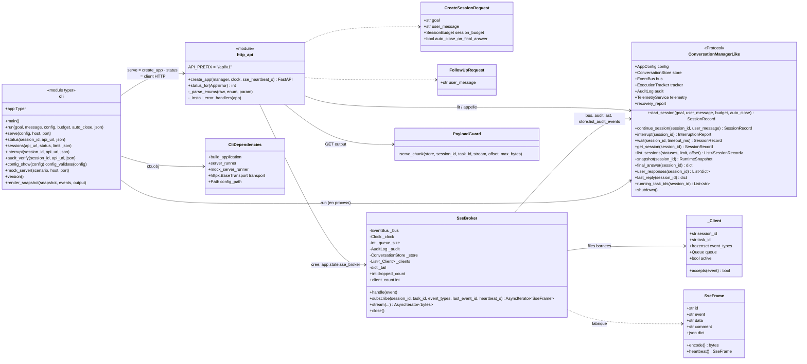
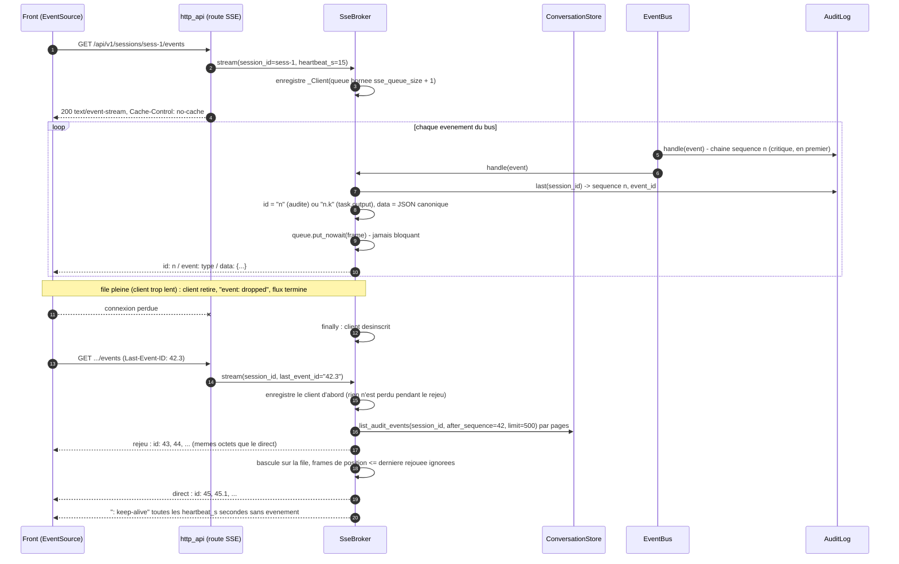
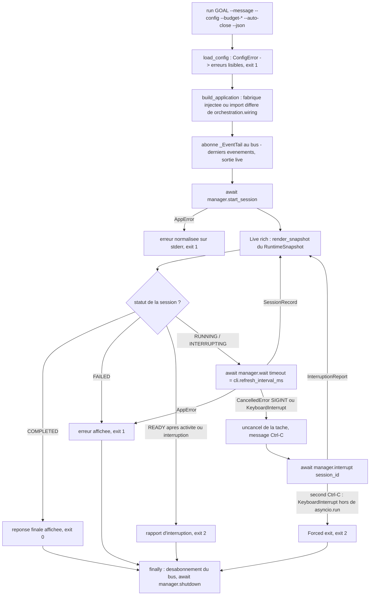

# Phase 9b — Interfaces : API HTTP locale (REST + SSE) et CLI

**Composants** : `interfaces/http_api.py` (`create_app`, `ConversationManagerLike`, `status_for`), `interfaces/sse.py` (`SseBroker`, `SseFrame`, `parse_event_id`, `frame_from_audit_event`), `interfaces/cli.py` (application typer `app`, `main`, `CliDependencies`, `render_snapshot`), `interfaces/__init__.py`.
**Double de test** : `tests/integration/fake_manager.py` (`FakeConversationManager`, le double fidèle de la façade de la phase 9a).
**Gate** : `pytest -m phase9` (fichiers `test_phase9_api.py`, `test_phase9_cli.py`) entièrement vert sur Python 3.11 et 3.12 · `ruff check` · `ruff format --check` · `mypy --strict` (Linux et `--platform win32`).
**État** : ✅ vert — 117 tests (84 API/SSE, 33 CLI) ; suite complète 2146 verts sur 3.11 et 3.12.

## 1. Objectif et périmètre

La spec fait du `ConversationManager` le « point d'entrée des demandes et des interruptions » (§3.1) et exige que l'état soit « observable à tout instant » (§4, §17.3, critère 3) ; ADR-002 choisit deux interfaces minces **sans logique métier** — une CLI et une API HTTP locale — qui appellent toutes deux la même façade ; ADR-018 conçoit l'API pour un front : ressources REST, **flux live SSE** avec reprise `Last-Event-ID`, événements `task.output`, lecture des sorties par plage, `config.toml` unique avec `config show` / `config validate`. Cette phase livre :

1. **`interfaces/http_api.py`** — `create_app(manager) -> FastAPI` sous `/api/v1` : sessions (création, liste filtrée et paginée, détail, interruption, message de suivi §11, snapshot §4.1, réponse finale), conversations, plans (`?include=tasks`), tâches (filtres `status` / `plan_id`, la vue « en cours » du front), sortie par plage (même moteur que `chunk_request`), messages, échecs, demandes de correction (ADR-023), audit paginé et vérifié, trois flux SSE, `/metrics`, `/health`, `/config` ; erreurs uniformes `{"error": NormalizedError}` ; CORS restreint ; pagination `api.page_size`.
2. **`interfaces/sse.py`** — `SseBroker` : abonné **non critique** du bus (ADR-015) qui ne fait qu'empiler des `SseFrame` dans des files **bornées** par client ; client trop lent débranché (`event: dropped`) sans jamais bloquer le bus ; identifiants alignés sur la chaîne d'audit ; reprise depuis `store.list_audit_events` puis bascule sur le direct ; heartbeat `: keep-alive`.
3. **`interfaces/cli.py`** — `agentic-app` : `run` (session en process, affichage rich en direct, **Ctrl-C = interruption**, second Ctrl-C = sortie forcée), `serve`, `status`, `sessions`, `interrupt`, `reply` (ADR-022), `audit verify` (clients de l'API), `config show` / `config validate`, `mock-server`, `version`.

La phase 9a (autre agent, en parallèle) livre `orchestration/` : `ProtocolOrchestrator`, `ConversationManager`, `RecoveryCoordinator`, `wiring.build_application`. Les interfaces sont codées **contre le contrat de la façade** (protocole `ConversationManagerLike`, §3.1 de ce guide) et testées avec un double qui l'implémente fidèlement au-dessus des composants réels ; l'intégration réelle (`serve` / `run` sur `build_application`) se fera à la livraison de 9a sans changer une ligne ici.

Hors périmètre : la boucle protocolaire, la reprise (ADR-016), le câblage (`wiring`), l'authentification de l'API (locale, liée à `127.0.0.1` par défaut, ADR-002), un front.

## 2. Prérequis

- Phases 0 à 8 et 10 vertes : `config.py` (`ApiSection`, `CliSection`, `AppConfig.masked()`, `load_config`, `ConfigError`), `domain/*` (records, états, `Event`/`EventType`/`audited`, `canonical_json`, `NormalizedError`/`AppError`), `persistence/interface.py` (lectures paginées, `get_blob_for_task`, `read_blob_range`, `list_audit_events(after_sequence, limit)`), `execution/payload_guard.py` (`serve_chunk`, `decode_output`), `interruption/handler.py` (`InterruptionReport`), `observability/*` (`AuditLog.last`/`verify`, `ExecutionTracker.snapshot` → `RuntimeSnapshot`, `TelemetryService.render_text`, `EventBus.subscribe(name=, critical=, event_types=)`), `testing/mock_model_server.py` (`run_mock_server(host, port, scenario, runner=)`).
- Dépendances déjà présentes : fastapi, uvicorn, httpx, typer, rich, pydantic.
- Décisions applicables : ADR-002 (deux interfaces minces, Ctrl-C = interruption), ADR-015 (bus synchrone, abonné SSE = files bornées), ADR-017 (horloge injectée, JSON canonique), ADR-018 (routes, flux live, `task.output` non audité, `config.toml`).

## 3. Conception

### 3.1 Le contrat de façade (`ConversationManagerLike`)

Un `typing.Protocol` défini dans `http_api.py` — les interfaces n'importent **jamais** `orchestration/` (règle 2 du module map) :

```python
class ConversationManagerLike(Protocol):
    # membres en lecture seule (propriétés ou attributs simples côté implémentation)
    config: AppConfig ; store: ConversationStore ; bus: EventBus
    tracker: ExecutionTracker ; audit: AuditLog ; telemetry: TelemetryService
    recovery_report: Any | None
    async def start_session(*, goal, user_message, budget=None, auto_close=None) -> SessionRecord
    async def continue_session(session_id, user_message) -> SessionRecord   # ValueError / KeyError
    async def interrupt(session_id) -> InterruptionReport                    # KeyError
    async def wait(session_id, *, timeout_ms=None) -> SessionRecord
    def get_session(session_id) -> SessionRecord | None
    def list_sessions(*, statuses=None, limit=100, offset=0) -> list[SessionRecord]
    def snapshot(session_id) -> RuntimeSnapshot                              # KeyError
    def final_answer(session_id) -> dict | None
    def user_responses(session_id) -> list[dict]                            # ADR-022
    def last_reply(session_id) -> dict | None                               # ADR-022
    def running_task_ids(session_id) -> list[str]
    async def shutdown() -> None
```

`FakeConversationManager` (tests) l'implémente sur un `InMemoryConversationStore`, un `EventBus` avec `AuditLog` (critique) → `ExecutionTracker` → `TelemetryService` inscrits dans l'ordre ADR-015, la vraie `ConversationLifecycleManager` (sessions / conversations) et le vrai `InterruptionHandler` (`interrupt`). Ses aides de simulation (`publish`, `add_cycle`, `add_plan`, `set_task_state`, `emit_output`, `add_blob`, `add_message`, `add_failure`, `complete`, `fail`) produisent **exactement** les records et les événements du contrat de la phase 10, sans orchestrateur ; ses boutons (`on_start`, `wait_script`, `wait_raises`, `start_raises`, `interrupt_raises`) scénarisent la CLI.

### 3.2 Classes : API, broker SSE, CLI



### 3.3 Un client SSE, du direct à la reprise `Last-Event-ID`



### 3.4 `agentic-app run` et Ctrl-C



Sur POSIX comme sur Windows, `asyncio.run` installe son gestionnaire SIGINT : le premier Ctrl-C **annule** la tâche principale (`CancelledError` au point d'attente, ici `manager.wait`), le second lève `KeyboardInterrupt` depuis `asyncio.run`. La CLI traite `CancelledError` et `KeyboardInterrupt` de la même façon (`_uncancel()` puis `manager.interrupt`), ce que les tests simulent en faisant lever `KeyboardInterrupt` par le double ; le comportement réel a été vérifié manuellement par envoi de SIGINT à un processus (3.11 et 3.12).

### 3.5 Choix de conception

| Sujet | Décision | Motif |
|---|---|---|
| Routes nichées | `/sessions/{sid}/plans/{pid}`, `/sessions/{sid}/tasks/{tid}` : `plan_id` / `task_id` viennent du modèle et ne sont uniques que **par session** | ADR-007 |
| Erreurs uniformes | toujours `{"error": NormalizedError}` (§6) : `AppError` → son erreur et un statut par `error_type` (`status_for` : transport 502/503/504, `BUDGET_EXCEEDED` et `INTERRUPTED` 409, `INVALID_TRANSITION` 409, persistance/système 500) ; `KeyError` → 404 `NOT_FOUND` ; `ValueError` → 409 `CONFLICT` ; validation → 422 `VALIDATION_ERROR` avec `details.errors` ; autre HTTP → `HTTP_<statut>` | ADR-002 |
| Sérialisation | `model_dump(mode="json")` partout (dates ISO 8601 `Z`, énumérations en valeurs) ; `InterruptionReport` (dataclass) via `TypeAdapter` ; jamais d'octets : la sortie est décodée UTF-8 avec remplacement (`decode_output`, ADR-003) | ADR-018 |
| Pagination | `limit` (défaut `api.page_size`) / `offset` → `{items, limit, offset, next_offset}` ; audit : `after` / `limit` → `{items, after, limit, next_after}` | ADR-018 |
| Sortie par plage | même moteur que `chunk_request` : `PayloadGuard.serve_chunk` (plafonné à `payload.hard_max_output_bytes`) ; aucun blob → 404 `CHUNK_REF_NOT_FOUND` ; `offset` au-delà → 422 `CHUNK_RANGE_INVALID` ; `offset == total` (flux vide compris) → 200, `data` vide, `eof` | ADR-011 |
| SSE : identifiants | `id = "<sequence>"` (audité, lu par `audit.last(session_id)` — l'`AuditLog` a chaîné l'événement juste avant, ordre ADR-015) ; `"<sequence>.<n>"` pour `task.output`, `n` remis à zéro à chaque événement audité ; `data` = JSON canonique de `{event_id, sequence, event_type, timestamp, session_id, conversation_id, cycle_id, plan_id, task_id, payload}` (sans `event_id`/`sequence` pour `task.output`) ; un frame rejoué depuis un `AuditEvent` est **identique à l'octet** au frame direct | ADR-015, ADR-017, ADR-018 |
| SSE : file bornée | `asyncio.Queue(maxsize=sse_queue_size + 1)` par client : `sse_queue_size` frames au plus, la place restante est réservée au marqueur `dropped` / `closed` ; au débordement le client est retiré **immédiatement**, reçoit ses frames en attente puis `event: dropped` (`{reason, queue_size, session_id, task_id, timestamp}`) et le flux se termine ; `bus.publish` ne bloque jamais et ne voit jamais d'exception | ADR-015, ADR-018 |
| SSE : threads | `handle` empile directement quand il tourne sur la boucle du client, sinon par `loop.call_soon_threadsafe` ; boucle fermée → client oublié | robustesse |
| SSE : reprise | `Last-Event-ID` (en-tête) ou `?last_event_id=` ; le client est enregistré **avant** le rejeu ; `list_audit_events(after_sequence)` par pages de 500, filtres du client appliqués ; les frames directs de position `(sequence, n) <=` dernière position rejouée sont ignorés (dédoublonnage) ; `Last-Event-ID: 0` rejoue tout l'historique | ADR-018 |
| SSE : heartbeat | `: keep-alive` après `sse_heartbeat_s` secondes sans frame (`create_app(..., sse_heartbeat_s=15.0)` ; `None` en test) — l'attente réelle passe par `asyncio.wait_for`, l'horloge injectée ne sert qu'à dater le frame `dropped` | ADR-017 |
| SSE : hot path | sans client intéressé, `handle` ne construit pas le frame (il ne fait qu'avancer les compteurs d'identifiants) : `task.output` reste bon marché | ADR-018 |
| Flux global `/events` | tous les événements, sans reprise (un identifiant `"<sequence>"` ne désigne une chaîne que par session — point ouvert n°1) | 08 §9.5 |
| `create_app` | un `SseBroker` par application, inscrit `"sse"` sur le bus (une seconde application sur le même bus est refusée par le bus : `ValueError`) ; lifespan : `broker.close()` puis `manager.shutdown()` ; `app.state.manager` / `app.state.sse_broker` | ADR-015 |
| CLI : injection | `CliDependencies` dans `ctx.obj` (`build_application`, `server_runner`, `mock_server_runner`, `transport` httpx, `config_path` de l'option globale `--config`) ; en production `build_application` est importé **paresseusement** par `importlib` depuis `orchestration.wiring` | ADR-002, module map règle 2 |
| CLI : rendu | `render_snapshot(dict)` travaille sur la forme JSON du `RuntimeSnapshot` : `run` (objet dumpé) et `status` (réponse HTTP) affichent **la même chose** ; textes dynamiques rendus en `rich.text.Text` (jamais interprétés comme balisage) ; `--json` : document `{session_id, status, exit_code, final_answer, interruption, error, snapshot}` sur stdout, erreurs sur stderr | ADR-018 |
| CLI : codes retour | 0 réponse finale · 1 échec / erreur / configuration invalide · 2 interruption (Ctrl-C, ou session `READY` sans réponse) ; `audit verify` : 1 si la chaîne est rompue | ADR-002 |
| Déterminisme | aucune horloge ni aléa : `create_app` prend `clock` (sinon `manager.clock`, sinon `SystemClock`) ; le test d'inspection de la phase 10 couvre `interfaces/` | ADR-017 |

## 4. Table des routes (`/api/v1`)

| Méthode | Route | Paramètres | Réponse | Erreurs |
|---|---|---|---|---|
| POST | `/sessions` | corps `{goal, user_message, session_budget?: {max_cycles, max_plans, max_total_duration_ms}, auto_close_on_final_answer?}` (champs inconnus refusés) | `201 SessionRecord` | 422 corps invalide ; statut de l'`AppError` levée par la façade (409 budget, 500 persistance…) |
| GET | `/sessions` | `status=running,ready` (valeurs `SessionState`, insensible à la casse), `limit≥1` (défaut `api.page_size`), `offset≥0` | `{items: [SessionRecord], limit, offset, next_offset}` (plus récentes d'abord) | 422 filtre ou pagination invalide |
| GET | `/sessions/{sid}` | — | `SessionRecord` + `conversation: ConversationRecord \| null` (courante) | 404 |
| POST | `/sessions/{sid}/interrupt` | — | `200 InterruptionReport` (`nothing_to_interrupt` si rien à interrompre) ; répond quand `READY` | 404 ; 500 persistance |
| POST | `/sessions/{sid}/messages` | corps `{user_message}` | `202 SessionRecord` (session relancée, §11 — aussi la réponse à une question du modèle, ADR-022) | 404 ; 409 `CONFLICT` si non réutilisable ; 422 |
| GET | `/sessions/{sid}/snapshot` | — | `RuntimeSnapshot` complet (§4.1, deux niveaux) | 404 |
| GET | `/sessions/{sid}/final-answer` | — | `{session_id, final_answer: dict \| null}` | 404 |
| GET | `/sessions/{sid}/responses` | — | `[{message_id, conversation_id, cycle_id, received_at, format, body, status, expects_reply}]` — les `user_response` valides de la session, du plus ancien au plus récent (ADR-022) | 404 |
| GET | `/sessions/{sid}/reply` | — | `{type: "final_answer" \| "user_response", message_id, conversation_id, cycle_id, received_at, content}` — la dernière réponse concluante du modèle (ADR-022) | 404 session inconnue ; 404 `REPLY_NOT_FOUND` tant que le modèle n'a rien conclu |
| GET | `/sessions/{sid}/conversations` | — | `[ConversationRecord]` (chaîne, du plus ancien au plus récent) | 404 |
| GET | `/sessions/{sid}/conversations/{cid}` | — | `ConversationRecord` | 404 (inconnue ou d'une autre session) |
| GET | `/sessions/{sid}/plans` | `include=tasks` | `[PlanRecord]` (+ `tasks: [TaskRecord]` par plan si demandé) | 404 ; 422 `include` inconnu |
| GET | `/sessions/{sid}/plans/{pid}` | `include=tasks` | `PlanRecord` (+ `tasks`) | 404 ; 422 |
| GET | `/sessions/{sid}/tasks` | `status=running,pending` (valeurs `TaskState`), `plan_id` | `[TaskRecord]` (ordre du plan puis `order_index`) — la vue « en cours » | 404 ; 422 statut inconnu |
| GET | `/sessions/{sid}/tasks/{tid}` | — | `TaskRecord` (tous les champs §4.1 + ADR) | 404 |
| GET | `/sessions/{sid}/tasks/{tid}/output` | `stream=stdout\|stderr` (défaut stdout), `offset≥0` (défaut 0), `max_bytes≥1` (défaut 65 536, plafonné à `payload.hard_max_output_bytes`) | `{task_id, stream, offset, data (UTF-8 remplacé), range: [début, fin), total, eof}` | 404 tâche ou blob absent (`CHUNK_REF_NOT_FOUND`) ; 422 paramètres invalides ou `offset > total` (`CHUNK_RANGE_INVALID`) |
| GET | `/sessions/{sid}/messages` | `direction=inbound\|outbound` (alias `in`, `out`), `conversation_id` | `[MessageRecord]` de toutes les conversations de la session, dans l'ordre | 404 ; 422 |
| GET | `/sessions/{sid}/failures` | — | `[FailureRecord]` | 404 |
| GET | `/sessions/{sid}/corrections` | — | `[{message_id, conversation_id, cycle_id, created_at, posted_at, size_bytes, error_code, errors, expected_types, reminder, example, raw_excerpt, attempt, max_attempts}]` — les `protocol_correction_request` envoyés au modèle, du plus ancien au plus récent, toutes conversations confondues (ADR-023) ; `[]` si le modèle n'a jamais eu à être corrigé | 404 |
| GET | `/sessions/{sid}/audit` | `after≥0` (séquence), `limit≥1` (défaut `api.page_size`) | `{items: [AuditEvent], after, limit, next_after}` | 404 ; 422 |
| GET | `/sessions/{sid}/audit/verify` | — | `AuditVerification` (`valid, checked, first_broken_sequence, reason, verified_at`) | 404 |
| GET | `/sessions/{sid}/events` (SSE) | en-tête `Last-Event-ID` ou `last_event_id`, `event_types=a,b` (valeurs `EventType`) | `text/event-stream`, `Cache-Control: no-cache` — rejeu puis direct | 404 ; 422 type inconnu |
| GET | `/events` (SSE) | `event_types` | flux de toutes les sessions (tableau de bord) | 422 |
| GET | `/sessions/{sid}/tasks/{tid}/output/live` (SSE) | — | uniquement les `task.output` de cette tâche | 404 |
| GET | `/metrics` | — | `text/plain; version=0.0.4` — `TelemetryService.render_text()` | — |
| GET | `/health` | — | `{status: "ok", version, sessions_running, recovery_report}` | — |
| GET | `/config` | — | `AppConfig.masked()` (jeton `"***"` ou `null`) | — |

Toutes les erreurs ont la forme `{"error": {error_type, error_code, severity, origin, retryable, recoverable, attempt, max_attempts, details}}`. La documentation OpenAPI est servie sur `/api/v1/docs`.

## 5. Format des événements SSE

```
id: 42
event: task.state_changed
data: {"conversation_id":"conv-0001","cycle_id":"cyc-0003","event_id":"evt-0042","event_type":"task.state_changed","payload":{"duration_ms":8,"exit_code":0,"from":"RUNNING","to":"COMPLETED"},"plan_id":"plan-1","sequence":42,"session_id":"sess-0001","task_id":"t6","timestamp":"2026-09-18T14:03:07.412000Z"}

id: 42.1
event: task.output
data: {"conversation_id":"conv-0001","cycle_id":"cyc-0003","event_type":"task.output","payload":{"data":"[INFO] Scanning...","offset":4096,"size":1024,"stream":"stdout"},"plan_id":"plan-1","session_id":"sess-0001","task_id":"t7","timestamp":"2026-09-18T14:03:07.500000Z"}

: keep-alive

event: dropped
data: {"queue_size":1000,"reason":"queue_full","session_id":"sess-0001","task_id":null,"timestamp":"2026-09-18T14:03:09Z"}
```

- `id` : séquence d'audit de l'événement (`"42"`), ou `"<séquence>.<n>"` pour un `task.output` (non audité, non rejouable — la sortie complète se relit par `GET .../output`) ; `event` : la valeur d'`EventType` ; `data` : JSON canonique (clés triées, séparateurs compacts, ADR-017) de l'enveloppe de l'événement ; un `dropped` n'a pas d'`id`.
- Reprise : `Last-Event-ID: 42.3` rejoue les événements audités de séquence `> 42` puis continue en direct ; les doublons sont éliminés par position `(séquence, n)`.
- Un frame de rejeu (construit depuis l'`AuditEvent`) et le frame direct du même événement sont **identiques**, y compris `timestamp` et `payload`.

## 6. Commandes de la CLI

| Commande | Options | Rôle | Code retour |
|---|---|---|---|
| `run GOAL` | `--message/-m` (défaut : le goal), `--config`, `--budget-cycles`, `--budget-plans`, `--budget-duration-ms` (les valeurs absentes viennent de `[budget]`), `--auto-close`, `--json` | construit l'application (`build_application`), démarre la session, affiche en direct (session, conversation, cycle, plan, tâches, derniers événements, sortie live), Ctrl-C = interruption, second Ctrl-C = sortie forcée, puis réponse finale / réponse directe du modèle (panneau `Model response (<format>, <status>)`, et la commande `reply` à taper si le modèle attend une réponse, ADR-022) / rapport / erreur ; `--json` porte aussi `last_reply` | 0 réponse finale ou réponse directe · 1 échec, erreur, configuration invalide · 2 interruption |
| `serve` | `--config`, `--host`, `--port` (défauts `[api]`) | `uvicorn` sur `create_app(build_application(config).manager)` | — (Ctrl-C arrête uvicorn ; lifespan → `manager.shutdown()`) |
| `status SESSION_ID` | `--api-url` (défaut `http://{api.host}:{api.port}`), `--json` | `GET /sessions/{sid}/snapshot`, rendu identique à `run` | 0 · 1 (erreur API ou injoignable) |
| `sessions` | `--api-url`, `--status`, `--limit`, `--json` | `GET /sessions` en table | 0 · 1 |
| `interrupt SESSION_ID` | `--api-url`, `--json` | `POST /sessions/{sid}/interrupt`, rapport affiché | 0 · 1 |
| `reply SESSION_ID MESSAGE` | `--api-url`, `--json` | `POST /sessions/{sid}/messages` : répondre à une question du modèle (`user_response` avec `expects_reply`, ADR-022) ou envoyer un suivi ; affiche la session relancée et la conversation | 0 · 1 (409 si la session n'est pas réutilisable) |
| `audit verify SESSION_ID` | `--api-url`, `--json` | `GET /sessions/{sid}/audit/verify` | 0 chaîne valide · 1 chaîne rompue ou erreur |
| `config show` | `--config` | configuration effective en JSON, jeton masqué | 0 · 1 |
| `config validate` | `--config` | charge et valide ; erreurs lisibles (`section.clé: message`) | 0 · 1 |
| `mock-server` | `--scenario` (un fichier JSON) ou `--scenario-name` (`java`, défaut : le scénario §12 ; `analysis` : une `user_response` sans commande, ADR-022 — les deux options s'excluent), `--host` (127.0.0.1), `--port` (9000) | `run_mock_server` (uvicorn, injectable) | — · 1 nom inconnu ou options incompatibles |
| `version` | — | `agentic-app <version>` | 0 |
| option globale `--config` | — | chemin du `config.toml` pour toutes les commandes (sinon `AGENTIC_APP_CONFIG`, sinon `./config.toml`, sinon défauts) | — |

## 7. Plan de tests

Fichiers `tests/integration/test_phase9_api.py` (84 cas) et `tests/integration/test_phase9_cli.py` (33 cas), marqueur `phase9`, nommage `given_<état>_when_<action>_then_<résultat>`. API : `httpx.AsyncClient(transport=httpx.ASGITransport(app))` pour le REST ; pour les flux SSE un `StreamingASGITransport` de test (le transport standard d'httpx bufferise tout le corps et ne rendrait jamais la main sur un flux infini) qui livre les chunks au fil de l'eau et signale `http.disconnect` à la fermeture ; broker testé aussi directement par `subscribe()`. CLI : `typer.testing.CliRunner`, fabrique injectée, `httpx.MockTransport`, runners injectés.

### 7.1 API REST

| Test | Vérifie | Réf. |
|---|---|---|
| `given_valid_request_when_session_created_then_201_with_record_and_default_budget` · `given_explicit_budget_and_auto_close_when_session_created_then_forwarded_to_manager` · `given_invalid_body_when_session_created_then_422_with_uniform_error` (×4) | création, budget par défaut de la config, transmission exacte à la façade, corps invalides / champ inconnu → 422 uniforme | ADR-002, ADR-012 |
| `given_three_sessions_when_listed_with_status_filter_then_only_matching_newest_first` · `given_sessions_when_listed_with_limit_and_offset_then_page_with_next_offset` · `given_manager_with_small_page_size_when_listed_without_limit_then_page_size_applies` · `given_invalid_list_parameters_when_sessions_listed_then_422` (×3) | filtre multi-statuts insensible à la casse, pagination, `api.page_size`, 422 | ADR-018 |
| `given_session_when_fetched_then_record_with_current_conversation` · `given_unknown_session_when_fetched_then_404_with_normalized_error` | détail + conversation courante ; 404 normalisé | ADR-018 |
| `given_running_session_when_snapshot_requested_then_complete_4_1_snapshot_equal_to_tracker` · `given_unknown_session_when_snapshot_requested_then_404` | tous les champs §4.1 (conversation, cycle, plan, tâches, interaction modèle), égalité avec `RuntimeSnapshot.model_dump`, budget consommé, `running_task_ids`, `snapshot_at` de l'horloge injectée | §4.1, §3.19, critère 3 |
| `given_running_session_when_interrupted_then_report_returned_and_session_ready` · `given_idle_session_when_interrupted_then_nothing_to_interrupt_report` · `given_unknown_session_when_interrupted_then_404` | interruption réelle (`InterruptionHandler`) : tâches interrompues, plan, cycle, conversation, session `READY`, rapport sérialisé | §9, critères 15–16 |
| `given_completed_reusable_session_when_follow_up_posted_then_202_and_session_running` · `given_running_session_when_follow_up_posted_then_409_conflict` · `given_follow_up_without_message_when_posted_then_422` · `given_unknown_session_when_follow_up_posted_then_404` · `given_completed_session_when_final_answer_requested_then_answer_returned` | message de suivi (§11), 409 si non réutilisable, réponse finale | §11 |
| `given_interrupted_then_restarted_session_when_conversations_listed_then_chain_in_order` · `given_conversation_of_another_session_when_fetched_then_404` | chaîne de conversations (ADR-006), isolation par session | ADR-006 |
| `given_plans_when_listed_with_include_tasks_then_tasks_embedded_in_plan_order` · `given_running_and_pending_tasks_when_filtered_by_status_running_then_only_running` · `given_tasks_of_two_plans_when_filtered_by_plan_id_then_only_that_plan` · `given_task_when_fetched_then_full_record_and_404_for_unknown` | plans avec tâches, filtres `status` / `plan_id` (la vue « en cours »), détail complet | ADR-018 |
| `given_stdout_blob_when_output_read_by_range_then_exact_data_range_total_and_eof` · `given_stderr_blob_with_invalid_utf8_when_output_read_then_replacement_characters` · `given_task_without_blob_when_output_read_then_404` · `given_invalid_output_parameters_when_output_read_then_422` (×4) · `given_offset_beyond_total_when_output_read_then_422_range_invalid` · `given_offset_equal_to_total_when_output_read_then_empty_data_and_eof` · `given_max_bytes_above_hard_limit_when_output_read_then_capped` | lecture par plage : octets exacts, `range`/`total`/`eof`, décodage avec remplacement, 404, 422, plafond `hard_max_output_bytes` | ADR-011, ADR-003 |
| `given_messages_in_two_conversations_when_listed_then_all_in_order_with_direction_filter` · `given_failures_when_listed_then_records_returned_in_order` | messages de toutes les conversations, filtres `direction` / `conversation_id`, échecs | ADR-018 |
| `given_audit_chain_when_paged_with_after_and_limit_then_contiguous_pages` · `given_audit_chain_when_verified_then_valid_and_tampered_chain_reported` | pagination `after`/`limit`/`next_after`, `verify` valide puis rupture détectée (`HASH_MISMATCH` à la séquence 3) | §3.16, critère 14 |
| `given_events_when_metrics_requested_then_prometheus_text_from_telemetry` · `given_manager_when_health_requested_then_status_running_count_and_recovery_report` · `given_token_in_environment_when_config_requested_then_masked_configuration` · `given_allowed_origin_when_preflight_and_request_then_cors_headers_present` | `/metrics` = `render_text()`, `/health`, `/config` masqué (`"***"`, jamais le secret), CORS (preflight, origine refusée) | ADR-018 |
| `given_manager_raising_app_error_when_request_then_normalized_json_with_mapped_status` · `given_error_type_when_status_mapped_then_documented_http_status` (×9) · `given_invalid_transition_error_when_status_mapped_then_409` · `given_manager_raising_key_error_when_request_then_404` · `given_unknown_route_when_requested_then_uniform_404_error` · `given_fake_manager_when_checked_then_satisfies_the_facade_protocol` | erreurs uniformes, table des statuts, protocole de façade | §6, ADR-002 |

### 7.2 SSE (broker et routes)

| Test | Vérifie | Réf. |
|---|---|---|
| `given_broker_when_created_then_non_critical_subscriber_named_sse_after_adr015_order` | inscription `"sse"` après `audit_log`, `execution_tracker`, `telemetry` ; `close()` désinscrit | ADR-015 |
| `given_subscriber_when_events_published_then_frames_in_order_with_id_event_and_canonical_data` | ordre, `id = séquence`, `event`, `data` canonique avec `event_id`/`sequence`, encodage | ADR-017, ADR-018 |
| `given_task_output_events_when_published_then_ids_are_sequence_dot_n_and_not_audited` | `"7.1"`, `"7.2"`, `"8"`, `"8.1"` ; aucune écriture d'audit ; `parse_event_id` | ADR-018 |
| `given_two_sessions_when_client_subscribed_to_one_then_only_its_events_delivered` · `given_event_type_filter_when_events_published_then_only_matching_types` · `given_task_filter_when_output_of_several_tasks_published_then_only_that_task_output` | filtres session / types / tâche ; flux global | ADR-018 |
| `given_last_event_id_when_client_reconnects_then_missing_audited_events_replayed_once_then_live` · `given_events_published_during_replay_when_reconnected_then_no_duplicate_and_order_kept` | reprise depuis l'audit (frames identiques aux `AuditEvent`), bascule sur le direct, dédoublonnage des événements publiés pendant le rejeu | ADR-018 (test nominatif) |
| `given_slow_client_with_queue_size_2_when_10_events_published_then_dropped_and_bus_never_blocked` | `queue_size=2`, 10 publications synchrones : `bus.publish` rend toujours la main, aucune erreur d'abonné, client retiré (`client_count == 0`, `dropped_count == 1`), frames `6`, `7` puis `dropped`, fin du flux | ADR-015, ADR-018 |
| `given_client_when_stream_closed_then_unsubscribed_and_bus_keeps_publishing` · `given_broker_when_closed_then_every_open_subscription_ends` · `given_heartbeat_enabled_when_stream_idle_then_keep_alive_comment_frames` · `given_broker_without_audit_when_events_published_then_ids_count_per_session` · `given_frame_with_multiline_data_when_encoded_then_one_data_line_per_line` | fermeture propre, `close()`, heartbeat, repli sans audit, encodage multi-lignes | ADR-018 |
| `given_session_events_route_when_streamed_then_event_stream_headers_and_frames_in_order` · `given_client_gone_when_stream_closed_then_broker_client_removed` · `given_global_events_route_when_streamed_then_events_of_every_session` · `given_output_live_route_when_streamed_then_only_task_output` · `given_last_event_id_header_when_events_route_streamed_then_replay_then_live` · `given_last_event_id_query_when_events_route_streamed_then_same_replay` · `given_event_types_query_when_events_route_streamed_then_filtered` · `given_unknown_session_or_task_when_sse_route_requested_then_404` | routes SSE via le client ASGI en flux : `text/event-stream`, `Cache-Control: no-cache`, désinscription à la déconnexion, `Last-Event-ID` (en-tête et query), filtres, 404 | ADR-018 |

### 7.3 CLI

| Test | Vérifie | Réf. |
|---|---|---|
| `given_config_with_token_in_environment_when_config_show_then_token_masked` · `given_global_config_option_when_config_show_then_same_file_used` · `given_no_config_file_when_config_show_then_defaults_shown` | `config show` masque le jeton, option globale `--config`, défauts | ADR-018 |
| `given_invalid_config_file_when_config_validate_then_exit_1_and_readable_errors` · `given_missing_config_file_when_config_validate_then_exit_1_with_path` · `given_valid_config_file_when_config_validate_then_exit_0` | `config validate` : `CONFIG_INVALID` avec `api.port`, `transport.post_url` ; fichier absent ; valide | ADR-018 |
| `given_cli_when_version_then_prints_package_version` · `given_cli_when_help_then_every_command_listed` | `version`, aide | — |
| `given_injected_server_runner_when_serve_then_api_app_served_on_config_host_and_port` · `given_host_and_port_options_when_serve_then_they_override_the_config` · `given_invalid_config_when_serve_then_exit_1_without_starting` | `serve` : `create_app` sur la façade de la fabrique, hôte/port de la config puis des options, configuration invalide | ADR-002 |
| `given_injected_mock_runner_when_mock_server_then_called_with_scenario_host_and_port` · `given_no_scenario_when_mock_server_then_default_java_scenario_served` | `mock-server` avec `run_mock_server` injecté | ADR-004 |
| `given_mock_api_when_status_then_snapshot_rendered` · `given_mock_api_when_status_with_json_then_raw_snapshot_printed` · `given_unknown_session_on_api_when_status_then_exit_1_with_error` · `given_unreachable_api_when_status_then_exit_1_with_connection_error` | `status` : URL, rendu (session, goal, plan, tâches, commande), `--json`, erreurs | ADR-002 |
| `given_mock_api_when_sessions_then_table_with_every_session` · `given_mock_api_when_interrupt_then_report_printed` · `given_mock_api_when_audit_verify_then_valid_chain_reported` · `given_mock_api_when_audit_verify_finds_a_break_then_exit_1` · `given_config_api_section_when_client_command_without_api_url_then_config_url_used` | clients de l'API, URL par défaut depuis `[api]` | ADR-018 |
| `given_session_completing_immediately_when_run_then_final_answer_shown_and_exit_0` · `given_goal_without_message_when_run_then_goal_used_as_first_message` · `given_budget_and_auto_close_options_when_run_then_forwarded_to_the_manager` · `given_partial_budget_options_when_run_then_config_defaults_fill_the_rest` · `given_session_progressing_over_several_waits_when_run_then_polls_until_terminal` · `given_run_with_json_when_completed_then_machine_readable_result` | `run` : réponse finale (0), options de budget, boucle `wait` au rythme `cli.refresh_interval_ms`, `--json`, `shutdown` appelé | ADR-002, ADR-012 |
| `given_session_failing_when_run_then_failure_shown_and_exit_1` · `given_manager_raising_app_error_at_start_when_run_then_normalized_error_and_exit_1` · `given_invalid_config_when_run_then_exit_1_before_building_the_application` | échec (1), `AppError` normalisée, configuration invalide avant toute construction | §6 |
| `given_keyboard_interrupt_during_wait_when_run_then_manager_interrupted_and_exit_2` · `given_second_keyboard_interrupt_during_the_interruption_when_run_then_forced_exit_2` | Ctrl-C simulé → `manager.interrupt`, session `READY`, rapport (tâches interrompues), code 2 ; second Ctrl-C → sortie forcée, code 2 | ADR-002 |

## 8. Étapes TDD suivies

1. Lecture des textes (§3.1, §3.19, §4, §11, §17.3, §19 ; ADR-002, ADR-015, ADR-017, ADR-018 ; 08-observability §6, 09-module-map, guide de la phase 10) et du code réutilisé (`config.py`, `execution_tracker.py`, `audit_log.py`, `telemetry.py`, `event_bus.py`, `events.py`, `models.py`, `interface.py`, `payload_guard.py`, `handler.py`, `mock_model_server.py`, `conftest.py`).
2. Vérifications techniques préalables : `httpx.ASGITransport` bufferise le corps (d'où le transport de test en flux) ; `Live` de rich imprime le rendu final une fois sur une sortie non-terminal ; `TypeAdapter` sérialise l'`InterruptionReport` ; `CliRunner.invoke(..., obj=)` injecte `ctx.obj` ; `asyncio.run` annule la tâche principale au premier SIGINT et lève `KeyboardInterrupt` au second.
3. Écriture du double `FakeConversationManager` (composants réels, aides de simulation), puis des 117 cas ; exécution → `ModuleNotFoundError: agentic_local_app.interfaces` (**rouge**).
4. **Vert** par module : `sse.py` (frames, files bornées, reprise, heartbeat), `http_api.py` (routes, erreurs uniformes, SSE), `cli.py` (commandes, injection, boucle `run`) ; correctifs sous tests : propriété `SseFrame.json`, textes dynamiques en `Text` (rich interprétait `[t1:stdout]` comme une balise), saut de ligne après le rendu final.
5. **Refactor** : `handle` ne construit le frame qu'en présence d'un client ; paramètres de requête en `Annotated[..., Query()]` ; import paresseux de `wiring` par `importlib` (indépendant de la livraison de 9a pour mypy) ; à la livraison de 9a, les membres des protocoles (`config`, `store`, `bus`… et `ApplicationLike.manager`) sont passés en propriétés en lecture seule pour accepter les propriétés de la vraie façade (un attribut mutable de protocole est invariant) ; `ruff format`, `ruff check`, `mypy --strict` (Linux et win32) verts ; suite complète verte sur 3.11 et 3.12.
6. Vérification manuelle du Ctrl-C réel (SIGINT envoyé à un processus, simple et double) sur les deux interpréteurs ; rédaction de ce guide et validation des diagrammes (`check_mermaid.py`).

## 9. Gate

| Contrôle | Commande | Résultat |
|---|---|---|
| Tests de la phase (9b) | `.venv/bin/pytest -q tests/integration/test_phase9_api.py tests/integration/test_phase9_cli.py` | 117 verts (3.11) ; idem avec le venv 3.12 ; `-W error` vert |
| Suite complète | `.venv/bin/pytest -q` | 2146 verts sur 3.11 et sur 3.12 (1970 phases 0–8/10 + 117 de cette phase + les tests 9a présents à la livraison) |
| Compatibilité 9a | `mypy --strict` d'un `facade: ConversationManagerLike = ConversationManager(...)` et d'un `application: ApplicationLike = build_application(config)` ; fumée `create_app(build_application(config).manager)` : `/health` (avec `RecoveryReport`), `/config`, `/sessions`, `/metrics` ; abonnés du bus `audit_log, execution_tracker, telemetry, sse` | ✅ |
| Lint | `.venv/bin/ruff check src/agentic_local_app/interfaces tests/integration/test_phase9_api.py tests/integration/test_phase9_cli.py tests/integration/fake_manager.py` | ✅ |
| Format | `.venv/bin/ruff format --check` (mêmes fichiers) | ✅ |
| Types | `.venv/bin/mypy --strict src/agentic_local_app/interfaces` et `--platform win32` ; `.venv/bin/mypy` (paquet entier, 57 fichiers) | ✅ |
| Inspection horloge / aléa | test de la phase 10 sur `src/agentic_local_app/**` (dont `interfaces/`) | ✅ |
| Diagrammes | `check_mermaid.py docs/phases/phase-09-interfaces.md` | 3/3 rendus |

## 10. Résultat

- **117 tests** : 84 dans `test_phase9_api.py` (sessions 14, snapshot 2, interruption et suivi 8, conversations/plans/tâches 6, sortie par plage 10, messages/échecs/audit 4, métriques/santé/config/CORS 4, erreurs 14, broker SSE 14, routes SSE 8) et 33 dans `test_phase9_cli.py` (config/version 8, serve/mock-server 5, clients de l'API 9, run 11).
- Fichiers livrés : `src/agentic_local_app/interfaces/__init__.py`, `http_api.py`, `sse.py`, `cli.py` ; `tests/integration/fake_manager.py`, `test_phase9_api.py`, `test_phase9_cli.py` ; ce guide.
- Exigences couvertes : §3.1 (point d'entrée des demandes et interruptions, aucune logique protocolaire dans les interfaces), §3.19 / §4.1 (snapshot complet exposé, tous les champs), §11 (message de suivi), §17.3 (état observable à tout instant, audit consultable et vérifiable par l'API), §19 critères 3, 12 (budget dans le snapshot), 14 (`/audit/verify`), 15–16 (interruption par l'API et la CLI, nouvelle demande après `READY`) ; ADR-002 (CLI + API, Ctrl-C = interruption, second Ctrl-C = sortie, erreurs normalisées telles quelles), ADR-011 (sortie par plage = moteur de `chunk_request`), ADR-015 (abonné SSE non critique, files bornées, jamais de blocage du bus), ADR-017 (JSON canonique, horloge injectée, aucun aléa), ADR-018 (toutes les routes, flux live avec `task.output`, reprise `Last-Event-ID`, `config show` / `validate`, jeton masqué, CORS, pagination, `api.sse_queue_size`).

## 11. Points ouverts

1. **Reprise sur `/events` (toutes sessions)** : un `id = "<séquence>"` n'identifie une chaîne que par session ; le flux global ignore `Last-Event-ID` (comme anticipé par 08-observability §9.5). Piste : identifiant composite `"<session_id>:<séquence>"` sur ce seul flux, ou reprise par session côté front.
2. **`docs/phases/README.md`** (hors périmètre 9b) : le tableau d'avancement pointe `phase-09-orchestration.md` ; il devrait aussi lier ce guide et, à la livraison de 9a, passer la phase 9 au vert avec le total des tests (9a + 9b).
3. **`docs/architecture/08-observability.md` §6.1** décrit `id = event_id` d'audit ; l'implémentation retient `id = séquence` (monotone, directement exploitable par `after_sequence`) et met `event_id` dans `data` — le document devrait être aligné (hors périmètre).
4. **Intégration 9a** : `serve` et `run` supposent `build_application(config)` renvoyant un objet portant `.manager` conforme au protocole ; `run` suppose que `wait(sid, timeout_ms=)` rend la main au plus tard après `timeout_ms` (rythme d'affichage) et que la session finit `COMPLETED` / `FAILED` / `READY`. À vérifier au câblage ; `create_app` ne peut être appelé qu'une fois par bus (abonné `"sse"`).
5. **Une seule boucle asyncio** : l'API suppose que l'orchestrateur publie depuis la boucle d'uvicorn (empilage direct) ; une publication depuis un autre thread passe par `call_soon_threadsafe` (couvert) mais les lectures synchrones du store dans les handlers `async` supposent un store utilisable depuis ce thread.
6. **`/health`** ne remonte pas encore l'état du disjoncteur (`CircuitBreaker.degraded`, 08 §9.7) : la façade ne l'expose pas ; à ajouter au contrat quand 9a le publiera.
7. **Authentification** : l'API est locale (`127.0.0.1`) et sans jeton ; toute exposition au-delà de la machine demanderait au minimum un jeton local (ADR à écrire).
