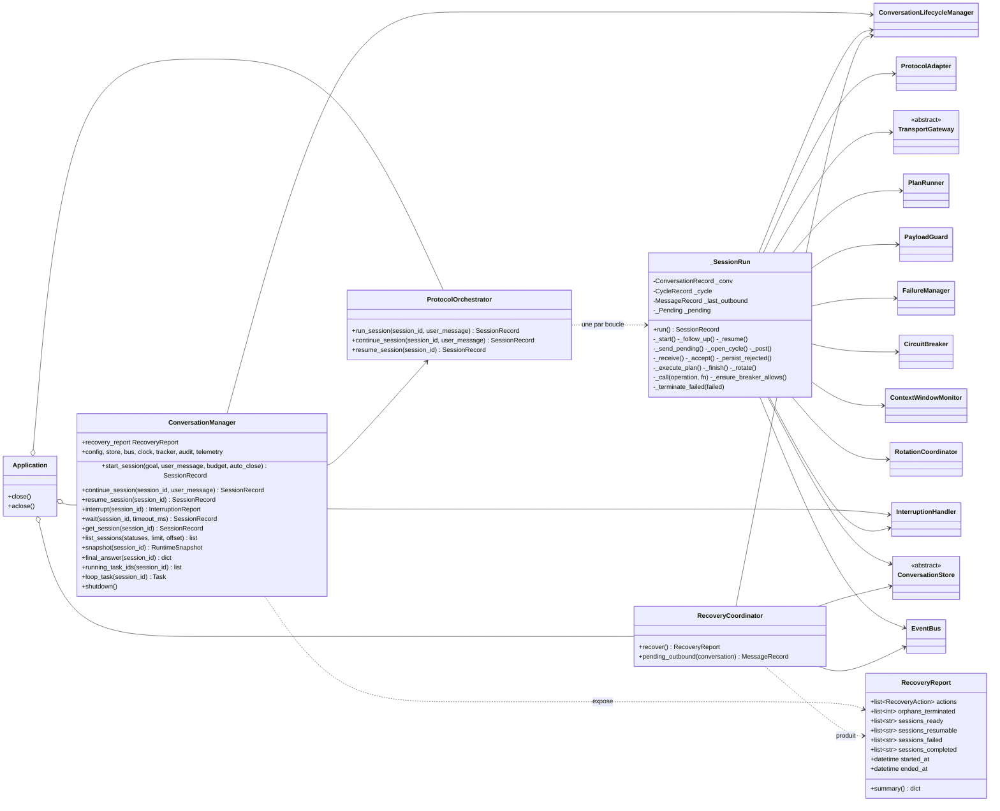
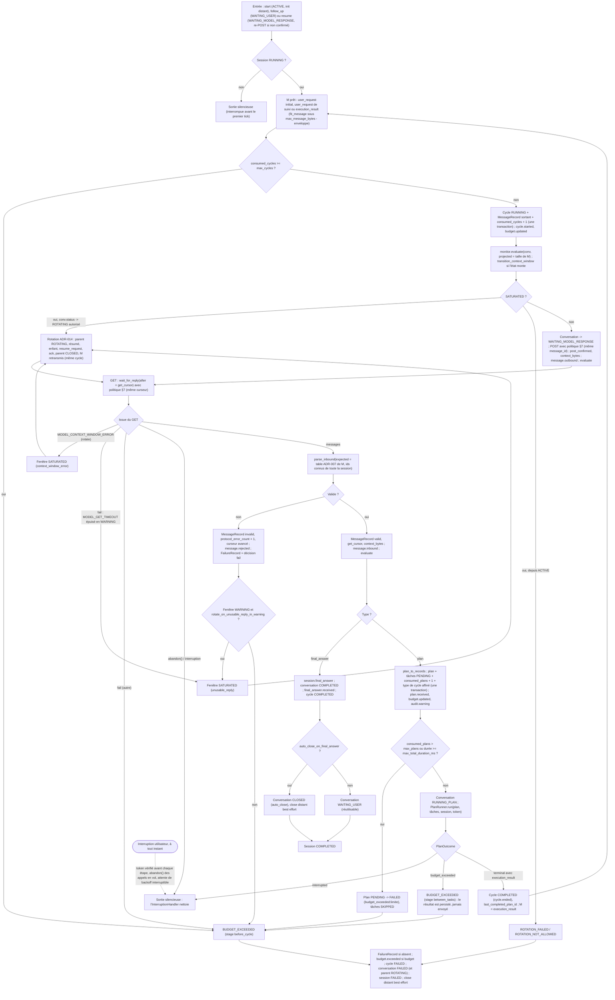
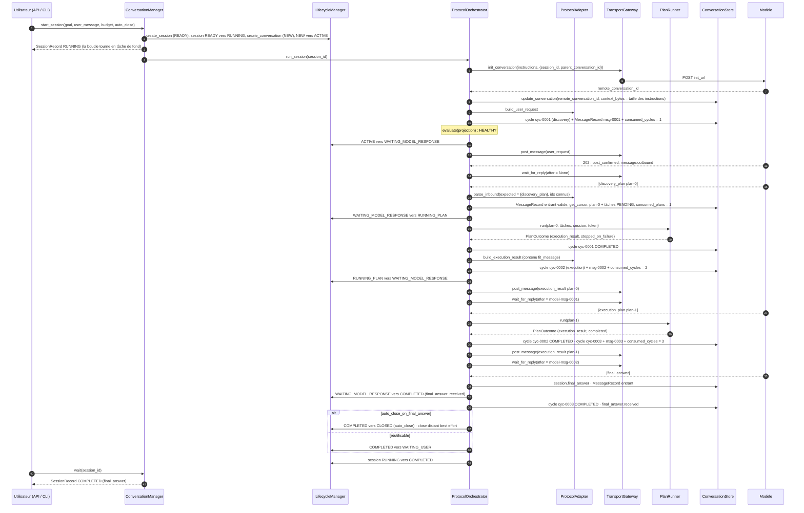
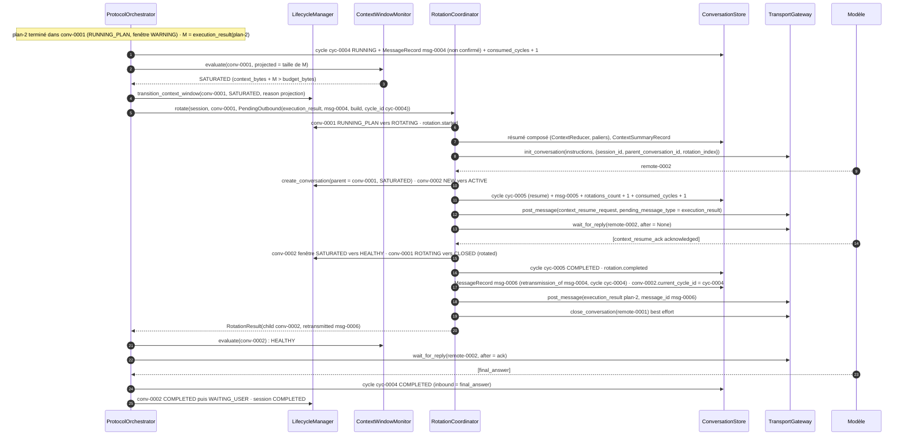
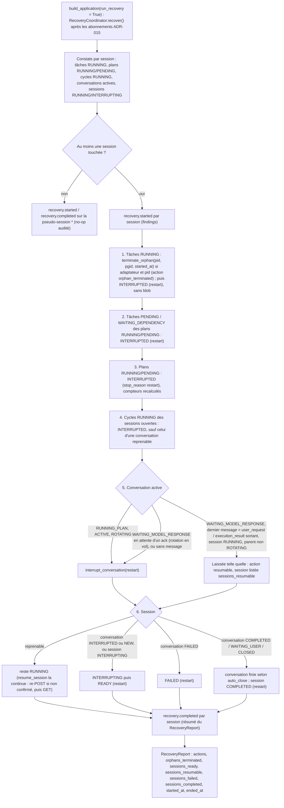

# Phase 9a — Orchestration protocolaire

**Composants** : `orchestration/protocol_orchestrator.py` (`ProtocolOrchestrator`), `orchestration/conversation_manager.py` (`ConversationManager`), `orchestration/recovery.py` (`RecoveryCoordinator`, `RecoveryReport`, `RecoveryAction`), `orchestration/wiring.py` (`Application`, `build_application`), `orchestration/__init__.py` (exports).
**Gate** : `pytest -m phase9` entièrement vert (sur Python 3.11 et 3.12) · `ruff check` · `ruff format --check` · `mypy --strict` (Linux et `--platform win32`).
**État** : ✅ vert — 68 tests (`tests/integration/test_phase9_orchestration.py` : 45, `test_phase9_recovery.py` : 19, `test_phase9_e2e_mock_server.py` : 4 ; harnais partagé `tests/integration/phase9_rig.py`). La partie 9b (API HTTP, SSE, CLI dans `interfaces/`) est livrée par un autre agent contre le contrat de façade décrit en §3.4.

## 1. Objectif et périmètre

La spec confie au `ProtocolOrchestrator` « la boucle protocolaire complète » (§3.2) : coordonner `ProtocolAdapter`, `TransportGateway`, `PlanRunner` et `ContextReducer`, publier les événements, appliquer le budget, réagir aux interruptions ; au `ConversationManager` le rôle de point d'entrée sans logique (§3.1) ; au `RecoveryCoordinator` la reprise après crash (§3.18, §7.5). Le diagramme d'activité (§14) et la séquence (§15) décrivent la boucle nominale ; les ADR l'amendent en profondeur. Cette phase **assemble** les composants livrés par les phases 1 à 8 et 10 sans en modifier aucun, et livre :

1. la **boucle protocolaire** de §14 amendée : `max_cycles` contrôlé avant chaque ouverture de cycle (ADR-012), saturation évaluée avec la **projection** du message sortant avant chaque POST (ADR-013), rotation avec **retransmission** du message en attente `M` dont le cycle continue dans l'enfant (ADR-014, ADR-019 §5), réponse inutilisable en `WARNING` ⇒ rotation au lieu d'échec (ADR-019 §2), disjoncteur consulté avant chaque appel distant (ADR-019 §6), politique d'échec de §7 appliquée par le `FailureManager` sur chaque appel de transport (retry borné avec le même `message_id` / le même curseur), `known_task_ids` = toutes les tâches de la session (ADR-019 §1), finalisation de §11 (`CLOSED` ou `WAITING_USER`), message de suivi ;
2. la **façade** `ConversationManager` : création de la session et de la conversation par le `ConversationLifecycleManager`, boucle lancée en `asyncio.Task` suivie par session, interruption déléguée immédiatement à l'`InterruptionHandler`, lectures pour l'API et la CLI, `wait`, `shutdown`, `resume_session` ;
3. la **reprise** `RecoveryCoordinator` : la table d'ADR-016 §2 appliquée dans l'ordre au démarrage, chaque action persistée puis auditée, `RecoveryReport` exposé par la façade, sessions **reprenables** (« POST envoyé sans GET ») laissées à `resume_session` qui rejoue le POST non confirmé puis fait le GET d'abord ;
4. le **câblage** `build_application` : défauts de production (SQLite, `HttpTransportGateway`, `SubprocessCommandExecutor`, `SystemClock`, `UuidIdGenerator`), doubles injectables (§18.3), abonnements dans l'ordre d'ADR-015, reprise exécutée avant d'accepter une demande (ADR-016 §4).

Hors périmètre : les interfaces (`interfaces/http_api.py`, `interfaces/sse.py`, `interfaces/cli.py`, phase 9b) et toute modification des phases précédentes (les changements souhaitables sont listés en §10).

## 2. Prérequis

- Phases 0 à 8 et 10 vertes (1 970 tests). Composants utilisés tels quels : `ConversationLifecycleManager` (seul propriétaire des transitions de session et de conversation), `ProtocolAdapter` (`build_*`, `expected_inbound`, `parse_inbound`, `plan_to_records`, `render_instructions`), `TransportGateway` (`init_conversation`, `post_message`, `wait_for_reply`, `close_conversation`, `abandon`) et `FakeTransportGateway`, `FailureManager` (`handle`, `record`, `classify`, `note_success`) avec `RetryController` et `CircuitBreaker`, `PlanRunner.run → PlanOutcome`, `PayloadGuard.fit_message`, `ContextWindowMonitor` (`evaluate`, `should_rotate_on_unusable_reply`, `account`, `instructions_bytes`), `ContextReducer`, `RotationCoordinator.rotate(session, source, PendingOutbound)`, `InterruptionHandler` (`token_for`, `register_loop`, `loop_finished`, `interrupt`, `raise_if_interrupted`), `AuditLog`, `ExecutionTracker`, `TelemetryService`, `EventBus`, les deux stores, `open_store`, `FakeCommandExecutor`, le serveur mock (`create_mock_app`, `default_java_debug_scenario`).
- Tables de transitions (`domain/transitions.py`) : `WAITING_USER → ROTATING` et `ROTATING → CLOSED` (ADR-007 / ADR-019 §3), `PENDING → FAILED` et `PENDING → INTERRUPTED` pour un plan, `INTERRUPTING → FAILED` pour une session.
- Contrat des payloads d'événements : `docs/phases/phase-10-observability.md` §4 et `docs/architecture/08-observability.md` §2.
- Décisions applicables : ADR-004 (init, POST idempotent, GET par polling), ADR-006 (nouvelle conversation après interruption), ADR-007 (table des messages attendus, cycles), ADR-009/010 (`fit_message` avant envoi), ADR-012 (budget), ADR-013 (saturation), ADR-014 (rotation, retransmission), ADR-015 (persister avant publier), ADR-016 (reprise), ADR-017 (horloge et identifiants injectés), ADR-019 §1, §2, §5, §6 ; conception détaillée `docs/architecture/00-overview.md` §4, `02-protocol.md`, `05-transport-and-failures.md`, `06-context-rotation.md`, `07-interruption-and-recovery.md`, `08-observability.md`, `09-module-map.md`.

## 3. Conception

### 3.1 Les composants et leurs dépendances

Règles de dépendance (module map §2) : `orchestration` dépend de toutes les couches et n'est importé que par `interfaces` (qui, dans la livraison 9b, ne l'importe que paresseusement et code contre un `Protocol`). Aucune transition de session ni de conversation n'est écrite ici directement : elles passent par le `ConversationLifecycleManager` (critère 2) ; les plans et tâches par le `PlanRunner`, sauf le cas « plan reçu mais budget dépassé » (`PENDING → FAILED`, tâches `SKIPPED`) que l'orchestrateur écrit lui-même à travers les tables de transitions, et la reprise qui écrit tâches, plans et cycles interrompus de la même façon que l'`InterruptionHandler`. Les cycles sont la propriété de l'orchestrateur (ADR-007). Tout est `persister → publier → agir` (ADR-015) et rien n'est publié à l'intérieur d'une transaction du store.

### 3.2 La boucle protocolaire (§14 amendé par les ADR)

Amendements de §14 réalisés : (1) le contrôle de saturation est fait **avant** chaque POST avec la projection, y compris le premier ; (2) « payload trop gros » n'est plus une cause de rotation, `fit_message` borne le message sous `max_message_bytes` moins la taille de l'enveloppe ; (3) le retour de l'ack **retransmet** `M` au lieu de refaire un GET ; (4) `max_cycles` avant chaque cycle (rotation comprise, dont le cycle `resume` compte pour un), `max_plans` et durée après persistance du plan et avant son démarrage, durée entre les tâches dans le runner ; (5) une erreur de protocole ou un `MODEL_GET_TIMEOUT` épuisé en `WARNING` rotate une fois ; (6) `INTERRUPTED` est terminal pour la conversation, `READY` revient à la session ; (7) `system_error` n'est jamais envoyé ; (8) le parent finit `CLOSED` après l'ack.

Choix de mise en œuvre à connaître :

- **Le cycle de `M` est ouvert avant le contrôle de saturation**, pas après : ADR-007 fait démarrer un cycle à la persistance du message sortant, et ADR-019 §5 fait continuer ce cycle dans l'enfant après une rotation (`PendingOutbound.cycle_id`, `child.current_cycle_id`). Un `M` jamais envoyé dans le parent reste persisté avec `post_confirmed = false` ; sa copie retransmise porte `retransmission_of`.
- **Le type du cycle est affiné à la réception du plan** : ouvert `discovery` (premier `user_request`) ou `execution`, il devient `clarification` quand le plan reçu est une `priority_clarification` (`cycle_type_for_plan`). Le `PlanRecord.cycle_id` est celui du cycle qui l'a reçu.
- **La conversation reste `RUNNING_PLAN` jusqu'à la décision d'envoi** du résultat : la rotation d'un `execution_result` projeté trop gros part bien de `RUNNING_PLAN` (ADR-013 §4), celle d'un suivi de `WAITING_USER`, celle d'un GET en erreur de `WAITING_MODEL_RESPONSE`.
- **Un message rejeté est persisté** avec `validation_status = invalid` sous son `message_id` (un identifiant généré s'il est absent ou déjà connu), son type si c'est un `MessageType` connu, sinon `system_error` ; sa taille compte dans `context_bytes` et le curseur avance (ADR-013 : il est bien dans le contexte du modèle).
- **Rien n'est envoyé au modèle** sur `BUDGET_EXCEEDED`, `ROTATION_FAILED`, erreur de protocole ou interruption ; la conversation distante est fermée en best effort à l'échec (ADR-006, ADR-012), jamais à l'interruption (c'est l'`InterruptionHandler` qui s'en charge).
- **Les appels de transport internes à la rotation** (init de l'enfant, POST du `context_resume_request`, GET de l'ack, POST de la retransmission) ne sont pas rejoués par l'orchestrateur : un `TransportError` ou un `ProtocolError` (ack refusé) y devient un échec de rotation (`FailureRecord` de l'erreur, parent et enfant `FAILED`, session `FAILED`, raison `rotation_failed`). Voir §10.

### 3.3 Séquence nominale (critères 1, 8, 9)

Un message de suivi (§11) reprend la même séquence à partir de `continue_session` : session `COMPLETED → RUNNING`, conversation `WAITING_USER → WAITING_MODEL_RESPONSE`, `user_request` de suivi (cycle `execution`, table des messages attendus de suivi), même conversation distante, sans nouvel `init`.

### 3.4 Contrat de façade partagé avec la phase 9b

| Membre | Contrat | États acceptés |
|---|---|---|
| `start_session(*, goal, user_message, budget=None, auto_close=None) -> SessionRecord` | session `READY → RUNNING`, conversation `NEW → ACTIVE`, boucle en tâche de fond, retour immédiat ; `budget` `None` ⇒ défauts `[budget]`, `auto_close` `None` ⇒ `budget.auto_close_on_final_answer` | — |
| `continue_session(session_id, user_message) -> SessionRecord` | `COMPLETED` réutilisable ⇒ `RUNNING`, suivi dans la même conversation ; `READY` (après interruption ou redémarrage) ⇒ `RUNNING`, **nouvelle** conversation fille de la précédente (ADR-006 §3), `discovery_plan` à nouveau obligatoire ; `ValueError` sinon (auto_close, `FAILED`, `RUNNING`…), `KeyError` si inconnue | `COMPLETED`, `READY` |
| `resume_session(session_id) -> SessionRecord` | session `RUNNING` laissée reprenable par la reprise : POST rejoué si non confirmé puis GET d'abord ; `ValueError` sinon | `RUNNING` reprenable |
| `interrupt(session_id) -> InterruptionReport` | délégué à `InterruptionHandler.interrupt` ; répond quand la session est `READY` | tous |
| `wait(session_id, *, timeout_ms=None) -> SessionRecord` | attend la fin de la boucle (`COMPLETED` / `FAILED` / `READY`) ; `TimeoutError` au-delà ; une exception inattendue de la boucle (déjà reflétée `FAILED`) est relevée | tous |
| `get_session`, `list_sessions(statuses, limit, offset)`, `snapshot` (`ExecutionTracker`), `final_answer`, `running_task_ids`, `loop_task` | lectures pures du store et du tracker | — |
| `recovery_report`, `config`, `store`, `bus`, `clock`, `tracker`, `audit`, `telemetry` | accès pour l'API | — |
| `shutdown()` | interrompt proprement (raison `shutdown`) chaque session `RUNNING` et attend sa boucle (borné par le drain + 1 s, puis annulation) | — |

`build_application(config, *, store=None, transport=None, executor=None, clock=None, ids=None, run_recovery=True, bus=None, instructions=None, sleep=None, platform=None) -> Application` : les paramètres ajoutés au contrat (`bus`, `instructions`, `sleep`, `platform`) sont optionnels et servent aux tests (bus observé avant le câblage, instructions courtes pour des budgets minuscules, attente pilotée par la `FakeClock`, adaptateur de plateforme factice pour les orphelins). Un exécuteur injecté est un double : aucun adaptateur de plateforme n'est utilisé pour les orphelins sauf s'il est fourni. `Application.close()` ferme le store ; `Application.aclose()` arrête les boucles, ferme le client HTTP s'il existe puis le store.

### 3.5 Décisions du `FailureManager` → action de l'orchestrateur

`_call(operation, fn)` enveloppe chaque appel distant (`INIT`, `POST`, `GET`) : `breaker.allow()` d'abord (ADR-019 §6 : attente de `min(open_duration_ms, budget de durée restant)` une seule fois, puis `NETWORK_ERROR / CIRCUIT_OPEN` non rejouable), puis `FailureManager.handle(exc, attempt, ...)` sur chaque `TransportError`.

| Décision (`Decision.kind`) | Contexte | Action de l'orchestrateur |
|---|---|---|
| `retry` | `NETWORK`, `TIMEOUT`, `RATE_LIMIT`, `SYSTEM` transitoire, tant que `can_retry` et `breaker.allow()` | `cycle.retry_count + 1`, attente **interruptible** de `delay_ms` sur le `sleep` injecté, même opération avec le même `message_id` (POST) ou le même curseur (GET) |
| `rotate` | `MODEL_CONTEXT_WINDOW_ERROR` (413, `context_window_exceeded`) | fenêtre `SATURATED` (raison `context_window_error`), rotation avec `M` en attente, réception dans l'enfant |
| `fail` | `MODEL_GET_TIMEOUT` épuisé **et** fenêtre `WARNING` (ADR-019 §2) | fenêtre `SATURATED` (raison `unusable_reply`), rotation avec `M` |
| `fail` | erreur de protocole (`parse_inbound`) **et** fenêtre `WARNING` | `message.rejected`, `FailureRecord`, puis rotation avec `M` |
| `fail` | tout autre cas (`max_attempts_exhausted`, `circuit_open`, `non_retryable:<type>`) | cycle `FAILED`, conversation `FAILED` (raison `failure`), session `FAILED`, close distant best effort |
| `abort` | `INTERRUPTED` | sortie silencieuse ; un appel abandonné (`TransportError(INTERRUPTED, ABANDONED)`) n'est **pas** enregistré comme échec |

Hors `FailureManager` : `BudgetExceededError` ⇒ `FailureRecord` + `budget.exceeded` + `FAILED` (raison `budget_exceeded`) ; `RotationFailedError` ⇒ `FailureRecord` + `FAILED` (raison `rotation_failed`) ; tout autre `AppError` ⇒ `FailureRecord` + `FAILED` ; toute autre exception ⇒ `SYSTEM_ERROR / UNHANDLED_EXCEPTION`, `FAILED`, puis l'exception est **relevée** (visible par `ConversationManager.wait`).

### 3.6 Points de contrôle du budget (ADR-012)

| Point | Où | Test | Effet du dépassement |
|---|---|---|---|
| `max_cycles` | avant d'ouvrir un cycle (`_open_cycle`) — `user_request`, `execution_result`, et cycle `resume` d'une rotation (garde du `RotationCoordinator`) | `consumed_cycles >= max_cycles` | `BUDGET_MAX_CYCLES`, `stage = before_cycle`, rien n'est persisté pour ce cycle, le résultat prêt n'est jamais envoyé |
| `max_plans` | après persistance du plan reçu (`consumed_plans + 1`), avant son démarrage | `consumed_plans > max_plans` | plan `PENDING → FAILED` (`budget_exceeded:max_plans`), tâches `SKIPPED` (`budget_exceeded`), `BUDGET_MAX_PLANS`, `stage = before_plan` |
| `max_total_duration_ms` | même endroit | `now - started_at >= max_total_duration_ms` | idem avec `budget_exceeded:max_total_duration_ms` |
| `max_total_duration_ms` | entre deux tâches, dans le `PlanRunner` (phase 5) | idem | plan `FAILED`, tâches restantes `SKIPPED` ; l'orchestrateur publie `budget.exceeded` (`stage = between_tasks`), le résultat est persisté mais **jamais envoyé** |
| `max_rotations_per_session` | garde du `RotationCoordinator` | `rotations_count >= limite` | `ROTATION_FAILED / ROTATION_LIMIT_REACHED` |

`budget.updated` est publié après chaque incrément persisté ; le snapshot expose limites et consommés (critère 12).

### 3.7 Séquence d'une rotation en cours de session (critères 6, 7)

Invariants vérifiés par les tests : contenu de `msg-0006` identique à celui de `msg-0004` (un plan ⇒ un seul `execution_result`, critère 9), `consumed_cycles` = cycles utiles + 1 par rotation (ADR-019 §5), `rotations_count = 1`, parent `CLOSED` / `rotated` avec fenêtre `SATURATED`, enfant `HEALTHY` puis `WAITING_USER`, chaîne d'audit valide sur toute la session. Quand `M` est un `user_request` de suivi, `final_answer_received` est reporté sur l'enfant pour que la table des messages attendus reste celle du suivi (ADR-014, 02 §4).

### 3.8 Reprise après redémarrage (ADR-016)

Une seconde exécution est un no-op (les entités terminales ne sont jamais touchées) ; les tâches `COMPLETED` ne sont jamais rejouées (§17.4) et rien ne relance un plan côté application : après un redémarrage qui a interrompu un plan, la session est `READY` et une nouvelle demande ouvre une conversation fille (ADR-006).

### 3.9 Événements publiés par cette phase (contrat de la phase 10)

| `event_type` | Émetteur | Identifiants | Payload |
|---|---|---|---|
| `cycle.started` | orchestrateur | `cycle_id` | `{cycle_type, outbound_message_id, outbound_message_type, consumed_cycles}` |
| `cycle.ended` | orchestrateur (`COMPLETED` / `FAILED`), reprise (`INTERRUPTED`, payload à la manière de l'`InterruptionHandler` avec `from` / `to`) | `cycle_id`, `plan_id?` | `{status, duration_ms, retry_count, inbound_message_id, inbound_message_type, reason?}` |
| `message.outbound` | orchestrateur | `cycle_id` | `{message_type, message_id, post_status, size_bytes, attempts}` |
| `message.inbound` | orchestrateur | `cycle_id` | `{message_type, message_id, get_status, validation_status: "valid", size_bytes}` |
| `message.rejected` | orchestrateur | `cycle_id` | `{message_type?, message_id?, get_status, validation_status: "invalid", error_code, size_bytes, details}` |
| `plan.received` | orchestrateur | `cycle_id`, `plan_id` | `{plan_type, objective, execution_policy, max_parallel_workers, task_count, consumed_plans, contradictory_flags}` |
| `audit.warning` | orchestrateur (avertissements de `parse_inbound`) | `cycle_id`, `plan_id` | `{code, entity: "plan", id, details}` |
| `plan.state_changed`, `task.state_changed` | orchestrateur (plan refusé pour budget : `PENDING → FAILED`, tâches `PENDING → SKIPPED`), reprise (`→ INTERRUPTED`, `reason = restart`) | `cycle_id`, `plan_id`, `task_id?` | `{from, to, reason, stop_reason?}` (+ `exit_code`, `duration_ms`, `timed_out`, `truncated` depuis `RUNNING`) |
| `final_answer.received` | orchestrateur | `cycle_id` | `{message_id, status, auto_close_on_final_answer, consumed_cycles, consumed_plans, session_duration_ms}` |
| `budget.updated` | orchestrateur | — | `{consumed_cycles, consumed_plans, consumed_duration_ms, max_cycles, max_plans, max_total_duration_ms}` |
| `budget.exceeded` | orchestrateur | `plan_id?` | `{limit, limit_value, consumed, stage}` avec `stage ∈ {before_cycle, before_plan, between_tasks}` |
| `context.window_state_changed` | via `LifecycleManager` | `conversation_id` | raisons : `threshold`, `projection`, `saturation_ratio`, `context_window_error`, `unusable_reply` (et `resume_acknowledged`, `rotation_requested` du coordinateur) |
| `session.state_changed`, `conversation.state_changed` | via `LifecycleManager` | — | raisons : `user_request`, `plan_received`, `execution_result`, `final_answer`, `reusable`, `auto_close`, `failure`, `budget_exceeded`, `rotation_failed`, `restart`, `shutdown` |
| `recovery.started` | reprise | par session touchée (ou `*`) | `{findings: {running_tasks, open_plans, running_cycles, active_conversations, open_sessions}, sessions_found}` |
| `recovery.action` | reprise | ceux de l'entité | `{entity, entity_id, id, from, to, reason, details?}` avec `reason ∈ {restart, resumable, orphan_terminated}` |
| `recovery.completed` | reprise | par session touchée (ou `*`) | `RecoveryReport.summary()` : `{actions, orphans_terminated, sessions_ready, sessions_resumable, sessions_failed, sessions_completed, elapsed_ms}` |

Les événements `failure.recorded` et `retry.scheduled` sont publiés par le `FailureManager`, `rotation.*` et `message.retransmitted` par le `RotationCoordinator`, `interruption.*` par l'`InterruptionHandler`.

### 3.10 État laissé à chaque point d'échec

| Point d'échec | Cycle | Conversation | Session | Autres écritures |
|---|---|---|---|---|
| disjoncteur refusant l'init (`CIRCUIT_OPEN`) | aucun | `ACTIVE → FAILED` | `FAILED` | `FailureRecord NETWORK_ERROR`, `RetryDecisionRecord fail`, pas d'init, pas de close distant |
| init épuisé (`NETWORK_ERROR` ×4) | aucun | `ACTIVE → FAILED` | `FAILED` | 4 `FailureRecord`, 3 décisions `retry` + 1 `fail` |
| `max_cycles` atteint avant un cycle | aucun nouveau (les précédents `COMPLETED`) | `RUNNING_PLAN` ou `WAITING_USER → FAILED` | `FAILED` (`budget_exceeded`) | `budget.exceeded before_cycle`, résultat jamais envoyé |
| POST non rejouable (`AUTHN_ERROR`) ou épuisé | `RUNNING → FAILED` | `WAITING_MODEL_RESPONSE → FAILED` | `FAILED` | `MessageRecord` sortant persisté, `post_confirmed = false` ; close distant best effort |
| GET épuisé en `HEALTHY` (`MODEL_GET_TIMEOUT` ×4) | `FAILED` (`retry_count = 3`) | `→ FAILED` | `FAILED` | idem, `post_confirmed = true` |
| erreur de protocole en `HEALTHY` | `FAILED` | `→ FAILED`, `protocol_error_count + 1`, curseur avancé | `FAILED` (`failure`) | `MessageRecord` entrant `invalid`, `message.rejected`, `FailureRecord MODEL_PROTOCOL_ERROR`, décision `fail` |
| réponse inutilisable en `WARNING` | inchangé, continue dans l'enfant | parent `ROTATING → CLOSED` si la rotation aboutit | `RUNNING` | comme une rotation |
| rotation refusée (`ROTATION_LIMIT_REACHED`, `ROTATION_NOT_ALLOWED`) | `FAILED` | `→ FAILED` (aucun enfant) | `FAILED` (`rotation_failed`) | `rotation.failed` (limite) ; `FailureRecord ROTATION_FAILED` |
| résumé hors budget | `FAILED` | parent `ROTATING → FAILED` (par le coordinateur) | `FAILED` | `rotation.failed`, `FailureRecord ROTATION_FAILED` |
| transport ou ack refusé pendant la rotation | `FAILED` | enfant `→ FAILED` **et** parent `ROTATING → FAILED` | `FAILED` (`rotation_failed`) | `FailureRecord` de l'erreur (ack refusé : `message.rejected` dans l'enfant), close distant best effort des deux |
| plan reçu au-delà de `max_plans` / de la durée | `FAILED` | `WAITING_MODEL_RESPONSE → FAILED` | `FAILED` (`budget_exceeded`) | plan `PENDING → FAILED`, tâches `SKIPPED`, `budget.exceeded before_plan` |
| durée dépassée entre deux tâches | `FAILED` | `RUNNING_PLAN → FAILED` | `FAILED` | plan `FAILED` par le runner, `budget.exceeded between_tasks`, résultat persisté (blobs) mais non envoyé |
| interruption (à tout instant) | `INTERRUPTED` par le handler | `INTERRUPTED` (terminal) | `INTERRUPTING → READY` | aucune écriture de l'orchestrateur, rien d'envoyé, jeton renouvelé |
| exception inattendue | `FAILED` | `→ FAILED` | `FAILED` (`failure`) | `FailureRecord SYSTEM_ERROR / UNHANDLED_EXCEPTION`, exception relevée par `wait` |
| crash (processus tué) | `RUNNING` | active | `RUNNING` | résolu par `RecoveryCoordinator` au prochain démarrage (§3.8) |

## 4. Invariants

1. Chaque appel distant passe par `breaker.allow()` puis par la décision du `FailureManager` ; un retry rejoue **la même opération** avec le même `message_id` ou le même curseur (ADR-004, ADR-019 §6).
2. `M` est persisté (cycle ouvert, `consumed_cycles` incrémenté) **avant** le contrôle de saturation et avant tout POST ; sa retransmission continue son cycle (ADR-007, ADR-014, ADR-019 §5).
3. Un plan produit zéro (`INTERRUPTED`, budget entre tâches) ou un `execution_result` (critère 9) ; un résultat non envoyé reste persisté localement.
4. Rien n'est envoyé au modèle sur interruption, budget dépassé, rotation échouée ou erreur de protocole ; une interruption n'écrit rien depuis l'orchestrateur.
5. `known_message_ids`, `known_plan_ids`, `known_task_ids` couvrent **toute** la session, toutes conversations confondues (ADR-007, ADR-019 §1).
6. Aucune horloge ni identifiant hors des objets injectés ; l'attente de backoff et l'attente du disjoncteur passent par le `sleep` injecté et sont interruptibles (ADR-017, §2.9).
7. Toute transition passe par les tables (`InvalidTransitionError` sinon) et par son propriétaire ; à l'échec, seules les transitions **valides** sont appliquées (un état déjà terminal est laissé tel quel).
8. La reprise est idempotente et n'exécute jamais une commande.

## 5. Plan de tests

### 5.1 `test_phase9_orchestration.py` — 45 tests (harnais : `FakeTransportGateway` + `FakeCommandExecutor` + `InMemoryConversationStore` + `FakeClock` + `SequentialIdGenerator`, câblés par `build_application`)

| Exigence | Tests |
|---|---|
| Boucle complète §2.2, payloads canoniques dans l'ordre, commandes exécutées telles quelles | `given_scripted_java_scenario_when_session_runs_then_three_canonical_messages_posted_in_order` |
| États session / conversation / cycles / plans / tâches, `MessageRecord`s, compteurs, `context_bytes` (instructions + messages) | `…_when_session_completes_then_records_states_and_counters_consistent` |
| Événements dans l'ordre, payloads du contrat phase 10, chaîne d'audit valide (critère 14) | `…_then_events_audited_in_order_and_chain_valid` |
| Snapshot final (critères 3, 12), `final_answer`, `running_task_ids` | `…_then_snapshot_reflects_final_state` |
| `auto_close_on_final_answer` : `CLOSED` + close distant, suivi refusé (critère 8) | `given_auto_close_when_final_answer_received_then_conversation_closed_and_remote_closed` |
| Budget par défaut, retour immédiat de `start_session` | `given_config_defaults_when_session_started_without_budget_then_config_budget_applied` |
| Branche `priority_clarification`, type de cycle `clarification` | `given_priority_clarification_when_received_then_cycle_type_clarification_and_loop_continues` |
| `chunk_request` servi (critère 10) ; `ref_task_id` inconnu ⇒ `CHUNK_REF_UNKNOWN` (ADR-019 §1) | `given_truncated_output_when_chunk_request_received_then_range_served_from_blob`, `given_chunk_request_on_unknown_task_when_received_then_protocol_error_and_session_failed` |
| `audit.warning` (`CONTRADICTORY_FLAGS`) | `given_contradictory_flags_when_plan_received_then_audit_warning_published` |
| Façade : lectures pendant l'exécution, `wait` avec timeout, `KeyError` / `ValueError`, composants exposés | `given_running_session_when_facade_read_then_state_visible_at_any_instant`, `given_manager_when_properties_read_then_wired_components_exposed`, `given_session_without_loop_when_waited_then_record_returned_at_once` |
| Interruption mid-plan : tout `INTERRUPTED`, session `READY`, aucun `execution_result` POSTé, jeton renouvelé (critères 15, 16) ; nouvelle demande ⇒ conversation fille jusqu'au `final_answer` | `given_plan_running_when_user_interrupts_then_everything_interrupted_and_nothing_sent`, `given_interrupted_session_when_new_request_then_new_child_conversation_runs_to_final_answer` |
| Interruption pendant un GET en vol, pendant un backoff, avant le premier tick de la boucle | `given_get_in_flight_when_user_interrupts_then_call_abandoned_and_session_ready`, `given_backoff_in_progress_when_user_interrupts_then_wait_abandoned_at_once`, `given_interrupt_before_first_loop_tick_when_loop_starts_then_nothing_sent` |
| `shutdown()` | `given_shutdown_requested_when_session_running_then_session_interrupted_and_ready` |
| Budget : `max_plans` (plan `FAILED`, tâches `SKIPPED`, `budget.exceeded before_plan`, snapshot), `max_cycles` (`before_cycle`, résultat non envoyé), durée entre tâches (`between_tasks`) | `given_budget_max_plans_reached_when_plan_received_then_session_failed_with_budget_exceeded`, `given_budget_max_cycles_reached_when_next_cycle_needed_then_session_failed_before_post`, `given_deadline_passed_between_tasks_when_next_task_due_then_plan_failed_and_session_failed` |
| Rotation par projection (budgets minuscules, invariants ADR-019 §4), ack scripté, retransmission, `final_answer` dans l'enfant, parent `CLOSED`, enfant `HEALTHY`, `rotations_count`, cycles (critères 6, 7) | `given_context_saturated_by_projection_when_result_ready_then_rotation_then_final_answer_in_child` |
| Rotation par ratio après un POST (rotation différée au message suivant, jamais pendant un plan) | `given_saturation_by_ratio_after_post_when_next_message_ready_then_rotation_before_it` |
| `MODEL_CONTEXT_WINDOW_ERROR` au GET ⇒ `rotate`, `user_request` retransmis | `given_context_window_error_on_get_when_decided_rotate_then_user_request_retransmitted_in_child` |
| `ROTATION_FAILED` : limite atteinte ; premier message projeté trop gros depuis `ACTIVE` ; ack refusé (parent et enfant `FAILED`) | `given_rotation_limit_reached_when_rotation_needed_then_session_failed_with_rotation_failed`, `given_first_request_projected_over_budget_when_sent_then_rotation_not_allowed_and_failed`, `given_rotation_ack_refused_when_rotating_then_parent_and_child_failed` |
| Erreur de protocole en `HEALTHY` ⇒ `FAILED` (`message.rejected`, `FailureRecord`, curseur, snapshot) ; en `WARNING` ⇒ rotation avec le suivi retransmis (ADR-019 §2) ; `MODEL_GET_TIMEOUT` épuisé en `WARNING` ⇒ rotation | `given_unexpected_message_type_in_healthy_window_when_received_then_session_failed_with_protocol_error`, `given_unexpected_message_in_warning_window_when_received_then_rotation_and_follow_up_retransmitted`, `given_get_timeout_exhausted_in_warning_window_when_decided_fail_then_rotation_instead` |
| Transport : `NETWORK_ERROR` puis succès (même `message_id`, `RetryDecisionRecord`, backoff 500 ms, `retry_count`) ; `AUTHN_ERROR` sans retry ; timeouts épuisés (500 / 1 000 / 2 000 ms) ; disjoncteur ouvert ⇒ `CIRCUIT_OPEN` sans appel ; init épuisé (critères 4, 5) | `given_network_error_on_post_when_retried_then_same_message_reposted_after_backoff`, `given_authentication_error_on_post_when_decided_then_no_retry_and_session_failed`, `given_get_timeouts_in_healthy_window_when_attempts_exhausted_then_session_failed`, `given_open_circuit_breaker_when_remote_call_due_then_circuit_open_failure_without_call`, `given_network_errors_on_init_when_attempts_exhausted_then_conversation_failed_from_active` |
| Suivi §11 : même conversation, cycles, budget, `expected_inbound` de suivi ; suivi répondu par un `final_answer` ; refus (`FAILED`, inconnue) | `given_completed_reusable_session_when_follow_up_sent_then_same_conversation_continues`, `given_follow_up_answered_by_final_answer_when_received_then_completed_again`, `given_failed_or_unknown_session_when_follow_up_sent_then_refused` |
| Exception inattendue ⇒ `SYSTEM_ERROR`, `FAILED`, relevée par `wait` | `given_unexpected_exception_in_loop_when_raised_then_system_error_recorded_session_failed_and_reraised` |
| Hygiène : exports, `aclose`, défauts de production (SQLite, HTTP, sous-processus, reprise sur store vide), télémétrie désactivée, aucune tâche asyncio orpheline | `given_orchestration_package_when_imported_then_phase9_components_exported`, `given_application_when_closed_then_store_closed_and_manager_idle`, `given_build_application_when_production_defaults_used_then_sqlite_store_and_http_transport`, `given_telemetry_disabled_when_application_built_then_telemetry_not_subscribed`, `given_loop_running_when_settled_then_no_stray_tasks_after_completion` |

### 5.2 `test_phase9_recovery.py` — 19 tests (`SqliteConversationStore` sur `tmp_path` pour les redémarrages, store mémoire pour la table)

| Exigence | Tests |
|---|---|
| Crash pendant un plan (tâche qui pend, boucle annulée sans nettoyage) puis seconde application sur le même fichier : tâche / plan / cycle / conversation `INTERRUPTED` (`restart`), session `READY`, `recovery.*`, rapport, chaîne d'audit continuée, `FakeCommandExecutor.calls` vide, nouvelle demande acceptée (critères 13, 16) | `given_store_with_running_task_when_recovery_runs_then_task_interrupted_and_not_reexecuted` |
| « POST envoyé sans GET » : session reprenable, `resume_session` ⇒ GET d'abord, pas de re-POST, boucle jusqu'au `final_answer` | `given_posted_message_without_reply_when_recovery_runs_then_get_retried_first` |
| POST non confirmé rejoué avec le même `message_id` puis GET | `given_unconfirmed_post_when_recovery_runs_then_post_replayed_with_same_message_id` |
| Reprise dont le GET reste sans réponse ⇒ politique §7 puis `FAILED` ; `resume_session` refusé | `given_resumed_session_when_get_still_unanswered_then_failure_policy_applies`, `given_non_resumable_session_when_resume_requested_then_refused` |
| Store vide : rapport vide, no-op audité sur `*` | `given_empty_store_when_recovery_runs_then_empty_report_and_noop_audited` |
| Orphelins (double d'adaptateur de plateforme) : vivant ⇒ terminé et listé ; mort ou pid réattribué ⇒ rien tué ; sans pid ⇒ adaptateur non consulté | `given_live_orphan_started_with_task_when_recovery_runs_then_terminated_and_task_interrupted`, `given_dead_or_reused_pid_when_recovery_runs_then_nothing_killed_but_task_interrupted`, `given_running_task_without_pid_when_recovery_runs_then_platform_not_consulted` |
| Plan `PENDING` et tâches `WAITING_DEPENDENCY` ; conversations `ACTIVE` / `WAITING_MODEL_RESPONSE` sans message en attente ; rotation en vol (parent et enfant) ; session `INTERRUPTING` ; conversation `FAILED` ; conversation `COMPLETED` ; conversation `NEW` ; idempotence ; sessions terminales intactes | `given_pending_plan_with_waiting_tasks_when_recovery_runs_then_plan_and_tasks_interrupted`, `given_active_conversation_without_pending_message_when_recovery_runs_then_interrupted` (×2), `given_rotation_in_flight_when_recovery_runs_then_parent_and_child_interrupted`, `given_session_interrupting_at_restart_when_recovery_runs_then_cleanup_finished_and_ready`, `given_session_running_with_failed_conversation_when_recovery_runs_then_session_failed`, `given_session_running_with_completed_conversation_when_recovery_runs_then_session_completed`, `given_session_running_with_new_conversation_when_recovery_runs_then_session_ready`, `given_recovered_store_when_recovery_runs_again_then_no_action`, `given_terminal_sessions_only_when_recovery_runs_then_untouched` |

### 5.3 `test_phase9_e2e_mock_server.py` — 4 tests (`HttpTransportGateway` sur `httpx.ASGITransport(create_mock_app(...))`, `FakeCommandExecutor`, aucun réseau ni processus)

`given_mock_model_server_when_java_scenario_runs_then_final_answer_received_and_audit_valid` (scénario `default_java_debug_scenario`, corps gzip, `mock-conv-0001`, audit valide, snapshot, télémétrie), `given_mock_server_with_503_then_delayed_reply_when_loop_runs_then_retry_and_polling_succeed` (503 puis réponse différée : retry + polling), `given_mock_server_when_auto_close_session_completes_then_remote_conversation_closed` (`close_url`), `given_mock_server_silent_when_reply_timeout_elapses_then_bounded_retries_then_failed` (`MODEL_GET_TIMEOUT` ×4).

## 6. Étapes TDD suivies

1. Lecture de la spec, des 19 ADR, des documents d'architecture et du code des phases 0–8 et 10 ; fixation des choix de §3.2 (cycle ouvert avant la projection, type de cycle affiné, `RUNNING_PLAN` jusqu'à l'envoi).
2. Écriture du harnais `phase9_rig.py` (messages de §12 adaptés, `build_application` sur les doubles, `sleep` qui avance la `FakeClock`) et des trois fichiers de tests — tous en échec (`ModuleNotFoundError: agentic_local_app.orchestration`).
3. `recovery.py` (table ADR-016), `protocol_orchestrator.py` (boucle), `conversation_manager.py`, `wiring.py` ; première exécution : 25 / 37 tests verts.
4. Corrections guidées par les tests : signalement de fin de boucle par l'événement retourné par `register_loop` (le handler le retire avant d'attendre), envoi effectif du `user_request` de suivi, conversion des budgets, attentes de test corrigées (`stop_reason` nul omis, `task.output` non audité, `TaskResult` d'un chunk, tâches `SKIPPED` sur budget, `reason` des transitions).
5. Reprise : partage du générateur d'identifiants entre les deux applications d'un même test (les `event_id` sont globalement uniques), enregistreur abonné avant le câblage (`bus` injecté) pour voir les événements de reprise.
6. Scénarios supplémentaires découverts en relisant le code : interruption pendant un GET, pendant un backoff, avant le premier tick (garde ajoutée dans la boucle), rotation refusée depuis `ACTIVE`, ack refusé, saturation par ratio, télémétrie désactivée, conversation `NEW` au redémarrage.
7. `ruff check`, `ruff format`, `mypy --strict` (Linux et `win32`), suite complète sur 3.11 et 3.12, rédaction de ce guide, validation des diagrammes.

## 7. Gate

| Vérification | Commande | Résultat |
|---|---|---|
| Tests de la phase | `.venv/bin/pytest -m phase9 -q` (idem avec le venv 3.12) | 68 tests 9a verts (les tests 9b `test_phase9_api.py` / `test_phase9_cli.py` appartiennent à l'autre agent) |
| Suite complète | `.venv/bin/pytest -q --ignore=tests/integration/test_phase9_api.py --ignore=tests/integration/test_phase9_cli.py` | 2 038 tests verts sur 3.11 et sur 3.12 |
| Lint / format | `ruff check src tests` · `ruff format --check src tests` | verts |
| Typage | `mypy` · `mypy --platform win32` | verts (`--strict`, 57 fichiers) |
| Diagrammes | `check_mermaid.py docs/phases/phase-09-orchestration.md` | 5 / 5 blocs rendus |

## 8. Résultat

- `src/agentic_local_app/orchestration/` : `__init__.py`, `protocol_orchestrator.py`, `conversation_manager.py`, `recovery.py`, `wiring.py` (≈ 2 700 lignes documentées).
- `tests/integration/` : `phase9_rig.py`, `test_phase9_orchestration.py`, `test_phase9_recovery.py`, `test_phase9_e2e_mock_server.py` — 68 tests `phase9`, nommés `given_…_when_…_then_…`, sans réseau, sans processus, sans horloge réelle.
- Critères d'acceptation §19 couverts par cette phase : 1 (boucle déterministe pilotée par l'orchestrateur), 2 (transitions par le `LifecycleManager`), 3 (snapshot à tout instant), 4 et 5 (échecs classés, retries bornés et observables), 6 et 7 (rotation automatique confirmée par l'ack, échec explicite), 8 (finalisation selon `auto_close`), 9 (un plan ⇒ un `execution_result`), 10 (chunks servis), 12 (budget appliqué et exposé), 13 (reprise avec politique explicite), 14 (chaîne d'audit valide de bout en bout), 15 et 16 (interruption puis nouvelle demande), 17 et 18 (TDD et nommage).
- Aucun fichier des phases précédentes ni de la phase 9b modifié.

## 9. Changements souhaitables sur les fichiers partagés (non appliqués)

1. `interruption/handler.py` : `loop_finished(session_id)` ne trouve plus l'événement une fois que `_drain` l'a retiré (`self._loops.pop`) ; l'orchestrateur met donc lui-même l'événement retourné par `register_loop` (comme le harnais de la phase 6). Garder l'événement jusqu'à la fin de l'attente rendrait `loop_finished` utilisable seul.
2. `docs/phases/README.md` : passer la ligne de la phase 9 à « ✅ vert — 68 tests (9a) » quand la 9b aura livré.
3. `docs/architecture/06-context-rotation.md` §5 (« la retransmission ouvre un cycle ») est contredit par ADR-019 §5 et par l'implémentation : la retransmission continue le cycle de `M` ; à aligner.
4. `context/rotation.py` : les appels distants internes à la rotation ne passent pas par la politique de retry de §7 (voir §10 n°1) ; une injection de `FailureManager` dans le coordinateur permettrait de rejouer l'init, le POST de la demande de reprise et le GET de l'ack.

## 10. Points ouverts

1. **Retries à l'intérieur d'une rotation.** ADR-014 (« la politique de §7 s'applique dans la conversation enfant ») n'est réalisée que pour la boucle après la retransmission ; un échec de transport pendant la rotation elle-même est un échec de rotation sans retry (voir §3.2 et §9 n°4).
2. **« Rotate une fois » (ADR-019 §2).** Une réponse inutilisable en `WARNING` dans l'enfant déclencherait une nouvelle rotation ; la double borne `max_rotations_per_session` / `max_cycles` exclut toute boucle infinie, mais un compteur « rotations pour réponse inutilisable » pourrait limiter à une.
3. **`recovery.*` sur la pseudo-session `*`.** Le no-op audité d'ADR-016 §4 crée une chaîne d'audit pour `*` ; l'API doit la tolérer (ce n'est pas une session).
4. **Conversation `NEW` au redémarrage.** Aucune ligne d'ADR-016 ne la couvre : elle est laissée `NEW` (aucune transition `NEW → INTERRUPTED` dans la table) et la session repasse `READY` ; une conversation fille est ouverte à la demande suivante.
5. **Reprise automatique des sessions reprenables.** `build_application` est synchrone et ne relance pas les boucles ; l'interface (`serve`) doit appeler `resume_session` pour chaque entrée de `recovery_report.sessions_resumable` (07 points ouverts n°6).
6. **`SessionRecord.user_message`.** Conservé sur un suivi (ADR-005 : le résumé copie la demande initiale) mais remplacé par la nouvelle demande quand une session `READY` repart (nouvelle conversation) ; `final_answer` est remis à `None` dans les deux cas.
7. **Message rejeté sans type connu.** Le `MessageRecord` porte `message_type = system_error` faute de valeur valide ; un type « unknown » dans `MessageType` serait plus honnête.
