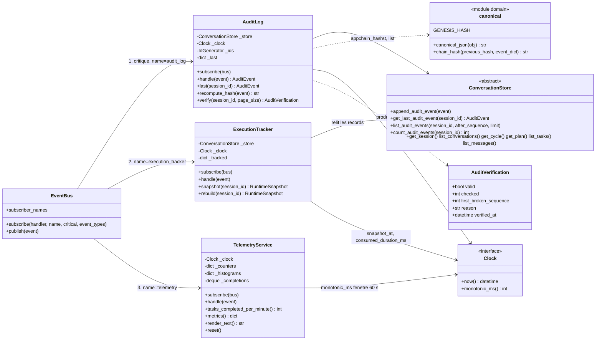
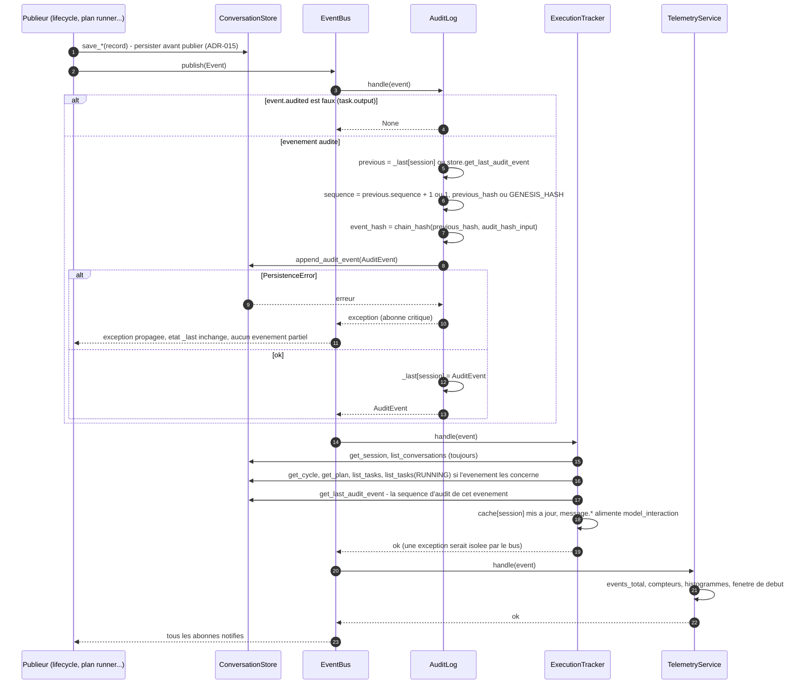
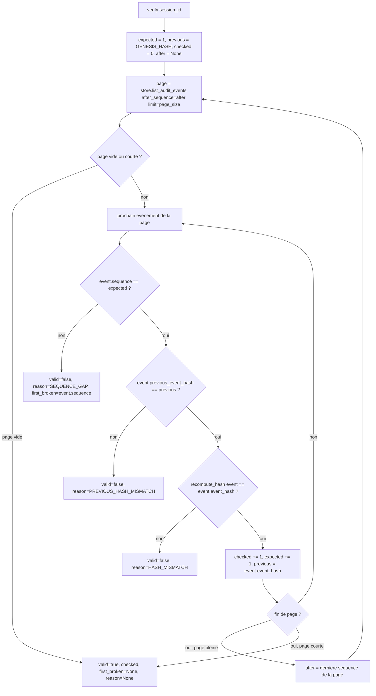
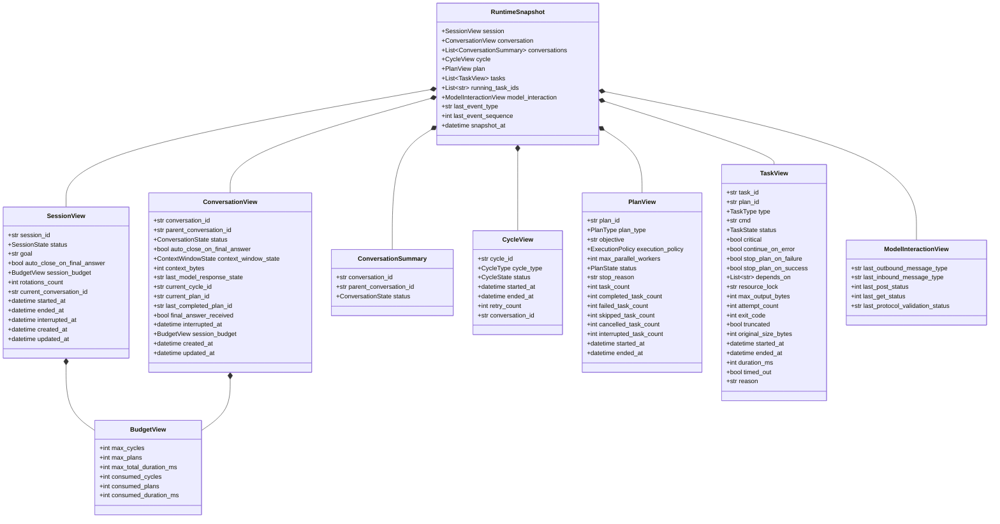

# Phase 10 — Audit et observabilité

**Composants** : `observability/audit_log.py` (`AuditLog`, `AuditVerification`, `audit_hash_input`), `observability/execution_tracker.py` (`ExecutionTracker`, `RuntimeSnapshot` et ses vues), `observability/telemetry.py` (`TelemetryService`), exports dans `observability/__init__.py`.
**Gate** : `pytest -m phase10` entièrement vert · `ruff check` · `ruff format --check` · `mypy --strict` sur les fichiers de la phase.
**État** : ✅ vert — 73 tests (`tests/unit/test_phase10_observability.py`).

## 1. Objectif et périmètre

La spec exige un système « auditable » et « observable à tout instant » (§1) : chaque action importante émet un événement structuré (§17.3), les événements d'audit forment une **séquence chaînée par hash, en ajout seul** (§3.16, critère d'acceptation 14), l'état courant est **interrogeable à tout instant** via l'`ExecutionTracker` (§3.19, §4, critère 3) et la télémétrie publie des indicateurs de latence, retry, saturation, échec, interruption et débit (§3.17). Cette phase livre les trois abonnés de l'`EventBus` (§3.20) dans l'ordre d'inscription fixé par ADR-015 :

1. **`AuditLog`** — abonné **critique** : tout événement audité (`Event.audited`, c'est-à-dire tout sauf `task.output`, ADR-018) devient un `AuditEvent` chaîné **par session** (`sequence` 1..n, `previous_event_hash`, `event_hash = sha256(previous + canonical(événement))`, ADR-017), avec reprise de séquence après redémarrage et `verify()` qui recalcule toute la chaîne ;
2. **`ExecutionTracker`** — abonné non critique : le snapshot §4.1 à deux niveaux (session / conversation, ADR-006), mis à jour depuis le **store** à chaque événement (le snapshot n'est qu'un cache), reconstructible intégralement (`rebuild`) ;
3. **`TelemetryService`** — abonné non critique : compteurs, histogrammes à seaux fixes, débit sur fenêtre glissante, exposition texte Prometheus (`GET /metrics`, ADR-018).

Elle livre aussi le **test d'inspection du code source** (ADR-017, module map règle 4) : aucune horloge ni aléa hors de `domain/clock.py`, `domain/ids.py`, `resilience/retry_controller.py` et `testing/mock_model_server.py`.

Hors périmètre : la **publication** des événements de cycle, plan, tâche, message, échec, rotation, budget, interruption et reprise (phases 5 à 9), l'exposition HTTP/SSE (`/audit`, `/audit/verify`, `/snapshot`, `/metrics`, `/events`, phase 9), la persistance SQLite de la table d'audit (phase 3 : `append_audit_event` append-only, `list_audit_events` paginé) et la politique de reprise après un échec d'audit (`RecoveryCoordinator`, phase 9). Cette phase **définit en revanche le contrat des payloads** que ces phases devront respecter (§4 de ce guide).

## 2. Prérequis

- Socle (phase 0) vert : `domain/events.py` (`EventType`, `Event`, `audited`, `NON_AUDITED_EVENT_TYPES`, `state_change_payload`), `domain/models.py` (`AuditEvent`, `SessionRecord`, `ConversationRecord`, `CycleRecord`, `PlanRecord`, `TaskRecord`, `MessageRecord`), `domain/canonical.py` (`canonical_json`, `chain_hash`, `GENESIS_HASH`), `domain/transitions.py` (`TERMINAL_TASK_STATES`, `TERMINAL_PLAN_STATES`, `FAILED_TASK_STATES`), `domain/clock.py`, `domain/ids.py`.
- `persistence/interface.py` (`append_audit_event`, `get_last_audit_event`, `list_audit_events(after_sequence, limit)`, `count_audit_events`, `list_conversations`, `get_cycle`, `get_plan`, `list_tasks`, `list_messages`) et `persistence/memory.py` (`InMemoryConversationStore`, `fail_next_write`).
- `observability/event_bus.py` (`EventBus.subscribe(handler, name=, critical=, event_types=)`, `RecordingSubscriber`) — **non modifié** par cette phase.
- Phase 1 verte : `ConversationLifecycleManager` publie `session.created`, `session.state_changed`, `conversation.created`, `conversation.state_changed`, `context.window_state_changed` ; la fixture `lifecycle` de `tests/conftest.py` sert à produire des transitions **réelles** dans les tests.
- Décisions applicables : ADR-006 (deux niveaux), ADR-012 (budget consommé), ADR-015 (bus synchrone, audit critique, ordre `AuditLog → ExecutionTracker → TelemetryService`), ADR-017 (chaîne sha256 canonique, `GENESIS_HASH`, horloge et identifiants injectés), ADR-018 (`task.output` non audité, flux live = la chaîne d'audit).

## 3. Conception

### 3.1 Les trois abonnés et leurs dépendances

### 3.2 Un événement traverse le bus : audit (hash) → tracker → télémétrie

### 3.3 `AuditLog.verify(session_id)`

Les trois raisons, dans l'ordre où elles sont testées pour chaque événement :

| Raison | Constat | Ce qui l'a provoqué (typiquement) |
|---|---|---|
| `SEQUENCE_GAP` | `sequence` n'est pas `précédente + 1` (ou le premier événement n'a pas `sequence = 1`) | événement supprimé ou inséré |
| `PREVIOUS_HASH_MISMATCH` | `previous_event_hash` ≠ hash de l'événement précédent (ou ≠ `GENESIS_HASH` pour le premier) | un événement antérieur a été réécrit **et** son hash recalculé de façon cohérente : la rupture apparaît sur le suivant |
| `HASH_MISMATCH` | `chain_hash(previous_event_hash, audit_hash_input(e))` ≠ `event_hash` | payload, identifiant, type ou horodatage modifié, ou `event_hash` réécrit |

`first_broken_sequence` désigne l'événement sur lequel la vérification s'arrête ; `checked` compte les événements intacts avant lui.

### 3.4 Structure du `RuntimeSnapshot`

### 3.5 Choix de conception

| Sujet | Décision | Motif |
|---|---|---|
| Dictionnaire haché | `audit_hash_input(e)` = **exactement** `{event_id, sequence, previous_event_hash, session_id, conversation_id, cycle_id, plan_id, task_id, event_type (valeur), timestamp (ISO 8601 avec décalage), payload}` ; `event_hash = chain_hash(previous_event_hash, dict)` = `sha256(previous + canonical_json(dict))`. `event_hash` n'en fait jamais partie. Le dictionnaire ne contient que des types JSON : un vérificateur externe (autre langage, API) peut recalculer la chaîne. | ADR-017 |
| Horodatage de l'`AuditEvent` | `event.timestamp`, c'est-à-dire l'horodatage **persisté sur le record** par le publieur (phase 1 : `updated_at`). L'audit reflète le fait, pas le moment de l'inscription ; le flux SSE (ADR-018) rejoue exactement ce contenu avec `id = event_id`. La `Clock` injectée ne sert qu'à dater `AuditVerification.verified_at`. | §17.3, ADR-018 |
| État de chaîne par session | `_last[session_id]` initialisé **paresseusement** depuis `store.get_last_audit_event` : un nouvel `AuditLog` sur un store rempli continue à `n + 1` avec le bon `previous_event_hash` (redémarrage). L'état n'est avancé **qu'après** l'acceptation par le store : une `PersistenceError` (propagée, abonné critique) laisse la séquence inchangée et le prochain événement reprend le même numéro. | §17.4, ADR-015 |
| `task.output` | `handle()` renvoie `None` sans écriture ; la séquence d'audit ne présente aucun trou (l'événement n'existe pas pour l'audit). | ADR-018 |
| Ordre d'inscription | chaque composant expose `subscribe(bus)` avec **son** nom (`audit_log` critique, `execution_tracker`, `telemetry`) ; l'assembleur (phase 9, `wiring.py`) les appelle dans cet ordre. Le tracker filtre `task.output` au niveau du bus (chemin chaud). | ADR-015, ADR-018 |
| Le snapshot est un cache du store | à chaque événement le tracker relit la session et la chaîne de conversations, et relit cycle / plan / tâches / tâches RUNNING quand l'événement les concerne (`cycle_id`, `plan_id`, `task_id` portés, type d'événement d'exécution, ou pointeurs `current_conversation_id` / `current_cycle_id` / `current_plan_id` déplacés). `rebuild()` relit tout. Invariant testé après chaque transition : `snapshot(sid) == rebuild(sid)`. | §4, §18.2, ADR-015 |
| Conversation, cycle, plan « courants » | `session.current_conversation_id` → conversation ; `conversation.current_cycle_id` → cycle ; `conversation.current_plan_id` → plan et ses tâches (sinon `None` / `[]`). **Contrat pour les phases 5/9** : ces pointeurs sont persistés avant la publication de `cycle.started` / `plan.received`, et `current_plan_id` reste posé jusqu'à la transition de conversation qui suit la fin du plan. | ADR-015 |
| `running_task_ids` | `store.list_tasks(session_id, statuses=[RUNNING])` sur **toute la session** (une tâche RUNNING orpheline après un redémarrage reste visible jusqu'à la reprise, ADR-016), dans l'ordre plan puis `order_index`. | §4.1, ADR-016 |
| Compteurs du plan | dès qu'il existe des `TaskRecord` pour le plan, `task_count` et les cinq compteurs sont **recalculés** depuis leurs statuts (`failed_task_count` = FAILED + TIMED_OUT, ADR-008) ; sans tâche en store, les compteurs du `PlanRecord` sont conservés. La vérité est le store des tâches, pas les compteurs dénormalisés. | §4.1, ADR-008 |
| `session_budget` | limites depuis `session.budget`, `consumed_cycles` / `consumed_plans` depuis la session (ADR-012), `consumed_duration_ms` = `ended_at − started_at` si la session est terminée, sinon `now − started_at` (`Clock.now()` au moment de la lecture), `0` avant le premier `RUNNING`. La même vue est portée aux deux niveaux. | ADR-012, §4.1 |
| `model_interaction` | par session, alimenté par `message.outbound` / `message.retransmitted` / `message.inbound` / `message.rejected` (contrat §4) ; `rebuild()` le **conserve** (les statuts HTTP ne sont pas persistés) ; un tracker à froid le reconstruit depuis les `MessageRecord` de la conversation courante (types et `validation_status`, statuts HTTP `None`). | §4.1 |
| `last_event_type` / `last_event_sequence` | type du dernier événement reçu ; séquence = `payload["sequence"]` s'il est porté, sinon la séquence d'audit lue dans le store (l'`AuditLog` a déjà chaîné l'événement, ADR-015), sinon un compteur d'événements vus. À froid : dernier `AuditEvent` du store. | ADR-015, ADR-018 |
| Échec d'une lecture du store dans le tracker | l'entrée de cache est invalidée puis l'exception remonte au bus, qui l'isole (abonné non critique) ; le prochain `snapshot()` reconstruit depuis le store. | ADR-015 |
| Télémétrie tolérante | un champ de payload absent ou du mauvais type est ignoré (jamais d'exception) ; `error_type` absent → label `unknown`. | §3.17 |
| Format d'exposition | familles triées par nom, jeux de labels triés, `# HELP` + `# TYPE`, valeurs de labels échappées (`\\`, `\"`, `\n`), compteurs sans label toujours exposés (`0`), histogrammes cumulatifs (`le`, `+Inf`, `_sum`, `_count`) plus gauges `_min` / `_max` une fois observés. | ADR-018 (`/metrics`) |

## 4. Catalogue des événements et contrat des payloads

Tout événement porte `event_type`, `timestamp` (celui du record persisté), `session_id`, et selon le cas `conversation_id`, `cycle_id`, `plan_id`, `task_id`. Les `*.state_changed` utilisent `state_change_payload(from, to, reason)` : `{"from": str | null, "to": str, "reason"?: str}` (la clé `reason` est absente quand elle n'est pas fournie). Les colonnes **Lu par** indiquent ce que la phase 10 consomme : c'est le minimum que le publieur doit garantir ; les autres champs sont documentaires (flux live, front).

| `EventType` | Publieur | Identifiants portés | Payload attendu | Lu par |
|---|---|---|---|---|
| `session.created` | phase 1 ✅ | `session_id` | `{"goal": str, "budget": {"max_cycles", "max_plans", "max_total_duration_ms"}}` | audit, tracker (relit la session) |
| `session.state_changed` | phase 1 ✅ | `session_id` | `{"from", "to", "reason"?}` | audit, tracker |
| `conversation.created` | phase 1 ✅ | `session_id`, `conversation_id` | `{"parent_conversation_id": str \| null, "context_window_state": str}` | audit, tracker (chaîne de conversations) |
| `conversation.state_changed` | phase 1 ✅ | `session_id`, `conversation_id` | `{"from", "to", "reason"?}` | audit, tracker (pointeurs `current_*` relus) |
| `context.window_state_changed` | phase 1 ✅ (8) | `session_id`, `conversation_id` | `{"from", "to", "reason"?, "context_bytes": int}` | audit, tracker, télémétrie (`to == "SATURATED"` → `context_saturations_total`) |
| `cycle.started` | phase 9 | + `cycle_id` | `{"cycle_type": "discovery"\|"execution"\|"clarification"\|"resume", "outbound_message_type": str, "consumed_cycles": int}` — `CycleRecord` et `conversation.current_cycle_id` persistés avant | audit, tracker (relit cycle) |
| `cycle.ended` | phase 9 | + `cycle_id` | `{"status": "COMPLETED"\|"FAILED"\|"INTERRUPTED", "duration_ms": int, "retry_count": int, "inbound_message_type": str \| null}` | audit, tracker, télémétrie (`duration_ms` → `cycle_duration_ms`) |
| `message.outbound` | phase 9 (7) | + `cycle_id` | `{"message_type": str, "message_id": str, "post_status": int \| null, "size_bytes": int}` | audit, tracker (`last_outbound_message_type`, `last_post_status`), télémétrie (`messages_total{direction="outbound"}`, `size_bytes` → `message_size_bytes`) |
| `message.inbound` | phase 9 | + `cycle_id` | `{"message_type": str, "message_id": str, "get_status": int \| null, "validation_status": "valid", "size_bytes": int}` | audit, tracker (`last_inbound_message_type`, `last_get_status`, `last_protocol_validation_status`), télémétrie (`inbound`, taille) |
| `message.rejected` | phase 9 (2) | + `cycle_id` si connu | `{"message_type": str \| null, "message_id": str \| null, "get_status": int \| null, "validation_status": "invalid", "error_code": str, "size_bytes"?: int}` | audit, tracker (type si non nul, `get_status`, validation `invalid`), télémétrie (`inbound`, `messages_rejected_total`, taille) |
| `message.retransmitted` | phase 8/9 (ADR-014) | + `cycle_id` | `{"message_type": str, "message_id": str, "retransmission_of": str, "post_status": int \| null, "size_bytes": int}` | audit, tracker (comme un sortant), télémétrie (`outbound`, taille) |
| `plan.received` | phase 9 | + `cycle_id`, `plan_id` | `{"plan_type": str, "execution_policy": str, "task_count": int, "max_parallel_workers": int, "consumed_plans": int}` — `PlanRecord`, `TaskRecord` et `conversation.current_plan_id` persistés avant | audit, tracker (relit plan et tâches) |
| `plan.state_changed` | phase 5 | + `cycle_id`, `plan_id` | `{"from", "to", "reason"?, "stop_reason"?: str \| null}` | audit, tracker (relit plan et tâches), télémétrie (`to` terminal → `plan_terminal_total{status}`) |
| `task.state_changed` | phase 5 | + `plan_id`, `task_id` | `{"from", "to", "reason"?, "duration_ms"?: int, "exit_code"?: int \| null, "timed_out"?: bool, "truncated"?: bool}` (`duration_ms` sur les états terminaux issus de RUNNING) | audit, tracker (relit tâches et RUNNING), télémétrie (`to` terminal → `task_terminal_total{status}`, `to == "COMPLETED"` → débit, `duration_ms` → `task_duration_ms`) |
| `task.output` | phase 4 | + `plan_id`, `task_id` | `{"stream": "stdout"\|"stderr", "offset": int, "data": str}` | **non audité** (ADR-018), ignoré par le tracker, compté dans `events_total` seulement |
| `final_answer.received` | phase 9 | + `cycle_id` | `{"message_id": str, "status": str}` | audit, tracker (relit session et conversation) |
| `failure.recorded` | phase 7 | selon l'entité | `{"failure_id": str, "error_type": str, "error_code": str, "severity": str, "origin": str, "retryable": bool, "recoverable": bool, "attempt": int, "max_attempts": int}` | audit, télémétrie (`error_type` → `failures_total{error_type}`, `unknown` si absent) |
| `retry.scheduled` | phase 7 | + `cycle_id` | `{"operation": "POST"\|"GET"\|"INIT", "attempt": int, "max_attempts": int, "delay_ms": int, "error_type": str, "error_code": str}` | audit, télémétrie (`retries_total`) |
| `breaker.state_changed` | phase 7 | `session_id` | `{"from", "to", "reason"?, "failure_count"?: int}` | audit, télémétrie (`to` → `breaker_transitions_total{to}`) |
| `rotation.started` | phase 8 | `conversation_id` = parent | `{"source_conversation_id": str, "pending_message_type": str, "rotations_count": int}` | audit, tracker (relit) |
| `rotation.completed` | phase 8 | `conversation_id` = enfant | `{"source_conversation_id": str, "target_conversation_id": str, "summary_size_bytes": int, "reduction_step": int}` | audit, tracker, télémétrie (`rotations_total{outcome="completed"}`) |
| `rotation.failed` | phase 8 | `conversation_id` = parent | `{"source_conversation_id": str, "error_code": str, "summary_size_bytes"?: int}` | audit, tracker, télémétrie (`rotations_total{outcome="failed"}`) |
| `budget.updated` | phase 9 | `session_id` | `{"consumed_cycles": int, "consumed_plans": int, "consumed_duration_ms": int, "max_cycles": int, "max_plans": int, "max_total_duration_ms": int}` | audit, tracker (relit la session) |
| `budget.exceeded` | phase 9 | `session_id`, `conversation_id` | `{"limit": "max_cycles"\|"max_plans"\|"max_total_duration_ms", "limit_value": int, "consumed": int}` | audit, tracker (relit plan et tâches), télémétrie (`budget_exceeded_total`) |
| `interruption.requested` | phase 6 | `session_id`, `conversation_id` | `{"reason": str, "conversation_state": str}` | audit, tracker (relit), télémétrie (`interruptions_total`) |
| `interruption.completed` | phase 6 | `session_id`, `conversation_id` | `{"duration_ms": int, "interrupted_tasks": int, "interrupted_plan_id": str \| null, "interrupted_cycle_id": str \| null, "within_drain_timeout": bool}` | audit, tracker (relit) |
| `recovery.started` / `recovery.action` / `recovery.completed` | phase 9 (ADR-016) | selon l'entité | `started`: `{"sessions_found": int}` · `action`: `{"entity": "task"\|"plan"\|"cycle"\|"conversation"\|"session", "entity_id": str, "from": str, "to": str, "reason": "restart"}` · `completed`: `{"actions": int}` | audit, tracker (relit) |
| `audit.warning` | phase 2/5 (ADR-009) | selon l'entité | `{"code": str, "details": dict}` (ex. `CONTRADICTORY_FLAGS`) | audit |

Champ optionnel transversal : `payload["sequence"]` (int) — s'il est présent, le tracker l'utilise comme `last_event_sequence` à la place de la séquence d'audit.

## 5. Le `RuntimeSnapshot` (§4.1) champ par champ

| Niveau | Champs (`pydantic`, figés, sérialisables JSON) | Source |
|---|---|---|
| `session` (`SessionView`) | `session_id`, `status` (READY / RUNNING / INTERRUPTING / COMPLETED / FAILED, ADR-006), `goal`, `auto_close_on_final_answer`, `session_budget`, `rotations_count`, `current_conversation_id`, `started_at`, `ended_at`, `interrupted_at`, `created_at`, `updated_at` | `SessionRecord` |
| `session_budget` (`BudgetView`, aux deux niveaux) | `max_cycles`, `max_plans`, `max_total_duration_ms`, `consumed_cycles`, `consumed_plans`, `consumed_duration_ms` | `SessionRecord` + `Clock.now()` |
| `conversation` (`ConversationView` ou `None`) | `conversation_id`, `parent_conversation_id`, `status`, `auto_close_on_final_answer`, `context_window_state`, `context_bytes` (ADR-013), `last_model_response_state`, `current_cycle_id`, `current_plan_id`, `last_completed_plan_id`, `final_answer_received`, `interrupted_at`, `session_budget`, `created_at`, `updated_at` | `ConversationRecord` courante |
| `conversations` (`list[ConversationSummary]`) | `conversation_id`, `parent_conversation_id`, `status` — la chaîne complète (interruptions ADR-006, rotations ADR-014), du plus ancien au plus récent | `list_conversations` |
| `cycle` (`CycleView` ou `None`) | `cycle_id`, `cycle_type`, `status`, `started_at`, `ended_at`, `retry_count`, `conversation_id` | `get_cycle(current_cycle_id)` |
| `plan` (`PlanView` ou `None`) | `plan_id`, `plan_type`, `objective`, `execution_policy`, `max_parallel_workers`, `status`, `stop_reason`, `task_count`, `completed_task_count`, `failed_task_count`, `skipped_task_count`, `cancelled_task_count`, `interrupted_task_count`, `started_at`, `ended_at` | `get_plan(current_plan_id)` + compteurs recalculés depuis les tâches |
| `tasks` (`list[TaskView]`) | `task_id`, `plan_id`, `type`, `cmd`, `status`, `critical`, `continue_on_error`, `stop_plan_on_failure`, `stop_plan_on_success`, `depends_on`, `resource_lock`, `max_output_bytes`, `attempt_count`, `exit_code`, `truncated`, `original_size_bytes`, `started_at`, `ended_at`, `duration_ms`, + `timed_out` (ADR-008), `reason` (ADR-009) | `list_tasks(plan_id)` |
| `running_task_ids` (`list[str]`) | identifiants des tâches RUNNING de la session | `list_tasks(statuses=[RUNNING])` |
| `model_interaction` (`ModelInteractionView`) | `last_outbound_message_type`, `last_inbound_message_type`, `last_post_status`, `last_get_status`, `last_protocol_validation_status` | événements `message.*` ; à froid : `MessageRecord` |
| racine | `last_event_type`, `last_event_sequence`, `snapshot_at` (= `Clock.now()` à la lecture) | événements / audit / horloge |

`GET /sessions/{sid}/snapshot` (ADR-018) renverra `snapshot.model_dump(mode="json")` ; le test `given_snapshot_when_dumped_then_json_serialisable_for_the_api` vérifie l'aller-retour.

## 6. Métriques (`TelemetryService`)

| Métrique | Type | Alimentée par |
|---|---|---|
| `events_total{event_type}` | counter | tout événement (y compris `task.output`) |
| `task_terminal_total{status}` | counter | `task.state_changed` avec `to` ∈ états terminaux de tâche |
| `plan_terminal_total{status}` | counter | `plan.state_changed` avec `to` ∈ états terminaux de plan |
| `failures_total{error_type}` | counter | `failure.recorded` (`error_type`, sinon `unknown`) |
| `retries_total` | counter | `retry.scheduled` |
| `rotations_total{outcome}` | counter | `rotation.completed` → `completed`, `rotation.failed` → `failed` |
| `interruptions_total` | counter | `interruption.requested` |
| `breaker_transitions_total{to}` | counter | `breaker.state_changed` |
| `messages_total{direction}` | counter | `outbound` : `message.outbound` + `message.retransmitted` ; `inbound` : `message.inbound` + `message.rejected` |
| `messages_rejected_total` | counter | `message.rejected` |
| `context_saturations_total` | counter | `context.window_state_changed` avec `to == SATURATED` |
| `budget_exceeded_total` | counter | `budget.exceeded` |
| `task_duration_ms` | histogram (seaux 10 … 300 000 ms) | `task.state_changed` `duration_ms` |
| `cycle_duration_ms` | histogram (seaux 100 … 300 000 ms) | `cycle.ended` `duration_ms` |
| `message_size_bytes` | histogram (seaux 256 … 1 048 576 o) | `message.*` `size_bytes` |
| `<histogramme>_min` / `_max` | gauge | dérivés, exposés dès la première observation |
| `tasks_completed_per_minute` | gauge | tâches passées `COMPLETED` dans les 60 dernières secondes (`Clock.monotonic_ms()`) |

`metrics()` renvoie `{"counters": {nom: [{"labels": {...}, "value": n}]}, "histograms": {nom: {"count", "sum", "min", "max", "buckets": {"10": n, …, "+Inf": n}}}, "gauges": {"tasks_completed_per_minute": n}}` ; `reset()` remet tout à zéro.

## 7. Plan de tests

Fichier `tests/unit/test_phase10_observability.py`, marqueur `phase10`, nommage `given_<état>_when_<action>_then_<résultat>` (§18.4). Les transitions sont **réelles** (fixture `lifecycle` de `conftest.py`) ; les événements des phases non livrées (cycle, plan, tâche, message…) sont construits à la main **selon le contrat du §4**, et les records correspondants insérés dans le store mémoire.

### 7.1 `AuditLog`

| Test | Vérifie | Réf. |
|---|---|---|
| `given_lifecycle_transitions_when_audited_then_chain_has_sequences_1_to_n_linked_from_genesis` | 10 transitions réelles → `sequence` 1..10, `GENESIS_HASH` puis chaînage, `event_hash == recompute_hash`, miroir exact des événements du bus (type, horodatage, ids, payload), `event_id` séquentiels, `verify()` valide (`checked = 10`, `verified_at = clock.now()`) | §3.16, §16, ADR-017 |
| `given_audit_event_when_hash_input_built_then_exactly_the_documented_fields` | le dictionnaire haché est **exactement** celui du §3.5 (contrat externe) | ADR-017 |
| `given_two_transitions_when_published_then_audit_order_equals_publication_order` | test nominatif d'ADR-015 : ordre d'audit = ordre de publication | ADR-015 |
| `given_valid_chain_when_payload_of_one_event_altered_then_verify_reports_hash_mismatch_there` | payload altéré (blanc, `store._audit`) → `HASH_MISMATCH` à la séquence 5, `checked = 4` | §19.14 |
| `given_valid_chain_when_event_rehashed_consistently_then_next_event_reports_previous_hash_mismatch` | falsification cohérente → rupture détectée sur le **suivant** (`PREVIOUS_HASH_MISMATCH`) | ADR-017 |
| `given_valid_chain_when_hash_field_overwritten_then_verify_reports_hash_mismatch` | `event_hash` réécrit | ADR-017 |
| `given_valid_chain_when_an_event_removed_then_verify_reports_sequence_gap` · `given_chain_missing_its_first_event_when_verified_then_sequence_gap_at_the_first_seen_sequence` | trou au milieu (`first_broken = 3`, `checked = 1`) et premier événement manquant (`first_broken = 2`, `checked = 0`) | ADR-017 |
| `given_session_without_audit_events_when_verified_then_valid_with_zero_checked` | chaîne vide valide | — |
| `given_long_chain_when_verified_with_small_pages_then_every_page_read_and_chain_valid` | pagination de `verify` (`page_size = 3` → 4 lectures) | §18.3 |
| `given_filled_store_when_new_audit_log_created_then_sequence_resumes_at_n_plus_1_and_chain_stays_valid` | reprise après redémarrage : `sequence 4`, `previous_event_hash` = hash du 3, `last()` | §17.4 |
| `given_task_output_event_when_published_then_not_audited_and_handle_returns_none` | `task.output` ignoré, pas de trou de séquence | ADR-018 |
| `given_store_failing_on_audit_append_when_event_published_then_error_propagates_and_no_partial_event` | `fail_next_write` → `PersistenceError` propagée par `bus.publish`, aucun événement partiel, l'état de chaîne n'a pas avancé (le suivant prend la séquence 2) | ADR-015 |
| `given_lifecycle_with_store_failing_on_audit_append_when_transition_then_state_persisted_but_not_audited` | conséquence ADR-015 documentée en phase 1 : record écrit, événement non chaîné, chaîne saine ensuite | ADR-015 |
| `given_two_sessions_when_events_interleaved_then_two_independent_chains` | deux chaînes indépendantes (genèse, séquences, hashes disjoints), `event_id` globaux | §3.16 |
| `given_same_transitions_on_two_fresh_systems_when_audited_then_hashes_identical` | reproductibilité octet par octet avec horloge et ids injectés | ADR-017 |
| `given_audit_log_when_subscribed_then_registered_as_critical_subscriber_named_audit_log` · `given_unknown_session_when_last_requested_then_none` | nom, unicité, criticité | ADR-015 |

### 7.2 `ExecutionTracker`

| Test | Vérifie | Réf. |
|---|---|---|
| `given_snapshot_models_when_fields_listed_then_every_mandatory_field_of_4_1_present` (×9) | ensembles de champs **exacts** de chaque vue (§4.1 + extras documentés) | §4.1 |
| `given_lifecycle_sequence_when_each_event_handled_then_snapshot_equals_rebuild_after_every_step` | NEW → ACTIVE → WAITING_MODEL_RESPONSE → RUNNING_PLAN → WARNING → ROTATING → enfant NEW → ACTIVE → WAITING → HEALTHY → parent CLOSED → COMPLETED, session READY → RUNNING → COMPLETED : après **chaque** événement `snapshot == rebuild == snapshot`, statuts attendus, `last_event_type`/`last_event_sequence`, `snapshot_at`, chaîne de conversations finale | §18.2, ADR-006, ADR-014 |
| `given_completed_conversation_when_snapshot_then_every_conversation_level_field_mirrors_the_record` | chaque champ conversation-level égal au record persisté | §4.1 |
| `given_running_session_when_clock_advanced_then_consumed_duration_ms_follows_the_injected_clock` | `0` avant RUNNING, `now − started_at` via `FakeClock`, dérivé à la lecture (sans événement), compteurs consommés relus, durée figée à `ended_at` | ADR-012 |
| `given_interrupted_session_when_snapshot_then_both_levels_visible_and_interrupted_at_kept` | session READY / conversation INTERRUPTED, `interrupted_at` aux deux niveaux | ADR-006 |
| `given_cycle_plan_and_tasks_in_store_when_events_published_then_snapshot_shows_them_and_running_ids` | `CycleView`, `PlanView`, `TaskView` (drapeaux, `depends_on`, `resource_lock`…), `running_task_ids` depuis les `TaskRecord` RUNNING + `task.state_changed`, compteurs recalculés (record volontairement périmé), `snapshot == rebuild` à chaque étape | §4.1, ADR-015 |
| `given_plan_record_with_stale_counters_when_snapshot_then_counters_recomputed_from_task_records` | 6 tâches → `task_count 6`, `completed 2`, `failed 2` (FAILED + TIMED_OUT), `skipped 1`, `cancelled 1` | ADR-008 |
| `given_plan_without_task_records_when_snapshot_then_record_counters_kept` | sans tâche en store, compteurs du record | — |
| `given_message_events_following_the_contract_when_handled_then_model_interaction_reflects_them` | `message.outbound` / `inbound` / `rejected` / `retransmitted` selon le contrat ; `rebuild()` conserve l'état | §4.1 |
| `given_message_records_in_store_when_cold_tracker_snapshots_then_interaction_rebuilt_from_records` | reconstruction à froid depuis les `MessageRecord` | §17.4 |
| `given_audited_store_when_cold_tracker_snapshots_then_rebuilt_from_store_with_audit_position` | tracker neuf sur un store audité : tout depuis le store, `last_event_*` depuis l'audit | §17.3 |
| `given_tracker_without_audit_log_when_events_handled_then_last_event_sequence_counts_events` | compteur d'événements, `payload["sequence"]` prioritaire | — |
| `given_audit_log_and_tracker_subscribed_in_adr015_order_when_event_published_then_tracker_sees_audit_sequence` | ordre `audit_log`, `execution_tracker`, `telemetry` ; la séquence vue par le tracker est celle de l'audit | ADR-015 |
| `given_task_output_event_when_handled_then_ignored_by_tracker` · `given_unknown_session_when_snapshot_requested_then_key_error` · `given_event_for_unknown_session_when_handled_then_ignored_without_error` · `given_tracker_when_subscribed_then_non_critical_subscriber_named_execution_tracker` · `given_snapshot_when_dumped_then_json_serialisable_for_the_api` | filtrage, erreurs, isolation par le bus et invalidation du cache, sérialisation JSON | ADR-018 |

### 7.3 `TelemetryService`

| Test | Vérifie | Réf. |
|---|---|---|
| `given_events_of_several_types_when_handled_then_events_total_counted_per_type` | `events_total{event_type}` sur la séquence réelle + `task.output` | §3.17 |
| `given_task_state_changes_when_handled_then_only_terminal_states_counted_by_status` · `given_plan_state_changes_when_handled_then_terminal_plans_counted_by_status` | terminaux seulement | §5.2, §5.3 |
| `given_failures_recorded_when_handled_then_failures_total_by_error_type` | `error_type`, `unknown` | §6 |
| `given_retries_rotations_interruptions_and_budget_events_when_handled_then_counted` · `given_breaker_transitions_when_handled_then_counted_by_target_state` | `retries_total`, `rotations_total{outcome}`, `interruptions_total`, `budget_exceeded_total`, `breaker_transitions_total{to}` | §3.17, §7.4 |
| `given_message_events_when_handled_then_messages_total_by_direction_and_size_histogram` | directions, `messages_rejected_total`, histogramme des tailles (count/sum/min/max/seaux cumulés) | ADR-010 |
| `given_context_window_events_when_handled_then_only_saturation_counted` | via le manager de phase 1 | ADR-013 |
| `given_task_and_cycle_durations_when_handled_then_histograms_hold_count_sum_min_max_and_buckets` | seaux fixes, valeurs absentes ou du mauvais type ignorées, histogramme vide | §3.17 |
| `given_task_completions_when_clock_moves_then_tasks_completed_per_minute_uses_sliding_window` | fenêtre glissante de 60 s avec `FakeClock` (3 → 5 → 2 → 0), seul `COMPLETED` compte | §3.17 |
| `given_metrics_when_rendered_then_prometheus_text_format_stable_and_sorted` | chaque ligne matche la grammaire Prometheus (regex), familles triées, labels triés, échappement, compteurs à 0 exposés, stabilité, identité entre deux services nourris des mêmes événements | ADR-018 |
| `given_metrics_when_reset_then_everything_back_to_zero` · `given_malformed_payloads_when_handled_then_ignored_without_exception` · `given_telemetry_when_subscribed_then_non_critical_subscriber_named_telemetry` · `given_metrics_dict_when_read_then_documented_structure` | `reset()`, tolérance, nom d'abonné, structure de `metrics()` | — |

### 7.4 Inspection du source et exports

| Test | Vérifie | Réf. |
|---|---|---|
| `given_source_tree_when_inspected_then_no_wall_clock_or_randomness_outside_allowed_modules` | parcourt `src/agentic_local_app/**/*.py`, retire chaînes et commentaires (tokenizer), cherche `datetime.now(`, `datetime.utcnow(`, `time.time(`/`time_ns`, `time.monotonic(`/`_ns`, `time.perf_counter(`/`_ns`, `uuid4(`, `import random`/`from random import`, `random.` ; échec nommant `fichier:ligne: motif` | ADR-017, module map règle 4 |
| `given_snippet_when_inspected_then_violations_reported_with_file_and_line` (×10) | l'inspecteur détecte chaque motif et ignore docstrings, commentaires, chaînes et faux amis (`clock.now()`, `_random_seed`) | — |
| `given_phase10_modules_when_inspected_then_they_only_use_the_injected_clock` | les trois modules de la phase passent l'inspection | ADR-017 |
| `given_observability_package_when_imported_then_phase10_components_exported` · `given_verification_when_created_then_frozen_value_object` | exports, immuabilité | — |

## 8. Étapes TDD suivies

1. Lecture du socle (`domain/*`, `persistence/*`, `observability/event_bus.py`, `lifecycle/conversation_lifecycle.py`, `conftest.py`, tests des phases 0 et 1) et des textes de référence (§3.16, §3.17, §3.19, §3.20, §4, §16, §17.3, §18.2 ; ADR-006, 007, 008, 009, 012, 013, 014, 015, 016, 017, 018 ; module map §3–§4).
2. Vérification préalable d'un point technique : mypy refuse un `handle() -> AuditEvent | None` comme `Callable[[Event], None]` → `subscribe()` enregistre un enrobage `_on_event -> None`.
3. **Rouge** : écriture des 73 cas, exécution → `ImportError: cannot import name 'audit_log'`.
4. **Vert** : `audit_log.py`, `execution_tracker.py`, `telemetry.py`, exports → 72 verts, 1 échec dû au double de test (le manager de phase 1 lit lui-même `get_session` avant de publier) → double corrigé pour faire échouer une lecture que seul le tracker effectue (`list_conversations`) → 73 verts.
5. **Refactor** sous tests verts : rendu des gauges `_min`/`_max` par familles nommées (plus de découpage de liste), réinitialisation explicite de l'histogramme ; `ruff format`, `ruff check`, `mypy --strict` verts sur les fichiers de la phase ; suite complète verte (hors erreurs de collecte des phases en cours chez d'autres agents).
6. Rédaction de ce guide et validation des diagrammes Mermaid (`check_mermaid.py`).

## 9. Gate

| Contrôle | Commande | Résultat |
|---|---|---|
| Tests de la phase | `.venv/bin/pytest -q -m phase10` | 73 verts |
| Phases 0 + 1 + 10 | `.venv/bin/pytest -q tests/unit/test_phase0_foundation.py tests/unit/test_phase1_state_machines.py tests/unit/test_phase10_observability.py` | 613 verts |
| Suite complète | `.venv/bin/pytest -q --continue-on-collection-errors` | 1508 verts ; 2 erreurs de collecte dans `test_phase7_*` (modules `resilience/circuit_breaker.py`, `failure_manager.py` pas encore livrés par la phase 7) |
| Lint | `.venv/bin/ruff check src/agentic_local_app/observability tests/unit/test_phase10_observability.py` | ✅ |
| Format | `.venv/bin/ruff format --check src/agentic_local_app/observability tests/unit/test_phase10_observability.py` | ✅ |
| Types | `.venv/bin/mypy --strict src/agentic_local_app/observability/*.py` | ✅ (le paquet entier remonte des erreurs dans `resilience/`, phase 7 en cours) |
| Diagrammes | `check_mermaid.py docs/phases/phase-10-observability.md` | 4/4 rendus |

## 10. Résultat

- **73 tests** dans `tests/unit/test_phase10_observability.py` (≈ 0,3 s) : 18 `AuditLog`, 26 `ExecutionTracker` (dont 9 paramétrés sur les champs §4.1), 15 `TelemetryService`, 12 inspection du source (dont 10 paramétrés), 2 exports/valeurs.
- Fichiers livrés : `src/agentic_local_app/observability/audit_log.py`, `execution_tracker.py`, `telemetry.py`, `__init__.py` (exports), `tests/unit/test_phase10_observability.py`, ce guide.
- Exigences couvertes : §3.16 (chaîne de hash, ajout seul, reprise), §3.17 (latence, retry, saturation, échec, interruption, débit), §3.19 (visibilité instantanée conversation / plan / tâches / cycle / interaction modèle, snapshot, abonnement au bus), §4.1 (tous les champs obligatoires, aux deux niveaux ADR-006), §16 `AuditEvent`, §17.3 (chaîne vérifiable, snapshots interrogeables, état observable à tout instant, reconstruction à froid depuis le store et l'audit), §18.2 Phase 10 (les trois puces), §18.4 (nommage), critères d'acceptation 3, 12 et 14 ; ADR-012 (budget consommé exposé), ADR-015 (abonné critique, ordre d'inscription, test nominatif), ADR-017 (dictionnaire canonique, `GENESIS_HASH`, `verify()` sur chaîne altérée, test d'inspection du source), ADR-018 (`task.output` non audité, format `/metrics`, snapshot sérialisable).

## 11. Points ouverts

1. **Câblage (phase 9)** : `wiring.py` doit appeler `audit.subscribe(bus)`, `tracker.subscribe(bus)`, `telemetry.subscribe(bus)` dans cet ordre (ADR-015) et construire `ExecutionTracker(store, clock)` — la signature du module map (`ExecutionTracker(store)`) a gagné un paramètre `clock` pour `consumed_duration_ms` et `snapshot_at` ; `TelemetryService(clock)` de même. Le module map §3 devrait être mis à jour (`ExecutionTracker(store, clock)`, `TelemetryService(clock)`, `AuditLog.verify(session_id, *, page_size=1000)`, `AuditLog.last`, `AuditLog.recompute_hash`, `ExecutionTracker.rebuild`, `TelemetryService.reset`) — hors périmètre de cette phase.
2. **Contrat des payloads** : le catalogue du §4 est la référence pour les phases 5 à 9 ; il n'est pas encore vérifié par un test croisé (les événements de ces phases n'existent pas). Recommandation : chaque phase publiante ajoute un test qui rejoue ses événements dans `ExecutionTracker` / `TelemetryService` et vérifie le snapshot et les métriques attendus. `docs/architecture/08-observability.md` (cité par ADR-018 et l'overview) n'existe pas encore : ce catalogue peut le constituer.
3. **Échec d'audit après persistance** : quand `append_audit_event` échoue, la transition est déjà écrite (ADR-015) ; la chaîne continue sans trou au prochain événement mais **la transition non chaînée n'est pas dans l'audit**. La politique de rattrapage (événement `audit.warning` à la reprise ? re-chaînage depuis le store par `RecoveryCoordinator` ?) est à décider en phase 9 / ADR.
4. **`SqliteConversationStore` (phase 3)** : `audit_hash_input` sérialise `timestamp` en ISO 8601 avec décalage et le `payload` en JSON canonique ; l'implémentation SQLite doit restituer un `datetime` conscient du fuseau identique à l'octet en `isoformat()` et un payload équivalent après aller-retour JSON, sinon `verify()` signalera `HASH_MISMATCH` sur des chaînes saines. Les tests de contrat de phase 3 devraient inclure `verify()` après relecture.
5. **Mises à jour sans événement** : `update_session` / `update_conversation` (phase 1) n'émettent rien ; le cache du tracker les reflète au prochain événement de la session (dans les scénarios de la spec chaque compteur consommé est suivi d'un événement : `cycle.started`, `plan.received`, `budget.updated`). Si une phase introduit une écriture « silencieuse » durable, elle devra publier `budget.updated` ou équivalent.
6. **`context_budget_bytes`** (ADR-013) n'est pas dans le snapshot : c'est une valeur de configuration que le tracker ne connaît pas ; l'API (phase 9) peut la joindre depuis `AppConfig.context.budget_bytes`.
7. **Modules autorisés à l'horloge/aléa** : la liste du test d'inspection (`domain/clock.py`, `domain/ids.py`, `resilience/retry_controller.py`, `testing/mock_model_server.py`) est codée dans le test ; toute nouvelle exception doit y être ajoutée explicitement, avec justification.
