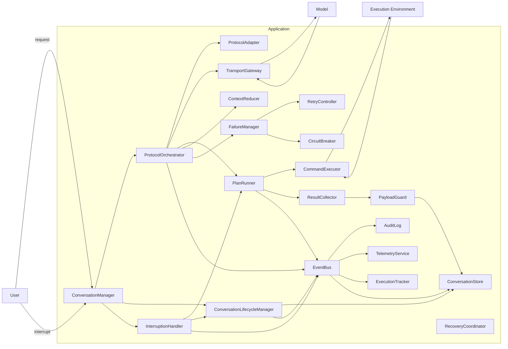
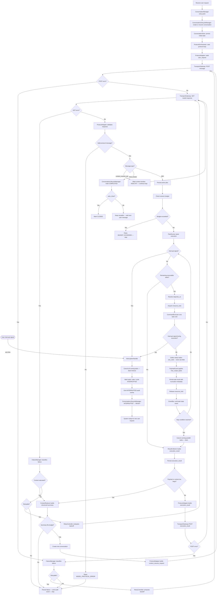
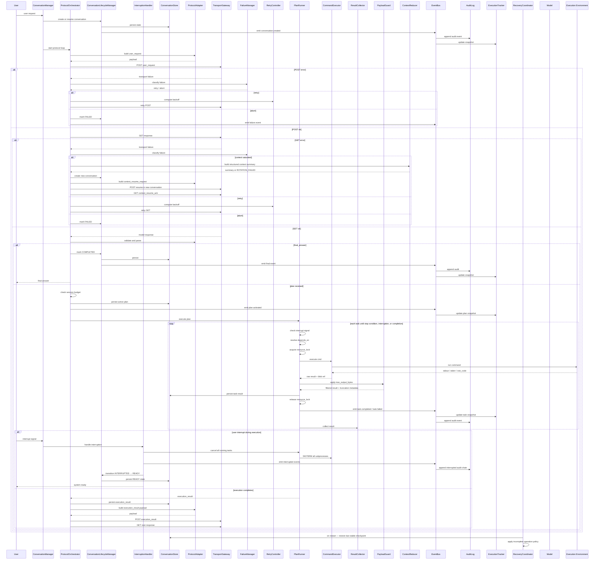

# Technical Specification — v1.1

> Source of truth for this repository. Reproduced as provided (formatting normalised to Markdown).
> Decisions that refine or amend this text are recorded in [`docs/adr`](../adr/README.md) and never edited in place here.

---

## 1. Objective

Build an application that orchestrates a single remote model through a strict message protocol over `POST` / `GET` only.

The system must be:

- deterministic
- robust
- auditable
- restart-safe
- context-window aware
- execution-plan driven
- observable at any instant
- interruptible at any instant by the user

The model sends **direct executable commands** inside plans.
The application does **not** semantically translate model intentions into local capabilities.
The application executes model-provided tasks, tracks their lifecycle, aggregates results, controls payload size, and loops until a final answer is reached or the user interrupts the session.

The model is treated as a **trusted orchestrator** in v1. Sandboxing and scope enforcement are deferred to a future version.

---

## 2. Core Design Decisions

### 2.1 Conversation model

- One active remote model per conversation
- One application-side orchestrator
- One writer / one reader per conversation
- Communication only through:
  - `POST message`
  - `GET messages`

### 2.2 Protocol model

The model must operate through a deterministic protocol:

```
user_request
  └─> discovery_plan
        └─> execution_result
              └─> execution_plan
                    └─> execution_result
                          └─> final_answer
```

Optional branch:

```
└─> priority_clarification
      └─> execution_result
            └─> execution_plan | final_answer
```

User interruption (at any point):

```
ANY STATE
  └─> user_interrupt
        └─> INTERRUPTED (conversation reset to initial state)
```

### 2.3 Plan model

- `discovery_plan` is mandatory as the first model response
- The discovery phase is the mechanism by which the model learns the execution environment (OS, shell, available tools, working directory, runtime versions, etc.)
- Only one active plan at a time
- A plan contains executable tasks
- Each task contains a direct `cmd`
- The application executes commands as-is
- Any active plan is immediately aborted on user interruption

### 2.4 Execution model

- A plan can be executed sequentially or in parallel depending on plan metadata
- Each task can define:
  - `critical`
  - `continue_on_error`
  - `stop_plan_on_failure`
  - `stop_plan_on_success`
  - `depends_on` (list of task_ids that must complete successfully before this task runs)

#### Parallel execution rules

- Tasks with no `depends_on` and no shared resource lock may run in parallel
- Tasks that write to the same file path must declare a `resource_lock` key
- Two tasks with the same `resource_lock` value are never executed concurrently
- `stop_plan_on_failure` in parallel mode: all running tasks receive a cancellation signal (SIGTERM) with a configurable drain timeout before the plan stops
- `stop_plan_on_success` in parallel mode: same cancellation behavior
- `max_parallel_workers` is defined at plan level

### 2.5 Payload model

#### Content-length negotiation

Before execution, the model declares in the plan metadata the maximum output size it is willing to receive per task (`max_output_bytes`). The `PayloadGuard` applies this limit.

#### Truncation behavior

When a task output exceeds `max_output_bytes`:

- `stderr` is always preserved in full (priority 1)
- End of `stdout` is preserved over beginning (priority 2)
- A `truncated: true` flag is set in the task result
- `original_size_bytes` is reported
- The model may explicitly request the next chunk via a `chunk_request` task in the next plan

#### Chunk request mechanism

The model may emit a task of type `chunk_request` referencing a prior task result:

```json
{
  "task_id": "t-chunk-1",
  "type": "chunk_request",
  "ref_task_id": "t3",
  "byte_offset": 4096,
  "max_bytes": 8192
}
```

The application returns the requested byte range from the stored raw output.

### 2.6 Context model

- If the conversation becomes too large for safe continuation, the system rotates automatically
- A new conversation is created
- A compact structured context summary is injected (not free text)
- The model must acknowledge the context resume before continuing
- Execution continues transparently
- If the context summary itself exceeds the allowed budget, the rotation fails explicitly — no silent infinite rotation loop

### 2.7 Finalization model

- After `final_answer`, the conversation may either:
  - remain reusable
  - or be automatically closed/deleted
- Behavior is controlled by a session flag `auto_close_on_final_answer`

### 2.8 Session budget

To prevent unbounded execution loops, every session carries:

- `max_cycles`: maximum number of protocol cycles allowed
- `max_plans`: maximum number of plans allowed
- `max_total_duration_ms`: maximum wall-clock duration for the session

If any budget is exceeded, the session is terminated with a `BUDGET_EXCEEDED` failure.

### 2.9 User interruption model

The user may interrupt the session at any instant regardless of current system state.

On interruption:

- All running tasks receive an immediate cancellation signal (SIGTERM) with a drain timeout
- All pending tasks are marked SKIPPED
- The active plan is marked INTERRUPTED
- The active cycle is marked INTERRUPTED
- The conversation is transitioned to INTERRUPTED state
- All in-flight transport calls are abandoned
- The system resets to an initial ready state, equivalent to a fresh conversation start
- The conversation record is preserved for audit purposes
- A new conversation may be started immediately by the user

The interruption must be:

- Acknowledged within a bounded time (configurable `interrupt_drain_timeout_ms`)
- Fully persisted before the system declares itself ready again
- Auditable — an INTERRUPTED audit event is emitted for every affected entity (task, plan, cycle, conversation)

---

## 3. Main Components

### 3.1 ConversationManager

Responsibilities:

- Entry point for user requests and user interruptions
- Delegates to ProtocolOrchestrator for the protocol loop
- Delegates to ConversationLifecycleManager for conversation state transitions
- Receives and forwards interruption signals immediately
- Does not contain protocol or execution logic

### 3.2 ProtocolOrchestrator

Responsibilities:

- Drive the full protocol loop
- Coordinate ProtocolAdapter, TransportGateway, PlanRunner, ContextReducer
- Publish internal events to the event bus
- Enforce session budget
- React to interruption signals: stop the loop, delegate cleanup to InterruptionHandler

### 3.3 ConversationLifecycleManager

Responsibilities:

- Own all conversation state transitions
- Enforce valid state machine transitions
- Persist state on every transition
- Expose current conversation status
- Apply interruption transition from any active state to INTERRUPTED
- Apply reset transition from INTERRUPTED to READY

### 3.4 InterruptionHandler

Responsibilities:

- Receive the interruption signal from ConversationManager
- Signal PlanRunner to cancel all running tasks
- Wait for drain timeout
- Mark all affected tasks, plan, cycle, and conversation as INTERRUPTED
- Emit audit events for all affected entities
- Notify ConversationLifecycleManager to reset to initial ready state
- Guarantee completion within `interrupt_drain_timeout_ms`

### 3.5 ProtocolAdapter

Responsibilities:

- Build outbound protocol messages
- Parse inbound model messages
- Validate protocol compliance
- Reject malformed or non-deterministic responses

Supported message types:

- `user_request`
- `discovery_plan`
- `execution_plan`
- `priority_clarification`
- `execution_result`
- `final_answer`
- `context_resume_request`
- `context_resume_ack`
- `chunk_request`
- `system_error`

### 3.6 ConversationStore

Responsibilities:

- Persist all runtime state
- Persist stable checkpoints
- Persist conversations, plans, tasks, transitions, summaries, errors, and audit references
- Store raw task outputs (stdout/stderr) as referenced blobs for chunk retrieval

### 3.7 PlanRunner

Responsibilities:

- Execute one active plan
- Apply plan execution policy (sequential or parallel)
- Manage `depends_on` resolution
- Manage `resource_lock` concurrency control
- Iterate tasks
- Evaluate stop conditions
- Handle parallel cancellation with drain timeout
- React to interruption signal: immediately cancel all running tasks
- Notify task and plan state transitions via event bus

### 3.8 CommandExecutor

Responsibilities:

- Execute shell commands
- Collect:
  - stdout
  - stderr
  - exit_code
  - timing
- Enforce per-task timeout
- Normalize execution errors
- Store raw output as blob referenced by `stdout_ref` / `stderr_ref`
- React to cancellation signal: terminate subprocess within drain timeout

### 3.9 ResultCollector

Responsibilities:

- Collect task results
- Build one `execution_result` per plan
- Include skipped tasks
- Include cancelled tasks
- Include reason for stop condition or interruption

### 3.10 PayloadGuard

Responsibilities:

- Apply per-task `max_output_bytes` declared by the model
- Apply truncation strategy (stderr priority, then end of stdout)
- Set `truncated` and `original_size_bytes` flags
- Serve chunk requests from stored raw output

### 3.11 ContextReducer

Responsibilities:

- Build compact structured conversation summaries
- Prepare context handoff to a new conversation
- Preserve only critical findings and current execution state in a defined schema
- Enforce a hard size budget on the summary
- Fail explicitly if the summary cannot fit within budget

### 3.12 TransportGateway

Responsibilities:

- Send POST
- Perform GET
- Handle network transport concerns
- Support optional gzip transport
- Surface normalized transport errors
- Support in-flight call abandonment on interruption

### 3.13 FailureManager

Responsibilities:

- Classify failures
- Decide retry / abort / rotate / fail
- Centralize failure policy

### 3.14 RetryController

Responsibilities:

- Compute retry timing
- Manage bounded exponential backoff
- Prevent unbounded retries

### 3.15 CircuitBreaker

Responsibilities:

- Stop repeated failing calls to the remote endpoint
- Protect the system from cascading failure

### 3.16 AuditLog

Responsibilities:

- Append immutable structured audit events to an append-only store
- Each event includes a hash of the previous event to form a verifiable chain
- Support retrospective analysis and replay diagnostics

### 3.17 TelemetryService

Responsibilities:

- Publish metrics
- Collect latency, retry, saturation, failure, interruption, and throughput indicators

### 3.18 RecoveryCoordinator

Responsibilities:

- Resume from last stable checkpoint after crash/restart
- Detect and resolve incomplete operations according to explicit policy:
  - Task in RUNNING at restart → mark INTERRUPTED, do not re-execute automatically
  - POST sent but no GET recorded → retry GET before any other action
  - Plan in RUNNING at restart → rebuild from last persisted task states
- Avoid duplicate execution of already COMPLETED tasks

### 3.19 ExecutionTracker

Responsibilities:

- Provide instant visibility on:
  - Current conversation state
  - Current plan state
  - Current task states
  - Current cycle state
  - Current model interaction state
- Expose the current runtime snapshot
- Subscribe to event bus for real-time updates

### 3.20 EventBus

Responsibilities:

- Decouple internal components
- Route state transition events to interested subscribers (AuditLog, TelemetryService, ExecutionTracker, ConversationStore)
- Guarantee in-process delivery ordering

---
## 4. Runtime Visibility Requirements

At any instant, the system must expose a consistent runtime snapshot.

### 4.1 Mandatory visibility fields

**Conversation-level**

- `conversation_id`
- `parent_conversation_id`
- `status`
- `auto_close_on_final_answer`
- `context_window_state`
- `last_model_response_state`
- `current_cycle_id`
- `current_plan_id`
- `last_completed_plan_id`
- `final_answer_received`
- `interrupted_at`
- `session_budget` (`max_cycles`, `max_plans`, `max_total_duration_ms`, consumed values)
- `created_at`
- `updated_at`

**Cycle-level**

- `cycle_id`
- `cycle_type`:
  - discovery
  - execution
  - clarification
  - resume
- `status`
- `started_at`
- `ended_at`
- `retry_count`
- `conversation_id`

**Plan-level**

- `plan_id`
- `plan_type`:
  - discovery_plan
  - execution_plan
  - priority_clarification
- `objective`
- `execution_policy`
- `max_parallel_workers`
- `status`
- `stop_reason`
- `task_count`
- `completed_task_count`
- `failed_task_count`
- `skipped_task_count`
- `cancelled_task_count`
- `interrupted_task_count`
- `started_at`
- `ended_at`

**Task-level**

- `task_id`
- `plan_id`
- `type` (cmd | chunk_request)
- `cmd`
- `status`
- `critical`
- `continue_on_error`
- `stop_plan_on_failure`
- `stop_plan_on_success`
- `depends_on`
- `resource_lock`
- `max_output_bytes`
- `attempt_count`
- `exit_code`
- `truncated`
- `original_size_bytes`
- `started_at`
- `ended_at`
- `duration_ms`

**Model interaction-level**

- `last_outbound_message_type`
- `last_inbound_message_type`
- `last_post_status`
- `last_get_status`
- `last_protocol_validation_status`

---

## 5. State Machines

### 5.1 Conversation state machine

States:

- NEW
- ACTIVE
- WAITING_MODEL_RESPONSE
- RUNNING_PLAN
- WAITING_USER
- ROTATING
- INTERRUPTED
- READY (post-interruption reset — equivalent to NEW)
- COMPLETED
- FAILED
- CLOSED

Transitions:

- NEW → ACTIVE
- ACTIVE → WAITING_MODEL_RESPONSE
- WAITING_MODEL_RESPONSE → RUNNING_PLAN
- WAITING_MODEL_RESPONSE → COMPLETED
- RUNNING_PLAN → WAITING_MODEL_RESPONSE
- RUNNING_PLAN → ROTATING
- ROTATING → WAITING_MODEL_RESPONSE
- ANY → FAILED
- ANY_ACTIVE_STATE → INTERRUPTED (on user interrupt signal)
- INTERRUPTED → READY (after full cleanup and persistence)
- READY → ACTIVE (on new user request)
- COMPLETED → WAITING_USER
- WAITING_USER → WAITING_MODEL_RESPONSE
- COMPLETED → CLOSED

Where ANY_ACTIVE_STATE includes: ACTIVE, WAITING_MODEL_RESPONSE, RUNNING_PLAN, ROTATING

### 5.2 Plan state machine

States:

- PENDING
- RUNNING
- COMPLETED
- STOPPED_ON_FAILURE
- SHORT_CIRCUITED_ON_SUCCESS
- INTERRUPTED
- FAILED

Transitions:

- PENDING → RUNNING
- RUNNING → COMPLETED
- RUNNING → STOPPED_ON_FAILURE
- RUNNING → SHORT_CIRCUITED_ON_SUCCESS
- RUNNING → INTERRUPTED (on user interrupt)
- RUNNING → FAILED

### 5.3 Task state machine

States:

- PENDING
- WAITING_DEPENDENCY
- RUNNING
- COMPLETED
- FAILED
- TIMED_OUT
- SKIPPED
- CANCELLED
- INTERRUPTED

Transitions:

- PENDING → WAITING_DEPENDENCY
- WAITING_DEPENDENCY → PENDING
- PENDING → RUNNING
- RUNNING → COMPLETED
- RUNNING → FAILED
- RUNNING → TIMED_OUT
- RUNNING → CANCELLED (stop condition in parallel mode)
- RUNNING → INTERRUPTED (user interrupt signal)
- PENDING → SKIPPED
- PENDING → INTERRUPTED (user interrupt before execution)
- WAITING_DEPENDENCY → SKIPPED
- WAITING_DEPENDENCY → INTERRUPTED

### 5.4 Context window state machine

States:

- HEALTHY
- WARNING
- SATURATED

Transitions:

- HEALTHY → WARNING
- WARNING → SATURATED
- SATURATED → HEALTHY (after successful rotation and model ACK)

---

## 6. Error Taxonomy

All failures must be classified.

**Error types**

- AUTHN_ERROR
- AUTHZ_ERROR
- NETWORK_ERROR
- TIMEOUT_ERROR
- RATE_LIMIT_ERROR
- MODEL_PROTOCOL_ERROR
- MODEL_CONTEXT_WINDOW_ERROR
- TASK_EXECUTION_ERROR
- PERSISTENCE_ERROR
- BUDGET_EXCEEDED
- ROTATION_FAILED
- INTERRUPTED
- SYSTEM_ERROR

**Normalized error attributes**

- `error_type`
- `error_code`
- `severity`
- `origin`
- `retryable`
- `recoverable`
- `attempt`
- `max_attempts`
- `details`

---

## 7. Deterministic Failure Policy

### 7.1 Retryable failures

Retry only on:

- NETWORK_ERROR
- TIMEOUT_ERROR
- RATE_LIMIT_ERROR
- Selected transient SYSTEM_ERROR

### 7.2 Non-retryable failures

Do not auto-retry on:

- AUTHN_ERROR
- AUTHZ_ERROR
- MODEL_PROTOCOL_ERROR
- BUDGET_EXCEEDED
- ROTATION_FAILED
- INTERRUPTED
- Non-transient TASK_EXECUTION_ERROR
- Persistent PERSISTENCE_ERROR

### 7.3 Retry strategy

- Bounded exponential backoff
- Deterministic retry count
- Retry decisions persisted in state

### 7.4 Circuit breaking

If repeated transport failures exceed threshold:

- Open breaker
- Stop remote calls temporarily
- Mark conversation degraded
- Emit audit event

### 7.5 Recovery strategy

On restart:

- Reload last stable checkpoint
- Apply explicit incomplete operation policy:
  - RUNNING task → mark INTERRUPTED, do not re-execute
  - RUNNING plan → reconstruct from persisted task states
  - POST sent / no GET recorded → retry GET first
- Re-enter deterministic state
- Do not blindly replay already COMPLETED tasks

---

## 8. Deterministic Plan Execution Rules

### 8.1 General

The application executes the plan exactly as received, except for:

- Payload limiting per declared `max_output_bytes`
- Timeout enforcement
- Failure classification
- State persistence
- Stop condition enforcement
- Dependency resolution
- Resource lock enforcement
- Immediate interruption on user signal

### 8.2 Task execution rules

For each task:

1. Check for pending interruption signal — abort immediately if present
2. Resolve `depends_on` — wait if dependencies not yet completed
3. Acquire `resource_lock` if declared
4. Mark RUNNING
5. Execute `cmd`
6. Collect raw result and store as blob
7. Apply PayloadGuard per `max_output_bytes`
8. Persist task result with truncation metadata
9. Release `resource_lock`
10. Evaluate stop conditions
11. Notify event bus

### 8.3 Stop conditions

If task succeeds and `stop_plan_on_success = true`:

- Signal cancellation to all running parallel tasks
- Wait for drain timeout
- Mark remaining tasks CANCELLED or SKIPPED
- Mark plan SHORT_CIRCUITED_ON_SUCCESS

If task fails and:

- `critical = true`
- or `stop_plan_on_failure = true`
- or `continue_on_error = false`

Then:

- Signal cancellation to all running parallel tasks
- Wait for drain timeout
- Mark remaining tasks CANCELLED or SKIPPED
- Mark plan STOPPED_ON_FAILURE

Otherwise:

- Continue to next task

### 8.4 Interruption during execution

On user interrupt signal received during plan execution:

- Signal immediate cancellation to all running tasks (SIGTERM)
- Wait for `interrupt_drain_timeout_ms`
- Mark all running tasks INTERRUPTED
- Mark all pending/waiting tasks INTERRUPTED
- Mark plan INTERRUPTED
- Do not build or send `execution_result`
- Delegate to InterruptionHandler for full cleanup

### 8.5 Skipped and cancelled tasks

- Non-executed remaining tasks after stop condition → SKIPPED
- Tasks receiving cancellation signal after stop condition in parallel mode → CANCELLED
- Tasks aborted by user interruption → INTERRUPTED

---

## 9. User Interruption Flow

```
User sends interrupt signal
  │
  ▼
ConversationManager receives signal
  │
  ▼
ProtocolOrchestrator stops protocol loop
  │
  ▼
InterruptionHandler takes over
  ├─ signals PlanRunner to cancel all running tasks
  ├─ waits interrupt_drain_timeout_ms
  ├─ marks all running tasks INTERRUPTED
  ├─ marks all pending tasks INTERRUPTED
  ├─ marks active plan INTERRUPTED
  ├─ marks active cycle INTERRUPTED
  ├─ emits INTERRUPTED audit event for each entity
  ├─ persists all state transitions
  │
  ▼
ConversationLifecycleManager transitions conversation
  ├─ ANY_ACTIVE_STATE → INTERRUPTED
  ├─ persists INTERRUPTED state
  ├─ emits INTERRUPTED audit event for conversation
  │
  ▼
ConversationLifecycleManager transitions conversation
  ├─ INTERRUPTED → READY
  ├─ persists READY state
  ├─ emits READY audit event
  │
  ▼
System is ready to accept a new user_request
```

---

## 10. Conversation Rotation Policy

Rotation happens when:

- Context window is SATURATED
- Payload exchange becomes unsafe
- Model replies are missing or unusable due to context accumulation
- Configured thresholds are exceeded

On rotation:

1. Mark current conversation ROTATING
2. Build compact structured summary using ContextReducer
3. Validate summary fits within hard size budget — fail explicitly if not
4. Create new conversation
5. Send `context_resume_request`
6. Wait for model `context_resume_ack` before continuing
7. Continue protocol loop on new conversation
8. Store parent-child relationship
9. Mark context window state HEALTHY after confirmed ACK

---

## 11. Final Answer Policy

When `final_answer` is received:

- Mark conversation COMPLETED

If `auto_close_on_final_answer = true`:

- Close/delete conversation
- Mark CLOSED

Else:

- Keep conversation reusable
- Next user message may continue in same conversation
- Unless rotation is required due to context saturation

---
## 12. Protocol Message Schemas

### 12.1 user_request

```json
{
  "type": "user_request",
  "conversation_id": "conv-1001",
  "message_id": "msg-001",
  "content": {
    "goal": "Understand the root cause of a Java build failure",
    "user_message": "Please debug the Java error in my project.",
    "session_budget": {
      "max_cycles": 20,
      "max_plans": 10,
      "max_total_duration_ms": 300000
    }
  }
}
```

### 12.2 discovery_plan

```json
{
  "type": "discovery_plan",
  "conversation_id": "conv-1001",
  "message_id": "msg-002",
  "content": {
    "plan_id": "plan-0",
    "objective": "Discover execution environment and build context",
    "execution_policy": "sequential",
    "tasks": [
      {
        "task_id": "t1",
        "type": "cmd",
        "cmd": "uname -a && echo $SHELL && echo $PWD",
        "critical": false,
        "continue_on_error": true,
        "max_output_bytes": 2048
      },
      {
        "task_id": "t2",
        "type": "cmd",
        "cmd": "java -version",
        "critical": false,
        "continue_on_error": true,
        "max_output_bytes": 1024
      },
      {
        "task_id": "t3",
        "type": "cmd",
        "cmd": "mvn -version",
        "critical": false,
        "continue_on_error": true,
        "max_output_bytes": 1024
      },
      {
        "task_id": "t4",
        "type": "cmd",
        "cmd": "test -f pom.xml && sed -n '1,220p' pom.xml",
        "critical": true,
        "continue_on_error": false,
        "stop_plan_on_failure": true,
        "max_output_bytes": 16384
      },
      {
        "task_id": "t5",
        "type": "cmd",
        "cmd": "mvn clean install 2>&1 | tail -80",
        "critical": true,
        "continue_on_error": false,
        "stop_plan_on_failure": true,
        "depends_on": ["t4"],
        "max_output_bytes": 32768
      }
    ]
  }
}
```

### 12.3 execution_plan

```json
{
  "type": "execution_plan",
  "conversation_id": "conv-1001",
  "message_id": "msg-003",
  "content": {
    "plan_id": "plan-1",
    "objective": "Confirm Java version mismatch between Maven runtime and project target",
    "execution_policy": "parallel",
    "max_parallel_workers": 2,
    "tasks": [
      {
        "task_id": "t6",
        "type": "cmd",
        "cmd": "echo $JAVA_HOME",
        "critical": false,
        "continue_on_error": true,
        "max_output_bytes": 512
      },
      {
        "task_id": "t7",
        "type": "cmd",
        "cmd": "grep -n \"maven.compiler.source\\|maven.compiler.target\" pom.xml",
        "critical": true,
        "continue_on_error": false,
        "stop_plan_on_failure": true,
        "max_output_bytes": 2048
      }
    ]
  }
}
```

### 12.4 priority_clarification

```json
{
  "type": "priority_clarification",
  "conversation_id": "conv-1001",
  "message_id": "msg-004",
  "content": {
    "plan_id": "plan-1a",
    "objective": "Immediately confirm which Java version Maven is using",
    "execution_policy": "sequential",
    "tasks": [
      {
        "task_id": "t8",
        "type": "cmd",
        "cmd": "mvn -version",
        "critical": true,
        "continue_on_error": false,
        "stop_plan_on_failure": true,
        "max_output_bytes": 1024
      }
    ]
  }
}
```

### 12.5 execution_result

```json
{
  "type": "execution_result",
  "conversation_id": "conv-1001",
  "message_id": "msg-005",
  "content": {
    "plan_id": "plan-0",
    "status": "completed",
    "results": [
      {
        "task_id": "t1",
        "status": "completed",
        "exit_code": 0,
        "stdout": "Linux dev 5.15.0 x86_64\n/bin/bash\n/workspace/project",
        "stderr": "",
        "truncated": false
      },
      {
        "task_id": "t5",
        "status": "failed",
        "exit_code": 1,
        "stdout": "",
        "stderr": "invalid target release: 21",
        "truncated": false
      }
    ],
    "skipped_tasks": [],
    "cancelled_tasks": [],
    "interrupted_tasks": [],
    "stop_reason": null
  }
}
```

### 12.6 chunk_request

```json
{
  "type": "execution_plan",
  "conversation_id": "conv-1001",
  "message_id": "msg-006",
  "content": {
    "plan_id": "plan-2",
    "objective": "Retrieve remaining output from truncated task t4",
    "execution_policy": "sequential",
    "tasks": [
      {
        "task_id": "t-chunk-1",
        "type": "chunk_request",
        "ref_task_id": "t4",
        "byte_offset": 16384,
        "max_bytes": 16384
      }
    ]
  }
}
```

### 12.7 final_answer

```json
{
  "type": "final_answer",
  "conversation_id": "conv-1001",
  "message_id": "msg-007",
  "content": {
    "status": "completed",
    "diagnosis": "The build fails because the project targets Java 21 while Maven runs with Java 17.",
    "evidence": [
      "uname confirms Linux x86_64 environment, shell is bash",
      "java -version shows OpenJDK 17.0.12",
      "mvn -version confirms Maven uses Java 17",
      "pom.xml targets maven.compiler.source = 21",
      "build fails with: invalid target release: 21"
    ],
    "recommended_next_step": "Run Maven with JDK 21 or align the project target version with Java 17."
  }
}
```

### 12.8 context_resume_request

```json
{
  "type": "context_resume_request",
  "conversation_id": "conv-2001",
  "message_id": "msg-001",
  "content": {
    "original_conversation_id": "conv-1001",
    "goal": "Understand the root cause of a Java build failure",
    "context_summary": {
      "environment": {
        "os": "Linux x86_64",
        "shell": "/bin/bash",
        "cwd": "/workspace/project",
        "java_version": "17.0.12",
        "maven_version": "3.9.6",
        "maven_java_version": "17.0.12"
      },
      "completed_plans": [
        {
          "plan_id": "plan-0",
          "objective": "Initial environment and build discovery",
          "key_findings": [
            "Java runtime = 17.0.12",
            "Maven runtime Java = 17.0.12",
            "pom.xml targets Java 21",
            "Build fails: invalid target release: 21"
          ]
        }
      ],
      "current_state": "Java version mismatch confirmed as root cause",
      "next_expected_step": "Return final diagnosis or request one last clarification"
    }
  }
}
```

### 12.9 context_resume_ack

```json
{
  "type": "context_resume_ack",
  "conversation_id": "conv-2001",
  "message_id": "msg-002",
  "content": {
    "original_conversation_id": "conv-1001",
    "acknowledged": true
  }
}
```

### 12.10 system_error

```json
{
  "type": "system_error",
  "conversation_id": "conv-1001",
  "message_id": "err-001",
  "content": {
    "error_type": "TIMEOUT_ERROR",
    "error_code": "MODEL_GET_TIMEOUT",
    "severity": "high",
    "origin": "TransportGateway",
    "retryable": true,
    "recoverable": true,
    "attempt": 2,
    "max_attempts": 4,
    "details": {
      "operation": "GET model response",
      "timeout_ms": 15000
    }
  }
}
```

---

## 13. Component Diagram



---

## 14. Activity Diagram



---
## 15. Sequence Diagram



---

## 16. Required Persistence Model

**ConversationRecord**

- `conversation_id`
- `parent_conversation_id`
- `status`
- `auto_close_on_final_answer`
- `context_window_state`
- `last_model_response_state`
- `current_cycle_id`
- `current_plan_id`
- `session_budget_json`
- `interrupted_at`
- `created_at`
- `updated_at`

**CycleRecord**

- `cycle_id`
- `conversation_id`
- `cycle_type`
- `status`
- `retry_count`
- `started_at`
- `ended_at`

**PlanRecord**

- `plan_id`
- `conversation_id`
- `cycle_id`
- `plan_type`
- `objective`
- `execution_policy`
- `max_parallel_workers`
- `status`
- `stop_reason`
- `started_at`
- `ended_at`

**TaskRecord**

- `task_id`
- `plan_id`
- `type`
- `cmd`
- `status`
- `critical`
- `continue_on_error`
- `stop_plan_on_failure`
- `stop_plan_on_success`
- `depends_on`
- `resource_lock`
- `max_output_bytes`
- `attempt_count`
- `exit_code`
- `stdout_ref`
- `stderr_ref`
- `truncated`
- `original_size_bytes`
- `started_at`
- `ended_at`

**AuditEvent**

- `event_id`
- `previous_event_hash`
- `conversation_id`
- `cycle_id`
- `plan_id`
- `task_id`
- `event_type`
- `timestamp`
- `payload`

**FailureRecord**

- `failure_id`
- `conversation_id`
- `plan_id`
- `task_id`
- `error_type`
- `error_code`
- `retryable`
- `recoverable`
- `details`
- `timestamp`

**ContextSummaryRecord**

- `summary_id`
- `source_conversation_id`
- `target_conversation_id`
- `summary_payload`
- `summary_size_bytes`
- `created_at`

**BlobRecord**

- `blob_id`
- `task_id`
- `blob_type` (stdout | stderr)
- `content`
- `size_bytes`
- `created_at`

---

## 17. Implementation Requirements

### 17.1 Determinism

- All state transitions must be explicit and managed by ConversationLifecycleManager
- All transitions must be persisted before being acted upon
- Retries must be bounded and deterministic
- No hidden in-memory-only critical state
- Session budgets must be enforced before plan execution
- Interruption must always produce a fully persisted and auditable terminal state

### 17.2 Robustness

- Every network call must be wrapped by failure classification
- Every task execution must be timed and normalized
- Oversized payloads must never be sent as-is
- Protocol-invalid model responses must be rejected
- Parallel stop conditions must always drain running tasks before marking plan terminal
- Context rotation must fail explicitly if summary exceeds budget
- Interruption must be acknowledged within `interrupt_drain_timeout_ms`

### 17.3 Retrospective support

- Every important action must emit structured audit events via EventBus
- Audit events form a hash-chained append-only sequence
- State snapshots must be queryable via ExecutionTracker
- Current runtime status must be observable at any instant
- Interrupted sessions must be fully reconstructible from audit trail

### 17.4 Restart safety

- System must resume from stable persisted state via RecoveryCoordinator
- INTERRUPTED tasks must not be automatically re-executed
- Incomplete cycles must be identified and resolved by explicit policy
- Duplicate task execution must be avoided for already COMPLETED tasks

### 17.5 Payload and environment

- The execution environment (OS, shell, cwd, runtime versions) is discovered in the mandatory `discovery_plan`
- No environment configuration is injected by the application — the model discovers it
- Chunk retrieval is available for any truncated task output via `chunk_request` task type

---

## 18. TDD and Testability Requirements

### 18.1 General principle

The implementation must follow Test-Driven Development (TDD).

For every component and every phase:

1. Write the failing unit test first
2. Implement the minimum code to make it pass
3. Refactor under green tests
4. Do not advance to the next component or phase until the current one is fully green

### 18.2 Each phase must be independently testable before proceeding

The implementation is divided into the following testable phases, in strict order:

**Phase 1 — State machines**

- Unit test every valid transition for ConversationLifecycleManager
- Unit test every invalid transition (must be rejected)
- Unit test interruption transition from every active state
- Unit test INTERRUPTED → READY reset
- Gate: all state machine tests green before proceeding

**Phase 2 — Protocol layer**

- Unit test ProtocolAdapter message building for every outbound type
- Unit test ProtocolAdapter parsing for every inbound type
- Unit test rejection of malformed messages
- Unit test rejection of unexpected message types per protocol state
- Gate: all protocol tests green before proceeding

**Phase 3 — Persistence layer**

- Unit test ConversationStore create / read / update for every record type
- Unit test checkpoint persistence and retrieval
- Unit test blob storage and chunk retrieval
- Gate: all persistence tests green before proceeding

**Phase 4 — Task execution**

- Unit test CommandExecutor with success, failure, timeout, and cancellation cases
- Unit test PayloadGuard truncation strategy and chunk serving
- Unit test ResultCollector for complete, stopped, interrupted, and skipped outcomes
- Gate: all task execution tests green before proceeding

**Phase 5 — Plan execution**

- Unit test PlanRunner sequential execution
- Unit test PlanRunner parallel execution with `max_parallel_workers`
- Unit test `depends_on` resolution (happy path and dependency failure)
- Unit test `resource_lock` mutual exclusion
- Unit test all stop conditions (`stop_plan_on_failure`, `stop_plan_on_success`, `critical`)
- Unit test plan interruption: all tasks cancelled within drain timeout
- Gate: all plan execution tests green before proceeding

**Phase 6 — Interruption**

- Unit test InterruptionHandler from every active conversation state
- Unit test task drain and INTERRUPTED marking
- Unit test audit event emission for every interrupted entity
- Unit test READY state after full interruption cleanup
- Unit test that a new `user_request` is accepted immediately after READY
- Gate: all interruption tests green before proceeding

**Phase 7 — Transport and failure handling**

- Unit test TransportGateway POST and GET with success and error cases
- Unit test FailureManager classification for every error type
- Unit test RetryController backoff computation and bound enforcement
- Unit test CircuitBreaker open / half-open / close transitions
- Gate: all transport and failure tests green before proceeding

**Phase 8 — Context rotation**

- Unit test ContextReducer structured summary building
- Unit test summary size budget enforcement and explicit failure
- Unit test full rotation flow: saturated → new conversation → ACK → HEALTHY
- Gate: all rotation tests green before proceeding

**Phase 9 — Protocol orchestration**

- Integration test full protocol loop: user_request → discovery_plan → execution_result → execution_plan → execution_result → final_answer
- Integration test interruption mid-plan
- Integration test budget exceeded
- Integration test context rotation mid-session
- Integration test restart recovery
- Gate: all orchestration integration tests green before proceeding

**Phase 10 — Audit and observability**

- Unit test AuditLog hash chain integrity
- Unit test ExecutionTracker snapshot consistency after each state transition
- Unit test TelemetryService metric emission for key events
- Gate: all observability tests green before final acceptance

### 18.3 Test isolation requirements

- Every unit test must be isolated from external dependencies (no real shell, no real network, no real database)
- All external dependencies must be injectable and mockable
- CommandExecutor must support a test double that returns configurable outputs without spawning real processes
- TransportGateway must support a test double that returns configurable model responses
- ConversationStore must support an in-memory implementation for unit tests

### 18.4 Test naming convention

Every test must follow the pattern:

```
given_[initial_state]_when_[action]_then_[expected_outcome]
```

Examples:

```
given_running_plan_when_user_interrupts_then_all_tasks_marked_interrupted
given_task_running_when_timeout_exceeded_then_task_marked_timed_out
given_context_saturated_when_summary_exceeds_budget_then_rotation_fails_explicitly
given_interrupted_conversation_when_new_user_request_then_conversation_transitions_to_active
```

---

## 19. Acceptance Criteria

The implementation is acceptable only if:

1. The system enforces a strict deterministic protocol loop driven by ProtocolOrchestrator
2. Conversation state transitions are exclusively managed by ConversationLifecycleManager
3. The current conversation, cycle, plan, and task states are queryable at any instant via ExecutionTracker
4. Failures are classified and handled by policy via FailureManager
5. Retries are bounded and observable
6. Conversation rotation occurs automatically on context saturation with explicit failure if summary budget is exceeded
7. Context rotation is confirmed by a `context_resume_ack` from the model before continuing
8. A final answer leads to either closure or reusable completed state depending on `auto_close_on_final_answer`
9. Every plan produces exactly one `execution_result`
10. Truncated outputs are flagged with metadata and retrievable via `chunk_request`
11. Parallel task execution respects `depends_on` and `resource_lock` constraints
12. Session budgets are enforced and surfaced in the runtime snapshot
13. The system is restart-safe with explicit incomplete operation resolution policy
14. The audit log forms a verifiable hash-chained sequence
15. User interruption from any active state results in full cleanup, persistence, audit, and READY state within `interrupt_drain_timeout_ms`
16. A new user request is accepted immediately after READY state is reached
17. Every phase passes its full unit test suite before the next phase begins
18. All tests follow TDD and the naming convention defined in section 18.4

---

## 20. Final Instruction for Implementation

Implement this system exactly as specified above.

TDD is non-negotiable. No phase may begin implementation before its test suite is written. No phase may be considered complete before its test suite is fully green.

Priority order:

1. Deterministic state model — Phase 1 (state machines)
2. Persistence and auditability — Phase 3 (persistence layer)
3. Protocol enforcement — Phase 2 (protocol layer)
4. Task execution — Phase 4 (task execution)
5. Plan execution — Phase 5 (plan execution)
6. Interruption handling — Phase 6 (interruption)
7. Robust error handling — Phase 7 (transport and failure)
8. Automatic context rotation — Phase 8 (context rotation)
9. Runtime observability — Phase 10 (audit and observability)
10. Full orchestration — Phase 9 (protocol orchestration)
