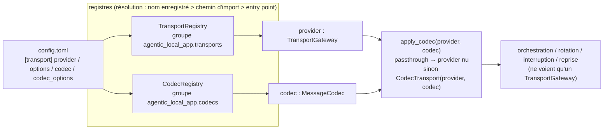

# `agentic_local_app.transport` — le seul paquet qui parle au modèle

Deux axes d'extension, tous deux choisis dans `config.toml` et résolus par un registre : le **provider** (`transport.provider`, le dialecte HTTP d'une API — ADR-020) et le **codec** (`transport.codec`, la forme des messages d'un modèle — ADR-021). Le reste de l'application ne connaît que le contrat abstrait `TransportGateway`.

## Carte des modules

| Module | Contenu | Étendre ? |
|---|---|---|
| `base.py` | `TransportGateway` (ABC : `init_conversation`, `post_message`, `get_messages`, `wait_for_reply`, `close_conversation`, `abandon`), `PostAck`, `GetResult`, `InFlightGuard`, `OP_*`, `validate_options` | non : c'est le contrat |
| `http_base.py` | `HttpProviderBase` (template method httpx : client, timeouts, gzip, polling borné, table HTTP → `ErrorType`, estampillage des erreurs), `HttpCall`, `InvalidResponseError` | **dériver** pour un provider HTTP |
| `registry.py` | `PluginRegistry[P]` (générique), `TransportRegistry`, `PluginInfo` ; codes `TRANSPORT_PROVIDER_UNKNOWN` / `_INVALID`, `TRANSPORT_OPTIONS_INVALID` | non |
| `providers/generic_http.py` | `GenericHttpProvider` = contrat ADR-004 (`HttpTransportGateway` est le même objet de classe) | référence à lire |
| `providers/templated_http.py` | `TemplatedHttpProvider` : n'importe quelle API JSON décrite par `[transport.options]` (gabarits, `${env:VAR}`, chemins de réponse) ; `extract_path` / `parse_path` réutilisables | par configuration |
| `fake.py` | `FakeTransportGateway` / `FakeTransportProvider` (`fake`) : le double scripté, sans réseau | pour les tests |
| `gateway.py` | façade de compatibilité (réexporte les noms historiques) | non |
| `codecs/base.py` | `MessageCodec` (ABC : `decode_inbound`, `encode_outbound`, `options_model`, `name`, `error()`), `CodecError` (`MODEL_PROTOCOL_ERROR / UNPARSEABLE_REPLY`), `excerpt_of` | **dériver** pour un codec |
| `codecs/registry.py` | `CodecRegistry` ; codes `CODEC_UNKNOWN` / `CODEC_INVALID` / `CODEC_OPTIONS_INVALID` | non |
| `codecs/decorator.py` | `CodecTransport`, `apply_codec` : le codec appliqué autour de n'importe quel provider | non |
| `codecs/passthrough.py`, `codecs/json_text.py`, `codecs/tool_call.py` | les codecs intégrés ; `json_text` expose les briques réutilisables (`strip_code_fence`, `extract_first_json`, `parse_strict`, `envelopes_of`, `complete_envelope`, `encode_payload`) | référence à lire |

## Ajouter une implémentation sans toucher au paquet

Un provider est une classe concrète de `TransportGateway` (le plus souvent de `HttpProviderBase`), construite par `cls(config.transport, clock, **kwargs)`, avec un `options_model` pydantic facultatif ; un codec est une classe concrète de `MessageCodec`, construite par `cls(options)`. L'un et l'autre se sélectionnent par **chemin d'import** (`"paquet.module:Classe"`), par **entry point** de leur groupe, ou — pour une implémentation intégrée — par le décorateur `@TransportRegistry.register("nom")` / `@CodecRegistry.register("nom")` et un import dans le `__init__` du paquet. Un exemple complet des deux, hors du dépôt, est dans [`examples/acme_model_plugin/`](../../../examples/acme_model_plugin/).

Guides pas à pas : [brancher un modèle par configuration](../../../docs/guides/02-brancher-un-modele.md) · [écrire un provider](../../../docs/guides/03-ecrire-un-provider.md) · [écrire un codec](../../../docs/guides/04-ecrire-un-codec.md). Décisions : [ADR-004](../../../docs/adr/ADR-004-contrat-de-transport.md), [ADR-020](../../../docs/adr/ADR-020-transport-enfichable.md), [ADR-021](../../../docs/adr/ADR-021-codec-de-messages-par-modele.md). Conception : [architecture/05](../../../docs/architecture/05-transport-and-failures.md).

## Invariants que toute implémentation respecte

- Jamais de `time.*` ni d'`asyncio.sleep` direct : l'horloge (`clock`) et l'attente (`sleep`) sont injectées (ADR-017) ; les tests n'attendent jamais pour de vrai.
- `abandon()` annule les appels en cours, qui lèvent `TransportError(INTERRUPTED, "ABANDONED")` (§2.9).
- `wait_for_reply` rend au moins un message ou `TIMEOUT_ERROR / MODEL_GET_TIMEOUT` après `reply_timeout_ms`.
- Tout échec est une `TransportError` classée (`error_type`, `error_code`, `retryable`) dont les `details` portent `operation` et, pour HTTP, `http_status` et une `url` sans secret ; une réponse illisible par un codec est `UNPARSEABLE_REPLY` avec `codec`, `index`, `excerpt`, `reason`.
- Aucun secret n'est stocké ni journalisé : variables d'environnement lues à l'appel, options masquées par `AppConfig.masked()`.

Tests : `tests/unit/test_phase7_transport.py` (contrat ADR-004), `test_phase7_providers.py` (base, registre, `templated_http`, équivalence avec le serveur mock), `test_phase7_codecs.py` (codecs, décorateur, registre), `test_phase7_examples_plugin.py` (l'exemple hors dépôt), `tests/integration/test_phase9_*` (boucle complète, y compris à travers un codec).
